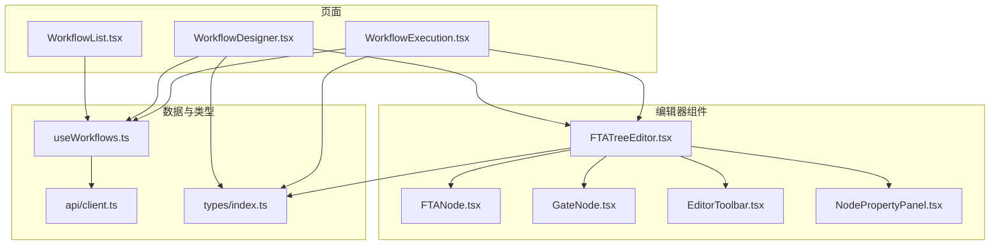
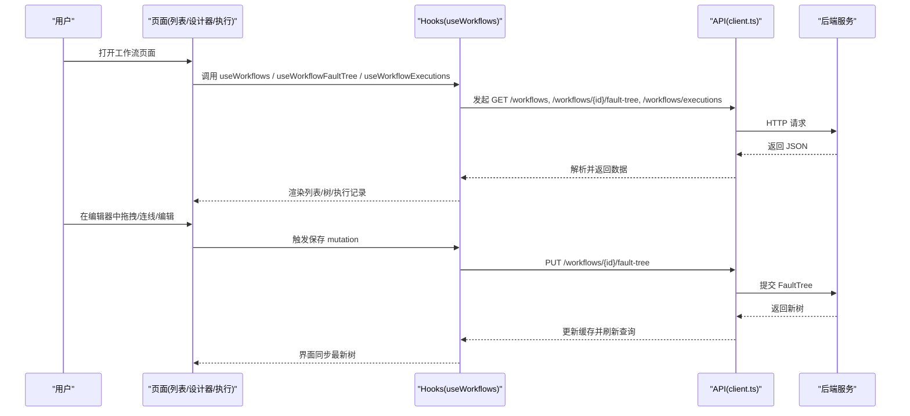
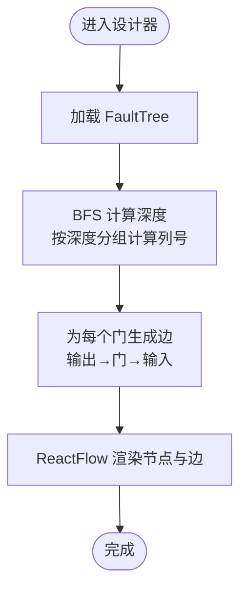
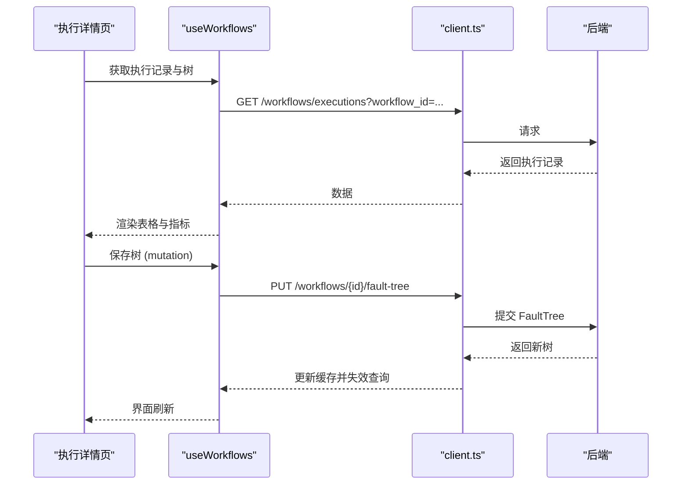
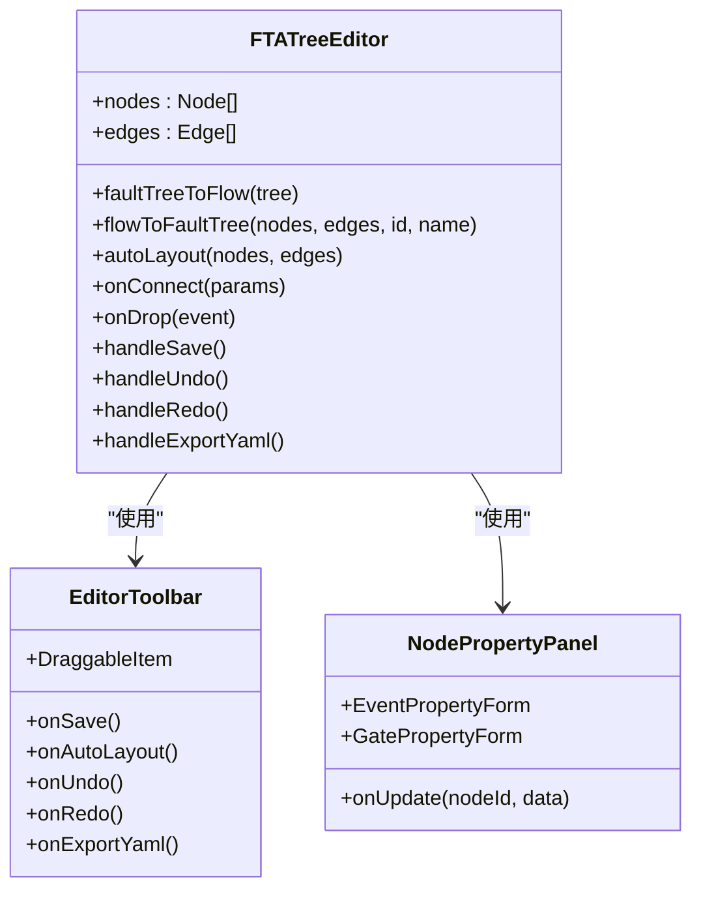
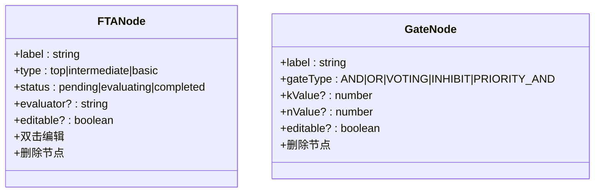
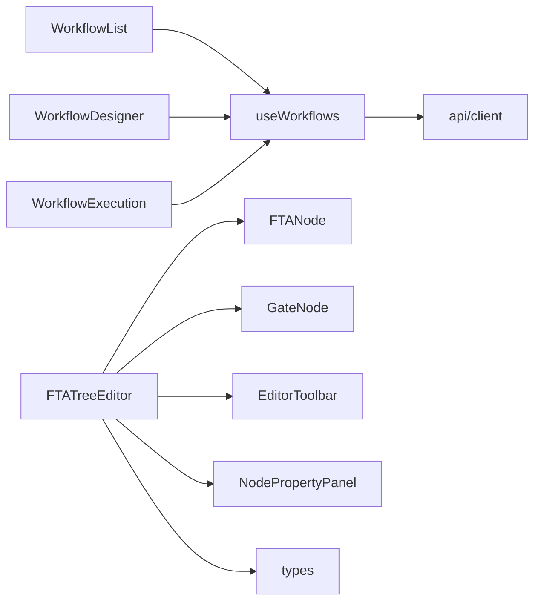

# 工作流管理页面

<cite>
**本文引用的文件**
- [web/src/pages/Workflows/WorkflowList.tsx](file://web/src/pages/Workflows/WorkflowList.tsx)
- [web/src/pages/Workflows/WorkflowDesigner.tsx](file://web/src/pages/Workflows/WorkflowDesigner.tsx)
- [web/src/pages/Workflows/WorkflowExecution.tsx](file://web/src/pages/Workflows/WorkflowExecution.tsx)
- [web/src/hooks/useWorkflows.ts](file://web/src/hooks/useWorkflows.ts)
- [web/src/components/TreeEditor/FTATreeEditor.tsx](file://web/src/components/TreeEditor/FTATreeEditor.tsx)
- [web/src/components/TreeEditor/FTANode.tsx](file://web/src/components/TreeEditor/FTANode.tsx)
- [web/src/components/TreeEditor/GateNode.tsx](file://web/src/components/TreeEditor/GateNode.tsx)
- [web/src/components/TreeEditor/EditorToolbar.tsx](file://web/src/components/TreeEditor/EditorToolbar.tsx)
- [web/src/components/TreeEditor/NodePropertyPanel.tsx](file://web/src/components/TreeEditor/NodePropertyPanel.tsx)
- [web/src/api/client.ts](file://web/src/api/client.ts)
- [web/src/types/index.ts](file://web/src/types/index.ts)
</cite>

## 目录
1. [简介](#简介)
2. [项目结构](#项目结构)
3. [核心组件](#核心组件)
4. [架构总览](#架构总览)
5. [详细组件分析](#详细组件分析)
6. [依赖关系分析](#依赖关系分析)
7. [性能考量](#性能考量)
8. [故障排查指南](#故障排查指南)
9. [结论](#结论)
10. [附录](#附录)

## 简介
本技术文档围绕工作流管理的前端实现，覆盖三大页面：工作流列表页、可视化设计器页面和执行监控页。重点阐述：
- 工作流可视化设计与编辑：节点拖拽、连接线绘制、自动布局与撤销重做、属性面板编辑、YAML导出。
- 执行监控与结果展示：执行记录聚合统计、状态映射、耗时格式化、空态与加载态处理。
- 模板管理与版本控制：通过保存故障树（Fault Tree）到后端进行版本化存储；前端提供撤销/重做历史栈以支持本地版本回溯。
- 权限控制：当前前端未内置鉴权逻辑，由后端接口负责；如需前端拦截，可在请求层或路由层扩展。

## 项目结构
工作流相关的前端代码集中在 web/src 下，采用“页面 + 组件 + hooks + api”的分层组织方式：
- 页面层：Workflows 目录下的三个页面分别承担列表、设计器、执行详情职责。
- 组件层：TreeEditor 子目录封装了可视化编辑器、节点类型、工具栏和属性面板。
- Hooks 层：useWorkflows 统一封装数据获取与缓存更新。
- API 层：client.ts 集中定义工作流相关的 REST 调用。
- 类型层：types/index.ts 定义了 FaultTree、事件、门等数据结构。

图表来源
- [web/src/pages/Workflows/WorkflowList.tsx:1-171](file://web/src/pages/Workflows/WorkflowList.tsx#L1-L171)
- [web/src/pages/Workflows/WorkflowDesigner.tsx:1-208](file://web/src/pages/Workflows/WorkflowDesigner.tsx#L1-L208)
- [web/src/pages/Workflows/WorkflowExecution.tsx:1-170](file://web/src/pages/Workflows/WorkflowExecution.tsx#L1-L170)
- [web/src/components/TreeEditor/FTATreeEditor.tsx:1-591](file://web/src/components/TreeEditor/FTATreeEditor.tsx#L1-L591)
- [web/src/components/TreeEditor/FTANode.tsx:1-134](file://web/src/components/TreeEditor/FTANode.tsx#L1-L134)
- [web/src/components/TreeEditor/GateNode.tsx:1-80](file://web/src/components/TreeEditor/GateNode.tsx#L1-L80)
- [web/src/components/TreeEditor/EditorToolbar.tsx:1-193](file://web/src/components/TreeEditor/EditorToolbar.tsx#L1-L193)
- [web/src/components/TreeEditor/NodePropertyPanel.tsx:1-304](file://web/src/components/TreeEditor/NodePropertyPanel.tsx#L1-L304)
- [web/src/hooks/useWorkflows.ts:1-46](file://web/src/hooks/useWorkflows.ts#L1-L46)
- [web/src/api/client.ts:92-128](file://web/src/api/client.ts#L92-L128)
- [web/src/types/index.ts:82-110](file://web/src/types/index.ts#L82-L110)

章节来源
- [web/src/pages/Workflows/WorkflowList.tsx:1-171](file://web/src/pages/Workflows/WorkflowList.tsx#L1-L171)
- [web/src/pages/Workflows/WorkflowDesigner.tsx:1-208](file://web/src/pages/Workflows/WorkflowDesigner.tsx#L1-L208)
- [web/src/pages/Workflows/WorkflowExecution.tsx:1-170](file://web/src/pages/Workflows/WorkflowExecution.tsx#L1-L170)
- [web/src/hooks/useWorkflows.ts:1-46](file://web/src/hooks/useWorkflows.ts#L1-L46)
- [web/src/components/TreeEditor/FTATreeEditor.tsx:1-591](file://web/src/components/TreeEditor/FTATreeEditor.tsx#L1-L591)
- [web/src/components/TreeEditor/FTANode.tsx:1-134](file://web/src/components/TreeEditor/FTANode.tsx#L1-L134)
- [web/src/components/TreeEditor/GateNode.tsx:1-80](file://web/src/components/TreeEditor/GateNode.tsx#L1-L80)
- [web/src/components/TreeEditor/EditorToolbar.tsx:1-193](file://web/src/components/TreeEditor/EditorToolbar.tsx#L1-L193)
- [web/src/components/TreeEditor/NodePropertyPanel.tsx:1-304](file://web/src/components/TreeEditor/NodePropertyPanel.tsx#L1-L304)
- [web/src/api/client.ts:92-128](file://web/src/api/client.ts#L92-L128)
- [web/src/types/index.ts:82-110](file://web/src/types/index.ts#L82-L110)

## 核心组件
- 工作流列表页：展示工作流清单、状态、节点数、执行次数、最后执行时间；提供跳转至设计器的入口。
- 工作流设计器：基于 React Flow 的可视化画布，支持从工具栏拖拽添加事件/门节点、连线、自动布局、撤销/重做、属性编辑、YAML 导出。
- 执行详情页：分标签页展示 FTA 树编辑器与执行记录；汇总成功率、平均耗时等指标；支持保存树结构。
- 编辑器核心：FTATreeEditor 负责状态管理、转换函数（树↔图）、连接校验、拖拽创建、属性面板联动。
- 节点组件：FTANode（事件节点）、GateNode（逻辑门节点），支持删除、双击编辑名称、状态样式。
- 工具栏与属性面板：EditorToolbar 提供拖拽项与操作按钮；NodePropertyPanel 提供事件/门的属性编辑表单。
- 数据层：useWorkflows 封装查询与变更；api/client.ts 暴露工作流相关 REST 方法；types/index.ts 定义数据结构。

章节来源
- [web/src/pages/Workflows/WorkflowList.tsx:1-171](file://web/src/pages/Workflows/WorkflowList.tsx#L1-L171)
- [web/src/pages/Workflows/WorkflowDesigner.tsx:1-208](file://web/src/pages/Workflows/WorkflowDesigner.tsx#L1-L208)
- [web/src/pages/Workflows/WorkflowExecution.tsx:1-170](file://web/src/pages/Workflows/WorkflowExecution.tsx#L1-L170)
- [web/src/components/TreeEditor/FTATreeEditor.tsx:1-591](file://web/src/components/TreeEditor/FTATreeEditor.tsx#L1-L591)
- [web/src/components/TreeEditor/FTANode.tsx:1-134](file://web/src/components/TreeEditor/FTANode.tsx#L1-L134)
- [web/src/components/TreeEditor/GateNode.tsx:1-80](file://web/src/components/TreeEditor/GateNode.tsx#L1-L80)
- [web/src/components/TreeEditor/EditorToolbar.tsx:1-193](file://web/src/components/TreeEditor/EditorToolbar.tsx#L1-L193)
- [web/src/components/TreeEditor/NodePropertyPanel.tsx:1-304](file://web/src/components/TreeEditor/NodePropertyPanel.tsx#L1-L304)
- [web/src/hooks/useWorkflows.ts:1-46](file://web/src/hooks/useWorkflows.ts#L1-L46)
- [web/src/api/client.ts:92-128](file://web/src/api/client.ts#L92-L128)
- [web/src/types/index.ts:82-110](file://web/src/types/index.ts#L82-L110)

## 架构总览
工作流管理的前端采用“页面-组件-Hooks-API-类型”的分层架构，结合 React Flow 完成可视化编辑，使用 @tanstack/react-query 进行数据缓存与更新。

图表来源
- [web/src/hooks/useWorkflows.ts:1-46](file://web/src/hooks/useWorkflows.ts#L1-L46)
- [web/src/api/client.ts:92-128](file://web/src/api/client.ts#L92-L128)
- [web/src/pages/Workflows/WorkflowExecution.tsx:70-92](file://web/src/pages/Workflows/WorkflowExecution.tsx#L70-L92)

## 详细组件分析

### 工作流列表页（WorkflowList）
- 功能要点
  - 展示工作流基本信息：名称、描述、状态、节点数、执行次数、最后执行时间。
  - 状态映射：运行中/草稿/已归档，使用统一的状态徽章组件。
  - 交互：点击名称跳转到执行详情页；提供“设计工作流”入口。
  - 空态：无数据时显示引导卡片，提示创建故障分析树。
- 数据来源：useWorkflows 获取工作流详情列表。
- 路由与导航：使用 react-router-dom 的 Link 进行页面跳转。

章节来源
- [web/src/pages/Workflows/WorkflowList.tsx:1-171](file://web/src/pages/Workflows/WorkflowList.tsx#L1-L171)
- [web/src/hooks/useWorkflows.ts:5-10](file://web/src/hooks/useWorkflows.ts#L5-L10)

### 工作流设计器（WorkflowDesigner）
- 功能要点
  - 选择工作流：顶部下拉框切换不同工作流，URL 参数 id 驱动数据加载。
  - 可视化渲染：将 FaultTree 转换为 React Flow 的 nodes/edges，使用 BFS 计算层级并按列居中布局。
  - 只读模式：当前设计器为查看模式，节点不可编辑（editable=false）。
  - 加载与空态：加载中显示骨架屏；无树数据时显示占位提示。
- 关键算法
  - buildFlowData：根据 gates 的输入输出关系构建节点与边，按深度分组计算水平位置。
- 数据流：useWorkflowFaultTree 获取指定工作流的 FaultTree。

图表来源
- [web/src/pages/Workflows/WorkflowDesigner.tsx:20-127](file://web/src/pages/Workflows/WorkflowDesigner.tsx#L20-L127)
- [web/src/pages/Workflows/WorkflowDesigner.tsx:129-208](file://web/src/pages/Workflows/WorkflowDesigner.tsx#L129-L208)

章节来源
- [web/src/pages/Workflows/WorkflowDesigner.tsx:1-208](file://web/src/pages/Workflows/WorkflowDesigner.tsx#L1-L208)
- [web/src/hooks/useWorkflows.ts:20-26](file://web/src/hooks/useWorkflows.ts#L20-L26)

### 执行详情页（WorkflowExecution）
- 功能要点
  - 双标签页：FTA 树编辑器（可编辑）与执行记录（只读）。
  - 指标卡：总执行次数、成功率、平均耗时。
  - 执行记录表：ID、工作流名、状态、触发源、根因、评估节点数、耗时、开始时间。
  - 保存树：通过 useSaveFaultTree 将编辑器中的 FaultTree 提交到后端，成功后刷新缓存。
- 数据流：
  - useWorkflowExecutions 拉取执行记录。
  - useWorkflowFaultTree 拉取树结构。
  - useSaveFaultTree 提交修改并更新缓存。

图表来源
- [web/src/pages/Workflows/WorkflowExecution.tsx:70-92](file://web/src/pages/Workflows/WorkflowExecution.tsx#L70-L92)
- [web/src/hooks/useWorkflows.ts:28-45](file://web/src/hooks/useWorkflows.ts#L28-L45)
- [web/src/api/client.ts:113-128](file://web/src/api/client.ts#L113-L128)

章节来源
- [web/src/pages/Workflows/WorkflowExecution.tsx:1-170](file://web/src/pages/Workflows/WorkflowExecution.tsx#L1-L170)
- [web/src/hooks/useWorkflows.ts:28-45](file://web/src/hooks/useWorkflows.ts#L28-L45)

### 可视化编辑器（FTATreeEditor）
- 核心能力
  - 双向转换：faultTreeToFlow 将 FaultTree 转为 React Flow 节点/边；flowToFaultTree 反向转换。
  - 自动布局：autoLayout 基于 BFS 计算层级与列号，支持一键对齐。
  - 撤销/重做：内部维护 past/future 快照栈，限制最大历史长度。
  - 拖拽创建：EditorToolbar 提供事件/门节点，拖入画布生成新节点。
  - 连接校验：isValidConnection 仅允许事件与门之间连接（source.type !== target.type）。
  - 属性面板：NodePropertyPanel 支持事件类型、评估器、描述与门类型、表决参数等编辑。
  - YAML 导出：faultTreeToYaml 生成可读的 YAML 文本并下载。
- 数据绑定：使用 useNodesState/useEdgesState 管理节点与边；onConnect/onDrop/onNodeClick 等回调驱动状态变化。
- 错误与边界：空树、无根节点、孤立节点均被考虑；自动布局会包含未访问节点。

图表来源
- [web/src/components/TreeEditor/FTATreeEditor.tsx:77-246](file://web/src/components/TreeEditor/FTATreeEditor.tsx#L77-L246)
- [web/src/components/TreeEditor/FTATreeEditor.tsx:282-338](file://web/src/components/TreeEditor/FTATreeEditor.tsx#L282-L338)
- [web/src/components/TreeEditor/FTATreeEditor.tsx:356-591](file://web/src/components/TreeEditor/FTATreeEditor.tsx#L356-L591)
- [web/src/components/TreeEditor/EditorToolbar.tsx:21-96](file://web/src/components/TreeEditor/EditorToolbar.tsx#L21-L96)
- [web/src/components/TreeEditor/EditorToolbar.tsx:100-193](file://web/src/components/TreeEditor/EditorToolbar.tsx#L100-L193)
- [web/src/components/TreeEditor/NodePropertyPanel.tsx:71-183](file://web/src/components/TreeEditor/NodePropertyPanel.tsx#L71-L183)
- [web/src/components/TreeEditor/NodePropertyPanel.tsx:187-267](file://web/src/components/TreeEditor/NodePropertyPanel.tsx#L187-L267)
- [web/src/components/TreeEditor/NodePropertyPanel.tsx:271-304](file://web/src/components/TreeEditor/NodePropertyPanel.tsx#L271-L304)

章节来源
- [web/src/components/TreeEditor/FTATreeEditor.tsx:1-591](file://web/src/components/TreeEditor/FTATreeEditor.tsx#L1-L591)
- [web/src/components/TreeEditor/EditorToolbar.tsx:1-193](file://web/src/components/TreeEditor/EditorToolbar.tsx#L1-L193)
- [web/src/components/TreeEditor/NodePropertyPanel.tsx:1-304](file://web/src/components/TreeEditor/NodePropertyPanel.tsx#L1-L304)

### 节点组件（FTANode、GateNode）
- FTANode
  - 支持双击编辑名称、删除节点、状态样式（pending/evaluating/completed）。
  - 通过 React Flow 的 Handle 提供上下连接点。
- GateNode
  - 支持删除节点，显示门符号与类型，VOTING 门显示 k/n 参数。
  - 通过 Handle 提供上下连接点。

图表来源
- [web/src/components/TreeEditor/FTANode.tsx:6-134](file://web/src/components/TreeEditor/FTANode.tsx#L6-L134)
- [web/src/components/TreeEditor/GateNode.tsx:6-80](file://web/src/components/TreeEditor/GateNode.tsx#L6-L80)

章节来源
- [web/src/components/TreeEditor/FTANode.tsx:1-134](file://web/src/components/TreeEditor/FTANode.tsx#L1-L134)
- [web/src/components/TreeEditor/GateNode.tsx:1-80](file://web/src/components/TreeEditor/GateNode.tsx#L1-L80)

### 数据与类型
- 类型定义
  - FaultTree：包含 id、name、top_event_id、events、gates。
  - FTAEvent：事件节点，含 type、evaluator、parameters 等。
  - FTAGate：逻辑门，含 type、input_ids、output_id、k_value。
- API 客户端
  - listWorkflowDetails/getWorkflow/getWorkflowFaultTree/updateWorkflowFaultTree/createWorkflowFaultTree/listWorkflowExecutions。
- Hooks
  - useWorkflows/useWorkflow/useWorkflowFaultTree/useWorkflowExecutions/useSaveFaultTree。

章节来源
- [web/src/types/index.ts:82-110](file://web/src/types/index.ts#L82-L110)
- [web/src/api/client.ts:92-128](file://web/src/api/client.ts#L92-L128)
- [web/src/hooks/useWorkflows.ts:1-46](file://web/src/hooks/useWorkflows.ts#L1-L46)

## 依赖关系分析
- 页面依赖 Hooks：列表/设计器/执行页均通过 useWorkflows 获取数据。
- 编辑器依赖 React Flow：FTATreeEditor 使用 React Flow 提供的节点/边状态与事件。
- 编辑器依赖节点组件：FTANode/GateNode 作为自定义节点类型注册到 React Flow。
- 编辑器依赖工具栏与属性面板：EditorToolbar 提供拖拽与操作；NodePropertyPanel 提供属性编辑。
- 数据层依赖 API：所有网络请求集中在 client.ts，便于统一错误处理与 Mock。
- 类型约束：所有数据结构遵循 types/index.ts 定义，保证前后端契约一致。

图表来源
- [web/src/pages/Workflows/WorkflowList.tsx:1-171](file://web/src/pages/Workflows/WorkflowList.tsx#L1-L171)
- [web/src/pages/Workflows/WorkflowDesigner.tsx:1-208](file://web/src/pages/Workflows/WorkflowDesigner.tsx#L1-L208)
- [web/src/pages/Workflows/WorkflowExecution.tsx:1-170](file://web/src/pages/Workflows/WorkflowExecution.tsx#L1-L170)
- [web/src/components/TreeEditor/FTATreeEditor.tsx:1-591](file://web/src/components/TreeEditor/FTATreeEditor.tsx#L1-L591)
- [web/src/hooks/useWorkflows.ts:1-46](file://web/src/hooks/useWorkflows.ts#L1-L46)
- [web/src/api/client.ts:92-128](file://web/src/api/client.ts#L92-L128)
- [web/src/types/index.ts:82-110](file://web/src/types/index.ts#L82-L110)

章节来源
- [web/src/pages/Workflows/WorkflowList.tsx:1-171](file://web/src/pages/Workflows/WorkflowList.tsx#L1-L171)
- [web/src/pages/Workflows/WorkflowDesigner.tsx:1-208](file://web/src/pages/Workflows/WorkflowDesigner.tsx#L1-L208)
- [web/src/pages/Workflows/WorkflowExecution.tsx:1-170](file://web/src/pages/Workflows/WorkflowExecution.tsx#L1-L170)
- [web/src/components/TreeEditor/FTATreeEditor.tsx:1-591](file://web/src/components/TreeEditor/FTATreeEditor.tsx#L1-L591)
- [web/src/hooks/useWorkflows.ts:1-46](file://web/src/hooks/useWorkflows.ts#L1-L46)
- [web/src/api/client.ts:92-128](file://web/src/api/client.ts#L92-L128)
- [web/src/types/index.ts:82-110](file://web/src/types/index.ts#L82-L110)

## 性能考量
- 数据缓存与失效：使用 @tanstack/react-query 的 queryKey 与 invalidateQueries，确保保存后及时刷新视图。
- 布局计算复杂度：BFS 遍历事件与门，时间复杂度 O(V+E)，适合中等规模树；若树过大，可考虑虚拟滚动或分页加载。
- 撤销/重做历史：限制历史栈大小（如 30 条），避免内存占用过高。
- 渲染优化：节点组件使用 memo 包裹，减少不必要的重渲染；默认边选项集中配置，降低重复开销。
- 网络请求：健康检查与后端可用性缓存，减少频繁探测带来的开销。

[本节为通用性能建议，不直接分析具体文件]

## 故障排查指南
- 无法加载工作流列表
  - 检查 useWorkflows 是否成功调用 listWorkflowDetails。
  - 确认后端 /workflows?detail=true 接口可用。
- 设计器无树数据
  - 检查 URL 参数 id 是否正确传递。
  - 确认 useWorkflowFaultTree 调用 getWorkflowFaultTree 成功。
- 保存失败
  - 检查 updateWorkflowFaultTree 的请求体是否符合 FaultTree 类型。
  - 查看网络响应与错误信息，确认后端接受 PUT 请求。
- 连接无效
  - 确认 isValidConnection 规则：仅允许事件与门之间连接。
  - 检查节点类型与数据字段是否完整。
- 执行记录为空
  - 确认 workflowId 是否正确传入 listWorkflowExecutions。
  - 检查后端是否返回 executions 数组。

章节来源
- [web/src/hooks/useWorkflows.ts:5-45](file://web/src/hooks/useWorkflows.ts#L5-L45)
- [web/src/api/client.ts:107-128](file://web/src/api/client.ts#L107-L128)
- [web/src/components/TreeEditor/FTATreeEditor.tsx:397-406](file://web/src/components/TreeEditor/FTATreeEditor.tsx#L397-L406)

## 结论
工作流管理页面通过清晰的层次结构与组件拆分，实现了从列表浏览、可视化设计到执行监控的完整闭环。编辑器具备强大的拖拽、连线、自动布局、撤销重做与属性编辑能力，并通过统一的类型与 API 层保障前后端一致性。建议在后续迭代中增强权限控制、版本对比与协作编辑能力，进一步提升用户体验与工程效率。

[本节为总结性内容，不直接分析具体文件]

## 附录
- 最佳实践
  - 在设计器中优先使用自动布局整理复杂树结构。
  - 为事件节点设置合适的评估器（Skill/RAG/LLM/Static/Context），便于执行阶段自动化决策。
  - 保存前利用导出 YAML 功能备份树结构，便于版本管理与回滚。
  - 在执行页关注成功率与平均耗时，识别瓶颈与异常。
- 用户体验优化
  - 提供空态与加载态友好提示，减少用户困惑。
  - 对关键操作（保存、删除）增加二次确认，防止误操作。
  - 在属性面板中提供字段校验与即时反馈，提升编辑效率。
  - 保持键盘快捷键（如 Delete 删除、Enter 确认）的一致性。

[本节为通用指导，不直接分析具体文件]