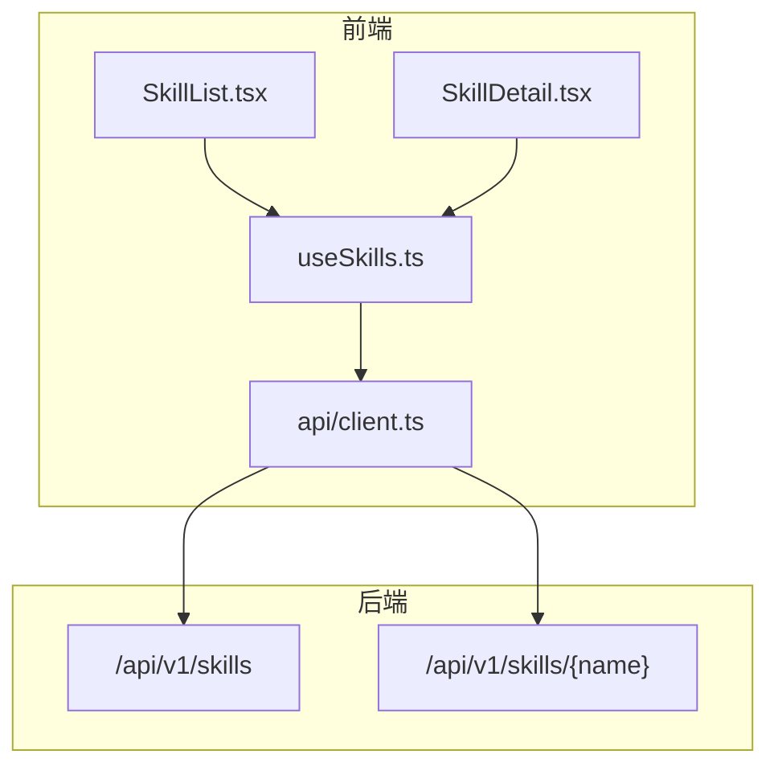
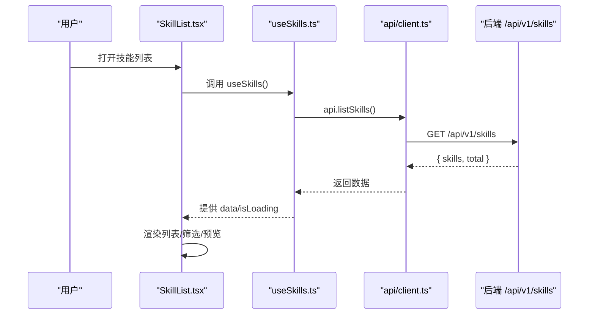
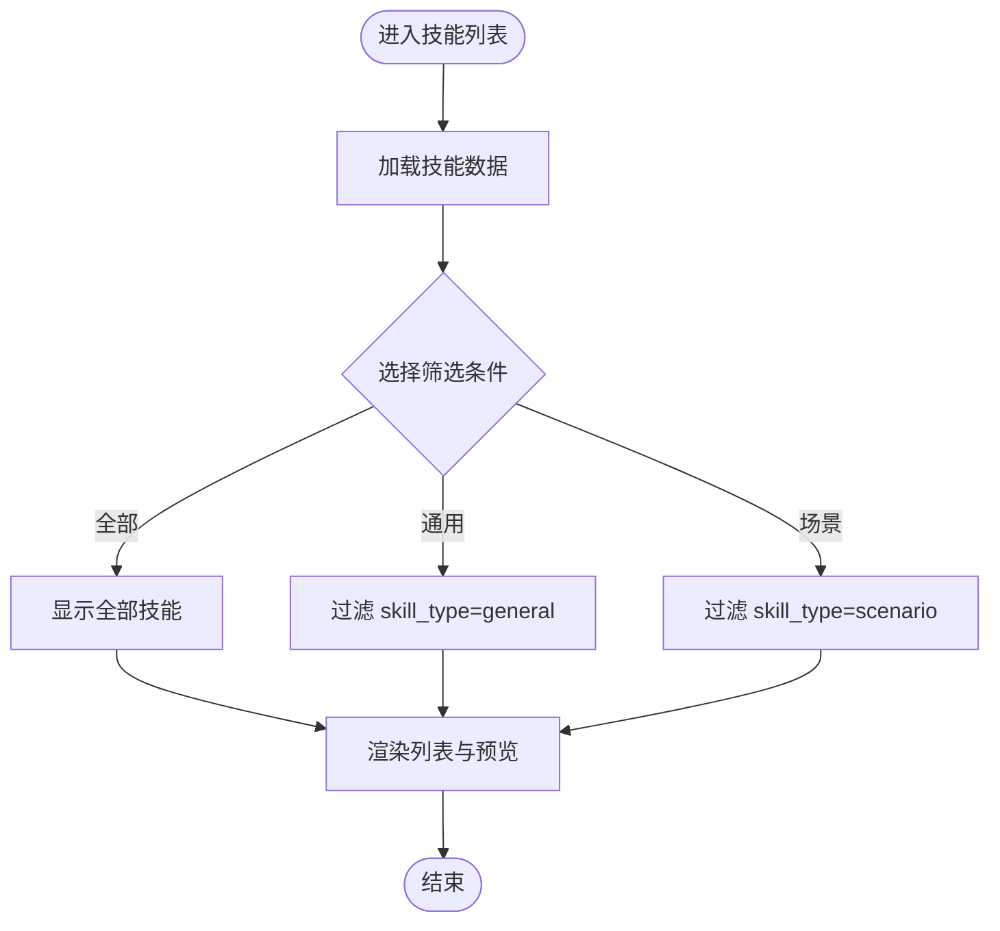
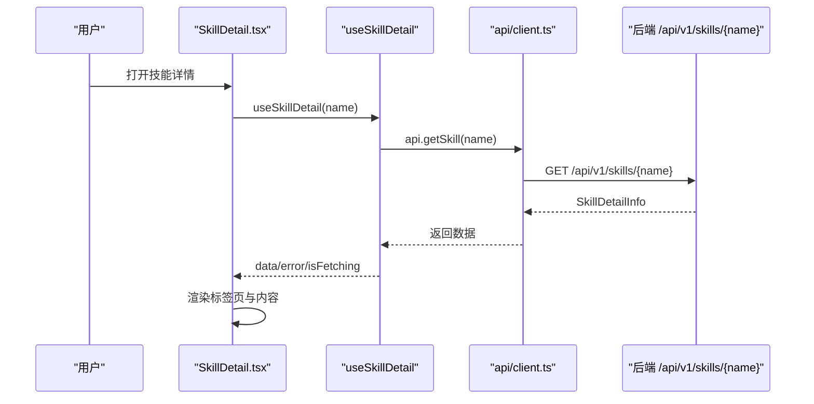
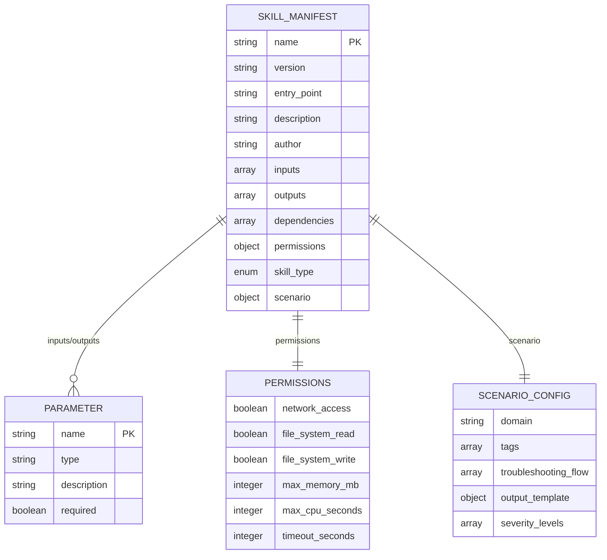
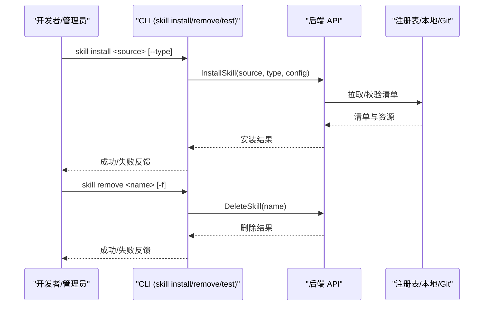
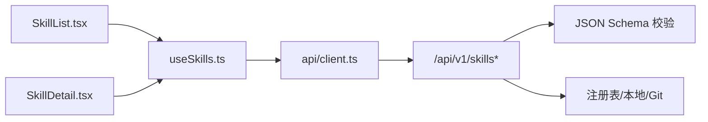

# 技能管理页面

<cite>
**本文引用的文件**
- [web/src/pages/Skills/SkillList.tsx](file://web/src/pages/Skills/SkillList.tsx)
- [web/src/pages/Skills/SkillDetail.tsx](file://web/src/pages/Skills/SkillDetail.tsx)
- [web/src/hooks/useSkills.ts](file://web/src/hooks/useSkills.ts)
- [web/src/api/client.ts](file://web/src/api/client.ts)
- [web/src/types/index.ts](file://web/src/types/index.ts)
- [api/jsonschema/skill-manifest.schema.json](file://api/jsonschema/skill-manifest.schema.json)
- [skills/registry.yaml](file://skills/registry.yaml)
- [internal/cli/skill/install.go](file://internal/cli/skill/install.go)
- [internal/cli/skill/remove.go](file://internal/cli/skill/remove.go)
- [skills/examples/hello-world/manifest.yaml](file://skills/examples/hello-world/manifest.yaml)
- [skills/examples/ticket-handler/manifest.yaml](file://skills/examples/ticket-handler/manifest.yaml)
</cite>

## 目录
1. [简介](#简介)
2. [项目结构](#项目结构)
3. [核心组件](#核心组件)
4. [架构总览](#架构总览)
5. [详细组件分析](#详细组件分析)
6. [依赖关系分析](#依赖关系分析)
7. [性能与可用性](#性能与可用性)
8. [故障排查指南](#故障排查指南)
9. [结论](#结论)
10. [附录](#附录)

## 简介
本技术文档围绕“技能管理页面”展开，覆盖技能列表页与技能详情页的设计模式、实现细节与数据流。重点说明：
- 技能的安装、卸载、测试与配置管理的前端交互路径（通过 CLI 调用后端 API）。
- 技能清单的数据结构、版本管理与依赖关系处理（基于 JSON Schema 与示例 manifest）。
- 搜索过滤、分类展示与状态管理的 UI 设计。
- 面向技能开发者的使用指南与管理员操作流程。

## 项目结构
前端技能管理由两个主要页面组成：
- 技能列表页：负责展示已安装技能、分类筛选、预览详情。
- 技能详情页：展示技能元信息、输入输出、权限、场景化排查流程等。

数据获取通过 React Query 封装的 hooks 调用统一 API 客户端，最终请求后端 /api/v1/skills 相关接口。

图表来源
- [web/src/pages/Skills/SkillList.tsx:111-129](file://web/src/pages/Skills/SkillList.tsx#L111-L129)
- [web/src/pages/Skills/SkillDetail.tsx:21-30](file://web/src/pages/Skills/SkillDetail.tsx#L21-L30)
- [web/src/hooks/useSkills.ts:4-17](file://web/src/hooks/useSkills.ts#L4-L17)
- [web/src/api/client.ts:105-106](file://web/src/api/client.ts#L105-L106)

章节来源
- [web/src/pages/Skills/SkillList.tsx:111-129](file://web/src/pages/Skills/SkillList.tsx#L111-L129)
- [web/src/pages/Skills/SkillDetail.tsx:21-30](file://web/src/pages/Skills/SkillDetail.tsx#L21-L30)
- [web/src/hooks/useSkills.ts:4-17](file://web/src/hooks/useSkills.ts#L4-L17)
- [web/src/api/client.ts:105-106](file://web/src/api/client.ts#L105-L106)

## 核心组件
- 技能列表页（SkillList）
  - 功能：加载技能列表、按类型筛选（全部/通用/场景）、选中项右侧预览、导航至详情页。
  - 状态：本地 filter 状态、selectedSkill 状态；数据来自 useSkills。
  - 展示：图标映射、显示名称映射、引用 Agent 数量、状态徽章。
- 技能详情页（SkillDetail）
  - 功能：展示技能基本信息、场景化排查流程、输入输出参数、权限配置。
  - 状态：React Query 的 loading/error/fetching 状态；根据 skill_type 渲染不同 Tab。
  - 交互：重试加载、返回列表。
- 数据层（useSkills + api/client）
  - 使用 @tanstack/react-query 缓存与自动刷新。
  - 提供 listSkills 与 getSkill 两个方法，对应后端 /skills 与 /skills/{name}。

章节来源
- [web/src/pages/Skills/SkillList.tsx:111-349](file://web/src/pages/Skills/SkillList.tsx#L111-L349)
- [web/src/pages/Skills/SkillDetail.tsx:21-349](file://web/src/pages/Skills/SkillDetail.tsx#L21-L349)
- [web/src/hooks/useSkills.ts:4-17](file://web/src/hooks/useSkills.ts#L4-L17)
- [web/src/api/client.ts:105-106](file://web/src/api/client.ts#L105-L106)

## 架构总览
前端采用“页面组件 + Hook + API 客户端”的分层结构：
- 页面组件负责 UI 与用户交互。
- Hook 封装查询逻辑与缓存策略。
- API 客户端集中定义所有 HTTP 请求，并内置健康检查与降级机制。

图表来源
- [web/src/pages/Skills/SkillList.tsx:111-129](file://web/src/pages/Skills/SkillList.tsx#L111-L129)
- [web/src/hooks/useSkills.ts:4-9](file://web/src/hooks/useSkills.ts#L4-L9)
- [web/src/api/client.ts:105-106](file://web/src/api/client.ts#L105-L106)

## 详细组件分析

### 技能列表页（SkillList）
- 数据源：useSkills 返回 skills 数组，包含 name、version、description、skill_type、domain、tags 等字段。
- 筛选逻辑：filterTabs 支持 all/general/scenario，按 skill_type 过滤。
- 展示增强：
  - 图标映射与显示名称映射，提升可读性。
  - 引用 Agent 数量（本地映射），用于展示技能被哪些 Agent 引用。
  - 状态徽章统一为“就绪”。
- 交互：点击条目切换选中状态，右侧卡片展示简要信息与跳转链接。

图表来源
- [web/src/pages/Skills/SkillList.tsx:111-207](file://web/src/pages/Skills/SkillList.tsx#L111-L207)
- [web/src/pages/Skills/SkillList.tsx:227-349](file://web/src/pages/Skills/SkillList.tsx#L227-L349)

章节来源
- [web/src/pages/Skills/SkillList.tsx:111-349](file://web/src/pages/Skills/SkillList.tsx#L111-L349)

### 技能详情页（SkillDetail）
- 数据源：useSkillDetail(name) 调用 api.getSkill(name)，返回 SkillDetailInfo。
- 标签页：
  - 基本信息：等级、经验值、关联 Agent 数、作者、版本、入口文件、安装时间、最后执行、累计执行等。
  - 排查流程（仅场景技能）：步骤排序、类型标签、条件、命令、预期输出、超时。
  - 输入输出：参数名、类型、是否必填、描述。
  - 权限配置：网络访问、文件系统读写、超时秒数。
- 错误处理：未找到时显示错误提示与重试按钮，支持返回技能列表。

图表来源
- [web/src/pages/Skills/SkillDetail.tsx:21-30](file://web/src/pages/Skills/SkillDetail.tsx#L21-L30)
- [web/src/hooks/useSkills.ts:11-17](file://web/src/hooks/useSkills.ts#L11-L17)
- [web/src/api/client.ts:106](file://web/src/api/client.ts#L106)

章节来源
- [web/src/pages/Skills/SkillDetail.tsx:21-349](file://web/src/pages/Skills/SkillDetail.tsx#L21-L349)

### 数据模型与清单规范
- 清单数据结构：以 JSON Schema 定义，强制字段包括 name、version、entry_point；可选字段包括 description、author、inputs、outputs、dependencies、permissions、skill_type、scenario。
- 版本管理：version 遵循语义化版本格式（主.次.修订）。
- 依赖关系：dependencies 为字符串数组，表示技能依赖的其他技能或模块。
- 权限控制：permissions 包含网络访问、文件系统读写、最大内存、CPU 秒数、超时等。
- 场景配置：scenario_config 包含领域、标签、排查步骤、输出模板、严重程度级别。

图表来源
- [api/jsonschema/skill-manifest.schema.json:1-128](file://api/jsonschema/skill-manifest.schema.json#L1-L128)

章节来源
- [api/jsonschema/skill-manifest.schema.json:1-128](file://api/jsonschema/skill-manifest.schema.json#L1-L128)
- [web/src/types/index.ts:113-136](file://web/src/types/index.ts#L113-L136)
- [web/src/types/index.ts:282-304](file://web/src/types/index.ts#L282-L304)
- [web/src/types/index.ts:661-691](file://web/src/types/index.ts#L661-L691)

### 安装、卸载、测试与配置管理（前端视角）
- 安装：前端不直接实现安装逻辑，通过 CLI 调用后端 API 完成安装。CLI 支持从本地路径、Git 仓库或注册表安装，并自动检测来源类型。
- 卸载：CLI 提供 remove/uninstall 命令，支持强制删除与交互式确认。
- 测试：CLI 提供 test 子命令（在 skill 命令组中注册），用于验证技能可执行性与输出。
- 配置管理：清单中的 permissions、inputs、outputs、scenario 等字段决定运行时的权限与行为；详情页展示这些配置供管理员审阅。

图表来源
- [internal/cli/skill/install.go:30-87](file://internal/cli/skill/install.go#L30-L87)
- [internal/cli/skill/remove.go:11-53](file://internal/cli/skill/remove.go#L11-L53)

章节来源
- [internal/cli/skill/install.go:30-87](file://internal/cli/skill/install.go#L30-L87)
- [internal/cli/skill/remove.go:11-53](file://internal/cli/skill/remove.go#L11-L53)

### 搜索过滤、分类展示与状态管理
- 搜索过滤：当前列表页提供按类型的筛选（全部/通用/场景），可扩展为关键词搜索（如按 name/description/tags）。
- 分类展示：通过 skill_type 区分通用与场景技能，并在列表与详情页以徽章形式呈现。
- 状态管理：
  - 列表页：本地 state 管理 selectedSkill 与 filter。
  - 详情页：React Query 管理 loading/error/fetching 状态，支持 refetch。
  - 数据缓存：useQuery 默认缓存，避免重复请求。

章节来源
- [web/src/pages/Skills/SkillList.tsx:111-207](file://web/src/pages/Skills/SkillList.tsx#L111-L207)
- [web/src/pages/Skills/SkillDetail.tsx:21-86](file://web/src/pages/Skills/SkillDetail.tsx#L21-L86)
- [web/src/hooks/useSkills.ts:4-17](file://web/src/hooks/useSkills.ts#L4-L17)

## 依赖关系分析
- 前端依赖：
  - SkillList 依赖 useSkills、PageHeader、StatusBadge、EmptyState、Card、Badge 等 UI 组件。
  - SkillDetail 依赖 Tabs、Button、Skeleton、Separator 等 UI 组件。
  - 两者均依赖 api/client 提供的 listSkills/getSkill。
- 后端依赖：
  - 清单校验依赖 JSON Schema。
  - 安装/卸载/测试依赖 CLI 与后端 API。
- 外部依赖：
  - 注册表/本地/Git 作为技能来源。
  - 运行时权限控制（permissions）限制技能执行环境。

图表来源
- [web/src/pages/Skills/SkillList.tsx:111-129](file://web/src/pages/Skills/SkillList.tsx#L111-L129)
- [web/src/pages/Skills/SkillDetail.tsx:21-30](file://web/src/pages/Skills/SkillDetail.tsx#L21-L30)
- [web/src/hooks/useSkills.ts:4-17](file://web/src/hooks/useSkills.ts#L4-L17)
- [web/src/api/client.ts:105-106](file://web/src/api/client.ts#L105-L106)
- [api/jsonschema/skill-manifest.schema.json:1-128](file://api/jsonschema/skill-manifest.schema.json#L1-L128)

章节来源
- [web/src/pages/Skills/SkillList.tsx:111-349](file://web/src/pages/Skills/SkillList.tsx#L111-L349)
- [web/src/pages/Skills/SkillDetail.tsx:21-349](file://web/src/pages/Skills/SkillDetail.tsx#L21-L349)
- [web/src/hooks/useSkills.ts:4-17](file://web/src/hooks/useSkills.ts#L4-L17)
- [web/src/api/client.ts:105-106](file://web/src/api/client.ts#L105-L106)
- [api/jsonschema/skill-manifest.schema.json:1-128](file://api/jsonschema/skill-manifest.schema.json#L1-L128)

## 性能与可用性
- 缓存与去重：React Query 对相同 queryKey 的结果进行缓存，减少重复请求。
- 懒加载：详情页仅在路由匹配时加载，避免不必要的网络开销。
- 错误降级：API 客户端具备健康检查与 mock 降级能力，提高开发体验与可用性。
- 建议优化：
  - 列表分页：当技能数量较大时，引入分页或虚拟滚动。
  - 搜索索引：对 name/description/tags 建立前端索引以提升搜索性能。
  - 预取：在列表页 hover 或聚焦时预取详情页数据，减少切换延迟。

[本节为通用指导，不直接分析具体文件]

## 故障排查指南
- 列表加载失败：
  - 检查后端 /api/v1/skills 是否可达。
  - 查看 API 客户端的错误处理与 mock 降级日志。
- 详情加载失败：
  - 确认技能名称是否正确，路由参数是否传递。
  - 使用“重试加载”按钮重新请求。
- 权限问题：
  - 检查清单中的 permissions 配置，确保运行时权限满足需求。
- 安装/卸载失败：
  - 使用 CLI 查看详细错误信息，确认来源类型与路径正确。
  - 检查后端日志与注册表连通性。

章节来源
- [web/src/api/client.ts:75-90](file://web/src/api/client.ts#L75-L90)
- [web/src/pages/Skills/SkillDetail.tsx:56-86](file://web/src/pages/Skills/SkillDetail.tsx#L56-L86)
- [internal/cli/skill/install.go:30-87](file://internal/cli/skill/install.go#L30-L87)
- [internal/cli/skill/remove.go:11-53](file://internal/cli/skill/remove.go#L11-L53)

## 结论
技能管理页面通过清晰的分层架构与标准化的清单规范，实现了技能的可视化管理与操作。列表页提供高效的浏览与筛选，详情页提供丰富的元信息与流程展示。结合 CLI 的安装/卸载/测试能力，形成完整的前后端闭环。未来可进一步增强搜索、分页与预取能力，提升用户体验与系统性能。

[本节为总结，不直接分析具体文件]

## 附录

### 技能清单示例
- hello-world 清单：基础字段齐全，无网络与文件权限，适合测试。
- ticket-handler 清单：包含必要输入参数与网络访问权限，体现真实业务场景。

章节来源
- [skills/examples/hello-world/manifest.yaml:1-21](file://skills/examples/hello-world/manifest.yaml#L1-L21)
- [skills/examples/ticket-handler/manifest.yaml:1-35](file://skills/examples/ticket-handler/manifest.yaml#L1-L35)

### 技能注册表
- registry.yaml 定义了内置与示例技能的元信息，便于批量管理与分发。

章节来源
- [skills/registry.yaml:1-34](file://skills/registry.yaml#L1-L34)

### 前端类型定义
- SkillDetailInfo 与 ScenarioConfig 等类型定义了详情页所需的数据结构，确保前后端契约一致。

章节来源
- [web/src/types/index.ts:282-304](file://web/src/types/index.ts#L282-L304)
- [web/src/types/index.ts:661-691](file://web/src/types/index.ts#L661-L691)