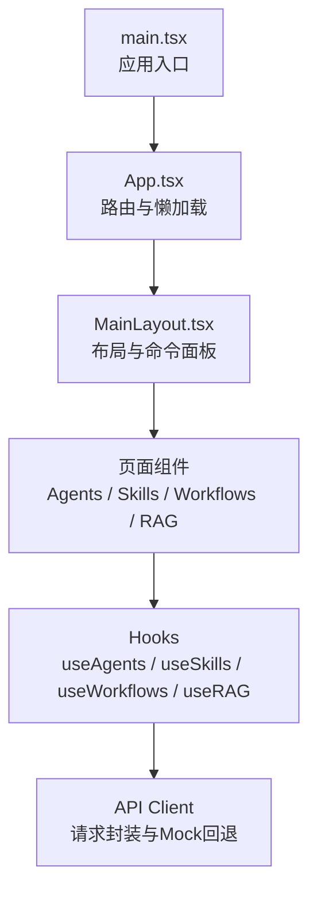
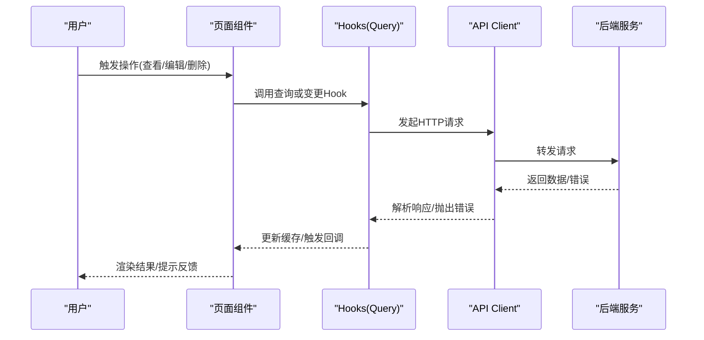
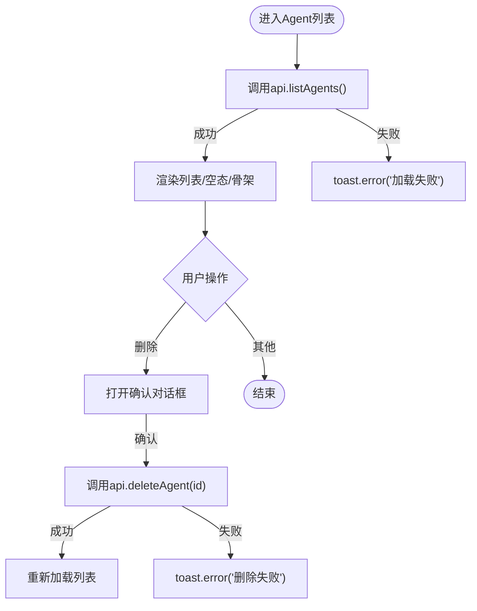
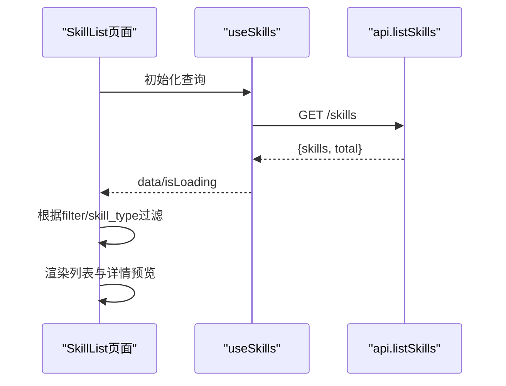
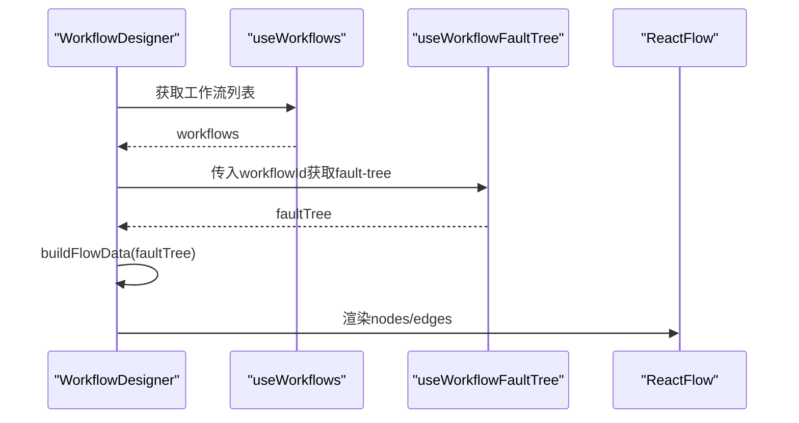
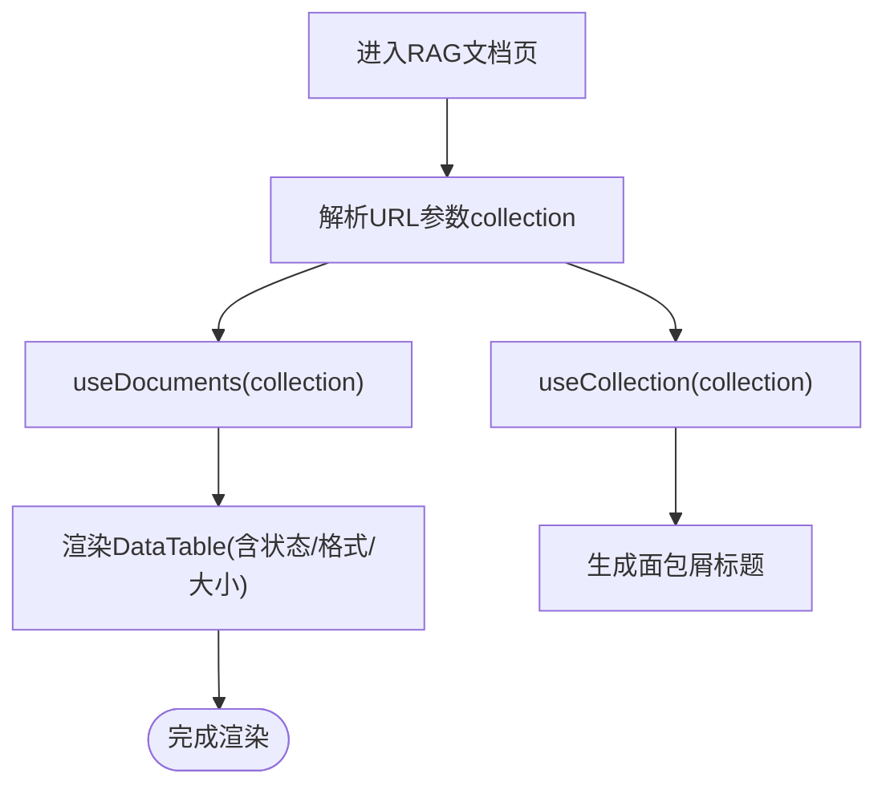
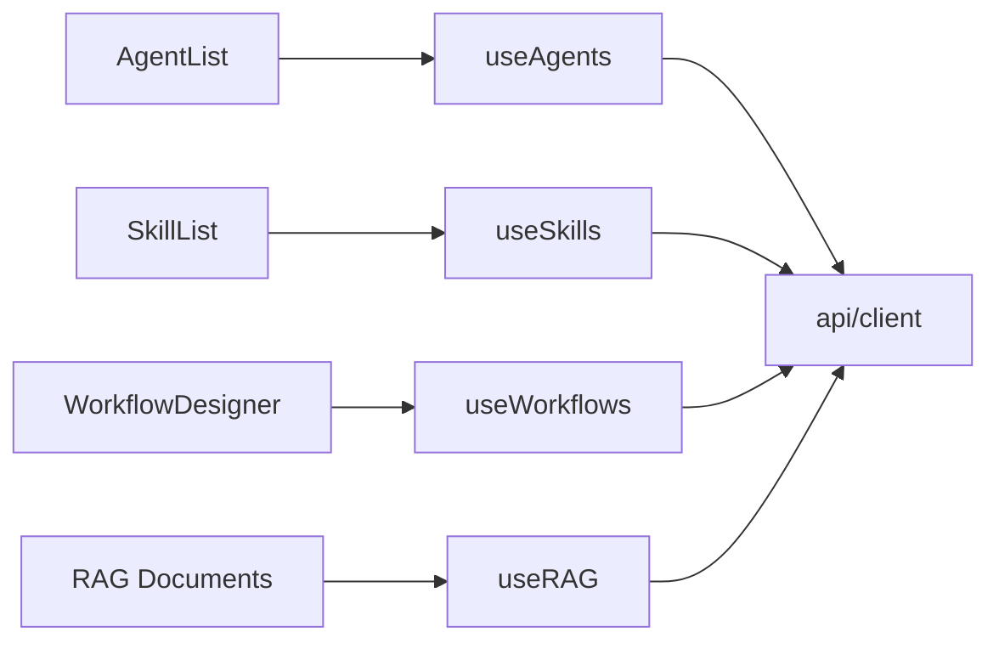

# 页面组件

<cite>
**本文引用的文件**
- [web/src/App.tsx](file://web/src/App.tsx)
- [web/src/main.tsx](file://web/src/main.tsx)
- [web/src/components/Layout/MainLayout.tsx](file://web/src/components/Layout/MainLayout.tsx)
- [web/src/pages/Agents/AgentList.tsx](file://web/src/pages/Agents/AgentList.tsx)
- [web/src/pages/Skills/SkillList.tsx](file://web/src/pages/Skills/SkillList.tsx)
- [web/src/pages/Workflows/WorkflowDesigner.tsx](file://web/src/pages/Workflows/WorkflowDesigner.tsx)
- [web/src/pages/RAG/Documents.tsx](file://web/src/pages/RAG/Documents.tsx)
- [web/src/hooks/useAgents.ts](file://web/src/hooks/useAgents.ts)
- [web/src/hooks/useSkills.ts](file://web/src/hooks/useSkills.ts)
- [web/src/hooks/useWorkflows.ts](file://web/src/hooks/useWorkflows.ts)
- [web/src/hooks/useRAG.ts](file://web/src/hooks/useRAG.ts)
- [web/src/api/client.ts](file://web/src/api/client.ts)
</cite>

## 目录
1. [简介](#简介)
2. [项目结构](#项目结构)
3. [核心组件](#核心组件)
4. [架构总览](#架构总览)
5. [详细组件分析](#详细组件分析)
6. [依赖关系分析](#依赖关系分析)
7. [性能考虑](#性能考虑)
8. [故障排查指南](#故障排查指南)
9. [结论](#结论)
10. [附录](#附录)

## 简介
本技术文档聚焦 ResolveAgent Web 前端的页面组件系统，围绕 Agent 管理、技能管理、工作流设计器与 RAG 知识库四大页面展开。文档从数据获取、状态管理、表单处理、用户交互、组件通信、错误处理等维度进行系统化说明，并提供可复用的开发模式与性能优化建议，帮助开发者快速理解并高效扩展页面能力。

## 项目结构
前端采用 React + TypeScript + React Router + TanStack Query 的架构：
- 路由与懒加载：通过 App 集中定义路由，使用 Suspense + lazy 实现按需加载，提升首屏性能。
- 全局布局：MainLayout 提供侧边栏、头部、命令面板与主内容区，统一导航与快捷键（如 Ctrl/Cmd+K）。
- 数据层：api/client 封装 HTTP 请求、健康检查、Mock 回退策略；hooks 层基于 TanStack Query 管理查询与变更。
- 页面层：按功能域组织 pages，每个页面组合通用 UI 组件与业务 hooks，完成展示与交互。

图表来源
- [web/src/main.tsx:1-29](file://web/src/main.tsx#L1-L29)
- [web/src/App.tsx:1-111](file://web/src/App.tsx#L1-L111)
- [web/src/components/Layout/MainLayout.tsx:1-123](file://web/src/components/Layout/MainLayout.tsx#L1-L123)

章节来源
- [web/src/App.tsx:1-111](file://web/src/App.tsx#L1-L111)
- [web/src/main.tsx:1-29](file://web/src/main.tsx#L1-L29)
- [web/src/components/Layout/MainLayout.tsx:1-123](file://web/src/components/Layout/MainLayout.tsx#L1-L123)

## 核心组件
- 路由与懒加载：在 App 中集中声明路由，结合 Suspense 与 lazy 降低包体积与启动时间。
- 全局布局：MainLayout 提供统一的导航、命令面板与 Toaster 通知容器。
- 数据获取与缓存：通过 TanStack Query 的 useQuery/useMutation 管理数据生命周期，支持 staleTime、重试、失效与局部更新。
- API 客户端：统一封装请求、错误处理与健康探测，并在后端不可用时自动降级到 Mock。

章节来源
- [web/src/App.tsx:1-111](file://web/src/App.tsx#L1-L111)
- [web/src/components/Layout/MainLayout.tsx:1-123](file://web/src/components/Layout/MainLayout.tsx#L1-L123)
- [web/src/hooks/useAgents.ts:1-160](file://web/src/hooks/useAgents.ts#L1-L160)
- [web/src/hooks/useSkills.ts:1-18](file://web/src/hooks/useSkills.ts#L1-L18)
- [web/src/hooks/useWorkflows.ts:1-46](file://web/src/hooks/useWorkflows.ts#L1-L46)
- [web/src/hooks/useRAG.ts:1-25](file://web/src/hooks/useRAG.ts#L1-L25)
- [web/src/api/client.ts:1-435](file://web/src/api/client.ts#L1-L435)

## 架构总览
页面组件的数据流遵循“页面 -> Hooks -> API -> 后端”的分层模型，状态由 TanStack Query 统一管理，UI 仅负责展示与交互。

图表来源
- [web/src/hooks/useAgents.ts:1-160](file://web/src/hooks/useAgents.ts#L1-L160)
- [web/src/hooks/useSkills.ts:1-18](file://web/src/hooks/useSkills.ts#L1-L18)
- [web/src/hooks/useWorkflows.ts:1-46](file://web/src/hooks/useWorkflows.ts#L1-L46)
- [web/src/hooks/useRAG.ts:1-25](file://web/src/hooks/useRAG.ts#L1-L25)
- [web/src/api/client.ts:1-435](file://web/src/api/client.ts#L1-L435)

## 详细组件分析

### Agent 管理页面（列表）
- 职责：展示 Agent 列表、创建/编辑/删除/克隆/对比等操作，提供空态与加载骨架。
- 数据获取：直接调用 api.listAgents/deleteAgent，配合 toast 提示与本地状态控制加载与确认弹窗。
- 状态管理：使用 useState 管理列表、加载与删除目标；无跨页共享状态。
- 用户交互：下拉菜单触发查看详情、编辑、克隆、对比与删除；删除通过 Dialog 二次确认。
- 错误处理：捕获异常并通过 toast.error 提示失败原因。

图表来源
- [web/src/pages/Agents/AgentList.tsx:1-249](file://web/src/pages/Agents/AgentList.tsx#L1-L249)
- [web/src/api/client.ts:95-104](file://web/src/api/client.ts#L95-L104)

章节来源
- [web/src/pages/Agents/AgentList.tsx:1-249](file://web/src/pages/Agents/AgentList.tsx#L1-L249)
- [web/src/api/client.ts:95-104](file://web/src/api/client.ts#L95-L104)

### 技能管理页面（列表）
- 职责：展示已安装技能，支持分类筛选（全部/通用/场景），右侧详情预览，跳转详情页。
- 数据获取：通过 useSkills Hook 获取技能列表，内部调用 api.listSkills。
- 状态管理：本地 filter 与 selectedSkill 控制视图；useSkills 管理远程数据与加载态。
- 用户交互：点击筛选标签切换视图，点击技能行展开详情预览，跳转详情页。
- 错误处理：依赖 TanStack Query 默认重试与错误边界；页面未显式捕获，保持简洁。

图表来源
- [web/src/pages/Skills/SkillList.tsx:1-352](file://web/src/pages/Skills/SkillList.tsx#L1-L352)
- [web/src/hooks/useSkills.ts:1-18](file://web/src/hooks/useSkills.ts#L1-L18)
- [web/src/api/client.ts:105-106](file://web/src/api/client.ts#L105-L106)

章节来源
- [web/src/pages/Skills/SkillList.tsx:1-352](file://web/src/pages/Skills/SkillList.tsx#L1-L352)
- [web/src/hooks/useSkills.ts:1-18](file://web/src/hooks/useSkills.ts#L1-L18)
- [web/src/api/client.ts:105-106](file://web/src/api/client.ts#L105-L106)

### 工作流设计器页面（FTA 可视化）
- 职责：选择工作流后，将 FaultTree 转换为 ReactFlow 节点与边，提供缩放、平移等交互。
- 数据获取：useWorkflows 获取工作流列表；useWorkflowFaultTree(workflowId) 获取故障树。
- 数据处理：buildFlowData 将 FaultTree 的 gates/events 映射为节点与边，计算层级与列布局。
- 用户交互：顶部 Select 切换工作流，URL 参数 id 驱动当前视图。
- 错误处理：treeLoading 时显示骨架；无数据时展示占位提示。

图表来源
- [web/src/pages/Workflows/WorkflowDesigner.tsx:1-208](file://web/src/pages/Workflows/WorkflowDesigner.tsx#L1-L208)
- [web/src/hooks/useWorkflows.ts:1-46](file://web/src/hooks/useWorkflows.ts#L1-L46)
- [web/src/api/client.ts:107-128](file://web/src/api/client.ts#L107-L128)

章节来源
- [web/src/pages/Workflows/WorkflowDesigner.tsx:1-208](file://web/src/pages/Workflows/WorkflowDesigner.tsx#L1-L208)
- [web/src/hooks/useWorkflows.ts:1-46](file://web/src/hooks/useWorkflows.ts#L1-L46)
- [web/src/api/client.ts:107-128](file://web/src/api/client.ts#L107-L128)

### RAG 管理页面（文档列表）
- 职责：展示知识库集合下的文档列表，支持按集合过滤，格式化大小与上传时间，状态标记。
- 数据获取：useDocuments(collectionId?) 与 useCollection(id) 分别获取文档与集合信息。
- 状态管理：本地 columns 动态插入“所属集合”列；URL 参数 collection 驱动过滤。
- 用户交互：面包屑导航回集合页；表格展示文档元信息与状态。
- 错误处理：依赖 Query 的 loading 与空态；未显式捕获网络错误。

图表来源
- [web/src/pages/RAG/Documents.tsx:1-122](file://web/src/pages/RAG/Documents.tsx#L1-L122)
- [web/src/hooks/useRAG.ts:1-25](file://web/src/hooks/useRAG.ts#L1-L25)
- [web/src/api/client.ts:129-138](file://web/src/api/client.ts#L129-L138)

章节来源
- [web/src/pages/RAG/Documents.tsx:1-122](file://web/src/pages/RAG/Documents.tsx#L1-L122)
- [web/src/hooks/useRAG.ts:1-25](file://web/src/hooks/useRAG.ts#L1-L25)
- [web/src/api/client.ts:129-138](file://web/src/api/client.ts#L129-L138)

### 页面间通信与数据流向
- 路由级通信：通过 URL 参数（如 /workflows?&id=...、/rag/documents?collection=...）传递上下文，页面读取后驱动数据获取。
- 状态共享：TanStack Query 缓存键（如 ['agents', id]）保证跨组件一致性与自动失效。
- 事件与反馈：使用 sonner 的 toast 提供即时反馈；Dialog 用于危险操作的二次确认。

章节来源
- [web/src/App.tsx:62-106](file://web/src/App.tsx#L62-L106)
- [web/src/pages/Workflows/WorkflowDesigner.tsx:129-143](file://web/src/pages/Workflows/WorkflowDesigner.tsx#L129-L143)
- [web/src/pages/RAG/Documents.tsx:31-38](file://web/src/pages/RAG/Documents.tsx#L31-L38)
- [web/src/pages/Agents/AgentList.tsx:65-78](file://web/src/pages/Agents/AgentList.tsx#L65-L78)

### 错误处理策略
- 请求层：api/request 对非 2xx 响应抛出错误，包含 message 或 status。
- 健康探测：checkBackend 缓存后端可用性，避免频繁探测；失败时延迟重置。
- 降级机制：当后端不可用或方法失败时，优先尝试代码分析 Mock，再尝试旧版 Mock，最后抛错。
- 页面层：Agent 列表使用 try/catch + toast.error；其他页面依赖 Query 默认行为与空态。

章节来源
- [web/src/api/client.ts:47-90](file://web/src/api/client.ts#L47-L90)
- [web/src/api/client.ts:296-391](file://web/src/api/client.ts#L296-L391)
- [web/src/pages/Agents/AgentList.tsx:49-78](file://web/src/pages/Agents/AgentList.tsx#L49-L78)

## 依赖关系分析
- 页面依赖 Hooks：各页面通过对应 Hook 获取数据，解耦 UI 与数据逻辑。
- Hooks 依赖 API：统一通过 api/client 暴露的方法访问后端接口。
- 路由与布局：App 定义路由，MainLayout 提供全局导航与命令面板。

图表来源
- [web/src/pages/Agents/AgentList.tsx:1-249](file://web/src/pages/Agents/AgentList.tsx#L1-L249)
- [web/src/pages/Skills/SkillList.tsx:1-352](file://web/src/pages/Skills/SkillList.tsx#L1-L352)
- [web/src/pages/Workflows/WorkflowDesigner.tsx:1-208](file://web/src/pages/Workflows/WorkflowDesigner.tsx#L1-L208)
- [web/src/pages/RAG/Documents.tsx:1-122](file://web/src/pages/RAG/Documents.tsx#L1-L122)
- [web/src/hooks/useAgents.ts:1-160](file://web/src/hooks/useAgents.ts#L1-L160)
- [web/src/hooks/useSkills.ts:1-18](file://web/src/hooks/useSkills.ts#L1-L18)
- [web/src/hooks/useWorkflows.ts:1-46](file://web/src/hooks/useWorkflows.ts#L1-L46)
- [web/src/hooks/useRAG.ts:1-25](file://web/src/hooks/useRAG.ts#L1-L25)
- [web/src/api/client.ts:1-435](file://web/src/api/client.ts#L1-L435)

章节来源
- [web/src/hooks/useAgents.ts:1-160](file://web/src/hooks/useAgents.ts#L1-L160)
- [web/src/hooks/useSkills.ts:1-18](file://web/src/hooks/useSkills.ts#L1-L18)
- [web/src/hooks/useWorkflows.ts:1-46](file://web/src/hooks/useWorkflows.ts#L1-L46)
- [web/src/hooks/useRAG.ts:1-25](file://web/src/hooks/useRAG.ts#L1-L25)
- [web/src/api/client.ts:1-435](file://web/src/api/client.ts#L1-L435)

## 性能考虑
- 路由懒加载：使用 React.lazy + Suspense 减少初始包体积，提升首屏速度。
- 查询缓存与失效：TanStack Query 默认 staleTime 与重试策略，减少重复请求；变更后通过 invalidateQueries 精准刷新。
- 列表渲染优化：Agent 列表使用行布局与条件渲染，避免不必要的重排；Skeleton 提升感知性能。
- 可视化性能：工作流设计器使用 useMemo 构建节点与边，避免每次渲染重复计算。
- 健康探测缓存：后端可用性检测缓存 30 秒，降低探测开销。

章节来源
- [web/src/App.tsx:2-60](file://web/src/App.tsx#L2-L60)
- [web/src/main.tsx:9-16](file://web/src/main.tsx#L9-L16)
- [web/src/pages/Workflows/WorkflowDesigner.tsx:136-139](file://web/src/pages/Workflows/WorkflowDesigner.tsx#L136-L139)
- [web/src/api/client.ts:47-73](file://web/src/api/client.ts#L47-L73)

## 故障排查指南
- 后端不可用：观察 health 探测结果；若失败，API 会尝试 Mock 回退；确认网络与后端服务状态。
- 列表为空：检查 Query 是否启用（enabled）、URL 参数是否正确（如 workflow id、collection id）。
- 删除失败：确认权限与资源存在；查看 toast 错误信息；必要时检查后端日志。
- 可视化空白：确认 faultTree 数据是否存在；检查 buildFlowData 的输入结构与节点类型注册。

章节来源
- [web/src/api/client.ts:47-90](file://web/src/api/client.ts#L47-L90)
- [web/src/pages/Agents/AgentList.tsx:49-78](file://web/src/pages/Agents/AgentList.tsx#L49-L78)
- [web/src/pages/Workflows/WorkflowDesigner.tsx:170-202](file://web/src/pages/Workflows/WorkflowDesigner.tsx#L170-L202)

## 结论
ResolveAgent 页面组件系统以清晰的层次划分与标准化的数据流为核心，借助 TanStack Query 与 React Router 实现了高内聚、低耦合的前端架构。通过懒加载、缓存与降级策略，系统在可用性与性能之间取得良好平衡。未来可进一步引入更细粒度的错误边界与单元测试覆盖，以提升健壮性与可维护性。

## 附录
- 常用 Hook 路径参考：
  - Agent 相关：[web/src/hooks/useAgents.ts](file://web/src/hooks/useAgents.ts)
  - 技能相关：[web/src/hooks/useSkills.ts](file://web/src/hooks/useSkills.ts)
  - 工作流相关：[web/src/hooks/useWorkflows.ts](file://web/src/hooks/useWorkflows.ts)
  - RAG 相关：[web/src/hooks/useRAG.ts](file://web/src/hooks/useRAG.ts)
- 页面组件路径参考：
  - Agent 列表：[web/src/pages/Agents/AgentList.tsx](file://web/src/pages/Agents/AgentList.tsx)
  - 技能列表：[web/src/pages/Skills/SkillList.tsx](file://web/src/pages/Skills/SkillList.tsx)
  - 工作流设计器：[web/src/pages/Workflows/WorkflowDesigner.tsx](file://web/src/pages/Workflows/WorkflowDesigner.tsx)
  - RAG 文档：[web/src/pages/RAG/Documents.tsx](file://web/src/pages/RAG/Documents.tsx)
- API 客户端：[web/src/api/client.ts](file://web/src/api/client.ts)