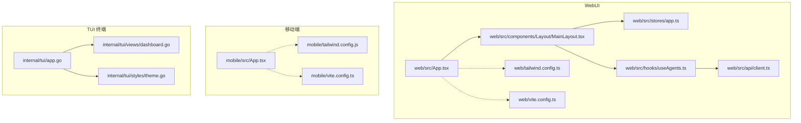
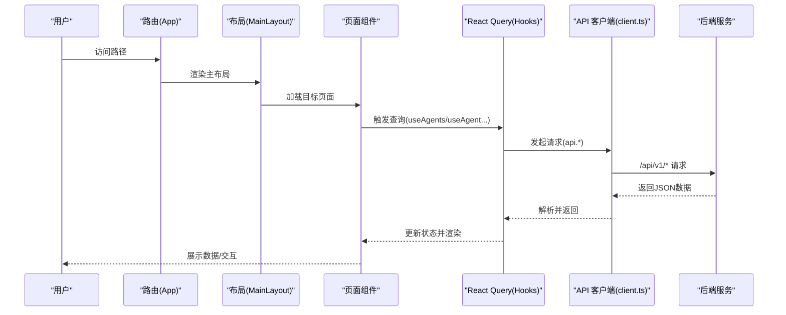
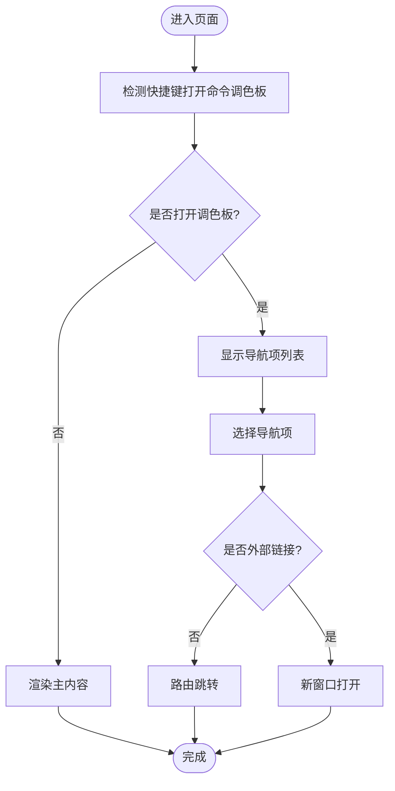
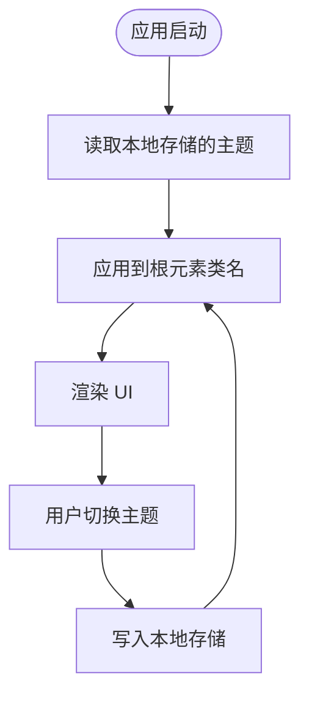
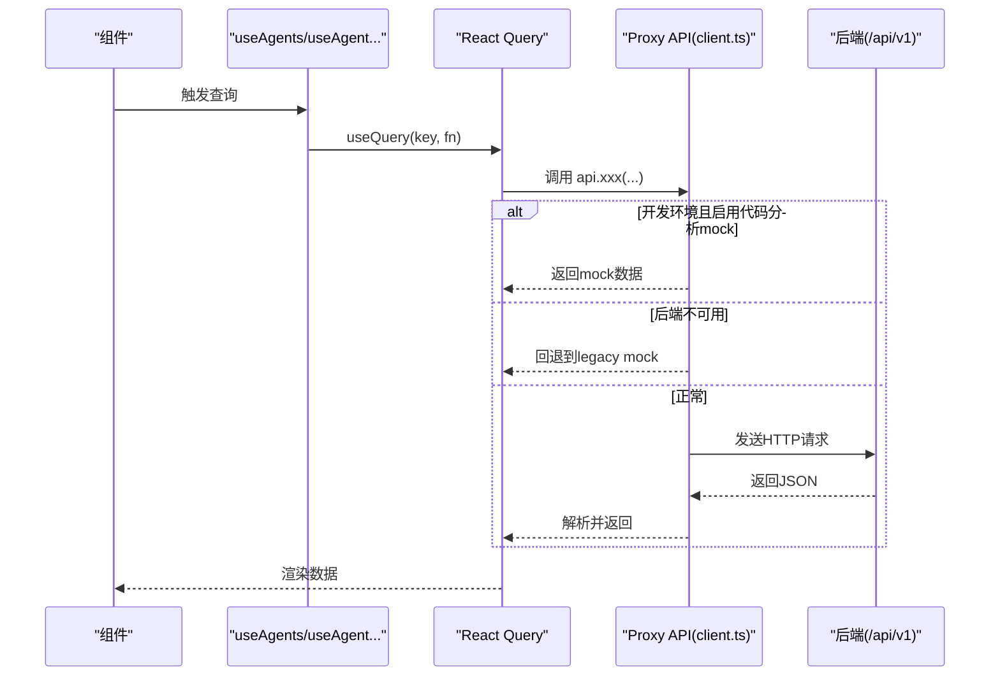
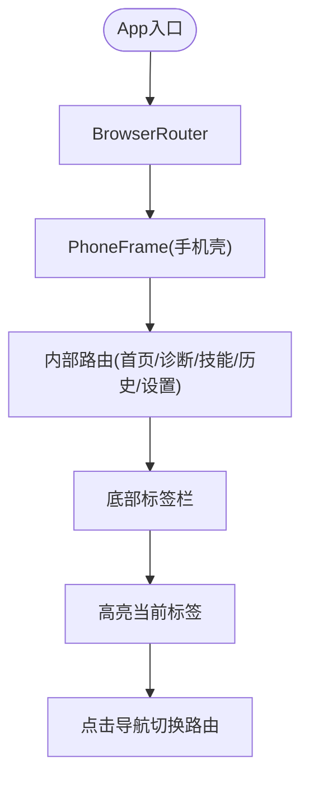
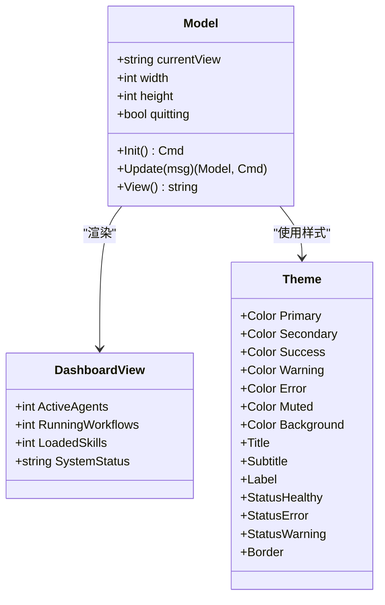
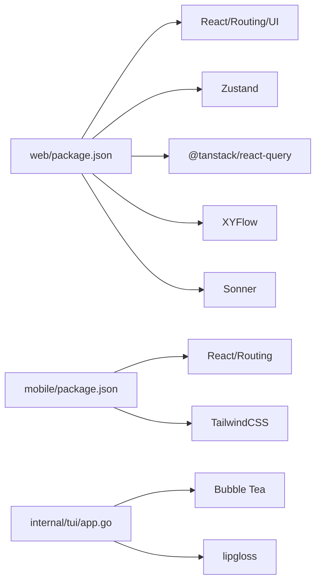

# 用户界面

<cite>
**本文引用的文件**
- [web/package.json](file://web/package.json)
- [mobile/package.json](file://mobile/package.json)
- [internal/tui/app.go](file://internal/tui/app.go)
- [web/src/App.tsx](file://web/src/App.tsx)
- [mobile/src/App.tsx](file://mobile/src/App.tsx)
- [web/src/components/Layout/MainLayout.tsx](file://web/src/components/Layout/MainLayout.tsx)
- [web/tailwind.config.ts](file://web/tailwind.config.ts)
- [mobile/tailwind.config.js](file://mobile/tailwind.config.js)
- [web/vite.config.ts](file://web/vite.config.ts)
- [mobile/vite.config.ts](file://mobile/vite.config.ts)
- [web/src/stores/app.ts](file://web/src/stores/app.ts)
- [web/src/hooks/useAgents.ts](file://web/src/hooks/useAgents.ts)
- [web/src/api/client.ts](file://web/src/api/client.ts)
- [internal/tui/views/dashboard.go](file://internal/tui/views/dashboard.go)
- [internal/tui/styles/theme.go](file://internal/tui/styles/theme.go)
</cite>

## 目录
1. [简介](#简介)
2. [项目结构](#项目结构)
3. [核心组件](#核心组件)
4. [架构总览](#架构总览)
5. [详细组件分析](#详细组件分析)
6. [依赖关系分析](#依赖关系分析)
7. [性能考量](#性能考量)
8. [故障排查指南](#故障排查指南)
9. [结论](#结论)
10. [附录](#附录)

## 简介
本文件为 ResolveAgent 项目的用户界面系统提供综合性技术文档，覆盖 WebUI（React + TypeScript）、移动端应用与 TUI 终端界面的设计与实现要点。内容包括页面路由设计、状态管理、API 集成方案、组件架构、用户交互模式、响应式设计、可访问性与跨浏览器兼容性建议、界面定制与主题支持，以及性能优化实践。

## 项目结构
ResolveAgent 的前端与终端界面由三部分组成：
- WebUI：基于 React 18、TypeScript、TailwindCSS、Radix UI 组件库与 Vite 构建，采用 React Router v6 进行路由管理，使用 Zustand 管理轻量状态，React Query 管理服务端数据状态。
- 移动端应用：同样基于 React + TypeScript，使用 React Router DOM 进行路由，采用 TailwindCSS 定制移动端样式，并通过“手机壳”容器模拟真机外观。
- TUI 终端界面：基于 Bubble Tea（Go）实现，提供命令式交互，支持键盘快捷键切换视图与窗口尺寸自适应。

图表来源
- [web/src/App.tsx:1-93](file://web/src/App.tsx#L1-L93)
- [web/src/components/Layout/MainLayout.tsx:1-109](file://web/src/components/Layout/MainLayout.tsx#L1-L109)
- [web/src/stores/app.ts:1-50](file://web/src/stores/app.ts#L1-L50)
- [web/src/hooks/useAgents.ts:1-160](file://web/src/hooks/useAgents.ts#L1-L160)
- [web/src/api/client.ts:1-435](file://web/src/api/client.ts#L1-L435)
- [web/tailwind.config.ts:1-94](file://web/tailwind.config.ts#L1-L94)
- [web/vite.config.ts:1-22](file://web/vite.config.ts#L1-L22)
- [mobile/src/App.tsx:1-197](file://mobile/src/App.tsx#L1-L197)
- [mobile/tailwind.config.js:1-40](file://mobile/tailwind.config.js#L1-L40)
- [mobile/vite.config.ts:1-11](file://mobile/vite.config.ts#L1-L11)
- [internal/tui/app.go:1-102](file://internal/tui/app.go#L1-L102)
- [internal/tui/views/dashboard.go:1-17](file://internal/tui/views/dashboard.go#L1-L17)
- [internal/tui/styles/theme.go:1-47](file://internal/tui/styles/theme.go#L1-L47)

章节来源
- [web/src/App.tsx:1-93](file://web/src/App.tsx#L1-L93)
- [mobile/src/App.tsx:1-197](file://mobile/src/App.tsx#L1-L197)
- [internal/tui/app.go:1-102](file://internal/tui/app.go#L1-L102)

## 核心组件
- 路由与布局
  - WebUI 使用 React Router v6 在主布局中集中声明路由，主布局负责侧边栏、头部、命令调色板与全局通知等横切关注点。
  - 移动端采用底部标签栏与“手机壳”容器，路由集中在 App 内部，通过固定底部导航切换页面。
- 状态管理
  - WebUI 使用 Zustand 管理 UI 状态（如侧边栏展开、主题、命令调色板开关），并持久化到本地存储，启动时自动恢复。
  - 移动端使用 React useState/useEffect 管理本地状态，无持久化需求。
- 数据获取与缓存
  - WebUI 使用 React Query 管理后端数据查询、缓存、失效与并发控制；API 层通过代理封装，具备后端可用性探测与降级回退机制。
- 主题与样式
  - WebUI 基于 TailwindCSS，启用暗色模式类名策略，主题切换通过根元素类名控制。
  - 移动端定义了品牌色与操作色系，字体与字号在移动端配置中扩展。
- 终端界面
  - TUI 使用 Bubble Tea 模型驱动，支持键盘输入切换视图、窗口尺寸变化、基础样式与颜色主题。

章节来源
- [web/src/components/Layout/MainLayout.tsx:1-109](file://web/src/components/Layout/MainLayout.tsx#L1-L109)
- [web/src/stores/app.ts:1-50](file://web/src/stores/app.ts#L1-L50)
- [web/src/hooks/useAgents.ts:1-160](file://web/src/hooks/useAgents.ts#L1-L160)
- [web/src/api/client.ts:1-435](file://web/src/api/client.ts#L1-L435)
- [web/tailwind.config.ts:1-94](file://web/tailwind.config.ts#L1-L94)
- [mobile/tailwind.config.js:1-40](file://mobile/tailwind.config.js#L1-L40)
- [internal/tui/app.go:1-102](file://internal/tui/app.go#L1-L102)

## 架构总览
下图展示 WebUI 的端到端交互流程：路由层 -> 布局层 -> 页面组件 -> Hooks 查询 -> API 客户端 -> 后端服务；移动端与 TUI 采用类似的分层但交互方式不同。

图表来源
- [web/src/App.tsx:1-93](file://web/src/App.tsx#L1-L93)
- [web/src/components/Layout/MainLayout.tsx:1-109](file://web/src/components/Layout/MainLayout.tsx#L1-L109)
- [web/src/hooks/useAgents.ts:1-160](file://web/src/hooks/useAgents.ts#L1-L160)
- [web/src/api/client.ts:1-435](file://web/src/api/client.ts#L1-L435)

## 详细组件分析

### WebUI 路由与布局
- 路由设计
  - 集中式路由声明，覆盖仪表盘、Agent 管理、技能、工作流、RAG、解决方案、代码分析、追踪分析、评估基准、监控、数据库、架构文档、设置、演示、移动页等。
  - 主布局包裹所有页面，统一注入命令调色板、全局通知与侧边栏导航。
- 命令调色板
  - 支持快捷键打开，提供页面导航与外部链接跳转。
- 通知系统
  - 全局 Toast 提示，便于错误与成功反馈。

图表来源
- [web/src/components/Layout/MainLayout.tsx:59-103](file://web/src/components/Layout/MainLayout.tsx#L59-L103)

章节来源
- [web/src/App.tsx:1-93](file://web/src/App.tsx#L1-L93)
- [web/src/components/Layout/MainLayout.tsx:1-109](file://web/src/components/Layout/MainLayout.tsx#L1-L109)

### 状态管理（Zustand）
- 状态域
  - 侧边栏展开、选中 Agent、命令调色板开关、主题（light/dark）。
- 持久化
  - 仅持久化部分状态，启动时根据本地存储恢复主题并应用到根元素类名。
- 主题切换
  - 切换时动态添加/移除根元素的暗色类名，确保 Tailwind 暗色模式生效。

图表来源
- [web/src/stores/app.ts:26-49](file://web/src/stores/app.ts#L26-L49)

章节来源
- [web/src/stores/app.ts:1-50](file://web/src/stores/app.ts#L1-L50)

### 数据获取与缓存（React Query + API 客户端）
- 查询钩子
  - 提供 Agent 列表、详情、执行记录、运行状态、对话、长期记忆、部署信息、协作会话、访问规则、审计日志等查询钩子，按需启用与失效策略。
- API 客户端
  - 统一封装 /api/v1 前缀请求，内置后端可用性探测与失败回退逻辑；开发环境下支持代码分析相关 mock 方法与旧版 mock 模块回退。
- 错误处理
  - 对非 2xx 响应抛出错误，交由上层处理；Toast 可用于提示。

图表来源
- [web/src/hooks/useAgents.ts:1-160](file://web/src/hooks/useAgents.ts#L1-L160)
- [web/src/api/client.ts:51-393](file://web/src/api/client.ts#L51-L393)

章节来源
- [web/src/hooks/useAgents.ts:1-160](file://web/src/hooks/useAgents.ts#L1-L160)
- [web/src/api/client.ts:1-435](file://web/src/api/client.ts#L1-L435)

### 主题与样式（TailwindCSS）
- WebUI
  - 启用暗色模式类名策略，扩展颜色、圆角、字体族、动画与 Argo CD 风格状态色。
- 移动端
  - 自定义字号体系与品牌/运维色系，适配移动端排版与视觉层级。

章节来源
- [web/tailwind.config.ts:1-94](file://web/tailwind.config.ts#L1-L94)
- [mobile/tailwind.config.js:1-40](file://mobile/tailwind.config.js#L1-L40)

### 构建与开发服务器
- WebUI
  - Vite + React 插件，路径别名 @ 指向 src，本地开发代理到后端 8080。
- 移动端
  - Vite + React 插件，本地开发端口 4000 并允许外网访问。

章节来源
- [web/vite.config.ts:1-22](file://web/vite.config.ts#L1-L22)
- [mobile/vite.config.ts:1-11](file://mobile/vite.config.ts#L1-L11)

### 移动端应用（React + 路由 + 手机壳）
- 底部标签栏
  - 固定在屏幕底部，支持图标与文字，高亮当前页。
- 手机壳容器
  - 模拟 iPhone 外观，包含状态栏、信号、电量、Home 指示条等细节。
- 路由
  - 内置首页、诊断、技能、历史、设置等页面，配合标签栏切换。

图表来源
- [mobile/src/App.tsx:166-196](file://mobile/src/App.tsx#L166-L196)

章节来源
- [mobile/src/App.tsx:1-197](file://mobile/src/App.tsx#L1-L197)

### TUI 终端界面（Bubble Tea）
- 模型与视图
  - Model 包含当前视图、窗口宽高、退出标志；支持 q/ctrl+c 退出，数字键 1~4 切换视图。
- 视图渲染
  - 根据当前视图输出系统状态、Agent、工作流、日志等占位信息。
- 主题与样式
  - 使用 lipgloss 定义颜色与文本样式，提供标题、副标题、标签、状态样式与边框。

图表来源
- [internal/tui/app.go:20-94](file://internal/tui/app.go#L20-L94)
- [internal/tui/views/dashboard.go:1-17](file://internal/tui/views/dashboard.go#L1-L17)
- [internal/tui/styles/theme.go:1-47](file://internal/tui/styles/theme.go#L1-L47)

章节来源
- [internal/tui/app.go:1-102](file://internal/tui/app.go#L1-L102)
- [internal/tui/views/dashboard.go:1-17](file://internal/tui/views/dashboard.go#L1-L17)
- [internal/tui/styles/theme.go:1-47](file://internal/tui/styles/theme.go#L1-L47)

## 依赖关系分析
- WebUI 依赖
  - React 18、React Router DOM、Radix UI 组件、TailwindCSS、Zustand、@tanstack/react-query、XYFlow、Lucide React、Sonner 等。
- 移动端依赖
  - React 18、React Router DOM、Lucide React、TailwindCSS。
- TUI 依赖
  - Bubble Tea、lipgloss。

图表来源
- [web/package.json:1-60](file://web/package.json#L1-L60)
- [mobile/package.json:1-28](file://mobile/package.json#L1-L28)
- [internal/tui/app.go:1-102](file://internal/tui/app.go#L1-L102)

章节来源
- [web/package.json:1-60](file://web/package.json#L1-L60)
- [mobile/package.json:1-28](file://mobile/package.json#L1-L28)

## 性能考量
- WebUI
  - 使用 React Query 缓存与去重请求，避免重复网络开销；对高频查询设置合理的查询间隔与失效策略。
  - 将大型可视化组件（如流程图/图谱）按需加载，减少首屏负担。
  - TailwindCSS 按需扫描内容，避免打包无关样式。
- 移动端
  - 控制“手机壳”容器内滚动区域，避免过度重绘；合理拆分路由页面，延迟加载非关键资源。
- TUI
  - 保持模型更新最小化，避免频繁全量重绘；在大屏时及时响应窗口尺寸变化。

## 故障排查指南
- WebUI
  - API 降级：当后端不可用或请求异常时，客户端会尝试回退到 mock 数据；若仍失败，检查代理配置与后端健康状态。
  - 主题不生效：确认根元素类名是否正确添加/移除，Tailwind 暗色模式开关是否被覆盖。
  - 路由跳转无效：检查路由声明与路径参数是否匹配，主布局是否正确包裹。
- 移动端
  - 样式异常：检查 Tailwind 配置与字体族是否在移动端生效；确认“手机壳”容器尺寸与安全区适配。
  - 底部标签栏不切换：确认导航逻辑与 active 状态绑定。
- TUI
  - 键盘无响应：确认 Bubble Tea 程序已启动且未处于退出状态；检查按键映射。
  - 视图空白：确认当前视图分支与渲染逻辑。

章节来源
- [web/src/api/client.ts:51-393](file://web/src/api/client.ts#L51-L393)
- [web/src/stores/app.ts:17-24](file://web/src/stores/app.ts#L17-L24)
- [mobile/src/App.tsx:9-67](file://mobile/src/App.tsx#L9-L67)
- [internal/tui/app.go:40-94](file://internal/tui/app.go#L40-L94)

## 结论
ResolveAgent 的用户界面系统以清晰的分层架构支撑多端体验：WebUI 提供企业级桌面交互与强大的数据管理能力；移动端聚焦简洁的触控导航与沉浸式模拟体验；TUI 则满足运维场景下的快速命令式操作。通过统一的状态管理、API 客户端与主题体系，系统在可维护性、可扩展性与用户体验之间取得平衡。

## 附录
- 可访问性与跨浏览器兼容性建议
  - WebUI：为交互元素提供语义化标签与键盘可达性；测试主流浏览器差异；为暗色模式提供对比度保障。
  - 移动端：遵循 iOS/Android 设计规范，注意安全区与手势区域；保证字体大小与触摸目标尺寸符合可访问性标准。
  - TUI：确保颜色对比度满足 CLI 场景，提供必要的文本替代与键盘快捷键说明。
- 界面定制与主题支持
  - WebUI：通过 CSS 变量与 Tailwind 扩展实现主题定制；Zustand 管理用户偏好并持久化。
  - 移动端：在 Tailwind 配置中扩展品牌色与字号体系，适配不同设备密度。
  - TUI：通过样式模块集中管理颜色与文本样式，便于统一调整。