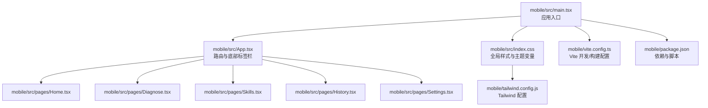
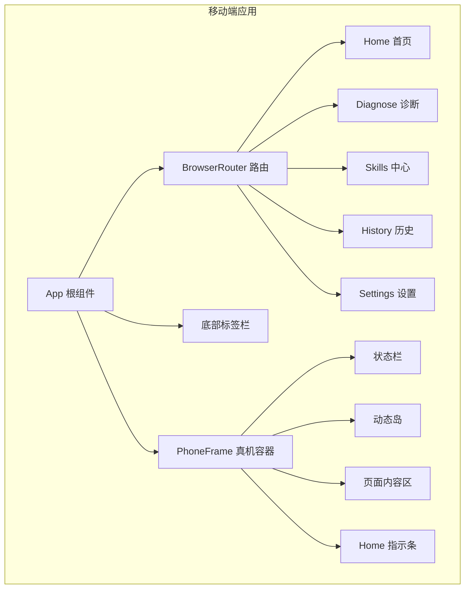
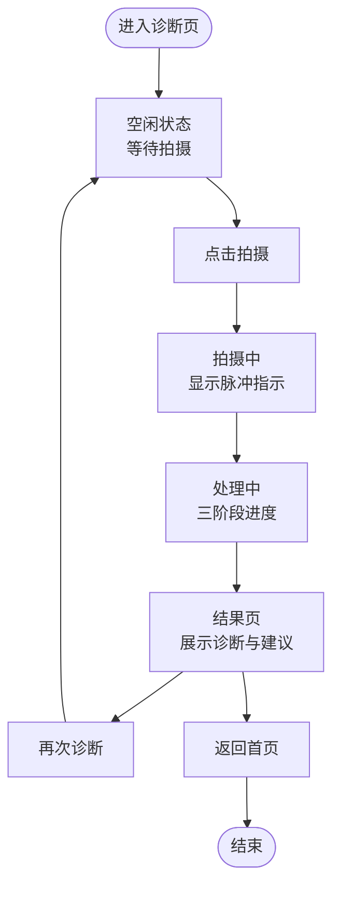
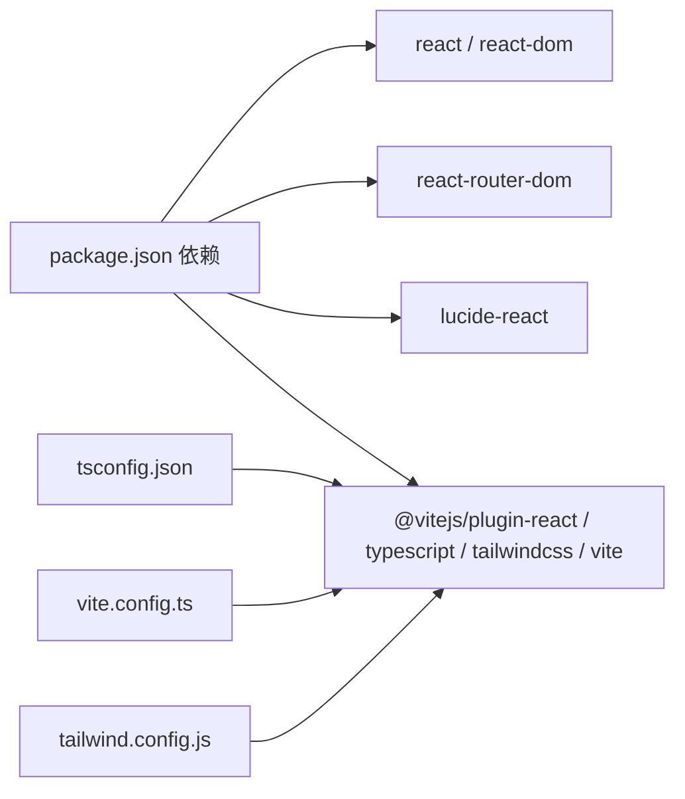

# 移动端应用

<cite>
**本文引用的文件**
- [mobile/src/App.tsx](file://mobile/src/App.tsx)
- [mobile/src/main.tsx](file://mobile/src/main.tsx)
- [mobile/src/pages/Home.tsx](file://mobile/src/pages/Home.tsx)
- [mobile/src/pages/Diagnose.tsx](file://mobile/src/pages/Diagnose.tsx)
- [mobile/src/pages/Skills.tsx](file://mobile/src/pages/Skills.tsx)
- [mobile/src/pages/History.tsx](file://mobile/src/pages/History.tsx)
- [mobile/src/pages/Settings.tsx](file://mobile/src/pages/Settings.tsx)
- [mobile/src/index.css](file://mobile/src/index.css)
- [mobile/tailwind.config.js](file://mobile/tailwind.config.js)
- [mobile/tsconfig.json](file://mobile/tsconfig.json)
- [mobile/package.json](file://mobile/package.json)
- [mobile/vite.config.ts](file://mobile/vite.config.ts)
</cite>

## 目录
1. [简介](#简介)
2. [项目结构](#项目结构)
3. [核心组件](#核心组件)
4. [架构总览](#架构总览)
5. [详细组件分析](#详细组件分析)
6. [依赖关系分析](#依赖关系分析)
7. [性能考量](#性能考量)
8. [故障排查指南](#故障排查指南)
9. [结论](#结论)
10. [附录](#附录)

## 简介
本文件为 ResolveAgent 移动端应用的技术文档，基于 React + TypeScript + Vite 构建，采用 TailwindCSS 进行样式管理，并通过自定义主题变量实现深色模式与专业配色体系。应用以“手机壳”（PhoneFrame）容器模拟真机界面，内置首页、诊断、Skills 中心、历史记录与设置五大页面，配合底部标签栏实现移动端常用导航模式。

该应用强调移动端交互体验：点击反馈、动画入场、状态栏与安全区域适配、以及基于状态机的状态流转（如诊断流程）。同时，应用遵循“100% 本地推理”的隐私与安全原则，所有处理均在设备上完成，不上传数据。

## 项目结构
移动端代码位于 mobile 目录，主要由入口、页面组件、样式与构建配置组成。整体采用“页面级组件 + 全局样式 + 构建工具”的分层组织方式。

图表来源
- [mobile/src/main.tsx:1-11](file://mobile/src/main.tsx#L1-L11)
- [mobile/src/App.tsx:166-197](file://mobile/src/App.tsx#L166-L197)
- [mobile/src/pages/Home.tsx:45-367](file://mobile/src/pages/Home.tsx#L45-L367)
- [mobile/src/pages/Diagnose.tsx:42-604](file://mobile/src/pages/Diagnose.tsx#L42-L604)
- [mobile/src/pages/Skills.tsx:34-341](file://mobile/src/pages/Skills.tsx#L34-L341)
- [mobile/src/pages/History.tsx:84-328](file://mobile/src/pages/History.tsx#L84-L328)
- [mobile/src/pages/Settings.tsx:38-371](file://mobile/src/pages/Settings.tsx#L38-L371)
- [mobile/src/index.css:1-155](file://mobile/src/index.css#L1-L155)
- [mobile/tailwind.config.js:1-40](file://mobile/tailwind.config.js#L1-L40)
- [mobile/vite.config.ts:1-11](file://mobile/vite.config.ts#L1-L11)
- [mobile/package.json:1-28](file://mobile/package.json#L1-L28)

章节来源
- [mobile/src/main.tsx:1-11](file://mobile/src/main.tsx#L1-L11)
- [mobile/src/App.tsx:166-197](file://mobile/src/App.tsx#L166-L197)
- [mobile/src/index.css:1-155](file://mobile/src/index.css#L1-L155)
- [mobile/tailwind.config.js:1-40](file://mobile/tailwind.config.js#L1-L40)
- [mobile/vite.config.ts:1-11](file://mobile/vite.config.ts#L1-L11)
- [mobile/package.json:1-28](file://mobile/package.json#L1-L28)

## 核心组件
- 应用根组件 App：负责全局路由与底部标签栏渲染，使用浏览器路由进行页面切换；通过 PhoneFrame 包裹形成“真机”视觉效果。
- 页面组件：Home（首页）、Diagnose（诊断）、Skills（Skills 中心）、History（历史记录）、Settings（设置），每个页面独立管理自身状态与交互。
- 主题与样式：通过 CSS 变量定义颜色、字体与动效曲线，Tailwind 提供原子化样式能力；index.css 同时引入字体资源与动画关键帧。
- 构建与运行：Vite 作为开发服务器与打包工具，React + TypeScript 提供类型安全与组件化开发体验。

章节来源
- [mobile/src/App.tsx:9-67](file://mobile/src/App.tsx#L9-L67)
- [mobile/src/pages/Home.tsx:45-367](file://mobile/src/pages/Home.tsx#L45-L367)
- [mobile/src/pages/Diagnose.tsx:42-604](file://mobile/src/pages/Diagnose.tsx#L42-L604)
- [mobile/src/pages/Skills.tsx:34-341](file://mobile/src/pages/Skills.tsx#L34-L341)
- [mobile/src/pages/History.tsx:84-328](file://mobile/src/pages/History.tsx#L84-L328)
- [mobile/src/pages/Settings.tsx:38-371](file://mobile/src/pages/Settings.tsx#L38-L371)
- [mobile/src/index.css:7-44](file://mobile/src/index.css#L7-L44)
- [mobile/tailwind.config.js:4-36](file://mobile/tailwind.config.js#L4-L36)
- [mobile/vite.config.ts:4-10](file://mobile/vite.config.ts#L4-L10)
- [mobile/package.json:6-10](file://mobile/package.json#L6-L10)

## 架构总览
应用采用“单页应用 + 浏览器路由”的轻量架构，页面间通过路由切换，底部标签栏提供快速跳转。PhoneFrame 作为视觉容器，内部嵌入状态栏、动态岛、信号与电量等元素，增强移动端真实感。

图表来源
- [mobile/src/App.tsx:9-67](file://mobile/src/App.tsx#L9-L67)
- [mobile/src/App.tsx:166-197](file://mobile/src/App.tsx#L166-L197)

## 详细组件分析

### 应用根组件与路由
- 使用浏览器路由进行页面切换，底部标签栏根据当前路径高亮对应标签。
- PhoneFrame 渲染真机外观，包含状态栏时间、信号、电量与动态岛等元素，内容区通过路由渲染各页面。
- 支持安全区域适配（env(safe-area-inset-bottom)），确保底部胶囊按钮不被刘海遮挡。

章节来源
- [mobile/src/App.tsx:9-67](file://mobile/src/App.tsx#L9-L67)
- [mobile/src/App.tsx:69-164](file://mobile/src/App.tsx#L69-L164)
- [mobile/src/App.tsx:166-197](file://mobile/src/App.tsx#L166-L197)

### 首页（Home）
- 功能概览：顶部品牌信息与设置入口；中部搜索/诊断入口；快捷动作网格（拍照诊断、相册选取、文字描述、命令输入）；模型状态卡片（显示就绪状态、离线可用、NPU 加速等）；统计卡片（诊断次数、准确率、平均耗时）；最近诊断列表（支持查看详情与继续处理）。
- 交互细节：点击任一快捷动作或搜索框进入诊断流程；点击“查看全部”跳转历史记录；右上角设置入口进入设置页。
- 视觉要点：使用动画入场与子元素交错延迟，营造层级递进的加载感。

章节来源
- [mobile/src/pages/Home.tsx:45-367](file://mobile/src/pages/Home.tsx#L45-L367)

### 诊断流程（Diagnose）
- 状态机：idle（空闲）→ capturing（拍摄中）→ processing（处理中）→ result（结果）。
- 流程步骤：OCR 识别 → Gemma4 推理 → Skills 执行，三阶段进度条展示；每个阶段完成后进入下一阶段。
- 结果面板：展示诊断标题、置信度、可能原因分布、建议操作、相似案例；支持再次诊断与返回首页。
- 弹窗确认：对高风险操作提供确认弹窗，展示命令、影响与风险等级，防止误操作。
- 交互细节：点击拍摄按钮触发状态切换；处理过程中的旋转与脉冲动画提升感知；结果页提供“再次诊断/返回”操作。

图表来源
- [mobile/src/pages/Diagnose.tsx:42-96](file://mobile/src/pages/Diagnose.tsx#L42-L96)
- [mobile/src/pages/Diagnose.tsx:58-89](file://mobile/src/pages/Diagnose.tsx#L58-L89)
- [mobile/src/pages/Diagnose.tsx:314-522](file://mobile/src/pages/Diagnose.tsx#L314-L522)
- [mobile/src/pages/Diagnose.tsx:524-600](file://mobile/src/pages/Diagnose.tsx#L524-L600)

章节来源
- [mobile/src/pages/Diagnose.tsx:42-604](file://mobile/src/pages/Diagnose.tsx#L42-L604)

### Skills 中心（Skills）
- 分类：诊断类、操作类、云端协同；支持按名称/描述搜索过滤。
- 列表项：名称、描述、安装状态、只读标记、风险等级；不同风险等级使用不同背景与颜色。
- 交互：已安装技能可直接执行（高风险技能使用警示色），未安装显示“安装”按钮；顶部标签切换分类。
- 模型推荐：展示不同模型的大小、速度与定位标签，便于选择适合的推理模型。

章节来源
- [mobile/src/pages/Skills.tsx:34-341](file://mobile/src/pages/Skills.tsx#L34-L341)

### 历史记录（History）
- 过滤：全部、已解决、处理中、待处理；支持按状态筛选与统计卡片联动。
- 列表：每条记录包含标题、状态点、置信度进度条、耗时、原因、模型、操作数等；支持查看详情与继续处理。
- 交互：点击状态卡片或筛选标签切换过滤条件；空状态提示。

章节来源
- [mobile/src/pages/History.tsx:84-328](file://mobile/src/pages/History.tsx#L84-L328)

### 设置（Settings）
- 离线模式开关：开启后强调“100% 本地处理，数据不出设备”，并以视觉反馈突出。
- 安全评分：展示安全项得分与逐项状态。
- 设置分组：模型、隐私与安全、企业功能、应用；每组包含若干设置项与操作按钮。
- 权限等级：展示不同角色的权限范围与当前角色标注。
- 应用信息：版本号与版权信息。

章节来源
- [mobile/src/pages/Settings.tsx:38-371](file://mobile/src/pages/Settings.tsx#L38-L371)

### 样式与主题系统
- 主题变量：定义主色、表面色、文本色、语义色（成功/警告/错误/信息）与字体族；统一动效曲线与持续时间。
- 动画：提供淡入、缩放、旋转、脉冲等关键帧，配合 stagger-children 实现子元素顺序入场。
- Tailwind 扩展：自定义字号、颜色与字体族，满足移动端信息密度与可读性需求。
- 滚动与焦点：隐藏滚动条、聚焦轮廓与选区高亮，提升移动端交互一致性。

章节来源
- [mobile/src/index.css:7-44](file://mobile/src/index.css#L7-L44)
- [mobile/src/index.css:88-147](file://mobile/src/index.css#L88-L147)
- [mobile/tailwind.config.js:4-36](file://mobile/tailwind.config.js#L4-L36)

## 依赖关系分析
- 运行时依赖：react、react-dom、react-router-dom、lucide-react。
- 开发依赖：@vitejs/plugin-react、typescript、tailwindcss、postcss、autoprefixer、vite。
- 类型与编译：TypeScript 配置启用严格模式与模块解析，JSX 使用 react-jsx。
- 构建与预览：Vite 提供开发服务器与生产构建，支持热更新与预览。

图表来源
- [mobile/package.json:11-26](file://mobile/package.json#L11-L26)
- [mobile/tsconfig.json:2-18](file://mobile/tsconfig.json#L2-L18)
- [mobile/vite.config.ts:4-10](file://mobile/vite.config.ts#L4-L10)
- [mobile/tailwind.config.js:2-39](file://mobile/tailwind.config.js#L2-L39)

章节来源
- [mobile/package.json:1-28](file://mobile/package.json#L1-L28)
- [mobile/tsconfig.json:1-22](file://mobile/tsconfig.json#L1-L22)
- [mobile/vite.config.ts:1-11](file://mobile/vite.config.ts#L1-L11)
- [mobile/tailwind.config.js:1-40](file://mobile/tailwind.config.js#L1-L40)

## 性能考量
- 本地推理优先：强调“100% 本地”，避免网络传输带来的延迟与隐私风险，适合移动端弱网场景。
- 动画与过渡：使用 CSS 动画与较短的过渡时长，减少 JavaScript 动画开销；在用户降低动效偏好时自动降级。
- 滚动与布局：列表项使用固定高度与紧凑间距，避免大尺寸图片与复杂阴影；隐藏滚动条减少绘制负担。
- 构建优化：Vite 快速冷启动与热更新；Tailwind 原子类减少重复样式；TypeScript 严格模式降低运行时错误。
- 状态管理：页面内使用 useState 管理简单状态，避免引入重型状态库；复杂状态可通过后续迭代迁移至集中式状态管理。

## 故障排查指南
- 页面无法渲染或空白
  - 检查入口文件是否正确挂载根节点；确认 index.css 是否加载。
  - 参考：[mobile/src/main.tsx:6-10](file://mobile/src/main.tsx#L6-L10)，[mobile/src/index.css:53-56](file://mobile/src/index.css#L53-L56)
- 路由跳转无效
  - 确认 BrowserRouter 包裹范围覆盖所有页面；检查路由路径与标签栏导航一致。
  - 参考：[mobile/src/App.tsx:168-194](file://mobile/src/App.tsx#L168-L194)
- 底部标签栏不生效
  - 检查 TabBar 的 activeTab 与 navigate 调用；确认路由路径与标签 path 对应。
  - 参考：[mobile/src/App.tsx:9-67](file://mobile/src/App.tsx#L9-L67)
- 诊断流程卡住
  - 检查状态机推进逻辑与定时器清理；确认三阶段进度条与状态切换。
  - 参考：[mobile/src/pages/Diagnose.tsx:58-89](file://mobile/src/pages/Diagnose.tsx#L58-L89)
- 样式异常或主题变量未生效
  - 检查 :root 主题变量与 Tailwind 自定义扩展；确认字体资源加载。
  - 参考：[mobile/src/index.css:7-44](file://mobile/src/index.css#L7-L44)，[mobile/tailwind.config.js:4-36](file://mobile/tailwind.config.js#L4-L36)
- 构建失败或端口占用
  - 修改 vite.config.ts 的 server.port/host 或清理缓存后重试。
  - 参考：[mobile/vite.config.ts:6-9](file://mobile/vite.config.ts#L6-L9)

章节来源
- [mobile/src/main.tsx:6-10](file://mobile/src/main.tsx#L6-L10)
- [mobile/src/App.tsx:9-67](file://mobile/src/App.tsx#L9-L67)
- [mobile/src/pages/Diagnose.tsx:58-89](file://mobile/src/pages/Diagnose.tsx#L58-L89)
- [mobile/src/index.css:7-44](file://mobile/src/index.css#L7-L44)
- [mobile/tailwind.config.js:4-36](file://mobile/tailwind.config.js#L4-L36)
- [mobile/vite.config.ts:6-9](file://mobile/vite.config.ts#L6-L9)

## 结论
ResolveAgent 移动端应用以简洁的单页架构与移动端原生交互为核心，结合深色主题与专业配色，提供从诊断到操作的完整闭环。通过“100% 本地推理”强化隐私与性能优势，配合动画与状态栏细节提升真实感与易用性。未来可在以下方面演进：引入集中式状态管理、完善手势与无障碍支持、增加离线缓存与模型管理策略、以及扩展跨平台打包方案（如 React Native CLI）以覆盖更多设备形态。

## 附录
- 构建与运行
  - 开发：npm run dev（默认端口 4000）
  - 构建：npm run build
  - 预览：npm run preview
- 跨平台兼容性
  - 当前为 Web 移动端应用（浏览器路由 + 真机容器），若需原生体验，建议迁移到 React Native CLI 并复用页面逻辑与样式体系。
- 最佳实践
  - 保持状态机清晰，避免复杂异步耦合；
  - 使用 Tailwind 原子类减少样式碎片化；
  - 在 reduce-motion 下禁用不必要的动画；
  - 严格区分“只读”与“可执行”技能，强化高风险操作确认。