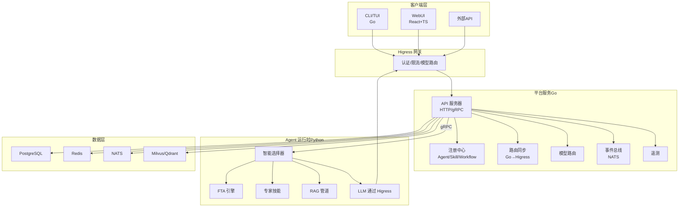
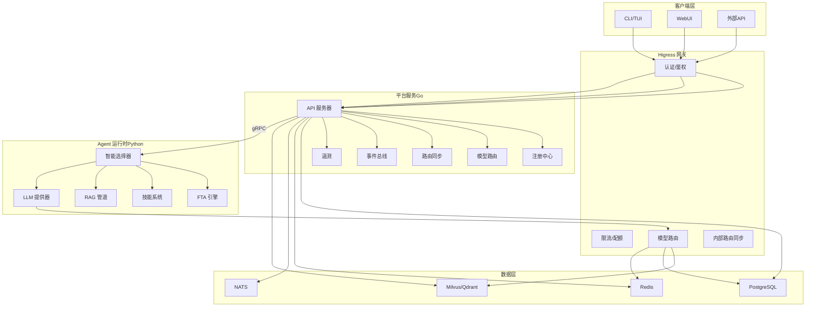
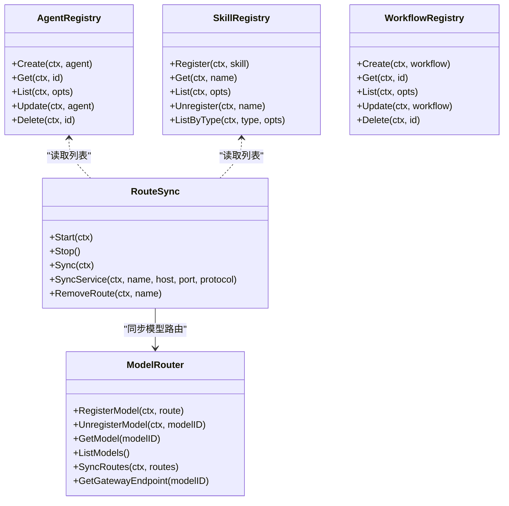
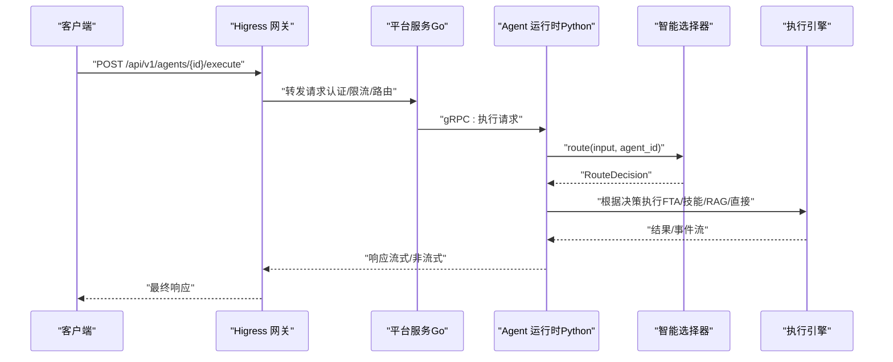
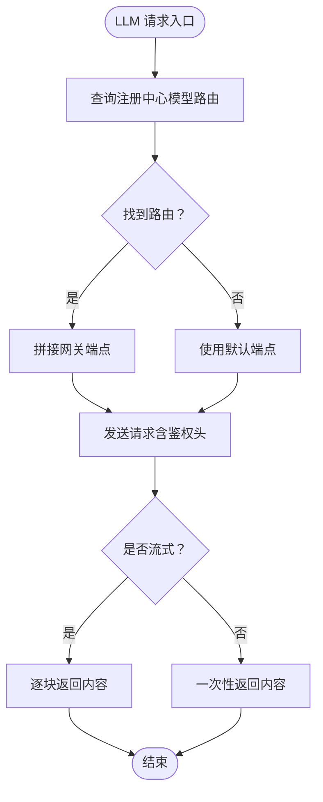
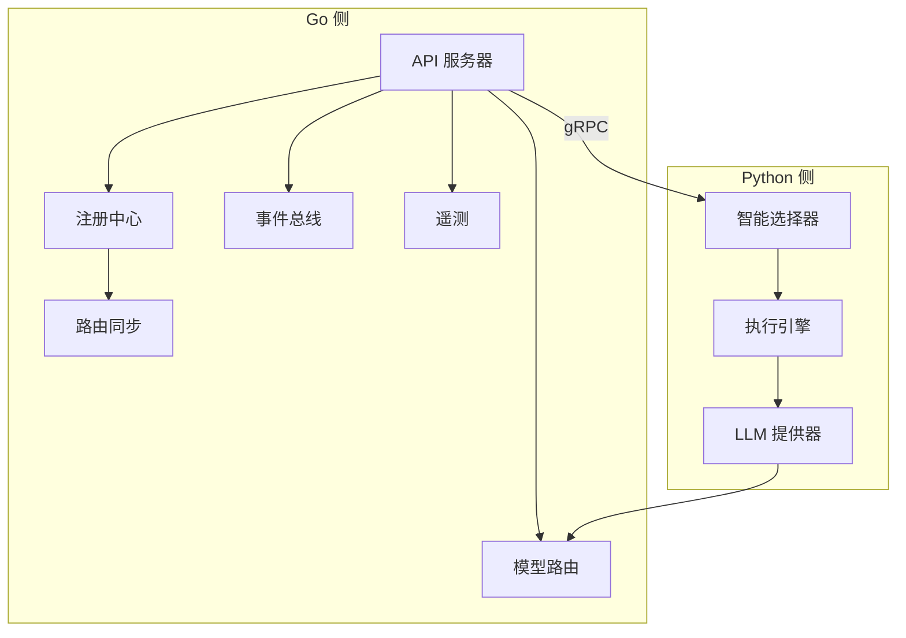

# 系统架构

<cite>
**本文引用的文件**
- [README.md](file://README.md)
- [go.mod](file://go.mod)
- [configs/resolveagent.yaml](file://configs/resolveagent.yaml)
- [deploy/docker-compose/docker-compose.yaml](file://deploy/docker-compose/docker-compose.yaml)
- [deploy/helm/resolveagent/values.yaml](file://deploy/helm/resolveagent/values.yaml)
- [pkg/gateway/model_router.go](file://pkg/gateway/model_router.go)
- [pkg/gateway/route_sync.go](file://pkg/gateway/route_sync.go)
- [pkg/registry/agent.go](file://pkg/registry/agent.go)
- [pkg/registry/skill.go](file://pkg/registry/skill.go)
- [pkg/registry/workflow.go](file://pkg/registry/workflow.go)
- [python/src/resolveagent/runtime/engine.py](file://python/src/resolveagent/runtime/engine.py)
- [python/src/resolveagent/selector/selector.py](file://python/src/resolveagent/selector/selector.py)
- [python/src/resolveagent/llm/higress_provider.py](file://python/src/resolveagent/llm/higress_provider.py)
- [internal/cli/root.go](file://internal/cli/root.go)
- [internal/tui/app.go](file://internal/tui/app.go)
</cite>

## 目录
1. [引言](#引言)
2. [项目结构](#项目结构)
3. [核心组件](#核心组件)
4. [架构总览](#架构总览)
5. [详细组件分析](#详细组件分析)
6. [依赖关系分析](#依赖关系分析)
7. [性能考量](#性能考量)
8. [故障排查指南](#故障排查指南)
9. [结论](#结论)
10. [附录](#附录)

## 引言
ResolveAgent 是一个面向问题解决的 AIOps 智能体平台，采用分层架构设计：客户端层（CLI/TUI、WebUI、外部 API）、Higress AI 网关、平台服务（Go）、Agent 运行时（Python）与数据层。其关键设计决策包括：
- Go 注册中心作为“单一真相源”，统一管理 Agent、技能、工作流等元数据；
- Higress 负责外部认证、限流、模型路由与内部 gRPC 路由同步；
- 智能选择器在运行时进行内部路由决策，连接 FTA、技能与 RAG 等执行引擎；
- 所有 LLM 调用统一经由 Higress 网关，实现集中式流量治理。

该文档将系统化阐述架构设计、组件交互流程、数据流与集成模式，并给出部署拓扑与可扩展性建议。

## 项目结构
ResolveAgent 采用多语言混合架构：
- 平台服务（Go）：提供 HTTP/gRPC API、注册中心、路由同步、可观测性与基础设施集成；
- Agent 运行时（Python）：包含智能选择器、FTA 引擎、技能系统、RAG 管道与 LLM 提供器；
- 客户端层：CLI/TUI（Go）、WebUI（React+TS）、外部 API；
- 数据层：PostgreSQL、Redis、NATS、向量数据库（Milvus/Qdrant）。

图表来源
- [README.md:442-510](file://README.md#L442-L510)
- [configs/resolveagent.yaml:27-63](file://configs/resolveagent.yaml#L27-L63)
- [pkg/gateway/route_sync.go:13-130](file://pkg/gateway/route_sync.go#L13-L130)
- [pkg/gateway/model_router.go:52-264](file://pkg/gateway/model_router.go#L52-L264)
- [python/src/resolveagent/runtime/engine.py:18-717](file://python/src/resolveagent/runtime/engine.py#L18-L717)
- [python/src/resolveagent/selector/selector.py:80-308](file://python/src/resolveagent/selector/selector.py#L80-L308)
- [python/src/resolveagent/llm/higress_provider.py:21-429](file://python/src/resolveagent/llm/higress_provider.py#L21-L429)

章节来源
- [README.md:438-531](file://README.md#L438-L531)
- [deploy/docker-compose/docker-compose.yaml:22-232](file://deploy/docker-compose/docker-compose.yaml#L22-L232)
- [deploy/helm/resolveagent/values.yaml:1-66](file://deploy/helm/resolveagent/values.yaml#L1-L66)

## 核心组件
- 平台服务（Go）
  - API 服务器：提供 HTTP/gRPC 接口，承载注册中心与基础设施服务；
  - 注册中心：统一存储 Agent、技能、工作流等元数据，作为“单一真相源”；
  - 路由同步：将注册中心中的服务路由同步至 Higress 网关；
  - 模型路由：集中管理 LLM 路由、限流与故障转移；
  - 事件总线与遥测：基于 NATS 与 OpenTelemetry。
- Agent 运行时（Python）
  - 智能选择器：意图分析、上下文增强与路由决策；
  - 执行引擎：编排工作流、技能与 RAG；
  - LLM 提供器：统一通过 Higress 网关访问多提供商模型；
  - FTA 引擎、技能系统、RAG 管道。
- 客户端层
  - CLI/TUI：Go 实现，提供命令行与终端界面；
  - WebUI：React+TS，提供管理控制台与可视化编辑器；
  - 外部 API：通过 Higress 网关接入平台能力。
- 数据层
  - PostgreSQL：持久化注册中心与业务数据；
  - Redis：缓存与会话；
  - NATS：事件总线；
  - Milvus/Qdrant：向量检索。

章节来源
- [README.md:512-520](file://README.md#L512-L520)
- [configs/resolveagent.yaml:5-90](file://configs/resolveagent.yaml#L5-L90)
- [pkg/registry/agent.go:21-105](file://pkg/registry/agent.go#L21-L105)
- [pkg/registry/skill.go:25-97](file://pkg/registry/skill.go#L25-L97)
- [pkg/registry/workflow.go:19-94](file://pkg/registry/workflow.go#L19-L94)

## 架构总览
ResolveAgent 的分层架构强调“外部由 Higress 统一治理，内部由 Go 注册中心与 Python 智能选择器协同”。下图展示了从客户端到数据层的全链路交互：

图表来源
- [README.md:442-510](file://README.md#L442-L510)
- [pkg/gateway/route_sync.go:108-130](file://pkg/gateway/route_sync.go#L108-L130)
- [pkg/gateway/model_router.go:145-203](file://pkg/gateway/model_router.go#L145-L203)
- [python/src/resolveagent/runtime/engine.py:18-717](file://python/src/resolveagent/runtime/engine.py#L18-L717)
- [python/src/resolveagent/llm/higress_provider.py:122-147](file://python/src/resolveagent/llm/higress_provider.py#L122-L147)

## 详细组件分析

### Go 注册中心与路由同步
- 注册中心职责
  - 统一存储 Agent、技能、工作流等定义，作为“单一真相源”；
  - 支持内存与 Postgres 存储后端，便于开发与生产切换。
- 路由同步
  - 定期将平台 API、Agent 与技能路由同步至 Higress；
  - 支持动态增删改，确保网关路由与注册中心一致；
  - 内置健康检查与负载均衡策略。

图表来源
- [pkg/registry/agent.go:21-105](file://pkg/registry/agent.go#L21-L105)
- [pkg/registry/skill.go:25-97](file://pkg/registry/skill.go#L25-L97)
- [pkg/registry/workflow.go:19-94](file://pkg/registry/workflow.go#L19-L94)
- [pkg/gateway/route_sync.go:17-63](file://pkg/gateway/route_sync.go#L17-L63)
- [pkg/gateway/model_router.go:52-86](file://pkg/gateway/model_router.go#L52-L86)

章节来源
- [pkg/registry/agent.go:21-105](file://pkg/registry/agent.go#L21-L105)
- [pkg/registry/skill.go:25-97](file://pkg/registry/skill.go#L25-L97)
- [pkg/registry/workflow.go:19-94](file://pkg/registry/workflow.go#L19-L94)
- [pkg/gateway/route_sync.go:108-130](file://pkg/gateway/route_sync.go#L108-L130)
- [pkg/gateway/model_router.go:145-203](file://pkg/gateway/model_router.go#L145-L203)

### 智能选择器与执行引擎
- 智能选择器
  - 三层路由管线：意图分析 → 上下文增强 → 路由决策；
  - 支持 LLM、规则与混合策略，具备缓存与置信度评分；
  - 输出统一的路由决策对象，驱动后续执行。
- 执行引擎
  - 创建执行上下文，加载 Agent，触发智能选择器；
  - 支持流式与非流式响应，集成生命周期钩子与持久化记忆；
  - 对接 FTA、技能与 RAG 执行路径。

图表来源
- [python/src/resolveagent/runtime/engine.py:53-250](file://python/src/resolveagent/runtime/engine.py#L53-L250)
- [python/src/resolveagent/selector/selector.py:162-216](file://python/src/resolveagent/selector/selector.py#L162-L216)
- [pkg/gateway/route_sync.go:206-241](file://pkg/gateway/route_sync.go#L206-L241)

章节来源
- [python/src/resolveagent/selector/selector.py:80-308](file://python/src/resolveagent/selector/selector.py#L80-L308)
- [python/src/resolveagent/runtime/engine.py:18-717](file://python/src/resolveagent/runtime/engine.py#L18-L717)

### LLM 提供器与 Higress 集成
- Higress LLM 提供器
  - 统一通过网关访问多提供商模型（Qwen、Wenxin、Zhipu 等）；
  - 支持流式与非流式响应，自动注入鉴权头；
  - 优先从注册中心查询模型路由，降级使用默认路径。
- 模型路由
  - 集中式限流、故障转移与路径重写；
  - 支持按模型/租户维度的令牌与请求数限制。

图表来源
- [python/src/resolveagent/llm/higress_provider.py:122-147](file://python/src/resolveagent/llm/higress_provider.py#L122-L147)
- [python/src/resolveagent/llm/higress_provider.py:148-288](file://python/src/resolveagent/llm/higress_provider.py#L148-L288)
- [pkg/gateway/model_router.go:205-250](file://pkg/gateway/model_router.go#L205-L250)

章节来源
- [python/src/resolveagent/llm/higress_provider.py:21-429](file://python/src/resolveagent/llm/higress_provider.py#L21-L429)
- [pkg/gateway/model_router.go:52-264](file://pkg/gateway/model_router.go#L52-L264)

### 客户端层（CLI/TUI、WebUI、外部 API）
- CLI/TUI（Go）
  - 基于 Cobra 构建命令体系，支持代理管理、技能安装、工作流执行等；
  - 初始化配置与环境变量绑定，便于本地与 CI 环境使用。
- WebUI（React+TS）
  - 提供管理控制台、工作流可视化编辑器与数据面板；
  - 与平台 API 协同，实现前端到后端的完整闭环。
- 外部 API
  - 通过 Higress 网关统一接入，具备认证、限流与模型路由能力。

章节来源
- [internal/cli/root.go:20-74](file://internal/cli/root.go#L20-L74)
- [internal/tui/app.go:20-102](file://internal/tui/app.go#L20-L102)
- [README.md:442-510](file://README.md#L442-L510)

## 依赖关系分析
- 组件耦合与内聚
  - Go 注册中心与 Higress 路由同步紧密耦合，确保路由一致性；
  - Python 运行时通过 gRPC 与 Go 平台交互，接口清晰、职责明确；
  - LLM 提供器与 Higress 解耦，便于替换与扩展。
- 外部依赖
  - Go 项目依赖 PostgreSQL、Redis、NATS、OpenTelemetry 等生态组件；
  - Python 运行时依赖 HTTP 客户端与异步运行时，与网关通信稳定可靠。

图表来源
- [go.mod:5-15](file://go.mod#L5-L15)
- [pkg/gateway/route_sync.go:17-63](file://pkg/gateway/route_sync.go#L17-L63)
- [python/src/resolveagent/runtime/engine.py:18-717](file://python/src/resolveagent/runtime/engine.py#L18-L717)

章节来源
- [go.mod:1-90](file://go.mod#L1-90)

## 性能考量
- 平台服务（Go）
  - HTTP/GRPC 服务参数、数据库连接池与 Redis 连接池配置可调；
  - 启用 OpenTelemetry 进行链路追踪与指标导出，便于性能观测。
- Agent 运行时（Python）
  - 工作进程数、并发任务上限与任务超时可配置；
  - LLM 请求超时、重试次数与延迟可调，提升稳定性。
- 网关与路由
  - Higress 提供集中式限流、故障转移与路径重写，降低后端压力；
  - 路由同步周期可配置，平衡一致性与开销。

章节来源
- [configs/resolveagent.yaml:64-90](file://configs/resolveagent.yaml#L64-L90)
- [python/src/resolveagent/runtime/engine.py:691-717](file://python/src/resolveagent/runtime/engine.py#L691-L717)
- [pkg/gateway/model_router.go:145-203](file://pkg/gateway/model_router.go#L145-L203)

## 故障排查指南
- 网关与路由
  - 若路由未生效，检查路由同步是否成功、Higress 管理端口与凭据；
  - 模型路由异常时，确认模型路由表与网关端点映射。
- 平台服务
  - 查看平台服务日志与健康检查端点，确认数据库、Redis、NATS 可达；
  - 检查 OpenTelemetry 配置与导出端点。
- 运行时
  - 智能选择器缓存命中率低时，调整缓存 TTL 与容量；
  - LLM 流式失败时，回退到非流式模式并记录错误。
- 客户端
  - CLI/TUI 无法连接平台时，检查服务器地址与配置文件；
  - WebUI 无法加载数据时，确认平台 API 可用与网关转发正常。

章节来源
- [configs/resolveagent.yaml:27-63](file://configs/resolveagent.yaml#L27-L63)
- [pkg/gateway/route_sync.go:70-87](file://pkg/gateway/route_sync.go#L70-L87)
- [python/src/resolveagent/llm/higress_provider.py:208-216](file://python/src/resolveagent/llm/higress_provider.py#L208-L216)

## 结论
ResolveAgent 通过“Go 注册中心 + Higress 网关 + Python 运行时”的分层设计，实现了外部治理与内部编排的解耦。Go 层负责统一的元数据与路由管理，Python 层聚焦智能路由与多引擎执行，形成高可用、可扩展且易于运维的 AIOps 智能体平台。结合 Helm 与 Docker Compose 的部署方案，可在本地与生产环境中快速落地。

## 附录
- 基础设施要求
  - Go 1.22+、Python 3.11+、Docker 20.10+、Docker Compose 2.0+、Node.js 20+（可选）。
- 部署拓扑
  - Docker Compose：一键启动平台、运行时、WebUI 与基础设施；
  - Helm：生产级部署，支持副本数、资源限制与自动扩缩容。
- 环境变量与密钥
  - 平台服务与运行时均支持环境变量注入，推荐使用 Kubernetes Secret 管理 API Key。

章节来源
- [README.md:78-124](file://README.md#L78-L124)
- [deploy/docker-compose/docker-compose.yaml:22-232](file://deploy/docker-compose/docker-compose.yaml#L22-L232)
- [deploy/helm/resolveagent/values.yaml:1-66](file://deploy/helm/resolveagent/values.yaml#L1-L66)