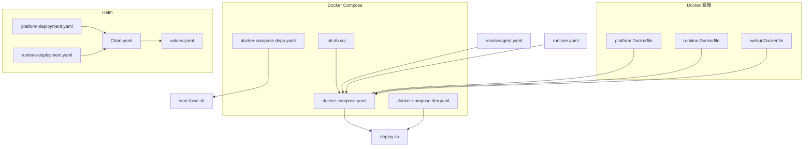
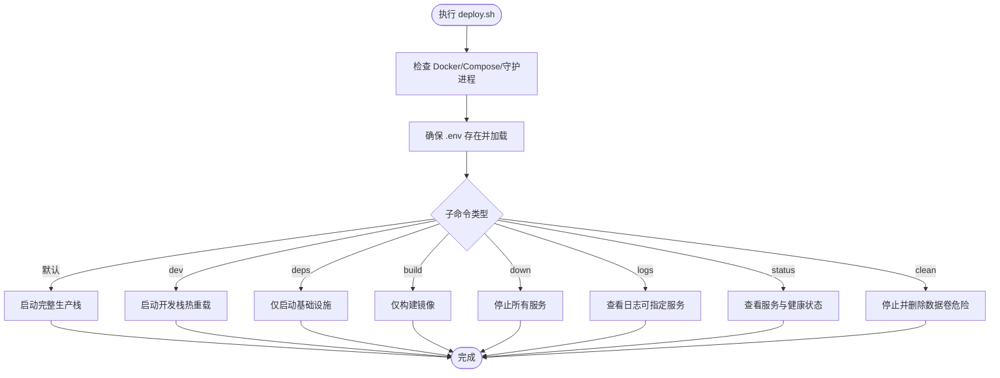
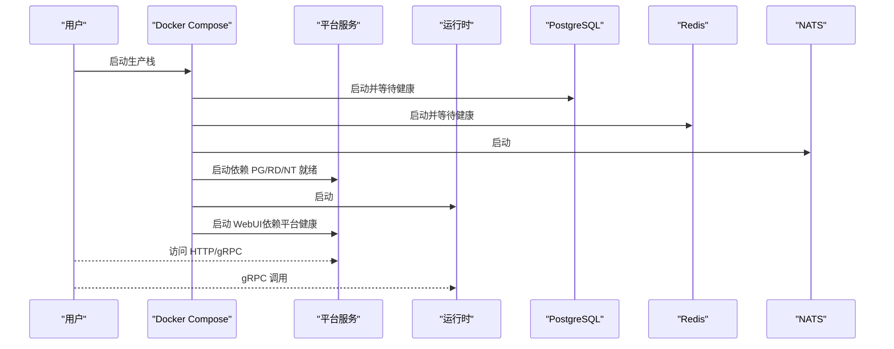
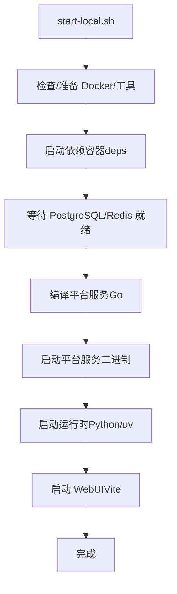
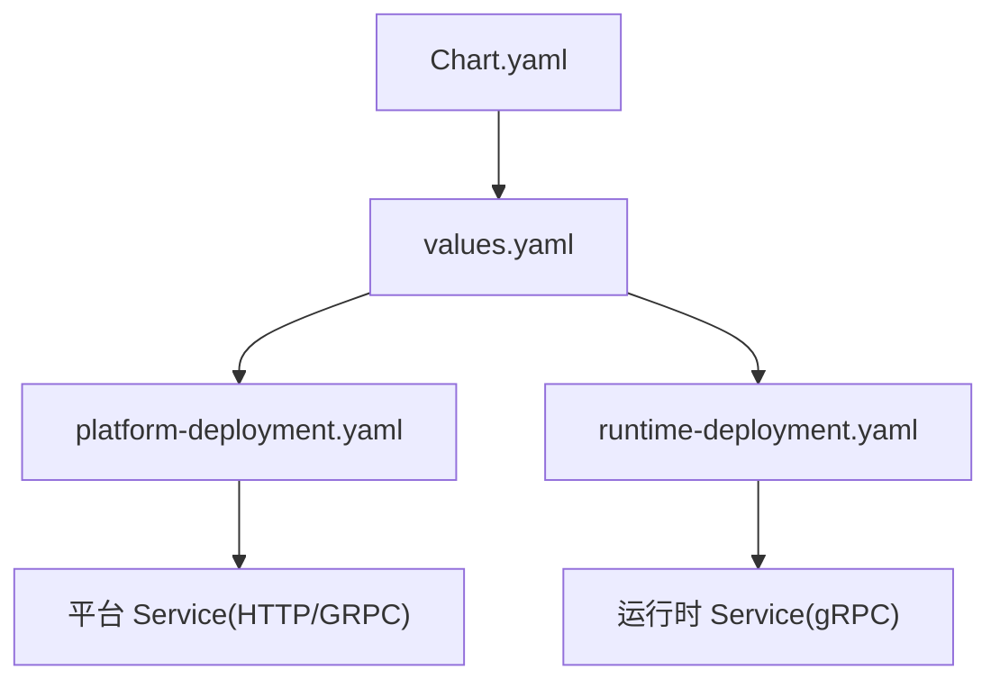
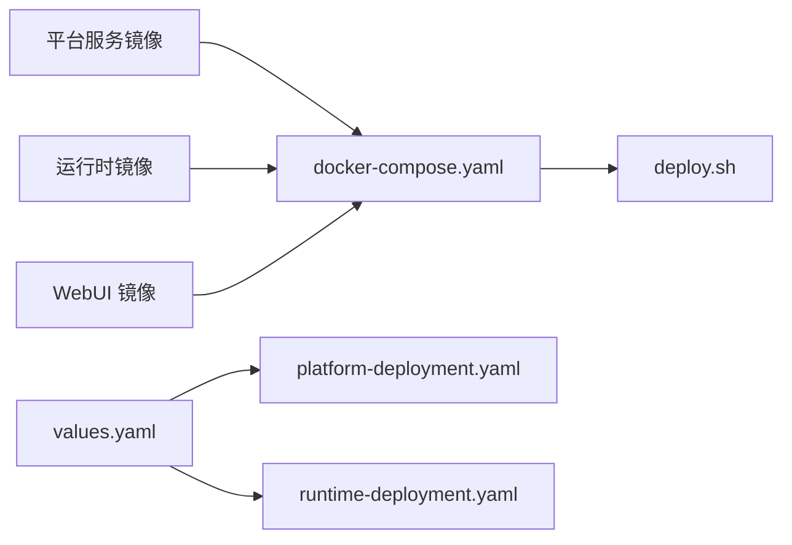

# 部署与运维

<cite>
**本文引用的文件**
- [deploy.sh](file://deploy/docker/deploy.sh)
- [docker-compose.yaml](file://deploy/docker-compose/docker-compose.yaml)
- [docker-compose.dev.yaml](file://deploy/docker-compose/docker-compose.dev.yaml)
- [docker-compose.deps.yaml](file://deploy/docker-compose/docker-compose.deps.yaml)
- [platform.Dockerfile](file://deploy/docker/platform.Dockerfile)
- [runtime.Dockerfile](file://deploy/docker/runtime.Dockerfile)
- [webui.Dockerfile](file://deploy/docker/webui.Dockerfile)
- [init-db.sql](file://deploy/docker/init-db.sql)
- [Chart.yaml](file://deploy/helm/resolveagent/Chart.yaml)
- [values.yaml](file://deploy/helm/resolveagent/values.yaml)
- [platform-deployment.yaml](file://deploy/helm/resolveagent/templates/platform-deployment.yaml)
- [runtime-deployment.yaml](file://deploy/helm/resolveagent/templates/runtime-deployment.yaml)
- [resolveagent.yaml](file://configs/resolveagent.yaml)
- [runtime.yaml](file://configs/runtime.yaml)
- [start-local.sh](file://scripts/start-local.sh)
- [deployment.md](file://docs/zh/deployment.md)
- [local-deployment.md](file://docs/zh/local-deployment.md)
</cite>

## 目录
1. [简介](#简介)
2. [项目结构](#项目结构)
3. [核心组件](#核心组件)
4. [架构总览](#架构总览)
5. [详细组件分析](#详细组件分析)
6. [依赖关系分析](#依赖关系分析)
7. [性能考虑](#性能考虑)
8. [故障排查指南](#故障排查指南)
9. [结论](#结论)
10. [附录](#附录)

## 简介
本指南面向 ResolveAgent 项目的部署与运维团队，覆盖 Docker 容器化部署、Kubernetes Helm Charts 配置与本地开发环境设置，提供生产环境最佳实践、监控告警、日志收集、性能调优、安全配置、密钥管理、自动扩缩容与灾难恢复策略。文档以仓库内现有部署脚本、Compose 与 Helm 模板、配置文件及中文运维文档为基础，结合代码级可视化图示，帮助读者快速落地并稳定运行 ResolveAgent。

## 项目结构
ResolveAgent 的部署相关资产主要分布在以下位置：
- deploy/docker：单体 Docker 镜像构建与一键部署脚本
- deploy/docker-compose：多服务编排（生产/开发/依赖）
- deploy/helm：Helm Chart（Chart.yaml、values.yaml、模板）
- configs：平台与运行时配置
- scripts：本地一键启动脚本
- docs/zh：中文部署与本地部署指南



图表来源
- [platform.Dockerfile:1-61](file://deploy/docker/platform.Dockerfile#L1-L61)
- [runtime.Dockerfile:1-64](file://deploy/docker/runtime.Dockerfile#L1-L64)
- [webui.Dockerfile:1-47](file://deploy/docker/webui.Dockerfile#L1-L47)
- [docker-compose.yaml:1-232](file://deploy/docker-compose/docker-compose.yaml#L1-L232)
- [docker-compose.dev.yaml:1-74](file://deploy/docker-compose/docker-compose.dev.yaml#L1-L74)
- [docker-compose.deps.yaml:1-37](file://deploy/docker-compose/docker-compose.deps.yaml#L1-L37)
- [init-db.sql:1-171](file://deploy/docker/init-db.sql#L1-L171)
- [Chart.yaml:1-18](file://deploy/helm/resolveagent/Chart.yaml#L1-L18)
- [values.yaml:1-66](file://deploy/helm/resolveagent/values.yaml#L1-L66)
- [platform-deployment.yaml:1-39](file://deploy/helm/resolveagent/templates/platform-deployment.yaml#L1-L39)
- [runtime-deployment.yaml:1-27](file://deploy/helm/resolveagent/templates/runtime-deployment.yaml#L1-L27)
- [resolveagent.yaml:1-90](file://configs/resolveagent.yaml#L1-L90)
- [runtime.yaml:1-35](file://configs/runtime.yaml#L1-L35)
- [deploy.sh:1-257](file://deploy/docker/deploy.sh#L1-L257)
- [start-local.sh:1-383](file://scripts/start-local.sh#L1-L383)

章节来源
- [deploy.sh:1-257](file://deploy/docker/deploy.sh#L1-L257)
- [docker-compose.yaml:1-232](file://deploy/docker-compose/docker-compose.yaml#L1-L232)
- [docker-compose.dev.yaml:1-74](file://deploy/docker-compose/docker-compose.dev.yaml#L1-L74)
- [docker-compose.deps.yaml:1-37](file://deploy/docker-compose/docker-compose.deps.yaml#L1-L37)
- [Chart.yaml:1-18](file://deploy/helm/resolveagent/Chart.yaml#L1-L18)
- [values.yaml:1-66](file://deploy/helm/resolveagent/values.yaml#L1-L66)
- [platform-deployment.yaml:1-39](file://deploy/helm/resolveagent/templates/platform-deployment.yaml#L1-L39)
- [runtime-deployment.yaml:1-27](file://deploy/helm/resolveagent/templates/runtime-deployment.yaml#L1-L27)
- [resolveagent.yaml:1-90](file://configs/resolveagent.yaml#L1-L90)
- [runtime.yaml:1-35](file://configs/runtime.yaml#L1-L35)
- [start-local.sh:1-383](file://scripts/start-local.sh#L1-L383)

## 核心组件
- 平台服务（Go）：提供 HTTP/gRPC API、注册表管理、网关集成与健康检查。
- Agent 运行时（Python）：基于 AgentScope 的智能选择器、FTA 引擎、技能执行与 gRPC 服务。
- WebUI（React+Nginx）：前端仪表盘，静态资源由 Nginx 提供。
- 基础设施：PostgreSQL（数据库）、Redis（缓存/会话）、NATS（消息总线）。
- 可选组件：Milvus（向量检索，开发/演示）。

章节来源
- [docker-compose.yaml:27-134](file://deploy/docker-compose/docker-compose.yaml#L27-L134)
- [platform.Dockerfile:1-61](file://deploy/docker/platform.Dockerfile#L1-L61)
- [runtime.Dockerfile:1-64](file://deploy/docker/runtime.Dockerfile#L1-L64)
- [webui.Dockerfile:1-47](file://deploy/docker/webui.Dockerfile#L1-L47)

## 架构总览
ResolveAgent 采用“平台服务 + 运行时 + 基础设施”的三层架构。平台服务负责 API 与注册表，运行时负责技能执行与选择策略，WebUI 提供可视化操作入口；平台与运行时通过 gRPC 交互，平台与数据库、缓存、消息总线交互。

```mermaid
graph TB
UI["WebUI(HTTP:80)"] --> PF["平台服务(HTTP:8080,gRPC:9090)"]
PF <- --> DB["PostgreSQL(:5432)"]
PF <- --> RC["Redis(:6379)"]
PF <- --> NB["NATS(:4222)"]
PF < --> RT["Agent 运行时(gRPC:9091)"]
RT --> LLMS["LLM 提供商 API"]
```

图表来源
- [docker-compose.yaml:27-134](file://deploy/docker-compose/docker-compose.yaml#L27-L134)
- [resolveagent.yaml:5-26](file://configs/resolveagent.yaml#L5-L26)
- [runtime.yaml:3-6](file://configs/runtime.yaml#L3-L6)

## 详细组件分析

### Docker 一键部署脚本
- 功能：封装生产/开发/依赖/构建/停机/日志/状态/清理等常用命令。
- 依赖检查：Docker 与 Compose 插件，Docker 守护进程。
- 环境变量：自动复制 .env.example 为 .env 并加载端口与服务参数。
- 健康检查：对各服务进行健康状态汇总输出。



图表来源
- [deploy.sh:56-257](file://deploy/docker/deploy.sh#L56-L257)

章节来源
- [deploy.sh:1-257](file://deploy/docker/deploy.sh#L1-L257)

### Docker Compose 编排
- 生产编排：平台、运行时、WebUI、PostgreSQL、Redis、NATS。
- 环境变量：数据库、缓存、消息总线、网关、遥测等参数。
- 健康检查：PostgreSQL/Redis/NATS 健康探针。
- 日志轮转：各容器 json-file 驱动的大小与数量限制。



图表来源
- [docker-compose.yaml:27-134](file://deploy/docker-compose/docker-compose.yaml#L27-L134)

章节来源
- [docker-compose.yaml:1-232](file://deploy/docker-compose/docker-compose.yaml#L1-L232)

### 开发模式与依赖模式
- 开发模式：平台服务以 go run 启动并挂载源码，运行时以 uv/Python 启动，WebUI 启用 Vite 热重载，附加 Milvus。
- 依赖模式：仅启动 PostgreSQL、Redis、NATS、Milvus，便于快速验证。

章节来源
- [docker-compose.dev.yaml:1-74](file://deploy/docker-compose/docker-compose.dev.yaml#L1-L74)
- [docker-compose.deps.yaml:1-37](file://deploy/docker-compose/docker-compose.deps.yaml#L1-L37)

### 本地一键启动脚本
- 功能：启动依赖容器、等待就绪、编译并启动平台服务、启动运行时、启动 WebUI 开发服务器。
- 依赖：Docker、Go、Node.js、Python、uv/pip、psql。
- 状态与日志：统一 PID 管理与日志文件，支持 status/logs/stop。



图表来源
- [start-local.sh:118-289](file://scripts/start-local.sh#L118-L289)

章节来源
- [start-local.sh:1-383](file://scripts/start-local.sh#L1-L383)

### Helm Chart 配置
- Chart 元数据与关键字：名称、版本、维护者、源地址。
- 默认 values：平台/运行时副本数、镜像仓库/标签、资源请求/限制、Ingress/PostgreSQL/Redis/NATS 开关。
- 模板：平台与运行时 Deployment，含健康探针与端口暴露。



图表来源
- [Chart.yaml:1-18](file://deploy/helm/resolveagent/Chart.yaml#L1-L18)
- [values.yaml:1-66](file://deploy/helm/resolveagent/values.yaml#L1-L66)
- [platform-deployment.yaml:1-39](file://deploy/helm/resolveagent/templates/platform-deployment.yaml#L1-L39)
- [runtime-deployment.yaml:1-27](file://deploy/helm/resolveagent/templates/runtime-deployment.yaml#L1-L27)

章节来源
- [Chart.yaml:1-18](file://deploy/helm/resolveagent/Chart.yaml#L1-L18)
- [values.yaml:1-66](file://deploy/helm/resolveagent/values.yaml#L1-L66)
- [platform-deployment.yaml:1-39](file://deploy/helm/resolveagent/templates/platform-deployment.yaml#L1-L39)
- [runtime-deployment.yaml:1-27](file://deploy/helm/resolveagent/templates/runtime-deployment.yaml#L1-L27)

### 配置文件要点
- 平台配置（resolveagent.yaml）：HTTP/gRPC 地址、数据库/Redis/NATS 连接、网关集成（Higress）、遥测、存储后端（内存/PostgreSQL）。
- 运行时配置（runtime.yaml）：gRPC 地址、代理池大小、选择器策略与阈值、遥测、存储客户端（平台 REST）、内存配置。

章节来源
- [resolveagent.yaml:1-90](file://configs/resolveagent.yaml#L1-L90)
- [runtime.yaml:1-35](file://configs/runtime.yaml#L1-L35)

## 依赖关系分析
- 镜像构建：平台/运行时/WebUI 分别独立构建，平台与运行时分别基于 Alpine/Python slim，WebUI 基于 Nginx。
- Compose 依赖：平台服务依赖数据库/缓存/消息总线健康；WebUI 依赖平台健康；运行时依赖平台 gRPC。
- Helm 依赖：Chart.values 控制镜像、副本、资源与外部依赖开关（PostgreSQL/Redis/NATS）。



图表来源
- [platform.Dockerfile:1-61](file://deploy/docker/platform.Dockerfile#L1-L61)
- [runtime.Dockerfile:1-64](file://deploy/docker/runtime.Dockerfile#L1-L64)
- [webui.Dockerfile:1-47](file://deploy/docker/webui.Dockerfile#L1-L47)
- [docker-compose.yaml:1-232](file://deploy/docker-compose/docker-compose.yaml#L1-L232)
- [values.yaml:1-66](file://deploy/helm/resolveagent/values.yaml#L1-L66)
- [platform-deployment.yaml:1-39](file://deploy/helm/resolveagent/templates/platform-deployment.yaml#L1-L39)
- [runtime-deployment.yaml:1-27](file://deploy/helm/resolveagent/templates/runtime-deployment.yaml#L1-L27)

章节来源
- [platform.Dockerfile:1-61](file://deploy/docker/platform.Dockerfile#L1-L61)
- [runtime.Dockerfile:1-64](file://deploy/docker/runtime.Dockerfile#L1-L64)
- [webui.Dockerfile:1-47](file://deploy/docker/webui.Dockerfile#L1-L47)
- [docker-compose.yaml:1-232](file://deploy/docker-compose/docker-compose.yaml#L1-L232)
- [values.yaml:1-66](file://deploy/helm/resolveagent/values.yaml#L1-L66)
- [platform-deployment.yaml:1-39](file://deploy/helm/resolveagent/templates/platform-deployment.yaml#L1-L39)
- [runtime-deployment.yaml:1-27](file://deploy/helm/resolveagent/templates/runtime-deployment.yaml#L1-L27)

## 性能考虑
- 资源配额：Helm values 中为平台与运行时设置了 CPU/内存请求与限制，建议根据并发与模型吞吐调整。
- 代理池与选择器：运行时代理池最大容量与选择器置信度阈值影响响应时间与准确性，应结合业务负载调优。
- 数据库与缓存：PostgreSQL/Redis 合理的 maxmemory 与持久化策略，避免 OOM 与写放大。
- 网络与消息：NATS JetStream 的存储目录与监控端口，建议隔离网络与资源。
- 前端构建：WebUI 使用 Nginx 静态托管，建议启用压缩与缓存头。

章节来源
- [values.yaml:12-34](file://deploy/helm/resolveagent/values.yaml#L12-L34)
- [runtime.yaml:7-13](file://configs/runtime.yaml#L7-L13)
- [docker-compose.yaml:167-210](file://deploy/docker-compose/docker-compose.yaml#L167-L210)

## 故障排查指南
- 依赖未就绪：PostgreSQL/Redis 未 ready 会导致平台/运行时启动失败，使用 status/logs 定位。
- 端口冲突：若 5432/6379/8080/9090/9091 被占用，修改 .env 与配置文件中的端口映射。
- 数据库初始化：本地开发模式需手动执行迁移脚本，确保迁移顺序与权限正确。
- 镜像与版本：Helm values 中镜像 tag 为空时使用 Chart.appVersion，确保镜像仓库可达与权限正确。
- 日志收集：Docker 容器日志驱动为 json-file，注意轮转策略；生产建议接入集中式日志栈。
- 健康检查：平台/运行时均内置健康探针，异常时优先检查依赖服务健康状态。

章节来源
- [deployment.md:610-657](file://docs/zh/deployment.md#L610-L657)
- [local-deployment.md:310-352](file://docs/zh/local-deployment.md#L310-L352)
- [docker-compose.yaml:153-210](file://deploy/docker-compose/docker-compose.yaml#L153-L210)
- [deploy.sh:182-202](file://deploy/docker/deploy.sh#L182-L202)

## 结论
ResolveAgent 提供了从本地开发到生产部署的完整路径：Docker Compose 适合快速验证，Helm Chart 适配规模化与自动化运维；平台与运行时的职责清晰，配合基础设施可实现高可用与可观测性。建议在生产中结合 Helm values 的资源与副本策略、Ingress/TLS、监控告警与日志聚合，形成闭环的运维体系。

## 附录

### 生产环境部署最佳实践
- 高可用：增加平台与运行时副本数，配置 PodDisruptionBudget 与拓扑分散。
- 资源：依据业务峰值设置 CPU/内存请求与限制，避免限流与 OOM。
- 网络：启用 Ingress 与 TLS，配置网络策略限制出入口。
- 存储：PostgreSQL/Redis 使用持久化卷，定期备份与校验。
- 安全：Secret 管理（External Secrets/Sealed Secrets），RBAC 与 Pod 安全基线。

章节来源
- [deployment.md:347-446](file://docs/zh/deployment.md#L347-L446)

### 监控告警与日志
- 指标：Prometheus ServiceMonitor 收集平台与运行时指标。
- 日志：EFK/PLG 栈采集容器与应用日志。
- 链路追踪：OTLP 导出至 Jaeger 等后端，生产降低采样率。

章节来源
- [deployment.md:449-508](file://docs/zh/deployment.md#L449-L508)

### 自动扩缩容与灾难恢复
- 水平扩展：HPA 基于 CPU/内存或自定义指标，结合副本数策略。
- 蓝绿/金丝雀：借助 Ingress/Istio 实现灰度发布与回滚。
- 备份：PostgreSQL/pg_dump、Milvus 备份工具、CronJob 定时任务。

章节来源
- [deployment.md:558-607](file://docs/zh/deployment.md#L558-L607)
- [deployment.md:511-555](file://docs/zh/deployment.md#L511-L555)

### 安全配置与密钥管理
- Secret 管理：External Secrets/Sealed Secrets 从 Vault/KMS 注入。
- RBAC：最小权限原则，限定 ConfigMap/Secret 访问范围。
- Pod 安全：只读根文件系统、非 root 用户、禁止提权。

章节来源
- [deployment.md:661-714](file://docs/zh/deployment.md#L661-L714)

### 配置模板与脚本清单
- Docker 镜像构建：platform.Dockerfile、runtime.Dockerfile、webui.Dockerfile。
- Compose 编排：docker-compose.yaml、docker-compose.dev.yaml、docker-compose.deps.yaml、init-db.sql。
- Helm Chart：Chart.yaml、values.yaml、platform-deployment.yaml、runtime-deployment.yaml。
- 平台/运行时配置：resolveagent.yaml、runtime.yaml。
- 一键脚本：deploy.sh、start-local.sh。

章节来源
- [platform.Dockerfile:1-61](file://deploy/docker/platform.Dockerfile#L1-L61)
- [runtime.Dockerfile:1-64](file://deploy/docker/runtime.Dockerfile#L1-L64)
- [webui.Dockerfile:1-47](file://deploy/docker/webui.Dockerfile#L1-L47)
- [docker-compose.yaml:1-232](file://deploy/docker-compose/docker-compose.yaml#L1-L232)
- [docker-compose.dev.yaml:1-74](file://deploy/docker-compose/docker-compose.dev.yaml#L1-L74)
- [docker-compose.deps.yaml:1-37](file://deploy/docker-compose/docker-compose.deps.yaml#L1-L37)
- [init-db.sql:1-171](file://deploy/docker/init-db.sql#L1-L171)
- [Chart.yaml:1-18](file://deploy/helm/resolveagent/Chart.yaml#L1-L18)
- [values.yaml:1-66](file://deploy/helm/resolveagent/values.yaml#L1-L66)
- [platform-deployment.yaml:1-39](file://deploy/helm/resolveagent/templates/platform-deployment.yaml#L1-L39)
- [runtime-deployment.yaml:1-27](file://deploy/helm/resolveagent/templates/runtime-deployment.yaml#L1-L27)
- [resolveagent.yaml:1-90](file://configs/resolveagent.yaml#L1-L90)
- [runtime.yaml:1-35](file://configs/runtime.yaml#L1-L35)
- [deploy.sh:1-257](file://deploy/docker/deploy.sh#L1-L257)
- [start-local.sh:1-383](file://scripts/start-local.sh#L1-L383)