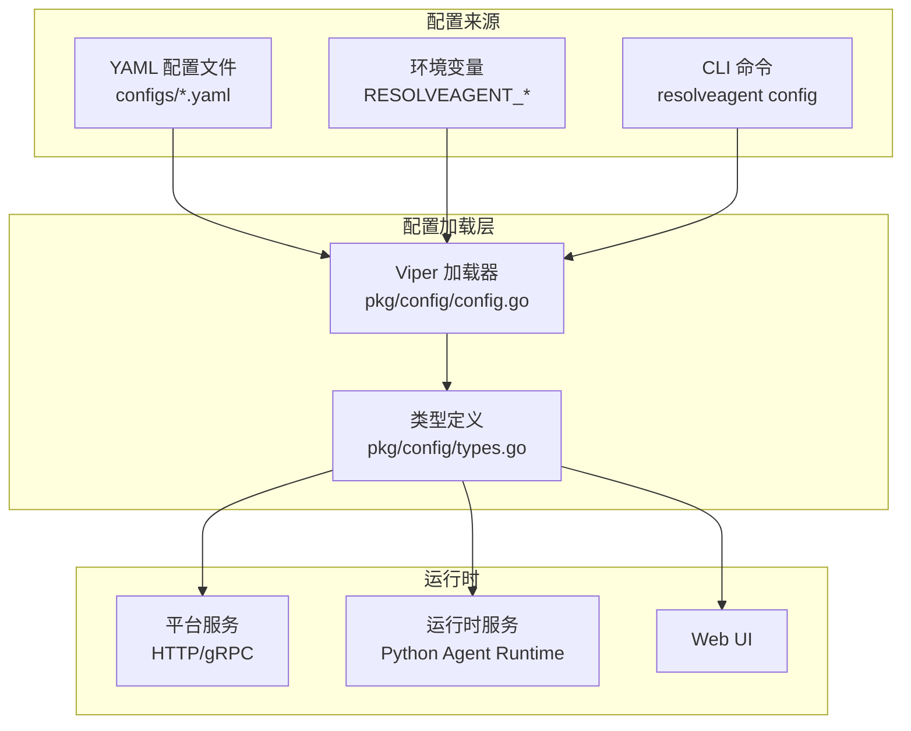
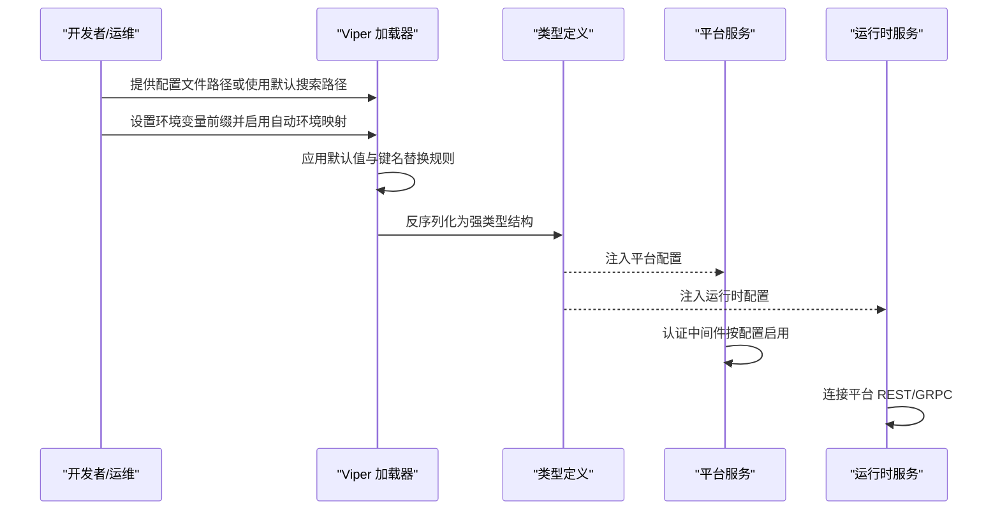
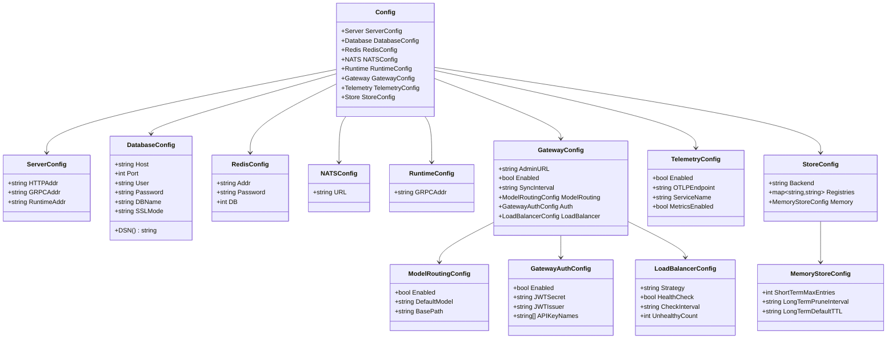
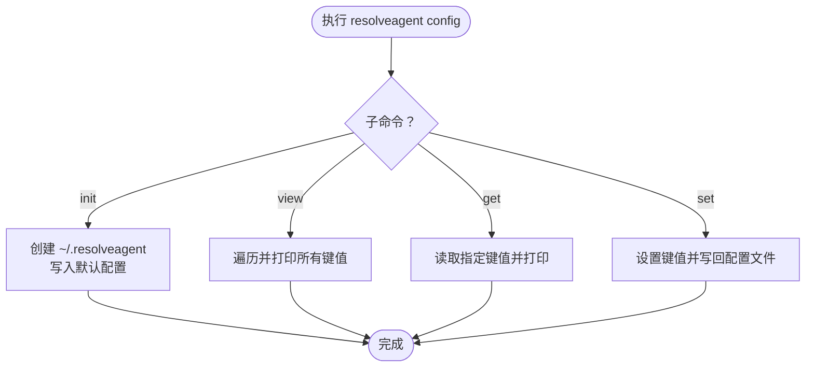
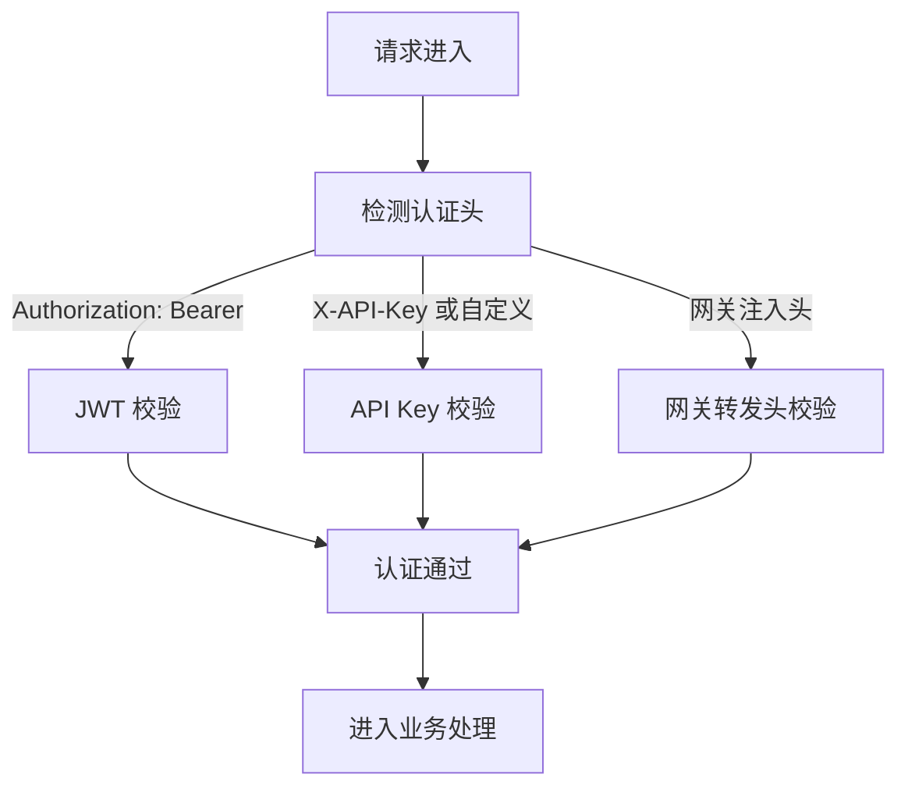

# 配置管理

<cite>
**本文引用的文件**
- [configs/resolveagent.yaml](file://configs/resolveagent.yaml)
- [configs/runtime.yaml](file://configs/runtime.yaml)
- [configs/models.yaml](file://configs/models.yaml)
- [configs/examples/agent-example.yaml](file://configs/examples/agent-example.yaml)
- [configs/examples/workflow-fta-example.yaml](file://configs/examples/workflow-fta-example.yaml)
- [configs/examples/skill-example.yaml](file://configs/examples/skill-example.yaml)
- [pkg/config/config.go](file://pkg/config/config.go)
- [pkg/config/types.go](file://pkg/config/types.go)
- [internal/cli/config/config.go](file://internal/cli/config/config.go)
- [deploy/docker-compose/docker-compose.yaml](file://deploy/docker-compose/docker-compose.yaml)
- [deploy/docker-compose/docker-compose.dev.yaml](file://deploy/docker-compose/docker-compose.dev.yaml)
- [deploy/helm/resolveagent/values.yaml](file://deploy/helm/resolveagent/values.yaml)
- [pkg/server/middleware/auth.go](file://pkg/server/middleware/auth.go)
</cite>

## 目录
1. [简介](#简介)
2. [项目结构](#项目结构)
3. [核心组件](#核心组件)
4. [架构总览](#架构总览)
5. [详细组件分析](#详细组件分析)
6. [依赖关系分析](#依赖关系分析)
7. [性能考量](#性能考量)
8. [故障排除指南](#故障排除指南)
9. [结论](#结论)
10. [附录](#附录)

## 简介
本文件系统性阐述 ResolveAgent 的配置管理体系，涵盖平台配置、运行时配置、环境变量映射、安全配置与密钥管理、生产最佳实践、配置热更新与验证机制，以及多部署场景的配置示例与排障建议。目标是帮助平台管理员与开发者在不同环境中快速、安全地完成配置与运维。

## 项目结构
ResolveAgent 的配置由“配置文件 + 环境变量 + CLI 工具”三部分组成，并通过统一的加载器解析为强类型结构体，供服务启动与运行使用。

图表来源
- [pkg/config/config.go:10-72](file://pkg/config/config.go#L10-L72)
- [pkg/config/types.go:5-115](file://pkg/config/types.go#L5-L115)
- [deploy/docker-compose/docker-compose.yaml:39-106](file://deploy/docker-compose/docker-compose.yaml#L39-L106)

章节来源
- [pkg/config/config.go:10-72](file://pkg/config/config.go#L10-L72)
- [pkg/config/types.go:5-115](file://pkg/config/types.go#L5-L115)

## 核心组件
- 配置加载器：基于 Viper，支持 YAML 文件与环境变量混合加载，具备默认值设置与键名替换规则。
- 类型定义：以结构体形式描述平台、运行时、存储、网关、遥测等配置域，确保类型安全与可读性。
- CLI 配置工具：提供初始化、查看、获取、设置配置的能力，便于本地开发与运维。
- 安全中间件：认证配置（JWT、API Key、网关转发头）在平台服务中生效，保障访问控制。

章节来源
- [pkg/config/config.go:10-72](file://pkg/config/config.go#L10-L72)
- [pkg/config/types.go:5-115](file://pkg/config/types.go#L5-L115)
- [internal/cli/config/config.go:12-120](file://internal/cli/config/config.go#L12-L120)
- [pkg/server/middleware/auth.go:15-32](file://pkg/server/middleware/auth.go#L15-L32)

## 架构总览
下图展示配置从输入到服务使用的端到端流程，包括默认值、文件与环境变量覆盖、类型解包与中间件应用。

图表来源
- [pkg/config/config.go:10-72](file://pkg/config/config.go#L10-L72)
- [pkg/config/types.go:5-115](file://pkg/config/types.go#L5-L115)
- [pkg/server/middleware/auth.go:34-228](file://pkg/server/middleware/auth.go#L34-L228)

## 详细组件分析

### 平台配置（configs/resolveagent.yaml）
- 服务器与网关
  - HTTP 地址、gRPC 地址、运行时地址
  - Higress 网关集成开关、同步间隔、模型路由基路径与默认模型
  - 网关鉴权（JWT 密钥、发行方、API Key 头名）、负载均衡策略与健康检查
- 数据库与缓存
  - PostgreSQL 主机、端口、用户、密码、数据库名、SSL 模式
  - Redis 地址、密码、DB 索引
  - NATS URL
- 存储后端
  - 默认后端（内存/PostgreSQL），各注册表可单独覆盖
  - 内存存储短/长时条目上限、修剪周期与 TTL
- 遥测
  - OTLP 端点、服务名、指标开关

章节来源
- [configs/resolveagent.yaml:5-90](file://configs/resolveagent.yaml#L5-L90)

### 运行时配置（configs/runtime.yaml）
- 服务器监听地址与端口
- Agent 池大小与淘汰策略
- 选择器默认策略与置信阈值
- 遥测服务名
- 平台存储客户端连接参数（平台 URL、超时、重试次数与延迟）
- 内存配置（短期对话最大消息数、默认拉取条数；长期记忆开关、默认重要性、修剪周期）

章节来源
- [configs/runtime.yaml:3-35](file://configs/runtime.yaml#L3-L35)

### 模型注册表（configs/models.yaml）
- LLM 模型清单：提供商、模型名、最大 Token 数、默认温度等
- 用于运行时与网关侧模型路由与调用

章节来源
- [configs/models.yaml:3-31](file://configs/models.yaml#L3-L31)

### 配置加载与类型系统（pkg/config）
- 加载流程
  - 设置默认值、配置文件路径（当前目录、系统配置目录、用户目录）、环境变量前缀与键名替换
  - 读取配置文件（忽略文件不存在），反序列化为强类型结构
- 类型定义
  - Config、ServerConfig、DatabaseConfig、RedisConfig、NATSConfig、RuntimeConfig、GatewayConfig、ModelRoutingConfig、GatewayAuthConfig、LoadBalancerConfig、TelemetryConfig、StoreConfig、MemoryStoreConfig
  - DatabaseConfig 提供 DSN 生成方法

图表来源
- [pkg/config/types.go:5-115](file://pkg/config/types.go#L5-L115)

章节来源
- [pkg/config/config.go:10-72](file://pkg/config/config.go#L10-L72)
- [pkg/config/types.go:5-115](file://pkg/config/types.go#L5-L115)

### CLI 配置管理（internal/cli/config）
- 初始化：创建用户目录下的配置文件，写入默认键值
- 查看：输出所有已解析配置键值
- 获取：按键查询单个配置项
- 设置：写回配置文件并提示成功

图表来源
- [internal/cli/config/config.go:12-120](file://internal/cli/config/config.go#L12-L120)

章节来源
- [internal/cli/config/config.go:12-120](file://internal/cli/config/config.go#L12-L120)

### 安全配置与认证（pkg/server/middleware/auth.go）
- 支持的认证方式
  - JWT：签名校验、发行方校验、过期时间校验
  - API Key：常量时间比较、过期校验
  - 网关转发头：从上游网关注入的用户与角色头进行信任认证
- 默认跳过路径：健康检查、就绪检查、指标端点
- 配置项
  - enabled、jwt_secret、jwt_issuer、api_key_names、skip_paths

图表来源
- [pkg/server/middleware/auth.go:134-228](file://pkg/server/middleware/auth.go#L134-L228)

章节来源
- [pkg/server/middleware/auth.go:15-32](file://pkg/server/middleware/auth.go#L15-L32)
- [pkg/server/middleware/auth.go:134-228](file://pkg/server/middleware/auth.go#L134-L228)

### 部署场景与环境变量映射
- Docker Compose 生产编排
  - 平台服务：暴露 HTTP/gRPC 端口，注入数据库、Redis、NATS、运行时、网关、遥测等环境变量
  - 运行时服务：注入主机、端口、Agent 池大小、选择器策略与阈值、LLM API Key、遥测
  - Web UI：反向代理平台服务
  - 基础设施：PostgreSQL、Redis、NATS 健康检查与持久化卷
- Docker Compose 开发编排
  - 平台/运行时挂载源码实现热重载，开发专用环境变量覆盖
  - 可选 Milvus 用于 RAG 开发
- Helm（Kubernetes）
  - 平台/运行时/前端镜像与副本数、资源限制
  - 内置 Postgres、Redis、NATS 可选启用

章节来源
- [deploy/docker-compose/docker-compose.yaml:27-232](file://deploy/docker-compose/docker-compose.yaml#L27-L232)
- [deploy/docker-compose/docker-compose.dev.yaml:13-74](file://deploy/docker-compose/docker-compose.dev.yaml#L13-L74)
- [deploy/helm/resolveagent/values.yaml:1-66](file://deploy/helm/resolveagent/values.yaml#L1-L66)

### 示例配置与对象
- Agent 示例：模型 ID、系统提示、技能列表、选择器策略与阈值
- 技能示例：名称、版本、来源类型与 URI、清单入口点、输入参数与权限
- FTA 工作流示例：树形结构、事件与门逻辑、评估器与参数

章节来源
- [configs/examples/agent-example.yaml:3-18](file://configs/examples/agent-example.yaml#L3-L18)
- [configs/examples/skill-example.yaml:3-23](file://configs/examples/skill-example.yaml#L3-L23)
- [configs/examples/workflow-fta-example.yaml:3-50](file://configs/examples/workflow-fta-example.yaml#L3-L50)

## 依赖关系分析
- 配置加载器对 Viper 的依赖，以及对类型定义的反序列化依赖
- 平台服务依赖认证中间件与配置中的安全字段
- 运行时服务依赖平台 REST/GRPC 地址与存储客户端配置
- 网关配置影响模型路由与外部鉴权策略

图表来源
- [pkg/config/config.go:10-72](file://pkg/config/config.go#L10-L72)
- [pkg/config/types.go:5-115](file://pkg/config/types.go#L5-L115)
- [pkg/server/middleware/auth.go:34-228](file://pkg/server/middleware/auth.go#L34-L228)

章节来源
- [pkg/config/config.go:10-72](file://pkg/config/config.go#L10-L72)
- [pkg/config/types.go:5-115](file://pkg/config/types.go#L5-L115)
- [pkg/server/middleware/auth.go:34-228](file://pkg/server/middleware/auth.go#L34-L228)

## 性能考量
- 配置解析成本低，建议在进程启动时一次性加载并传递给各组件
- 网关模型路由与负载均衡策略应结合实际流量规模调整（轮询/最少连接/随机）
- 存储后端选择：内存适合小规模/开发，PostgreSQL 适合生产数据持久化
- 遥测开启需权衡资源占用，生产环境建议按需启用指标采集

## 故障排除指南
- 配置未生效
  - 检查配置文件路径与 Viper 搜索路径是否正确
  - 确认环境变量前缀与键名替换规则（点号转下划线）
  - 使用 CLI 查看/获取确认最终生效值
- 数据库连接失败
  - 校验主机、端口、用户、密码、数据库名、SSL 模式
  - 使用 DSN 方法核对连接串格式
- 网关鉴权异常
  - 确认 JWT Secret 是否设置且一致
  - 校验发行方与 API Key 头名配置
  - 检查网关是否正确注入转发头
- 运行时无法连接平台
  - 校验平台 gRPC/HTTP 地址与端口
  - 检查网络连通性与防火墙策略
- 配置热更新
  - 当前实现为启动时加载，不支持动态热更新
  - 如需变更，建议滚动重启容器或服务实例

章节来源
- [pkg/config/config.go:10-72](file://pkg/config/config.go#L10-L72)
- [pkg/config/types.go:48-56](file://pkg/config/types.go#L48-L56)
- [pkg/server/middleware/auth.go:153-207](file://pkg/server/middleware/auth.go#L153-L207)
- [deploy/docker-compose/docker-compose.yaml:70-84](file://deploy/docker-compose/docker-compose.yaml#L70-L84)

## 结论
ResolveAgent 的配置体系以 Viper 为核心，结合 YAML 文件与环境变量，提供清晰的默认值与强类型结构，覆盖平台、运行时、存储、网关与遥测等关键领域。配合 CLI 工具与多部署场景模板，可在开发与生产环境中高效落地。建议在生产中强化密钥管理、最小权限原则与可观测性配置，并通过滚动更新实现配置变更的平滑过渡。

## 附录

### 配置文件结构与参数说明（摘要）
- 平台配置（configs/resolveagent.yaml）
  - server.http_addr、server.grpc_addr、server.runtime_addr
  - database.host、database.port、database.user、database.password、database.dbname、database.sslmode
  - redis.addr、redis.db
  - nats.url
  - runtime.grpc_addr
  - gateway.enabled、gateway.admin_url、gateway.sync_interval、gateway.model_routing.*、gateway.auth.*、gateway.load_balancer.*
  - telemetry.enabled、telemetry.otlp_endpoint、telemetry.service_name、telemetry.metrics_enabled
  - store.backend、store.registries.*、store.memory.*

- 运行时配置（configs/runtime.yaml）
  - server.host、server.port
  - agent_pool.max_size、agent_pool.eviction_policy
  - selector.default_strategy、selector.confidence_threshold
  - telemetry.enabled、telemetry.service_name
  - store.platform_url、store.timeout_seconds、store.retry_count、store.retry_delay_ms
  - memory.short_term.*、memory.long_term.*

- 模型注册表（configs/models.yaml）
  - models[].id、models[].provider、models[].model_name、models[].max_tokens、models[].default_temperature

章节来源
- [configs/resolveagent.yaml:5-90](file://configs/resolveagent.yaml#L5-L90)
- [configs/runtime.yaml:3-35](file://configs/runtime.yaml#L3-L35)
- [configs/models.yaml:3-31](file://configs/models.yaml#L3-L31)

### 环境变量映射（节选）
- 平台服务（RESOLVEAGENT_*）
  - server.http_addr、server.grpc_addr、database.*、redis.*、nats.url、runtime.grpc_addr、gateway.*、telemetry.*
- 运行时服务（RESOLVEAGENT_*）
  - runtime.host、runtime.port、agent_pool.*、selector.*、LLM Provider API Key、telemetry.*

章节来源
- [deploy/docker-compose/docker-compose.yaml:39-106](file://deploy/docker-compose/docker-compose.yaml#L39-L106)
- [deploy/docker-compose/docker-compose.dev.yaml:21-41](file://deploy/docker-compose/docker-compose.dev.yaml#L21-L41)

### 生产环境配置最佳实践
- 密钥与敏感信息
  - 使用环境变量注入密钥，避免硬编码于配置文件
  - 网关鉴权启用 JWT，严格管理 jwt_secret
  - API Key 策略：定期轮换、设置过期时间
- 网络与安全
  - 仅暴露必要端口，使用内网桥接网络
  - 启用 NATS JetStream 与持久化
- 存储与性能
  - 生产使用 PostgreSQL 作为存储后端
  - 调整 Agent 池大小与选择器阈值以匹配负载
- 遥测与可观测性
  - 按需启用指标与链路追踪，关注资源占用
- 配置验证
  - 启动前通过 CLI view 校验关键键值
  - 对数据库 DSN 进行连通性测试

章节来源
- [pkg/config/config.go:14-41](file://pkg/config/config.go#L14-L41)
- [pkg/server/middleware/auth.go:25-31](file://pkg/server/middleware/auth.go#L25-L31)
- [deploy/docker-compose/docker-compose.yaml:139-232](file://deploy/docker-compose/docker-compose.yaml#L139-L232)