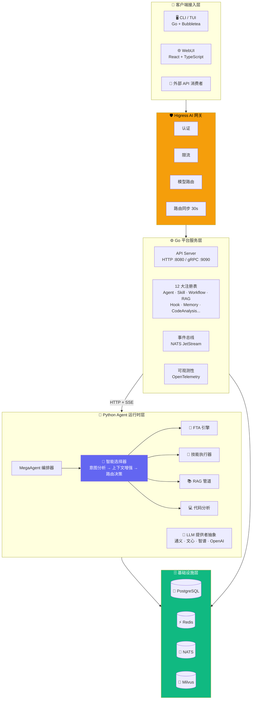

ResolveAgent 是一个 **CNCF 级别的开源 AIOps 智能体平台**，采用 Go + Python 双语言微服务架构，通过四大核心能力——专家技能（Expert Skills）、FTA 故障树工作流（Fault Tree Analysis）、RAG 检索增强生成和代码分析——协同工作，为企业提供智能化、自主化的运维问题诊断与解决能力。平台当前版本为 **v0.3.0**，基于 [AgentScope](https://github.com/modelscope/agentscope) 构建 Agent 编排能力，基于 [Higress](https://github.com/alibaba/higress) 构建 AI 网关能力，以 Apache 2.0 许可证开源。

Sources: [README.md](README.md#L1-L72), [VERSION](VERSION#L1), [LICENSE](LICENSE#L1-L5)

---

## 定位与愿景

传统运维体系依赖人工经验和固定规则进行故障排查，存在响应慢、知识难以沉淀、复用率低等结构性问题。ResolveAgent 的设计初衷是将 **AI 智能体技术**引入运维生命周期，构建一个能够自主理解问题意图、选择最优解决路径、并在每次问题解决后沉淀知识的**闭环系统**。平台核心的设计理念包含四条原则：

- **统一智能路由**：通过智能选择器实现动态路由，根据用户意图自动选择最优执行路径，而非固定流程
- **可组合的能力层**：FTA 工作流、技能、RAG 管道和代码分析四大能力作为独立可组合的层次，按需调度
- **云原生优先**：容器化部署、水平扩展、服务网格集成、OpenTelemetry 可观测性全链路覆盖
- **唯一数据源**：Go 注册表系统作为所有服务注册的唯一数据源，通过 Higress 网关同步路由配置，确保系统拓扑一致性

Sources: [docs/zh/architecture.md](docs/zh/architecture.md#L7-L34)

---

## 四大核心能力

ResolveAgent 围绕四项核心技术能力构建其问题解决体系，每项能力都是独立可组合的模块，由上层的智能选择器按需调度。

| 核心能力 | 定位 | 技术实现 | 典型场景 |
|----------|------|----------|----------|
| 🔧 **专家技能** | 原子化功能单元，封装领域专家知识 | 声明式 Manifest + 沙箱执行器（10s CPU、512MB 内存限制） | 日志分析、指标关联、告警分类 |
| 🌳 **FTA 工作流** | 复杂多步骤决策流程，系统性故障诊断 | MOCUS 算法 + 割集计算 + 6 种门类型（AND/OR/VOTING/INHIBIT/PRIORITY-AND） | 根因分析、故障树求值、自动修复决策 |
| 📚 **RAG 知识库** | 知识检索与增强，基于企业知识库回答 | BGE-large-zh 嵌入 + Milvus/Qdrant 向量库 + 三级重排序（cross-encoder / LLM / Jaccard+MMR） | 历史故障检索、运维手册查询、最佳实践推荐 |
| 💻 **代码分析** | 静态分析作为底层技术保障 | AST 调用图 + 错误解析 + 方案生成 + 混合流量采集 + RAG 双写沉淀 | 代码审查、依赖分析、安全扫描 |

Sources: [README.md](README.md#L56-L71), [docs/zh/README.md](docs/zh/README.md#L39-L76)

---

## 系统架构总览

ResolveAgent 采用**三层微服务架构**，各层通过明确的服务边界通信。从上到下分别是：客户端接入层、Go 平台服务层、Python Agent 运行时层，底层依赖 PostgreSQL、Redis、NATS 和 Milvus 四大基础设施组件。



**数据流向说明**：用户请求经 Higress 网关鉴权与路由后到达 Go 平台服务层，平台通过 HTTP+SSE 桥接将请求转发至 Python Agent 运行时。运行时中 MegaAgent 调用智能选择器分析意图，选择最优执行路径（FTA 工作流、技能、RAG 或代码分析），执行完成后结果原路返回。Go 平台的 12 大注册表作为唯一数据源，每 30 秒将路由配置同步至 Higress 网关，保证系统拓扑一致性。

Sources: [docs/zh/architecture.md](docs/zh/architecture.md#L37-L120), [pkg/server/server.go](pkg/server/server.go#L20-L41)

---

## 技术栈全景

ResolveAgent 涵盖 Go、Python、TypeScript 三种主要编程语言，集成了丰富的开源中间件和云原生工具链。

| 层次 | 组件 | 语言 / 框架 | 项目位置 | 职责 |
|------|------|-------------|----------|------|
| **平台服务** | API Server + 注册表 | Go 1.22+ | `cmd/resolveagent-server/`, `pkg/` | REST/gRPC API、12 大注册表、事件总线 |
| **Agent 运行时** | 执行引擎 + 选择器 | Python 3.11+ | `python/src/resolveagent/` | MegaAgent 编排、智能选择器、FTA/RAG/技能/代码分析 |
| **CLI/TUI** | 命令行 + 终端仪表板 | Go + Bubbletea | `cmd/resolveagent-cli/`, `internal/` | 18 个命令、终端可视化仪表板 |
| **Web 控制台** | 管理界面 | React + TypeScript | `web/` | Agent/Skill/Workflow 管理、工作流可视化编辑器 |
| **AI 网关** | Higress | 外部服务 | `pkg/gateway/` | 认证、限流、模型路由、负载均衡 |
| **关系数据库** | PostgreSQL 16 | Go pgx 驱动 | `pkg/store/postgres/` | 持久化存储、10 步迁移 |
| **缓存** | Redis 7 | go-redis | `pkg/store/redis/` | 会话管理、缓存层 |
| **消息总线** | NATS JetStream | nats.go | `pkg/event/` | 事件驱动通信 |
| **向量数据库** | Milvus / Qdrant | pymilvus / qdrant-client | `python/src/resolveagent/rag/` | RAG 向量存储与检索 |

Sources: [go.mod](go.mod#L1-L15), [python/pyproject.toml](python/pyproject.toml#L1-L31), [docs/zh/README.md](docs/zh/README.md#L183-L196)

---

## 项目目录结构

ResolveAgent 的代码库遵循 Go 社区标准布局，将 Go 平台服务、Python 运行时、Web 前端和部署配置清晰分层。以下展示了顶层目录的职责划分：

```
resolve-agent/
├── api/                          # API 规范定义
│   ├── jsonschema/               # JSON Schema（技能清单校验）
│   ├── openapi/v1/               # OpenAPI 规范
│   └── proto/resolveagent/       # Protocol Buffer 定义
├── cmd/                          # Go 程序入口
│   ├── resolveagent-cli/         # CLI 工具（resolveagent 命令）
│   └── resolveagent-server/      # 平台服务器（HTTP/gRPC 双端口）
├── pkg/                          # Go 公共库（可被外部导入）
│   ├── config/                   # Viper 配置管理
│   ├── event/                    # NATS 事件总线
│   ├── gateway/                  # Higress AI 网关集成
│   ├── registry/                 # 12 大注册表（Agent/Skill/Workflow...）
│   ├── server/                   # HTTP/gRPC 服务器
│   ├── store/                    # 存储抽象（PostgreSQL, Redis）
│   └── telemetry/                # OpenTelemetry 可观测性
├── internal/                     # Go 内部包（不可外部导入）
│   ├── cli/                      # CLI 命令实现（agent, skill, workflow, rag）
│   ├── platform/                 # 平台领域逻辑
│   └── tui/                      # Bubbletea 终端 UI
├── python/                       # Python AI/ML 组件
│   └── src/resolveagent/
│       ├── agent/                # Agent 定义（BaseAgent, MegaAgent）
│       ├── selector/             # 智能选择器（意图分析→路由决策）
│       ├── fta/                  # FTA 故障树分析引擎
│       ├── skills/               # 专家技能系统
│       ├── rag/                  # RAG 管道（摄取→索引→检索）
│       ├── llm/                  # LLM 提供者抽象层
│       ├── code_analysis/        # 静态/动态代码分析
│       └── runtime/              # Agent 运行时引擎
├── web/                          # React + TypeScript Web 管理界面
├── configs/                      # 默认配置文件
│   ├── resolveagent.yaml         # 平台主配置
│   ├── models.yaml               # LLM 模型注册表
│   └── examples/                 # 示例配置（agent, skill, workflow）
├── deploy/                       # 部署配置
│   ├── docker/                   # Dockerfile（platform, runtime, webui）
│   ├── docker-compose/           # Docker Compose 编排
│   ├── helm/resolveagent/        # Kubernetes Helm Chart
│   └── k8s/                      # Kustomize 配置
├── skills/                       # 社区技能注册表
├── scripts/                      # 数据库迁移与种子数据
├── docs/                         # 项目文档
└── test/                         # 测试套件（e2e, integration, load）
```

Sources: [docs/zh/README.md](docs/zh/README.md#L120-L179)

---

## 国产大模型支持

ResolveAgent 原生支持国内主流大语言模型，通过统一的 LLM 提供者抽象层屏蔽各厂商 API 差异，所有 LLM 调用统一经由 Higress AI 网关进行路由转发。

| 提供者 | 模型 ID | 最大 Token 数 | 说明 |
|--------|---------|--------------|------|
| **通义千问 (Qwen)** | `qwen-turbo` | 8,192 | 快速响应，适合简单任务 |
| **通义千问 (Qwen)** | `qwen-plus` | 32,768 | 平衡性能，推荐默认选择 |
| **通义千问 (Qwen)** | `qwen-max` | 32,768 | 最强推理，适合复杂分析 |
| **文心一言 (ERNIE)** | `ernie-4` | 8,192 | 百度文心大模型 |
| **智谱清言 (GLM)** | `glm-4` | 8,192 | 智谱 AI 大模型 |
| **Kimi (Moonshot)** | `moonshot-v1-8k` | 8,192 | 月之暗面大模型 |
| **Kimi (Moonshot)** | `moonshot-v1-32k` | 32,768 | 月之暗面长上下文 |
| **Kimi (Moonshot)** | `moonshot-v1-128k` | 131,072 | 超长上下文窗口 |

Sources: [configs/models.yaml](configs/models.yaml#L1-L52), [README.md](README.md#L371-L377)

---

## 构建与部署方式

ResolveAgent 提供从本地开发到 Kubernetes 生产部署的完整构建链，通过 `Makefile` 统一管理所有构建、测试和部署命令。

### 快速命令参考

| 命令 | 用途 |
|------|------|
| `make setup-dev` | 一键设置开发环境（安装依赖、配置 pre-commit 钩子） |
| `make compose-deps` | 启动基础设施依赖 |
| `make build` | 构建全部组件（Go 二进制 + Python 包 + Web 前端） |
| `make compose-up` | 启动完整服务栈 |
| `make test` | 运行全部测试（Go + Python + Web） |
| `make lint` | 代码检查（golangci-lint + ruff + eslint） |
| `make docker` | 构建全部 Docker 镜像 |

### 部署模式对比

| 部署模式 | 适用场景 | 配置文件 | 复杂度 |
|----------|----------|----------|--------|
| **Docker Compose** | 本地开发、测试环境 | `deploy/docker-compose/` | ⭐ 低 |
| **Kubernetes + Helm** | 生产环境、弹性伸缩 | `deploy/helm/resolveagent/` | ⭐⭐⭐ 高 |
| **Kustomize** | 自定义 K8s 配置 | `deploy/k8s/` | ⭐⭐ 中 |

Sources: [Makefile](Makefile#L1-L68), [deploy/docker-compose/docker-compose.yaml](deploy/docker-compose/docker-compose.yaml#L1-L30)

---

## 版本路线图

ResolveAgent 按语义化版本号迭代，当前处于 **v0.3.0**（WebUI & DevEx）阶段，核心功能已全部就绪。

| 版本 | 主题 | 状态 |
|------|------|------|
| **v0.1.0** — Foundation | Go 平台服务、Python 运行时、FTA 引擎、智能选择器、RAG 管道、CLI/TUI | ✅ 已完成 |
| **v0.2.0** — Hardening | 数据库迁移、统一错误处理、结构化日志、健康检查、重试机制 | ✅ 已完成 |
| **v0.3.0** — DevEx（当前） | WebUI Mock 数据、部署配置统一、项目脚手架 | 🔄 进行中 |
| **v0.4.0** — Ecosystem | 技能市场、插件 SDK、多租户、RBAC | 📋 计划中 |
| **v0.5.0** — Scale | 水平扩展、分布式工作流、事件驱动架构 | 📋 计划中 |

Sources: [ROADMAP.md](ROADMAP.md#L1-L60), [VERSION](VERSION#L1)

---

## 推荐阅读路径

作为入门开发者，建议按以下顺序深入了解 ResolveAgent 的各个层面：

**第一步：动手实践**
- [快速上手：从零搭建本地开发环境](2-kuai-su-shang-shou-cong-ling-da-jian-ben-di-kai-fa-huan-jing) — 克隆仓库、启动依赖、创建第一个 Agent
- [CLI 命令行工具使用指南](3-cli-ming-ling-xing-gong-ju-shi-yong-zhi-nan) — 掌握 `resolveagent` 命令行工具的 18 个子命令

**第二步：理解架构**
- [整体架构设计：三层微服务与双语言运行时](4-zheng-ti-jia-gou-she-ji-san-ceng-wei-fu-wu-yu-shuang-yu-yan-yun-xing-shi) — 深入理解系统分层与通信机制
- [Go 平台服务层：API Server、注册表与存储后端](5-go-ping-tai-fu-wu-ceng-api-server-zhu-ce-biao-yu-cun-chu-hou-duan) — Go 服务端的内部实现
- [Python Agent 运行时层：执行引擎与生命周期管理](6-python-agent-yun-xing-shi-ceng-zhi-xing-yin-qing-yu-sheng-ming-zhou-qi-guan-li) — Python 运行时的核心逻辑

**第三步：深入子系统**（根据兴趣选择）
- 智能选择器：[智能路由决策引擎](8-zhi-neng-lu-you-jue-ce-yin-qing-yi-tu-fen-xi-yu-san-jie-duan-chu-li-liu-cheng) → [路由策略详解](9-lu-you-ce-lue-xiang-jie-gui-ze-ce-lue-llm-ce-lue-yu-hun-he-ce-lue)
- FTA 引擎：[故障树数据结构](11-gu-zhang-shu-shu-ju-jie-gou-shi-jian-men-yu-shu-mo-xing) → [六种门类型求值](12-liu-chong-men-lei-xing-qiu-zhi-and-or-voting-inhibit-priority-and)
- RAG 管道：[RAG 管道全景](14-rag-guan-dao-quan-jing-wen-dang-she-qu-xiang-liang-suo-yin-yu-yu-yi-jian-suo) → [向量存储后端](15-xiang-liang-cun-chu-hou-duan-milvus-yu-qdrant-ji-cheng)
- 技能系统：[技能清单规范](18-ji-neng-qing-dan-gui-fan-sheng-ming-shi-shu-ru-shu-chu-yu-quan-xian-mo-xing) → [沙箱执行器](20-sha-xiang-zhi-xing-qi-zi-yuan-ge-chi-yu-an-quan-yue-shu)