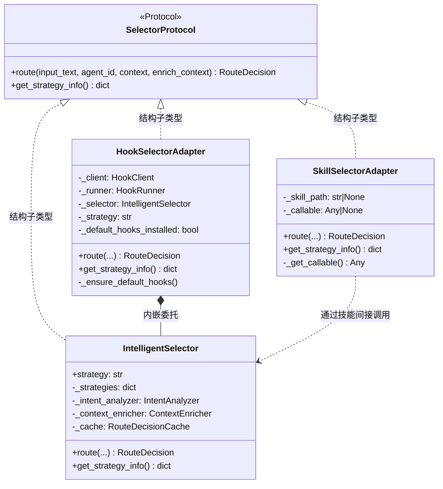
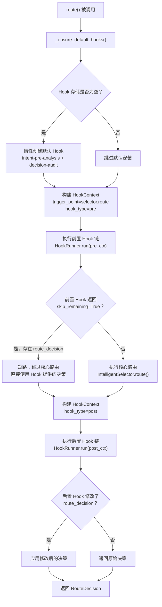
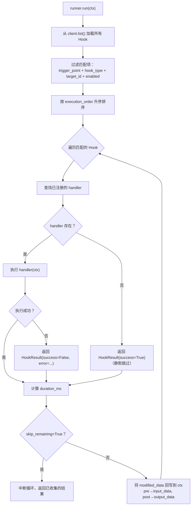

智能选择器是 ResolveAgent 路由决策的核心引擎，但在不同的部署场景中，同一个路由决策需要以不同形态呈现——有时它需要被前置/后置处理器拦截，有时它需要伪装成技能系统中的标准技能。**选择器适配器**通过统一协议接口实现了这一目标：三种实现（`IntelligentSelector`、`HookSelectorAdapter`、`SkillSelectorAdapter`）均满足同一套 `SelectorProtocol`，下游代码无需感知具体运行模式，切换适配器只需一个参数。

本文将深入剖析 `SelectorProtocol` 协议定义、Hook 适配器的拦截管道、Skill 适配器的技能封装，以及它们在 `MegaAgent` 编排器中的集成方式。阅读本文前，建议先了解[智能路由决策引擎：意图分析与三阶段处理流程](8-zhi-neng-lu-you-jue-ce-yin-qing-yi-tu-fen-xi-yu-san-jie-duan-chu-li-liu-cheng)中关于 `IntelligentSelector` 核心路由流程的内容。

Sources: [protocol.py](python/src/resolveagent/selector/protocol.py#L1-L37), [__init__.py](python/src/resolveagent/selector/__init__.py#L1-L80)

## SelectorProtocol：统一路由协议

三种选择器实现共享一套由 Python `Protocol` 定义的接口规范。通过 `@runtime_checkable` 装饰器声明的 `SelectorProtocol`，利用了 Python 的**结构子类型化**（structural subtyping）机制——不需要显式继承，只要类拥有匹配的 `route()` 和 `get_strategy_info()` 方法，就自动满足协议约束。这意味着 `IntelligentSelector`（核心路由引擎）、`HookSelectorAdapter`（Hook 包装器）和 `SkillSelectorAdapter`（技能封装器）三者之间没有任何继承关系，却在类型系统层面完全等价。

Sources: [protocol.py](python/src/resolveagent/selector/protocol.py#L15-L36)

### 协议方法签名

| 方法 | 签名 | 职责 |
|------|------|------|
| `route()` | `async def route(self, input_text: str, agent_id: str = "", context: dict[str, Any] \| None = None, enrich_context: bool = True) -> RouteDecision` | 执行路由决策，返回 `RouteDecision` |
| `get_strategy_info()` | `def get_strategy_info(self) -> dict[str, Any]` | 返回当前策略的元信息（用于可观测性与调试） |

`route()` 方法的四个参数职责明确：`input_text` 是用户原始输入；`agent_id` 标识发起请求的 Agent；`context` 携带对话历史、注册表信息等上下文；`enrich_context` 控制是否在路由前运行 `ContextEnricher` 补充可用能力列表。返回值 `RouteDecision` 是一个 Pydantic 模型，包含 `route_type`（路由类型）、`route_target`（具体目标）、`confidence`（置信度 0.0–1.0）、`reasoning`（决策理由）等字段。

Sources: [selector.py](python/src/resolveagent/selector/selector.py#L20-L67), [protocol.py](python/src/resolveagent/selector/protocol.py#L24-L32)

### 运行时类型验证

由于协议被标记为 `runtime_checkable`，可以在运行时通过 `isinstance()` 验证任意对象是否满足协议：

```python
from resolveagent.selector.protocol import SelectorProtocol
from resolveagent.selector.hook_selector import HookSelectorAdapter
from resolveagent.selector.skill_selector import SkillSelectorAdapter

# 三者均通过验证
assert isinstance(HookSelectorAdapter(), SelectorProtocol)
assert isinstance(SkillSelectorAdapter(), SelectorProtocol)
```

这种设计使得下游代码可以用统一类型注解接受任意适配器，同时保持运行时安全检查能力。在 [mega.py](python/src/resolveagent/agent/mega.py#L40) 中，`_selector_instance` 字段的类型标注为 `SelectorProtocol | None`，正是利用了这一协议的多态性。

Sources: [protocol.py](python/src/resolveagent/selector/protocol.py#L15-L16), [mega.py](python/src/resolveagent/agent/mega.py#L40-L40)

## 适配器架构全景

下图展示了三种选择器实现之间的关系，以及它们各自的内部组件：



三种实现的核心差异在于**路由逻辑的包装层级**：`IntelligentSelector` 直接执行三阶段处理管道；`HookSelectorAdapter` 在其外层包裹了 Hook 拦截管道，允许外部代码在路由前后注入自定义逻辑；`SkillSelectorAdapter` 则将路由逻辑封装为技能调用，使其融入技能基础设施的完整生命周期。

Sources: [hook_selector.py](python/src/resolveagent/selector/hook_selector.py#L27-L55), [skill_selector.py](python/src/resolveagent/selector/skill_selector.py#L18-L28), [selector.py](python/src/resolveagent/selector/selector.py#L80-L112)

## HookSelectorAdapter：Hook 拦截管道

`HookSelectorAdapter` 是三种适配器中最复杂的实现，它在 `IntelligentSelector` 外层构建了一条完整的 Hook 管道，允许通过声明式方式在路由前后注入拦截逻辑。其核心价值在于**将路由决策过程开放为可扩展的中间件管道**——无需修改选择器核心代码，即可实现限流、审计、意图预分析等横切关注点。

### 管道执行流程



整个管道分为三个清晰的阶段：

1. **前置 Hook 阶段**——在核心路由执行前运行。前置 Hook 可以修改输入参数（如 `input_text` 和 `context`），也可以通过返回 `skip_remaining=True` 并在 `modified_data` 中提供完整的 `route_decision` 来**短路**整个路由过程，直接跳过核心路由逻辑。

2. **核心路由阶段**——如果没有被前置 Hook 短路，调用内嵌的 `IntelligentSelector.route()` 执行标准的三阶段路由管道（意图分析→上下文丰富→策略决策）。

3. **后置 Hook 阶段**——在路由决策生成后运行。后置 Hook 可以审计决策、调整置信度、甚至替换整个路由决策。

Sources: [hook_selector.py](python/src/resolveagent/selector/hook_selector.py#L84-L143)

### 构造函数与初始化

`HookSelectorAdapter` 的构造函数接收两个参数：

| 参数 | 类型 | 默认值 | 说明 |
|------|------|--------|------|
| `hook_client` | `Any \| None` | `None` | Hook 存储客户端。为 `None` 时自动创建 `InMemoryHookClient` |
| `strategy` | `str` | `"hybrid"` | 传递给内嵌 `IntelligentSelector` 的策略名称 |

构造过程中完成三件事：初始化 Hook 存储客户端（默认为内存实现）；创建 `HookRunner` 作为 Hook 执行引擎；向 `HookRunner` 注册三个内置处理器（`intent_analysis`、`decision_audit`、`confidence_override`）。

```python
# 最简用法：自动创建内存 Hook 存储 + 混合策略
adapter = HookSelectorAdapter(strategy="hybrid")

# 自定义 Hook 客户端（如对接 Go 平台 REST API）
from resolveagent.store.hook_client import HookClient
client = HookClient(base_url="http://platform:8080")
adapter = HookSelectorAdapter(hook_client=client, strategy="rule")
```

Sources: [hook_selector.py](python/src/resolveagent/selector/hook_selector.py#L37-L54)

### 默认 Hook 惰性安装

首次调用 `route()` 时，适配器会检查 Hook 存储是否为空。若为空，则自动创建两个默认 Hook：

| Hook 名称 | 类型 | 处理器 | `trigger_point` | 用途 |
|-----------|------|--------|-----------------|------|
| `intent-pre-analysis` | `pre` | `intent_analysis` | `selector.route` | 调用 `IntentAnalyzer` 预分析意图，结果存入 `modified_data` |
| `decision-audit` | `post` | `decision_audit` | `selector.route` | 记录路由类型、目标、置信度、时间戳等审计日志 |

惰性安装通过 `_default_hooks_installed` 布尔标志保证只执行一次。即使后续调用中 Hook 存储非空，也不会重复创建。这两个默认 Hook 为路由管道提供了基础的可观测性——意图预分析让后续处理器可以复用分类结果，决策审计则确保每次路由决策都被记录。

Sources: [hook_selector.py](python/src/resolveagent/selector/hook_selector.py#L56-L82)

### 短路机制详解

前置 Hook 的短路能力是 `HookSelectorAdapter` 最强大的扩展点。当某个前置 Hook 返回的 `HookResult` 同时满足两个条件——`skip_remaining=True` 且 `modified_data` 中包含 `route_decision` 字典——时，核心路由将被完全跳过，适配器直接使用 Hook 提供的决策进入后置阶段。

```python
# 短路示例：限流处理器
async def rate_limit_handler(ctx: HookContext) -> HookResult:
    agent_id = ctx.target_id
    if is_rate_limited(agent_id):
        return HookResult(
            success=True,
            skip_remaining=True,
            modified_data={
                "route_decision": {
                    "route_type": "direct",
                    "confidence": 1.0,
                    "reasoning": "Agent 已被限流，降级为直接回复",
                },
            },
        )
    return HookResult(success=True)
```

在 [hook_selector.py](python/src/resolveagent/selector/hook_selector.py#L108-L113) 中，短路逻辑通过遍历所有前置 Hook 的结果列表实现：一旦发现某个结果包含 `route_decision` 且 `skip_remaining` 为 `True`，立即跳出循环。这意味着短路 Hook 必须设置较低的 `execution_order`（如 `-1`）以确保在其他前置 Hook 之前执行。

Sources: [hook_selector.py](python/src/resolveagent/selector/hook_selector.py#L107-L126), [models.py](python/src/resolveagent/hooks/models.py#L27-L34)

### 三大内置处理器

三个内置处理器定义在 `selector_handlers.py` 中，分别覆盖意图预分析、决策审计和置信度调整三个横切关注点。

**意图预分析处理器** (`intent_analysis_handler`) 是一个前置处理器，它从 `HookContext.input_data` 中提取 `input_text`，调用 `IntentAnalyzer.classify()` 进行意图分类，然后将分类结果（意图类型、置信度、实体列表、子意图、建议目标）存入 `modified_data["intent_classification"]`。这些分类结果可以被后续的前置 Hook 或核心路由器复用，避免重复分析。

**决策审计处理器** (`decision_audit_handler`) 是一个后置处理器，从 `HookContext.output_data` 中提取路由决策数据，以结构化日志的形式记录路由类型、目标、置信度、Agent ID 和时间戳。这是路由管道可观测性的基础保障。

**置信度覆盖处理器** (`confidence_override_handler`) 是一个后置处理器，它从 `HookContext.metadata["confidence_overrides"]` 中读取一个 `{route_type: delta}` 映射表，对匹配当前路由类型的决策应用增量调整。调整后的置信度被夹紧到 `[0.0, 1.0]` 区间。这允许运维人员在不修改代码的情况下，动态调整特定路由类型的置信度。

| 处理器 | Hook 类型 | 读取来源 | 写入目标 |
|--------|----------|---------|---------|
| `intent_analysis_handler` | `pre` | `input_data["input_text"]` | `modified_data["intent_classification"]` |
| `decision_audit_handler` | `post` | `output_data["route_decision"]` | 日志系统 |
| `confidence_override_handler` | `post` | `metadata["confidence_overrides"]` + `output_data["route_decision"]` | `modified_data["route_decision"]` |

Sources: [selector_handlers.py](python/src/resolveagent/hooks/selector_handlers.py#L18-L87)

### 自定义 Hook 注册

注册自定义处理器并创建 Hook 定义只需三步：定义一个签名为 `async def handler(ctx: HookContext) -> HookResult` 的异步函数；通过 `HookRunner.register_handler()` 注册到执行引擎；通过 Hook 客户端创建 Hook 定义（指定触发点、执行顺序等元信息）。

```python
# 第一步：定义处理器
async def custom_pre_handler(ctx: HookContext) -> HookResult:
    input_text = ctx.input_data.get("input_text", "")
    # 自定义逻辑...
    return HookResult(
        success=True,
        modified_data={"custom_field": "value"},
    )

# 第二步：注册处理器
adapter._runner.register_handler("custom_pre", custom_pre_handler)

# 第三步：创建 Hook 定义
await adapter._client.create({
    "name": "my-custom-hook",
    "hook_type": "pre",
    "trigger_point": "selector.route",
    "handler_type": "custom_pre",
    "execution_order": 10,   # 数字越小越先执行
    "enabled": True,
})
```

Hook 定义的 `execution_order` 字段控制执行顺序——数值越小越先执行。默认内置的两个 Hook 的 `execution_order` 均为 `0`，自定义 Hook 可以设置 `-1`（在所有默认 Hook 之前执行）或 `10`（在默认 Hook 之后执行）来控制精确的执行时机。

Sources: [runner.py](python/src/resolveagent/hooks/runner.py#L40-L47), [runner.py](python/src/resolveagent/hooks/runner.py#L61-L101)

## InMemoryHookClient：内存 Hook 存储

`InMemoryHookClient` 是 Go 平台 `HookClient` 的纯 Python 内存替代实现。它将 Hook 定义存储在 Python `dict` 中而非查询 Go REST API，适用于开发、测试和独立部署场景，完全消除了对 Go 平台服务的依赖。

它实现了与 [hook_client.py](python/src/resolveagent/store/hook_client.py#L42-L106) 中 `HookClient` 一致的异步 CRUD 接口：

| 方法 | 说明 |
|------|------|
| `create(hook: dict)` | 创建 Hook，自动生成 UUID 或使用自定义 ID |
| `get(hook_id: str)` | 按 ID 查找 Hook，返回 `HookInfo` 或 `None` |
| `list()` | 返回所有 Hook 定义的列表 |
| `update(hook_id: str, hook: dict)` | 更新 Hook 的任意字段 |
| `delete(hook_id: str)` | 删除指定 Hook |
| `list_executions(hook_id: str)` | 返回指定 Hook 的执行记录列表 |

`HookInfo` 数据类定义了 Hook 的完整元模型，包含 `id`、`name`、`hook_type`（`"pre"` 或 `"post"`）、`trigger_point`（触发点名称）、`target_id`（可选的目标实体 ID）、`execution_order`（执行优先级）、`handler_type`（处理器类型名称）、`config`（配置字典）、`enabled`（启用状态）和 `labels`（标签映射）。

Sources: [memory_client.py](python/src/resolveagent/hooks/memory_client.py#L15-L75), [hook_client.py](python/src/resolveagent/store/hook_client.py#L14-L28)

## SkillSelectorAdapter：技能封装模式

`SkillSelectorAdapter` 采用了截然不同的适配策略——它将路由逻辑封装为一次技能调用，使智能选择器在技能基础设施的视角下表现为一个**标准技能**。这种模式的价值在于统一了执行通道：当整个系统以技能为基本调度单元时，路由决策本身也可以享受技能系统提供的沙箱隔离、权限控制、超时管理和执行日志等基础设施。

### 惰性加载与直接调用

适配器在首次 `route()` 调用时，通过 `_get_callable()` 惰性导入 `resolveagent.skills.builtin.selector_skill:run` 函数，并将其缓存到 `_callable` 字段中。后续调用直接复用已加载的函数引用，不会重复导入。这种**延迟导入模式**避免了模块初始化时的循环依赖问题，同时保证了首次调用后的零开销。

```python
def _get_callable(self) -> Any:
    if self._callable is None:
        from resolveagent.skills.builtin.selector_skill import run
        self._callable = run
    return self._callable
```

调用时，适配器将 `route()` 的参数直接透传给技能入口函数，并固定 `strategy="hybrid"` 作为默认策略。技能函数返回一个普通字典（`dict[str, Any]`），适配器通过 `RouteDecision(**result)` 将其反序列化为 Pydantic 模型。

Sources: [skill_selector.py](python/src/resolveagent/selector/skill_selector.py#L30-L62)

### 技能入口点

技能函数 `run()` 定义在 `resolveagent.skills.builtin.selector_skill` 模块中，其职责极为简洁：实例化一个新的 `IntelligentSelector`（使用传入的 `strategy`），执行路由，将 `RouteDecision` 序列化为字典返回。它拥有独立的技能清单文件 [manifest.yaml](python/skills/intelligent-selector/manifest.yaml#L1-L55)，声明了五个输入参数（`input_text`、`agent_id`、`context`、`strategy`、`enrich_context`）和四个输出字段（`route_type`、`route_target`、`confidence`、`reasoning`），以及网络访问权限和 30 秒超时限制。

```python
# selector_skill.py 的完整实现（仅 34 行）
async def run(
    input_text: str,
    agent_id: str = "",
    context: dict[str, Any] | None = None,
    strategy: str = "hybrid",
    enrich_context: bool = True,
) -> dict[str, Any]:
    from resolveagent.selector.selector import IntelligentSelector
    selector = IntelligentSelector(strategy=strategy)
    decision = await selector.route(
        input_text, agent_id=agent_id,
        context=context, enrich_context=enrich_context,
    )
    return decision.model_dump()
```

Sources: [selector_skill.py](python/src/resolveagent/skills/builtin/selector_skill.py#L1-L34), [manifest.yaml](python/skills/intelligent-selector/manifest.yaml#L1-L55)

### 错误兜底策略

当技能调用抛出任何异常时，`SkillSelectorAdapter` 不会向上传播错误，而是返回一个**保守的兜底决策**：`route_type="direct"`，`confidence=0.3`，`reasoning` 中包含原始错误信息。这确保了即使路由技能完全不可用，MegaAgent 仍然可以降级为直接 LLM 回复——这是一种典型的**优雅降级**设计。

```python
# 异常兜底路径
except Exception as e:
    logger.error("Skill selector failed, falling back to direct", ...)
    return RouteDecision(
        route_type="direct",
        confidence=0.3,
        reasoning=f"Skill selector fallback: {e}",
    )
```

低置信度 `0.3` 是有意为之的信号——下游代码可以通过 `decision.is_high_confidence()` 检测到这是一次降级决策，并相应调整后续处理逻辑（如记录告警或启用备用路径）。

Sources: [skill_selector.py](python/src/resolveagent/selector/skill_selector.py#L56-L62), [selector.py](python/src/resolveagent/selector/selector.py#L75-L77)

## HookRunner：Hook 执行引擎

`HookRunner` 是 Hook 适配器管道的执行核心，它负责从 Hook 存储加载定义、按 `execution_order` 排序、逐个执行匹配的处理器、处理短路信号、并将修改数据回写到上下文中。



关键设计细节值得注意：处理器查找基于 `handler_type` 字符串匹配，如果某个 Hook 定义的 `handler_type` 在 `_handlers` 字典中找不到对应条目，Runner 会静默跳过（返回 `success=True` 的空结果），而不会抛出异常。这种容错设计确保了 Hook 定义的注册和处理器注册可以解耦——你可以先创建 Hook 定义，稍后再注册处理器。此外，Hook 链中的**修改数据传播**机制通过 `ctx.input_data.update()` / `ctx.output_data.update()` 实现，使得前一个 Hook 的输出可以成为后一个 Hook 的输入，形成链式处理管道。

Sources: [runner.py](python/src/resolveagent/hooks/runner.py#L49-L101)

## MegaAgent 集成：工厂模式与模式切换

`MegaAgent` 是选择器适配器的最终消费者。它通过 `selector_mode` 参数控制使用哪种适配器实现，采用**惰性工厂模式**在首次需要时创建选择器实例，并在整个生命周期中复用。

### 三种模式对照

| `selector_mode` 值 | 创建的适配器 | 路由行为 | 适用场景 |
|-------------------|-------------|---------|---------|
| `"selector"` (默认) | `IntelligentSelector` | 直接执行三阶段路由管道 | 标准部署，无需中间件 |
| `"hooks"` | `HookSelectorAdapter` | 前置 Hook → 核心路由 → 后置 Hook | 需要审计、限流、意图预处理等中间件 |
| `"skills"` | `SkillSelectorAdapter` | 通过技能入口函数调用路由 | 技能系统优先的统一调度架构 |

### 工厂方法实现

工厂方法 `_get_selector()` 的实现极为精简：检查缓存实例是否存在，若不存在则根据 `selector_mode` 值导入对应类并实例化。`selector_strategy` 参数会被传递给 `IntelligentSelector`（默认模式）或 `HookSelectorAdapter`（Hook 模式），但不会传递给 `SkillSelectorAdapter`——因为后者内部固定使用 `"hybrid"` 策略。

```python
def _get_selector(self) -> SelectorProtocol:
    if self._selector_instance is not None:
        return self._selector_instance

    if self.selector_mode == "hooks":
        from resolveagent.selector.hook_selector import HookSelectorAdapter
        self._selector_instance = HookSelectorAdapter(strategy=self.selector_strategy)
    elif self.selector_mode == "skills":
        from resolveagent.selector.skill_selector import SkillSelectorAdapter
        self._selector_instance = SkillSelectorAdapter()
    else:
        from resolveagent.selector.selector import IntelligentSelector
        self._selector_instance = IntelligentSelector(strategy=self.selector_strategy)

    return self._selector_instance
```

延迟导入（`from ... import` 放在方法体内而非模块顶部）是刻意的设计决策——它避免了 `MegaAgent` 模块对适配器模块的硬依赖，使得在只需要特定模式的部署场景中，未使用的适配器模块不会被加载。

Sources: [mega.py](python/src/resolveagent/agent/mega.py#L52-L74)

### 实例复用保证

`_get_selector()` 通过 `_selector_instance` 缓存保证同一 `MegaAgent` 实例在整个生命周期中使用同一个选择器对象。这意味着：

- `HookSelectorAdapter` 的默认 Hook 只会安装一次（惰性安装 + 实例复用的双重保障）
- `SkillSelectorAdapter` 的技能函数只会加载一次
- `IntelligentSelector` 的策略实例缓存和路由决策缓存在所有 `reply()` 调用间共享

测试代码明确验证了这一行为——`test_selector_instance_reuse` 和 `test_hooks_mode_instance_reuse` 两个测试确保了重复调用 `_get_selector()` 返回的是同一个 Python 对象（`s1 is s2`）。

Sources: [test_mega_selector_modes.py](python/tests/unit/test_mega_selector_modes.py#L57-L69)

## 适配器选择决策指南

选择哪种适配器并非纯粹的技术偏好，而是取决于系统的运维需求和架构约束。以下对比表从多个维度帮助做出决策：

| 维度 | `IntelligentSelector` | `HookSelectorAdapter` | `SkillSelectorAdapter` |
|------|----------------------|----------------------|----------------------|
| **可扩展性** | 无（需修改核心代码） | 高（声明式 Hook 注册） | 中（通过技能清单扩展） |
| **可观测性** | 日志输出 | Hook 审计 + 日志 | 技能执行日志 |
| **执行开销** | 最低 | 额外 Hook 执行时间 | 函数调用 + 反序列化 |
| **短路能力** | 无 | 前置 Hook 可短路 | 无 |
| **错误降级** | 抛出异常 | Hook 失败静默跳过 | 兜底 direct (conf=0.3) |
| **依赖复杂度** | 仅选择器核心 | + HookRunner + HookClient | + 技能系统 |
| **适用场景** | 最小化部署 | 生产环境需要中间件 | 技能优先的统一架构 |

**推荐策略**：开发阶段使用 `IntelligentSelector`（默认模式）快速验证路由逻辑；进入生产部署后切换为 `HookSelectorAdapter`，利用审计 Hook 和限流 Hook 增强系统韧性；当整个系统以技能为调度核心时，使用 `SkillSelectorAdapter` 统一执行通道。

Sources: [hook_selector.py](python/src/resolveagent/selector/hook_selector.py#L145-L152), [skill_selector.py](python/src/resolveagent/selector/skill_selector.py#L64-L68), [selector.py](python/src/resolveagent/selector/selector.py#L294-L305)

## 测试覆盖

适配器系统拥有完善的单元测试覆盖，三个测试文件覆盖了从底层存储到 MegaAgent 集成的完整链路：

| 测试文件 | 测试类/数量 | 覆盖范围 |
|---------|-----------|---------|
| [test_hook_selector.py](python/tests/unit/test_hook_selector.py#L1-L207) | `TestInMemoryHookClient` (9 个) + `TestHookSelectorAdapter` (7 个) | 内存客户端 CRUD、默认 Hook 安装、前置 Hook 短路、协议一致性 |
| [test_skill_selector.py](python/tests/unit/test_skill_selector.py#L1-L81) | `TestSkillSelectorAdapter` (7 个) | 惰性加载、路由正确性、上下文透传、错误兜底、协议一致性 |
| [test_mega_selector_modes.py](python/tests/unit/test_mega_selector_modes.py#L1-L143) | `TestMegaSelectorModes` (12 个) | 工厂方法、实例复用、策略转发、完整 reply 流程集成 |

值得注意的是短路测试（`test_pre_hook_short_circuit`）——它创建了一个自定义的前置处理器 `force_direct_handler`，通过 `skip_remaining=True` 和预设的 `route_decision` 强制覆盖核心路由结果，验证了即使输入任意文本，最终的 `RouteDecision` 也由前置 Hook 完全控制。这证明了 Hook 管道的短路机制在生产环境中可以作为限流、灰度发布、A/B 测试等场景的基础设施。

Sources: [test_hook_selector.py](python/tests/unit/test_hook_selector.py#L152-L190), [test_skill_selector.py](python/tests/unit/test_skill_selector.py#L67-L80), [test_mega_selector_modes.py](python/tests/unit/test_mega_selector_modes.py#L101-L127)

---

**下一步阅读建议**：了解适配器如何在 MegaAgent 编排器中与多路由分发协同工作，请参阅 [MegaAgent 核心逻辑：选择器集成与多路由分发](22-megaagent-he-xin-luo-ji-xuan-ze-qi-ji-cheng-yu-duo-lu-you-fen-fa)。如需回顾智能选择器的核心路由管道（适配器所包装的底层引擎），请参阅[智能路由决策引擎：意图分析与三阶段处理流程](8-zhi-neng-lu-you-jue-ce-yin-qing-yi-tu-fen-xi-yu-san-jie-duan-chu-li-liu-cheng)。