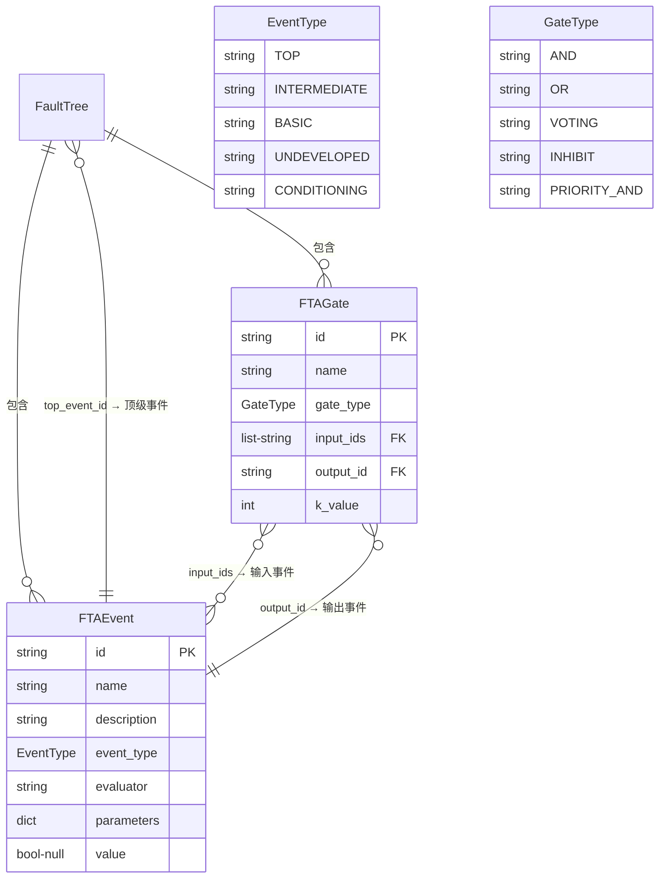
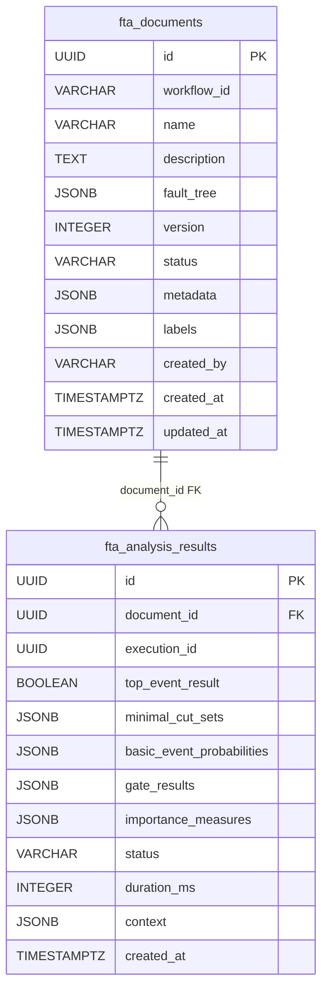

故障树分析（Fault Tree Analysis, FTA）是 ResolveAgent 平台的核心推理引擎之一，其数据模型横跨三层技术栈——Python 运行时定义核心数据结构与求值逻辑，Go 平台服务层负责持久化存储与 CRUD 管理，Web 前端提供可视化编辑与展示。本文聚焦于**故障树的静态数据模型**：事件节点、逻辑门、树结构的定义与关联关系，以及这些结构如何在 YAML/JSON 序列化格式与 PostgreSQL 存储之间映射。关于门类型的求值算法细节请参见 [六种门类型求值：AND / OR / VOTING / INHIBIT / PRIORITY-AND](12-liu-chong-men-lei-xing-qiu-zhi-and-or-voting-inhibit-priority-and)，关于运行时执行流程请参见 [FTA 工作流执行：自底向上求值与结果持久化](13-fta-gong-zuo-liu-zhi-xing-zi-di-xiang-shang-qiu-zhi-yu-jie-guo-chi-jiu-hua)。

Sources: [tree.py](python/src/resolveagent/fta/tree.py#L1-L120), [fta_document.go](pkg/registry/fta_document.go#L1-L53)

## 整体数据模型关系

ResolveAgent 的故障树数据结构遵循经典的 FTA 建模范式：一棵**故障树**由若干**事件节点**和**逻辑门**组成，事件之间通过逻辑门的输入/输出关系形成有向无环图（DAG）。下面的关系图展示了核心数据类之间的结构关系：



在 Python 运行时中，`FaultTree` 是一个 `@dataclass`，内含 `events: list[FTAEvent]` 和 `gates: list[FTAGate]` 两个列表。逻辑门通过 `input_ids`（字符串列表）和 `output_id`（单个字符串）引用事件的 `id` 字段，形成事件-门之间的间接关联。这种设计使得序列化和反序列化非常直观——只需将引用关系表示为 ID 字符串即可。

Sources: [tree.py](python/src/resolveagent/fta/tree.py#L30-L120)

## 三种事件类型详解

故障树中的事件节点按其在树中的位置和作用被分为五种类型，由 `EventType` 枚举（继承自 `StrEnum`）定义。其中最核心的是 **Top**、**Intermediate**、**Basic** 三种，它们构成了故障树的基本骨架。

### 事件类型对比

| 类型 | 枚举值 | 在树中的位置 | 是否含评估器 | 典型用途 |
|------|--------|-------------|-------------|---------|
| **Top** | `"top"` | 树根，唯一 | 否 | 代表最终要分析的目标事件（如"节点 NotReady"） |
| **Intermediate** | `"intermediate"` | 树的中间层 | 否 | 组合多个子原因的中间抽象（如"网络故障"） |
| **Basic** | `"basic"` | 叶节点 | 是 | 实际可检测的原子事件（如"内存 OOM"） |
| **Undeveloped** | `"undeveloped"` | 叶节点 | 否 | 尚未展开的事件，留待后续分析 |
| **Conditioning** | `"conditioning"` | 门条件输入 | 否 | 用于 INHIBIT 门的条件约束事件 |

`FTAEvent` 的核心数据字段包括：`id`（全局唯一标识）、`name`（人类可读名称）、`description`（事件描述）、`event_type`（事件类型枚举）、`evaluator`（评估器字符串，格式为 `"类型:目标"`）、`parameters`（传递给评估器的参数字典），以及 `value`（求值后的布尔结果，初始为 `None`）。只有 **Basic** 类型的事件才会携带 `evaluator` 和 `parameters`——因为它们是唯一需要实际执行检测的节点。

Sources: [tree.py](python/src/resolveagent/fta/tree.py#L10-L41)

### 评估器类型体系

Basic 事件的 `evaluator` 字段采用 `"类型:目标"` 的统一格式，支持五种评估模式。`NodeEvaluator` 通过解析这个字符串的前缀来分派到不同的求值路径：

| 评估器前缀 | 含义 | 求值方式 | 示例 |
|------------|------|---------|------|
| `skill:` | 技能评估 | 调用注册的 Skill 执行检测并解析返回值 | `skill:log-analyzer` |
| `rag:` | 知识检索 | 查询 RAG 集合，根据相似度得分判断 | `rag:runbook-collection` |
| `llm:` | LLM 判断 | 调用大语言模型进行布尔分类 | `llm:qwen-plus` |
| `static:` | 静态值 | 直接解析预设的布尔值 | `static:true` |
| `context:` | 上下文查询 | 从执行上下文中按键路径取值 | `context:incident.severity` |

评估器求值结果会被缓存——以 `"{event_id}:{hash(context)}"` 为键存储在 `NodeEvaluator._cache` 中，避免对同一事件重复求值。当评估器未定义时，系统默认返回 `True`（假定事件已发生），而当评估过程抛出异常时，系统安全降级返回 `False`（假定事件未发生）。

Sources: [evaluator.py](python/src/resolveagent/fta/evaluator.py#L51-L110)

### 真实种子数据中的事件实例

平台内置了 10 棵覆盖 Kubernetes 核心组件的故障树种子数据。以 `ft-k8s-node-notready` 为例，其事件定义展示了典型的三层结构：

```
Top:     evt-top-001 "节点 NotReady"（分析目标）
├── Mid:  evt-mid-001 "网络故障"（中间抽象）
│   ├── Basic: evt-basic-001 "NetworkPolicy 误配置" → evaluator: check_network_policy
│   └── Basic: evt-basic-002 "安全组规则变更" → evaluator: check_security_group
├── Mid:  evt-mid-002 "资源耗尽"
│   ├── Basic: evt-basic-003 "内存 OOM" → evaluator: check_memory
│   └── Basic: evt-basic-004 "磁盘空间不足" → evaluator: check_disk
└── Mid:  evt-mid-003 "kubelet 异常"
    ├── Basic: evt-basic-005 "kubelet 进程崩溃" → evaluator: check_kubelet_status
    └── Basic: evt-basic-006 "证书过期" → evaluator: check_cert_expiry
```

每个 Basic 事件的 `parameters` 字段携带了检测所需的参数，例如 `check_memory` 需要 `{"threshold": 0.95}`（内存使用率阈值 95%），`check_security_group` 需要 `{"port": 10250}`（kubelet 端口）。

Sources: [seed-fta.sql](scripts/seed/seed-fta.sql#L8-L31)

## 逻辑门结构

逻辑门是故障树中的**组合节点**，定义了多个输入事件如何聚合为一个输出事件。`FTAGate` 数据类的核心字段包括：`id`（门标识）、`name`（门名称）、`gate_type`（门类型枚举）、`input_ids`（输入事件 ID 列表）、`output_id`（输出事件 ID），以及 `k_value`（仅 VOTING 门使用的阈值参数）。

### 门类型对比

| 门类型 | 枚举值 | 逻辑含义 | `k_value` | 布尔实现 |
|--------|--------|---------|-----------|---------|
| **AND** | `"and"` | 所有输入为真时输出为真 | — | `all(inputs)` |
| **OR** | `"or"` | 任一输入为真时输出为真 | — | `any(inputs)` |
| **VOTING** | `"voting"` | N 个输入中至少 K 个为真 | `k_value` | `sum(inputs) >= k_value` |
| **INHIBIT** | `"inhibit"` | 带条件的 AND 门 | — | `all(inputs)` |
| **PRIORITY-AND** | `"priority_and"` | 有顺序依赖的 AND 门 | — | `all(inputs)` |

`FTAGate` 自身包含一个 `evaluate(input_values: list[bool]) -> bool` 方法，接收输入事件的布尔值列表，根据 `gate_type` 分派到对应的求值逻辑。值得注意的是，所有门在输入列表为空时统一返回 `False`——这确保了树的求值在缺少输入时不会产生误导性的 `True` 结果。AND 和 OR 门分别直接委托给 Python 内置的 `all()` 和 `any()` 函数，VOTING 门则通过 `sum()` 计算真值数量并与 `k_value` 比较。

Sources: [tree.py](python/src/resolveagent/fta/tree.py#L43-L78), [gates.py](python/src/resolveagent/fta/gates.py#L1-L29)

### 门与事件的拓扑连接

门和事件之间通过 ID 引用建立连接，而非直接的对象引用。一个门的 `input_ids` 列表中的每个 ID 必须对应树中某个事件的 `id`，而 `output_id` 指向该门结果要写入的目标事件。这种间接引用模式使得故障树可以方便地序列化为 JSON/YAML，因为不需要处理对象循环引用。

以种子数据中的 K8s 节点 NotReady 故障树为例，其门连接关系如下：

```yaml
gates:
  - id: gate-001, type: OR
    input_ids: [evt-mid-001, evt-mid-002, evt-mid-003]  # 网络故障 OR 资源耗尽 OR kubelet异常
    output_id: evt-top-001                                # → 节点 NotReady
  - id: gate-002, type: OR
    input_ids: [evt-basic-001, evt-basic-002]             # NetworkPolicy误配 OR 安全组变更
    output_id: evt-mid-001                                # → 网络故障
  - id: gate-003, type: OR
    input_ids: [evt-basic-003, evt-basic-004]             # 内存OOM OR 磁盘不足
    output_id: evt-mid-002                                # → 资源耗尽
  - id: gate-004, type: OR
    input_ids: [evt-basic-005, evt-basic-006]             # kubelet崩溃 OR 证书过期
    output_id: evt-mid-003                                # → kubelet异常
```

这棵树包含 4 个 OR 门、1 个 Top 事件、3 个 Intermediate 事件和 6 个 Basic 事件。求值时引擎从 Basic 事件开始自底向上传播，最终汇聚到 Top 事件。

Sources: [seed-fta.sql](scripts/seed/seed-fta.sql#L25-L30)

## FaultTree 容器结构

`FaultTree` 是故障树的顶层容器，它聚合了所有事件和门，并提供若干便捷查询方法。其核心字段包括：`id`（树标识）、`name`（树名称）、`description`（描述）、`top_event_id`（顶级事件 ID），以及 `events` 和 `gates` 两个列表。

### 容器提供的查询 API

| 方法 | 返回类型 | 功能描述 |
|------|---------|---------|
| `get_basic_events()` | `list[FTAEvent]` | 过滤出所有 `event_type == BASIC` 的叶节点事件 |
| `get_event(event_id)` | `FTAEvent \| None` | 按 ID 查找事件，线性扫描 |
| `get_gates_bottom_up()` | `list[FTAGate]` | 返回逆序门列表（用于自底向上求值） |
| `get_input_values(gate_id)` | `list[bool]` | 获取指定门的输入事件已求值的布尔列表 |

`get_basic_events()` 是引擎执行时的关键方法——FTA 引擎首先获取所有 Basic 事件进行求值，然后再逐层向上处理门。`get_input_values(gate_id)` 方法则在门求值阶段使用：它查找指定门的 `input_ids`，然后从对应事件的 `value` 字段收集已求值的布尔结果。如果某个输入事件尚未求值（`value is None`），该值会被跳过——这意味着引擎的求值顺序必须保证子节点先于父节点完成求值。

Sources: [tree.py](python/src/resolveagent/fta/tree.py#L81-L120)

## 序列化与反序列化

故障树支持 YAML 和 dict 两种序列化形式，由 `serializer.py` 模块提供双向转换。`load_tree_from_dict()` 将字典解析为 `FaultTree` 对象，`dump_tree_to_yaml()` 则将 `FaultTree` 序列化为 YAML 字符串。

### YAML 格式规范

故障树的标准 YAML 表示遵循以下结构约定：

```yaml
tree:
  id: incident-diagnosis          # FaultTree.id
  name: "生产故障诊断工作流"        # FaultTree.name
  description: "..."              # FaultTree.description
  top_event_id: root-cause        # FaultTree.top_event_id

  events:                         # FTAEvent 列表
    - id: root-cause
      name: "根本原因已定位"
      type: top                   # EventType 枚举值（注意：YAML 中用 "type" 而非 "event_type"）
      evaluator: ""               # Top 事件不需要评估器
      parameters: {}

    - id: check-error-logs
      name: "检查错误日志"
      type: basic
      evaluator: "skill:log-analyzer"   # 格式："前缀:目标"
      parameters:
        log_source: "/var/log/app"
        severity: "error"

  gates:                          # FTAGate 列表
    - id: gate-evidence
      name: "证据收集门"
      type: or                    # GateType 枚举值（注意：YAML 中用 "type" 而非 "gate_type"）
      inputs: [check-error-logs]  # 注意：YAML 中用 "inputs" 而非 "input_ids"
      output: root-cause          # 注意：YAML 中用 "output" 而非 "output_id"
      k_value: 1                  # 仅 VOTING 门使用
```

### 字段名映射差异

YAML 格式与 Python 数据类之间存在若干字段名差异，这是为了使 YAML 更贴近人类直觉而有意设计的：

| YAML 字段名 | Python 数据类字段 | 说明 |
|------------|-----------------|------|
| `type` | `FTAEvent.event_type` / `FTAGate.gate_type` | 统一使用 `type` 而非区分事件/门类型 |
| `inputs` | `FTAGate.input_ids` | 复数形式的 inputs 更直观 |
| `output` | `FTAGate.output_id` | 单数形式的 output 更直观 |
| — | `FTAEvent.value` | 求值结果不参与序列化，仅运行时使用 |
| — | `FTAEvent.event_type` | 序列化时转换为 `"type"` 字段 |

`load_tree_from_dict()` 在解析时处理了这些映射：`EventType(event_data.get("type", "basic"))` 从 `type` 字段构造枚举，`gate_data.get("inputs", [])` 从 `inputs` 字段读取输入列表，`gate_data.get("output", "")` 从 `output` 字段读取输出。而 `dump_tree_to_yaml()` 在序列化时则反向映射——将 `event_type.value` 写入 `"type"`，将 `input_ids` 写入 `"inputs"`，将 `output_id` 写入 `"output"`。

Sources: [serializer.py](python/src/resolveagent/fta/serializer.py#L1-L113)

## 跨层模型映射

故障树数据结构在三个技术层中各自有对应的类型定义，它们在语义上完全一致但实现语言不同。理解这种映射关系对于跨层调试和 API 集成至关重要。

### Python ↔ Go ↔ TypeScript 类型对照

| 概念 | Python 运行时 | Go 平台层 | TypeScript 前端 |
|------|-------------|----------|----------------|
| 故障树 | `FaultTree` (dataclass) | `FTADocument.FaultTree` (JSONB) | `FaultTree` (interface) |
| 事件 | `FTAEvent` (dataclass) | 内嵌于 JSONB | `FTAEvent` (interface) |
| 门 | `FTAGate` (dataclass) | 内嵌于 JSONB | `FTAGate` (interface) |
| 事件类型 | `EventType(StrEnum)` | `string` | `EventType` (type alias) |
| 门类型 | `GateType(StrEnum)` | `string` | `GateType` (type alias) |
| 分析结果 | — | `FTAAnalysisResult` (struct) | — |

Go 平台层的 `FTADocument` 结构体将整棵故障树存储为 `FaultTree map[string]any`——即一个通用的 JSONB 映射。Go 层不定义具体的 `FTAEvent` 或 `FTAGate` 结构体，因为它的职责是 CRUD 持久化而非求值运算。真正的类型安全由 Python 运行时和 TypeScript 前端各自保证。

在 TypeScript 前端中，类型定义精确映射了 Python 的数据类字段：`FTAEvent` 接口包含 `id: string`、`name: string`、`type: EventType`、`evaluator: string`、`parameters: Record<string, unknown>` 等字段；`FTAGate` 接口包含 `id: string`、`type: GateType`、`input_ids: string[]`、`output_id: string`、`k_value?: number`。

Sources: [fta_document.go](pkg/registry/fta_document.go#L11-L24), [index.ts](web/src/types/index.ts#L82-L110)

## 数据库持久化模型

故障树在 PostgreSQL 中通过两张表持久化：`fta_documents` 存储文档元数据与树结构，`fta_analysis_results` 存储每次执行的求值结果。

### 表结构与关系



`fta_documents.fault_tree` 字段以 JSONB 格式存储完整的树结构（包含 `events`、`gates`、`top_event_id` 等），这与 Go 层的 `map[string]any` 类型直接对应。`fta_analysis_results` 通过 `document_id` 外键关联到文档，并设置 `ON DELETE CASCADE`——当文档被删除时，其所有分析结果级联删除。Go 层的 `InMemoryFTADocumentRegistry` 实现了相同的级联语义：`DeleteDocument` 方法在删除文档前先遍历 `results` 映射表删除关联结果。

文档状态通过 `status` 字段管理，支持三个值：`"draft"`（草稿，新建时的默认状态）、`"active"`（活跃）、`"archived"`（已归档）。`version` 字段用于乐观并发控制，新建时默认为 `1`。

Sources: [004_fta_documents.up.sql](scripts/migration/004_fta_documents.up.sql#L1-L52), [fta_document.go](pkg/registry/fta_document.go#L55-L172)

### Go 注册表双后端架构

Go 平台层为 FTA 文档提供了 `FTADocumentRegistry` 接口，定义了文档和分析结果的完整 CRUD 操作：

| 方法 | 操作 | 说明 |
|------|------|------|
| `CreateDocument` | 创建 | 自动设置 `CreatedAt`、`UpdatedAt`、默认 `Status="draft"`、`Version=1` |
| `GetDocument` | 读取 | 按 ID 查找，不存在返回错误 |
| `ListDocuments` | 列表 | 支持 `status` 和 `workflow_id` 过滤，分页 |
| `UpdateDocument` | 更新 | 自动更新 `UpdatedAt` 时间戳 |
| `DeleteDocument` | 删除 | 级联删除关联分析结果 |
| `ListByWorkflow` | 按工作流查询 | 查找关联到指定 workflow_id 的所有文档 |
| `CreateAnalysisResult` | 存储结果 | 记录执行 ID、顶级事件结果、门结果、割集等 |
| `ListAnalysisResults` | 列出结果 | 按文档 ID 过滤，分页 |

该接口有两个实现：`InMemoryFTADocumentRegistry`（使用 `sync.RWMutex` 保护的内存映射表，用于开发和测试）和 `PostgresFTADocumentRegistry`（通过 pgx 驱动操作 PostgreSQL，用于生产环境）。两者在行为上完全一致——Postgres 实现同样处理了 `workflow_id` 和 `created_by` 的 nullable 字段转换（使用 `nilIfEmpty` 辅助函数和指针扫描）。

Sources: [fta_document.go](pkg/registry/fta_document.go#L43-L53), [fta_document_store.go](pkg/store/postgres/fta_document_store.go#L1-L244)

## Mermaid 图表解析器

除了 YAML 序列化格式外，平台还支持从 Markdown 文件中的 Mermaid 图表自动提取故障树。`FTAMarkdownParser` 能够解析包含 `graph TD`（自顶向下有向图）的 Mermaid 代码块，自动推断事件类型和门类型。

解析过程分为三个阶段：首先提取所有节点定义和边关系，然后根据节点的标签文本检测门类型（包含 "OR" 或 "AND" 关键字的节点被识别为门节点），最后将剩余节点按拓扑位置分类——没有入边的为 Top 事件，没有出边的为 Basic 事件，其余为 Intermediate 事件。对于有子节点但未显式定义门的中间事件，解析器会自动合成一个隐式 OR 门。

这种从 Mermaid 到 `FaultTree` 的转换能力使得运维人员可以直接用可视化图表编辑故障树，再由系统自动转换为可执行的树结构。

Sources: [fta_parser.py](python/src/resolveagent/corpus/fta_parser.py#L60-L223)

## 延伸阅读

- [六种门类型求值：AND / OR / VOTING / INHIBIT / PRIORITY-AND](12-liu-chong-men-lei-xing-qiu-zhi-and-or-voting-inhibit-priority-and)——深入理解每种门类型的求值算法与布尔逻辑实现
- [FTA 工作流执行：自底向上求值与结果持久化](13-fta-gong-zuo-liu-zhi-xing-zi-di-xiang-shang-qiu-zhi-yu-jie-guo-chi-jiu-hua)——了解 `FTAEngine` 如何遍历树结构、调用评估器并持久化结果
- [技能清单规范：声明式输入输出与权限模型](18-ji-neng-qing-dan-gui-fan-sheng-ming-shi-shu-ru-shu-chu-yu-quan-xian-mo-xing)——Basic 事件中 `skill:` 评估器引用的技能是如何定义和注册的
- [RAG 管道全景：文档摄取、向量索引与语义检索](14-rag-guan-dao-quan-jing-wen-dang-she-qu-xiang-liang-suo-yin-yu-yu-yi-jian-suo)——`rag:` 评估器的检索后端工作原理