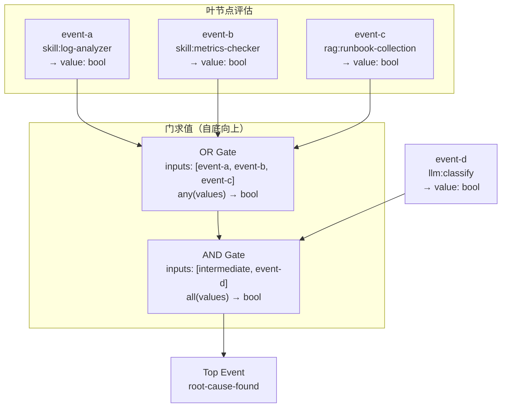
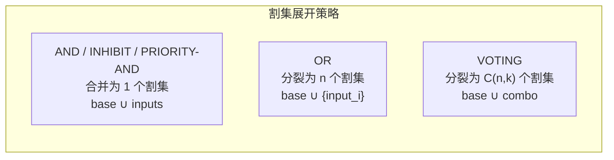
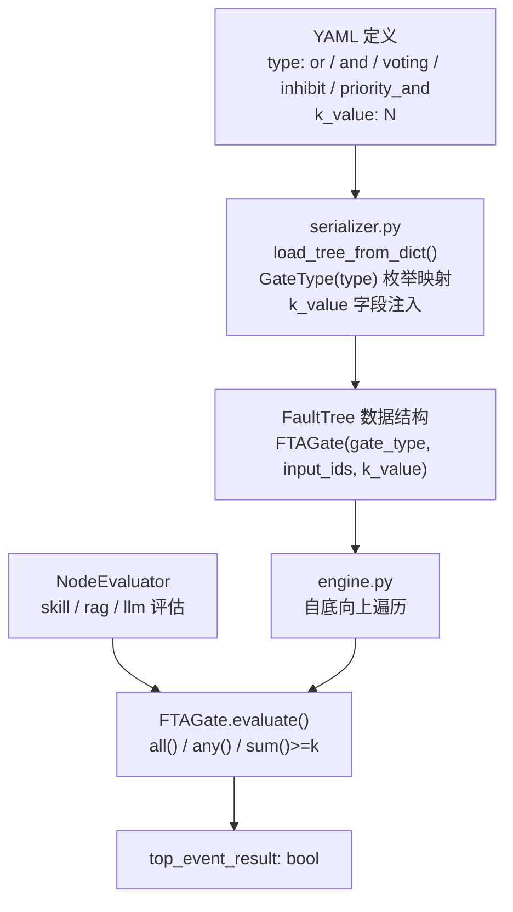

门（Gate）是 ResolveAgent FTA 引擎中连接事件节点并执行逻辑推理的核心原语。五种显式门类型（AND、OR、VOTING、INHIBIT、PRIORITY-AND）加上解析器为无显式门的中间节点自动合成的**隐式 OR 门**，共同构成了故障树布尔求值的完整体系。每种门在 `GateType` 枚举中注册，在 `FTAGate` 数据类中声明，并通过两种求值路径——`FTAGate.evaluate()` 内联求值和 [`gates.py`](python/src/resolveagent/fta/gates.py) 独立函数——提供可互换的逻辑计算。本文从第一性原理出发，逐一剖析每种门的布尔语义、数学定义、代码实现、割集展开行为及真实故障树场景中的应用模式。

Sources: [tree.py](python/src/resolveagent/fta/tree.py#L20-L78), [gates.py](python/src/resolveagent/fta/gates.py#L1-L29)

---

## 门类型的类型系统基础

ResolveAgent 的门类型体系建立在两个核心枚举之上。`GateType` 继承自 Python 的 `StrEnum`，这使得枚举值既是强类型标识符，也是可序列化的字符串——在 YAML 定义中以 `"and"` / `"or"` / `"voting"` / `"inhibit"` / `"priority_and"` 表示，在 JSON 种子数据中以大写 `"OR"` / `"AND"` 表示（序列化器 `serializer.py` 统一处理大小写映射）。`EventType` 枚举则定义了门所连接的事件节点的五种角色：**TOP**（顶级事件）、**INTERMEDIATE**（中间事件）、**BASIC**（基本/叶事件）、**UNDEVELOPED**（未展开事件）和 **CONDITIONING**（条件事件，专用于 INHIBIT 门）。

```python
class GateType(StrEnum):
    AND = "and"
    OR = "or"
    VOTING = "voting"
    INHIBIT = "inhibit"
    PRIORITY_AND = "priority_and"

class EventType(StrEnum):
    TOP = "top"
    INTERMEDIATE = "intermediate"
    BASIC = "basic"
    UNDEVELOPED = "undeveloped"
    CONDITIONING = "conditioning"
```

`FTAGate` 数据类是门的完整运行时表示，除 `id`、`name`、`gate_type`、`input_ids`、`output_id` 等结构字段外，还通过 `k_value: int = 1` 为 VOTING 门提供 k-of-n 参数，并通过内嵌的 `evaluate()` 方法直接执行布尔计算。

Sources: [tree.py](python/src/resolveagent/fta/tree.py#L10-L53), [tree.py](python/src/resolveagent/fta/tree.py#L44-L78)

---

## 门求值的两种实现路径

ResolveAgent 为门的布尔求值提供了两种并行的实现路径，二者在语义上完全一致，但服务于不同的架构场景：

**路径一：`FTAGate.evaluate()` 内联方法**——这是引擎运行时的主路径。`FTAEngine.execute()` 在自底向上遍历门时，直接调用 `gate.evaluate(tree.get_input_values(gate.id))`，其中 `tree.get_input_values()` 从关联事件节点的 `value` 字段收集布尔值列表，传递给门的 `evaluate()` 方法。方法内部通过 `if/elif` 分派到对应门类型的逻辑实现。

**路径二：`gates.py` 独立函数**——`and_gate()`、`or_gate()`、`voting_gate()`、`inhibit_gate()`、`priority_and_gate()` 五个纯函数，接受 `list[bool]` 输入（`voting_gate` 额外接受 `k: int`），返回 `bool`。这些函数主要用于单元测试和可组合的函数式调用场景。值得注意的是，两种路径的实现逻辑完全一致——`FTAGate.evaluate()` 内部直接使用了与独立函数相同的 `all()` / `any()` / `sum()` 原语。

```python
# FTAGate.evaluate() — engine.py:90 调用路径
def evaluate(self, input_values: list[bool]) -> bool:
    if not input_values:
        return False
    if self.gate_type == GateType.AND:
        return all(input_values)           # AND
    elif self.gate_type == GateType.OR:
        return any(input_values)           # OR
    elif self.gate_type == GateType.VOTING:
        return sum(input_values) >= self.k_value  # K-of-N
    elif self.gate_type == GateType.INHIBIT:
        return all(input_values)           # AND + 条件约束
    elif self.gate_type == GateType.PRIORITY_AND:
        return all(input_values)           # AND + 顺序依赖
```

**空输入防御**是一个关键的设计决策：所有门类型在 `input_values` 为空列表时统一返回 `False`。这遵循了故障树分析的保守原则——无证据时不认定故障发生。

Sources: [tree.py](python/src/resolveagent/fta/tree.py#L54-L78), [gates.py](python/src/resolveagent/fta/gates.py#L1-L29), [engine.py](python/src/resolveagent/fta/engine.py#L82-L99)

---

## AND 门：全量一致性求值

**布尔语义**：AND 门要求所有输入事件同时为 `True` 才输出 `True`。在传统 FTA 中，AND 门表示"多故障同时发生才导致上级故障"的联合因果关系。在 ResolveAgent 的 AIOps 语境中，AND 门常用于"多维度证据交叉验证"场景——例如"日志异常 AND 指标超限 AND AI 分析确认"三者同时成立才认定根因已定位。

**数学定义**：对于输入集合 $I = \{i_1, i_2, \ldots, i_n\}$，AND 门的输出为：

$$f_{\text{AND}}(I) = \bigwedge_{k=1}^{n} i_k = \prod_{k=1}^{n} i_k$$

当且仅当 $\forall k: i_k = 1$ 时，$f_{\text{AND}} = 1$。空集情形 $f_{\text{AND}}(\emptyset) = 0$（保守默认）。

**实现代码**：

```python
# gates.py:6-8
def and_gate(inputs: list[bool]) -> bool:
    """AND gate: all inputs must be True."""
    return all(inputs) if inputs else False

# tree.py:66-67 (FTAGate.evaluate 内联)
if self.gate_type == GateType.AND:
    return all(input_values)
```

**割集展开行为**：在 MOCUS 算法中，AND 门将当前割集的所有输入合并到同一割集中——因为 AND 门要求全部输入同时发生，所以单一割集必须包含所有输入事件。具体而言，`_expand_event_in_cut_set()` 对 AND 门执行 `base_cut_set | set(gate.input_ids)`，生成一个扩展后的割集。

**真值表**（三输入示例）：

| $i_1$ | $i_2$ | $i_3$ | $f_{\text{AND}}$ |
|:-----:|:-----:|:-----:|:----------------:|
| T | T | T | **T** |
| T | T | F | F |
| T | F | F | F |
| F | F | F | F |

**YAML 定义示例**：

```yaml
gates:
  - id: gate-final
    name: "最终诊断门"
    type: and
    inputs: [evidence-collected, ai-analysis]
    output: root-cause-found
```

Sources: [gates.py](python/src/resolveagent/fta/gates.py#L6-L8), [tree.py](python/src/resolveagent/fta/tree.py#L66-L67), [cut_sets.py](python/src/resolveagent/fta/cut_sets.py#L154-L158)

---

## OR 门：任一满足即通过

**布尔语义**：OR 门只需至少一个输入为 `True` 即输出 `True`。在 FTA 中，OR 门是最常见的门类型，表示"多种独立原因中任一即可导致上级故障"。ResolveAgent 的种子数据中，K8s Node NotReady、RDS 主从延迟、Pod 异常、API Server 异常等预置故障树全部使用 OR 门作为主要分支逻辑。

**数学定义**：

$$f_{\text{OR}}(I) = \bigvee_{k=1}^{n} i_k = 1 - \prod_{k=1}^{n}(1 - i_k)$$

当 $\exists k: i_k = 1$ 时，$f_{\text{OR}} = 1$。空集情形 $f_{\text{OR}}(\emptyset) = 0$。

**实现代码**：

```python
# gates.py:11-13
def or_gate(inputs: list[bool]) -> bool:
    """OR gate: at least one input must be True."""
    return any(inputs) if inputs else False

# tree.py:68-69
elif self.gate_type == GateType.OR:
    return any(input_values)
```

**割集展开行为**：OR 门是割集数量的主要膨胀点。`_expand_event_in_cut_set()` 对 OR 门的每个输入分别创建一个独立割集——因为 OR 门只需要任一输入发生，所以每个输入构成一条独立的故障路径。对于 n 输入 OR 门，一个包含该门的割集将分裂为 n 个独立割集。

**隐式 OR 门合成**：FTA Markdown 解析器 `FTAMarkdownParser` 为所有拥有子节点但无显式门定义的中间节点自动合成隐式 OR 门。例如，Mermaid 图中 `ROOT --> MID`、`MID --> LEAF1`、`MID --> LEAF2` 的结构，解析器会为 `MID` 节点生成 `gate_type=GateType.OR`、`input_ids=["LEAF1", "LEAF2"]`、`output_id="MID"` 的隐式门。这是"六种门类型"中的第六种——由系统自动注入。

```python
# fta_parser.py:196-214 — 隐式 OR 门合成
for nid in non_gate_parents:
    child_list = children_of[nid]
    if child_list:
        gate_id = f"gate-{nid}"
        gates.append(FTAGate(
            id=gate_id,
            name=f"Gate for {nodes[nid]}",
            gate_type=GateType.OR,
            input_ids=child_list,
            output_id=nid,
        ))
```

**真值表**（三输入示例）：

| $i_1$ | $i_2$ | $i_3$ | $f_{\text{OR}}$ |
|:-----:|:-----:|:-----:|:---------------:|
| T | T | T | **T** |
| T | F | F | **T** |
| F | T | F | **T** |
| F | F | F | F |

**YAML 定义示例**（来自 K8s Node NotReady 种子数据）：

```yaml
gates:
  - id: gate-001
    name: "NotReady 原因"
    type: or
    inputs: [evt-mid-001, evt-mid-002, evt-mid-003]
    output: evt-top-001
```

Sources: [gates.py](python/src/resolveagent/fta/gates.py#L11-L13), [tree.py](python/src/resolveagent/fta/tree.py#L68-L69), [cut_sets.py](python/src/resolveagent/fta/cut_sets.py#L145-L152), [fta_parser.py](python/src/resolveagent/corpus/fta_parser.py#L196-L214)

---

## VOTING 门：K-of-N 表决逻辑

**布尔语义**：VOTING 门实现 k-of-n 表决——在 n 个输入中，至少 k 个为 `True` 才输出 `True`。这是 AND 门和 OR 门的泛化：当 $k=1$ 时退化为 OR 门，当 $k=n$ 时退化为 AND 门。在 AIOps 场景中，VOTING 门适用于"多数投票确认"或"冗余检查共识"模式，例如"5 个监控指标中至少 3 个异常才触发告警"。

**数学定义**：

$$f_{\text{VOTING}}(I, k) = \mathbb{1}\left[\sum_{j=1}^{n} i_j \geq k\right]$$

其中 $\mathbb{1}[\cdot]$ 为指示函数。参数 $k$ 通过 `FTAGate.k_value` 字段传入，默认值为 `1`。

**实现代码**：

```python
# gates.py:16-18
def voting_gate(inputs: list[bool], k: int) -> bool:
    """VOTING gate: at least k-of-n inputs must be True."""
    return sum(inputs) >= k if inputs else False

# tree.py:70-71
elif self.gate_type == GateType.VOTING:
    return sum(input_values) >= self.k_value
```

**割集展开行为**：VOTING 门的割集展开使用组合数学——从 n 个输入中选取所有 $C(n, k)$ 种 k 元组合，每种组合构成一个独立割集。这是因为任意 k 个输入同时为真都足以触发门输出。当 n 较大而 k 适中时，割集数量会急剧膨胀（$C(n,k)$ 阶），这是 VOTING 门在大规模故障树中的主要性能考量点。

```python
# cut_sets.py:160-170 — VOTING 门的组合展开
elif gate.gate_type == GateType.VOTING:
    from itertools import combinations
    k = getattr(gate, "k_value", 1)
    new_cut_sets = []
    for combo in combinations(gate.input_ids, k):
        new_cut_set = base_cut_set | set(combo)
        new_cut_sets.append(new_cut_set)
    return new_cut_sets
```

**YAML 定义中的 k_value 配置**：

```yaml
gates:
  - id: gate-voting
    name: "多数指标异常"
    type: voting
    k_value: 2            # 至少 2 个输入为真
    inputs: [metric-a, metric-b, metric-c]
    output: alert-trigger
```

`serializer.py` 在反序列化时读取 `k_value` 字段（默认 `1`），并在序列化时写回：

```python
# serializer.py:59
k_value=gate_data.get("k_value", 1),
```

**真值表**（2-of-3 VOTING）：

| $i_1$ | $i_2$ | $i_3$ | $\sum$ | $f_{\text{VOTING}}$ |
|:-----:|:-----:|:-----:|:------:|:--------------------:|
| T | T | T | 3 | **T** |
| T | T | F | 2 | **T** |
| T | F | T | 2 | **T** |
| F | T | T | 2 | **T** |
| T | F | F | 1 | F |
| F | F | F | 0 | F |

Sources: [gates.py](python/src/resolveagent/fta/gates.py#L16-L18), [tree.py](python/src/resolveagent/fta/tree.py#L70-L71), [cut_sets.py](python/src/resolveagent/fta/cut_sets.py#L160-L170), [serializer.py](python/src/resolveagent/fta/serializer.py#L59)

---

## INHIBIT 门：带条件约束的逻辑与

**布尔语义**：INHIBIT 门在经典 FTA 中表示"主事件在条件事件成立时才传递"的抑制逻辑。其标准图形符号为一个六边形，右侧附条件事件。在 ResolveAgent 的实现中，INHIBIT 门的布尔计算与 AND 门等价（`all(inputs)`），但其语义区分体现在两个方面：**事件模型层面**——`EventType.CONDITIONING` 专用于标记 INHIBIT 门的条件输入；**可解释性层面**——割集解释器 `explain_cut_sets()` 可区分"主事件"和"抑制条件"的不同语义角色。

**数学定义**：

$$f_{\text{INHIBIT}}(M, C) = M \land C$$

其中 $M$ 为主事件（main event），$C$ 为条件事件（conditioning event）。当输入多于两个时，推广为 $f_{\text{INHIBIT}}(I) = \bigwedge_{k} i_k$。

**实现代码**：

```python
# gates.py:21-23
def inhibit_gate(inputs: list[bool]) -> bool:
    """INHIBIT gate: AND with conditioning event."""
    return all(inputs) if inputs else False

# tree.py:72-74
elif self.gate_type == GateType.INHIBIT:
    # INHIBIT: AND gate with a conditioning event
    return all(input_values)
```

**割集展开行为**：INHIBIT 门在割集计算中与 AND 门行为一致——将所有输入合并到同一割集中。这是因为从最小割集的角度看，"主事件 + 条件事件同时成立"等价于"所有输入事件的联合"。

```python
# cut_sets.py:172-175
elif gate.gate_type in (GateType.INHIBIT, GateType.PRIORITY_AND):
    # These behave like AND gates for cut set computation
    new_cut_set = base_cut_set | set(gate.input_ids)
    return [new_cut_set]
```

**YAML 定义示例**：

```yaml
events:
  - id: main-failure
    name: "主服务崩溃"
    type: basic
    evaluator: "skill:service-check"
  - id: condition-no-failover
    name: "容灾切换未生效"
    type: conditioning      # 条件事件，专用于 INHIBIT 门
    evaluator: "skill:failover-check"

gates:
  - id: gate-inhibit
    name: "服务不可用（容灾未生效）"
    type: inhibit
    inputs: [main-failure, condition-no-failover]
    output: service-unavailable
```

**典型场景**：INHIBIT 门适用于"主故障在特定条件下才传播"的建模——如"数据库主库宕机 AND 手动切换未配置"才导致服务完全不可用。条件事件的引入使得故障树能够表达**条件概率**的语义，而非简单的联合概率。

Sources: [gates.py](python/src/resolveagent/fta/gates.py#L21-L23), [tree.py](python/src/resolveagent/fta/tree.py#L72-L74), [tree.py](python/src/resolveagent/fta/tree.py#L17), [cut_sets.py](python/src/resolveagent/fta/cut_sets.py#L172-L175)

---

## PRIORITY-AND 门：顺序敏感的逻辑与

**布尔语义**：PRIORITY-AND 门是带顺序依赖的 AND 门——不仅要求所有输入为真，还要求输入按指定顺序依次成立。在当前实现中，其布尔求值与 AND 门等价（`all(inputs)`），顺序语义作为**声明性约束**保留在门的元数据中，为后续的顺序感知执行器提供扩展点。这意味着在当前的 `FTAGate.evaluate()` 路径中，PRIORITY-AND 和 AND 的输出完全一致；差异在**工作流编排层面**体现——`engine.py` 的自底向上求值器应按 `input_ids` 列表的声明顺序依次评估。

**数学定义**：

$$f_{\text{PRIORITY-AND}}(I) = \bigwedge_{k=1}^{n} i_k \land \text{Ordered}(I)$$

其中 $\text{Ordered}(I)$ 表示输入按声明顺序依次为真的时序约束。当前实现简化为 $f_{\text{PRIORITY-AND}}(I) = \bigwedge_{k} i_k$。

**实现代码**：

```python
# gates.py:26-28
def priority_and_gate(inputs: list[bool]) -> bool:
    """PRIORITY-AND gate: AND with order dependency."""
    return all(inputs) if inputs else False

# tree.py:75-77
elif self.gate_type == GateType.PRIORITY_AND:
    # PRIORITY_AND: AND with order dependency
    return all(input_values)
```

**割集展开行为**：与 AND 门和 INHIBIT 门一致——所有输入合并到同一割集。这反映了"所有输入事件必须同时发生"的最小割集语义，暂时忽略了顺序约束（顺序信息在割集分析中通常被抽象掉）。

**YAML 定义示例**：

```yaml
gates:
  - id: gate-priority
    name: "有序健康检查"
    type: priority_and
    inputs:                    # 按顺序依赖排列
      - network-ready         # 先检查网络
      - service-started       # 再检查服务启动
      - health-pass           # 最后检查健康探针
    output: deployment-ready
```

**典型场景**：PRIORITY-AND 门适用于"有先后依赖关系的检查链"建模——如"先检查配置合法性 → 再启动服务 → 最后验证健康探针"。在 Kubernetes 语境中，Init Container → 主容器启动 → Readiness Probe 通过的顺序依赖链是典型的 PRIORITY-AND 应用。

Sources: [gates.py](python/src/resolveagent/fta/gates.py#L26-L28), [tree.py](python/src/resolveagent/fta/tree.py#L75-L77), [cut_sets.py](python/src/resolveagent/fta/cut_sets.py#L172-L175)

---

## 五种门类型的系统化对比

| 维度 | AND | OR | VOTING | INHIBIT | PRIORITY-AND |
|:-----|:----|:---|:-------|:--------|:-------------|
| **布尔核心** | `all()` | `any()` | `sum() >= k` | `all()` | `all()` |
| **数学表示** | $\bigwedge i_k$ | $\bigvee i_k$ | $\mathbb{1}[\sum i_k \geq k]$ | $M \land C$ | $\bigwedge i_k \land \text{Ord}$ |
| **空输入默认** | `False` | `False` | `False` | `False` | `False` |
| **割集展开** | 合并为1个 | 分裂为 n 个 | 分裂为 $C(n,k)$ 个 | 合并为1个 | 合并为1个 |
| **特有参数** | 无 | 无 | `k_value` | 无（ Conditioning 事件类型） | 无（顺序由 `input_ids` 列表隐含） |
| **关联事件类型** | BASIC / INTERMEDIATE | BASIC / INTERMEDIATE | BASIC / INTERMEDIATE | BASIC + **CONDITIONING** | BASIC（有序） |
| **FTA 符号** | 椭圆门 | 盾形门 | 椭圆门 + k/n 标注 | 六边形 + 条件输入 | 椭圆门 + 序号标注 |

**关键洞察**：AND、INHIBIT、PRIORITY-AND 三者在布尔求值层面完全等价（均为 `all()`），差异仅在语义建模层面——INHIBIT 通过 `CONDITIONING` 事件类型引入条件约束概念，PRIORITY-AND 通过 `input_ids` 列表顺序引入时序依赖。这种"布尔等价、语义分化"的设计使得引擎核心保持极简（只需 3 种布尔原语：`all`、`any`、`sum>=k`），同时支持丰富的领域建模。

Sources: [tree.py](python/src/resolveagent/fta/tree.py#L20-L27), [gates.py](python/src/resolveagent/fta/gates.py#L1-L29), [cut_sets.py](python/src/resolveagent/fta/cut_sets.py#L145-L184)

---

## 求值流程中的门调用链

门求值嵌入在 `FTAEngine.execute()` 的自底向上遍历循环中。引擎首先并行评估所有基本事件（通过 `NodeEvaluator.evaluate()` 调用 skill / rag / llm / static / context 五种评估器），收集布尔结果到 `event_results` 字典，然后通过 `tree.get_gates_bottom_up()` 获取按依赖顺序排列的门列表，逐个调用 `gate.evaluate(tree.get_input_values(gate.id))`。



**`get_input_values()` 的收集逻辑**：对于每个门，该方法遍历 `gate.input_ids`，从 `FaultTree.events` 中查找对应事件，并提取其 `value` 字段。这意味着门的输入不仅可以是叶事件（BASIC），也可以是中间事件（INTERMEDIATE）——只要该中间事件已被上层门的输出赋值。在当前实现中，中间事件的值通过 `gate_results` 字典隐式传递（最终一个门的结果被赋给 `top_event_result`），但 `get_input_values()` 的查找仅限于 `events` 列表中的 `FTAEvent.value`。

Sources: [engine.py](python/src/resolveagent/fta/engine.py#L60-L99), [tree.py](python/src/resolveagent/fta/tree.py#L103-L119)

---

## 割集计算中的门展开策略

`cut_sets.py` 实现的 MOCUS（Method of Obtaining Cut Sets）算法是门求值的另一条重要路径——不是计算布尔输出，而是枚举导致顶级事件发生的**最小故障组合**。五种门类型在该算法中展现出三种不同的展开策略：



| 门类型 | 展开公式 | 割集数量增长 |
|:-------|:---------|:------------|
| AND / INHIBIT / PRIORITY-AND | $CS' = CS \setminus \{e\} \cup I$ | 1 → 1（不变） |
| OR | $CS' = \{CS \setminus \{e\} \cup \{i_j\} \mid i_j \in I\}$ | 1 → $n$（线性） |
| VOTING | $CS' = \{CS \setminus \{e\} \cup C \mid C \in \binom{I}{k}\}$ | 1 → $C(n,k)$（组合） |

展开后的割集还需经过 `_remove_absorbed_cut_sets()` 吸收消除——如果割集 A 是割集 B 的子集，则 B 被 A 吸收（移除），因为 A 已是更小的充分条件。最终结果通过 `rank_cut_sets_by_importance()` 按概率降序排列，为运维人员提供"最可能的故障组合"优先级列表。

Sources: [cut_sets.py](python/src/resolveagent/fta/cut_sets.py#L125-L184), [cut_sets.py](python/src/resolveagent/fta/cut_sets.py#L187-L221), [cut_sets.py](python/src/resolveagent/fta/cut_sets.py#L289-L310)

---

## 单元测试验证矩阵

`test_fta_engine.py` 为三种核心门类型提供了精确的边界条件测试，覆盖了正常输入、全假输入和空输入三种场景：

```python
# AND 门：全真才真，含空输入
assert and_gate([True, True]) is True
assert and_gate([True, False]) is False
assert and_gate([False, False]) is False
assert and_gate([]) is False              # 空输入防御

# OR 门：任一真即真，含空输入
assert or_gate([True, False]) is True
assert or_gate([False, False]) is False
assert or_gate([True, True]) is True
assert or_gate([]) is False              # 空输入防御

# VOTING 门：k-of-n 表决
assert voting_gate([True, True, False], k=2) is True     # 2-of-3 满足
assert voting_gate([True, False, False], k=2) is False   # 1-of-3 不满足
assert voting_gate([True, True, True], k=3) is True      # 3-of-3 满足
```

INHIBIT 和 PRIORITY-AND 的布尔语义与 AND 完全等价，因此未单独测试——这是"布尔等价、语义分化"设计在测试层面的自然反映。

Sources: [test_fta_engine.py](python/tests/unit/test_fta_engine.py#L1-L40)

---

## 从 YAML 到运行时：门的完整生命周期

门的完整数据流经过三个阶段：**定义 → 序列化 → 执行**。以下 Mermaid 图展示了从 YAML 定义到布尔求值的完整路径：



**序列化器** `serializer.py` 是 YAML 世界与运行时世界之间的桥梁。`load_tree_from_dict()` 将 YAML 的 `type: "or"` 字符串映射为 `GateType.OR` 枚举，将 `k_value: 2` 注入 `FTAGate.k_value` 字段。`dump_tree_to_yaml()` 执行反向映射。值得注意的是，种子 SQL 数据中使用大写 `"OR"` 而非小写 `"or"`，但 `GateType` 的 `StrEnum` 特性确保了大小写不敏感的匹配（通过 `GateType(value)` 构造，Python StrEnum 在 3.11+ 使用 `.lower()` 进行值匹配）。

Sources: [serializer.py](python/src/resolveagent/fta/serializer.py#L50-L70), [seed-fta.sql](scripts/seed/seed-fta.sql#L26-L30)

---

## 下一步阅读

理解了六种门类型的求值机制后，建议按以下顺序继续深入：

- **[故障树数据结构：事件、门与树模型](11-gu-zhang-shu-shu-ju-jie-gou-shi-jian-men-yu-shu-mo-xing)** —— 回溯了解 `FTAEvent`、`FTAGate`、`FaultTree` 三个核心数据类的完整字段定义与关系模型
- **[FTA 工作流执行：自底向上求值与结果持久化](13-fta-gong-zuo-liu-zhi-xing-zi-di-xiang-shang-qiu-zhi-yu-jie-guo-chi-jiu-hua)** —— 深入 `FTAEngine.execute()` 的完整执行流程、事件流协议与 Go 平台侧的结果持久化机制