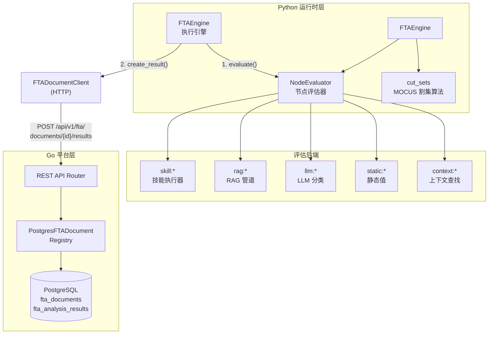
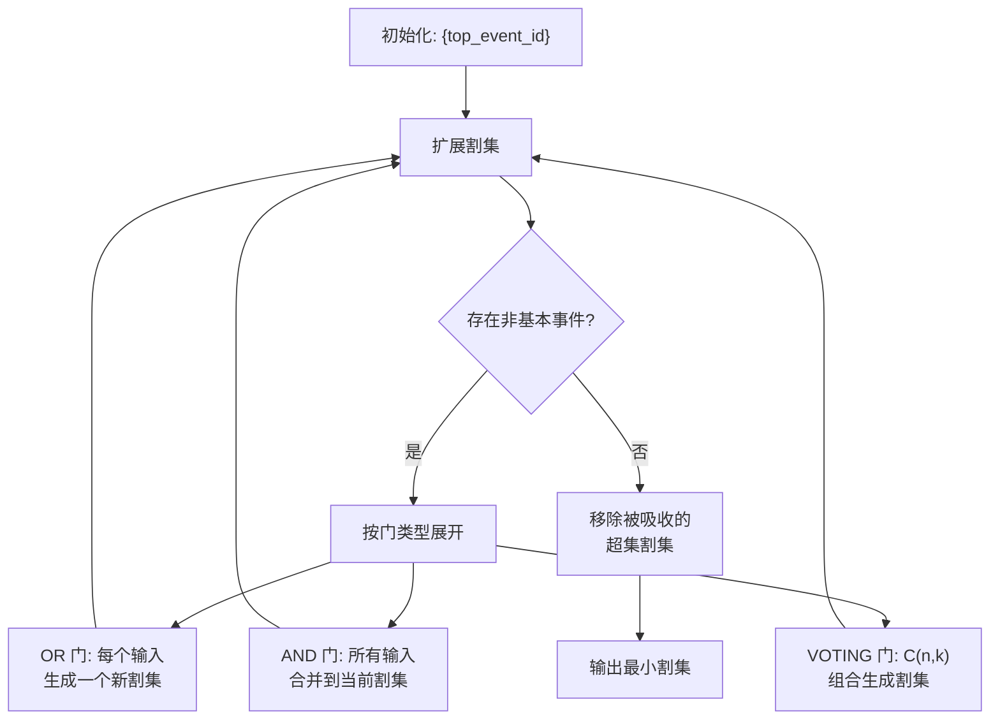
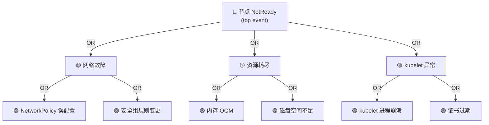
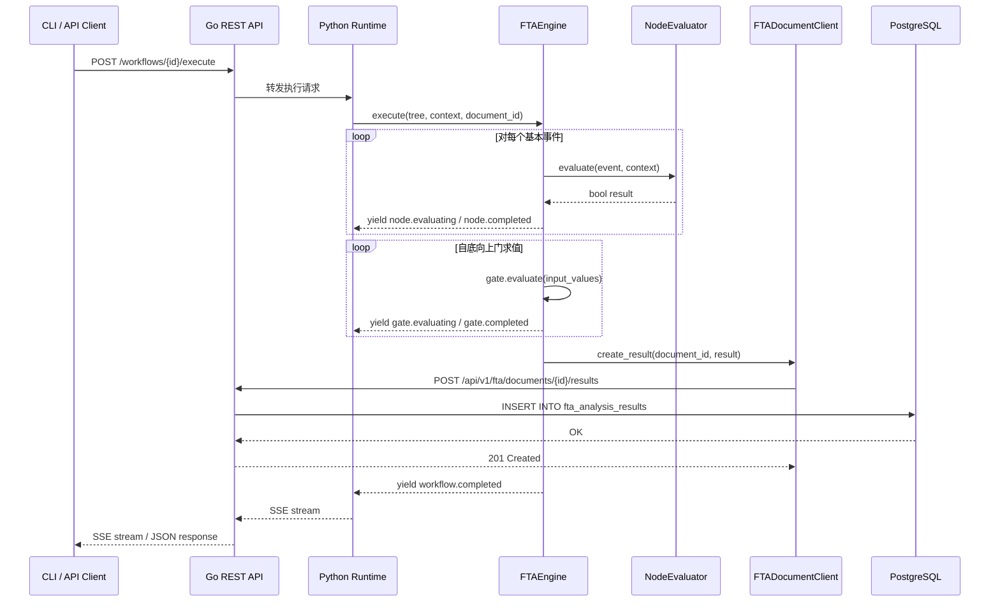

**FTAEngine** 是 ResolveAgent 故障树分析引擎的执行核心——它接收一棵完整的 `FaultTree`，从叶子节点（基本事件）开始逐层向上求值，经逻辑门传播布尔结果，最终产出顶事件结论与最小割集。本页聚焦于执行流程的内部机制、求值策略、割集计算以及跨语言持久化链路。在阅读本文之前，建议先了解 [故障树数据结构：事件、门与树模型](11-gu-zhang-shu-shu-ju-jie-gou-shi-jian-men-yu-shu-mo-xing) 和 [六种门类型求值：AND / OR / VOTING / INHIBIT / PRIORITY-AND](12-liu-chong-men-lei-xing-qiu-zhi-and-or-voting-inhibit-priority-and) 中定义的数据结构。

Sources: [engine.py](python/src/resolveagent/fta/engine.py#L1-L130)

## 整体架构：Python 执行 + Go 持久化

FTA 工作流的执行架构遵循 ResolveAgent 的**双语言运行时**分层设计：Python 运行时负责实际的树遍历、节点求值与门逻辑传播，Go 平台层负责数据持久化（文档存储与分析结果归档）。二者通过 REST API 接口连接，Python 侧的 `FTADocumentClient` 作为 HTTP 客户端向 Go Server 写入结果。



上图展示了执行链路的两个关键阶段：**求值**（Python 侧）和**持久化**（Go 侧）。`FTAEngine` 在构造时可选注入 `fta_client`（即 `FTADocumentClient` 实例），当执行完成且提供了 `document_id` 时，自动将分析结果通过 HTTP POST 持久化到 Go 平台。

Sources: [engine.py](python/src/resolveagent/fta/engine.py#L20-L33), [fta_document_client.py](python/src/resolveagent/store/fta_document_client.py#L44-L94), [router.go](pkg/server/router.go#L81-L88)

## FTAEngine 核心执行流程

`FTAEngine` 的 `execute()` 方法是整个 FTA 工作流的入口。它是一个 **异步生成器**（`AsyncIterator`），在执行的每个关键节点向外 yield 事件字典，支持流式进度上报。执行流程分为四个清晰的阶段：

Sources: [engine.py](python/src/resolveagent/fta/engine.py#L34-L129)

### 阶段一：初始化与叶子节点求值

```python
# engine.py L50-L79
execution_id = str(uuid.uuid4())
gate_results: dict[str, Any] = {}
event_results: dict[str, Any] = {}

for event in tree.get_basic_events():
    yield {"type": "node.evaluating", "node_id": event.id, ...}
    result = await self.evaluator.evaluate(event, context or {})
    event_results[event.id] = result
    yield {"type": "node.completed", "node_id": event.id, "data": {"result": result}}
```

引擎首先遍历所有基本事件（叶子节点），调用 `NodeEvaluator.evaluate()` 对每个事件进行异步求值。每个事件的结果被收集到 `event_results` 字典中，以事件 ID 为键、布尔值为值。这一阶段是 I/O 密集型的——事件可能触发技能执行、RAG 查询或 LLM 调用。

Sources: [engine.py](python/src/resolveagent/fta/engine.py#L50-L79)

### 阶段二：自底向上门求值

```python
# engine.py L82-L99
top_event_result = False
for gate in tree.get_gates_bottom_up():
    yield {"type": "gate.evaluating", "node_id": gate.id, ...}
    result = gate.evaluate(tree.get_input_values(gate.id))
    gate_results[gate.id] = result
    top_event_result = result  # 最后一个门即为顶事件
```

这是 FTA 的核心算法步骤。`tree.get_gates_bottom_up()` 返回按**自底向上顺序**排列的门列表，确保任何门的输入值在其自身求值之前已经可用。当前实现通过 `list(reversed(self.gates))` 简化排序（YAML 定义中门已按从底到顶排列），代码注释标记了后续需要实现拓扑排序。最后一个门的输出值即为顶事件的最终结论。

Sources: [engine.py](python/src/resolveagent/fta/engine.py#L82-L99), [tree.py](python/src/resolveagent/fta/tree.py#L103-L106)

### 阶段三：结果持久化

```python
# engine.py L104-L119
if self._fta_client and document_id:
    try:
        await self._fta_client.create_result(document_id, {
            "execution_id": execution_id,
            "top_event_result": top_event_result,
            "basic_event_probabilities": event_results,
            "gate_results": gate_results,
            "status": "completed",
            "duration_ms": duration_ms,
            "context": context or {},
        })
    except Exception as e:
        logger.warning("Failed to persist FTA result", extra={"error": str(e)})
```

当 `fta_client` 和 `document_id` 均可用时，引擎将完整的分析结果（包括执行 ID、顶事件结果、基本事件概率、门结果、耗时等）通过 HTTP POST 写入 Go 平台。**持久化失败不会中断工作流执行**——异常被捕获并记录为警告，确保分析结果始终能返回给调用者。

Sources: [engine.py](python/src/resolveagent/fta/engine.py#L104-L119)

### 阶段四：完成通知

最终引擎 yield 一个 `workflow.completed` 事件，携带 `execution_id`、`top_event_result` 和 `duration_ms`，标志着整个 FTA 分析的结束。

Sources: [engine.py](python/src/resolveagent/fta/engine.py#L121-L129)

## 流式事件类型总览

FTA 工作流在执行过程中会产生六种类型的事件，每种事件携带不同的元数据。这些事件构成了前端可消费的 SSE（Server-Sent Events）流：

| 事件类型 | 触发时机 | 关键字段 |
|---|---|---|
| `workflow.started` | 工作流开始 | `message` |
| `node.evaluating` | 基本事件求值前 | `node_id`, `message` |
| `node.completed` | 基本事件求值后 | `node_id`, `data.result` |
| `gate.evaluating` | 门逻辑计算前 | `node_id`, `message`（含门类型） |
| `gate.completed` | 门逻辑计算后 | `node_id`, `data.result` |
| `workflow.completed` | 工作流结束 | `data.execution_id`, `data.top_event_result`, `data.duration_ms` |

Sources: [engine.py](python/src/resolveagent/fta/engine.py#L55-L129)

## NodeEvaluator：五种评估后端

`NodeEvaluator` 负责将基本事件转化为布尔值。它通过解析事件上的 `evaluator` 字符串（格式为 `type:target`）分派到不同的评估后端。评估器内部维护了一个 `_cache` 字典，以 `{event_id}:{context_hash}` 为键缓存结果，避免同一事件在相同上下文下重复求值。

Sources: [evaluator.py](python/src/resolveagent/fta/evaluator.py#L21-L110)

| 评估类型 | evaluator 格式 | 适用场景 | 返回值语义 |
|---|---|---|---|
| **skill** | `skill:log-analyzer` | 调用已注册技能检查特定条件 | 技能执行结果的布尔解析 |
| **rag** | `rag:runbook-collection` | 从 RAG 知识库检索相关文档 | 最高相似度是否超过阈值（默认 0.7） |
| **llm** | `llm:qwen-plus` | 调用 LLM 做分类判断 | LLM 返回 `true`/`false` 的解析 |
| **static** | `static:true` | 静态布尔值赋值 | 直接解析字符串为布尔值 |
| **context** | `context:event.status` | 从执行上下文中查找值 | 支持点号分隔的嵌套键路径查找 |

当评估器未定义（`event.evaluator` 为空）时，默认返回 `True`（保守策略）；当评估发生异常时，返回 `False`（故障安全策略，表示事件未发生）。

Sources: [evaluator.py](python/src/resolveagent/fta/evaluator.py#L71-L110)

### Skill 评估器详解

Skill 评估器将事件参数与执行上下文合并后，调用 `SkillExecutor.execute()` 执行目标技能。返回值经过多路解析：原生布尔值直接使用；字典类型依次检查 `result`、`matched`、`found` 标准字段；数值类型以 `> 0` 为真。这种灵活的结果解析策略使 Skill 评估器能兼容各种返回格式的技能实现。

Sources: [evaluator.py](python/src/resolveagent/fta/evaluator.py#L112-L169)

### RAG 评估器详解

RAG 评估器调用 RAG 管道的 `query()` 方法在指定集合中检索文档，取返回结果中的最高相似度分数与阈值（默认 0.7）比较。查询文本来源于事件参数中的 `query` 字段或执行上下文的 `query` 字段。`top_k` 参数控制检索的文档数量（默认为 3）。

Sources: [evaluator.py](python/src/resolveagent/fta/evaluator.py#L171-L242)

### LLM 评估器详解

LLM 评估器构建一个分类提示，以 `temperature=0.0`（确保结果一致性）和 `max_tokens=10` 调用 LLM。系统消息固定为 `"You are a classifier. Respond with only 'true' or 'false'."`。响应解析采用防御式策略：仅在响应明确包含 `true` 且不包含 `false` 时返回 `True`，否则检查 `true` 是否出现。

Sources: [evaluator.py](python/src/resolveagent/fta/evaluator.py#L244-L319)

## 最小割集计算：MOCUS 算法

`cut_sets` 模块实现了 **MOCUS（Method of Obtaining Cut Sets）算法**，用于计算故障树的最小割集。最小割集是使顶事件发生的最小基本事件组合——它是 FTA 结果可解释性的核心。

Sources: [cut_sets.py](python/src/resolveagent/fta/cut_sets.py#L1-L66)

### 算法流程



算法从顶事件开始，将初始割集设为 `{top_event_id}`。每次迭代中，找到割集中第一个非基本事件，根据其对应的门类型展开：OR 门为每个输入生成独立割集（任一输入即可触发输出），AND门将所有输入合并到同一个割集（所有输入同时发生才会触发输出）。VOTING 门使用组合数学生成 C(n,k) 个割集。迭代持续到所有割集中的事件都是基本事件为止。最后通过**吸收检查**移除被其他割集包含的超集，确保输出的是最小割集。

Sources: [cut_sets.py](python/src/resolveagent/fta/cut_sets.py#L68-L122), [cut_sets.py](python/src/resolveagent/fta/cut_sets.py#L187-L221)

### 割集解释与重要性排序

`explain_cut_sets()` 函数将割集转换为人类可读的解释字符串，例如 `"Cut Set 1: 内存 OOM AND 磁盘空间不足"`。`rank_cut_sets_by_importance()` 基于概率模型对割集排序——假设事件相互独立，割集概率等于其所有事件概率的乘积 `P(A∩B) = P(A) × P(B)`，排序结果按概率降序（最可能的故障路径优先）和割集大小升序排列。

Sources: [cut_sets.py](python/src/resolveagent/fta/cut_sets.py#L224-L311)

## 跨语言持久化链路

FTA 分析结果的持久化涉及 Python 运行时和 Go 平台之间的协作，数据流经三个层级：

Sources: [fta_document_client.py](python/src/resolveagent/store/fta_document_client.py#L93-L94), [router.go](pkg/server/router.go#L1509-L1535), [fta_document_store.go](pkg/store/postgres/fta_document_store.go#L159-L172)

### 持久化数据模型

分析结果在 Go 侧的 `FTAAnalysisResult` 结构体中包含以下字段：

| 字段 | PostgreSQL 列 | 类型 | 说明 |
|---|---|---|---|
| `id` | `id` | UUID | 自动生成 |
| `document_id` | `document_id` | UUID | 关联的 FTA 文档（外键，级联删除） |
| `execution_id` | `execution_id` | UUID | Python 运行时生成的执行标识 |
| `top_event_result` | `top_event_result` | BOOLEAN | 顶事件最终结论 |
| `minimal_cut_sets` | `minimal_cut_sets` | JSONB | MOCUS 算法产出的最小割集 |
| `basic_event_probabilities` | `basic_event_probabilities` | JSONB | 各基本事件的求值结果 |
| `gate_results` | `gate_results` | JSONB | 各门逻辑的计算结果 |
| `importance_measures` | `importance_measures` | JSONB | 重要性度量指标 |
| `status` | `status` | VARCHAR(50) | `"completed"` 或 `"failed"` |
| `duration_ms` | `duration_ms` | INTEGER | 执行耗时（毫秒） |
| `context` | `context` | JSONB | 执行上下文快照 |
| `created_at` | `created_at` | TIMESTAMPTZ | 自动生成 |

数据库 Schema 通过 `004_fta_documents.up.sql` 迁移脚本创建。`fta_analysis_results` 表通过 `document_id` 外键关联 `fta_documents`，并设置了 `ON DELETE CASCADE` 约束——删除 FTA 文档时自动清理其所有分析结果。

Sources: [004_fta_documents.up.sql](scripts/migration/004_fta_documents.up.sql#L31-L44), [fta_document.go](pkg/registry/fta_document.go#L27-L40)

### Go 侧存储后端双实现

Go 平台为 `FTADocumentRegistry` 接口提供了两种实现：

| 实现 | 用途 | 并发安全 | 存储位置 |
|---|---|---|---|
| `InMemoryFTADocumentRegistry` | 开发/测试 | `sync.RWMutex` | 内存 `map[string]*FTADocument` |
| `PostgresFTADocumentRegistry` | 生产环境 | pgx 连接池 | PostgreSQL `fta_documents` / `fta_analysis_results` 表 |

内存实现使用读写锁保护并发访问，删除文档时级联清理 `results` 映射中的关联分析结果。PostgreSQL 实现使用 pgx 驱动的预备语句和连接池，所有 JSON 字段（`fault_tree`、`minimal_cut_sets` 等）以 `JSONB` 类型存储，支持高效的 JSON 路径查询。

Sources: [fta_document.go](pkg/registry/fta_document.go#L55-L68), [fta_document_store.go](pkg/store/postgres/fta_document_store.go#L12-L19)

### REST API 端点

Go 平台的 HTTP Router 注册了以下 FTA 相关端点：

| 方法 | 路径 | 处理函数 | 说明 |
|---|---|---|---|
| GET | `/api/v1/fta/documents` | `handleListFTADocuments` | 列出所有 FTA 文档 |
| POST | `/api/v1/fta/documents` | `handleCreateFTADocument` | 创建 FTA 文档 |
| GET | `/api/v1/fta/documents/{id}` | `handleGetFTADocument` | 获取单个文档 |
| PUT | `/api/v1/fta/documents/{id}` | `handleUpdateFTADocument` | 更新文档 |
| DELETE | `/api/v1/fta/documents/{id}` | `handleDeleteFTADocument` | 删除文档 |
| GET | `/api/v1/fta/documents/{id}/results` | `handleListFTAResults` | 列出文档的分析结果 |
| POST | `/api/v1/fta/documents/{id}/results` | `handleCreateFTAResult` | 创建分析结果 |

Python 侧的 `FTADocumentClient` 封装了这些端点的调用，继承自 `BaseStoreClient`（基于 `httpx.AsyncClient`），在 `connect()` 时建立连接，`close()` 时释放。

Sources: [router.go](pkg/server/router.go#L82-L88), [fta_document_client.py](python/src/resolveagent/store/fta_document_client.py#L44-L113), [base_client.py](python/src/resolveagent/store/base_client.py#L13-L36)

## 执行入口：从 CLI 到引擎

工作流执行有两条主要入口路径：

### CLI 入口

```bash
resolveagent workflow run <workflow-id> --input data.json
```

CLI 的 `run` 命令解析输入数据（来自文件 `--input` 或内联 `--data`），通过 API Client 向 Go 平台发送 `POST /api/v1/workflows/{id}/execute` 请求。支持同步（默认）和异步（`--async`）两种执行模式。

Sources: [run.go](internal/cli/workflow/run.go#L13-L96)

### 运行时引擎入口

Python 运行时的 `ExecutionEngine.execute_workflow()` 方法从注册表加载工作流定义，构建 `Workflow` 对象后逐步执行节点。当工作流包含 FTA 故障树时，引擎会实例化 `FTAEngine` 并调用其 `execute()` 方法。

Sources: [engine.py](python/src/resolveagent/runtime/engine.py#L568-L640)

### 语料库导入入口

`FTACorpusImporter` 负责从 Kudig 风格的 Markdown 文件中解析故障树，通过 `FTAMarkdownParser` 提取 Mermaid 图表和 JSON 块，构建 `FaultTree` 对象后注册为 FTA 文档并导入 RAG 索引。

Sources: [fta_importer.py](python/src/resolveagent/corpus/fta_importer.py#L25-L131), [fta_parser.py](python/src/resolveagent/corpus/fta_parser.py#L60-L97)

## 种子数据与实际故障树示例

系统预置了多套覆盖 Kubernetes 常见故障场景的故障树种子数据。以下是一个典型的三层故障树结构示例——**K8s 节点 NotReady 故障树**：



预置故障树覆盖的 Kubernetes 组件包括：

| 故障树 ID | 组件 | 基本事件数 | 门数 |
|---|---|---|---|
| `ft-k8s-node-notready` | K8s 节点 NotReady | 6 | 4 |
| `ft-rds-replication-lag` | RDS 主从延迟 | 5 | 3 |
| `ft-kudig-node` | Node 节点异常 | 7 | 5 |
| `ft-kudig-pod` | Pod 异常 | 6 | 4 |
| `ft-kudig-apiserver` | API Server 异常 | 5 | 3 |
| `ft-kudig-etcd` | Etcd 异常 | 4 | 2 |
| `ft-kudig-dns` | DNS 解析异常 | 4 | 2 |
| `ft-kudig-deployment` | Deployment 异常 | 4 | 2 |
| `ft-kudig-service` | Service 连通性 | 4 | 2 |

Sources: [seed-fta.sql](scripts/seed/seed-fta.sql#L1-L31)

## 完整执行数据流

将上述所有组件串联起来，一次完整的 FTA 工作流执行经历以下数据流：



Sources: [engine.py](python/src/resolveagent/fta/engine.py#L34-L129), [fta_document_client.py](python/src/resolveagent/store/fta_document_client.py#L93-L94), [fta_document_store.go](pkg/store/postgres/fta_document_store.go#L159-L172), [router.go](pkg/server/router.go#L1509-L1535)

---

**相关阅读**：本文聚焦于执行引擎的实现细节。若需了解故障树的数据结构定义，请参阅 [故障树数据结构：事件、门与树模型](11-gu-zhang-shu-shu-ju-jie-gou-shi-jian-men-yu-shu-mo-xing)；若需深入了解门逻辑的数学语义，请参阅 [六种门类型求值：AND / OR / VOTING / INHIBIT / PRIORITY-AND](12-liu-chong-men-lei-xing-qiu-zhi-and-or-voting-inhibit-priority-and)；若需了解执行结果如何通过 REST API 暴露，请参阅 [REST API 完整参考：端点、请求/响应格式与错误处理](32-rest-api-wan-zheng-can-kao-duan-dian-qing-qiu-xiang-ying-ge-shi-yu-cuo-wu-chu-li)。