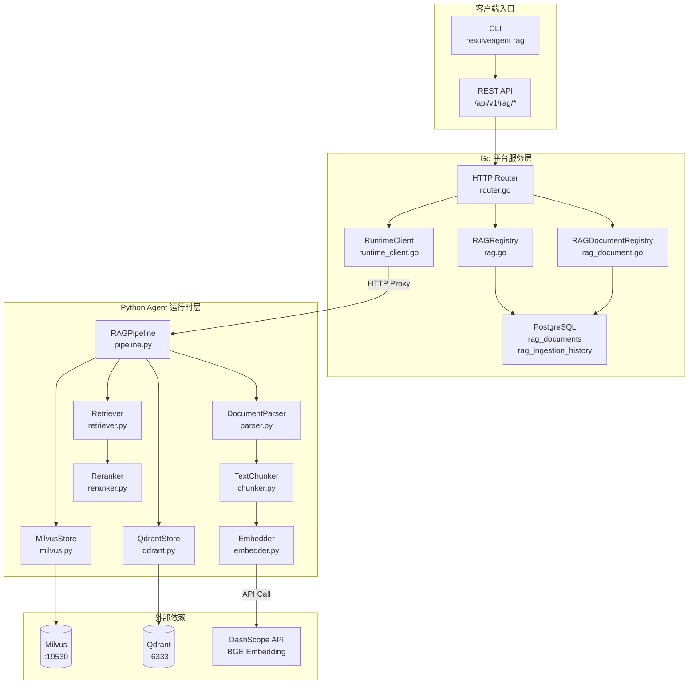
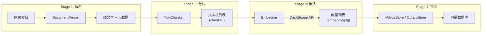
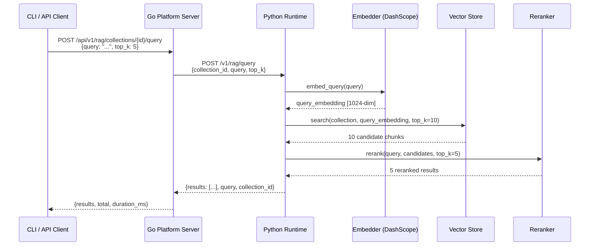

**检索增强生成**（Retrieval-Augmented Generation, RAG）管道是 ResolveAgent 平台的知识管理基础设施，承担从原始文档到语义检索结果的全链路处理。本页从架构视角纵览 RAG 管道的三大核心能力——文档摄取、向量索引与语义检索，揭示 Go 平台层与 Python 运行时层之间的协作机制，并阐明数据从「非结构化文档」到「可检索的向量索引」再到「精准的语义结果」的完整流转路径。

Sources: [rag\_\_init\_\_.py](python/src/resolveagent/rag/__init__.py#L1-L2), [pipeline.py](python/src/resolveagent/rag/pipeline.py#L18-L28)

## 架构全景：跨语言双层协作

ResolveAgent 的 RAG 管道横跨 Go 平台服务层与 Python Agent 运行时层两个核心子系统。Go 层负责 REST API 暴露、集合元数据持久化（PostgreSQL）以及请求路由；Python 层则承载所有计算密集型任务——文档解析、文本分块、向量嵌入、向量存储以及重排序检索。两层之间通过 HTTP + SSE 协议通信，Go 平台的 `RuntimeClient` 将 RAG 相关请求代理转发至 Python 运行时的 HTTP 端点，对于长时间运行的语料库导入任务则采用 Server-Sent Events 流式回传进度事件。



这种双层架构的设计意图清晰：Go 层以编译型语言的性能优势处理高并发 API 网关职责和关系型数据持久化；Python 层则利用其丰富的 ML/AI 生态（sentence-transformers、pymilvus、qdrant-client 等）完成向量计算。Go 层的 `InMemoryRAGRegistry` 提供开发阶段的内存后端，生产环境则通过配置 `store.backend: "postgres"` 切换至 PostgreSQL 持久化。

Sources: [router.go](pkg/server/router.go#L50-L79), [runtime_client.go](pkg/server/runtime_client.go#L16-L36), [rag.go](pkg/registry/rag.go#L22-L29), [resolveagent.yaml](configs/resolveagent.yaml#L73-L83)

## 核心数据模型

RAG 管道围绕两个核心实体运转：**集合**（Collection）和**文档**（Document）。集合是文档的逻辑容器，定义了嵌入模型、分块策略等全局配置；文档则是被摄取的知识单元，跟踪其内容哈希、分块数量、向量 ID 列表以及处理状态。

| 实体 | 关键字段 | 职责 |
|------|---------|------|
| **RAGCollection** | `id`, `name`, `config`（含 `embedding_model`, `chunk_strategy`）, `status` | 集合元数据，承载嵌入模型与分块策略配置 |
| **RAGDocument** | `id`, `collection_id`, `content_hash`, `chunk_count`, `vector_ids`, `status` | 文档元数据，跟踪摄取状态与分块统计 |
| **RAGIngestionRecord** | `id`, `document_id`, `action`, `status`, `chunks_processed`, `vectors_created`, `duration_ms` | 摄取审计日志，记录每次操作的处理细节 |

文档状态机贯穿其完整生命周期：`pending` → `processing` → `indexed`（成功）或 `failed`（失败）或 `deleted`（已删除）。这个状态转换由 Python 运行时的 `RAGPipeline.ingest()` 方法驱动——在注册文档元数据时将状态设为 `processing`，成功索引后更新为 `indexed`。

Sources: [rag.go](pkg/registry/rag.go#L10-L20), [rag_document.go](pkg/registry/rag_document.go#L10-L52), [pipeline.py](python/src/resolveagent/rag/pipeline.py#L79-L122)

## 文档摄取管道

文档摄取是 RAG 管道的第一阶段，负责将非结构化文档转化为可检索的向量索引。整个流程由 `RAGPipeline.ingest()` 编排，遵循严格的四阶段流水线：**解析 → 分块 → 嵌入 → 索引**。



### Stage 1：文档解析

`DocumentParser` 支持 8 种文档格式的解析——纯文本、Markdown、HTML、PDF、Word（.docx）、JSON 以及 YAML。解析器采用双重检测策略：优先通过文件扩展名判定格式，扩展名不可用时则通过内容特征（如 PDF 魔数 `%PDF`、HTML 标签模式、JSON 结构）进行自动检测。对于 Markdown 文档，解析器会剥离 YAML frontmatter 并提取首级标题作为文档标题；HTML 解析则移除 `script`/`style`/`nav`/`footer` 等噪音标签后提取纯文本。

Sources: [parser.py](python/src/resolveagent/rag/ingest/parser.py#L24-L74)

### Stage 2：文本分块

`TextChunker` 提供 **6 种分块策略**，适应不同文档结构和检索精度需求：

| 策略 | 标识符 | 适用场景 | 核心逻辑 |
|------|--------|---------|---------|
| **固定分块** | `fixed` | 结构均匀的纯文本 | 按固定字符数切割，保留重叠区 |
| **句子分块** | `sentence`（默认） | 通用场景 | 按句号/问号/感叹号断句，按 `chunk_size` 合并 |
| **H2 标题分块** | `by_h2` | 结构化 Markdown 文档 | 按 `## ` 标题边界切割 |
| **H3 标题分块** | `by_h3` | 细粒度结构化文档 | 按 `### ` 标题边界切割 |
| **混合标题分块** | `by_section` | 多层级结构文档 | 同时按 `##` 和 `###` 边界切割 |
| **语义分块** | `semantic` | 高精度检索 | 基于语义相似度边界切割 |

所有策略共享 `chunk_size`（默认 512 字符）和 `chunk_overlap`（默认 50 字符）两个核心参数。标题分块策略额外实现了智能合并逻辑——小节自动合并直至达到 `chunk_size`，超大节则回退到固定分块以避免生成过大的块。默认策略为 `sentence`，可通过 CLI `--chunk-strategy` 参数或集合配置覆盖。

Sources: [chunker.py](python/src/resolveagent/rag/ingest/chunker.py#L8-L50), [collection.go](internal/cli/rag/collection.go#L77-L78)

### Stage 3：向量嵌入

`Embedder` 通过 DashScope 兼容 API（默认端点 `https://dashproxy.aliyuncs.com/compatible-mode/v1`）调用 BGE 系列嵌入模型，将文本块转换为高维向量。平台当前支持以下嵌入模型及其维度：

| 模型 | 维度 | 适用场景 |
|------|------|---------|
| **bge-large-zh**（默认） | 1024 | 中文优化，推荐生产使用 |
| bge-base-zh | 768 | 轻量级中文场景 |
| text-embedding-v1 | 1536 | 通义千问 Embedding V1 |
| text-embedding-v2 | 1536 | 通义千问 Embedding V2 |

嵌入 API 调用采用异步 HTTP（`httpx.AsyncClient`），单次超时 60 秒，支持批量嵌入（`embed_batch`，默认 batch_size=32）以降低 API 调用开销。当 API Key 未配置时，嵌入器退化为返回零向量——这确保了开发环境无需外部依赖即可启动管道。CLI 创建集合时默认指定 `bge-large-zh` 模型。

Sources: [embedder.py](python/src/resolveagent/rag/ingest/embedder.py#L13-L48), [collection.go](internal/cli/rag/collection.go#L77)

### Stage 4：向量索引

索引阶段将 `(向量, 文本, 元数据)` 三元组写入向量数据库。`RAGPipeline._index_chunks()` 在写入前自动创建目标集合（如不存在），集合 Schema 包含四个字段：`id`（VARCHAR 主键）、`vector`（FLOAT_VECTOR）、`text`（VARCHAR）和 `metadata`（JSON）。索引类型使用 IVF_FLAT（`nlist=128`），距离度量默认为 COSINE 余弦相似度。每个文本块的元数据被扩展了 `chunk_index` 和 `total_chunks` 两个字段，用于溯源定位。

Sources: [pipeline.py](python/src/resolveagent/rag/pipeline.py#L142-L195), [milvus.py](python/src/resolveagent/rag/index/milvus.py#L81-L152)

## 语义检索管道

语义检索是 RAG 管道的查询阶段，执行 **查询嵌入 → 向量搜索 → 重排序** 三步流水线。`RAGPipeline.query()` 方法在检索时采用「过采样再精排」策略——先以 `top_k * 2` 的数量从向量数据库召回候选块，再经重排序器精选出最终的 `top_k` 条结果。



### 重排序机制

`Reranker` 实现了三级递进的重排序策略，按可用性自动降级：**交叉编码器**（Cross-Encoder） → **LLM 重排序** → **词频回退**。交叉编码器使用 `BAAI/bge-reranker-large` 模型对 `(query, chunk)` 对进行精确相关性评分，其精度远高于双塔模型的初始检索分数。最终排序分数采用加权融合公式：`score = 0.3 × 初始检索分数 + 0.7 × 重排序分数`。当 `sentence-transformers` 库不可用时，系统自动降级到基于词项重叠度的简单评分策略，确保检索管道在任何环境下都不会中断。

Sources: [pipeline.py](python/src/resolveagent/rag/pipeline.py#L197-L259), [reranker.py](python/src/resolveagent/rag/retrieve/reranker.py#L28-L134), [retriever.py](python/src/resolveagent/rag/retrieve/retriever.py#L14-L51)

## 向量存储抽象层

向量存储后端通过 `VectorStore` 抽象基类统一接口，支持 Milvus 和 Qdrant 两种实现。抽象层定义了 7 个核心方法：`connect`/`disconnect`（连接管理）、`create_collection`/`delete_collection`/`list_collections`（集合管理）、`insert`/`search`/`delete`（数据操作）以及 `get_stats`（统计信息）。`Retriever` 组件根据配置的 `vector_backend` 参数动态选择后端实例——`milvus` 对应 `MilvusStore`（默认端口 19530），`qdrant` 对应 `QdrantStore`（默认端口 6333），两者共享完全相同的检索接口。

详细的向量存储后端配置和性能对比请参阅 [向量存储后端：Milvus 与 Qdrant 集成](15-xiang-liang-cun-chu-hou-duan-milvus-yu-qdrant-ji-cheng)。

Sources: [base.py](python/src/resolveagent/rag/index/base.py#L9-L143), [retriever.py](python/src/resolveagent/rag/retrieve/retriever.py#L34-L51)

## REST API 端点总览

Go 平台服务层暴露了完整的 RAG REST API，涵盖集合管理、文档管理和检索查询三大类操作。所有摄取和查询请求由 Go 层代理转发至 Python 运行时，而文档元数据的 CRUD 操作则直接由 Go 层通过 `RAGDocumentRegistry` 处理。

| 类别 | 方法 | 端点 | 说明 |
|------|------|------|------|
| **集合管理** | GET | `/api/v1/rag/collections` | 列出所有集合 |
| | POST | `/api/v1/rag/collections` | 创建集合 |
| | DELETE | `/api/v1/rag/collections/{id}` | 删除集合 |
| **摄取与检索** | POST | `/api/v1/rag/collections/{id}/ingest` | 摄取文档（代理至 Python） |
| | POST | `/api/v1/rag/collections/{id}/query` | 语义检索（代理至 Python） |
| **文档管理** | GET | `/api/v1/rag/collections/{id}/documents` | 列出集合内文档 |
| | POST | `/api/v1/rag/collections/{id}/documents` | 创建文档元数据 |
| | GET | `/api/v1/rag/documents/{id}` | 获取文档详情 |
| | PUT | `/api/v1/rag/documents/{id}` | 更新文档 |
| | DELETE | `/api/v1/rag/documents/{id}` | 删除文档 |
| **摄取历史** | GET | `/api/v1/rag/collections/{id}/ingestions` | 查看摄取历史 |
| **语料库导入** | POST | `/api/v1/corpus/import` | 外部语料库批量导入（SSE 流式） |

Sources: [router.go](pkg/server/router.go#L50-L100)

## CLI 操作指南

ResolveAgent CLI 提供了 `rag` 和 `corpus` 两个命令组，覆盖日常 RAG 管道操作。所有 CLI 命令内部通过 HTTP 客户端调用上述 REST API 端点。

### 集合生命周期管理

```bash
# 创建集合，指定嵌入模型与分块策略
resolveagent rag collection create my-knowledge-base \
  --embedding-model bge-large-zh \
  --chunk-strategy sentence \
  --description "我的知识库"

# 列出所有集合（表格输出）
resolveagent rag collection list

# 删除集合（交互确认）
resolveagent rag collection delete col-abc123

# 强制删除，跳过确认
resolveagent rag collection delete col-abc123 --force
```

### 文档摄取操作

CLI 的 `ingest` 命令支持单文件和目录批量摄取，内置文件类型过滤（`.txt`, `.md`, `.json`, `.yaml`, `.yml`, `.pdf`, `.docx`, `.html`），可通过 `--recursive` 递归遍历子目录：

```bash
# 摄取单个文件
resolveagent rag ingest --collection my-kb --path ./guide.pdf

# 递归摄取整个目录
resolveagent rag ingest --collection my-kb --path ./docs/ --recursive
```

摄取过程对每个文件输出实时进度反馈：成功时显示分块数和向量数（`✓ file.md: 12 chunks, 12 vectors`），失败时标注错误原因（`✗ file.pdf: failed to ingest (...)`），最终汇总统计。

### 语义检索操作

```bash
# 查询集合，返回 Top-5 结果
resolveagent rag query "如何排查 Pod CrashLoopBackOff 错误" \
  --collection my-kb --top-k 5
```

查询结果以排名格式展示，每条结果包含相关性分数、文档 ID 以及截断至 200 字符的内容摘要。

### 外部语料库导入

`corpus import` 命令支持从 Git 仓库或本地路径批量导入知识语料，通过 SSE 流式接收处理进度：

```bash
# 导入 kudig-database 的全部内容（RAG + FTA + Skills）
resolveagent corpus import https://github.com/kudig-io/kudig-database

# 仅导入 RAG 和 FTA 内容
resolveagent corpus import --type rag --type fta ./kudig-database

# Dry run 模式，预览但不执行
resolveagent corpus import --dry-run https://github.com/kudig-io/kudig-database
```

Sources: [collection.go](internal/cli/rag/collection.go#L14-L168), [ingest.go](internal/cli/rag/ingest.go#L13-L152), [query.go](internal/cli/rag/query.go#L11-L78), [import.go](internal/cli/corpus/import.go#L24-L73)

## 数据库 Schema 与持久化

RAG 管道的元数据持久化通过 PostgreSQL 完成，由迁移脚本 `003_rag_documents.up.sql` 创建两张核心表。**向量数据本身存储在 Milvus/Qdrant 中**，PostgreSQL 仅负责文档元数据和摄取历史的追踪。

**`rag_documents` 表**存储每个被摄取文档的元信息，包含 `content_hash`（SHA-256）用于去重、`vector_ids`（TEXT 数组）关联向量数据库中的记录、以及 JSONB 格式的 `metadata` 字段承载任意扩展属性。**`rag_ingestion_history` 表**以 `rag_documents` 为外键，记录每次摄取操作的审计轨迹——包括动作类型（`ingest`/`reindex`/`delete`/`update`）、处理状态、处理的分块数和创建的向量数、耗时（毫秒）以及错误信息。

两张表均配置了 `updated_at` 自动更新触发器，确保时间戳的一致性。

Sources: [003_rag_documents.up.sql](scripts/migration/003_rag_documents.up.sql#L1-L52)

## 双写管道与语料库编排

### DualWriteRAGPipeline

`DualWriteRAGPipeline` 是对基础 `RAGPipeline` 的增强封装，实现了**双集合写入**模式：主写入目标是 `code-analysis` 集合，副写入目标是 `kudig-rag` 集合。副写入采用「尽力而为」（best-effort）策略——失败不影响主写入，仅记录告警日志。这种设计确保了代码分析产生的解决方案文档能同时被代码分析专用检索和通用知识检索两条路径访问。双写管道还提供了 `ingest_solutions()` 和 `ingest_report()` 两个便捷方法，分别用于将静态分析解决方案和流量分析报告自动转化为 RAG 文档。

Sources: [dual_writer.py](python/src/resolveagent/rag/dual_writer.py#L22-L95)

### CorpusImporter 编排器

`CorpusImporter` 是语料库导入的顶层编排器，协调整个导入流程的 9 个阶段：**数据获取 → 配置加载 → 文件计数 → 集合确定 → RAG 导入 → FTA 导入 → Skills 导入 → 代码分析导入 → 最终汇总**。它通过 `RAGCorpusImporter` 扫描 `domain-*` 目录结构（正则匹配 `^domain-\d+`），将每个 Markdown 文件解析、分块、嵌入并索引到指定的 RAG 集合中。`seed_vectorizer.py` 则负责将种子数据中的 87 条文档定义（覆盖 45 个集合、40 个知识领域）生成代表性内容并完成向量化。

Sources: [importer.py](python/src/resolveagent/corpus/importer.py#L52-L200), [rag_importer.py](python/src/resolveagent/corpus/rag_importer.py#L23-L118), [seed_vectorizer.py](python/src/resolveagent/corpus/seed_vectorizer.py#L1-L23)

## 种子数据与知识领域

系统通过 `seed-rag.sql` 预置了 87 条 RAG 文档元数据，分布在两大类知识库中。**运维知识库**（5 个集合）涵盖阿里云产品运维手册、历史故障复盘、K8s 最佳实践、内部运维 SOP 和安全基线。**Kudig 域知识库**（40 个领域集合）覆盖从 K8s 架构概览到 AIOps 的完整云原生知识图谱，每个领域包含 2-4 篇专业文档，使用 `bge-large-zh` 嵌入模型。

Sources: [seed-rag.sql](scripts/seed/seed-rag.sql#L1-L165)

## 延伸阅读

- [向量存储后端：Milvus 与 Qdrant 集成](15-xiang-liang-cun-chu-hou-duan-milvus-yu-qdrant-ji-cheng)——深入了解两种向量数据库的 Schema 设计、索引配置和性能特征
- [分块策略与嵌入模型：语义/句子/固定分块 + BGE-large-zh](16-fen-kuai-ce-lue-yu-qian-ru-mo-xing-yu-yi-ju-zi-gu-ding-fen-kuai-bge-large-zh)——分块策略的详细算法解析与嵌入模型选型指南
- [重排序与查询：交叉编码器重排序与相似度搜索](17-zhong-pai-xu-yu-cha-xun-jiao-cha-bian-ma-qi-zhong-pai-xu-yu-xiang-si-du-sou-suo)——三级重排序机制的实现细节与调优策略
- [语料库导入与技能发现：Kudig 技能导入流程](21-yu-liao-ku-dao-ru-yu-ji-neng-fa-xian-kudig-ji-neng-dao-ru-liu-cheng)——外部语料库导入的完整操作指南
- [数据库 Schema 与迁移：10 步迁移脚本与种子数据](25-shu-ju-ku-schema-yu-qian-yi-10-bu-qian-yi-jiao-ben-yu-chong-zi-shu-ju)——PostgreSQL Schema 设计的全局视图