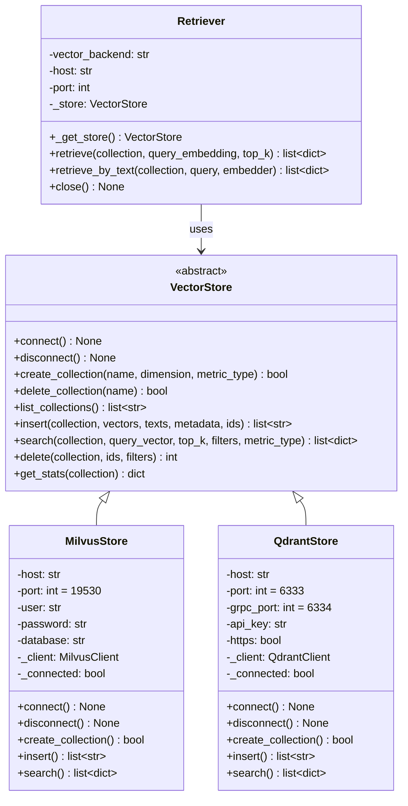
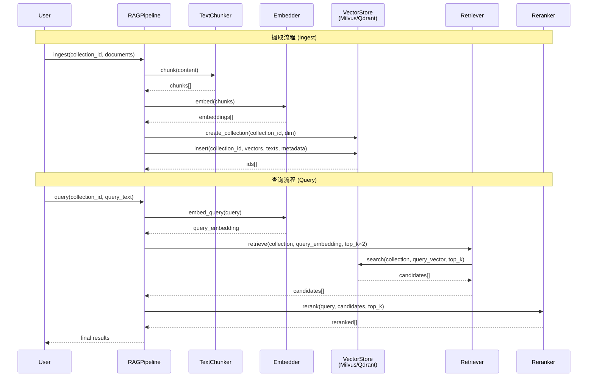

ResolveAgent 的 RAG 管道依赖向量数据库存储文档嵌入并执行近似最近邻（ANN）检索。系统采用**抽象基类 + 可插拔后端**的设计模式，在 `VectorStore` 接口层统一了 Milvus 和 Qdrant 两种实现，使上层管道代码无需感知底层差异。本文将深入剖析这一双后端架构的接口契约、各自的实现细节、数据模型映射、索引策略以及运维部署要点。

Sources: [base.py](python/src/resolveagent/rag/index/base.py#L1-L144), [milvus.py](python/src/resolveagent/rag/index/milvus.py#L1-L25), [qdrant.py](python/src/resolveagent/rag/index/qdrant.py#L1-L24)

---

## 架构总览：策略模式与后端选择器

向量存储层遵循经典的**策略模式（Strategy Pattern）**：`VectorStore` 抽象基类定义统一契约，`MilvusStore` 和 `QdrantStore` 作为具体策略实现各自适配逻辑。`Retriever` 类充当**上下文角色**，根据配置参数 `vector_backend` 在运行时动态选择后端实例。



`Retriever` 的 `_get_store()` 方法实现了**延迟初始化**的工厂逻辑——首次调用时根据 `vector_backend` 参数实例化对应后端并建立连接，后续调用复用同一实例。端口默认值根据后端类型自动选择：Milvus 为 `19530`，Qdrant 为 `6333`。

Sources: [retriever.py](python/src/resolveagent/rag/retrieve/retriever.py#L21-L51), [base.py](python/src/resolveagent/rag/index/base.py#L9-L143)

---

## VectorStore 接口契约

`VectorStore` 抽象基类定义了 8 个核心方法，构成向量存储的最小完备接口。所有方法均声明为 `async`，确保在 Python 异步运行时中不阻塞事件循环。

| 方法 | 职责 | 参数要点 |
|------|------|----------|
| `connect()` | 建立与向量数据库的连接 | — |
| `disconnect()` | 释放连接资源 | — |
| `create_collection()` | 创建集合并配置向量维度与距离度量 | `dimension` 默认 1024，`metric_type` 默认 `"COSINE"` |
| `delete_collection()` | 删除集合及其全部数据 | — |
| `list_collections()` | 列出所有集合名称 | — |
| `insert()` | 批量写入向量、文本与元数据 | 向量/文本/元数据长度必须一致，ID 可选（缺失时自动 UUID） |
| `search()` | 执行向量相似度搜索 | 支持 `filters` 元数据过滤和 `metric_type` 度量切换 |
| `delete()` | 按 ID 或过滤器删除向量 | 两种模式互斥：按 ID 或按过滤器 |
| `get_stats()` | 获取集合统计信息 | 至少返回 `row_count` |

`create_collection` 方法的 `dimension` 参数默认值为 `1024`，这与 `Embedder` 中 `bge-large-zh` 模型的输出维度严格对应——管道层在索引时动态读取嵌入向量的实际长度（`len(embeddings[0])`）并传入此参数，保证 Schema 与数据的一致性。

Sources: [base.py](python/src/resolveagent/rag/index/base.py#L16-L143), [embedder.py](python/src/resolveagent/rag/ingest/embedder.py#L25-L31), [pipeline.py](python/src/resolveagent/rag/pipeline.py#L157-L170)

---

## Milvus 后端实现

### 连接与会话管理

`MilvusStore` 通过 `pymilvus.MilvusClient` 以 HTTP 方式连接 Milvus Standalone 实例。连接 URI 格式为 `http://{host}:{port}`，支持用户名/密码认证和多数据库隔离（`db_name` 参数）。`connect()` 方法中通过 `try/except ImportError` 优雅处理可选依赖未安装的场景，给出明确的安装提示。

```python
self._client = MilvusClient(
    uri=f"http://{self.host}:{self.port}",
    user=self.user if self.user else None,
    password=self.password if self.password else None,
    db_name=self.database,
)
```

Sources: [milvus.py](python/src/resolveagent/rag/index/milvus.py#L26-L72)

### Schema 设计与索引配置

集合创建时构建一个四字段 Schema：

| 字段名 | 数据类型 | 约束 | 用途 |
|--------|----------|------|------|
| `id` | `VARCHAR(64)` | 主键 | 文档分块唯一标识 |
| `vector` | `FLOAT_VECTOR` | dim=动态 | 嵌入向量 |
| `text` | `VARCHAR(65535)` | — | 原始文本分块 |
| `metadata` | `JSON` | 动态字段 | 任意结构化元数据 |

Schema 启用了 `enable_dynamic_field=True`，允许在写入时附加 Schema 之外的动态字段。向量索引采用 **IVF_FLAT** 类型（`nlist=128`），在搜索精度与内存开销之间取得平衡。距离度量支持 `COSINE`、`L2` 和 `IP` 三种类型。

```python
schema = self._client.create_schema(auto_id=False, enable_dynamic_field=True)
schema.add_field(field_name="id", datatype=DataType.VARCHAR, max_length=64, is_primary=True)
schema.add_field(field_name="vector", datatype=DataType.FLOAT_VECTOR, dim=dimension)
schema.add_field(field_name="text", datatype=DataType.VARCHAR, max_length=65535)
schema.add_field(field_name="metadata", datatype=DataType.JSON)
```

Sources: [milvus.py](python/src/resolveagent/rag/index/milvus.py#L81-L152)

### 搜索与过滤表达式

搜索时 Milvus 将元数据过滤条件转换为 JSON 路径表达式。例如 `filters={"source": "kudig"}` 被转换为 `metadata["source"] == "kudig"`。多条件之间以 `and` 连接。搜索前会自动调用 `load_collection()` 确保集合数据已加载到内存。返回结果按 Milvus 原生格式解析为统一的 `{id, text, metadata, score}` 字典结构。

Sources: [milvus.py](python/src/resolveagent/rag/index/milvus.py#L251-L320)

---

## Qdrant 后端实现

### 连接与会话管理

`QdrantStore` 使用 `qdrant_client.QdrantClient`，默认启用 gRPC 通信（`prefer_grpc=True`）以获得更高的写入吞吐量。除了 HTTP 端口 `6333` 外，还提供 `grpc_port`（默认 `6334`）的独立配置。支持 API Key 认证和 HTTPS 加密连接，适配云托管 Qdrant 实例（如 Qdrant Cloud）。

```python
self._client = QdrantClient(
    host=self.host, port=self.port,
    grpc_port=self.grpc_port,
    api_key=self.api_key, https=self.https,
    prefer_grpc=True,
)
```

连接建立后会立即调用 `get_collections()` 验证服务可用性，实现**连接即验证**的健康检查模式。

Sources: [qdrant.py](python/src/resolveagent/rag/index/qdrant.py#L26-L78)

### Payload 模型与距离度量映射

Qdrant 不使用固定 Schema，而是采用灵活的 **Payload** 模型。每个 Point 的 Payload 中直接包含 `text` 字段和所有元数据字段（`**meta` 展开），查询时通过 `FieldCondition` + `MatchValue` 构建结构化过滤条件。

距离度量类型进行了跨后端映射：

| 通用标识 | Milvus 类型 | Qdrant 类型 | 语义 |
|----------|------------|-------------|------|
| `COSINE` | `COSINE` | `Distance.COSINE` | 余弦相似度 |
| `L2` / `EUCLID` | `L2` | `Distance.EUCLID` | 欧几里得距离 |
| `IP` / `DOT` | `IP` | `Distance.DOT` | 内积 |

Sources: [qdrant.py](python/src/resolveagent/rag/index/qdrant.py#L87-L143)

### 批量写入与过滤删除

Qdrant 的 `insert` 方法采用 **批量 Upsert** 策略，每 100 个 Point 为一个批次调用 `upsert()`，在处理大规模文档导入时有效控制单次请求体积。与 Milvus 不同，Qdrant 原生支持基于过滤器的删除操作——通过 `FieldCondition` 构建 `Filter` 对象作为 `points_selector`，可按元数据条件批量删除向量。

```python
# 批量写入
batch_size = 100
for i in range(0, len(points), batch_size):
    batch = points[i : i + batch_size]
    self._client.upsert(collection_name=collection_name, points=batch)

# 过滤删除
self._client.delete(
    collection_name=collection_name,
    points_selector=query_filter,  # Filter(must=[FieldCondition(...)])
)
```

`get_stats()` 方法返回比 Milvus 更丰富的统计信息，包含 `points_count`（总点数）和 `vectors_count`（向量数，在多向量场景下可能不同）。

Sources: [qdrant.py](python/src/resolveagent/rag/index/qdrant.py#L181-L398)

---

## 后端对比：Milvus vs Qdrant

两种后端在接口层面完全等价，但在实现细节、性能特征和部署模型上存在差异化定位。

| 维度 | Milvus | Qdrant |
|------|--------|--------|
| **连接协议** | HTTP REST (`pymilvus.MilvusClient`) | HTTP + gRPC 双通道（默认 gRPC） |
| **默认端口** | `19530` | `6333`（HTTP）/ `6334`（gRPC） |
| **Schema 模型** | 固定四字段 + JSON 动态字段 | 灵活 Payload 模型 |
| **向量索引类型** | IVF_FLAT（`nlist=128`） | Qdrant 自动优化（HNSW） |
| **数据写入方式** | 单次 `insert()` 全量写入 | 批量 `upsert()`（100/批） |
| **过滤表达式** | JSON 路径字符串（`metadata["key"] == "val"`） | 结构化 `FieldCondition` + `MatchValue` |
| **过滤器删除** | 未实现（占位） | 原生支持 `Filter` 选择器 |
| **认证方式** | 用户名 + 密码 | API Key |
| **统计信息** | `row_count` | `points_count` + `vectors_count` |
| **Docker 镜像** | `milvusdb/milvus:v2.4.17`（~1.5GB） | `qdrant/qdrant`（~150MB） |
| **部署复杂度** | 需嵌入 etcd + 本地存储 | 单二进制，零依赖 |
| **云托管支持** | Zilliz Cloud | Qdrant Cloud |
| **兼容性别名** | `MilvusClient = MilvusStore` | — |

**选型建议**：开发和轻量级部署场景优先选择 Qdrant（部署简单、资源占用低）；生产环境大规模数据集（>1M 向量）考虑 Milvus（成熟的分布式架构与丰富的索引类型）。

Sources: [milvus.py](python/src/resolveagent/rag/index/milvus.py#L386-L388), [qdrant.py](python/src/resolveagent/rag/index/qdrant.py#L26-L48)

---

## 管道集成：从摄取到检索的数据流

向量存储后端在整个 RAG 管道中处于 **索引层** 和 **检索层** 两个关键位置。以下序列图展示了完整的数据流向：



**摄取流程**中 `RAGPipeline._index_chunks()` 目前硬编码使用 `MilvusStore()`，而**查询流程**中的 `Retriever` 已实现动态后端选择。这是一个已知的架构不对称点——生产环境中需确保摄取和查询使用相同的后端类型。

Sources: [pipeline.py](python/src/resolveagent/rag/pipeline.py#L142-L196), [pipeline.py](python/src/resolveagent/rag/pipeline.py#L197-L259)

---

## Retriever：后端路由器

`Retriever` 是向量存储层的统一入口点，承担后端选择、连接管理和检索代理三重职责。其核心设计特征如下：

- **延迟连接**：`_get_store()` 在首次调用时才创建连接，避免不必要的资源占用
- **单例复用**：`self._store` 在整个生命周期内只初始化一次
- **端口自适应**：Milvus 默认 `19530`，Qdrant 默认 `6333`，无需显式配置
- **工厂函数**：`create_retriever()` 提供便捷的构造入口

```python
async def _get_store(self) -> MilvusStore | QdrantStore:
    if self._store is None:
        if self.vector_backend == "milvus":
            self._store = MilvusStore(host=self.host, port=self.port)
        elif self.vector_backend == "qdrant":
            self._store = QdrantStore(host=self.host, port=self.port)
        else:
            raise ValueError(f"Unsupported vector backend: {self.vector_backend}")
        await self._store.connect()
    return self._store
```

`retrieve_by_text()` 是一个便捷方法，它将查询文本先通过 `embedder.embed_query()` 转换为向量，再调用 `retrieve()` 完成检索。这种设计将嵌入生成与向量搜索解耦，使调用方可以按需选择 "文本查询" 或 "向量查询" 两种模式。

Sources: [retriever.py](python/src/resolveagent/rag/retrieve/retriever.py#L39-L51), [retriever.py](python/src/resolveagent/rag/retrieve/retriever.py#L114-L143), [retriever.py](python/src/resolveagent/rag/retrieve/retriever.py#L164-L179)

---

## DualWriter：双写管道

`DualWriteRAGPipeline` 实现了**主从双写**模式：文档同时写入 `code-analysis`（主集合）和 `kudig-rag`（从集合）。从集合的写入采用**尽力而为**策略——失败时仅记录日志而不阻塞主写入流程。这种模式确保代码分析结果能同时服务于专用查询和通用 RAG 查询两个场景。

```python
# 主写入（必须成功）
primary_result = await self._pipeline.ingest(
    collection_id=self._primary, documents=documents, chunker=chunker
)
# 从写入（尽力而为）
try:
    secondary_result = await self._pipeline.ingest(
        collection_id=self._secondary, documents=documents, chunker=chunker
    )
except Exception:
    logger.warning("Secondary RAG write failed (best-effort)", exc_info=True)
```

双写管道还提供 `ingest_solutions()` 和 `ingest_report()` 两个领域专用方法，分别将代码分析解决方案和流量分析报告转换为标准 RAG 文档格式并写入双集合。

Sources: [dual_writer.py](python/src/resolveagent/rag/dual_writer.py#L1-L161)

---

## 部署配置

### Docker Compose 部署

项目在 `docker-compose.deps.yaml` 中预配置了 Milvus Standalone 服务，使用**嵌入式 etcd** 和**本地存储**模式，适合开发和小规模部署：

```yaml
milvus:
  image: milvusdb/milvus:v2.4.17
  command: ["milvus", "run", "standalone"]
  ports:
    - "19530:19530"   # gRPC/HTTP API
    - "9092:9091"     # 健康检查
  environment:
    ETCD_USE_EMBED: "true"
    ETCD_DATA_DIR: /var/lib/milvus/etcd
    COMMON_STORAGETYPE: local
  volumes:
    - milvus_data:/var/lib/milvus
  healthcheck:
    test: ["CMD", "curl", "-f", "http://localhost:9091/healthz"]
    interval: 10s
    timeout: 5s
    retries: 10
    start_period: 30s
```

健康检查配置了 30 秒的启动等待期和 10 次重试，确保 Milvus 在首次初始化嵌入 etcd 时有充足的启动时间。数据持久化通过 Docker Volume `milvus_data` 实现。

Sources: [docker-compose.deps.yaml](deploy/docker-compose/docker-compose.deps.yaml#L27-L49)

### Python 依赖安装

向量存储客户端作为**可选依赖**声明在 `pyproject.toml` 的 `[project.optional-dependencies]` 中：

```toml
[project.optional-dependencies]
rag = [
    "pymilvus>=2.4.0",
    "qdrant-client>=1.12.0",
]
```

安装时需显式指定 `rag` extra：`pip install -e ".[rag]"`。两个客户端库同时安装，运行时根据配置选择加载。`MilvusStore` 和 `QdrantStore` 均在方法内部延迟导入（`from pymilvus import ...` / `from qdrant_client import ...`），未安装时抛出 `ImportError` 并给出明确的安装提示。

Sources: [pyproject.toml](python/pyproject.toml#L38-L42), [milvus.py](python/src/resolveagent/rag/index/milvus.py#L53-L69), [qdrant.py](python/src/resolveagent/rag/index/qdrant.py#L52-L78)

---

## CLI 管理：集合生命周期

Go 平台层的 `resolveagent rag` 命令组提供了集合管理 CLI，通过 REST API 代理到 Python 运行时执行实际的向量存储操作。核心命令包括：

| 命令 | 功能 | 关键参数 |
|------|------|----------|
| `rag collection create <name>` | 创建集合 | `--embedding-model`（默认 `bge-large-zh`）、`--chunk-strategy`（默认 `sentence`） |
| `rag collection list` | 列出所有集合 | — |
| `rag collection delete <id>` | 删除集合 | `--force` 跳过确认 |
| `rag ingest` | 摄取文档 | `--collection`（必填）、`--path`、`--recursive` |
| `rag query <text>` | 语义查询 | `--collection`（必填）、`--top-k`（默认 5） |

摄取命令支持自动文件类型检测，当前支持的格式包括 `.txt`、`.md`、`.json`、`.yaml`、`.yml`、`.pdf`、`.docx` 和 `.html`。

Sources: [collection.go](internal/cli/rag/collection.go#L14-L168), [ingest.go](internal/cli/rag/ingest.go#L1-L153), [query.go](internal/cli/rag/query.go#L1-L79)

---

## 设计约束与演进方向

当前实现存在两个值得关注的架构约束：

**摄取层硬编码 Milvus**：`RAGPipeline._index_chunks()` 直接实例化 `MilvusStore()` 而非通过 `Retriever` 的后端选择机制。这意味着若需切换到 Qdrant，摄取路径需要手动修改代码。

**Qdrant 统计返回不精确**：Qdrant 的过滤删除方法返回 `0` 而非实际删除数量，因为 Qdrant API 不提供删除计数。依赖精确删除计量的场景需额外查询比对。

两个后端均采用**同步客户端包装为异步**的模式（方法声明为 `async` 但内部调用同步 SDK），这在高并发场景下可能成为瓶颈。后续演进可考虑引入线程池执行器（`asyncio.to_thread`）或迁移至原生异步 SDK。

Sources: [pipeline.py](python/src/resolveagent/rag/pipeline.py#L157-L160), [qdrant.py](python/src/resolveagent/rag/index/qdrant.py#L366-L369)

---

## 延伸阅读

- **[RAG 管道全景：文档摄取、向量索引与语义检索](14-rag-guan-dao-quan-jing-wen-dang-she-qu-xiang-liang-suo-yin-yu-yu-yi-jian-suo)** — 理解向量存储在整个 RAG 管道中的完整位置
- **[分块策略与嵌入模型：语义/句子/固定分块 + BGE-large-zh](16-fen-kuai-ce-lue-yu-qian-ru-mo-xing-yu-yi-ju-zi-gu-ding-fen-kuai-bge-large-zh)** — 了解写入向量存储前的分块与嵌入处理
- **[重排序与查询：交叉编码器重排序与相似度搜索](17-zhong-pai-xu-yu-cha-xun-jiao-cha-bian-ma-qi-zhong-pai-xu-yu-xiang-si-du-sou-suo)** — 深入向量检索后的精排机制
- **[Docker Compose 部署：全栈容器化编排](29-docker-compose-bu-shu-quan-zhan-rong-qi-hua-bian-pai)** — Milvus 容器的完整部署方案