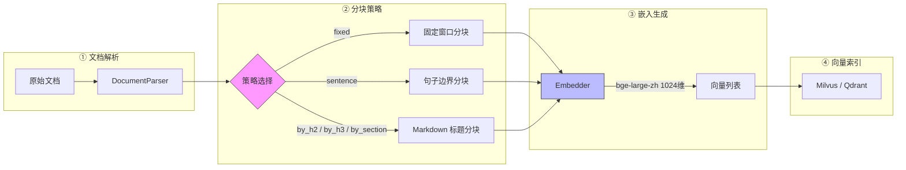
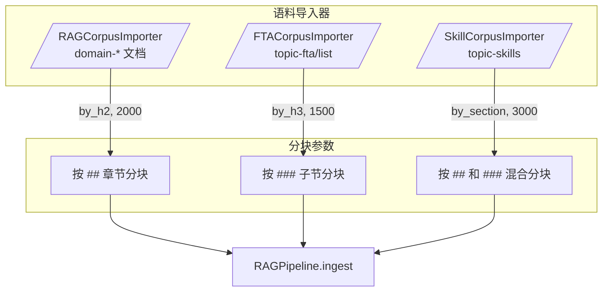
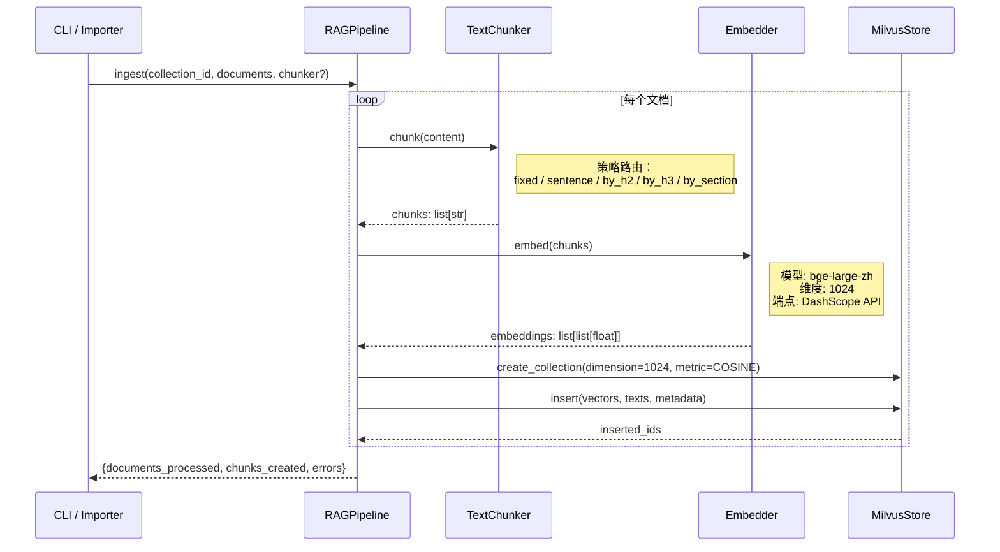

ResolveAgent 的 RAG 管道在文档摄取阶段必须解决一个核心矛盾：**长文档无法直接编码为高质量的稠密向量**。分块（Chunking）策略决定了语义粒度，嵌入模型（Embedding Model）决定了向量空间的表达能力，二者的组合直接决定了检索召回率和最终生成质量。本文档深入剖析 `TextChunker` 提供的六种分块策略、`Embedder` 支持的多模型嵌入机制，以及不同知识语料（领域文档、FTA 故障树、技能手册）如何自动匹配最优分块参数。文档聚焦于摄取管道中「解析后 → 向量化前」这一关键阶段，不涉及向量存储后端（参见 [向量存储后端：Milvus 与 Qdrant 集成](15-xiang-liang-cun-chu-hou-duan-milvus-yu-qdrant-ji-cheng)）和重排序检索（参见 [重排序与查询：交叉编码器重排序与相似度搜索](17-zhong-pai-xu-yu-cha-xun-jiao-cha-bian-ma-qi-zhong-pai-xu-yu-xiang-si-du-sou-suo)）的细节。

Sources: [chunker.py](python/src/resolveagent/rag/ingest/chunker.py#L1-L136), [embedder.py](python/src/resolveagent/rag/ingest/embedder.py#L1-L171)

## 架构定位：分块与嵌入在 RAG 管道中的位置

分块与嵌入发生在 RAG 管道的**摄取阶段**，紧接在文档解析之后、向量索引之前。以下 Mermaid 图展示了这一数据流：



**`RAGPipeline`** 作为编排器，按顺序调用 `TextChunker.chunk()` → `Embedder.embed()` → `MilvusStore.insert()` 完成单个文档的摄取。管道允许在每次 `ingest()` 调用时通过 `chunker` 参数覆盖默认分块器，这为不同类型的语料提供了灵活的定制入口。

Sources: [pipeline.py](python/src/resolveagent/rag/pipeline.py#L30-L140)

## TextChunker：六种分块策略详解

`TextChunker` 类封装了六种分块策略，通过构造参数 `strategy`、`chunk_size`、`chunk_overlap` 控制行为。其核心设计原则是：**优先保持语义完整性，在超出大小限制时才进行硬分割**。

### 构造参数一览

| 参数 | 类型 | 默认值 | 说明 |
|------|------|--------|------|
| `strategy` | `str` | `"sentence"` | 分块策略名称 |
| `chunk_size` | `int` | `512` | 目标块最大字符数 |
| `chunk_overlap` | `int` | `50` | 固定分块策略的滑动窗口重叠量 |

Sources: [chunker.py](python/src/resolveagent/rag/ingest/chunker.py#L8-L28)

### 策略路由机制

`chunk()` 方法根据 `strategy` 字符串路由到对应的私有方法。未知策略名会自动降级到 `_chunk_fixed`（固定分块），确保不会因配置错误而中断摄取流程：

```python
if self.strategy == "fixed":
    return self._chunk_fixed(text)
elif self.strategy == "sentence":
    return self._chunk_sentence(text)
elif self.strategy == "by_h2":
    return self._chunk_by_heading(text, level=2)
elif self.strategy == "by_h3":
    return self._chunk_by_heading(text, level=3)
elif self.strategy == "by_section":
    return self._chunk_by_heading(text, level=0)
else:
    return self._chunk_fixed(text)  # 安全降级
```

Sources: [chunker.py](python/src/resolveagent/rag/ingest/chunker.py#L30-L50)

### 固定分块（fixed）

**算法**：以 `chunk_size` 为窗口宽度、`chunk_overlap` 为步进回退量，从文本头部向尾部滑动切割。每次取 `[start, start + chunk_size]` 子串作为一个块，然后令 `start = end - chunk_overlap`。重叠区间确保跨块边界的语义信息不会完全丢失。

**适用场景**：结构不明确的纯文本、日志文件、无标题格式的长文档。优点是实现简单且确定性强；缺点是完全忽略语义边界，可能在一个句子或术语中间截断。

**关键代码**：

```python
def _chunk_fixed(self, text: str) -> list[str]:
    chunks = []
    start = 0
    while start < len(text):
        end = start + self.chunk_size
        chunks.append(text[start:end])
        start = end - self.chunk_overlap  # 滑动回退
    return chunks
```

Sources: [chunker.py](python/src/resolveagent/rag/ingest/chunker.py#L52-L60)

### 句子分块（sentence）

**算法**：首先将所有标点（`!`、`?`）统一替换为 `.`，然后以 `.` 为分隔符拆分句子。随后采用**贪心装配**——逐句追加到当前块，直到追加后长度超过 `chunk_size` 时才输出当前块并开启新块。这保证了每个句子完整地出现在同一个块中。

**适用场景**：短文本、字典条目、FAQ 问答对。默认的 `chunk_size=512` 对中文运维知识条目来说是合理的粒度。

**关键代码**：

```python
def _chunk_sentence(self, text: str) -> list[str]:
    sentences = text.replace("!", ".").replace("?", ".").split(".")
    sentences = [s.strip() for s in sentences if s.strip()]
    chunks = []
    current_chunk: list[str] = []
    current_length = 0
    for sentence in sentences:
        if current_length + len(sentence) > self.chunk_size and current_chunk:
            chunks.append(". ".join(current_chunk) + ".")
            current_chunk = []
            current_length = 0
        current_chunk.append(sentence)
        current_length += len(sentence)
    if current_chunk:
        chunks.append(". ".join(current_chunk) + ".")
    return chunks
```

注意：当前实现使用简单的 `.` 分割，对中文句号（`。`）的处理需要确认输入文本已规范化。在实际语料中，Markdown 文档通常以英文句号或换行分隔，因此该策略对 Kudig 知识库是有效的。

Sources: [chunker.py](python/src/resolveagent/rag/ingest/chunker.py#L62-L83)

### Markdown 标题分块（by_h2 / by_h3 / by_section）

**算法**：这是 ResolveAgent 中最精细的分块策略族，专门针对 Markdown 格式的运维知识文档设计。核心逻辑在 `_chunk_by_heading()` 中实现，通过正则表达式的前瞻断言 `(?=^## )` 在标题边界处切割，同时保持标题文本留在每个块的开头。

三种变体的正则模式如下：

| 策略 | 正则模式 | 切割边界 |
|------|----------|----------|
| `by_h2` | `(?=^## (?!#))` | 仅在 `## ` 处切割，跳过 `### ` |
| `by_h3` | `(?=^### (?!#))` | 仅在 `### ` 处切割，跳过 `#### ` |
| `by_section` | `(?=^#{2,3} (?!#))` | 在 `## ` 和 `### ` 处均切割 |

切割后还有**二级自适应处理**：小的 section 会被合并到前一个 section（在 `chunk_size` 范围内），超大 section 会在最近的换行符处回退切割（若找不到换行符则硬切割），形成多级保底机制。

**适用场景**：结构化 Markdown 知识文档——这是 Kudig 知识库的主要格式。`by_h2` 适用于按大章节组织的领域文档，`by_h3` 适用于更细粒度的故障树条目，`by_section` 适用于技能手册等混合层级内容。

Sources: [chunker.py](python/src/resolveagent/rag/ingest/chunker.py#L85-L135)

### 策略对比总结

| 策略 | 语义保真度 | 实现复杂度 | 典型 chunk_size | 适用语料类型 |
|------|-----------|-----------|----------------|-------------|
| `fixed` | ★☆☆ 低 | ★☆☆ 低 | 512 | 无结构纯文本、日志 |
| `sentence` | ★★☆ 中 | ★☆☆ 低 | 500–512 | 短文本、字典条目 |
| `by_h2` | ★★★ 高 | ★★☆ 中 | 2000 | 领域知识文档（domain-*） |
| `by_h3` | ★★★ 高 | ★★☆ 中 | 1500 | FTA 故障树条目 |
| `by_section` | ★★★ 高 | ★★☆ 中 | 3000 | 技能手册（topic-skills） |

Sources: [chunker.py](python/src/resolveagent/rag/ingest/chunker.py#L1-L136)

## 语料级策略映射：CorpusConfig 自动选型

ResolveAgent 不要求使用者手动为每个文件指定分块策略。`CorpusConfig` 在 `python/src/resolveagent/corpus/config.py` 中维护了一套**基于路径模式的默认策略映射**，使不同类型的语料自动获得最优分块参数：

| 路径模式 | 策略 | chunk_size | 对应语料 |
|----------|------|-----------|---------|
| `domain-` | `by_h2` | 2000 | 领域知识文档（如 domain-01 到 domain-40） |
| `topic-fta/list` | `by_h3` | 1500 | FTA 故障树 Markdown |
| `topic-skills` | `by_section` | 3000 | 运维技能手册 |
| `topic-cheat-sheet` | `sentence` | 50000 | 速查手册（几乎不分块） |
| `topic-dictionary` | `sentence` | 500 | 字典词条 |

策略选择的核心逻辑在 `get_chunking_strategy()` 方法中：首先匹配加载的 YAML profile 中显式配置的 source 条目，若未匹配则降级到路径模式默认值，最终兜底返回 `("by_h2", 2000)`。

Sources: [config.py](python/src/resolveagent/corpus/config.py#L15-L72)

### 策略映射在各导入器中的实际应用

三种语料导入器各自调用了 `RAGCorpusImporter.import_to_rag()`，传入不同的策略参数：



**RAGCorpusImporter** 在处理 `domain-*` 目录时，先从 `CorpusConfig.get_chunking_strategy()` 获取策略和大小，再构建 `TextChunker` 实例传入管道；**FTACorpusImporter** 硬编码使用 `strategy="by_h3"` 和 `chunk_size=1500`，因为 FTA 文档以 `###` 子节为自然语义边界；**SkillCorpusImporter** 使用 `strategy="by_section"` 和 `chunk_size=3000`，因为技能手册的 `##` 和 `###` 层级交替出现，需要混合策略来保持每个步骤段的完整。

Sources: [rag_importer.py](python/src/resolveagent/corpus/rag_importer.py#L88-L118), [fta_importer.py](python/src/resolveagent/corpus/fta_importer.py#L113-L129), [skill_importer.py](python/src/resolveagent/corpus/skill_importer.py#L99-L115)

## Embedder：BGE-large-zh 嵌入模型体系

### 支持的模型与维度

`Embedder` 类通过 `MODEL_DIMENSIONS` 字典定义了四种支持的嵌入模型：

| 模型 | 向量维度 | 特点 |
|------|---------|------|
| **`bge-large-zh`**（默认） | **1024** | BAAI 通用嵌入模型，针对中文优化，C-MTEB 基准领先 |
| `bge-base-zh` | 768 | BGE 轻量版，适合资源受限场景 |
| `text-embedding-v1` | 1536 | 通义千问 v1 嵌入模型 |
| `text-embedding-v2` | 1536 | 通义千问 v2 嵌入模型 |

默认选择 `bge-large-zh` 的理由在于：ResolveAgent 的知识库以中文运维文档为主，BGE 系列在中文语义理解上具有显著优势，而 1024 维在精度和存储效率之间取得了良好平衡。

Sources: [embedder.py](python/src/resolveagent/rag/ingest/embedder.py#L13-L48)

### API 调用架构

`Embedder` 通过阿里云 DashScope 兼容接口生成嵌入向量。关键设计如下：

**默认端点**：`https://dashscope.aliyuncs.com/compatible-mode/v1`，遵循 OpenAI 兼容的 `/embeddings` API 格式，这意味着可以通过 Higress AI 网关进行统一路由管理。

**认证方式**：通过环境变量 `DASHSCOPE_API_KEY` 或构造参数 `api_key` 注入。未配置 API Key 时，`embed()` 方法会记录警告并返回全零向量，确保开发阶段不会因缺少密钥而崩溃。

**请求格式**（核心片段）：

```python
payload = {
    "model": self.model,  # 例如 "bge-large-zh"
    "input": texts,       # 文本列表
}
response = await client.post(f"{self.base_url}/embeddings", headers=headers, json=payload)
```

**三种调用接口**：

| 方法 | 用途 | 输入 | 输出 |
|------|------|------|------|
| `embed(texts)` | 批量嵌入 | `list[str]` | `list[list[float]]` |
| `embed_query(query)` | 单条查询嵌入 | `str` | `list[float]` |
| `embed_batch(texts, batch_size=32)` | 大批量分批嵌入 | `list[str]` | `list[list[float]]` |

`embed_batch()` 方法通过 `batch_size=32` 的分批策略处理大规模文档摄取，避免单次 API 调用过载。每个批次独立调用 `embed()` 并将结果顺序拼接。

Sources: [embedder.py](python/src/resolveagent/rag/ingest/embedder.py#L50-L170)

### 向量维度与存储后端的衔接

`Embedder` 的 `dimension` 属性直接决定了 Milvus/Qdrant 中 collection 的向量字段维度。在 `RAGPipeline._index_chunks()` 中，dimension 从实际的嵌入结果中动态推断：

```python
embedding_dim = len(embeddings[0]) if embeddings else 1024
await store.create_collection(
    collection_name=collection_id,
    dimension=embedding_dim,
    metric_type="COSINE",
)
```

这一设计确保了：即使切换嵌入模型（如从 `bge-large-zh` 换成 `text-embedding-v2`），collection 的维度会自动匹配新模型的输出，无需手动调整配置。但需注意：**同一 collection 内必须使用同一模型生成的向量**，否则余弦相似度计算将产生无意义的结果。

Sources: [pipeline.py](python/src/resolveagent/rag/pipeline.py#L142-L195), [base.py](python/src/resolveagent/rag/index/base.py#L27-L44)

## 端到端摄取流程：从原始文档到向量索引

以下序列图展示了一个完整的文档摄取过程，涵盖分块策略选择、嵌入生成和向量存储三个阶段：



`RAGPipeline.__init__()` 的默认参数确立了管道的基线配置：`embedding_model="bge-large-zh"`、`strategy="sentence"`、`chunk_size=512`。各个语料导入器通过在调用 `ingest()` 时传入定制的 `TextChunker` 实例来覆盖这些默认值。

Sources: [pipeline.py](python/src/resolveagent/rag/pipeline.py#L30-L140)

## 种子数据中的嵌入模型分布

种子数据定义在 `seed_vectorizer.py` 中，展示了项目中两种嵌入模型的实际使用分布：

| 嵌入模型 | 种子文档数 | 对应集合 |
|----------|-----------|---------|
| `text-embedding-v2` | 14 | `col-ops-kb-001` 至 `col-ops-kb-005`（阿里云运维知识库） |
| `bge-large-zh` | 73 | `col-kudig-d01` 至 `col-kudig-d40`（Kudig 领域知识库） |

Kudig 领域知识库覆盖了从 K8s 架构概览到 AIOps 平台建设的 40 个领域，每个领域包含 2–4 篇 Markdown 文档。这些文档全部使用 `bge-large-zh` 模型进行向量化，维度统一为 1024。种子向量化脚本 `vectorize-rag-seeds` 负责从元数据重建文档内容、执行完整的 chunk → embed → index 流程，并支持按集合过滤和强制重新向量化。

Sources: [seed_vectorizer.py](python/src/resolveagent/corpus/seed_vectorizer.py#L42-L165)

## Kudig 独立导入工具的分块配置

`KudigImporter`（在 `kudig_rag_import.py` 中）是独立于主管道的命令行导入工具，它使用 `MarkdownProcessor` 类封装了 `TextChunker`，默认配置为 `strategy="by_h2"` 和 `chunk_size=2000`。导入流程包含以下关键特性：

- **断点续传**：通过 `ImportState` JSON 文件记录每个文件的 content_hash 和完成状态，支持中断后增量导入
- **批量提交**：每 `_MAX_DOCS_PER_BATCH=20` 个文档提交一次 HTTP API 请求
- **重试机制**：`KudigRAGClient` 内置了指数退避重试（最多 3 次），处理服务端 5xx 和 429 错误
- **块引用元数据提取**：从 Markdown 块引用 `> key：value` 格式中提取结构化元数据，丰富向量索引的过滤字段

Sources: [kudig_rag_import.py](python/src/resolveagent/corpus/kudig_rag_import.py#L1-L200)

## 文档元数据持久化

Go 平台层的 `RAGDocument` 结构体通过 PostgreSQL 跟踪每个文档的摄取状态和元数据，关键字段包括：

| 字段 | 类型 | 说明 |
|------|------|------|
| `chunk_count` | `int` | 文档被切分成的块数量 |
| `content_hash` | `string` | SHA-256 内容哈希，用于增量导入去重 |
| `status` | `string` | 生命周期状态：`pending` → `processing` → `indexed` / `failed` |
| `vector_ids` | `[]string` | Milvus/Qdrant 中对应的向量 ID 列表 |
| `metadata` | `JSONB` | 灵活的附加元数据（domain、corpus、source_uri 等） |

摄取过程中，Python 管道先注册文档元数据（状态设为 `processing`），分块嵌入完成后更新 `chunk_count` 和状态为 `indexed`。若任何步骤失败，文档状态保持 `processing` 或被标记为 `failed`。

Sources: [rag_document.go](pkg/registry/rag_document.go#L11-L25), [003_rag_documents.up.sql](scripts/migration/003_rag_documents.up.sql#L1-L52)

## 分块策略的测试验证

`test_chunker_headings.py` 为标题分块策略提供了全面的单元测试覆盖，验证了以下关键行为：

- **H2 精确切割**：`by_h2` 在 `## ` 边界切割，不误切 `### ` 子标题
- **H3 精确切割**：`by_h3` 在 `### ` 边界切割，不误切 `## ` 父标题
- **混合切割**：`by_section` 同时在 `## ` 和 `### ` 边界切割
- **小节合并**：当多个小节总长度不超过 `chunk_size` 时，自动合并为单个块
- **大节拆分**：超出 `chunk_size` 的大节在换行符处回退切割
- **空文本处理**：空字符串返回空列表 `[]`
- **无标题文本**：不含任何标题的纯文本返回单块

Sources: [test_chunker_headings.py](python/tests/unit/test_chunker_headings.py#L1-L200), [test_rag_pipeline.py](python/tests/unit/test_rag_pipeline.py#L1-L19)

## 设计权衡与最佳实践

**chunk_size 的选择遵循「嵌入模型上下文窗口」原则**。`bge-large-zh` 的最大输入长度为 512 tokens（约 700–1000 中文字符），因此 `by_h2` 策略的默认 2000 字符会在向量空间中引入一定的信息压缩——这对于高内聚的 Markdown section 是可接受的，因为整个 section 围绕同一主题展开。但如果某个 section 长度远超 2000 字符，`_chunk_by_heading()` 会在换行符处自动切割，避免单条嵌入输入过长导致语义模糊。

**`chunk_overlap` 目前仅在 `fixed` 策略中生效**。`sentence` 策略通过贪心装配隐式实现了类似 overlap 的效果（最后一句同时出现在输出块的末尾和下一块的开始），而标题策略通过 section 合并实现了大粒度的语义连续性保证。

**同一 collection 禁止混合模型**。由于 `bge-large-zh`（1024 维）和 `text-embedding-v2`（1536 维）产生不同维度的向量，同一 Milvus collection 的 schema 绑定单一维度。项目中通过集合隔离（`col-ops-kb-*` 使用 `text-embedding-v2`，`col-kudig-*` 使用 `bge-large-zh`）来避免维度冲突。

Sources: [chunker.py](python/src/resolveagent/rag/ingest/chunker.py#L20-L28), [seed_vectorizer.py](python/src/resolveagent/corpus/seed_vectorizer.py#L56-L165)

## 下一步阅读

- [重排序与查询：交叉编码器重排序与相似度搜索](17-zhong-pai-xu-yu-cha-xun-jiao-cha-bian-ma-qi-zhong-pai-xu-yu-xiang-si-du-sou-suo)：了解分块嵌入后的检索和重排序机制
- [向量存储后端：Milvus 与 Qdrant 集成](15-xiang-liang-cun-chu-hou-duan-milvus-yu-qdrant-ji-cheng)：深入了解 1024 维向量如何存储和索引
- [语料库导入与技能发现：Kudig 技能导入流程](21-yu-liao-ku-dao-ru-yu-ji-neng-fa-xian-kudig-ji-neng-dao-ru-liu-cheng)：了解语料获取和分块策略映射的完整流程