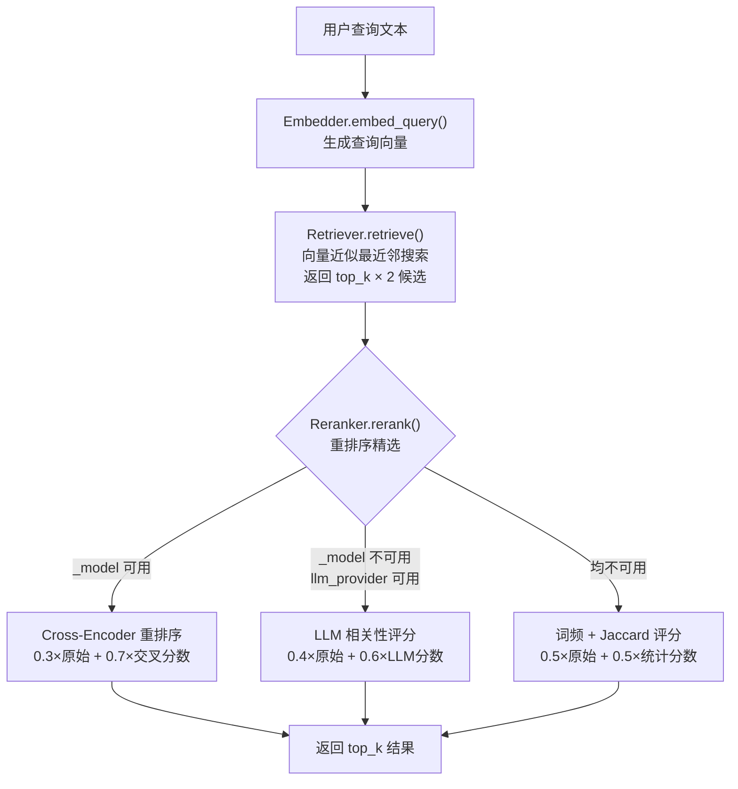
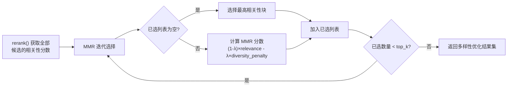

在 RAG 管道的完整生命周期中，摄取与索引阶段负责将原始文档转化为可检索的向量数据，而**查询阶段**则决定了最终交付给用户的内容质量。ResolveAgent 的查询子系统采用经典的**两阶段检索架构**——先由双编码器（bi-encoder）通过向量近似最近邻搜索快速召回候选块，再由交叉编码器（cross-encoder）对候选集进行精细重排序，以显著提升语义相关性精度。本文将深入剖析这一从相似度搜索到重排序的完整数据流，覆盖 `Retriever` 检索器、`Reranker` 重排序器、MMR 多样性选择机制，以及它们在 `RAGPipeline` 中的编排方式。

Sources: [reranker.py](python/src/resolveagent/rag/retrieve/reranker.py#L1-L5), [retriever.py](python/src/resolveagent/rag/retrieve/retriever.py#L1-L10), [pipeline.py](python/src/resolveagent/rag/pipeline.py#L18-L28)

## 查询流程总览：三步精细化检索

`RAGPipeline.query()` 方法编排了从原始查询文本到最终重排序结果的完整三步流程。核心设计思想是**过采样 + 精筛**：第一阶段向量搜索返回 `top_k × 2` 的候选集，第二阶段由重排序器从中精选出 `top_k` 个最相关结果，确保交叉编码器拥有足够的候选池进行精细化评分。



这一流程在 `RAGPipeline.query()` 中清晰体现：首先调用 `self._embedder.embed_query(query)` 将查询文本转化为嵌入向量，随后通过 `self._retriever.retrieve()` 以双倍候选量召回，最后调用 `self._reranker.rerank()` 完成精排。整个过程的日志贯穿于每一步骤，便于调试和性能监控。

Sources: [pipeline.py](python/src/resolveagent/rag/pipeline.py#L197-L259)

## 相似度搜索：Retriever 与双后端适配

**Retriever** 是查询阶段的第一道关卡，负责将查询向量提交给向量数据库执行近似最近邻（ANN）搜索。它通过统一的抽象接口对接 Milvus 和 Qdrant 两种向量后端，对外提供一致的检索能力。

| 参数 | 说明 | 默认值 |
|------|------|--------|
| `vector_backend` | 向量存储后端类型 | `"milvus"` |
| `host` | 向量数据库主机地址 | `"localhost"` |
| `port` | 向量数据库端口 | Milvus: `19530`，Qdrant: `6333` |
| `collection` | 目标集合名称 | 必填 |
| `query_embedding` | 查询嵌入向量 | 由 Embedder 生成 |
| `top_k` | 返回结果数量 | `5` |
| `filters` | 元数据过滤条件 | `None` |
| `metric_type` | 距离度量类型 | `"COSINE"` |

Retriever 采用**延迟连接**策略：`_get_store()` 方法在首次检索时才建立向量数据库连接，避免不必要的资源占用。两种后端的搜索实现均基于 `VectorStore` 抽象基类的 `search()` 接口，但过滤表达式的构建方式有所不同——Milvus 使用 JSON 元数据路径表达式（如 `metadata["key"] == "value"`），而 Qdrant 使用 `FieldCondition` + `MatchValue` 的结构化过滤模型。

Sources: [retriever.py](python/src/resolveagent/rag/retrieve/retriever.py#L14-L52), [base.py](python/src/resolveagent/rag/index/base.py#L92-L112), [milvus.py](python/src/resolveagent/rag/index/milvus.py#L251-L320), [qdrant.py](python/src/resolveagent/rag/index/qdrant.py#L252-L324)

### 向量搜索的度量与索引

两种后端均支持三种核心距离度量，但命名略有差异。Milvus 使用 `COSINE`、`L2`、`IP`（内积），Qdrant 使用 `COSINE`、`EUCLID`、`DOT`。系统通过内部映射表自动处理命名转换。在 Milvus 的实现中，集合创建时使用 `IVF_FLAT` 索引类型并设置 `nlist=128`，以平衡检索精度与速度。默认度量类型为 `COSINE`（余弦相似度），这一选择与 BGE-large-zh 嵌入模型生成的归一化向量天然匹配。

Sources: [milvus.py](python/src/resolveagent/rag/index/milvus.py#L130-L142), [qdrant.py](python/src/resolveagent/rag/index/qdrant.py#L108-L133)

## 交叉编码器重排序：三级降级策略

**Reranker** 是整个查询流程的核心精度保障组件。双编码器（bi-encoder）虽然检索速度快，但由于查询和文档独立编码，无法捕捉细粒度的语义交互；交叉编码器（cross-encoder）将查询-文档对联合输入同一模型，能够建模更深层的语义关联，但计算代价更高。因此，系统采用"先快后精"的两阶段架构——这正是业界公认的最佳实践。

Reranker 支持三种重排序策略，按优先级自动降级选择：

| 优先级 | 策略 | 触发条件 | 分数融合公式 |
|--------|------|----------|-------------|
| 1 | **Cross-Encoder** | `sentence-transformers` 可用 + 模型加载成功 | `0.3 × original + 0.7 × rerank` |
| 2 | **LLM 评分** | `llm_provider` 可用 | `0.4 × original + 0.6 × llm_score` |
| 3 | **词频统计** | 无外部依赖可用 | `0.5 × original + 0.5 × stat_score` |

Sources: [reranker.py](python/src/resolveagent/rag/retrieve/reranker.py#L28-L134)

### 第一优先级：BGE-Reranker 交叉编码器

当 `sentence-transformers` 库可用时，Reranker 加载 BGE-Reranker 交叉编码器模型。系统内置了三个预配置模型的 HuggingFace 名称映射：

| 配置名称 | HuggingFace 模型 | 适用场景 |
|----------|-----------------|----------|
| `bge-reranker-large` | `BAAI/bge-reranker-large` | 默认，精度与速度均衡 |
| `bge-reranker-base` | `BAAI/bge-reranker-base` | 轻量级，适合低资源环境 |
| `cohere-rerank` | `cohere/rerank-english-v3.0` | 英文场景专用 |

交叉编码器的工作机制非常直观：将每个候选块与查询拼接为 `[query, content]` 对，通过 `CrossEncoder.predict()` 批量评分。模型输出一个相关性分数，该分数以 **0.7 的权重**与原始向量搜索分数融合（`0.3 × original + 0.7 × rerank`），重排序分数占主导地位，体现了对交叉编码器精度的信任。模型初始化时设置 `max_length=512`，在精度与推理开销间取得平衡。若模型加载失败（如网络问题或显存不足），系统会优雅降级到下一策略。

Sources: [reranker.py](python/src/resolveagent/rag/retrieve/reranker.py#L62-L188)

### 第二优先级：LLM 相关性评分

当交叉编码器不可用但配置了 `llm_provider` 时，系统使用大语言模型对每个候选块进行逐个评分。LLM 接收一个精心设计的评分提示词，要求在 0-10 的尺度上对查询-文档相关性打分。系统从 LLM 响应中解析数字分数，归一化到 `[0, 1]` 区间后与原始分数融合（权重为 `0.4 × original + 0.6 × llm_score`）。

这一策略虽然精度不及交叉编码器，但无需额外加载本地模型，适合 GPU 资源受限或希望复用已有 LLM 服务的部署场景。代码中包含健壮的分数解析逻辑：先尝试直接解析浮点数，失败后使用正则表达式提取数字，最终回退到默认值 0.5，确保单个块评分失败不会中断整个重排序流程。

Sources: [reranker.py](python/src/resolveagent/rag/retrieve/reranker.py#L190-L270)

### 第三优先级：词频与 Jaccard 统计

当 `sentence-transformers` 和 `llm_provider` 均不可用时，系统退回到纯统计方法——使用 **Jaccard 相似度**与**词项频率**的等权组合。具体而言，将查询和候选块分别拆分为词集合，计算 Jaccard 系数 `|A ∩ B| / |A ∪ B|`，同时统计查询词项在候选块中的出现频率并归一化，两者以 `0.5:0.5` 的比例融合作为最终分数。这一降级方案无需任何外部依赖，保证了系统在最小配置下的基本可用性。

Sources: [reranker.py](python/src/resolveagent/rag/retrieve/reranker.py#L272-L319)

## MMR 多样性感知选择

除了标准的 `rerank()` 方法，Reranker 还提供了 `rerank_with_diversity()` 方法，实现了**最大边际相关性**（Maximal Marginal Relevance, MMR）选择算法。MMR 的核心目标是在保持结果相关性的同时，减少冗余内容的出现——这对于返回多个结果块的 RAG 场景尤为重要，因为同一文档的不同分块往往高度重叠。



MMR 评分函数的关键参数是 `diversity_weight`（默认 `0.3`），它控制相关性与多样性之间的权衡。对于每个候选块，系统计算其与所有已选块之间的最大 Jaccard 相似度作为多样性惩罚项，最终的 MMR 分数公式为 `(1 - λ) × relevance - λ × penalty`，其中 λ 即 `diversity_weight`。值越大，结果越多样化但可能牺牲部分相关性。

Sources: [reranker.py](python/src/resolveagent/rag/retrieve/reranker.py#L321-L405)

## 查询 API 与 CLI 集成

查询能力通过两个层级暴露给用户。**Python Runtime 层**通过 FastAPI 的 `POST /v1/rag/query` 端点提供服务，接收 `collection_id`、`query`、`top_k` 和 `filters` 参数，直接实例化 `RAGPipeline` 并调用 `query()` 方法。**Go Platform 层**则通过 CLI 的 `rag query` 子命令提供命令行交互入口，内部通过 API Client 将请求转发至 Python Runtime。

CLI 查询命令的使用方式如下：

```bash
resolveagent rag query "Pod 启动失败如何排查" \
  --collection my-k8s-docs \
  --top-k 5
```

CLI 层的输出格式化包括相关性分数（精确到小数点后四位）、文档 ID（如果元数据中包含）以及截断到 200 字符的内容预览，为用户提供快速的结果概览。

Sources: [http_server.py](python/src/resolveagent/runtime/http_server.py#L160-L192), [query.go](internal/cli/rag/query.go#L11-L78)

## 架构设计要点总结

| 设计维度 | 实现策略 | 核心收益 |
|----------|----------|----------|
| **两阶段检索** | 向量搜索过采样 ×2 + 重排序精筛 | 兼顾召回率与精度 |
| **三级降级** | Cross-Encoder → LLM → 词频统计 | 零外部依赖下的可用性保障 |
| **分数融合** | 分层权重组合（0.3/0.7, 0.4/0.6, 0.5/0.5） | 保留原始信号的完整性 |
| **多样性控制** | MMR 算法 + 可调 diversity_weight | 减少冗余，提升信息覆盖度 |
| **延迟连接** | 首次检索时才建立向量库连接 | 减少空闲资源占用 |

这一架构在前一页讨论的嵌入与分块（[分块策略与嵌入模型：语义/句子/固定分块 + BGE-large-zh](16-fen-kuai-ce-lue-yu-qian-ru-mo-xing-yu-yi-ju-zi-gu-ding-fen-kuai-bge-large-zh)）基础上完成了检索侧的闭环，而后续页面将展示这一检索能力如何被专家技能系统所复用——详见 [语料库导入与技能发现：Kudig 技能导入流程](21-yu-liao-ku-dao-ru-yu-ji-neng-fa-xian-kudig-ji-neng-dao-ru-liu-cheng)。