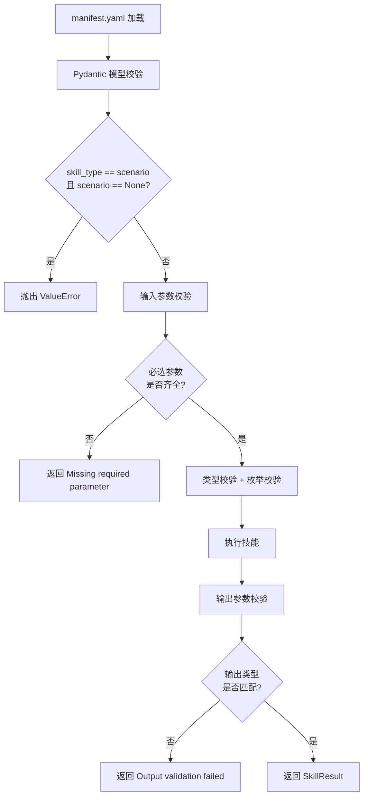

技能清单（Skill Manifest）是 ResolveAgent 技能系统的**契约核心**——一份 YAML 格式的声明式配置文件，精确定义了技能的身份标识、输入参数、输出结构以及执行权限。本页深入解析清单的每一层规范：从 JSON Schema 形式化约束到 Python Pydantic 模型的运行时校验，从参数类型系统到权限沙箱映射，帮助开发者精确掌握技能清单的设计意图和实现细节。

Sources: [skill-manifest.schema.json](api/jsonschema/skill-manifest.schema.json#L1-L127), [manifest.py](python/src/resolveagent/skills/manifest.py#L1-L129)

## 清单文件的角色定位

在 ResolveAgent 的架构中，`manifest.yaml` 不仅是"配置文件"，它是**三重契约的交汇点**：对外，它是 API 网关的请求校验依据；对内，它是执行引擎的调度蓝图；对下，它是沙箱隔离器的资源约束声明。整个生命周期——从注册、校验、调度到执行——都围绕这份清单运转。

```
manifest.yaml
├── 身份契约 ── name / version / author / entry_point
├── 接口契约 ── inputs[] / outputs[]
├── 安全契约 ── permissions{}
└── 分类契约 ── skill_type / scenario{}
```

Sources: [skill-manifest.schema.json](api/jsonschema/skill-manifest.schema.json#L1-L56), [manifest.py](python/src/resolveagent/skills/manifest.py#L95-L114)

## 清单顶层结构

清单的顶层字段分为**必需字段**和**可选字段**两类。JSON Schema 层通过 `required` 数组强制约束最小完备性，Pydantic 层则通过类型注解和默认值实现更细粒度的运行时校验。

| 字段 | 类型 | 必需 | 默认值 | 说明 |
|------|------|:----:|--------|------|
| `name` | string | ✓ | — | 技能唯一标识，须匹配 `^[a-z][a-z0-9-]*$` |
| `version` | string | ✓ | — | 语义化版本号，须匹配 `^\d+\.\d+\.\d+$` |
| `entry_point` | string | ✓ | — | 入口函数路径，格式为 `module:function` |
| `description` | string | — | `""` | 技能功能描述 |
| `author` | string | — | `""` | 作者标识 |
| `skill_type` | enum | — | `"general"` | 技能分类：`general` 或 `scenario` |
| `inputs` | array | — | `[]` | 输入参数列表 |
| `outputs` | array | — | `[]` | 输出参数列表 |
| `dependencies` | array | — | `[]` | Python 依赖包列表 |
| `permissions` | object | — | 全默认值 | 权限声明块 |
| `scenario` | object | — | `None` | 场景技能专用配置 |

Sources: [skill-manifest.schema.json](api/jsonschema/skill-manifest.schema.json#L6-L56), [manifest.py](python/src/resolveagent/skills/manifest.py#L95-L114)

**名称校验**采用小写字母开头、仅允许小写字母/数字/连字符的正则模式，这确保了技能名称在 CLI、API URL、数据库主键等多种上下文中的一致性。版本号严格遵循三段式语义化版本（SemVer），便于注册表做版本排序和兼容性判断。

Sources: [skill-manifest.schema.json](api/jsonschema/skill-manifest.schema.json#L8-L16)

## 声明式参数模型（Inputs & Outputs）

参数模型是清单中最核心的接口契约定义。`inputs` 和 `outputs` 共享同一套 `parameter` 数据结构，通过 `name`、`type`、`required`、`default`、`enum` 五个维度精确描述每一个参数的形状。

### 参数字段规范

| 字段 | 类型 | 必需 | 默认值 | 说明 |
|------|------|:----:|--------|------|
| `name` | string | ✓ | — | 参数名称，对应入口函数的参数名 |
| `type` | enum | ✓ | — | 类型约束，见下表 |
| `description` | string | — | `""` | 参数说明，用于自动文档生成 |
| `required` | boolean | — | `false` | 是否为必需参数 |
| `default` | any | — | `None` | 默认值 |
| `enum` | array | — | `None` | 枚举约束，限定参数值范围 |

### 支持的类型系统

| 类型 | Python 映射 | JSON Schema 映射 | 校验逻辑 |
|------|-------------|-------------------|----------|
| `string` | `str` | `"string"` | `isinstance(value, str)` |
| `number` | `int \| float` | `"number"` | `isinstance(value, (int, float))` |
| `boolean` | `bool` | `"boolean"` | `isinstance(value, bool)` |
| `object` | `dict` | `"object"` | `isinstance(value, dict)` |
| `array` | `list` | `"array"` | `isinstance(value, list)` |

Sources: [skill-manifest.schema.json](api/jsonschema/skill-manifest.schema.json#L58-L68), [manifest.py](python/src/resolveagent/skills/manifest.py#L40-L48), [executor.py](python/src/resolveagent/skills/executor.py#L149-L204)

**类型系统的设计哲学**是"够用但不膨胀"。五种基础类型覆盖了绝大多数运维场景的数据形态——工单内容（string）、置信度分数（number）、执行开关（boolean）、结构化诊断结果（object）、告警列表（array）——同时避免了 `union`、`tuple`、`map` 等复杂类型带来的校验器膨胀。枚举约束（`enum`）则用于限定有限的合法值集合，例如工单处理的 `action_type` 字段只允许 `"analyze"` / `"summarize"` / `"suggest"` 三种操作。

Sources: [skill-manifest.schema.json](api/jsonschema/skill-manifest.schema.json#L58-L68)

### 输入参数声明实例

以下展示了四种典型技能的输入声明模式，覆盖了从简单到复杂的参数组合：

**hello-world（极简模式）**——单一可选参数，带默认值：

```yaml
inputs:
  - name: name
    type: string
    description: "Name to greet"
    required: false
    default: "World"
```

**ticket-handler（多参数 + 枚举约束）**——三个参数，一个必选、两个可选，其中 `action_type` 使用枚举值：

```yaml
inputs:
  - name: ticket_id
    type: string
    description: "工单编号"
    required: true
  - name: ticket_content
    type: string
    description: "工单内容"
    required: true
  - name: action_type
    type: string
    description: "操作类型 (analyze/summarize/suggest)"
    required: true
    default: "analyze"
```

**k8s-pod-crash（场景技能多输入）**——涉及命名空间、Pod 名称和集群 ID 三个维度的信息：

```yaml
inputs:
  - name: namespace
    type: string
    description: "Kubernetes 命名空间"
    required: true
    default: "default"
  - name: pod_name
    type: string
    description: "异常 Pod 名称（支持前缀匹配）"
    required: true
  - name: cluster_id
    type: string
    description: "ACK 集群 ID"
    required: false
```

**consulting-qa（带分类枚举）**——问题分类使用枚举约束限定知识库范围：

```yaml
inputs:
  - name: question
    type: string
    description: "咨询问题"
    required: true
  - name: category
    type: string
    description: "问题分类 (general/ecs/network/database/k8s/storage)"
    required: false
    default: "general"
```

Sources: [hello-world/manifest.yaml](skills/examples/hello-world/manifest.yaml#L6-L11), [ticket-handler/manifest.yaml](skills/examples/ticket-handler/manifest.yaml#L6-L19), [k8s-pod-crash/manifest.yaml](skills/examples/k8s-pod-crash/manifest.yaml#L8-L22), [consulting-qa/manifest.yaml](skills/examples/consulting-qa/manifest.yaml#L6-L20)

### 输出参数声明实例

输出参数声明遵循相同的 `parameter` 结构，但语义上更侧重于描述技能的**产物形状**。执行引擎通过输出校验确保技能产物的契约合规性。

**ticket-handler（多输出类型）**——同时产出字符串和结构化内容：

```yaml
outputs:
  - name: analysis_result
    type: string
    description: "分析结果"
  - name: change_plan
    type: string
    description: "变更方案"
  - name: summary
    type: string
    description: "工单摘要"
```

**k8s-pod-crash（对象类型输出）**——场景技能的输出是包含四要素的结构化对象：

```yaml
outputs:
  - name: structured_solution
    type: object
    description: "四要素结构化排查方案（问题现象 / 关键信息 / 排查步骤 / 解决方案）"
```

**consulting-qa（混合类型输出）**——字符串、数值类型的组合输出：

```yaml
outputs:
  - name: answer
    type: string
    description: "回答内容"
  - name: references
    type: string
    description: "参考来源"
  - name: confidence
    type: number
    description: "置信度 (0-1)"
```

Sources: [ticket-handler/manifest.yaml](skills/examples/ticket-handler/manifest.yaml#L20-L29), [k8s-pod-crash/manifest.yaml](skills/examples/k8s-pod-crash/manifest.yaml#L23-L26), [consulting-qa/manifest.yaml](skills/examples/consulting-qa/manifest.yaml#L21-L30)

## 权限模型

权限模型是技能安全隔离的**声明式合约**。技能在清单中显式声明自身所需的权限和资源配额，执行引擎据此配置沙箱环境。这种"默认最小权限 + 显式声明"的设计，确保了不可信技能无法突破安全边界。

### 权限字段完整规范

| 字段 | 类型 | 默认值 | 安全影响 | 说明 |
|------|------|--------|----------|------|
| `network_access` | boolean | `false` | 中 | 是否允许网络访问 |
| `file_system_read` | boolean | `false` | 中 | 是否允许读取文件系统 |
| `file_system_write` | boolean | `false` | **高** | 是否允许写入文件系统 |
| `allowed_hosts` | string[] | `[]` | — | 网络访问白名单（主机 glob 模式） |
| `max_memory_mb` | integer | `256` | — | 最大内存使用量（MB） |
| `max_cpu_seconds` | integer | `30` | — | 最大 CPU 时间（秒） |
| `timeout_seconds` | integer | `60` | — | 执行超时上限（秒） |

Sources: [skill-manifest.schema.json](api/jsonschema/skill-manifest.schema.json#L70-L80), [manifest.py](python/src/resolveagent/skills/manifest.py#L28-L37)

### 默认最小权限原则

所有权限的默认值都遵循**最小权限原则**：`network_access` 默认关闭、文件系统读写默认禁止、资源配额设置保守上限。开发者只有在清单中显式声明后，技能才能获得对应权限。例如 `hello-world` 技能的所有权限开关全部为 `false`，而 `k8s-pod-crash` 场景技能需要 `network_access: true` 来执行 `kubectl` 命令。

### 权限到沙箱的映射关系

权限声明不仅是"文档"，它直接映射到 `SandboxConfig` 的各个执行约束参数。以下展示了这种映射关系：

| manifest.yaml 权限 | SandboxConfig 参数 | 底层实现 |
|---------------------|-------------------|----------|
| `timeout_seconds` | `config.timeout_seconds` | `asyncio.wait_for()` 超时控制 |
| `max_memory_mb` | `config.max_memory_mb` | `resource.setrlimit(RLIMIT_AS, ...)` |
| `max_cpu_seconds` | `config.cpu_time_limit` | `resource.setrlimit(RLIMIT_CPU, ...)` |
| `network_access` | `config.allow_network` | 子进程环境变量隔离 |
| `file_system_read` | 环境控制 | 文件描述符限制 |
| `file_system_write` | 环境控制 | 文件大小限制 `RLIMIT_FSIZE` |
| `allowed_hosts` | 网络白名单 | （预留，未来通过 seccomp-bpf 实现） |

Sources: [sandbox.py](python/src/resolveagent/skills/sandbox.py#L27-L48), [sandbox.py](python/src/resolveagent/skills/sandbox.py#L333-L364)

### 四种典型权限配置模式

通过对比仓库中的实际技能清单，可以归纳出四种常见的权限配置模式：

| 模式 | network | fs_read | fs_write | timeout | 典型技能 |
|------|:-------:|:-------:|:--------:|:-------:|----------|
| **纯计算型** | ✗ | ✗ | ✗ | 10s | `hello-world` |
| **知识检索型** | ✓ | ✗ | ✗ | 30s | `consulting-qa`、`ticket-handler` |
| **日志分析型** | ✓ | ✓ | ✗ | 60s | `log-analyzer`（种子数据） |
| **场景诊断型** | ✓ | ✓ | ✗ | 120s | `k8s-pod-crash` |

纯计算型技能（如 `hello-world`）完全不需要外部访问，超时仅 10 秒。知识检索型技能需要联网但不读写本地文件。场景诊断型技能由于涉及 `kubectl` 命令执行和多步排查流程，需要更长的超时（120 秒）和文件系统读取权限。

Sources: [hello-world/manifest.yaml](skills/examples/hello-world/manifest.yaml#L16-L20), [consulting-qa/manifest.yaml](skills/examples/consulting-qa/manifest.yaml#L31-L35), [ticket-handler/manifest.yaml](skills/examples/ticket-handler/manifest.yaml#L30-L34), [k8s-pod-crash/manifest.yaml](skills/examples/k8s-pod-crash/manifest.yaml#L28-L32)

## 运行时校验流程

清单声明只是第一步。在技能实际执行时，执行引擎 `SkillExecutor` 会对输入输出进行**双重校验**，确保清单契约被严格执行。整个校验流程可分为四个阶段：



**阶段一：清单结构校验**。`load_manifest()` 将 YAML 解析为 `SkillManifest` Pydantic 模型，此时触发所有字段类型约束。特别地，`model_validator` 会检查 scenario 技能必须包含 `scenario` 配置块，否则在加载阶段就抛出 `ValueError`。

**阶段二：输入参数校验**。`_validate_inputs()` 在执行前逐一检查：① 所有 `required: true` 的参数是否存在于输入字典中；② 每个参数值的类型是否匹配声明类型；③ 若参数声明了 `enum` 约束，值是否在合法枚举集合内。未知的额外参数会被记录为 warning 但不阻断执行。

**阶段三：执行调度**。根据 `skill_type` 路由到不同的执行路径——通用技能走直接调用或沙箱执行，场景技能委托给 `TroubleshootingEngine`。

**阶段四：输出参数校验**。`_validate_outputs()` 对执行结果进行类型匹配检查，确保输出的每个字段都符合清单中声明的类型约束。如果校验失败，即使技能本身执行成功，`success` 标记也会被置为 `false`。

Sources: [executor.py](python/src/resolveagent/skills/executor.py#L52-L147), [manifest.py](python/src/resolveagent/skills/manifest.py#L110-L114), [executor.py](python/src/resolveagent/skills/executor.py#L149-L246)

## 入口函数与清单的对应关系

清单中的 `entry_point` 字段采用 `module:function` 格式，指向技能目录中的一个 Python 模块及其入口函数。`SkillLoader` 通过 `rpartition(":")` 拆分路径，然后使用 `importlib.import_module` 动态加载模块并获取可调用对象。入口函数的参数签名应与清单中 `inputs` 的参数名严格对应。

以 `hello-world` 为例，清单声明 `entry_point: "skill:run"`，对应的 Python 函数签名为 `def run(name: str = "World") -> dict[str, str]`，其中参数名 `name` 与清单中 `inputs[0].name` 完全匹配。执行时，引擎将 `inputs` 字典直接通过 `**inputs` 关键字参数解包传递给入口函数。

```python
# 清单声明:
#   entry_point: "skill:run"
#   inputs:
#     - name: name, type: string, required: false, default: "World"

# skill.py
def run(name: str = "World") -> dict[str, str]:
    return {"greeting": f"Hello, {name}! Welcome to ResolveAgent."}
```

Sources: [loader.py](python/src/resolveagent/skills/loader.py#L27-L57), [hello-world/manifest.yaml](skills/examples/hello-world/manifest.yaml#L5-L11), [hello-world/skill.py](skills/examples/hello-world/skill.py#L4-L13)

## 数据库中的清单存储

在持久化层，清单以 JSONB 格式存储在 PostgreSQL 的 `skills` 表中。Go 平台层的 `SkillDefinition` 结构体中，`Manifest` 字段类型为 `map[string]any`，可以承载清单的完整嵌套结构。种子数据 SQL 中的 `manifest` 列以 JSONB 文本形式写入，包含了 `skill_type`、`inputs`、`outputs`、`permissions` 等所有声明式字段。

```sql
INSERT INTO skills (name, version, description, author, manifest, source_type, source_uri, status, labels)
VALUES (
    'ticket-handler', '1.2.0', '自动分析运维工单...', 'ResolveNet Team',
    '{"skill_type": "general", "entry_point": "skills/ticket_handler/main.py",
      "inputs": [...], "outputs": [...],
      "permissions": {"network_access": true, "timeout_seconds": 30}
    }'::jsonb,
    'local', 'skills/ticket_handler/', 'active',
    '{"skill_type": "general"}'::jsonb
);
```

`ON CONFLICT (name) DO UPDATE SET` 子句确保种子数据可以幂等执行，每次部署升级时都会用最新清单覆盖既有记录。

Sources: [seed-skills.sql](scripts/seed/seed-skills.sql#L1-L20), [skill.go](pkg/registry/skill.go#L10-L23)

## JSON Schema 与 Pydantic 的双重保障

清单规范由两层校验机制守护：**JSON Schema** 作为语言无关的形式化规范，定义在 `api/jsonschema/skill-manifest.schema.json` 中，可用于任何编程语言的校验工具链；**Pydantic 模型**定义在 `python/src/resolveagent/skills/manifest.py` 中，提供运行时的 Python 原生校验和自动类型转换。

| 维度 | JSON Schema | Pydantic 模型 |
|------|-------------|---------------|
| **校验时机** | 外部工具/API 网关层 | Python 运行时加载时 |
| **表达力** | 正则模式、枚举、`required` 数组 | 类型注解、`model_validator`、默认值工厂 |
| **场景技能校验** | 未单独约束 | `skill_type == scenario` 时强制 `scenario` 非 None |
| **用途** | CI/CD 流水线、API 文档生成 | `load_manifest()` 加载时即时校验 |

JSON Schema 通过 `$defs/parameter` 和 `$defs/permissions` 两个可复用子模式定义了参数和权限的形状，清单顶层通过 `$ref` 引用它们。Pydantic 模型则通过 `SkillParameter` 和 `SkillPermissions` 两个 `BaseModel` 子类实现等价结构，并在 `SkillManifest` 上通过 `@model_validator` 添加跨字段约束。

Sources: [skill-manifest.schema.json](api/jsonschema/skill-manifest.schema.json#L57-L82), [manifest.py](python/src/resolveagent/skills/manifest.py#L40-L114)

## CLI 工具链对清单的支撑

ResolveAgent 的 CLI 工具链围绕清单提供了完整的生命周期管理。`resolveagent skill install` 命令从本地目录、Git 仓库或远程注册表安装技能，安装过程会触发清单解析和校验。`resolveagent skill list` 以表格形式展示已注册技能的名称、版本、类型和状态。`resolveagent skill info` 支持以 text、JSON、YAML 三种格式输出技能详情，便于脚本集成。`resolveagent skill test` 接受 `--input`（JSON 文件）或 `--data`（内联 JSON）参数，在隔离环境中执行技能并验证输出。

Sources: [install.go](internal/cli/skill/install.go#L30-L88), [list.go](internal/cli/skill/list.go#L13-L51), [info.go](internal/cli/skill/info.go#L13-L69), [test.go](internal/cli/skill/test.go#L13-L79)

## 延伸阅读

- [技能类型体系：通用技能（general）与场景技能（scenario）](19-ji-neng-lei-xing-ti-xi-tong-yong-ji-neng-general-yu-chang-jing-ji-neng-scenario)——场景技能独有的 `troubleshooting_flow`、`ScenarioConfig` 和四要素结构化输出模板
- [沙箱执行器：资源隔离与安全约束](20-sha-xiang-zhi-xing-qi-zi-yuan-ge-chi-yu-an-quan-yue-shu)——`SandboxExecutor` 如何将权限声明映射到操作系统级资源限制
- [语料库导入与技能发现：Kudig 技能导入流程](21-yu-liao-ku-dao-ru-yu-ji-neng-fa-xian-kudig-ji-neng-dao-ru-liu-cheng)——外部技能如何通过导入流程自动生成清单条目并注册到平台
- [12 大注册表体系：统一 CRUD 接口与内存/Postgres 双后端](24-12-da-zhu-ce-biao-ti-xi-tong-crud-jie-kou-yu-nei-cun-postgres-shuang-hou-duan)——`SkillRegistry` 接口的内存和 PostgreSQL 实现细节