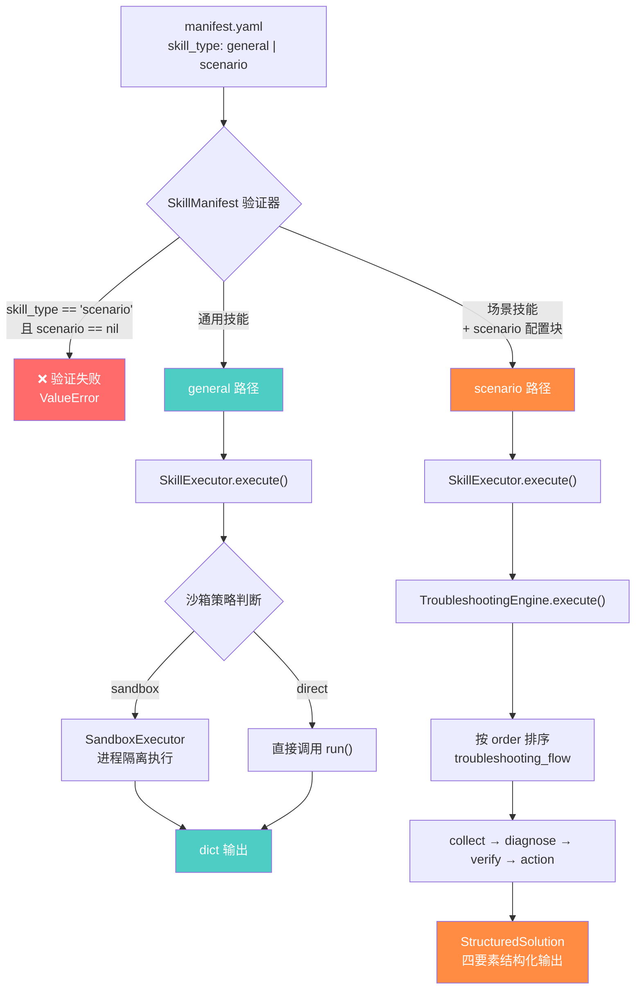
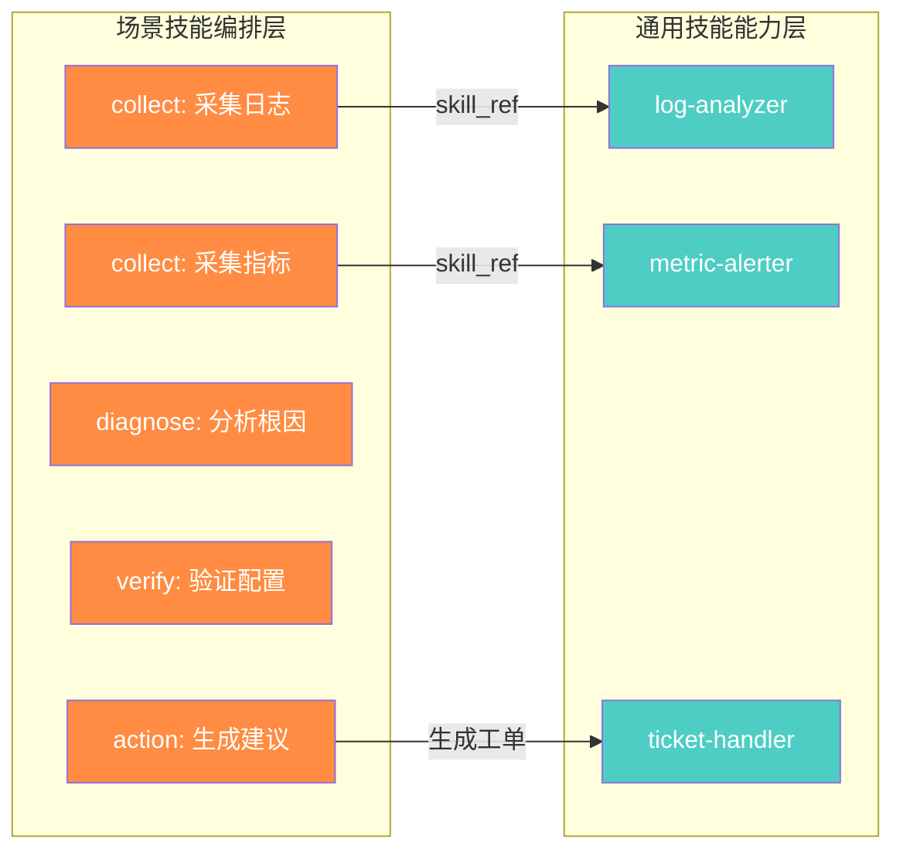

ResolveAgent 的技能系统将所有技能划分为两种根本不同的类型——**通用技能（general）** 和 **场景技能（scenario）**。这不是一个简单的标签差异，而是从**清单验证、执行路由、输出模型到权限约束**四个层面贯穿整套架构的核心设计决策。通用技能是"瑞士军刀"——轻量、通用、即调即用；场景技能是"手术刀"——针对特定故障域的结构化排查引擎。理解两者的边界与协作方式，是正确使用和开发 ResolveAgent 技能的前提。
Sources: [manifest.py](python/src/resolveagent/skills/manifest.py#L16-L21), [skill-manifest.schema.json](api/jsonschema/skill-manifest.schema.json#L47-L52)

## 双类型体系总览

JSON Schema 在 `skill_type` 字段中定义了严格的枚举约束，只允许 `"general"` 和 `"scenario"` 两个值，默认为 `"general"`。Python 运行时通过 `SkillType(StrEnum)` 将其编码为类型安全枚举，Go 平台层则在 `SkillDefinition.SkillType` 中以字符串形式存储，并提供 `ListByType()` 方法按类型过滤注册表中的技能。

下面的 Mermaid 图展示了两种类型从清单声明到执行路由的完整分叉路径。理解这张图是理解整个技能类型体系的关键——每个分支节点都代表一个架构级的差异化决策。



Sources: [skill-manifest.schema.json](api/jsonschema/skill-manifest.schema.json#L47-L52), [manifest.py](python/src/resolveagent/skills/manifest.py#L95-L114), [executor.py](python/src/resolveagent/skills/executor.py#L96-L98)

## 通用技能（general）：工具型执行单元

通用技能是 ResolveAgent 技能体系的**基础层**，适用于任何不涉及结构化故障排查的功能。它们的核心特征是**输入-输出的直接映射**——给定一组参数，返回一组结果，没有中间状态、没有证据收集、没有分步流程。

在代码中，通用技能是 `SkillType` 枚举的默认值。当一个 `manifest.yaml` 未显式声明 `skill_type` 字段时，`SkillManifest` 模型自动将其归为 `GENERAL`。这意味着系统中的大量"工具型"技能天然属于这一类，无需开发者额外配置。

Sources: [manifest.py](python/src/resolveagent/skills/manifest.py#L103), [skill-manifest.schema.json](api/jsonschema/skill-manifest.schema.json#L49-L51)

### 通用技能的执行路径

当 `SkillExecutor.execute()` 检测到 `skill.manifest.skill_type != SkillType.SCENARIO` 时，技能进入**直接执行路径**。执行器首先根据 `manifest.permissions` 和 `execution_mode` 判断是否需要沙箱隔离——如果技能声明了 `network_access: true` 或 `file_system_write: true` 等高风险权限，系统会自动将其路由到 `SandboxExecutor`；对于受信任的内置技能，则直接调用 `run()` 函数。无论哪种方式，最终输出都是一个标准的 Python `dict`，由 `_validate_outputs()` 方法根据 `manifest.outputs` 中声明的参数类型进行校验。

Sources: [executor.py](python/src/resolveagent/skills/executor.py#L100-L136), [sandbox.py](python/src/resolveagent/skills/sandbox.py#L27-L48)

### 系统中的通用技能实例

种子数据中包含 6 个通用技能，覆盖了 AIOps 平台的核心运维工具链：

| 技能名称 | 版本 | 功能描述 | 典型超时 |
|---------|------|---------|---------|
| `ticket-handler` | 1.2.0 | 自动分析运维工单，提取关键信息，评估优先级 | 30s |
| `consulting-qa` | 1.1.0 | 基于阿里云产品文档的智能问答（ECS/ACK/RDS/OSS） | 15s |
| `log-analyzer` | 2.0.1 | 多源日志聚合分析，支持 SLS/Kafka/文件日志的模式识别 | 60s |
| `metric-alerter` | 1.0.3 | 基于 Prometheus 指标的智能告警与动态阈值预测 | 45s |
| `change-reviewer` | 0.9.0 | 变更单自动审核，检查回滚方案完整性和窗口合规性 | 30s |
| `hello-world` | 0.1.0 | 技能框架验证用的基础测试技能 | 10s |

以 `ticket-handler` 为例，它的 `manifest.yaml` 不包含 `skill_type` 字段（默认为 general），也不包含 `scenario` 配置块。入口函数 `run()` 接收 `ticket_id`、`ticket_content` 和 `action_type` 三个参数，根据操作类型分发到 `_analyze()`、`_summarize()` 或 `_suggest()` 三个内部函数，直接返回结果字典。没有状态跟踪，没有证据收集，没有分步流程——这是通用技能"输入即输出"设计哲学的典型体现。

Sources: [seed-skills.sql](scripts/seed/seed-skills.sql#L11-L70), [ticket-handler/manifest.yaml](skills/examples/ticket-handler/manifest.yaml#L1-L35), [ticket-handler/skill.py](skills/examples/ticket-handler/skill.py#L110-L137)

### 通用技能清单结构

```yaml
# hello-world — 最简通用技能示例
name: hello-world
version: "1.0.0"
description: "A simple hello world skill for testing"
entry_point: "skill:run"
inputs:
  - name: name
    type: string
    required: false
    default: "World"
outputs:
  - name: greeting
    type: string
permissions:
  network_access: false
  file_system_read: false
  file_system_write: false
  timeout_seconds: 10
# 注意：没有 skill_type 字段 → 默认 general
# 注意：没有 scenario 配置块
```

Sources: [hello-world/manifest.yaml](skills/examples/hello-world/manifest.yaml#L1-L21)

## 场景技能（scenario）：结构化排查引擎

场景技能是 ResolveAgent 技能体系中**最复杂也最核心**的类型。每一个场景技能封装了一套针对特定故障域的结构化排查流程，最终输出一个符合四要素模型的 `StructuredSolution`。与通用技能的"输入-输出"模式不同，场景技能的执行模型是"**输入-多步收集与诊断-结构化输出**"。

### 强制性验证约束

`SkillManifest` 的 Pydantic 模型验证器在模型实例化时执行一个关键检查：如果 `skill_type == SkillType.SCENARIO` 但 `scenario` 字段为 `None`，验证器直接抛出 `ValueError`，阻止无效的场景技能注册。这是一个**编译期级别的安全网**——不存在"没有排查流程的场景技能"这种东西。

```python
@model_validator(mode="after")
def _validate_scenario_config(self) -> SkillManifest:
    if self.skill_type == SkillType.SCENARIO and self.scenario is None:
        raise ValueError("Scenario skills must include a 'scenario' configuration block")
    return self
```

Sources: [manifest.py](python/src/resolveagent/skills/manifest.py#L110-L114)

### ScenarioConfig：场景技能的灵魂

`ScenarioConfig` 是场景技能区别于通用技能的核心数据结构，包含以下五个关键字段：

| 字段 | 类型 | 必需 | 说明 |
|------|------|------|------|
| `domain` | `str` | ✅ | 故障域标识，如 `kubernetes`、`database`、`network` |
| `tags` | `list[str]` | ❌ | 域标签，用于智能路由和语义检索 |
| `troubleshooting_flow` | `list[TroubleshootingStep]` | ❌ | 有序排查步骤列表 |
| `output_template` | `SolutionOutputTemplate` | ❌ | 四要素输出生成引导 |
| `severity_levels` | `list[str]` | ❌ | 严重等级分类（默认 critical/high/medium/low） |

其中 `troubleshooting_flow` 是整个场景技能的执行引擎核心。每个 `TroubleshootingStep` 包含一个 `step_type` 字段，必须是以下四种之一：

| 步骤类型 | 职责 | 典型操作 |
|---------|------|---------|
| `collect` | 信息采集 | 执行 `kubectl describe`、获取日志、读取指标 |
| `diagnose` | 诊断分析 | 分析退出码、判断根因、模式匹配 |
| `verify` | 验证确认 | 检查配置正确性、验证修复效果 |
| `action` | 执行操作 | 生成修复建议、执行变更 |

Sources: [manifest.py](python/src/resolveagent/skills/manifest.py#L56-L88)

### TroubleshootingEngine：场景技能的执行引擎

当 `SkillExecutor` 检测到 `skill.manifest.skill_type == SkillType.SCENARIO` 时，它将执行权完全委托给 `TroubleshootingEngine`。引擎的工作流程如下：

1. **初始化上下文**：创建 `TroubleshootingContext`，将用户输入和可选的环境上下文注入变量池
2. **步骤排序**：按 `step.order` 字段对 `troubleshooting_flow` 中的步骤升序排列
3. **条件门控**：对每个步骤检查 `condition` 字段（如 `"exit_code == 137"`），不满足则跳过
4. **步骤执行**：根据步骤类型分发到 `_execute_via_skill()`（调用其他技能）、`_execute_command()`（沙箱命令）或 `_execute_descriptive()`（描述性步骤）
5. **证据收集**：每步执行结果中的 `DiagnosticEvidence` 被追加到上下文
6. **方案综合**：调用 `_synthesize_solution()` 将所有收集的数据组装为 `StructuredSolution`

Sources: [troubleshoot.py](python/src/resolveagent/skills/troubleshoot.py#L52-L141), [executor.py](python/src/resolveagent/skills/executor.py#L246-L273)

### 四要素结构化输出

每个场景技能的最终输出都遵循 `StructuredSolution` 模型定义的四要素格式。这个模型同时提供 `to_dict()` 和 `to_markdown()` 两种序列化方式，前者用于 API 传输，后者用于人类可读的报告生成：

| 要素 | 字段名 | 语义 | 内容来源 |
|------|--------|------|---------|
| 问题现象 | `symptoms` | 故障的可观测表现 | 失败的诊断步骤、上下文累积 |
| 关键信息 | `key_information` | 日志/指标/命令输出等原始证据 | 每步收集的 `DiagnosticEvidence` |
| 排查步骤 | `troubleshooting_steps` | 各步骤的执行结果和耗时 | `TroubleshootingStepResult` 列表 |
| 解决方案 | `resolution_steps` | 具体的修复操作指引 | action 类型步骤、失败诊断的发现 |

`StructuredSolution` 还包含两个元数据字段：`confidence`（基于步骤完成率计算的置信度，取值 0.0-1.0）和 `severity`（从场景配置的严重等级中选择）。

Sources: [solution.py](python/src/resolveagent/skills/solution.py#L31-L128)

### 场景技能完整清单示例

以 `k8s-pod-crash` 为例，以下是一个场景技能的完整清单结构，展示了排查流程的八步编排：

```yaml
name: k8s-pod-crash
version: "1.0.0"
description: "K8s Pod CrashLoopBackOff 场景排查技能"
entry_point: "skill:run"
skill_type: scenario                    # ← 显式声明为场景技能

inputs:
  - name: namespace
    type: string
    required: true
  - name: pod_name
    type: string
    required: true

outputs:
  - name: structured_solution           # ← 四要素结构化输出
    type: object

permissions:
  network_access: true                  # ← 需要访问 K8s API
  timeout_seconds: 120                  # ← 场景技能通常需要更长超时

scenario:                               # ← ScenarioConfig 配置块（必需）
  domain: kubernetes
  tags: [k8s, pod, crashloop, oom, container]
  severity_levels: [critical, high, medium, low]
  troubleshooting_flow:
    - id: collect-pod-events
      name: 收集 Pod Events
      step_type: collect
      command: "kubectl describe pod {pod_name} -n {namespace}"
      order: 0
    - id: diagnose-exit-code
      name: 诊断退出码
      step_type: diagnose
      expected_output: exit_code_classification
      order: 2
    # ... 更多步骤（collect-resource-usage, collect-logs, diagnose-oom 等）
    - id: action-recommend
      name: 生成解决建议
      step_type: action
      order: 7
```

Sources: [k8s-pod-crash/manifest.yaml](skills/examples/k8s-pod-crash/manifest.yaml#L1-L114)

### 系统中的场景技能全景

种子数据中包含 20 个场景技能，覆盖了从基础设施到应用层的完整故障排查链。其中 2 个为 ResolveAgent 原生编写（含完整 `troubleshooting_flow`），18 个从 Kudig 知识库导入（以 `SKILL-*` 编号标识，`source_type: "kudig"`）：

| 领域 | 技能 | 来源 |
|------|------|------|
| **Kubernetes - Pod** | `k8s-pod-crash`（CrashLoopBackOff）、`SKILL-POD-001`（OOMKilled）、`SKILL-POD-002`（Pending） | 原生 + Kudig |
| **Kubernetes - Node** | `SKILL-NODE-001`（NotReady） | Kudig |
| **网络** | `SKILL-NET-001`（DNS）、`SKILL-NET-002`（Service）、`SKILL-NET-003`（Ingress/Gateway） | Kudig |
| **数据库** | `rds-replication-lag`（复制延迟）、`SKILL-STORE-001`（PVC 存储） | 原生 + Kudig |
| **安全** | `SKILL-SEC-001`（证书过期）、`SKILL-SEC-002`（RBAC/Quota）、`SKILL-SEC-003`（安全事件） | Kudig |
| **工作负载** | `SKILL-WORK-001`（Deployment Rollout）、`SKILL-IMAGE-001`（镜像拉取）、`SKILL-CONFIG-001`（ConfigMap/Secret） | Kudig |
| **控制面/可观测性** | `SKILL-CP-001`（控制平面）、`SKILL-SCALE-001`（HPA/VPA）、`SKILL-MONITOR-001`（Prometheus）、`SKILL-LOG-001`（日志采集） | Kudig |
| **性能** | `SKILL-PERF-001`（性能瓶颈） | Kudig |

Sources: [seed-skills.sql](scripts/seed/seed-skills.sql#L72-L166)

## 架构层面的关键差异对比

下表从七个维度系统对比两种技能类型在架构各层的实现差异：

| 维度 | 通用技能（general） | 场景技能（scenario） |
|------|-------------------|-------------------|
| **清单验证** | 无额外约束，`scenario` 字段必须为 `None` | `scenario` 配置块为**必需项**，缺省抛出 `ValueError` |
| **执行路由** | `_execute_direct()` 或 `_execute_sandboxed()` | 委托给 `TroubleshootingEngine.execute()` |
| **输出模型** | 自由结构的 `dict` | 强制的 `StructuredSolution`（四要素模型） |
| **状态管理** | 无状态，单次调用即完成 | `TroubleshootingContext` 跟踪症状、证据、变量池 |
| **超时特征** | 10-60 秒（轻量操作） | 90-120 秒（多步诊断流程） |
| **域声明** | 无 `domain`/`tags` 字段 | 必须声明 `domain`，可选 `tags` 用于路由 |
| **Go 注册表** | `labels.skill_type = "general"` | `labels.skill_type = "scenario"` + `labels.domain` |

Sources: [executor.py](python/src/resolveagent/skills/executor.py#L95-L273), [manifest.py](python/src/resolveagent/skills/manifest.py#L95-L114), [seed-skills.sql](scripts/seed/seed-skills.sql#L1-L6)

## 两种类型的协作模式

通用技能和场景技能并非互相排斥，而是可以形成**组合编排**。`TroubleshootingStep` 中的 `skill_ref` 字段允许一个场景技能的排查步骤引用另一个通用技能来执行特定的采集或分析操作。例如，一个 Kubernetes 排查场景技能可以在 `collect` 步骤中引用 `log-analyzer` 通用技能来执行日志模式识别，在 `diagnose` 步骤中引用 `metric-alerter` 来获取指标异常——场景技能编排流程，通用技能提供原子能力。



当 `TroubleshootingEngine` 执行到一个包含 `skill_ref` 的步骤时，它通过 `SkillExecutor` 加载并调用引用的技能，将输出转换为 `DiagnosticEvidence` 注入排查上下文。这种机制使得场景技能可以复用通用技能的能力，而不需要重复实现采集或分析逻辑。

Sources: [troubleshoot.py](python/src/resolveagent/skills/troubleshoot.py#L211-L235), [manifest.py](python/src/resolveagent/skills/manifest.py#L62-L63)

## 开发指引：如何选择技能类型

选择正确的技能类型是一个**影响清单结构、执行路径和输出模型**的架构决策。以下决策树可以帮助你做出正确判断：

**选择通用技能（general）的条件：**
- 功能是"给定输入，返回结果"的工具型操作
- 不需要多步诊断流程
- 不需要收集证据或跟踪中间状态
- 输出格式由技能自行定义，不需要遵循四要素模型
- 典型场景：搜索、文件操作、代码执行、工单处理、日志查询

**选择场景技能（scenario）的条件：**
- 功能是针对特定故障域的结构化排查
- 需要定义 `collect → diagnose → verify → action` 的有序流程
- 需要条件门控（如"仅当退出码为 137 时执行 OOM 诊断"）
- 输出必须遵循四要素模型（症状/关键信息/排查步骤/解决方案）
- 需要声明 `domain` 和 `tags` 用于智能路由
- 典型场景：Kubernetes 故障排查、数据库诊断、网络问题定位

如果仍然无法确定，可以遵循一个简单的经验法则：**如果你的技能需要"一步步排查"，它应该是场景技能；如果你的技能是"一次调用得到答案"，它应该是通用技能。**

Sources: [manifest.py](python/src/resolveagent/skills/manifest.py#L95-L114), [executor.py](python/src/resolveagent/skills/executor.py#L95-L98)

## 延伸阅读

- [技能清单规范：声明式输入输出与权限模型](18-ji-neng-qing-dan-gui-fan-sheng-ming-shi-shu-ru-shu-chu-yu-quan-xian-mo-xing) — 深入理解 `manifest.yaml` 的每个字段定义和 JSON Schema 校验规则
- [沙箱执行器：资源隔离与安全约束](20-sha-xiang-zhi-xing-qi-zi-yuan-ge-chi-yu-an-quan-yue-shu) — 通用技能沙箱执行的进程隔离与资源限制机制
- [语料库导入与技能发现：Kudig 技能导入流程](21-yu-liao-ku-dao-ru-yu-ji-neng-fa-xian-kudig-ji-neng-dao-ru-liu-cheng) — 18 个 Kudig 场景技能的批量导入与向量化流程
- [智能路由决策引擎：意图分析与三阶段处理流程](8-zhi-neng-lu-you-jue-ce-yin-qing-yi-tu-fen-xi-yu-san-jie-duan-chu-li-liu-cheng) — 智能选择器如何利用 `domain` 和 `tags` 将用户意图路由到匹配的场景技能