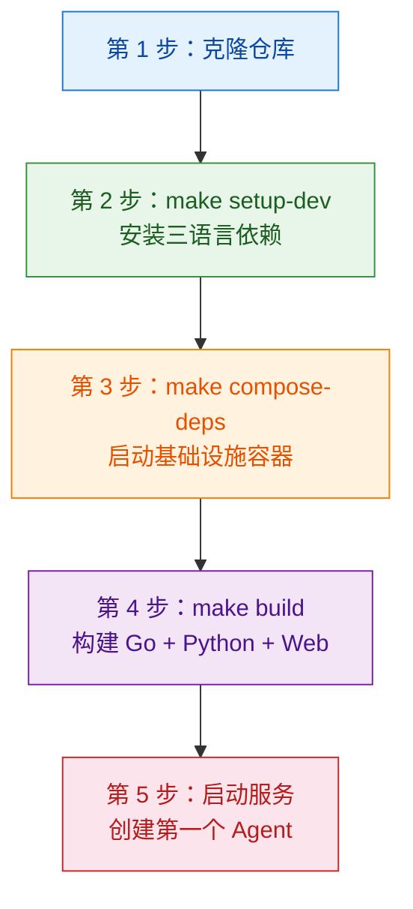

本页将引导你从一台空白开发机出发，逐步搭建完整的 ResolveAgent 本地开发环境。整个流程设计为 **五步到位**——从环境检查、依赖安装、基础设施启动、全量构建，到最终创建并运行你的第一个智能 Agent。无论你是希望快速体验平台能力的新手，还是准备参与代码贡献的开发者，都可以按照本页的路径完成环境搭建。完成本页所有步骤后，你将拥有一个包含 Go 平台服务、Python Agent 运行时、React Web 界面以及四大基础设施组件（PostgreSQL / Redis / NATS / Milvus）的完整本地开发栈。

Sources: [README.md](README.md#L76-L153), [hack/setup-dev.sh](hack/setup-dev.sh#L1-L61)

## 前置条件：你需要准备什么

在开始之前，请确认你的开发机满足以下 **最低版本要求**。这些版本号是代码中实际声明的硬性约束，低于这些版本可能导致编译失败或运行时异常。

| 依赖项 | 最低版本 | 用途 | 推荐安装方式 |
|--------|----------|------|-------------|
| **Go** | ≥ 1.22 | 平台服务编译、CLI 工具构建 | [go.dev/dl](https://go.dev/dl/) |
| **Python** | ≥ 3.11 | Agent 运行时、智能选择器 | [python.org](https://python.org/) |
| **Docker** | ≥ 20.10 | 容器运行时（基础设施依赖） | [Docker Desktop](https://docker.com/) |
| **Docker Compose** | ≥ 2.0 | 多容器编排 | Docker Desktop 自带 |
| **Node.js** | ≥ 20 | Web 前界面（可选） | [nodejs.org](https://nodejs.org/) |

此外，**强烈推荐**安装以下两个加速工具——它们不是硬性依赖，但会显著提升依赖安装速度：

| 推荐工具 | 用途 | 安装方式 |
|---------|------|---------|
| **uv** | Python 依赖管理（替代 pip） | `curl -LsSf https://astral.sh/uv/install.sh \| sh` |
| **pnpm** | Node.js 包管理（替代 npm） | `npm install -g pnpm` |

平台通过 `hack/setup-dev.sh` 脚本在运行时检测这些工具是否存在，优先使用 `uv` 和 `pnpm`，未安装时自动降级到 `pip` 和 `npm`。macOS 用户通过 Docker Desktop 安装 Docker 后，`docker compose` 命令即开即用。

Sources: [hack/setup-dev.sh](hack/setup-dev.sh#L9-L14), [README.md](README.md#L78-L87), [go.mod](go.mod#L3-L3)

## 一键启动：最快路径（适合快速体验）

如果你只是想 **快速跑起来看看效果**，不关心中间步骤的细节，可以使用项目提供的一键启动脚本。该脚本将自动完成环境检查、依赖安装、构建和服务启动的全部流程：

```bash
# 1. 克隆仓库
git clone https://github.com/ai-guru-global/resolve-agent.git
cd resolve-agent

# 2. 配置环境变量（首次需要）
cp .env.example .env
# 编辑 .env，填入至少一个 LLM API Key

# 3. 一键启动全部服务
./scripts/start-local.sh
```

启动成功后，终端会输出所有服务的访问地址和状态。如果遇到问题，运行诊断命令：`./scripts/start-local.sh doctor`。

> ⚠️ **注意**：一键脚本虽然方便，但作为开发者，建议你继续阅读下方的分步指南，理解每一步在做什么——这在排查问题时至关重要。

Sources: [scripts/start-local.sh](scripts/start-local.sh#L1-L16), [scripts/start-local.sh](scripts/start-local.sh#L436-L492)

## 分步搭建：完整开发环境

下面按照五个阶段，详细说明每个步骤的操作和背后的原理。流程图展示了整体搭建路径：



### 第 1 步：克隆仓库

```bash
git clone https://github.com/ai-guru-global/resolve-agent.git
cd resolve-agent
```

克隆完成后，你将看到如下的 **顶层项目结构**，它反映了 ResolveAgent 的三语言架构设计——Go 负责平台服务，Python 负责 Agent 运行时，TypeScript/React 负责 Web 界面：

```
resolve-agent/
├── cmd/                        # Go 入口：平台服务 + CLI
│   ├── resolveagent-server/    #   HTTP/gRPC 服务端
│   └── resolveagent-cli/       #   命令行工具
├── internal/                   # Go 内部包（平台层、运行时层、TUI）
├── pkg/                        # Go 公共库（config、registry、store、gateway...）
├── python/                     # Python Agent 运行时
│   ├── src/resolveagent/       #   运行时源码
│   └── pyproject.toml          #   依赖声明
├── web/                        # React + Vite 前端
│   └── package.json            #   前端依赖声明
├── configs/                    # 配置文件模板
├── deploy/                     # Docker / K8s / Helm 部署文件
├── scripts/                    # 迁移脚本、种子数据、本地启动脚本
├── skills/                     # 内置专家技能模块
├── Makefile                    # 统一构建入口
└── .env.example                # 环境变量模板
```

Sources: [README.md](README.md#L90-L98), [Makefile](Makefile#L14-L21)

### 第 2 步：初始化开发环境

执行 `make setup-dev`，该命令调用 `hack/setup-dev.sh` 脚本，依次完成以下工作：

```bash
make setup-dev
```

脚本内部执行流程如下表所示：

| 阶段 | 命令 | 说明 |
|------|------|------|
| Go 依赖 | `go mod download` | 下载所有 Go 模块到本地缓存 |
| Python 环境 | `cd python && uv sync --extra dev` | 创建 `.venv`，安装运行时 + 开发依赖 |
| Web 前端 | `cd web && pnpm install` | 安装 React、Radix UI、TailwindCSS 等 |
| 本地配置 | `cp configs/resolveagent.yaml ~/.resolveagent/config.yaml` | 创建默认配置文件 |

如果系统没有安装 `uv`，脚本会自动通过 `pip install uv` 安装；同理，如果没有 `pnpm`，会先 `npm install -g pnpm`。这意味着只要你的机器上有 Go、Python 和 Node.js，这个命令就能无障碍跑通。

Sources: [hack/setup-dev.sh](hack/setup-dev.sh#L19-L51), [Makefile](Makefile#L229-L231)

### 第 3 步：启动基础设施容器

ResolveAgent 的平台服务依赖四个基础中间件。项目通过 Docker Compose 编排它们，无需在本地逐一安装：

```bash
make compose-deps
```

该命令实际执行的是 `docker compose -f deploy/docker-compose/docker-compose.deps.yaml up -d`。以下是四个基础设施容器的详细说明：

| 服务 | 镜像 | 本地端口 | 作用 |
|------|------|---------|------|
| **PostgreSQL 16** | `postgres:16-alpine` | `5432` | 主数据库：Agent、Skill、Workflow 等注册表持久化 |
| **Redis 7** | `redis:7-alpine` | `6379` | 缓存 & 会话存储 |
| **NATS JetStream** | `nats:2-alpine` | `4222`（客户端）/ `8222`（监控） | 事件总线：异步消息分发 |
| **Milvus v2.4** | `milvusdb/milvus:v2.4.17` | `19530` | 向量数据库：RAG 语义检索 |

启动后等待约 30 秒让所有容器完成初始化。你可以通过以下命令验证状态：

```bash
# 检查容器运行状态
docker compose -f deploy/docker-compose/docker-compose.deps.yaml ps

# 快速验证 PostgreSQL
docker compose -f deploy/docker-compose/docker-compose.deps.yaml exec -T postgres pg_isready -U resolveagent

# 快速验证 Redis
docker compose -f deploy/docker-compose/docker-compose.deps.yaml exec -T redis redis-cli ping
# 预期返回: PONG
```

PostgreSQL 首次启动时会自动执行 `deploy/docker/init-db.sql`，创建 `resolveagent` schema、所有核心表（agents、skills、workflows、models 等）以及索引和触发器。

Sources: [deploy/docker-compose/docker-compose.deps.yaml](deploy/docker-compose/docker-compose.deps.yaml#L1-L50), [deploy/docker/init-db.sql](deploy/docker/init-db.sql#L1-L171), [Makefile](Makefile#L196-L198)

### 第 4 步：构建所有组件

```bash
make build
```

此命令触发三路并行构建，覆盖项目中的全部三种语言运行时：

| 构建目标 | 产物 | 说明 |
|---------|------|------|
| `build-go` | `bin/resolveagent-server` | Go 平台服务（HTTP + gRPC） |
| `build-go` | `bin/resolveagent-cli` | Go CLI 命令行工具 |
| `build-python` | `python/.venv` 更新 | Python 依赖同步（`uv sync`） |
| `build-web` | `web/dist/` | React 生产构建（`pnpm build`） |

Go 构建会注入版本信息（通过 `-ldflags`），包括 `Version`、`Commit` 和 `BuildDate`，这些值来源于 `VERSION` 文件和 `git describe`。当前版本号为 **0.3.0**。

Sources: [Makefile](Makefile#L51-L67), [VERSION](VERSION#L1-L2)

### 第 5 步：启动服务

你有 **两种方式** 启动完整的开发服务栈。对于日常开发，推荐方式一；对于调试容器化部署，推荐方式二。

#### 方式一：本地进程模式（推荐日常开发）

使用一键脚本以本地进程方式启动所有服务，支持独立重启和实时日志查看：

```bash
# 启动全部（依赖 + 平台 + 运行时 + WebUI）
./scripts/start-local.sh

# 也可以单独启动某个服务
./scripts/start-local.sh platform    # 仅启动 Go 平台服务
./scripts/start-local.sh runtime    # 仅启动 Python Agent 运行时
./scripts/start-local.sh web        # 仅启动 Web 前端开发服务器
```

启动完成后，脚本会输出如下状态总结：

```
════════════════ 启动结果 ════════════════
  ● platform  → localhost:8080
  ● runtime   → localhost:9091
  ● webui     → localhost:3000
══════════════════════════════════════════
  ✔ 全部服务已就绪！

  WebUI      → http://localhost:3000
  Platform   → http://localhost:8080
  Runtime    → http://localhost:9091
  PostgreSQL → localhost:5432
  Redis      → localhost:6379
```

如果任何服务未正常启动，运行诊断命令：

```bash
./scripts/start-local.sh doctor
```

`doctor` 子命令会逐一检查 Docker、Go、Node.js、Python 虚拟环境、端口冲突、`.env` 配置和 LLM API Key 状态，并尝试自动修复可修复的问题。

Sources: [scripts/start-local.sh](scripts/start-local.sh#L436-L492), [scripts/start-local.sh](scripts/start-local.sh#L628-L749)

#### 方式二：Docker Compose 模式

```bash
# 启动完整生产级容器栈（包含应用 + 基础设施）
make compose-up

# 或使用开发模式（挂载源码，支持热重载）
docker compose \
  -f deploy/docker-compose/docker-compose.yaml \
  -f deploy/docker-compose/docker-compose.dev.yaml \
  up -d
```

开发模式的关键区别是：源码目录被挂载到容器内，Go 服务通过 `go run` 启动，Python 运行时通过 `uv run` 启动，WebUI 挂载 `src/` 目录实现 Vite HMR 热更新。

Sources: [deploy/docker-compose/docker-compose.yaml](deploy/docker-compose/docker-compose.yaml#L1-L38), [deploy/docker-compose/docker-compose.dev.yaml](deploy/docker-compose/docker-compose.dev.yaml#L1-L44), [Makefile](Makefile#L188-L190)

## 服务访问地址总览

无论使用哪种启动方式，服务启动后的访问点如下：

| 服务 | 地址 | 说明 |
|------|------|------|
| **Web 界面** | `http://localhost:3000` | React 管理面板，Vite 开发服务器 |
| **平台 HTTP API** | `http://localhost:8080` | RESTful API，前端通过 `/api` 前缀代理 |
| **平台 gRPC** | `localhost:9090` | gRPC 服务端（服务间通信） |
| **Agent 运行时** | `localhost:9091` | Python gRPC 运行时 |
| **PostgreSQL** | `localhost:5432` | 数据库（用户: `resolveagent`，密码: `resolveagent`） |
| **Redis** | `localhost:6379` | 缓存服务 |
| **NATS** | `localhost:4222` | 消息总线 |
| **Milvus** | `localhost:19530` | 向量数据库 |

Vite 开发服务器配置了 API 代理：所有 `/api` 请求自动转发到 `http://localhost:8080`，因此前端开发时无需关心跨域问题。

Sources: [web/vite.config.ts](web/vite.config.ts#L1-L22), [configs/resolveagent.yaml](configs/resolveagent.yaml#L5-L8)

## 配置 LLM API Key

要让 Agent 能够实际执行推理，你需要至少配置 **一个大模型的 API Key**。ResolveAgent 原生支持以下国产大模型：

| 提供商 | 模型 ID（部分） | API Key 获取地址 |
|--------|----------------|-----------------|
| 通义千问 | `qwen-turbo`, `qwen-plus`, `qwen-max` | [dashscope.aliyun.com](https://dashscope.aliyun.com) |
| 文心一言 | `ernie-4.0-8k` | [cloud.baidu.com](https://cloud.baidu.com) |
| 智谱清言 | `glm-4` | [open.bigmodel.cn](https://open.bigmodel.cn) |
| Moonshot (Kimi) | `moonshot-v1-8k`, `moonshot-v1-128k` | [platform.moonshot.cn](https://platform.moonshot.cn) |

配置方式有两种：

**方式一：环境变量（推荐）**

编辑项目根目录的 `.env` 文件（从 `.env.example` 复制而来）：

```bash
# 至少配置一个即可
RESOLVEAGENT_LLM_QWEN_API_KEY=sk-your-qwen-key-here
# RESOLVEAGENT_LLM_WENXIN_API_KEY=
# RESOLVEAGENT_LLM_ZHIPU_API_KEY=
```

**方式二：配置文件**

```bash
mkdir -p ~/.resolveagent
cp configs/resolveagent.yaml ~/.resolveagent/config.yaml
# 编辑 config.yaml 中的 gateway.model_routing 部分
```

模型注册表定义在 `configs/models.yaml` 中，包含所有支持的模型及其参数（最大 token 数、默认温度等）。

Sources: [.env.example](.env.example#L49-L53), [configs/models.yaml](configs/models.yaml#L1-L52), [configs/resolveagent.yaml](configs/resolveagent.yaml#L40-L44)

## 创建你的第一个 Agent

环境就绪后，使用 CLI 工具创建并运行一个智能 Agent：

```bash
# 创建 Agent
./bin/resolveagent-cli agent create my-first-agent \
  --type mega \
  --model qwen-plus \
  --description "我的第一个 ResolveAgent"

# 查看已创建的 Agent 列表
./bin/resolveagent-cli agent list

# 启动交互式对话
./bin/resolveagent-cli agent run my-first-agent
```

交互式运行后，你可以在终端中直接与 Agent 对话。MegaAgent 类型会自动通过智能选择器（Intelligent Selector）路由你的请求到最合适的处理路径——可能是调用某个专家技能、触发 FTA 工作流、或者检索 RAG 知识库。

Sources: [README.md](README.md#L127-L140), [configs/examples/agent-example.yaml](configs/examples/agent-example.yaml#L1-L18)

## 常用开发命令速查

以下命令覆盖日常开发中最常见的操作场景：

| 场景 | 命令 |
|------|------|
| 设置开发环境 | `make setup-dev` |
| 构建全部 | `make build` |
| 仅构建 Go | `make build-go` |
| 启动基础设施 | `make compose-deps` |
| 启动全部容器 | `make compose-up` |
| 停止全部容器 | `make compose-down` |
| 运行全部测试 | `make test` |
| 仅运行 Go 测试 | `make test-go` |
| 运行端到端测试 | `make test-e2e` |
| 代码检查 | `make lint` |
| 代码格式化 | `make fmt` |
| 生成 Protobuf | `make proto` |
| 清理构建产物 | `make clean` |
| 本地一键启动 | `./scripts/start-local.sh` |
| 环境诊断 | `./scripts/start-local.sh doctor` |
| 查看服务状态 | `./scripts/start-local.sh status` |
| 查看日志 | `./scripts/start-local.sh logs platform` |

Sources: [Makefile](Makefile#L38-L261), [scripts/start-local.sh](scripts/start-local.sh#L755-L773)

## 故障排查指南

以下是新手在搭建环境时最常遇到的问题及其解决方案：

| 问题 | 原因 | 解决方案 |
|------|------|---------|
| `make setup-dev` 失败 | Go / Python / Node 版本过低 | 检查版本：`go version`、`python3 --version`、`node --version` |
| Docker 容器启动失败 | Docker Desktop 未运行 | 启动 Docker Desktop 后重试 `make compose-deps` |
| 端口 8080 被占用 | 其他进程占用 | `lsof -ti TCP:8080` 查看占用进程，或修改 `.env` 中的端口 |
| Agent 对话无响应 | 未配置 LLM API Key | 编辑 `.env`，至少填入一个有效的 API Key |
| Python 运行时启动失败 | 虚拟环境依赖不完整 | `cd python && uv sync --extra dev` 重建环境 |
| 数据库连接失败 | PostgreSQL 未就绪 | 等待 30 秒后重试，或检查容器状态 |
| WebUI 白屏 | 平台服务未启动 | 确保 `http://localhost:8080/api/v1/health` 可访问 |

如果以上方案不能解决你的问题，运行完整的诊断命令获取详细报告：

```bash
./scripts/start-local.sh doctor
```

Sources: [scripts/start-local.sh](scripts/start-local.sh#L628-L749), [docs/user-guide/quickstart.md](docs/user-guide/quickstart.md#L253-L280)

## 下一步

恭喜你完成了本地开发环境的搭建！接下来，推荐按以下顺序深入学习 ResolveAgent 的核心能力：

1. **[CLI 命令行工具使用指南](3-cli-ming-ling-xing-gong-ju-shi-yong-zhi-nan)** — 掌握 `resolveagent` CLI 的全部子命令和参数，高效管理 Agent、Skill 和 Workflow
2. **[整体架构设计：三层微服务与双语言运行时](4-zheng-ti-jia-gou-she-ji-san-ceng-wei-fu-wu-yu-shuang-yu-yan-yun-xing-shi)** — 理解你刚刚启动的每个服务在整个系统中的角色和协作方式
3. **[智能路由决策引擎：意图分析与三阶段处理流程](8-zhi-neng-lu-you-jue-ce-yin-qing-yi-tu-fen-xi-yu-san-jie-duan-chu-li-liu-cheng)** — 深入了解 Agent 如何将你的自然语言请求路由到正确的处理路径