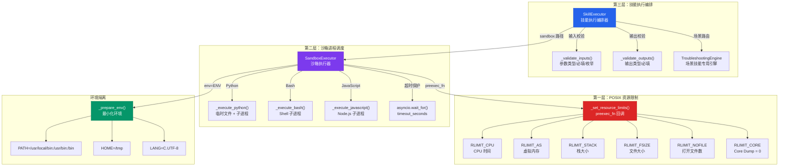
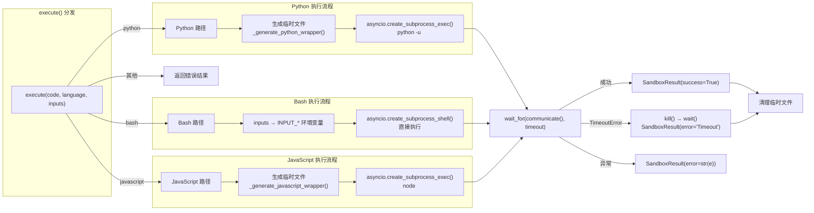
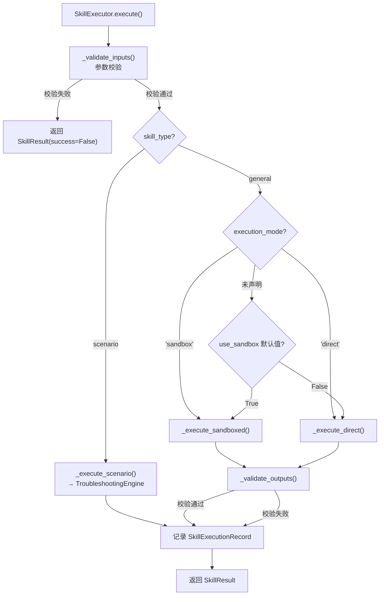

ResolveAgent 的技能系统面临一个核心安全挑战：**不可信代码必须在受控环境中执行**。沙箱执行器（Sandbox Executor）正是为解决这一问题而设计的核心子系统——它通过进程隔离、POSIX 资源配额、最小化环境变量和超时保护，为通用技能（general）和场景技能（scenario）提供了一道纵深防御的执行安全屏障。本文将深入剖析沙箱执行器的三层架构：底层资源限制引擎、中层进程隔离调度器、以及上层技能执行编排器，揭示每一层的设计权衡与实现细节。

Sources: [sandbox.py](python/src/resolveagent/skills/sandbox.py#L1-L5), [executor.py](python/src/resolveagent/skills/executor.py#L1-L11)

## 架构全景：三层隔离模型

在深入实现细节之前，先建立沙箱执行器的整体架构认知。系统采用**三层隔离模型**——每一层承担不同的安全职责，形成纵深防御体系：



三层职责清晰分离：**第一层**（POSIX 资源限制）在子进程 fork 后、exec 前通过 `preexec_fn` 回调设定硬性配额；**第二层**（沙箱进程调度）管理子进程生命周期，处理超时、输出收集和清理；**第三层**（技能执行编排器）负责输入输出校验、执行模式选择和历史记录。

Sources: [sandbox.py](python/src/resolveagent/skills/sandbox.py#L63-L73), [executor.py](python/src/resolveagent/skills/executor.py#L20-L34)

## 核心数据模型

沙箱执行器围绕两个关键数据模型构建——`SandboxConfig` 定义约束边界，`SandboxResult` 封装执行结果。

### SandboxConfig：约束配置

```python
@dataclass
class SandboxConfig:
    timeout_seconds: float = 30.0     # 总挂钟时间限制
    cpu_time_limit: float = 10.0      # CPU 时间限制（秒）
    max_memory_mb: int = 512          # 最大虚拟内存（MB）
    max_stack_mb: int = 8             # 最大栈大小（MB）
    max_file_size_mb: int = 10        # 最大文件大小（MB）
    max_open_files: int = 64          # 最大打开文件描述符数
    allow_network: bool = False       # 是否允许网络访问
    allowed_env_vars: list[str] | None = None   # 白名单环境变量
    extra_env_vars: dict[str, str] | None = None # 额外注入的环境变量
```

这个配置模型体现了**最小权限原则**——所有默认值都趋向保守。值得注意的是 `timeout_seconds`（30s）与 `cpu_time_limit`（10s）之间的区别：前者是挂钟时间（wall-clock time），涵盖 I/O 等待；后者是纯 CPU 时间，由内核强制执行。这种双时间限制设计能有效防止两种不同类型的资源滥用——死循环（被 CPU 时间限制截断）和网络阻塞（被总超时截断）。

Sources: [sandbox.py](python/src/resolveagent/skills/sandbox.py#L26-L48)

### SandboxResult：执行结果

| 字段 | 类型 | 含义 |
|------|------|------|
| `success` | `bool` | 执行是否成功（returncode == 0） |
| `stdout` | `str` | 标准输出（UTF-8 解码，errors="replace"） |
| `stderr` | `str` | 标准错误输出 |
| `return_code` | `int` | 进程退出码（超时或异常时为 -1） |
| `execution_time_ms` | `float` | 实际执行耗时（毫秒） |
| `memory_usage_mb` | `float` | 内存使用量（预留字段，当前为 0） |
| `error` | `str \| None` | 结构化错误信息 |

Sources: [sandbox.py](python/src/resolveagent/skills/sandbox.py#L50-L61)

## 第一层：POSIX 资源限制引擎

资源限制的实现依赖于 Python 标准库的 `resource` 模块，通过 POSIX `setrlimit(2)` 系统调用在子进程内部设定配额。关键在于执行时机——`preexec_fn` 参数使得这些限制在 `fork()` 之后、`exec()` 之前生效，确保无论子进程执行什么代码，限制都已被内核强制执行。

```python
def _set_resource_limits(self) -> None:
    """在子进程中设置资源限制（preexec_fn 回调）。"""
    # CPU 时间限制（soft=10s, hard=11s）
    resource.setrlimit(
        resource.RLIMIT_CPU,
        (int(self.config.cpu_time_limit), int(self.config.cpu_time_limit) + 1),
    )
    # 虚拟内存限制
    max_memory_bytes = self.config.max_memory_mb * 1024 * 1024
    resource.setrlimit(resource.RLIMIT_AS, (max_memory_bytes, max_memory_bytes))
    # 栈大小限制
    max_stack_bytes = self.config.max_stack_mb * 1024 * 1024
    resource.setrlimit(resource.RLIMIT_STACK, (max_stack_bytes, max_stack_bytes))
    # 文件大小限制
    max_file_bytes = self.config.max_file_size_mb * 1024 * 1024
    resource.setrlimit(resource.RLIMIT_FSIZE, (max_file_bytes, max_file_bytes))
    # 打开文件数限制
    resource.setrlimit(
        resource.RLIMIT_NOFILE,
        (self.config.max_open_files, self.config.max_open_files),
    )
    # 禁止 Core Dump
    resource.setrlimit(resource.RLIMIT_CORE, (0, 0))
```

### 六项资源限制详解

| 限制项 | POSIX 常量 | 默认值 | 安全语义 |
|--------|-----------|--------|----------|
| **CPU 时间** | `RLIMIT_CPU` | 10s（soft）+ 11s（hard） | 超过 soft limit 触发 `SIGXCPU`，超过 hard limit 触发 `SIGKILL` |
| **虚拟内存** | `RLIMIT_AS` | 512 MB | 限制进程的虚拟地址空间，防止内存炸弹 |
| **栈大小** | `RLIMIT_STACK` | 8 MB | 防止递归深度攻击 |
| **文件大小** | `RLIMIT_FSIZE` | 10 MB | 限制可创建文件的大小 |
| **打开文件数** | `RLIMIT_NOFILE` | 64 | 防止文件描述符耗尽攻击 |
| **Core Dump** | `RLIMIT_CORE` | 0（禁止） | 阻止敏感信息通过 core dump 泄露 |

CPU 时间的 soft/hard 差值为 1 秒，这是一个精心设计的缓冲区：soft limit 触发 `SIGXCPU` 信号（可捕获），给进程 1 秒的优雅退出窗口；如果进程仍不退出，hard limit 触发不可捕获的 `SIGKILL`。

Sources: [sandbox.py](python/src/resolveagent/skills/sandbox.py#L333-L364)

## 第二层：沙箱进程调度

`SandboxExecutor` 是沙箱的核心调度器，管理子进程的完整生命周期。它支持三种语言的代码执行，每种语言的执行策略略有不同。

### 多语言执行路径



**Python 执行**采用包装器模式：将用户代码包裹在一段预置代码中，通过 `json.loads()` 注入输入参数到全局命名空间，然后执行用户代码。临时文件使用 `delete=False` 创建，在 `finally` 块中通过 `os.unlink()` 清理。

**Bash 执行**是最直接的路径：通过 `asyncio.create_subprocess_shell()` 直接执行代码字符串，输入参数通过 `INPUT_*` 前缀的环境变量传递。注意 Bash 路径使用 `create_subprocess_shell`（而非 `create_subprocess_exec`），这意味着代码字符串会经过 shell 解释——这与 Bash 的执行语义一致，但也要求输入经过严格消毒。

**JavaScript 执行**使用 Node.js 运行时，通过临时 `.js` 文件执行。包装器将输入作为 `const inputs` 注入。如果系统未安装 Node.js，会返回 `"Node.js not found"` 错误而非抛出异常。

Sources: [sandbox.py](python/src/resolveagent/skills/sandbox.py#L83-L114), [sandbox.py](python/src/resolveagent/skills/sandbox.py#L116-L196), [sandbox.py](python/src/resolveagent/skills/sandbox.py#L198-L260), [sandbox.py](python/src/resolveagent/skills/sandbox.py#L262-L331)

### 环境隔离机制

`_prepare_env()` 方法构建了一个**最小化的子进程环境**，这是进程级安全的另一道关键屏障：

```python
def _prepare_env(self) -> dict[str, str]:
    if self.config.allowed_env_vars is None:
        # 默认：最小环境
        env = {
            "PATH": "/usr/local/bin:/usr/bin:/bin",
            "HOME": "/tmp",
            "LANG": "C.UTF-8",
        }
    else:
        env = {k: v for k, v in os.environ.items() if k in self.config.allowed_env_vars}
    if self.config.extra_env_vars:
        env.update(self.config.extra_env_vars)
    return env
```

当 `allowed_env_vars` 为 `None` 时，子进程只能看到三个环境变量——这是一个**显式拒绝**策略：不继承父进程的任何环境变量，包括 `USER`、`HOME`（设为 `/tmp`）、`SHELL` 等。这防止了通过环境变量泄露敏感信息（如数据库连接串、API 密钥）。当 `allowed_env_vars` 被显式设置时，策略切换为**白名单**模式——仅允许列出的变量从父环境继承。

Sources: [sandbox.py](python/src/resolveagent/skills/sandbox.py#L366-L382)

### 代码包装器

Python 包装器通过 JSON 序列化注入输入参数，将它们注册为全局变量：

```python
def _generate_python_wrapper(self, code: str, inputs: dict[str, Any] | None = None) -> str:
    inputs_json = json.dumps(inputs or {})
    wrapper = f"""
import json
import sys

_inputs = json.loads({repr(inputs_json)})
for _key, _value in _inputs.items():
    globals()[_key] = _value

{code}
"""
    return wrapper
```

JavaScript 包装器采用类似策略，将输入序列化为 `const inputs` 对象。这种设计意味着技能代码可以直接按名称引用输入参数（Python 路径）或通过 `inputs` 对象访问（JavaScript 路径）。

Sources: [sandbox.py](python/src/resolveagent/skills/sandbox.py#L384-L423)

## 第三层：技能执行编排器

`SkillExecutor` 是沙箱执行器的上层编排器，它封装了完整的技能执行生命周期——从输入校验到输出验证，从执行模式选择到历史记录。

### 执行模式选择

`SkillExecutor` 根据三个因素决定是否使用沙箱：

| 决策因素 | 优先级 | 说明 |
|----------|--------|------|
| `use_sandbox` 参数覆盖 | 最高 | 单次调用级别的显式控制 |
| `manifest.execution_mode` | 中 | 清单声明的执行模式（`"sandbox"` 或 `"direct"`） |
| 构造器默认值 `use_sandbox` | 最低 | 全局默认策略 |

决策流程如下：如果清单声明 `execution_mode == "sandbox"`，强制使用沙箱；如果声明 `"direct"`，绕过沙箱；否则使用构造器默认值或调用时覆盖值。



Sources: [executor.py](python/src/resolveagent/skills/executor.py#L52-L147)

### 输入输出校验

`_validate_inputs()` 和 `_validate_outputs()` 分别对清单中声明的参数模式执行类型校验、必填校验和枚举校验。校验逻辑覆盖六种 JSON Schema 类型：

| 参数类型 | Python 校验 | 示例 |
|---------|-------------|------|
| `string` | `isinstance(value, str)` | `"hello"` |
| `integer` | `isinstance(value, int)` | `42` |
| `number` | `isinstance(value, (int, float))` | `3.14` |
| `boolean` | `isinstance(value, bool)` | `True` |
| `array` | `isinstance(value, list)` | `[1, 2, 3]` |
| `object` | `isinstance(value, dict)` | `{"key": "val"}` |

对于未知参数（未在清单中声明的输入），系统不拒绝但会发出警告日志——这是一个**宽松输入、严格校验**的设计，在安全性和灵活性之间取得平衡。

Sources: [executor.py](python/src/resolveagent/skills/executor.py#L149-L201), [executor.py](python/src/resolveagent/skills/executor.py#L204-L244)

### 沙箱执行路径

当技能进入沙箱路径时，`_execute_sandboxed()` 方法执行以下流程：

1. **定位入口文件**：根据 `skill.entry_module` 解析 Python 文件路径（支持点分模块路径和直接文件名）
2. **读取代码**：将入口文件的全部源代码读入内存
3. **沙箱执行**：调用 `SandboxExecutor.execute(code, language="python", inputs=inputs)`
4. **解析输出**：尝试将 stdout 解析为 JSON；解析失败时将原始 stdout 作为 `{"result": ...}` 封装

```python
async def _execute_sandboxed(self, skill: LoadedSkill, inputs: dict[str, Any]) -> SkillResult:
    entry_file = skill.directory / f"{skill.entry_module.replace('.', '/')}.py"
    # ...文件定位逻辑...
    code = entry_file.read_text()
    sandbox_result: SandboxResult = await self._sandbox.execute(
        code=code, language="python", inputs=inputs,
    )
    outputs = {}
    if sandbox_result.success:
        try:
            stdout = sandbox_result.stdout.strip()
            if stdout:
                outputs = json.loads(stdout)
        except json.JSONDecodeError:
            outputs = {"result": sandbox_result.stdout}
    return SkillResult(
        outputs=outputs,
        success=sandbox_result.success,
        error=sandbox_result.error or sandbox_result.stderr,
        logs=sandbox_result.stdout,
        duration_ms=int(sandbox_result.execution_time_ms),
    )
```

Sources: [executor.py](python/src/resolveagent/skills/executor.py#L321-L374)

### 直接执行路径

直接执行路径跳过沙箱，通过 `importlib` 动态加载技能模块并调用入口函数。此路径适用于受信任的内置技能，且支持异步函数自动检测：

```python
async def _execute_direct(self, skill: LoadedSkill, inputs: dict[str, Any]) -> SkillResult:
    callable_fn = skill.get_callable()
    result = callable_fn(**inputs)
    if asyncio.iscoroutine(result):
        result = await result
    # ...结果规范化...
```

Sources: [executor.py](python/src/resolveagent/skills/executor.py#L275-L319)

### 执行历史与统计

`SkillExecutor` 维护一个滑动窗口执行历史（最近 1000 条），通过 `get_execution_stats()` 提供聚合统计：

```python
def get_execution_stats(self) -> dict[str, Any]:
    return {
        "total_executions": total,
        "success_rate": successful / total,
        "average_duration_ms": avg_duration,
    }
```

这一机制为运行时监控和自适应策略提供了数据基础——例如，当某个技能的成功率持续低于阈值时，可以触发告警或自动降级。

Sources: [executor.py](python/src/resolveagent/skills/executor.py#L376-L397), [executor.py](python/src/resolveagent/skills/executor.py#L449-L477)

## 权限模型：SandboxConfig 与 SkillPermissions 的双轨体系

沙箱执行器的约束来自两条配置轨道，二者协同工作但粒度不同：

| 维度 | `SandboxConfig` | `SkillPermissions` |
|------|-----------------|-------------------|
| **定义位置** | Python 代码（dataclass） | YAML 清单（Pydantic 模型） |
| **作用层级** | 沙箱进程级 | 技能声明级 |
| **CPU 限制** | `cpu_time_limit` = 10s | `max_cpu_seconds` = 30s |
| **内存限制** | `max_memory_mb` = 512MB | `max_memory_mb` = 256MB |
| **超时** | `timeout_seconds` = 30s | `timeout_seconds` = 60s |
| **网络控制** | `allow_network` = False | `network_access` = False |
| **文件系统** | `max_file_size_mb` + `max_open_files` | `file_system_read` + `file_system_write` |
| **主机白名单** | 不支持 | `allowed_hosts` = [] |

`SkillPermissions` 在清单中声明技能所需的**最小权限集**，而 `SandboxConfig` 定义实际的**执行环境约束**。理想情况下，`SandboxConfig` 的限制应该严格于或等于 `SkillPermissions` 声明的需求——例如，如果清单声明 `network_access: true`，但 `SandboxConfig` 设定 `allow_network: false`，则网络访问实际被阻断。

Sources: [sandbox.py](python/src/resolveagent/skills/sandbox.py#L26-L48), [manifest.py](python/src/resolveagent/skills/manifest.py#L28-L38)

## SecureSandbox：增强安全层

`SecureSandbox` 继承自 `SandboxExecutor`，预留了更高级的 Linux 专用安全机制：

```python
class SecureSandbox(SandboxExecutor):
    """扩展沙箱，附加安全措施：
    - 文件系统隔离
    - 网络命名空间隔离
    - Seccomp-bpf 系统调用过滤
    """

    async def execute(self, code, language, inputs):
        # 当前委托给基础沙箱
        # 完整实现将使用 Docker 或 Firecracker
        return await super().execute(code, language, inputs)
```

代码注释明确指出了演进路径：**Docker 容器隔离**或 **Firecracker microVM**。这两种方案分别提供了不同级别的隔离强度——Docker 使用 Linux cgroup + namespace 实现轻量级容器隔离；Firecracker 则提供基于 KVM 的微型虚拟机隔离，具有独立的内核，安全性更高但启动延迟更大。当前实现保持为占位符，确保 API 兼容性的同时为未来升级预留扩展点。

Sources: [sandbox.py](python/src/resolveagent/skills/sandbox.py#L426-L449)

## 内置技能的沙箱配置差异

三个内置代码执行技能针对各自的使用场景采用了不同的 `SandboxConfig` 配置：

| 技能 | 超时 | 内存 | 网络访问 | 适用场景 |
|------|------|------|---------|---------|
| `CodeExecutionSkill` | 30s | 512MB | ❌ | 通用代码执行 |
| `PythonCodeSkill` | 30s | 512MB | ❌ | Python 函数调用 |
| `BashSkill` | **10s** | **256MB** | ❌ | Shell 命令执行 |

BashSkill 的限制更为严格（超时减半、内存减半），反映了 Shell 命令的执行特征——通常是短生命周期的系统命令，不需要大量内存。这种**差异化配置**的设计体现了安全工程中"按需授权"的原则。

Sources: [code_exec.py](python/src/resolveagent/skills/builtin/code_exec.py#L16-L43), [code_exec.py](python/src/resolveagent/skills/builtin/code_exec.py#L157-L167), [code_exec.py](python/src/resolveagent/skills/builtin/code_exec.py#L222-L232)

## 平台约束与设计权衡

### POSIX 限制的局限性

当前的 `resource.setrlimit()` 方案存在已知的平台约束：

| 限制 | 说明 |
|------|------|
| **macOS 兼容性** | macOS 对部分 `RLIMIT_*` 支持不完整，`RLIMIT_AS` 可能被忽略 |
| **网络隔离** | `allow_network` 字段存在但**未被实际强制**——需要配合 iptables / network namespace |
| **文件系统隔离** | 无 chroot / pivot_root——子进程理论上可以遍历整个文件系统 |
| **内存追踪** | `SandboxResult.memory_usage_mb` 当前始终为 0，需要通过 `procfs` 或 `cgroup` 实现 |

### preexec_fn 的风险

`preexec_fn` 在 `asyncio.create_subprocess_exec` 中使用时存在一个重要注意事项：在 Python 3.12+ 中，`asyncio` 的子进程创建使用 `multiprocessing` 的 `fork-exec` 模式，而 `preexec_fn` 中的回调函数在 fork 后的子进程中执行——这意味着如果父进程持有锁（包括 logging 锁），可能导致死锁。当前实现通过在 `_set_resource_limits` 中使用 try/except 包裹来缓解这一问题。

Sources: [sandbox.py](python/src/resolveagent/skills/sandbox.py#L333-L365), [sandbox.py](python/src/resolveagent/skills/sandbox.py#L165-L166)

## 与系统其他模块的协作

沙箱执行器并非孤立运行，它在 ResolveAgent 的多个子系统间建立协作关系：

- **与 [技能清单规范](18-ji-neng-qing-dan-gui-fan-sheng-ming-shi-shu-ru-shu-chu-yu-quan-xian-mo-xing) 的协作**：`SkillManifest.permissions` 声明技能的权限需求，`SkillExecutor` 据此决定是否启用沙箱
- **与 [技能类型体系](19-ji-neng-lei-xing-ti-xi-tong-yong-ji-neng-general-yu-chang-jing-ji-neng-scenario) 的协作**：`scenario` 类型技能自动路由到 `TroubleshootingEngine`，该引擎在执行命令步骤时也使用沙箱执行器（见 `_execute_command` 占位符）
- **与 [Agent 运行时层](6-python-agent-yun-xing-shi-ceng-zhi-xing-yin-qing-yu-sheng-ming-zhou-qi-guan-li) 的协作**：`ExecutionEngine` 通过 `MegaAgent` 间接调度技能执行，沙箱对运行时层透明
- **与 [可观测性系统](31-ke-guan-ce-xing-opentelemetry-zhi-biao-ri-zhi-yu-lian-lu-zhui-zong) 的协作**：`SkillExecutionRecord` 为 OpenTelemetry 提供执行追踪数据

Sources: [troubleshoot.py](python/src/resolveagent/skills/troubleshoot.py#L237-L251), [engine.py](python/src/resolveagent/runtime/engine.py#L1-L12)

---

**阅读导航**：本文聚焦于沙箱执行器的资源隔离与安全约束机制。要了解技能如何被声明和发现，请参阅 [技能清单规范：声明式输入输出与权限模型](18-ji-neng-qing-dan-gui-fan-sheng-ming-shi-shu-ru-shu-chu-yu-quan-xian-mo-xing)；要了解技能的分类体系，请参阅 [技能类型体系：通用技能与场景技能](19-ji-neng-lei-xing-ti-xi-tong-yong-ji-neng-general-yu-chang-jing-ji-neng-scenario)；要了解技能如何被导入系统，请参阅 [语料库导入与技能发现：Kudig 技能导入流程](21-yu-liao-ku-dao-ru-yu-ji-neng-fa-xian-kudig-ji-neng-dao-ru-liu-cheng)。