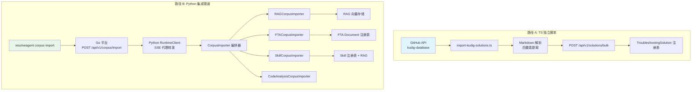
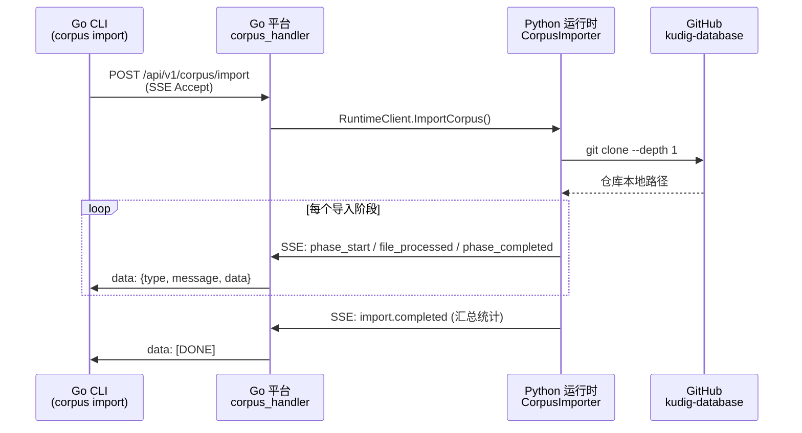

**语料库导入**（Corpus Import）是 ResolveAgent 从外部知识仓库批量摄取结构化排查知识、故障树文档和技能定义的核心机制。本文聚焦于 **Kudig**（Kubernetes Universal Diagnostic Guide）语料库的导入流程——它是一套从 `kudig-io/kudig-database` GitHub 仓库获取 Kubernetes 排查语料、解析 Markdown 文档、并将其转化为系统可用的 **解决方案（Solutions）**、**技能（Skills）** 和 **RAG 向量知识**的完整管道。这一流程横跨 Go 平台层与 Python 运行时层，涉及两套互补的导入工具链：一套是独立运行的 TypeScript 批量导入脚本，另一套是集成到 CLI 与 SSE 流式架构中的 Python 管道。

Sources: [import-kudig-solutions.ts](scripts/import-kudig-solutions.ts#L1-L11), [corpus.go](internal/cli/corpus/corpus.go#L1-L22), [importer.py](python/src/resolveagent/corpus/importer.py#L1-L50)

---

## Kudig 数据源架构

Kudig 语料库托管于 GitHub 仓库 `kudig-io/kudig-database`，其内部按主题目录组织为多个知识域。ResolveAgent 的导入管道识别并处理以下关键子目录结构：

| 目录模式 | 内容类型 | 导入目标 | 分块策略 |
|---|---|---|---|
| `domain-*/**/*.md` | 领域知识文档（SRE 知识库） | RAG 向量集合 | `by_h2`（按二级标题分块，2000 字符） |
| `topic-fta/list/*.md` | 故障树分析文档 | FTA Document 注册 + RAG | `by_h3`（按三级标题分块，1500 字符） |
| `topic-skills/*.md` | 场景化排查技能（Runbook） | Skill 注册 + RAG | `by_section`（按章节分块，3000 字符） |
| `topic-structural-trouble-shooting/` | 结构化排查方案（四要素） | Solution 批量导入 | 四要素提取（现象/信息/排查/方案） |
| `topic-cheat-sheet/` | 快速参考手册 | RAG 向量集合 | `sentence`（50000 字符全文档） |
| `topic-dictionary/` | 术语字典 | RAG 向量集合 | `sentence`（500 字符短句） |

其中 **结构化排查方案**（`topic-structural-trouble-shooting/`）按照 Kubernetes 组件域组织为 12 个子目录——从 `01-control-plane`（控制平面）到 `12-monitoring-observability`（监控可观测性），每个子目录包含针对特定故障场景的 Markdown 文档。

Sources: [import-kudig-solutions.ts](scripts/import-kudig-solutions.ts#L43-L47), [config.py](python/src/resolveagent/corpus/config.py#L15-L21), [importer.py](python/src/resolveagent/corpus/importer.py#L199-L231)

---

## 两套导入工具链概览

ResolveAgent 提供了两条导入路径，分别服务于不同的使用场景：

**路径 A：TypeScript 独立脚本**（`scripts/import-kudig-solutions.ts`）——直接从 GitHub API 拉取 `topic-structural-trouble-shooting` 目录中的 Markdown 文件，解析出四要素结构化方案，通过 `POST /api/v1/solutions/bulk` 批量写入 Go 平台的 Solution 注册表。适用于快速导入排查方案数据。

**路径 B：Python 集成管道**（CLI → Go 平台 → Python 运行时）——通过 `resolveagent corpus import` CLI 命令触发，经 SSE 流式传输逐文件报告进度，支持 RAG、FTA、Skills、Code Analysis 四种导入类型的组合选择。适用于完整的语料库初始化。



Sources: [import-kudig-solutions.ts](scripts/import-kudig-solutions.ts#L1-L11), [import.go](internal/cli/corpus/import.go#L33-L73), [corpus_handler.go](pkg/server/corpus_handler.go#L10-L13), [importer.py](python/src/resolveagent/corpus/importer.py#L74-L188)

---

## 路径 A：TypeScript 结构化方案导入

### 四要素解析模型

TypeScript 脚本的核心任务是：将 Markdown 排查文档解析为 **四要素结构化方案**（`ParsedSolution`），即 **问题现象**、**关键信息**、**排查步骤**、**解决方案** 四个核心段落。脚本通过正则表达式匹配 Markdown 标题来识别这四个段落：

| 要素字段 | 匹配的中文标题关键词 | 匹配的英文标题关键词 |
|---|---|---|
| `problem_symptoms` | 问题现象、故障现象、症状、问题表现、影响分析 | Quick Diagnosis |
| `key_information` | 关键信息、诊断信息、日志、核心信息、信息采集 | — |
| `troubleshooting_steps` | 排查步骤、诊断步骤、排查流程、故障排查 | Troubleshoot |
| `resolution_steps` | 解决方案、修复步骤、修复方法、处置、风险控制 | — |

解析策略采用**标题层级感知**的模式——`matchSection()` 函数在匹配到目标标题后，会继续收集该标题下所有更深层级的子章节内容，直到遇到同级或更高级别的标题为止。如果四个段落中某些未找到匹配标题，则回退到截取全文前 2000 字符作为 `problem_symptoms`。

Sources: [import-kudig-solutions.ts](scripts/import-kudig-solutions.ts#L24-L37), [import-kudig-solutions.ts](scripts/import-kudig-solutions.ts#L52-L63), [import-kudig-solutions.ts](scripts/import-kudig-solutions.ts#L230-L245)

### 自动派生元数据

除四要素外，脚本还会从文件路径和目录结构自动派生以下元数据：

- **`component`**：从文件名中提取，例如 `01-pod-troubleshooting` → `pod`，移除数字前缀和 `-troubleshooting`/`-guide` 后缀
- **`tags`**：基于父目录名称映射到预定义标签集，例如 `01-control-plane` → `['k8s', 'api-server', 'control-plane']`，`03-networking` → `['k8s', 'coredns', 'networking']`
- **`severity`**：`01-control-plane` 目录下的文档自动标记为 `high`，其余为 `medium`
- **`search_keywords`**：从标题、组件名和标签中提取去重后的关键词集合

Sources: [import-kudig-solutions.ts](scripts/import-kudig-solutions.ts#L261-L296), [import-kudig-solutions.ts](scripts/import-kudig-solutions.ts#L298-L332)

### 文件发现与批量导入

脚本的执行流程分为三个阶段：

1. **发现阶段**（Discovery）：调用 GitHub Contents API 枚举 `topic-structural-trouble-shooting/` 下的所有子目录，过滤出非 `README.md` 的 `.md` 文件，构建包含 `path`、`dirName`、`fileName`、`rawUrl` 的文件清单
2. **解析阶段**（Parse）：逐文件下载原始 Markdown 内容，调用 `parseMarkdown()` 提取四要素，构建 `ParsedSolution` 对象
3. **导入阶段**（Import）：按 `batchSize`（默认 10 条）分批向 `POST /api/v1/solutions/bulk` 发送请求，每条方案自动填充 `version: 1`、`status: 'active'`、`rag_collection_id: 'kudig-solutions'`、`created_by: 'kudig-importer'`

```bash
# 基本用法
npx tsx scripts/import-kudig-solutions.ts --api-url http://localhost:8080

# 干运行模式（仅解析不导入）
npx tsx scripts/import-kudig-solutions.ts --dry-run

# 带 GitHub Token 以避免速率限制
npx tsx scripts/import-kudig-solutions.ts --api-url http://localhost:8080 --github-token ghp_xxx --batch-size 20
```

Sources: [import-kudig-solutions.ts](scripts/import-kudig-solutions.ts#L69-L109), [import-kudig-solutions.ts](scripts/import-kudig-solutions.ts#L150-L181), [import-kudig-solutions.ts](scripts/import-kudig-solutions.ts#L338-L378), [import-kudig-solutions.ts](scripts/import-kudig-solutions.ts#L384-L449)

---

## 路径 B：Python 集成导入管道

### 端到端请求流

Python 集成管道的请求流跨越三个进程：CLI 客户端 → Go 平台服务 → Python 运行时。当用户执行 `resolveagent corpus import` 命令时，Go CLI 构建包含 `source`、`import_types`、`dry_run` 等参数的 JSON 请求体，以 **SSE（Server-Sent Events）** 模式发送到 Go 平台的 `POST /api/v1/corpus/import` 端点。Go 平台的 `handleCorpusImport` 不自行处理导入逻辑，而是将请求代理转发给 Python 运行时的 `CorpusImporter.import_corpus()` 协程，同时将 Python 产出的 SSE 事件流式透传回客户端。



Sources: [import.go](internal/cli/corpus/import.go#L75-L164), [corpus_handler.go](pkg/server/corpus_handler.go#L12-L113), [runtime_client.go](pkg/server/runtime_client.go#L379-L471), [importer.py](python/src/resolveagent/corpus/importer.py#L74-L193)

### 五阶段导入编排

Python 侧的 `CorpusImporter` 是一个异步编排器，按顺序执行以下五个阶段：

**阶段 1：数据获取**（Acquisition）——`CorpusAcquisition` 模块判断 `source` 参数是本地路径还是 Git URL。对于 Git URL，执行 `git clone --depth 1` 浅克隆到 `~/.resolveagent/corpus-cache/` 缓存目录；对于本地路径，验证目录存在且包含 `topic-fta` 或 `topic-skills` 等预期子目录。`force_clone=True` 时会删除缓存后重新克隆。

**阶段 2：配置加载**——从克隆仓库的 `corpus-config/profiles/{profile_name}.yaml` 加载语料配置档案。配置定义了各目录的分块策略、排除规则和优先级。若配置文件不存在，则使用内置默认策略。

**阶段 3：文件计数与进度初始化**——遍历仓库目录树，按正则模式 `domain-\d+` 统计 RAG 文档数、`topic-fta/list/*.md` 统计 FTA 文件数、`topic-skills/*.md`（排除 `readme.md`、`enhancement-record.md`、`skill-schema.md`）统计技能文件数，设定进度追踪的总数基线。

**阶段 4：分类导入**——根据 `import_types` 参数，依次调用 `RAGCorpusImporter`、`FTACorpusImporter`、`SkillCorpusImporter`、`CodeAnalysisCorpusImporter` 执行导入。每个阶段完成后通过 `ProgressTracker` 发送 `phase_completed` 事件。

**阶段 5：汇总报告**——汇总所有阶段的 `processed`、`errors`、`chunks` 计数和总耗时，发送最终的 `import.completed` 事件。

Sources: [importer.py](python/src/resolveagent/corpus/importer.py#L74-L193), [acquisition.py](python/src/resolveagent/corpus/acquisition.py#L20-L100), [config.py](python/src/resolveagent/corpus/config.py#L125-L137)

---

## 技能发现与注册（Skill Import）

### Kudig 技能 Schema 适配

Kudig 的 `topic-skills/` 目录中的技能文件采用 **YAML Front Matter + Markdown Runbook** 的格式。Front Matter 包含 `skill_id`、`skill_name`（多语言）、`trigger_keywords`、`trigger_events`、`category`、`severity_range` 等字段；Markdown 正文则包含 10 个标准 Runbook 章节：Overview、Symptom、Triage、Diagnostic、Root Cause、Remediation、Verification、Escalation、Version Compat、Knowledge Evolution。

`KudigSkillAdapter` 负责将这一格式转换为 ResolveAgent 的 `SkillDefinition` 结构。适配逻辑的关键映射如下：

| Kudig 字段 | ResolveAgent 字段 | 转换规则 |
|---|---|---|
| `skill_id` | `name` | 直接映射，若为空则从 `skill_name` 派生并 slugify |
| `skill_name.en` / `skill_name.zh` | `description` | 优先英文名，回退中文名 |
| `category` | `domain` | 直接映射（如 `kubernetes`） |
| `trigger_keywords` | `tags` | 列表扁平化为小写标签 |
| `severity_range` / `risk_level` | `labels` | 写入 labels 字典 |
| Runbook `## ` 章节 | `manifest.runbook` | 按二级标题拆分为 `{heading: body}` 字典 |
| `trigger_events` / `fta_refs` | `manifest` | 原样透传至 manifest |
| 固定值 | `skill_type` | 始终为 `scenario` |
| 固定值 | `source_type` | 始终为 `kudig` |

Sources: [skill_adapter.py](python/src/resolveagent/corpus/skill_adapter.py#L1-L68), [skill_adapter.py](python/src/resolveagent/corpus/skill_adapter.py#L71-L157)

### 技能导入的双通道写入

`SkillCorpusImporter` 对每个技能文件执行**双通道写入**：

1. **注册通道**：调用 `skill_client.register_skill()` 通过 `POST /api/v1/skills` 将适配后的 `AdaptedSkill` 注册到 Go 平台的 Skill 注册表，使其成为系统可调度的场景技能
2. **RAG 通道**：将 Runbook 正文以 `by_section` 策略（3000 字符分块）导入到 `kudig-skills` RAG 集合中，使技能内容可通过语义检索被智能路由器发现

```python
# skill_importer.py 核心逻辑摘要
async def _import_single(self, file_path, rag_collection_id, root):
    content = file_path.read_text(encoding="utf-8", errors="ignore")
    front_matter, body = parse_front_matter(content)
    adapted = self._adapter.convert(front_matter, body)

    # 通道 1: 注册到 Skill 注册表
    if self._skill_client is not None:
        await self._skill_client.register_skill(adapted.to_registration_dict())

    # 通道 2: 导入 Runbook 到 RAG 向量存储
    if self._rag_importer is not None:
        await self._rag_importer.import_to_rag(
            rag_collection_id, body,
            metadata={"source_uri": str(file_path), "title": adapted.description, ...},
            strategy="by_section", chunk_size=3000,
        )
```

Sources: [skill_importer.py](python/src/resolveagent/corpus/skill_importer.py#L22-L117)

---

## 解决方案数据模型与持久化

### TroubleshootingSolution 数据结构

导入后的排查方案以 `TroubleshootingSolution` 结构持久化到数据库（迁移脚本 `008_troubleshooting_solutions.up.sql` 创建 `troubleshooting_solutions` 表）。该结构围绕四要素设计，同时携带丰富的元数据和关联信息：

| 字段 | 类型 | 说明 |
|---|---|---|
| `id` | UUID | 主键，自动生成 |
| `title` | VARCHAR(512) | 方案标题（必需） |
| `problem_symptoms` | TEXT | 问题现象描述（必需） |
| `key_information` | TEXT | 关键诊断信息 |
| `troubleshooting_steps` | TEXT | 排查步骤 |
| `resolution_steps` | TEXT | 解决方案步骤 |
| `domain` | VARCHAR(100) | 领域（如 `kubernetes`、`database`） |
| `component` | VARCHAR(255) | 组件名（如 `api-server`、`etcd`、`pod`） |
| `severity` | VARCHAR(50) | 严重程度（`high`/`medium`） |
| `tags` | TEXT[] | 标签数组（GIN 索引加速） |
| `search_keywords` | TEXT | 搜索关键词（pg_trgm 模糊搜索索引） |
| `source_uri` | VARCHAR(1024) | 原始文档 URL |
| `rag_collection_id` | VARCHAR(255) | 关联的 RAG 集合 |
| `related_skill_names` | TEXT[] | 关联技能名列表（如 `['k8s-pod-crash']`） |
| `related_workflow_ids` | TEXT[] | 关联工作流 ID 列表 |
| `metadata` | JSONB | 扩展元数据（`source: kudig`, `category: 01-control-plane`） |

`seed-solutions.sql` 中的种子数据展示了 Kudig 导入的典型产物——8 条排查方案覆盖了从 API Server 故障、etcd 集群异常到 CoreDNS 解析失败、PVC 存储故障等核心 Kubernetes 场景，每条方案均携带 `kudig-importer` 作为 `created_by` 和原始 GitHub raw URL 作为 `source_uri`。

Sources: [solution.go](pkg/registry/solution.go#L12-L35), [008_troubleshooting_solutions.up.sql](scripts/migration/008_troubleshooting_solutions.up.sql#L13-L36), [seed-solutions.sql](scripts/seed/seed-solutions.sql#L1-L166)

### Solution 注册表的 CRUD 与批量操作

Go 平台通过 `TroubleshootingSolutionRegistry` 接口提供完整的 CRUD 操作，包括 `Create`、`Get`、`List`（支持 domain/severity/status 过滤）、`Update`、`Delete`、`Search`（关键词 + 标签组合搜索）以及核心的 `BulkCreate` 批量创建方法。`handleBulkCreateSolutions` HTTP 处理器接收 `{solutions: [...]}` 请求体，为每条方案自动生成 UUID、设置默认状态为 `active`、严重程度为 `medium`，然后调用 `BulkCreate` 执行批量插入。`ON CONFLICT (id) DO UPDATE` 策略确保种子数据可重复执行而不产生重复记录。

Sources: [solution.go](pkg/registry/solution.go#L64-L74), [solution.go](pkg/registry/solution.go#L252-L271), [solution_handler.go](pkg/server/solution_handler.go#L164-L204)

---

## SSE 流式进度追踪

### 事件类型体系

整个导入过程通过 SSE 协议实时推送进度事件。`ProgressTracker` 定义了统一的事件类型体系，CLI 端的 `printEvent()` 函数根据事件类型渲染不同格式的终端输出：

| 事件类型 | 说明 | CLI 输出格式 |
|---|---|---|
| `import.started` | 导入开始，包含各类型文件总数 | `[START] Corpus import started` |
| `import.acquisition.completed` | 仓库获取完成 | `[START] Repository acquired at {path}` |
| `import.{rag,fta,skills}.file_processed` | 单文件处理完成 | `[OK] path/to/file.md (N chunks)` |
| `import.error` | 文件处理错误 | `[ERR] path: error message` |
| `import.{rag,fta,skills}.completed` | 阶段完成，含统计 | `[DONE] RAG import completed` |
| `import.completed` | 全部完成，含汇总 | `[COMPLETED] Corpus import completed` |

Go 平台的 `handleCorpusImport` 通过 `select` 多路复用监听 `resultCh`（数据事件）和 `errCh`（错误事件），在 HTTP Response 上以 `text/event-stream` 格式逐条写入 `data: {json}\n\n`，并调用 `http.Flusher` 确保实时透传。最终以 `data: [DONE]\n\n` 标记流结束。

Sources: [progress.py](python/src/resolveagent/corpus/progress.py#L38-L168), [corpus_handler.go](pkg/server/corpus_handler.go#L66-L113), [import.go](internal/cli/corpus/import.go#L166-L222)

---

## 使用指南

### 快速导入排查方案（TypeScript 脚本）

```bash
# 1. 确保 Go 平台服务运行中（默认 localhost:8080）
# 2. 执行导入
npx tsx scripts/import-kudig-solutions.ts --api-url http://localhost:8080

# 3. 先干运行查看将导入的内容
npx tsx scripts/import-kudig-solutions.ts --dry-run
# 输出：Title / Component / Severity / Tags 的汇总表

# 4. 带 Token 避免速率限制 + 自定义批量大小
npx tsx scripts/import-kudig-solutions.ts \
  --api-url http://localhost:8080 \
  --github-token ghp_xxxxxxxxxxxx \
  --batch-size 20
```

### 完整语料库导入（CLI 命令）

```bash
# 导入全部（RAG + FTA + Skills + Code Analysis）
resolveagent corpus import https://github.com/kudig-io/kudig-database

# 仅导入 RAG 和 FTA
resolveagent corpus import --type rag --type fta https://github.com/kudig-io/kudig-database

# 从本地路径导入（开发调试）
resolveagent corpus import --profile rag-sre-profile ./kudig-database

# 干运行模式
resolveagent corpus import --dry-run https://github.com/kudig-io/kudig-database

# 强制重新克隆
resolveagent corpus import --force https://github.com/kudig-io/kudig-database
```

### CLI 参数说明

| 参数 | 默认值 | 说明 |
|---|---|---|
| `--type` | `rag,fta,skills` | 导入类型，可选 `rag`、`fta`、`skills`、`code_analysis` |
| `--collection` | 自动创建 | RAG 集合 ID，为空时自动创建 |
| `--profile` | `rag-sre-profile` | 语料配置档案名称 |
| `--force` | `false` | 强制重新克隆仓库 |
| `--dry-run` | `false` | 仅枚举文件，不执行实际导入 |
| `source`（位置参数） | — | Git URL 或本地目录路径 |

Sources: [import.go](internal/cli/corpus/import.go#L24-L73)

---

## 种子数据与初始化

项目提供了预构建的种子 SQL 脚本，用于在数据库初始化时直接注入 Kudig 知识。`seed-skills.sql` 包含 **26 个技能**（6 个通用 + 2 个自定义场景 + 18 个 Kudig 场景技能），其中 Kudig 技能的 `source_type` 为 `'kudig'`，`labels` 中标注 `skill_type: scenario`。`seed-solutions.sql` 包含 **8 条排查方案**，其中 5 条标注为 `kudig-importer` 创建，`metadata` 中携带 `source: kudig` 和 `category` 标识。所有种子数据使用 `ON CONFLICT DO UPDATE` 策略，确保幂等性。

种子数据中的 Kudig 场景技能命名遵循 `SKILL-{DOMAIN}-{SEQ}` 模式（如 `SKILL-NODE-001`、`SKILL-POD-001`、`SKILL-NET-001`），覆盖了节点 NotReady、Pod CrashLoop、DNS 解析失败、Service 连通性、证书过期、PVC 存储故障、Deployment Rollout 失败、RBAC/Quota 等 16 个核心 Kubernetes 故障域。

Sources: [seed-skills.sql](scripts/seed/seed-skills.sql#L1-L173), [seed-solutions.sql](scripts/seed/seed-solutions.sql#L1-L166)

---

## 延伸阅读

导入流程完成后，数据将分别进入系统的不同子系统并被进一步利用。推荐按以下顺序深入了解：

- **[技能清单规范：声明式输入输出与权限模型](18-ji-neng-qing-dan-gui-fan-sheng-ming-shi-shu-ru-shu-chu-yu-quan-xian-mo-xing)**：理解 `SkillDefinition` 的完整字段规范与权限模型
- **[技能类型体系：通用技能（general）与场景技能（scenario）](19-ji-neng-lei-xing-ti-xi-tong-yong-ji-neng-general-yu-chang-jing-ji-neng-scenario)**：理解 Kudig 导入的 `scenario` 类型技能与其他技能的区别
- **[RAG 管道全景：文档摄取、向量索引与语义检索](14-rag-guan-dao-quan-jing-wen-dang-she-qu-xiang-liang-suo-yin-yu-yu-yi-jian-suo)**：理解导入的 RAG 文档如何被分块、嵌入和检索
- **[智能路由决策引擎：意图分析与三阶段处理流程](8-zhi-neng-lu-you-jue-ce-yin-qing-yi-tu-fen-xi-yu-san-jie-duan-chu-li-liu-cheng)**：理解导入的技能和方案如何被智能路由器选择和调度