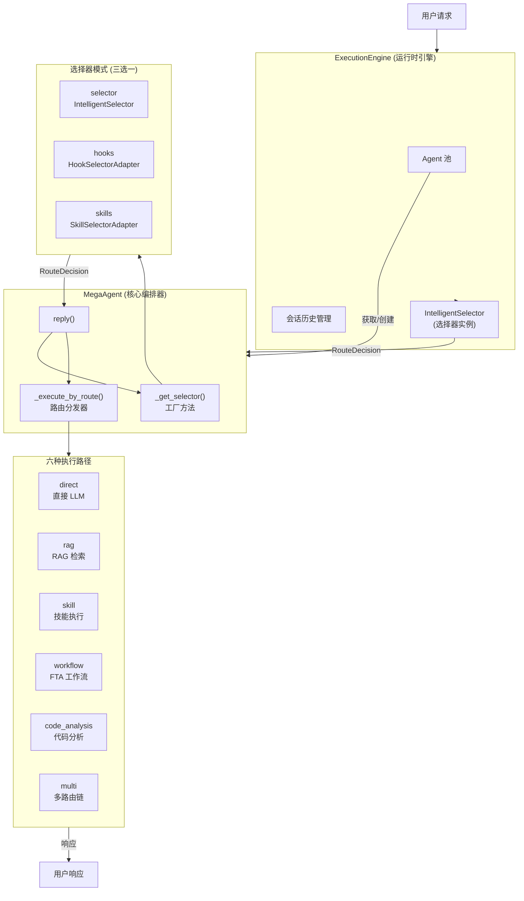
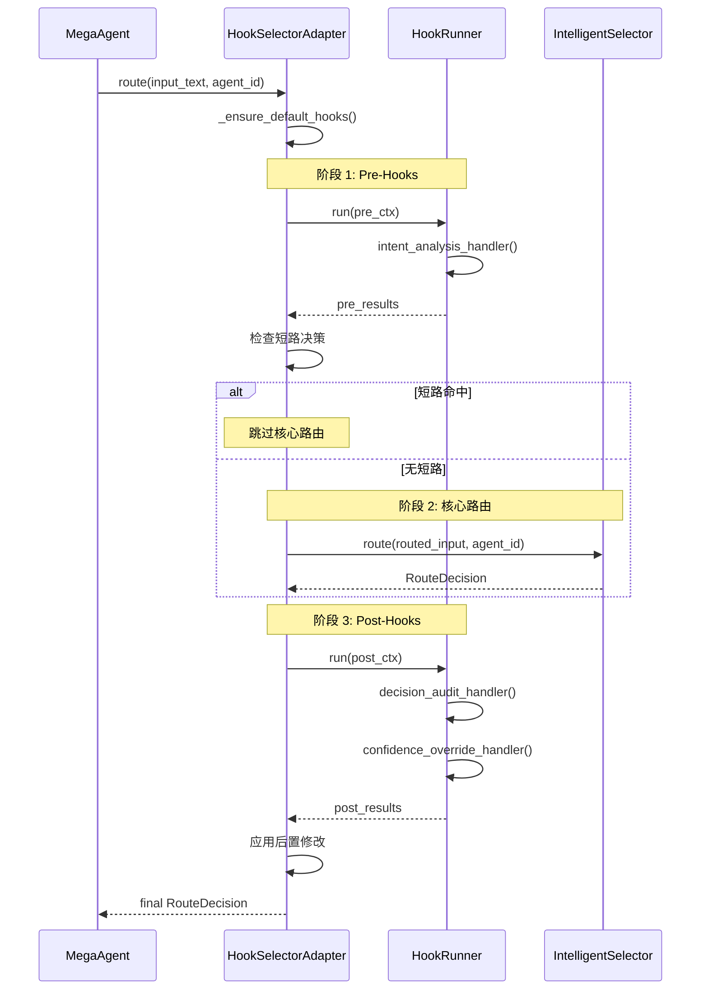
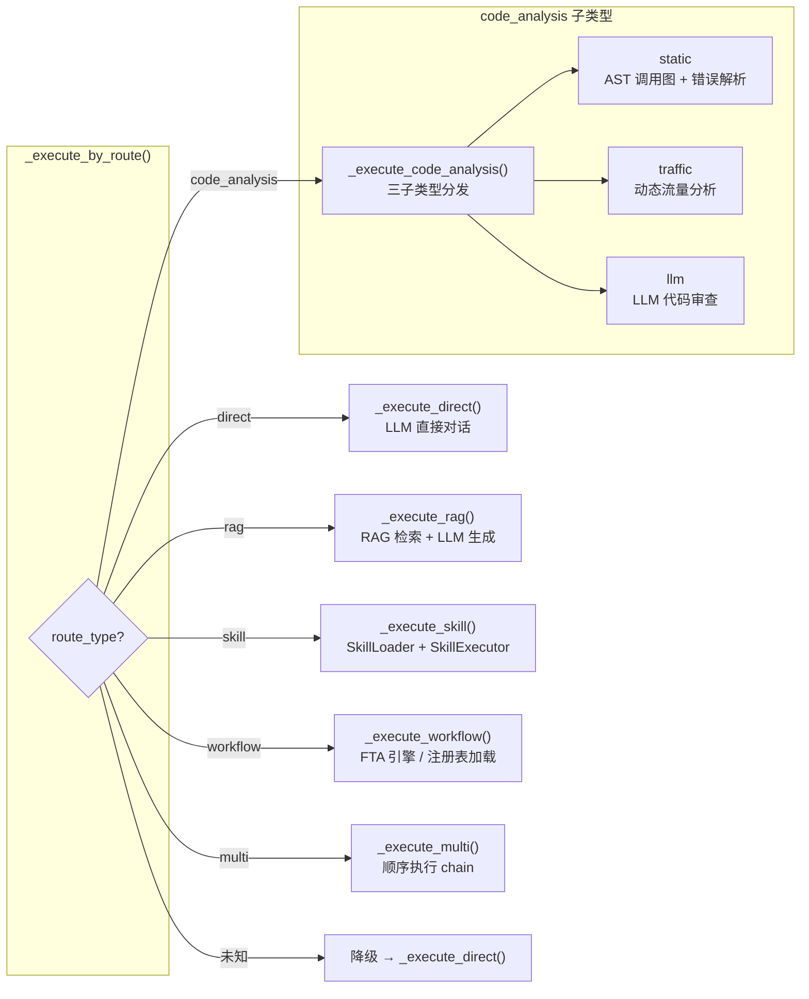
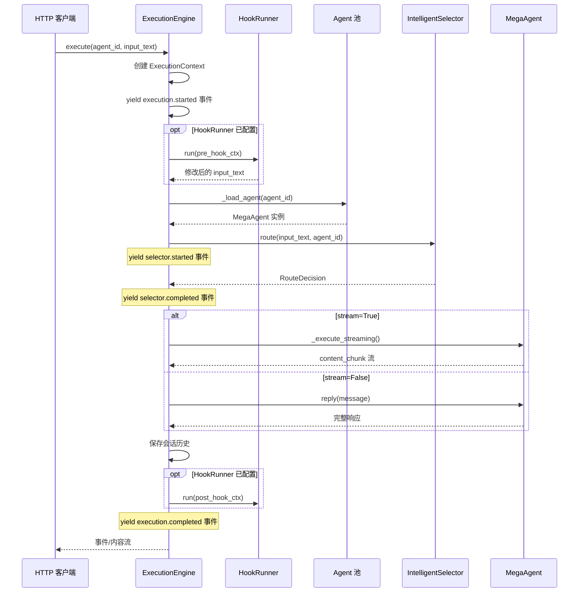

**MegaAgent** 是 ResolveAgent 平台的顶级编排器——它接收用户请求，交由智能选择器（Intelligent Selector）分析意图并决定路由方向，然后将请求分发到六个执行子系统之一。本文将从架构总览、选择器工厂模式、路由决策模型、六种执行路径、缓存策略以及运行时引擎集成六个维度，系统性地拆解 MegaAgent 的核心运作机制。

Sources: [mega.py](python/src/resolveagent/agent/mega.py#L1-L26), [base.py](python/src/resolveagent/agent/base.py#L1-L62)

## 架构总览：MegaAgent 在系统中的位置

MegaAgent 继承自 `BaseAgent`，是整个 Python 运行时层的请求入口。`BaseAgent` 提供名称、模型 ID、系统提示词和内存管理等基础能力；MegaAgent 在此之上注入了智能选择器、LLM 提供者、RAG 管道、技能执行器、FTA 引擎、静态分析引擎和动态分析引擎七大懒加载子系统。当 `ExecutionEngine` 收到一条用户消息时，它会从 Agent 池中获取或创建一个 `MegaAgent` 实例，然后调用其 `reply()` 方法触发完整的选择→路由→执行流水线。

下面的 Mermaid 图展示了从用户请求到最终响应的完整数据流：



Sources: [engine.py](python/src/resolveagent/runtime/engine.py#L20-L53), [mega.py](python/src/resolveagent/agent/mega.py#L28-L47)

## 选择器工厂模式：三种适配器统一接口

MegaAgent 的核心设计决策之一是**选择器与编排器的解耦**。通过 `SelectorProtocol` 协议（Python 的 `Protocol` + `@runtime_checkable`），三种截然不同的选择器实现对编排器完全透明——它们只需满足 `route()` 和 `get_strategy_info()` 两个方法签名即可。

`_get_selector()` 方法实现了**懒加载工厂模式**：首次调用时根据 `selector_mode` 参数实例化对应的选择器适配器，后续调用直接返回缓存实例，避免重复创建。三种模式的差异如下：

| 模式 | 实现类 | 核心特点 | 适用场景 |
|------|--------|----------|----------|
| `selector`（默认） | `IntelligentSelector` | 直接路由，内置意图分析 + 上下文丰富 + 策略决策三阶段管道 | 标准生产部署 |
| `hooks` | `HookSelectorAdapter` | 在 `IntelligentSelector` 外围包装 pre/post Hook 拦截层，支持短路决策和审计 | 需要可观测性、决策覆盖 |
| `skills` | `SkillSelectorAdapter` | 将选择器本身封装为技能调用，通过 `selector_skill.run()` 执行路由 | 技能管道统一管理 |

工厂方法的关键代码：

```python
def _get_selector(self) -> SelectorProtocol:
    if self._selector_instance is not None:
        return self._selector_instance          # 缓存复用
    if self.selector_mode == "hooks":
        self._selector_instance = HookSelectorAdapter(strategy=self.selector_strategy)
    elif self.selector_mode == "skills":
        self._selector_instance = SkillSelectorAdapter()
    else:
        self._selector_instance = IntelligentSelector(strategy=self.selector_strategy)
    return self._selector_instance
```

`SelectorProtocol` 的设计遵循**结构化子类型**（structural subtyping）原则——无需显式继承，只要方法签名匹配即可通过 `isinstance` 检查，实现了最大的灵活性。

Sources: [mega.py](python/src/resolveagent/agent/mega.py#L52-L74), [protocol.py](python/src/resolveagent/selector/protocol.py#L1-L37)

## HookSelectorAdapter：前置/后置拦截管道

`HookSelectorAdapter` 是三种模式中最复杂的一种，它在标准 `IntelligentSelector` 的基础上注入了一个完整的 Hook 生命周期管道。其执行流程分为三个阶段：



该适配器注册了三个内置 Handler：

- **`intent_analysis_handler`**（pre-hook）：在路由前运行意图分析，将分类结果存入 `modified_data`，供后续 Hook 或核心路由使用。
- **`decision_audit_handler`**（post-hook）：记录路由决策的审计日志，包含路由类型、目标、置信度和时间戳。
- **`confidence_override_handler`**（post-hook）：根据元数据中的 `confidence_overrides` 配置动态调整特定路由类型的置信度分数。

其中 pre-hook 支持**短路机制**：如果某个 Handler 返回的 `HookResult` 中 `skip_remaining=True` 且包含完整的 `route_decision`，则直接跳过核心路由阶段，极大降低了延迟。

Sources: [hook_selector.py](python/src/resolveagent/selector/hook_selector.py#L1-L151), [selector_handlers.py](python/src/resolveagent/hooks/selector_handlers.py#L1-L87), [models.py](python/src/resolveagent/hooks/models.py#L1-L35)

## SkillSelectorAdapter：选择器即技能

`SkillSelectorAdapter` 采取了另一种解耦策略——将路由逻辑本身封装为技能。它懒加载 `resolveagent.skills.builtin.selector_skill` 模块中的 `run()` 函数，直接调用并解析返回的字典为 `RouteDecision`。

这种设计的核心价值在于：当整个平台以技能为核心抽象时，选择器不再是特殊组件，而是一个可被 `SkillLoader` / `SkillExecutor` 管道管理的普通技能。它具备完整的错误降级能力——如果技能调用失败，自动回退到 `direct` 路由类型，置信度降至 0.3。

Sources: [skill_selector.py](python/src/resolveagent/selector/skill_selector.py#L1-L69), [selector_skill.py](python/src/resolveagent/skills/builtin/selector_skill.py#L1-L34)

## 路由决策模型：RouteDecision

`RouteDecision` 是整个路由系统的核心数据模型，基于 Pydantic `BaseModel` 构建，承载从选择器到执行器的全部决策信息：

| 字段 | 类型 | 说明 |
|------|------|------|
| `route_type` | `str` | 路由类型：`direct` / `rag` / `skill` / `workflow` / `code_analysis` / `multi` |
| `route_target` | `str` | 路由目标：具体技能名、工作流名、RAG 集合名等 |
| `confidence` | `float` | 置信度分数 (0.0–1.0)，用于混合策略的决策权重 |
| `parameters` | `dict` | 附加参数，如 `collection`、`top_k`、`sub_type`、`repo_path` 等 |
| `reasoning` | `str` | 人类可读的决策理由，用于可观测性和调试 |
| `chain` | `list[RouteDecision]` | 多路由场景下的有序子决策列表 |

该模型还提供了两个实用方法：`is_code_related()` 检测是否为代码相关路由（覆盖 `code_analysis` 路由类型和代码相关技能目标），`is_high_confidence(threshold)` 检测置信度是否超过阈值（默认 0.7）。

Sources: [selector.py](python/src/resolveagent/selector/selector.py#L20-L82)

## 六种路由类型的执行路径

MegaAgent 的 `_execute_by_route()` 方法充当路由分发器，根据 `RouteDecision.route_type` 将请求分发到六个不同的执行子系统。每个子系统都采用**懒初始化**模式——对应引擎在首次使用时才创建并缓存到实例变量中。



### direct：直接 LLM 对话

最基础的路径。创建 LLM 提供者实例（通过 Higress 网关），将系统提示词和用户内容组装为 `ChatMessage` 列表，调用 `chat()` 获取响应。响应元数据中包含路由类型、目标、置信度和 LLM 使用量统计。

### rag：检索增强生成

调用 `RAGPipeline` 从指定集合中检索相关文档（支持 `collection` 和 `top_k` 参数），将检索结果格式化为带相关性分数的上下文文本，然后拼接到提示词模板中交由 LLM 生成最终响应。元数据额外包含检索到的文档数量和来源列表。

### skill：技能执行

从 `decision.route_target` 或 `decision.parameters["skill"]` 获取技能名称，通过 `SkillLoader` 加载技能定义，将决策参数中的 `inputs` 或原始内容作为输入，交由 `SkillExecutor` 执行。返回结果包含技能名、执行成功状态和耗时。

### workflow：FTA 工作流

首先尝试从注册表加载工作流定义（通过 `registry_client`），如果成功则调用 `_execute_defined_workflow()` 按 DAG 节点顺序执行（支持 `start` / `end` / `agent` / `skill` 四种节点类型）；如果加载失败则回退到简单的工作流启动响应。

### code_analysis：代码分析（三子类型分发）

此路由类型内部再根据 `decision.parameters["sub_type"]` 进行二级分发：

| 子类型 | 引擎 | 功能 |
|--------|------|------|
| `static` | `StaticAnalysisEngine` | AST 解析 → 调用图构建 → 错误解析 → 解决方案生成 |
| `traffic` | `DynamicAnalysisEngine` | OTel/Proxy/eBPF 数据分析 → 服务依赖图构建 → 报告生成 |
| `llm`（默认） | LLM 提供者 | 纯 LLM 代码审查，输出质量评分、问题列表和改进建议 |

### multi：多路由链式执行

遍历 `decision.chain` 中的子决策列表，依次调用 `_execute_by_route()` 递归执行每个子路由，最终将所有结果拼接为编号列表返回。

Sources: [mega.py](python/src/resolveagent/agent/mega.py#L125-L665)

## 选择器缓存：TTL 感知的 LRU 策略

`IntelligentSelector` 内置了一个 `RouteDecisionCache`，用于避免对相同输入重复执行完整的路由分析。缓存采用 **TTL + LRU** 双重淘汰策略：

- **缓存键**：由 `input_text + agent_id + strategy` 的 SHA-256 哈希生成，确保相同输入在相同上下文下的确定性缓存命中。
- **TTL 过期**：每个条目记录创建时间戳（`time.monotonic()`），读取时检查是否超过 `ttl_seconds`（默认 300 秒）。
- **LRU 淘汰**：基于 `OrderedDict` 实现，当缓存满时淘汰最久未访问的条目。
- **线程安全**：所有操作通过 `threading.Lock` 保护，支持多线程并发访问。
- **两种作用域**：`"instance"` 为每个选择器实例独享缓存；`"global"` 使用模块级单例，跨实例共享。

`route()` 方法还接受 `bypass_cache` 参数，允许强制跳过缓存计算全新决策。

Sources: [cache.py](python/src/resolveagent/selector/cache.py#L1-L112), [selector.py](python/src/resolveagent/selector/selector.py#L160-L213)

## 运行时引擎集成：ExecutionEngine 的编排角色

`ExecutionEngine` 是 MegaAgent 的上层编排器，负责管理完整的请求生命周期。它的核心流程如下：



`ExecutionEngine` 维护一个 `_agent_pool` 字典，实现 Agent 实例的池化复用。首次请求某个 `agent_id` 时，尝试从注册表加载配置创建 `MegaAgent`；后续请求直接从池中获取。每个 Agent 实例内部的选择器也通过 `_get_selector()` 懒加载并缓存，形成了**双层缓存**架构。

引擎还负责管理会话历史（`_conversations` 字典），在每次请求前后记录用户消息和助手响应，为多轮对话提供上下文。流式模式下，引擎优先尝试 LLM 的 `chat_stream()` 接口，失败时自动降级到同步 `chat()` 调用。

Sources: [engine.py](python/src/resolveagent/runtime/engine.py#L55-L262), [engine.py](python/src/resolveagent/runtime/engine.py#L263-L318)

## 配置与初始化

MegaAgent 的行为由构造函数参数和 YAML 配置文件共同控制。构造函数接受两个关键参数：

- **`selector_strategy`**（默认 `"hybrid"`）：决定选择器内部的路由策略——`"rule"`（纯规则匹配）、`"llm"`（纯 LLM 分类）或 `"hybrid"`（规则快路径 + LLM 慢路径 + 集成评分）。
- **`selector_mode`**（默认 `"selector"`）：决定使用哪种选择器适配器——`"selector"`、`"hooks"` 或 `"skills"`。

YAML 配置示例：

```yaml
agent:
  name: my-assistant
  type: mega
  config:
    model_id: qwen-plus
    system_prompt: |
      You are a helpful assistant powered by ResolveAgent.
    selector_config:
      strategy: hybrid
      confidence_threshold: 0.7
```

`ExecutionEngine._load_agent()` 从注册表加载上述配置，将 `selector_strategy` 传递给 `MegaAgent` 构造函数。如果注册表不可用，则使用默认配置（`qwen-plus` 模型 + `hybrid` 策略）创建实例。

Sources: [mega.py](python/src/resolveagent/agent/mega.py#L28-L46), [engine.py](python/src/resolveagent/runtime/engine.py#L263-L317), [agent-example.yaml](configs/examples/agent-example.yaml#L1-L18)

## 设计要点总结

| 设计模式 | 应用位置 | 核心收益 |
|----------|----------|----------|
| 懒加载工厂 | `_get_selector()` + 子系统初始化 | 避免启动时全量初始化，按需加载 |
| 协议多态 | `SelectorProtocol` + 三适配器 | 运行时切换选择器实现无需修改编排器 |
| 二级分发 | `_execute_by_route()` + `code_analysis` 子类型 | 支持路由类型的水平扩展和垂直细化 |
| 双层缓存 | Agent 池 + 选择器实例 + `RouteDecisionCache` | 减少重复计算和对象创建开销 |
| 链式递归 | `multi` 路由 + `_execute_by_route()` 自调用 | 天然支持复合请求的顺序编排 |

**延伸阅读**：要理解选择器内部的三阶段处理管道（意图分析、上下文丰富、策略决策），请参阅 [智能路由决策引擎：意图分析与三阶段处理流程](8-zhi-neng-lu-you-jue-ce-yin-qing-yi-tu-fen-xi-yu-san-jie-duan-chu-li-liu-cheng)；要了解 Hook 适配与 Skill 适配的细节，请参阅 [选择器适配器：Hook 适配与 Skill 适配模式](10-xuan-ze-qi-gua-pei-qi-hook-gua-pei-yu-skill-gua-pei-mo-shi)；Agent 的记忆机制请参阅 [Agent 记忆系统：短期对话与长期知识存储](23-agent-ji-yi-xi-tong-duan-qi-dui-hua-yu-chang-qi-zhi-shi-cun-chu)。