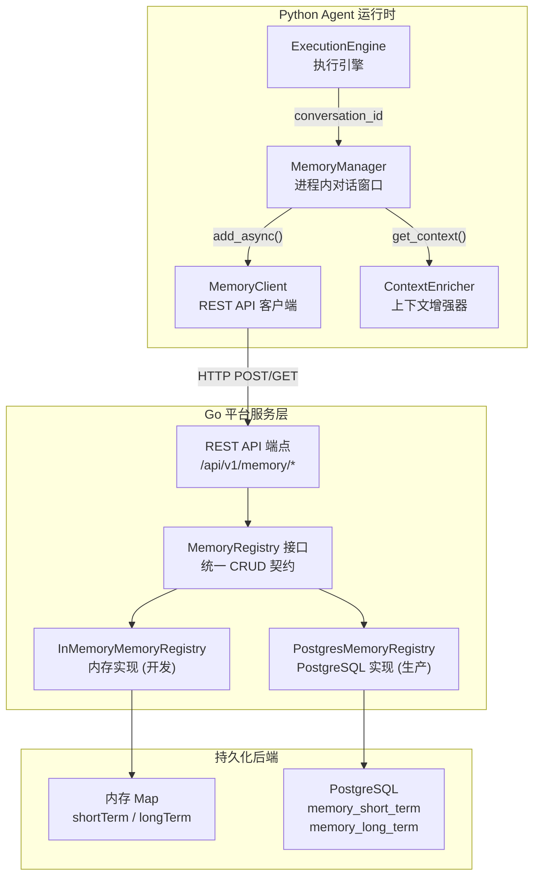
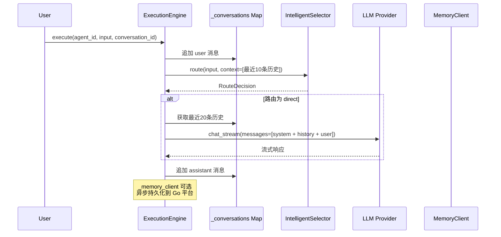

ResolveAgent 的 Agent 记忆系统是连接「无状态请求处理」与「有状态上下文推理」的核心桥梁。它采用 **双层记忆架构**——短期对话记忆维护单次会话的多轮消息序列，长期知识存储则跨会话积累 Agent 的事实、偏好与经验。整套系统横跨 Go 平台服务层与 Python Agent 运行时层，通过 REST API 实现跨语言持久化，同时在存储后端支持内存映射（开发调试）与 PostgreSQL（生产部署）的无缝切换。本页将系统性地拆解其数据模型、接口契约、存储实现、API 端点以及与 MegaAgent 编排器的集成机制。
Sources: [memory.go](pkg/registry/memory.go#L1-L60), [memory_store.go](pkg/store/postgres/memory_store.go#L1-L20)

## 架构总览：双层记忆与跨语言协作

在深入实现细节之前，先理解记忆系统的整体架构。下图展示了从 Python 运行时的 `MemoryManager` 出发，经由 `MemoryClient` REST 客户端，穿越到 Go 平台服务层的 `MemoryRegistry` 接口，最终落入内存实现或 PostgreSQL 持久化的完整数据通路。



这一架构的关键设计决策在于 **Go 层掌握持久化主权、Python 层持有进程内缓存**。`MemoryManager` 在 Python 进程内维护一个滑动窗口（默认 100 条 / 4096 tokens），确保 LLM 调用时无需每次都发起网络请求；同时通过 `add_async()` 方法将消息异步写入 Go 平台，实现跨会话、跨重启的状态恢复能力。

Sources: [memory.py](python/src/resolveagent/agent/memory.py#L23-L44), [memory_client.py](python/src/resolveagent/store/memory_client.py#L43-L53), [server.go](pkg/server/server.go#L34-L55)

## 数据模型：短期记忆与长期记忆的结构定义

记忆系统的数据模型分为两个完全独立的结构体，分别服务于不同的生命周期和使用场景。

### 短期记忆（ShortTermMemory）

短期记忆以「对话消息」为基本单元，每条记录代表一次 user / assistant / system / tool 角色的消息。其核心字段包括：

| 字段 | 类型 | 说明 |
|------|------|------|
| `ID` | `string` | 消息唯一标识，UUID 格式 |
| `AgentID` | `string` | 所属 Agent 标识 |
| `ConversationID` | `string` | 对话会话标识，同一会话共享 |
| `Role` | `string` | 消息角色：`system` / `user` / `assistant` / `tool` |
| `Content` | `string` | 消息正文内容 |
| `TokenCount` | `int` | 消息的 Token 数量估算 |
| `Metadata` | `map[string]any` | 扩展元数据（JSONB） |
| `SequenceNum` | `int` | 会话内顺序号，保证消息时序 |
| `CreatedAt` | `time.Time` | 创建时间戳 |

`SequenceNum` 是短期记忆的关键设计——它通过 `UNIQUE (conversation_id, sequence_num)` 约束保证同一会话内消息的严格有序性。查询时始终按 `sequence_num` 排序，配合 `LIMIT` 参数截取最近 N 条消息，实现滑动窗口效果。

Sources: [memory.go](pkg/registry/memory.go#L12-L22), [006_memory.up.sql](scripts/migration/006_memory.up.sql#L14-L30)

### 长期记忆（LongTermMemory）

长期记忆服务于跨会话的知识积累，每条记录携带丰富的语义信息和管理属性：

| 字段 | 类型 | 说明 |
|------|------|------|
| `ID` | `string` | 记忆唯一标识 |
| `AgentID` | `string` | 所属 Agent |
| `UserID` | `string` | 关联用户（可选，实现用户级知识隔离） |
| `MemoryType` | `string` | 记忆类型（见下表） |
| `Content` | `string` | 记忆正文 |
| `Importance` | `float64` | 重要性评分 0.0–1.0，默认 0.5 |
| `AccessCount` | `int` | 访问计数，自动递增 |
| `SourceConversations` | `[]string` | 来源会话 ID 列表 |
| `EmbeddingID` | `string` | 关联的向量嵌入 ID（预留语义检索） |
| `Metadata` | `map[string]any` | 扩展元数据 |
| `ExpiresAt` | `*time.Time` | 过期时间（TTL），可为空表示永不过期 |
| `LastAccessedAt` | `time.Time` | 最后访问时间，每次读取自动更新 |

**`MemoryType` 枚举**定义了五种长期知识类别：

| 类型 | 含义 | 典型场景 |
|------|------|----------|
| `summary` | 对话摘要 | 多轮对话结束时自动生成的会话总结 |
| `preference` | 用户偏好 | "用户喜欢简洁的回答风格" |
| `pattern` | 行为模式 | "该用户常在凌晨提交运维工单" |
| `fact` | 事实知识 | "集群 X 的 master 节点是 10.0.1.5" |
| `skill_learned` | 技能习得 | "Agent 学会了使用 kubectl logs 命令" |

`Importance` 字段配合 `ExpiresAt` 构成了记忆的 **生命周期管理**：高重要性的记忆永不过期，低重要性的记忆在 TTL 到期后被 `PruneExpiredMemories` 方法批量清除。搜索结果默认按 `importance` 降序排列，确保高价值知识优先返回。

Sources: [memory.go](pkg/registry/memory.go#L25-L40), [006_memory.up.sql](scripts/migration/006_memory.up.sql#L33-L57)

## 接口契约：MemoryRegistry 的 12 个方法

`MemoryRegistry` 是 Go 平台层定义的统一接口，为短期记忆和长期记忆分别提供 CRUD 操作，外加一个维护方法。所有 12 个注册表后端都遵循此接口，实现存储引擎的可插拔替换。

```
// 短期记忆（对话历史）
AddMessage(ctx, *ShortTermMemory) error
GetConversation(ctx, conversationID, limit) ([]*ShortTermMemory, error)
DeleteConversation(ctx, conversationID) error
ListConversations(ctx, agentID, opts) ([]string, int, error)

// 长期记忆（跨会话知识）
StoreLongTermMemory(ctx, *LongTermMemory) error
GetLongTermMemory(ctx, id) (*LongTermMemory, error)
SearchLongTermMemory(ctx, agentID, userID, memoryType, opts) ([]*LongTermMemory, int, error)
UpdateLongTermMemory(ctx, *LongTermMemory) error
DeleteLongTermMemory(ctx, id) error
IncrementAccessCount(ctx, id) error

// 维护
PruneExpiredMemories(ctx) (int, error)
```

值得注意的是 `IncrementAccessCount`——它在每次 `GetLongTermMemory` 时被 API 层自动调用，无需客户端显式触发。这种设计使得访问热度统计对上层完全透明。`SearchLongTermMemory` 支持三维过滤：`agentID`（必选）+ `userID`（可选）+ `memoryType`（可选），并自动排除已过期的记忆。

Sources: [memory.go](pkg/registry/memory.go#L42-L60), [router.go](pkg/server/router.go#L1802-L1814)

## 双后端实现：内存映射与 PostgreSQL

记忆系统提供两种存储后端，通过共享 `MemoryRegistry` 接口实现运行时无感切换。

### InMemoryMemoryRegistry（开发模式）

`InMemoryMemoryRegistry` 使用两个 `map[string]` 分别存储短期和长期记忆，通过 `sync.RWMutex` 保证并发安全。它是 `Server.New()` 的默认选择，无需任何外部依赖即可运行。

其短期记忆查询实现了一个精巧的 **扫描-排序-截断** 策略：先遍历全部 `shortTerm` map 收集匹配 `conversationID` 的条目，再按 `SequenceNum` 升序排列，最后从尾部截取 `limit` 条。长期记忆搜索则按 `Importance` 降序排列，并自动跳过 `ExpiresAt` 早于当前时间的过期条目。

Sources: [memory.go](pkg/registry/memory.go#L62-L275)

### PostgresMemoryRegistry（生产模式）

`PostgresMemoryRegistry` 持有 `*Store`（pgx 连接池的封装），将所有操作翻译为参数化 SQL。其核心优化在于：

1. **短期记忆查询使用 `ORDER BY sequence_num DESC LIMIT`**，获取结果后在 Go 层反转数组，实现高效的「取最近 N 条」语义，避免全表扫描
2. **长期记忆搜索使用动态 WHERE 构建**——`agentID` 为必选条件，`userID` 和 `memoryType` 按需追加参数化占位符，`expires_at IS NULL OR expires_at > NOW()` 确保过期记忆被过滤
3. **`IncrementAccessCount` 使用原子 SQL**——`SET access_count = access_count + 1` 在数据库层完成递增，消除并发竞态
4. **`PruneExpiredMemories` 使用批量 DELETE**——一次性清除所有过期记忆，返回实际清除数量

Sources: [memory_store.go](pkg/store/postgres/memory_store.go#L24-L271)

### 两种实现的对比

| 维度 | InMemoryMemoryRegistry | PostgresMemoryRegistry |
|------|----------------------|----------------------|
| 数据持久化 | 进程重启后丢失 | 持久化到磁盘 |
| 并发模型 | Go `sync.RWMutex` | PostgreSQL 行级锁 |
| 短期查询性能 | O(n) 全扫描 | B-tree 索引加速 |
| 长期搜索性能 | 全量排序 | 索引 + LIMIT 下推 |
| 过期清除效率 | 遍历 map | SQL 批量 DELETE |
| 部署依赖 | 无 | 需要 PostgreSQL 实例 |
| 适用场景 | 本地开发、单元测试 | 生产环境、多副本部署 |

Sources: [memory.go](pkg/registry/memory.go#L62-L75), [memory_store.go](pkg/store/postgres/memory_store.go#L12-L20)

## 数据库 Schema 与索引策略

记忆系统的数据库层通过 Migration 006 创建，Migration 007 追加性能索引。两表设计遵循以下原则：

**`memory_short_term` 表**——以 `(conversation_id, sequence_num)` 为核心唯一约束，保证同一会话内消息顺序的严格性。配合 `UNIQUE` 约束，即使并发插入也不会产生序列号冲突。

**`memory_long_term` 表**——以 `id` 为主键，`updated_at` 字段通过 `BEFORE UPDATE` 触发器自动维护。`expires_at` 允许 `NULL`（永不过期），搜索时以 `expires_at IS NULL OR expires_at > NOW()` 条件过滤。

Migration 007 为两个表创建了以下索引：

```sql
-- 短期记忆：对话查询加速
idx_mem_short_conv ON memory_short_term(conversation_id, sequence_num)
idx_mem_short_agent ON memory_short_term(agent_id)

-- 长期记忆：多维搜索加速
idx_mem_long_agent ON memory_long_term(agent_id)
idx_mem_long_user ON memory_long_term(user_id) WHERE user_id IS NOT NULL
idx_mem_long_type ON memory_long_term(memory_type)
idx_mem_long_importance ON memory_long_term(importance DESC)
```

其中 `idx_mem_long_user` 使用了 **部分索引**（Partial Index）——仅索引 `user_id IS NOT NULL` 的行，避免了大量空值条目占用索引空间。`idx_mem_long_importance` 使用 `DESC` 排序，与搜索查询的 `ORDER BY importance DESC` 完全匹配，实现索引覆盖扫描。

Sources: [006_memory.up.sql](scripts/migration/006_memory.up.sql#L1-L57), [007_indexes.up.sql](scripts/migration/007_indexes.up.sql#L41-L49)

## REST API 端点全景

Go 平台通过 11 个 REST 端点暴露记忆系统的全部能力。所有端点以 `/api/v1/memory/` 为前缀，遵循 RESTful 资源命名约定。

### 短期记忆端点

| 方法 | 端点 | 说明 |
|------|------|------|
| `GET` | `/api/v1/memory/agents/{agent_id}/conversations` | 列出 Agent 的所有会话 ID |
| `GET` | `/api/v1/memory/conversations/{id}?limit=N` | 获取会话消息（默认 100 条） |
| `POST` | `/api/v1/memory/conversations/{id}/messages` | 向会话添加消息 |
| `DELETE` | `/api/v1/memory/conversations/{id}` | 删除整个会话历史 |

`POST` 端点的请求体为 JSON 格式的 `ShortTermMemory` 对象。`role` 字段为必填项（`system` / `user` / `assistant` / `tool`），`id` 字段若为空则由服务端自动生成。

### 长期记忆端点

| 方法 | 端点 | 说明 |
|------|------|------|
| `GET` | `/api/v1/memory/agents/{agent_id}/long-term?user_id=&type=` | 搜索长期记忆 |
| `POST` | `/api/v1/memory/long-term` | 存储新长期记忆 |
| `GET` | `/api/v1/memory/long-term/{id}` | 获取单条长期记忆（自动 +1 访问计数） |
| `PUT` | `/api/v1/memory/long-term/{id}` | 更新长期记忆 |
| `DELETE` | `/api/v1/memory/long-term/{id}` | 删除单条长期记忆 |
| `POST` | `/api/v1/memory/prune` | 批量清除过期记忆 |

`GET /api/v1/memory/long-term/{id}` 的一个特色行为是 **自动调用 `IncrementAccessCount`**——每次读取都会递增访问计数并更新 `last_accessed_at`，为后续的记忆热度分析和排序提供数据支撑。

Sources: [router.go](pkg/server/router.go#L102-L112), [router.go](pkg/server/router.go#L1682-L1862)

## Python 运行时集成：从 MemoryManager 到 MemoryClient

记忆系统在 Python 侧的实现分为两层：`MemoryManager` 是 Agent 进程内的本地记忆管理器，`MemoryClient` 是面向 Go 平台的 REST 客户端。

### MemoryManager：进程内对话窗口管理

`MemoryManager` 是每个 Agent 实例持有的本地记忆管理器，核心职责包括：

- **滑动窗口控制**：`max_entries`（默认 100）和 `max_tokens`（默认 4096）双重阈值，超出时自动驱逐最早的消息
- **LLM 上下文输出**：`get_context()` 方法将记忆转换为 `[{"role": ..., "content": ...}]` 格式的消息列表，直接供 LLM Provider 使用
- **异步持久化**：`add_async()` 先写入本地 `_entries` 列表，再通过 `MemoryClient` 异步写入 Go 平台，失败时仅记录 warning 而不阻塞主流程
- **会话恢复**：`load_conversation()` 从 Go 平台加载历史对话到本地，`_sequence_num` 被设为历史消息中的最大序列号，保证后续写入的连续性

```python
# MemoryManager 的核心使用模式
manager = MemoryManager(
    max_entries=100,
    memory_client=memory_client,  # Go 平台客户端
    agent_id="ops-agent",
    conversation_id="conv-xyz",
)

# 添加消息（本地 + 远程持久化）
await manager.add_async("user", "检查 pod 状态", source="webhook")
await manager.add_async("assistant", "所有 pod 运行正常")

# 获取 LLM 上下文
context = manager.get_context(limit=20)  # 最近 20 条消息
```

Sources: [memory.py](python/src/resolveagent/agent/memory.py#L23-L119)

### MemoryClient：Go 平台 REST 客户端

`MemoryClient` 继承自 `BaseStoreClient`（基于 `httpx.AsyncClient` 的 HTTP 工具类），为每个 REST 端点提供类型化的 Python 异步方法。它定义了两个数据类 `ShortTermMemoryInfo` 和 `LongTermMemoryInfo`，与 Go 层的结构体一一对应。

| 方法 | 对应端点 | 返回类型 |
|------|---------|---------|
| `add_message(conv_id, msg)` | `POST /conversations/{id}/messages` | `dict or None` |
| `get_conversation(conv_id, limit)` | `GET /conversations/{id}` | `list[ShortTermMemoryInfo]` |
| `delete_conversation(conv_id)` | `DELETE /conversations/{id}` | `dict or None` |
| `list_conversations(agent_id)` | `GET /agents/{id}/conversations` | `list[str]` |
| `store_long_term(memory)` | `POST /long-term` | `dict or None` |
| `get_long_term(id)` | `GET /long-term/{id}` | `LongTermMemoryInfo or None` |
| `search_long_term(agent_id, ...)` | `GET /agents/{id}/long-term` | `list[LongTermMemoryInfo]` |
| `update_long_term(id, memory)` | `PUT /long-term/{id}` | `dict or None` |
| `delete_long_term(id)` | `DELETE /long-term/{id}` | `dict or None` |
| `prune_expired()` | `POST /prune` | `int` |

`BaseStoreClient` 统一处理连接管理（`connect()` / `close()`）、HTTP 错误（404 返回 `None`，其他异常记录日志后返回 `None`），确保客户端调用不会因网络问题导致 Agent 崩溃。

Sources: [memory_client.py](python/src/resolveagent/store/memory_client.py#L1-L146), [base_client.py](python/src/resolveagent/store/base_client.py#L13-L93)

## 与 MegaAgent 编排器的集成

记忆系统深度嵌入在 MegaAgent 的请求处理流程中。`ExecutionEngine` 作为顶层编排器，通过 `conversation_id` 串联整个执行链路：



`ExecutionEngine` 在 `_conversations` 字典中维护所有活跃会话的历史消息。每次执行时：用户消息先被追加到 `_conversations[conversation_id]`，然后将最近 10 条消息作为 `conversation_history` 传递给 `IntelligentSelector` 进行路由决策。路由为 `direct` 类型时，引擎取最近 20 条消息构建 LLM 的完整输入上下文，实现多轮对话连贯性。

Sources: [engine.py](python/src/resolveagent/runtime/engine.py#L55-L192), [engine.py](python/src/resolveagent/runtime/engine.py#L396-L450)

## 与 ContextEnricher 的协作

`ContextEnricher` 在智能选择器的路由决策过程中，通过 `_get_conversation_history()` 和 `_infer_user_preferences()` 两个方法与记忆系统交互。当前实现中这两个方法标记为 `TODO`，但接口预留了完整的协作框架：

- **`conversation_history`**：`EnrichedContext` 的核心字段，将作为路由上下文传递给选择器，帮助识别"用户在追问之前的某个话题"等场景
- **`user_preferences`**：从长期记忆的 `preference` 类型记录中推断用户偏好（如语言、详细程度、是否偏好代码示例），影响路由策略的权重调整

`EnrichedContext` 还包含 `session_metadata`（输入哈希、输入长度等会话元数据）和 `enrichment_confidence`（0.0–1.0 的置信度评分），这些信息共同构成选择器做出精准路由决策的基础。

Sources: [context_enricher.py](python/src/resolveagent/selector/context_enricher.py#L29-L68), [context_enricher.py](python/src/resolveagent/selector/context_enricher.py#L196-L247), [context_enricher.py](python/src/resolveagent/selector/context_enricher.py#L399-L414)

## 记忆生命周期管理

记忆的完整生命周期遵循"写入 → 检索 → 衰减 → 清除"的闭环：

1. **写入阶段**：`MemoryManager.add_async()` 将消息同时写入本地缓存和 Go 平台。长期记忆的 `Importance` 默认为 0.5，可由调用方根据上下文动态设定
2. **检索阶段**：短期记忆按 `sequence_num` 时序读取；长期记忆按 `importance` 降序返回，支持 `agentID` + `userID` + `memoryType` 三维过滤
3. **衰减阶段**：长期记忆的 `ExpiresAt` 字段定义 TTL。每次读取触发 `AccessCount + 1` 和 `LastAccessedAt` 更新，为未来实现"访问热度加权衰减"预留数据基础
4. **清除阶段**：`PruneExpiredMemories` 批量删除所有 `expires_at < NOW()` 的记录，返回实际清除数量。可通过 `POST /api/v1/memory/prune` 手动触发

Sources: [memory.go](pkg/registry/memory.go#L247-L274), [memory_store.go](pkg/store/postgres/memory_store.go#L249-L271)

## 关键设计决策总结

| 决策点 | 选择 | 理由 |
|--------|------|------|
| 短期记忆排序键 | `sequence_num` 单调递增整数 | 比 `created_at` 更精确，避免时间戳精度问题 |
| 长期记忆排序键 | `importance` 降序 | 确保高价值知识优先返回给 LLM |
| Python 侧缓存策略 | 进程内 `list` + 异步持久化 | 减少 LLM 调用时的网络延迟 |
| 过期清除方式 | 批量 SQL DELETE | 避免逐条清除的性能开销 |
| 访问计数更新时机 | GET 请求时自动递增 | 对上层透明，无需显式 API 调用 |
| `EmbeddingID` 字段 | 仅存储 ID 引用，不做向量运算 | 将向量管理职责交给 RAG 管道，保持记忆系统的单一职责 |

Sources: [memory.go](pkg/registry/memory.go#L1-L60), [memory_client.py](python/src/resolveagent/store/memory_client.py#L1-L146)

---

**延伸阅读**：记忆系统的存储后端实现依赖于 [12 大注册表体系：统一 CRUD 接口与内存/Postgres 双后端](24-12-da-zhu-ce-biao-ti-xi-tong-crud-jie-kou-yu-nei-cun-postgres-shuang-hou-duan)的通用注册表框架；数据库表的创建与索引策略详见 [数据库 Schema 与迁移：10 步迁移脚本与种子数据](25-shu-ju-ku-schema-yu-qian-yi-10-bu-qian-yi-jiao-ben-yu-chong-zi-shu-ju)；长期记忆中的 `EmbeddingID` 字段预留了与 [RAG 管道全景：文档摄取、向量索引与语义检索](14-rag-guan-dao-quan-jing-wen-dang-she-qu-xiang-liang-suo-yin-yu-yu-yi-jian-suo)的语义检索能力集成；记忆在路由决策中的应用参见 [智能路由决策引擎：意图分析与三阶段处理流程](8-zhi-neng-lu-you-jue-ce-yin-qing-yi-tu-fen-xi-yu-san-jie-duan-chu-li-liu-cheng)。