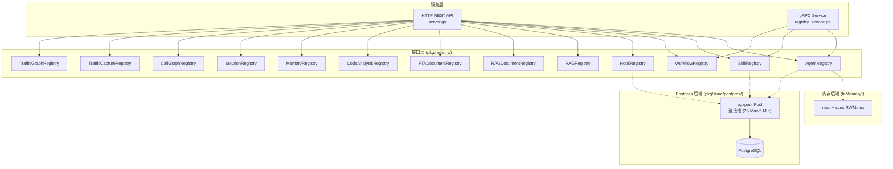

ResolveAgent 平台的注册表体系是其数据持久化层的核心架构。整个体系由 `pkg/registry/` 中定义的 **13 个接口类型**（按业务域归为 12 大类）和 `pkg/store/postgres/` 中对应的 PostgreSQL 实现组成，采用 **接口-实现分离** 的经典 Go 设计模式，使得上层业务代码完全不感知底层存储介质。每个注册表均以 `sync.RWMutex` 保护的内存实现作为默认后端（零依赖、即开即用），同时提供基于 `pgx` 连接池的 Postgres 持久化实现（生产级事务、索引与级联删除）。这种双后端策略让开发者可以在本地用内存模式快速迭代，在部署时无缝切换到 Postgres，无需修改任何业务逻辑代码。

Sources: [agent.go](pkg/registry/agent.go#L1-L105), [store.go](pkg/store/store.go#L1-L14), [postgres.go](pkg/store/postgres/postgres.go#L1-L105)

## 架构总览：三层分离设计

在深入每个注册表之前，需要先理解整体分层架构。ResolveAgent 将注册表体系拆分为三个职责明确的层次：**接口层**（`pkg/registry/`）定义纯抽象的 Go interface 与领域模型结构体；**内存实现层**（同一文件中的 `InMemory*Registry`）提供基于 `map + RWMutex` 的进程内存储；**Postgres 实现层**（`pkg/store/postgres/`）提供基于连接池的持久化存储。最上层的 `Server` 和 `RegistryService` 仅依赖接口，通过依赖注入获取具体实现。



**关键设计原则**：每个 `InMemory*` 实现都在同一文件中紧跟接口定义，形成自包含的模块。内存实现使用 `sync.RWMutex` 实现读写分离锁——读操作用 `RLock()` 允许并发读取，写操作用 `Lock()` 保证互斥写入。Postgres 实现则通过统一的 `Store` 结构体共享 `pgxpool.Pool` 连接池，连接池配置为最大 25 连接、最小 5 连接，适合中等规模生产负载。

Sources: [server.go](pkg/server/server.go#L21-L61), [registry_service.go](pkg/service/registry_service.go#L35-L58), [postgres.go](pkg/store/postgres/postgres.go#L13-L62)

## 12 大注册表分类一览

下表按业务域将 13 个接口归为 12 大类，列出每个注册表的核心职责、主键字段、标准 CRUD 操作和扩展操作。

| # | 注册表接口 | 源文件 | 主键 | 核心数据 | 扩展操作 |
|---|-----------|--------|------|---------|---------|
| 1 | **AgentRegistry** | `agent.go` | `id` (string) | Agent 定义（名称、类型、配置、标签） | — |
| 2 | **SkillRegistry** | `skill.go` | `name` (string) | 技能清单（版本、描述、来源） | `ListByType`, `Register/Unregister` |
| 3 | **WorkflowRegistry** | `workflow.go` | `id` (string) | FTA 工作流定义（故障树、状态） | — |
| 4 | **HookRegistry** | `hook.go` | `id` (string) | 生命周期钩子 + 执行记录 | `ListByTriggerPoint`, `RecordExecution`, `ListExecutions` |
| 5 | **RAGRegistry** | `rag.go` | `id` (string) | RAG 集合（配置、状态） | — |
| 6 | **RAGDocumentRegistry** | `rag_document.go` | `id` (string) | RAG 文档元数据 + 摄取历史 | `GetDocumentByHash`, `RecordIngestion`, `ListIngestionHistory` |
| 7 | **FTADocumentRegistry** | `fta_document.go` | `id` (string) | FTA 故障树文档 + 分析结果 | `ListByWorkflow`, `CreateAnalysisResult`, `ListAnalysisResults` |
| 8 | **CodeAnalysisRegistry** | `code_analysis.go` | `id` (string) | 代码静态分析 + 发现项 | `AddFinding/AddFindings`, `ListFindings`, `GetFindingsBySeverity` |
| 9 | **MemoryRegistry** | `memory.go` | 复合键 | 短期对话记忆 + 长期知识记忆 | `GetConversation`, `SearchLongTermMemory`, `PruneExpiredMemories` |
| 10 | **TroubleshootingSolutionRegistry** | `solution.go` | `id` (string) | 排障方案 + 执行记录 | `Search`, `BulkCreate`, `RecordExecution` |
| 11 | **CallGraphRegistry** | `call_graph.go` | `id` (string) | 代码调用图 + 节点 + 边 | `AddNodes/AddEdges`, `ListNodes/Edges`, `GetSubgraph` |
| 12 | **流量分析**（2 个接口） | `traffic_*.go` | `id` (string) | 流量捕获会话 + 记录；流量拓扑图 | `GetByCaptureID`, `UpdateReport`, `AddRecords`, `GetRecordsByService` |

Sources: [agent.go](pkg/registry/agent.go#L10-L28), [skill.go](pkg/registry/skill.go#L10-L32), [workflow.go](pkg/registry/workflow.go#L10-L26), [hook.go](pkg/registry/hook.go#L12-L54), [rag.go](pkg/registry/rag.go#L11-L29), [rag_document.go](pkg/registry/rag_document.go#L11-L52), [fta_document.go](pkg/registry/fta_document.go#L11-L53), [code_analysis.go](pkg/registry/code_analysis.go#L11-L61), [memory.go](pkg/registry/memory.go#L12-L60), [solution.go](pkg/registry/solution.go#L12-L74), [call_graph.go](pkg/registry/call_graph.go#L11-L63), [traffic_capture.go](pkg/registry/traffic_capture.go#L11-L55), [traffic_graph.go](pkg/registry/traffic_graph.go#L11-L34)

## 统一 CRUD 模式与 ListOptions 分页协议

所有注册表共享一套 **标准 CRUD 操作签名**，以 `context.Context` 作为第一参数，以领域模型指针作为数据载体。最具代表性的是 `AgentRegistry` 接口，它定义了最经典的五操作集合：

```go
type AgentRegistry interface {
    Create(ctx context.Context, agent *AgentDefinition) error
    Get(ctx context.Context, id string) (*AgentDefinition, error)
    List(ctx context.Context, opts ListOptions) ([]*AgentDefinition, int, error)
    Update(ctx context.Context, agent *AgentDefinition) error
    Delete(ctx context.Context, id string) error
}
```

**ListOptions 分页协议** 是所有 `List` 方法共享的参数结构体。它包含 `PageSize`/`PageToken`（游标分页预留）和 `Limit`/`Offset`（偏移量分页）两套分页机制，以及 `Filter map[string]string` 用于字段级过滤。在内存实现中，`Limit` 默认为 100，`Offset` 默认为 0；在 Postgres 实现中，这些参数直接映射到 SQL 的 `LIMIT` 和 `OFFSET` 子句。

```go
type ListOptions struct {
    PageSize  int
    PageToken string
    Filter    map[string]string
    Limit     int
    Offset    int
}
```

**统一返回约定**：所有 `List` 方法返回三元组 `(items, total, error)`。`total` 表示满足过滤条件的总记录数（不受分页影响），使得调用方可以计算总页数。`items` 为当前页的切片，当 `offset >= total` 时返回空切片而非 error。

Sources: [agent.go](pkg/registry/agent.go#L22-L28), [agent.go](pkg/registry/agent.go#L97-L105), [rag_test.go](pkg/registry/rag_test.go#L69-L90)

## 内存后端实现：读写锁保护的 Map 存储

每个注册表的内存实现遵循同一套固定模板，以 `InMemoryAgentRegistry` 为例：底层使用 `map[string]*AgentDefinition` 存储数据，`sync.RWMutex` 保护并发访问。**Create** 操作在写锁下检查重复后插入；**Get** 在读锁下按 key 查找，未找到返回 `fmt.Errorf`；**List** 在读锁下遍历全量 map 组装切片；**Update** 在写锁下检查存在后替换；**Delete** 在写锁下调用 `delete()`。

内存实现的几个显著特征值得注意：

- **幂等性保护**：`Create` 严格拒绝已存在的 ID（返回 `"agent %s already exists"` 错误），而 `Delete` 对不存在的 key 静默成功——这是为了支持清理场景的幂等调用。
- **无过滤实现**：`AgentRegistry` 和 `WorkflowRegistry` 的内存 `List` 实现忽略了 `Filter` 参数，直接返回全量数据。这是因为这两个注册表的数据量通常很小（Agent 数量有限），而 `HookRegistry`、`RAGRegistry` 等注册表则在内存实现中实现了完整的字段过滤逻辑。
- **时间戳自动填充**：大多数注册表的 `Create` 方法会自动设置 `CreatedAt` 和 `UpdatedAt`，`Update` 方法自动更新 `UpdatedAt`。

Sources: [agent.go](pkg/registry/agent.go#L30-L95), [hook.go](pkg/registry/hook.go#L98-L143)

## Postgres 后端实现：连接池、事务与级联删除

Postgres 后端位于 `pkg/store/postgres/` 包，核心是 `Store` 结构体——它封装了 `pgxpool.Pool` 连接池，并提供 `Exec`、`QueryRow`、`Query`、`Begin` 四个数据库操作原语。每个注册表的 Postgres 实现都以 `Postgres*Registry` 命名，内部持有 `*Store` 引用。

**连接池配置**（`postgres.go` 第 43-47 行）设定了 `MaxConns=25`、`MinConns=5`，这是为中等规模并发场景优化的默认值。`Migrate` 方法（第 108-470 行）实现了内嵌的版本化迁移机制——通过 `schema_migrations` 表记录已应用的版本号，支持幂等执行。

**Postgres 实现的差异化特性**：

| 特性 | 实现方式 | 示例 |
|------|---------|------|
| **Upsert 语义** | `ON CONFLICT DO UPDATE` | Skill 的 `Register` 方法对同名技能执行更新而非报错 |
| **事务批量写入** | `Begin` → 循环 `Exec` → `Commit` | `AddFindings` 在事务中批量插入代码分析发现项 |
| **级联删除** | `ON DELETE CASCADE` 外键约束 | 数据库层面级联删除 Hook 执行记录、FTA 分析结果等 |
| **动态查询构建** | 参数化 `WHERE` 子句拼接 | `SearchLongTermMemory` 根据 `agentID`/`userID`/`memoryType` 动态构建 SQL |
| **NULL 安全处理** | `nilIfEmpty` 辅助函数 | 将空字符串转为 SQL `NULL`，扫描时用 `*string` 接收再解引用 |
| **行影响检查** | `tag.RowsAffected()` | `Update` 操作检查是否实际更新了行，未找到返回 error |

**迁移版本化** 共 13 个版本（v1-v13），覆盖了所有注册表对应的数据库表和索引创建。v1-v5 创建核心表（agents、skills、workflows、model_routes、基础索引），v6-v12 创建扩展表（hooks、rag_documents、fta_documents、code_analyses、memory），v13 创建性能索引。

Sources: [postgres.go](pkg/store/postgres/postgres.go#L13-L105), [postgres.go](pkg/store/postgres/postgres.go#L108-L470), [skill_store.go](pkg/store/postgres/skill_store.go#L21-L39), [code_analysis_store.go](pkg/store/postgres/code_analysis_store.go#L137-L161), [memory_store.go](pkg/store/postgres/memory_store.go#L158-L199)

## 各注册表详解

### 1. AgentRegistry —— 智能体注册表

管理 Agent 定义的核心注册表。`AgentDefinition` 结构体包含 `ID`、`Name`、`Description`、`Type`（如 `"mega"`）、`Config`（map 类型，存储模型选择等运行时配置）、`Status`、`Labels` 和 `Version`。作为最基础的三注册表之一（Agent/Skill/Workflow），它被 `RegistryService` 直接引用，通过 gRPC 暴露给 Python 运行时。REST API 提供完整的 CRUD 端点 `GET/POST/PUT/DELETE /api/v1/agents`，以及 `POST /api/v1/agents/{id}/execute` 执行端点。

Sources: [agent.go](pkg/registry/agent.go#L10-L28), [router.go](pkg/server/router.go#L28-L33)

### 2. SkillRegistry —— 技能注册表

技能注册表使用 `Register/Unregister` 命名替代标准的 `Create/Delete`，反映了技能的"注册-注销"生命周期语义。`SkillDefinition` 包含 `Name`（主键）、`Version`、`SkillType`、`Domain`、`Tags`、`Manifest`（技能清单的完整 JSON）、`SourceType` 和 `SourceURI`。`ListByType` 方法支持按 `skillType`（如 `"general"` 或 `"scenario"`）过滤。Postgres 实现的 `Register` 使用 `ON CONFLICT (name) DO UPDATE` 实现 Upsert 语义——重复注册会自动更新而非报错。

Sources: [skill.go](pkg/registry/skill.go#L10-L96), [skill_store.go](pkg/store/postgres/skill_store.go#L21-L39)

### 3. WorkflowRegistry —— 工作流注册表

管理 FTA 工作流定义，`WorkflowDefinition` 的核心字段是 `Tree map[string]any`，存储 JSON 格式的故障树结构。REST API 除了标准 CRUD 外，还提供 `POST /validate`（验证工作流结构）和 `POST /execute`（执行工作流）两个操作端点。

Sources: [workflow.go](pkg/registry/workflow.go#L10-L93), [router.go](pkg/server/router.go#L41-L48)

### 4. HookRegistry —— 生命周期钩子注册表

这是接口最丰富的注册表之一，同时管理 **HookDefinition**（钩子配置）和 **HookExecution**（执行记录）两类实体。`HookDefinition` 的 `TriggerPoint` 字段支持 `"agent.execute"`、`"skill.invoke"`、`"workflow.run"` 三种触发点；`HookType` 区分 `"pre"` 和 `"post"` 前后钩子；`ExecutionOrder` 决定同一触发点下多个钩子的执行顺序。`ListByTriggerPoint` 方法是核心扩展操作——它只返回 `Enabled=true` 的钩子，并按 `ExecutionOrder` 排序；同时支持 `TargetID` 匹配（空 TargetID 表示全局钩子，匹配所有实体）。Postgres 实现使用 `WHERE enabled = true AND trigger_point = $1 AND (target_id IS NULL OR target_id = '' OR target_id = $2)` 精确复现了这个语义。

Sources: [hook.go](pkg/registry/hook.go#L12-L192), [hook_store.go](pkg/store/postgres/hook_store.go#L122-L153)

### 5-6. RAG 集合与文档注册表

RAG（检索增强生成）域拆分为两个注册表。**RAGRegistry** 管理集合级别的元数据——`RAGCollection` 的 `Config` 字段存储嵌入模型、分块策略等配置，`Status` 默认为 `"active"`。**RAGDocumentRegistry** 管理文档级别的元数据——`RAGDocument` 记录 `ContentHash`（用于去重检测）、`ChunkCount`、`VectorIDs`（向量存储中的 ID 列表）、`SizeBytes`，以及文档状态机（`"pending"` → `"processing"` → `"indexed"` / `"failed"`）。`GetDocumentByHash` 方法支持基于内容哈希的精确查找，用于避免重复摄取同一文档。`RAGIngestionRecord` 追踪每次摄取操作的详细审计信息（处理分块数、创建向量数、耗时）。

Sources: [rag.go](pkg/registry/rag.go#L11-L144), [rag_document.go](pkg/registry/rag_document.go#L11-L202)

### 7. FTADocumentRegistry —— 故障树文档注册表

管理 FTA 故障树分析的完整生命周期。`FTADocument` 包含 `FaultTree`（JSON 格式的故障树结构）和 `WorkflowID`（关联的工作流）。状态机包含 `"draft"` → `"active"` → `"archived"` 三态。扩展操作 `ListByWorkflow` 支持查询特定工作流关联的所有故障树文档。`FTAAnalysisResult` 记录每次分析执行的详细结果——顶事件结果、最小割集、基本事件概率、门结果和重要度度量。**级联删除** 机制确保删除 FTA 文档时自动清理其所有分析结果（内存实现通过遍历清理，Postgres 通过 `ON DELETE CASCADE` 外键约束实现）。

Sources: [fta_document.go](pkg/registry/fta_document.go#L11-L238), [fta_document_store.go](pkg/store/postgres/fta_document_store.go#L1-L244)

### 8. CodeAnalysisRegistry —— 代码静态分析注册表

管理代码静态分析运行和发现项。`CodeAnalysis` 记录分析任务的元信息（`RepositoryURL`、`Branch`、`CommitSHA`、`Language`、`AnalyzerType` 支持 `"lint"/"security"/"complexity"/"dependency"/"custom"` 五种类型）。`CodeAnalysisFinding` 记录每条发现——包含 `Severity`（5 级：critical/high/medium/low/info）、`Category`（security/performance/style/bug）、精确的代码位置（`FilePath`、`LineStart/End`、`ColumnStart/End`）、`Snippet`（代码片段）和 `Suggestion`（修复建议）。`AddFindings` 的 Postgres 实现使用事务批量插入，保证原子性。

Sources: [code_analysis.go](pkg/registry/code_analysis.go#L11-L244), [code_analysis_store.go](pkg/store/postgres/code_analysis_store.go#L1-L232)

### 9. MemoryRegistry —— Agent 记忆注册表

这是接口方法最多的注册表（13 个方法），同时管理 **短期记忆**（ShortTermMemory）和 **长期记忆**（LongTermMemory）。短期记忆按 `ConversationID` + `SequenceNum` 组织，支持 `GetConversation`（按序列号排序，支持 limit 截断最近 N 条）和 `ListConversations`（按 agent 聚合会话列表）。长期记忆包含 5 种类型（`"summary"/"preference"/"pattern"/"fact"/"skill_learned"`），每条记忆有 `Importance` 权重（0.0-1.0）和 `AccessCount` 访问计数。`SearchLongTermMemory` 支持 `agentID` + `userID` + `memoryType` 三维过滤，结果按 Importance 降序排列。`PruneExpiredMemories` 清理过期的长期记忆条目。Postgres 实现的长期记忆查询自动过滤 `expires_at > NOW()` 条件，并使用动态参数化查询构建 WHERE 子句。

Sources: [memory.go](pkg/registry/memory.go#L12-L275), [memory_store.go](pkg/store/postgres/memory_store.go#L1-L272)

### 10. TroubleshootingSolutionRegistry —— 排障方案注册表

管理结构化的排障方案和执行记录。`TroubleshootingSolution` 是一个内容丰富的领域模型，包含 `ProblemSymptoms`（问题症状）、`KeyInformation`（关键信息）、`TroubleshootingSteps`（排查步骤）、`ResolutionSteps`（解决步骤），以及 `Domain`、`Component`、`Severity`、`Tags` 等多维分类字段。`SolutionSearchOptions` 扩展了 `ListOptions`，增加 `Domain`、`Component`、`Severity`、`Tags`、`Keyword` 五个搜索维度——内存实现的 `Search` 方法对 `Keyword` 执行多字段模糊匹配（Title + ProblemSymptoms + SearchKeywords），对 `Tags` 执行集合交集匹配。`BulkCreate` 支持批量导入（跳过已存在的记录），被 Kudig 技能导入流程使用。`SolutionExecution` 追踪每次方案应用的执行情况，包含 `EffectivenessScore` 和 `OutcomeNotes`。

Sources: [solution.go](pkg/registry/solution.go#L12-L309)

### 11. CallGraphRegistry —— 代码调用图注册表

管理代码调用图及其节点和边，是三层实体模型（Graph → Node → Edge）的注册表。`CallGraph` 记录图的元信息（`RepositoryURL`、`Language`、`EntryPoint`、`NodeCount`、`EdgeCount`、`MaxDepth`）。`CallGraphNode` 的 `NodeType` 支持 `"entry_point"/"internal"/"external"/"stdlib"` 四种类型。`CallGraphEdge` 的 `CallType` 支持 `"direct"/"dynamic"/"async"`。核心扩展操作 `GetSubgraph` 支持从指定节点出发、按深度获取子图，用于聚焦分析特定调用链。Postgres 实现的 `Delete` 通过级联删除清理节点和边数据。

Sources: [call_graph.go](pkg/registry/call_graph.go#L11-L324)

### 12. 流量分析注册表（TrafficCapture + TrafficGraph）

流量分析域包含两个互补的注册表。**TrafficCaptureRegistry** 管理流量捕获会话和记录——`TrafficCapture` 的 `SourceType` 支持 `"ebpf"/"tcpdump"/"otel"/"proxy"` 四种采集源；`TrafficRecord` 记录每条流量（`Protocol` 支持 HTTP/gRPC/TCP，包含 `LatencyMs`、`RequestSize`、`ResponseSize`、`TraceID`/`SpanID`）。`GetRecordsByService` 支持按服务名过滤记录。**TrafficGraphRegistry** 管理从流量数据构建的服务依赖拓扑图——`TrafficGraph` 的 `GraphData` 存储 JSON 格式的图结构，`AnalysisReport` 和 `Suggestions` 字段由分析器填充。`UpdateReport` 是一个特化的更新操作，同时更新报告内容和建议列表，并自动将状态设为 `"analyzed"`。

Sources: [traffic_capture.go](pkg/registry/traffic_capture.go#L11-L220), [traffic_graph.go](pkg/registry/traffic_graph.go#L11-L169)

## Server 中的注册表初始化与依赖注入

`server.go` 的 `New()` 函数是注册表体系的装配入口。它创建 Server 结构体时，将 13 个内存注册表实例注入到对应的接口字段中。这种初始化方式意味着 **默认配置下无需任何外部依赖即可启动完整服务**：

```go
s := &Server{
    agentRegistry:          registry.NewInMemoryAgentRegistry(),
    skillRegistry:          registry.NewInMemorySkillRegistry(),
    workflowRegistry:       registry.NewInMemoryWorkflowRegistry(),
    ragRegistry:            registry.NewInMemoryRAGRegistry(),
    hookRegistry:           registry.NewInMemoryHookRegistry(),
    ragDocumentRegistry:    registry.NewInMemoryRAGDocumentRegistry(),
    ftaDocumentRegistry:    registry.NewInMemoryFTADocumentRegistry(),
    codeAnalysisRegistry:   registry.NewInMemoryCodeAnalysisRegistry(),
    memoryRegistry:         registry.NewInMemoryMemoryRegistry(),
    solutionRegistry:       registry.NewInMemoryTroubleshootingSolutionRegistry(),
    callGraphRegistry:      registry.NewInMemoryCallGraphRegistry(),
    trafficCaptureRegistry: registry.NewInMemoryTrafficCaptureRegistry(),
    trafficGraphRegistry:   registry.NewInMemoryTrafficGraphRegistry(),
}
```

当需要切换到 Postgres 后端时，只需用 `postgres.NewPostgres*Registry(store)` 替换对应的内存实例，所有上层代码（REST handler、gRPC service）无需任何改动。`RegistryService` 同样通过构造函数注入三个核心注册表（Agent、Skill、Workflow）和 ModelRouter，体现了清晰的依赖倒置。

Sources: [server.go](pkg/server/server.go#L43-L61), [registry_service.go](pkg/service/registry_service.go#L44-L58)

## REST API 路由映射

每个注册表都通过 `router.go` 中的 `registerHTTPRoutes` 方法暴露完整的 REST API。路由设计遵循一致的 `/api/v1/{resource}` 模式，支持标准 CRUD 操作。下表汇总了所有注册表对应的 API 端点：

| 注册表 | REST 前缀 | 端点数量 | 特殊操作 |
|--------|----------|---------|---------|
| Agent | `/api/v1/agents` | 6 | `POST /{id}/execute` |
| Skill | `/api/v1/skills` | 4 | — |
| Workflow | `/api/v1/workflows` | 7 | `POST /{id}/validate`, `POST /{id}/execute` |
| Hook | `/api/v1/hooks` | 6 | `GET /{id}/executions` |
| RAG Collection | `/api/v1/rag/collections` | 5 | `POST /{id}/ingest`, `POST /{id}/query` |
| RAG Document | `/api/v1/rag/collections/{id}/documents` | 5 | `GET /{id}/ingestions` |
| FTA Document | `/api/v1/fta/documents` | 7 | `GET/POST /{id}/results` |
| Code Analysis | `/api/v1/analyses` | 7 | `GET/POST /{id}/findings` |
| Memory | `/api/v1/memory` | 11 | `POST /prune` |
| Solution | `/api/v1/solutions` | 9 | `POST /search`, `POST /bulk` |
| Call Graph | `/api/v1/call-graphs` | 7 | `GET /{id}/subgraph` |
| Traffic Capture | `/api/v1/traffic/captures` | 6 | `POST/GET /{id}/records` |
| Traffic Graph | `/api/v1/traffic/graphs` | 6 | `POST /{id}/analyze` |

Sources: [router.go](pkg/server/router.go#L20-L149)

## 测试覆盖

注册表体系的测试采用 **双层测试策略**：内存实现的单元测试（`pkg/registry/*_test.go`）验证接口语义的正确性，覆盖 Create-Get-List-Update-Delete 全生命周期，包括重复创建拒绝、不存在记录的 error 返回、分页逻辑等边界场景。`RegistryService` 的测试（`pkg/service/registry_service_test.go`）验证依赖注入的正确性——确认构造函数将内存注册表实例正确赋值到结构体字段。

Sources: [agent_test.go](pkg/registry/agent_test.go#L1-L99), [rag_test.go](pkg/registry/rag_test.go#L1-L127), [registry_service_test.go](pkg/service/registry_service_test.go#L1-L78)

## 设计模式总结与扩展指南

整个注册表体系贯穿着三个核心设计模式：

**1. 策略模式**——通过 Go interface 定义存储策略，内存和 Postgres 各自实现，运行时可替换。新增存储后端（如 Redis、etcd）只需实现对应接口，在 `New()` 中替换注入即可。

**2. 领域模型与存储分离**——`AgentDefinition`、`SkillDefinition` 等结构体定义在 `pkg/registry/` 包中，属于纯领域模型，不包含任何数据库标签或 ORM 依赖。Postgres 实现层负责领域模型与数据库行之间的映射（`Scan`/`Exec` 参数绑定）。

**3. 组合式注册表**——部分注册表（如 HookRegistry、MemoryRegistry、CallGraphRegistry）内部同时管理主实体和子实体（执行记录、分析结果、节点/边），形成自包含的子域聚合根。这使得调用方无需跨注册表协调关联操作。

如果需要新增一个注册表，按以下步骤操作：在 `pkg/registry/` 中创建新文件，定义 `*Definition` 结构体和 `*Registry` interface，实现 `InMemory*Registry`；在 `pkg/store/postgres/` 中创建对应的 `*_store.go`，实现 `Postgres*Registry`；在 `postgres.go` 的 `Migrate` 方法中添加新版本的建表 SQL；在 `server.go` 的 `Server` 结构体和 `New()` 函数中添加新字段和初始化代码；在 `router.go` 中注册 REST 路由。

Sources: [server.go](pkg/server/server.go#L21-L61), [postgres.go](pkg/store/postgres/postgres.go#L108-L470)

---

**下一步阅读**：要了解数据库表结构的完整定义和迁移脚本，请参阅 [数据库 Schema 与迁移：10 步迁移脚本与种子数据](25-shu-ju-ku-schema-yu-qian-yi-10-bu-qian-yi-jiao-ben-yu-chong-zi-shu-ju)。要了解注册表如何通过 HTTP/gRPC 对外暴露，请参阅 [REST API 完整参考：端点、请求/响应格式与错误处理](32-rest-api-wan-zheng-can-kao-duan-dian-qing-qiu-xiang-ying-ge-shi-yu-cuo-wu-chu-li)。要了解可观测性如何与存储层集成，请参阅 [可观测性：OpenTelemetry 指标、日志与链路追踪](31-ke-guan-ce-xing-opentelemetry-zhi-biao-ri-zhi-yu-lian-lu-zhui-zong)。