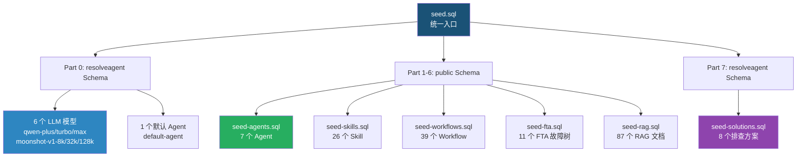
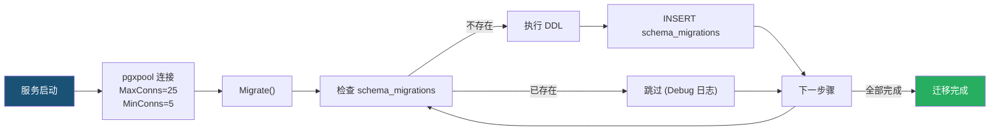

ResolveAgent 采用 **PostgreSQL 16** 作为核心持久化存储，通过一套精心设计的 10 步增量迁移脚本逐步构建完整的数据库 Schema。迁移脚本覆盖了从基础注册表（Agent、Skill、Workflow）到高级分析引擎（FTA 故障树、RAG 文档、代码分析、流量图谱）的全部数据模型。配合 7 个种子数据文件，系统能够在全新环境中一键初始化包含 **7 个 Agent、26 个技能、39 个工作流、11 个故障树、87 个 RAG 文档和 8 个排查方案**的完整演示数据集。本文将深入剖析迁移架构、Schema 演进策略、双 Schema 设计模式以及种子数据的组织逻辑。

Sources: [seed.sql](scripts/seed/seed.sql#L1-L56), [001_init.up.sql](scripts/migration/001_init.up.sql#L1-L163)

## 迁移架构总览：双轨 Schema 设计

ResolveAgent 的数据持久化层存在一个关键架构决策——**双 Schema 分层**。项目维护了两套并行的表结构定义，服务于不同的运行环境与部署场景。

```mermaid
graph TB
    subgraph "SQL Migration Scripts<br/>scripts/migration/"
        M1["001_init.up.sql<br/>基础表 + 扩展 + 触发器"]
        M2["002_hooks.up.sql"]
        M3["003_rag_documents.up.sql"]
        M4["004_fta_documents.up.sql"]
        M5["005_code_analysis.up.sql"]
        M6["006_memory.up.sql"]
        M7["007_indexes.up.sql<br/>性能索引"]
        M8a["008_call_graphs.up.sql"]
        M8b["008_troubleshooting_solutions.up.sql"]
        M9["009_traffic_captures.up.sql"]
        M10["010_traffic_graphs.up.sql"]
    end

    subgraph "Go Runtime Migrate()"
        G["pkg/store/postgres/postgres.go<br/>内嵌 13 步迁移<br/>VARCHAR(64) PK"]
    end

    subgraph "PostgreSQL 16"
        RS["resolveagent Schema<br/>UUID PK, TIMESTAMPTZ"]
        PS["public Schema<br/>VARCHAR(64) PK, TIMESTAMP"]
    end

    M1 --> RS
    M2 --> RS
    M3 --> RS
    M4 --> RS
    M5 --> RS
    M6 --> RS
    M7 --> RS
    M8a --> RS
    M8b --> RS
    M9 --> RS
    M10 --> RS
    G --> PS

    style M1 fill:#1a5276,color:#fff
    style M7 fill:#7d3c98,color:#fff
    style RS fill:#2e86c1,color:#fff
    style PS fill:#27ae60,color:#fff
```



**`resolveagent` Schema**（SQL 迁移脚本）采用 UUID 主键、`TIMESTAMPTZ` 时间戳、`uuid_generate_v4()` 默认值，服务于生产部署和 Docker 容器初始化。**`public` Schema**（Go 运行时内嵌迁移）使用 `VARCHAR(64)` 主键、`TIMESTAMP` 时间戳，由 Go 平台服务启动时通过 `Migrate()` 方法自动执行。两套 Schema 的表结构逻辑一致但类型系统不同，种子数据文件同时兼容两种格式。

Sources: [postgres.go](pkg/store/postgres/postgres.go#L108-L470), [docker-compose.deps.yaml](deploy/docker-compose/docker-compose.deps.yaml#L1-L50)

## 10 步迁移脚本详解

以下表格呈现完整的 10 步迁移生命周期，涵盖每步创建的表、索引策略和核心设计意图。

| 步骤 | 迁移脚本 | 创建的表 | 索引数量 | 核心设计 |
|------|----------|---------|---------|---------|
| 001 | `001_init` | agents, skills, workflows, workflow_executions, models, audit_log | 9 | 基础注册表 + `update_updated_at_column()` 触发器函数 + 权限授予 |
| 002 | `002_hooks` | hooks, hook_executions | 0 | 生命周期 Hook 注册与执行记录 |
| 003 | `003_rag_documents` | rag_documents, rag_ingestion_history | 0 | RAG 文档元数据（向量存储在 Milvus/Qdrant） |
| 004 | `004_fta_documents` | fta_documents, fta_analysis_results | 0 | FTA 故障树文档与分析结果 |
| 005 | `005_code_analysis` | code_analyses, code_analysis_findings | 0 | 代码静态分析与发现项 |
| 006 | `006_memory` | memory_short_term, memory_long_term | 0 | Agent 短期对话记忆 + 长期知识存储 |
| 007 | `007_indexes` | _(无新表)_ | 19 | 为 002-006 创建的性能索引（含部分索引） |
| 008 | `008_call_graphs` + `008_troubleshooting_solutions` | call_graphs, call_graph_nodes, call_graph_edges, troubleshooting_solutions, solution_executions | 12 | 调用图三表结构 + 结构化排查方案（含 GIN 全文索引） |
| 009 | `009_traffic_captures` | traffic_captures, traffic_records | 6 | 运行时流量捕获（支持 eBPF/tcpdump/OTel/Proxy） |
| 010 | `010_traffic_graphs` | traffic_graphs | 2 | 服务依赖图谱与分析报告 |
| **合计** | **11 个文件** | **25 张表** | **48 个索引** | — |

Sources: [001_init.up.sql](scripts/migration/001_init.up.sql#L1-L163), [007_indexes.up.sql](scripts/migration/007_indexes.up.sql#L1-L50), [008_call_graphs.up.sql](scripts/migration/008_call_graphs.up.sql#L1-L57), [010_traffic_graphs.up.sql](scripts/migration/010_traffic_graphs.up.sql#L1-L27)

### 第 1 步：基础 Schema 初始化（001_init）

这是最核心的迁移脚本，奠定了整个数据库的基础设施。它完成四项关键任务：**扩展安装**（`uuid-ossp` 提供 UUID 生成，`pg_trgm` 支持三元组模糊搜索）、**Schema 创建**（`resolveagent` 命名空间隔离）、**六张基础表定义**，以及 **`update_updated_at_column()` 触发器函数**的创建与批量挂载。

触发器函数通过动态 SQL 循环为 `agents`、`skills`、`workflows`、`models` 四张表自动挂载 `BEFORE UPDATE` 触发器，确保任何行级更新操作都会自动刷新 `updated_at` 字段为当前时间。这种设计避免了应用层手动维护时间戳的遗漏风险。

```sql
-- 自动更新触发器函数定义
CREATE OR REPLACE FUNCTION update_updated_at_column()
RETURNS TRIGGER AS $$
BEGIN
    NEW.updated_at = NOW();
    RETURN NEW;
END;
$$ LANGUAGE plpgsql;
```

权限授予部分通过 `GRANT ALL PRIVILEGES` 和 `ALTER DEFAULT PRIVILEGES` 为 `resolveagent` 数据库用户赋予完整的 Schema 访问权限，包括未来自动创建的表和序列。

Sources: [001_init.up.sql](scripts/migration/001_init.up.sql#L8-L162)

### 第 2-6 步：功能模块增量扩展

每个功能模块遵循统一的迁移模板：`SET search_path` → `CREATE TABLE IF NOT EXISTS` → 外键约束 → 触发器挂载。这种模式保证了迁移的**幂等性**（`IF NOT EXISTS`）和**引用完整性**（`ON DELETE CASCADE` / `ON DELETE SET NULL`）。

**002_hooks** 定义了 Hook 注册表和执行记录表。Hook 通过 `trigger_point` 字段精确绑定到生命周期节点（如 `pre_execution`、`post_execution`、`on_error`），`execution_order` 控制同一触发点下多个 Hook 的执行顺序。

**003_rag_documents** 的设计体现了**存储职责分离**原则。PostgreSQL 仅存储文档元数据（标题、内容哈希、分块数量、向量 ID 列表），实际的向量嵌入数据存储在外部的 Milvus 或 Qdrant 中。`vector_ids TEXT[]` 数组字段充当了关系型数据库与向量数据库之间的桥梁。

**006_memory** 将 Agent 记忆系统分为两个表。`memory_short_term` 使用 `(conversation_id, sequence_num)` 复合唯一约束保证消息顺序性；`memory_long_term` 引入 `importance REAL` 评分和 `expires_at TIMESTAMPTZ` 过期时间，支持基于重要性和时效性的记忆淘汰策略。

Sources: [002_hooks.up.sql](scripts/migration/002_hooks.up.sql#L12-L51), [003_rag_documents.up.sql](scripts/migration/003_rag_documents.up.sql#L13-L51), [006_memory.up.sql](scripts/migration/006_memory.up.sql#L14-L52)

### 第 7 步：性能索引集中优化

迁移 007 采用了**索引与表定义分离**的策略，将 002-006 步骤中所有新增表的索引集中在一个迁移脚本中创建。这种设计带来两个优势：表结构迁移保持简洁聚焦 DDL，索引可以根据生产环境实际查询模式独立调整。

该步骤包含 19 个索引，其中有 3 个**部分索引**（Partial Index）值得特别关注：

```sql
-- 仅索引启用的 Hook，减少索引体积
CREATE INDEX IF NOT EXISTS idx_hooks_enabled ON hooks(enabled) WHERE enabled = true;
-- 仅索引有 target_id 的 Hook
CREATE INDEX IF NOT EXISTS idx_hooks_target ON hooks(target_id) WHERE target_id IS NOT NULL;
-- 仅索引活跃用户的长时记忆
CREATE INDEX IF NOT EXISTS idx_mem_long_user ON memory_long_term(user_id) WHERE user_id IS NOT NULL;
```

`memory_long_term.importance` 上的 `DESC` 排序索引支持"按重要性降序检索 Top-K 记忆"的高效查询，直接服务于 Agent 记忆检索的热路径。

Sources: [007_indexes.up.sql](scripts/migration/007_indexes.up.sql#L1-L50)

### 第 8 步：调用图与排查方案（双文件）

步骤 8 包含两个独立的 `.up.sql` 文件，它们在数据库层面互不依赖，但共同服务于**故障诊断知识体系**的构建。

**008_call_graphs** 采用经典的**图数据库三表模式**：`call_graphs`（图元数据）、`call_graph_nodes`（函数节点）、`call_graph_edges`（调用关系边）。边表通过 `caller_node_id` 和 `callee_node_id` 双外键表达有向图，`call_type` 和 `weight` 字段支持直接调用、间接调用、回调等多种调用关系类型。

**008_troubleshooting_solutions** 定义了结构化的排查方案知识库，其核心是**四要素模型**：`problem_symptoms`（问题现象）、`key_information`（关键信息）、`troubleshooting_steps`（排查步骤）、`resolution_steps`（解决步骤）。该表使用了两个高级索引技术：`GIN (tags)` 数组倒排索引支持标签快速过滤，`GIN (search_keywords gin_trgm_ops)` 三元组索引支持模糊关键词搜索。

Sources: [008_call_graphs.up.sql](scripts/migration/008_call_graphs.up.sql#L5-L56), [008_troubleshooting_solutions.up.sql](scripts/migration/008_troubleshooting_solutions.up.sql#L13-L75)

### 第 9-10 步：流量分析体系

**009_traffic_captures** + **010_traffic_graphs** 构成了完整的**运行时流量分析**数据链。`traffic_captures` 记录捕获会话元数据，`source_type` 字段区分 eBPF、tcpdump、OpenTelemetry、Proxy 四种捕获源。`traffic_records` 存储单条流量记录，包含 `trace_id` 和 `span_id` 字段用于与 OpenTelemetry 链路追踪系统关联。`traffic_records(timestamp)` 上的 B-Tree 索引支持时间范围查询的高效执行计划。

`traffic_graphs` 表将流量数据转化为服务依赖图谱，`graph_data`、`nodes`、`edges` 三个 JSONB 字段完整描述了图结构，`suggestions` JSONB 数组字段存储自动生成的优化建议。

Sources: [009_traffic_captures.up.sql](scripts/migration/009_traffic_captures.up.sql#L5-L51), [010_traffic_graphs.up.sql](scripts/migration/010_traffic_graphs.up.sql#L4-L26)

## Schema 实体关系全景

```mermaid
erDiagram
    agents ||--o{ workflow_executions : "triggers"
    workflows ||--o{ workflow_executions : "has"
    workflows ||--o{ fta_documents : "defines"
    fta_documents ||--o{ fta_analysis_results : "analyzed_by"
    hooks ||--o{ hook_executions : "executes"
    rag_documents ||--o{ rag_ingestion_history : "ingested_in"
    code_analyses ||--o{ code_analysis_findings : "discovers"
    code_analyses ||--o{ call_graphs : "produces"
    call_graphs ||--o{ call_graph_nodes : "contains"
    call_graphs ||--o{ call_graph_edges : "contains"
    call_graph_nodes ||--o{ call_graph_edges : "caller"
    call_graph_nodes ||--o{ call_graph_edges : "callee"
    troubleshooting_solutions ||--o{ solution_executions : "executed_as"
    traffic_captures ||--o{ traffic_records : "records"
    traffic_captures ||--o{ traffic_graphs : "generates"

    agents {
        UUID id PK
        VARCHAR name UK
        JSONB config
        VARCHAR status
    }
    skills {
        UUID id PK
        VARCHAR name UK
        JSONB manifest
        VARCHAR category
    }
    workflows {
        UUID id PK
        VARCHAR name UK
        VARCHAR workflow_type
        JSONB definition
    }
    models {
        UUID id PK
        VARCHAR model_id UK
        VARCHAR provider
        INTEGER max_tokens
    }
    fta_documents {
        UUID id PK
        VARCHAR workflow_id FK
        JSONB fault_tree
        INTEGER version
    }
    rag_documents {
        UUID id PK
        VARCHAR collection_id
        TEXT[] vector_ids
        VARCHAR status
    }
    memory_short_term {
        UUID id PK
        VARCHAR agent_id
        VARCHAR conversation_id
        INTEGER sequence_num
    }
    memory_long_term {
        UUID id PK
        VARCHAR agent_id
        REAL importance
        TIMESTAMPTZ expires_at
    }
    troubleshooting_solutions {
        UUID id PK
        TEXT problem_symptoms
        TEXT troubleshooting_steps
        TEXT[] tags
    }
    traffic_captures {
        UUID id PK
        VARCHAR source_type
        JSONB config
    }
```



Sources: [001_init.up.sql](scripts/migration/001_init.up.sql#L20-L124), [004_fta_documents.up.sql](scripts/migration/004_fta_documents.up.sql#L13-L44), [008_troubleshooting_solutions.up.sql](scripts/migration/008_troubleshooting_solutions.up.sql#L13-L53)

## 种子数据体系：7 文件分层加载

种子数据通过 `seed.sql` 统一入口文件进行分层编排，采用 `\i` 指令按序加载各子模块。该文件同时处理 **`resolveagent` Schema**（默认模型和 Agent）和 **`public` Schema**（Go 运行时表）两种目标的种子注入。



Sources: [seed.sql](scripts/seed/seed.sql#L17-L55)

### 种子数据统计与分布

| 种子文件 | 数据量 | Schema | 冲突策略 | 数据来源 |
|----------|--------|--------|----------|---------|
| `seed.sql` Part 0 | 6 模型 + 1 Agent | `resolveagent` | `ON CONFLICT DO NOTHING` | 系统默认 |
| `seed-agents.sql` | 7 Agent | `public` | `ON CONFLICT (id) DO UPDATE` | 运维场景定义 |
| `seed-skills.sql` | 26 Skill（6 通用 + 2 场景 + 18 Kudig） | `public` | `ON CONFLICT (name) DO UPDATE` | 自研 + Kudig 导入 |
| `seed-workflows.sql` | 39 Workflow（5 基础 + 34 Kudig） | `public` | `ON CONFLICT (id) DO UPDATE` | FTA 故障树定义 |
| `seed-fta.sql` | 11 FTA 文档 | `public` | `ON CONFLICT (id) DO UPDATE` | 与 Workflow 关联 |
| `seed-rag.sql` | 87 文档（5 ops-kb + 82 Kudig） | `public` | `ON CONFLICT (id) DO UPDATE` | 运维知识库 |
| `seed-solutions.sql` | 8 排查方案（3 运维 + 5 Kudig） | `resolveagent` | `ON CONFLICT (id) DO UPDATE` | 结构化排查 |

所有种子文件统一采用 `ON CONFLICT ... DO UPDATE` 的 **Upsert 模式**，保证种子数据可以安全地重复执行。每次执行都会将目标表更新为最新定义，而不会产生重复数据或主键冲突错误。

Sources: [seed-agents.sql](scripts/seed/seed-agents.sql#L1-L9), [seed-skills.sql](scripts/seed/seed-skills.sql#L8-L9), [seed-workflows.sql](scripts/seed/seed-workflows.sql#L8-L9)

### Agent 种子数据：7 种运维角色

7 个 Agent 覆盖了 ResolveAgent 平台支持的**五种 Agent 类型**：`mega`（超级智能体，集成选择器进行多路由分发）、`fta`（故障树分析引擎）、`rag`（RAG 语义检索问答）、`skill`（技能并行执行器）、`custom`（自定义分析引擎）。每个 Agent 的 `config` JSONB 字段包含完整的 `harness` 配置，定义了系统提示词、工具列表、绑定技能、Hook 配置、沙箱类型和上下文策略。

值得注意的是 `agent-mega-006`（变更风险评估）的状态被设为 `error`，`agent-custom-005`（SLB 流量分析）的状态为 `inactive`——这两个非活跃状态的种子数据用于测试前端 UI 对异常状态 Agent 的展示效果。

Sources: [seed-agents.sql](scripts/seed/seed-agents.sql#L11-L175)

### Skill 种子数据：三层技能体系

26 个 Skill 形成了**通用技能 → 场景技能 → Kudig 场景技能**的三层体系。6 个通用技能（`ticket-handler`、`consulting-qa`、`log-analyzer`、`metric-alerter`、`change-reviewer`、`hello-world`）覆盖工单处理、知识问答、日志分析、指标告警、变更审核和基础测试。2 个自研场景技能（`k8s-pod-crash`、`rds-replication-lag`）针对 K8s Pod 崩溃和 RDS 复制延迟提供端到端排查方案。18 个 Kudig 场景技能（`SKILL-NODE-001` 至 `SKILL-SEC-003`）由 Kudig 知识库导入，覆盖节点、Pod、网络、安全、存储、工作负载、镜像、控制平面等完整故障域。

Sources: [seed-skills.sql](scripts/seed/seed-skills.sql#L11-L172)

### RAG 文档种子数据：双源知识库

87 个 RAG 文档分布在 45 个集合中，形成两个知识库体系。**运维知识库**（`col-ops-kb-001` 至 `col-ops-kb-005`）包含 15 个文档，涵盖阿里云产品运维手册、历史故障复盘、K8s 最佳实践、内部 SOP 流程和安全基线。**Kudig 域知识库**（`col-kudig-d01` 至 `col-kudig-d40`）包含 72 个文档，覆盖从 K8s 架构概览到 AIOps 平台建设的 40 个技术领域，每个域包含 1-3 个深度文档。

运维知识库使用 `text-embedding-v2` 嵌入模型，Kudig 域知识库使用 `bge-large-zh` 嵌入模型——这种差异反映了不同数据源的嵌入策略选择。

Sources: [seed-rag.sql](scripts/seed/seed-rag.sql#L1-L93), [seed-rag.sql](scripts/seed/seed-rag.sql#L94-L231)

## 迁移执行机制

### Go 运行时内嵌迁移

Go 平台服务通过 `pkg/store/postgres/postgres.go` 中的 `Migrate()` 方法执行自动迁移。该方法维护一个 `schema_migrations` 版本追踪表，采用**乐观锁**模式：在执行每步迁移前检查版本号是否已存在，已存在则跳过，否则执行 DDL 并记录版本号。



连接池配置设定 `MaxConns=25`、`MinConns=5`，使用 `pgxpool` 提供连接复用和自动健康检查。`Migrate()` 方法内嵌了 13 个版本的 DDL（覆盖 Agent、Skill、Workflow、ModelRoute、Hook、RAG、FTA、CodeAnalysis、Memory 等表），这些表使用 `VARCHAR(64)` 主键并存放在 `public` Schema 中。

Sources: [postgres.go](pkg/store/postgres/postgres.go#L107-L469), [postgres.go](pkg/store/postgres/postgres.go#L34-L62)

### Docker 容器初始化路径

`deploy/docker/init-db.sql` 作为 Docker 容器的 `/docker-entrypoint-initdb.d/` 初始化脚本，内容与 `001_init.up.sql` 完全同步。PostgreSQL 容器首次启动时自动执行此脚本，创建基础 Schema 结构。后续的高级迁移（002-010）和种子数据需要通过外部迁移工具（如 `golang-migrate`、`atlas`）或手动 `psql` 命令执行。

```bash
# 执行完整迁移 + 种子数据
psql "$DATABASE_URL" -f scripts/migration/001_init.up.sql
psql "$DATABASE_URL" -f scripts/migration/002_hooks.up.sql
# ... 逐步执行至 010
psql "$DATABASE_URL" -f scripts/seed/seed.sql
```

Sources: [init-db.sql](deploy/docker/init-db.sql#L1-L171)

### 回滚策略

每个 `.up.sql` 都配有对应的 `.down.sql` 文件，遵循**后进先出**的回滚顺序。回滚脚本首先删除触发器（避免依赖冲突），然后按照外键依赖的逆序删除表。以 `001_init.down.sql` 为例：

```sql
DROP TABLE IF EXISTS workflow_executions CASCADE;  -- 先删子表
DROP TABLE IF EXISTS workflows CASCADE;
DROP TABLE IF EXISTS skills CASCADE;
DROP TABLE IF EXISTS agents CASCADE;
DROP TABLE IF EXISTS models CASCADE;
DROP TABLE IF EXISTS audit_log CASCADE;
DROP FUNCTION IF EXISTS update_updated_at_column() CASCADE;
DROP SCHEMA IF EXISTS resolveagent CASCADE;
```

`CASCADE` 关键字确保级联删除所有依赖对象，避免因遗漏依赖导致的回滚失败。

Sources: [001_init.down.sql](scripts/migration/001_init.down.sql#L1-L16), [010_traffic_graphs.down.sql](scripts/migration/010_traffic_graphs.down.sql#L1-L4)

## 关键设计模式与约定

### JSONB 全字段策略

项目中几乎每张表都包含一个或多个 JSONB 字段（`config`、`metadata`、`manifest`、`definition`、`fault_tree`、`labels` 等），这是 ResolveAgent 数据建模的核心哲学——**结构化字段表达固定属性，JSONB 字段表达可扩展属性**。这种混合模式使得 Schema 在保持稳定的同时，各模块可以通过 JSONB 灵活扩展数据结构而不需要新增迁移脚本。

### 时间戳自动化

`update_updated_at_column()` 触发器函数作为全局基础设施，为所有包含 `updated_at` 字段的表提供自动更新能力。迁移 001 通过动态 SQL 批量挂载，后续迁移则逐表显式挂载。早期迁移（001-007）使用 `uuid_generate_v4()` 生成 UUID，后期迁移（008-010）改用 `gen_random_uuid()`——两者功能等价，但 `gen_random_uuid()` 是 PostgreSQL 14+ 的内置函数，无需额外扩展依赖。

### 幂等性保证

所有迁移脚本使用 `CREATE TABLE IF NOT EXISTS`、`CREATE INDEX IF NOT EXISTS`、`DROP TRIGGER IF EXISTS` 等幂等语法。种子数据全部使用 `ON CONFLICT ... DO UPDATE` 的 Upsert 模式。这种设计使得迁移和种子脚本可以安全地重复执行，不会因已存在的对象而产生错误。

Sources: [001_init.up.sql](scripts/migration/001_init.up.sql#L129-L153), [002_hooks.up.sql](scripts/migration/002_hooks.up.sql#L46-L51)

## 延伸阅读

- **注册表体系实现**：[12 大注册表体系：统一 CRUD 接口与内存/Postgres 双后端](24-12-da-zhu-ce-biao-ti-xi-tong-crud-jie-kou-yu-nei-cun-postgres-shuang-hou-duan) — 了解 Go 运行时如何通过 Store 接口抽象实现内存与 Postgres 双后端切换
- **缓存与事件集成**：[Redis 缓存与 NATS 事件总线集成](26-redis-huan-cun-yu-nats-shi-jian-zong-xian-ji-cheng) — 探索 PostgreSQL 之外的存储层设计
- **FTA 引擎数据消费**：[故障树数据结构：事件、门与树模型](11-gu-zhang-shu-shu-ju-jie-gou-shi-jian-men-yu-shu-mo-xing) — FTA 文档如何被故障树引擎消费和求值
- **RAG 管道数据流**：[RAG 管道全景：文档摄取、向量索引与语义检索](14-rag-guan-dao-quan-jing-wen-dang-she-qu-xiang-liang-suo-yin-yu-yu-yi-jian-suo) — RAG 文档从摄取到向量索引的完整流程
- **部署实践**：[Docker Compose 部署：全栈容器化编排](29-docker-compose-bu-shu-quan-zhan-rong-qi-hua-bian-pai) — 数据库如何融入全栈容器化部署