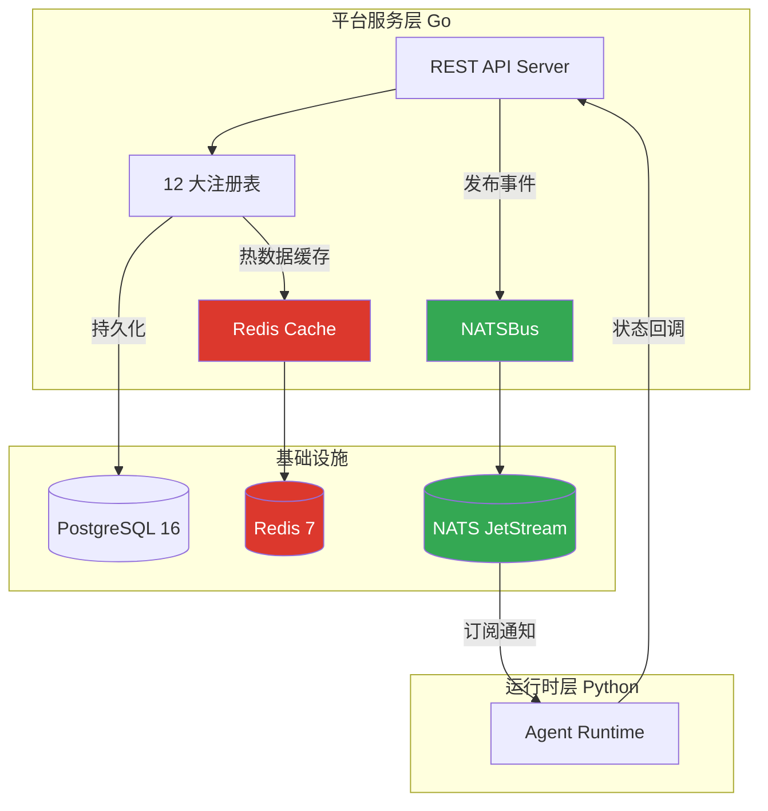
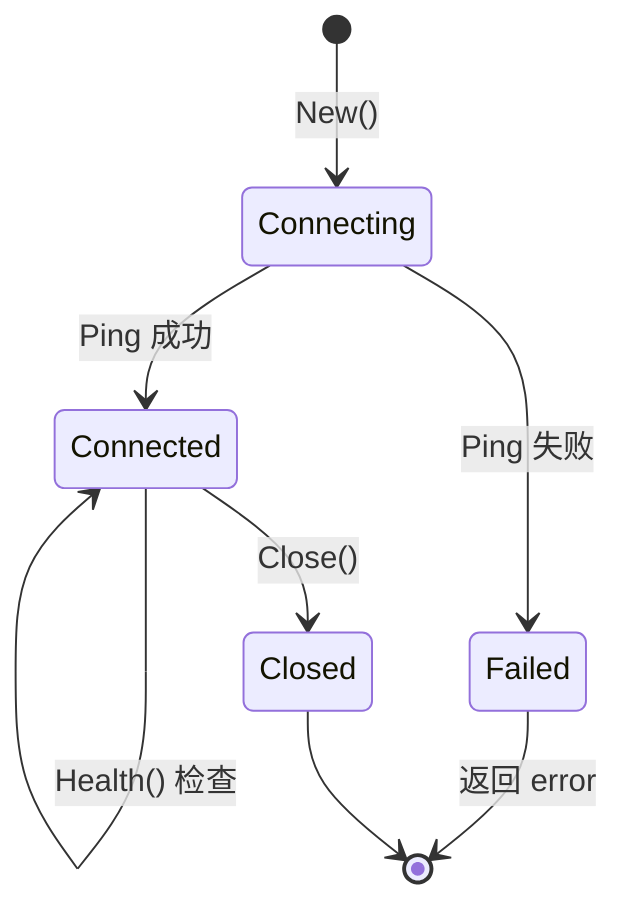
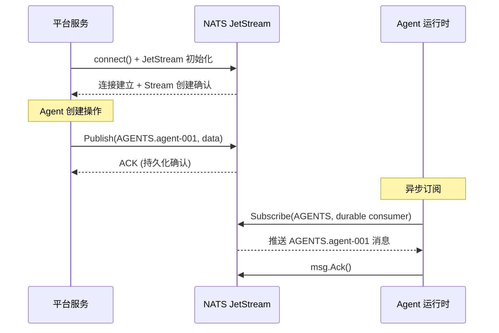

ResolveAgent 平台在**数据存储与注册表**体系中引入了两个关键的中间件基础设施：**Redis 缓存**负责高频读写的键值存储与会话管理，**NATS JetStream 事件总线**负责服务间异步消息通信与事件驱动编排。二者共同构成了平台"**热数据加速 + 事件解耦**"的双引擎架构——Redis 缓解 PostgreSQL 的读取压力，NATS 消除平台层与运行时层之间的同步耦合。本文将从接口设计、连接管理、配置体系、容器部署和健康检查五个维度，深入剖析这两个基础设施的集成模式。

Sources: [types.go](pkg/config/types.go#L58-L68), [event.go](pkg/event/event.go#L1-L23), [store.go](pkg/store/store.go#L1-L14)

## 架构定位：缓存层与事件层的协作关系

在 ResolveAgent 的三层微服务架构中，Redis 和 NATS 各自承担不同的技术职责。Redis 作为**热数据缓存**位于平台服务层与 PostgreSQL 之间，缓存 Agent 定义、Skill 清单等频繁访问的元数据；NATS 作为**异步事件总线**横跨平台层与运行时层，在 Agent 生命周期事件（创建、执行、销毁）发生时进行跨服务通知。下方的架构关系图展示了它们在整个数据流中的位置：



这一设计的核心原则是**关注点分离**：Redis 只关心数据的快速读写，NATS 只关心消息的可靠传递。两者不直接交互，而是通过平台服务层中的各自客户端封装进行间接协调。

Sources: [server.go](pkg/server/server.go#L20-L40), [docker-compose.yaml](deploy/docker-compose/docker-compose.yaml#L15-L18)

## Redis 缓存层：键值存储抽象

### 接口设计与核心操作

Redis 缓存层由 `pkg/store/redis` 包中的 `Cache` 结构体实现，它封装了 `go-redis/v9` 客户端，提供了一套面向业务场景的简洁 API。整个缓存层的设计遵循**最小接口原则**——只暴露项目实际需要的六个操作，而非 Redis 全部 200+ 命令：

| 操作方法 | 签名 | 用途 |
|---------|------|------|
| **Get** | `(ctx, key) → (string, error)` | 获取字符串值，键不存在返回 `key not found` 错误 |
| **Set** | `(ctx, key, value, expiration) → error` | 存储 KV 对，支持 TTL 过期策略 |
| **Delete** | `(ctx, key) → error` | 删除指定键 |
| **Exists** | `(ctx, key) → (bool, error)` | 判断键是否存在（基于 `EXISTS` 命令） |
| **GetJSON** | `(ctx, key, dest) → error` | 获取并反序列化 JSON 结构化数据 |
| **SetJSON** | `(ctx, key, value, expiration) → error` | 序列化结构体并存储为 JSON 字符串 |

其中 `GetJSON`/`SetJSON` 这对组合方法尤为关键——它们在内部完成 `json.Marshal`/`json.Unmarshal` 转换，使调用方无需关心序列化细节，直接以 Go 结构体与缓存交互。这种设计将**数据编码关注点**下沉到缓存层，大幅简化了上层注册表的缓存逻辑。

Sources: [redis.go](pkg/store/redis/redis.go#L14-L139)

### 连接池与生命周期管理

`Cache` 结构体通过 `New()` 构造函数完成初始化，其连接建立过程包含两个关键步骤：首先创建 `redis.Client` 实例并配置连接池（固定大小为 10），然后执行 `Ping` 命令验证连接可用性。整个生命周期遵循 `New → Health → Close` 三阶段模式：



连接池大小 `PoolSize: 10` 是当前硬编码值，适用于中小规模并发场景。在生产环境中，若 Agent 执行并发量显著增加，可考虑将其提升为可配置参数。值得注意的是，`Close()` 方法是**幂等的**——多次调用不会引发错误，因为它在关闭前检查 `client != nil`。

Sources: [redis.go](pkg/store/redis/redis.go#L23-L79)

### 错误处理策略

缓存层采用**包装式错误传播**（error wrapping）策略，所有错误都通过 `fmt.Errorf("...: %w", err)` 添加上下文信息后向上抛出。这种做法的精妙之处在于：调用方既能通过错误消息了解失败的操作类型（如 "failed to get key" vs "failed to marshal json"），又能通过 `errors.Is()` 或 `errors.As()` 匹配底层 `redis.Nil` 错误以区分"键不存在"和"连接故障"两种截然不同的场景。

Sources: [redis.go](pkg/store/redis/redis.go#L82-L116)

## NATS 事件总线：JetStream 持久化消息流

### 事件模型与总线接口

NATS 事件总线的核心抽象分为两层：底层的 `Event` 数据模型和上层的 `Bus` 接口契约。`Event` 结构体包含三个字段——`Type`（事件类型，如 "AGENTS"）、`Subject`（事件主体标识，如 Agent ID）和 `Data`（任意键值载荷）。`Bus` 接口则定义了三个方法——`Publish`、`Subscribe` 和 `Close`——构成了一个经典的生产者-消费者抽象。

这种接口设计的一个关键优势是**可测试性**：`Bus` 接口可以被轻量级的 `mockBus` 替代，使平台服务层的单元测试无需依赖真实的 NATS 服务器。测试代码中正是通过 `var _ Bus = (*mockBus)(nil)` 编译期断言来验证接口兼容性的。

Sources: [event.go](pkg/event/event.go#L8-L22), [event_test.go](pkg/event/event_test.go#L26-L37)

### JetStream Stream 架构

NATSBus 使用 **NATS JetStream** 而非传统的 Core NATS，这一选择带来了持久化存储、消息重放和至少一次投递保证。在 `connect()` 方法中，系统自动创建四个预定义 Stream：

| Stream 名称 | Subject 模式 | 消息保留策略 | 存储后端 | 用途 |
|------------|-------------|------------|---------|------|
| **AGENTS** | `AGENTS.*` | 24 小时 | 文件存储 | Agent 生命周期事件 |
| **SKILLS** | `SKILLS.*` | 24 小时 | 文件存储 | Skill 注册/注销事件 |
| **WORKFLOWS** | `WORKFLOWS.*` | 24 小时 | 文件存储 | 工作流执行事件 |
| **EXECUTIONS** | `EXECUTIONS.*` | 24 小时 | 文件存储 | Agent 执行结果事件 |

每个 Stream 的 Subject 采用 `{STREAM}.*` 通配符模式——这意味着 `AGENTS` Stream 可以接收 `AGENTS.created`、`AGENTS.deleted`、`AGENTS.executed` 等多种事件。`MaxAge: 24 * time.Hour` 确保事件数据不会无限积累，而 `FileStorage` 相比内存存储提供了进程重启后的数据恢复能力。Stream 创建是**幂等的**：如果 Stream 已存在（`nats.ErrStreamNameAlreadyInUse`），系统仅记录 Debug 日志并继续。

Sources: [nats.go](pkg/event/nats.go#L69-L96)

### 发布与订阅机制

事件发布通过 `Publish()` 和 `PublishData()` 两个方法实现。`Publish()` 接受标准 `Event` 结构体，将 `Type` 和 `Subject` 组合为完整 Subject（如 `AGENTS.agent-123`），然后通过 JetStream 发布。`PublishData()` 是一个便捷方法，直接接受类型字符串和任意数据载荷，适用于不需要完整 Event 封装的场景。

订阅机制支持**异步回调**和**同步拉取**两种模式。异步订阅通过 `Subscribe()` 方法实现，它创建一个 Durable Consumer（命名规则：`{eventType}-consumer`），确保消息在消费者重启后不会丢失。关键实现细节包括：

- **手动确认（Manual Ack）**：消息处理成功后显式调用 `msg.Ack()`，处理失败时调用 `msg.Nak()` 触发重投递
- **Context 驱动取消**：通过独立的 goroutine 监听 `ctx.Done()` 信号，优雅取消订阅
- **反序列化容错**：如果消息体不是有效的 JSON，记录错误日志并 Nak 消息，避免毒消息阻塞

Sources: [nats.go](pkg/event/nats.go#L98-L178)

### 连接可靠性配置

NATSBus 的连接选项体现了**弹性设计**理念。通过 `nats.ReconnectWait(time.Second)` 设置 1 秒重连间隔，通过 `nats.MaxReconnects(10)` 允许最多 10 次重连尝试。连接名称设为 `"ResolveAgent Event Bus"`，在 NATS 监控面板中可清晰识别。这种配置在容器化环境中尤为重要——当 NATS 容器短暂重启时，平台服务无需崩溃即可自动恢复连接。



Sources: [nats.go](pkg/event/nats.go#L37-L67)

## 配置体系：Viper 双通道加载

### 配置结构定义

Redis 和 NATS 的连接参数在 `Config` 结构体中作为顶级字段独立定义，各自拥有简洁的配置子结构。`RedisConfig` 包含地址、密码和数据库编号三个字段；`NATSConfig` 仅包含一个 URL 字段。这种极简设计反映了两个基础设施的"开箱即用"定位——大多数部署场景下使用默认值即可工作。

| 配置项 | 类型 | 默认值 | 环境变量 |
|-------|------|-------|---------|
| `redis.addr` | string | `localhost:6379` | `RESOLVEAGENT_REDIS_ADDR` |
| `redis.password` | string | _(空)_ | `RESOLVEAGENT_REDIS_PASSWORD` |
| `redis.db` | int | `0` | `RESOLVEAGENT_REDIS_DB` |
| `nats.url` | string | `nats://localhost:4222` | `RESOLVEAGENT_NATS_URL` |

配置加载通过 **Viper** 库实现双通道机制：优先读取 YAML 配置文件（如 `configs/resolveagent.yaml`），然后通过 `AutomaticEnv()` 让环境变量覆盖同名配置项。环境变量前缀为 `RESOLVEAGENT_`，分隔符用下划线替代点号（如 `redis.addr` → `RESOLVEAGENT_REDIS_ADDR`）。这种模式完美适配 Docker Compose 和 Kubernetes 的环境变量注入方式。

Sources: [types.go](pkg/config/types.go#L58-L68), [config.go](pkg/config/config.go#L11-L72)

### 配置文件示例

在 `configs/resolveagent.yaml` 中，Redis 和 NATS 的配置段落极为简洁，仅包含连接必需的参数。Redis 未设置密码（本地开发模式），使用默认数据库 0；NATS 使用标准协议地址：

```yaml
redis:
  addr: "localhost:6379"
  db: 0

nats:
  url: "nats://localhost:4222"
```

在容器化部署中，这些值通过 Docker Compose 的 `environment` 字段动态覆盖，Redis 地址变为 `redis:6379`（Docker 内部 DNS），NATS 地址变为 `nats://nats:4222`。这种"默认本地 + 覆盖容器"的配置策略确保了同一套代码在开发与生产环境中的无缝切换。

Sources: [resolveagent.yaml](configs/resolveagent.yaml#L17-L22), [docker-compose.yaml](deploy/docker-compose/docker-compose.yaml#L50-L55)

## 容器化部署：依赖服务编排

### Docker Compose 基础设施层

Redis 和 NATS 作为基础设施依赖，在三个不同场景的 Docker Compose 文件中有不同的配置策略。**开发依赖文件** `docker-compose.deps.yaml` 提供最小化配置，仅声明端口映射；**生产编排文件** `docker-compose.yaml` 则添加了健康检查、资源限制、日志配置和网络隔离。

| 配置维度 | Redis (生产) | NATS (生产) |
|---------|-------------|------------|
| **镜像** | `redis:7-alpine` | `nats:2-alpine` |
| **端口** | 6379 (客户端) | 4222 (客户端) + 8222 (监控) |
| **数据持久化** | `redis_data` 卷 (AOF 模式) | `nats_data` 卷 (文件存储) |
| **健康检查** | `redis-cli ping` (10s 间隔) | _(依赖进程存活)_ |
| **内存策略** | `maxmemory 256mb`, `allkeys-lru` | — |
| **持久化策略** | AOF + everysec fsync | JetStream FileStorage |
| **启动命令** | 自定义 redis-server 参数 | `--js --store_dir /data -m 8222` |

Redis 的生产配置中，`--maxmemory 256mb --maxmemory-policy allkeys-lru` 组合实现了**内存安全阀**——当缓存数据超过 256MB 时自动淘汰最近最少使用的键。`--appendonly yes --appendfsync everysec` 启用了 AOF 持久化，每秒 fsync 一次，在性能与数据安全之间取得平衡。NATS 的 `--js` 参数启用 JetStream 模式，`-m 8222` 开放 HTTP 监控端点。

Sources: [docker-compose.yaml](deploy/docker-compose/docker-compose.yaml#L167-L210), [docker-compose.deps.yaml](deploy/docker-compose/docker-compose.deps.yaml#L15-L25)

### 服务依赖与健康检查

在 Docker Compose 的服务依赖关系中，`platform` 服务通过 `depends_on` 声明对 `redis` 和 `nats` 的依赖。Redis 配置了 `condition: service_healthy`（等待健康检查通过），而 NATS 使用 `condition: service_started`（仅等待容器启动）。这一差异源于 NATS 的轻量级特性——它启动极快且内部已有 JetStream 的 Stream 幂等创建机制，无需额外的健康探测。

本地开发脚本 `scripts/start-local.sh` 提供了更精细的就绪等待逻辑：对 Redis 执行 `redis-cli ping` 轮询（最多 10 次，每次 2 秒），确保 Redis 服务真正可响应后才启动上层应用。

Sources: [docker-compose.yaml](deploy/docker-compose/docker-compose.yaml#L70-L76), [start-local.sh](scripts/start-local.sh#L284-L295)

## 健康检查：统一探针集成

### 组件级健康检查

Redis Cache 和 NATS Bus 各自实现了健康检查方法，但接口签名略有不同：Redis 使用标准 `Health(ctx context.Context) error` 签名（符合 `Store` 接口），而 NATS 使用无 Context 的 `Health() error` 签名。两者都通过**实际操作验证连接可用性**——Redis 执行 `Ping` 命令，NATS 检查 `conn.IsConnected()` 状态。

```go
// Redis 健康检查 — 通过实际命令验证
func (c *Cache) Health(ctx context.Context) error {
    if c.client == nil { return fmt.Errorf("not connected") }
    return c.client.Ping(ctx).Err()
}

// NATS 健康检查 — 通过连接状态验证
func (b *NATSBus) Health() error {
    if b.conn == nil || !b.conn.IsConnected() {
        return fmt.Errorf("not connected to nats")
    }
    return nil
}
```

### 平台级健康聚合

平台层通过 `pkg/health` 包的 `Checker` 聚合器实现统一的健康探针端点。`Checker` 支持注册多个命名健康检查函数，执行后聚合为 `UP` / `DEGRADED` / `DOWN` 三级状态。`LivenessHandler`（`/healthz`）始终返回 200，表示进程存活；`ReadinessHandler`（`/readyz`）则执行所有注册的组件检查，全部 UP 返回 200，否则返回 503。这种设计使 Kubernetes 可以精确区分"进程存活但依赖不可用"和"进程已死"两种故障模式，避免不必要的 Pod 重启。

Sources: [redis.go](pkg/store/redis/redis.go#L57-L68), [nats.go](pkg/event/nats.go#L196-L201), [health.go](pkg/health/health.go#L80-L103)

## 依赖库版本与生态

项目使用以下 Go 客户端库与 Redis 和 NATS 交互：

| 依赖库 | 版本 | 用途 |
|-------|------|------|
| `github.com/redis/go-redis/v9` | v9.18.0 | Redis 客户端（官方推荐社区版） |
| `github.com/nats-io/nats.go` | v1.50.0 | NATS 客户端（官方 Go 客户端） |
| `github.com/nats-io/nkeys` | v0.4.15 | NATS 认证密钥管理（间接依赖） |
| `github.com/nats-io/nuid` | v1.0.1 | NATS 唯一 ID 生成（间接依赖） |

`go-redis/v9` 是 Redis 官方推荐的 Go 客户端，支持 Redis 7 的全部特性；`nats.go` v1.50.0 是 NATS 生态的官方 Go 客户端，对 JetStream 提供完整的一等公民支持。

Sources: [go.mod](go.mod#L10-L12)

## 总结与进阶阅读

Redis 缓存层和 NATS 事件总线在 ResolveAgent 平台中各司其职，共同构建了"**读写加速 + 事件解耦**"的基础设施双支柱。Redis 通过简洁的六操作 API 为 12 大注册表提供热数据缓存能力，NATS 通过 JetStream 的持久化 Stream 为跨服务通信提供可靠的消息传递保障。两者均遵循"**接口抽象 → 配置驱动 → 健康可查 → 容器就绪**"的工程实践，确保在本地开发和 Kubernetes 生产环境中的行为一致性。

以下是相关的进阶阅读路径：

- 了解 12 大注册表如何使用缓存后端：[12 大注册表体系：统一 CRUD 接口与内存/Postgres 双后端](24-12-da-zhu-ce-biao-ti-xi-tong-crud-jie-kou-yu-nei-cun-postgres-shuang-hou-duan)
- 了解 PostgreSQL 持久化层的完整设计：[数据库 Schema 与迁移：10 步迁移脚本与种子数据](25-shu-ju-ku-schema-yu-qian-yi-10-bu-qian-yi-jiao-ben-yu-chong-zi-shu-ju)
- 了解全栈容器化部署细节：[Docker Compose 部署：全栈容器化编排](29-docker-compose-bu-shu-quan-zhan-rong-qi-hua-bian-pai)
- 了解 Kubernetes 中的健康探针配置：[Kubernetes 与 Helm Chart 生产部署](30-kubernetes-yu-helm-chart-sheng-chan-bu-shu)
- 了解可观测性如何监控 Redis 和 NATS 的指标：[可观测性：OpenTelemetry 指标、日志与链路追踪](31-ke-guan-ce-xing-opentelemetry-zhi-biao-ri-zhi-yu-lian-lu-zhui-zong)