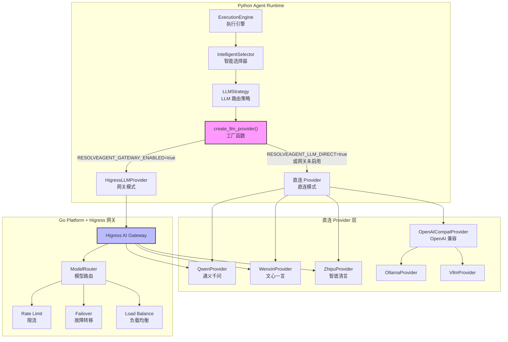

ResolveAgent 平台需要在运行时灵活调用多家 LLM 提供商的服务——阿里云通义千问、百度文心一言、智谱清言 GLM、Kimi/Moonshot，以及任何兼容 OpenAI 格式的端点。本文深入解析平台的 **LLM 提供者抽象层**（LLM Provider Abstraction Layer），它通过一个统一的 `LLMProvider` 抽象基类和工厂模式，将不同厂商的 API 差异封装在各自的 Provider 实现中，使上层业务代码（智能选择器、执行引擎等）无需关心底层认证方式、请求格式或响应解析的差异。同时，Go 平台侧的 `ModelRouter` 配合 Higress 网关，为所有 LLM 调用提供集中化的流量管理、限流与故障转移能力。

Sources: [provider.py](python/src/resolveagent/llm/provider.py#L1-L80) · [model_config.py](python/src/resolveagent/llm/model_config.py#L1-L83) · [model_router.go](pkg/gateway/model_router.go#L1-L64)

## 架构全景：双模式统一接入

平台支持两种 LLM 调用模式，通过环境变量在运行时决定路由策略：**直连模式**（Direct Mode）和**网关模式**（Gateway Mode）。直连模式适用于本地开发或单机部署，Python 运行时直接与各 LLM 厂商 API 通信；网关模式适用于生产环境，所有调用经由 Higress AI 网关统一代理，实现限流、认证与故障转移。无论哪种模式，上层代码都通过同一个 `LLMProvider` 接口交互。



Sources: [higress_provider.py](python/src/resolveagent/llm/higress_provider.py#L404-L446) · [llm_strategy.py](python/src/resolveagent/selector/strategies/llm_strategy.py#L205-L230) · [engine.py](python/src/resolveagent/runtime/engine.py#L41-L54)

## 核心抽象：LLMProvider 基类

整个提供者层的设计起点是 `LLMProvider` 抽象基类。它定义了两个核心异步方法——`chat()` 返回完整响应，`chat_stream()` 以异步生成器形式逐块返回内容。所有具体提供者都必须实现这两个方法，并遵循统一的数据模型 `ChatMessage` 和 `ChatResponse`。

| 类型 | 字段 | 说明 |
|------|------|------|
| **ChatMessage** | `role: str` | 消息角色（user / assistant / system） |
| | `content: str` | 消息文本内容 |
| **ChatResponse** | `content: str` | LLM 生成的文本 |
| | `model: str` | 实际使用的模型标识 |
| | `usage: dict[str, int]` | Token 用量（prompt / completion / total） |
| | `finish_reason: str` | 终止原因（stop / length） |

`chat()` 方法签名中的 `model`、`temperature`、`max_tokens` 参数均为可选——若调用方不指定，各 Provider 使用自身默认值。这种设计让上层代码可以在需要时覆盖参数，而不必关心默认配置的来源。

Sources: [provider.py](python/src/resolveagent/llm/provider.py#L14-L79)

## 四大提供者实现

### 通义千问（QwenProvider）—— DashScope 兼容模式

`QwenProvider` 通过阿里云 DashScope API 的 **OpenAI 兼容模式** 接入，默认端点为 `https://dashscope.aliyuncs.com/compatible-mode/v1`。这意味着其请求和响应格式完全遵循 OpenAI 的 `/chat/completions` 规范——消息结构为 `{"role", "content"}` 数组，响应使用 `choices[0].message.content` 路径提取内容。认证采用 Bearer Token 方式，API Key 从 `DASHSCOPE_API_KEY` 环境变量或构造参数获取。

流式调用通过 SSE（Server-Sent Events）协议实现：解析 `data: ` 前缀行，检测 `[DONE]` 终止信号，从 `choices[0].delta.content` 提取增量内容。

Sources: [qwen.py](python/src/resolveagent/llm/qwen.py#L1-L234)

### 文心一言（WenxinProvider）—— 千帆平台 OAuth 模型

`WenxinProvider` 是四个提供者中 **API 协议差异最大** 的一个。百度千帆平台采用双 Key 认证（`api_key` + `secret_key`），需先通过 OAuth 2.0 `client_credentials` 流程获取 `access_token`，然后以 URL 查询参数方式传递。此外，不同模型对应不同的 API 端点路径，通过内部映射表 `_get_model_endpoint()` 转换：

| 模型名 | 端点标识 |
|--------|----------|
| ernie-4.0 | `completions_pro` |
| ernie-4.0-turbo | `completions_pro_preemptible` |
| ernie-3.5 | `completions` |
| ernie-speed | `ernie-speed` |
| ernie-lite | `ernie-lite` |

响应格式也与 OpenAI 不同：内容字段为 `result`（非 `content`），终止标志为 `is_end`（非 `finish_reason`），Token 用量字段名相同但位于顶层。WenxinProvider 在内部完成这些差异转换，对外仍输出标准的 `ChatResponse`。

Sources: [wenxin.py](python/src/resolveagent/llm/wenxin.py#L1-L244)

### 智谱清言（ZhipuProvider）—— JWT 认证 + OpenAI 格式

`ZhipuProvider` 使用智谱 AI 开放平台的 API，端点为 `https://open.bigmodel.cn/api/paas/v4`。其认证机制较为独特：通过 PyJWT 库生成 HS256 签名的 JWT Token，Payload 包含 `api_key`、`exp`（过期时间，默认 1 小时）和 `timestamp`，并以 API Key 本身作为签名密钥。请求和响应格式与 OpenAI 兼容——`/chat/completions` 路径、`choices[0].message.content` 响应路径，以及标准的 SSE 流式协议。

Sources: [zhipu.py](python/src/resolveagent/llm/zhipu.py#L1-L258)

### OpenAI 兼容提供者（OpenAICompatProvider）—— 通用适配器

`OpenAICompatProvider` 是一个 **万能适配器**，适用于任何提供 OpenAI 格式 API 的服务——包括 OpenAI 官方、Moonshot/Kimi、vLLM、Ollama、LM Studio 等。它通过 `base_url` 参数适配不同端点，支持 Bearer Token 认证。

一个值得注意的实现细节：针对 Kimi K2.5 系列模型的"思考模式"，该提供者内置了温度值修正逻辑——当 `thinking.type` 为 `disabled` 时强制使用 `0.6`，否则使用 `1.0`，以匹配模型对温度参数的严格要求。

平台还提供了两个便捷子类：`OllamaProvider`（本地推理，自动追加 `/v1` 路径）和 `VllmProvider`（vLLM 自托管服务），它们都继承自 `OpenAICompatProvider`，仅预设了不同的默认端点。

Sources: [openai_compat.py](python/src/resolveagent/llm/openai_compat.py#L1-L287)

## 提供者差异对比

| 维度 | QwenProvider | WenxinProvider | ZhipuProvider | OpenAICompatProvider |
|------|-------------|----------------|---------------|---------------------|
| **API 格式** | OpenAI 兼容 | 百度私有格式 | OpenAI 兼容 | OpenAI 标准 |
| **认证方式** | Bearer Token | OAuth 2.0 + access_token | JWT（HS256） | Bearer Token |
| **认证参数** | 1 个 Key | 2 个 Key（api + secret） | 1 个 Key | 1 个 Key |
| **响应内容字段** | `choices[0].message.content` | `result` | `choices[0].message.content` | `choices[0].message.content` |
| **流式增量字段** | `choices[0].delta.content` | `result` | `choices[0].delta.content` | `choices[0].delta.content` |
| **终止信号** | `data: [DONE]` | `is_end: true` | `data: [DONE]` | `data: [DONE]` |
| **Token 用量字段** | `usage.total_tokens` | `usage.total_tokens` | `usage.total_tokens` | `usage.total_tokens` |
| **特殊处理** | 无 | 模型→端点映射 | JWT Token 生成 | K2.5 温度修正 |

Sources: [qwen.py](python/src/resolveagent/llm/qwen.py#L80-L125) · [wenxin.py](python/src/resolveagent/llm/wenxin.py#L67-L151) · [zhipu.py](python/src/resolveagent/llm/zhipu.py#L42-L150) · [openai_compat.py](python/src/resolveagent/llm/openai_compat.py#L59-L143)

## 模型注册表与工厂方法

`ModelRegistry` 是连接配置层与提供者层的桥梁。每个模型以 `ModelConfig` 结构注册，包含 `id`（模型标识）、`provider`（提供者类型）、`model_name`（厂商模型名）、`api_key`、`base_url` 等字段。`get_provider()` 工厂方法根据 `provider` 字段的值，延迟导入（lazy import）对应的提供者类并实例化——这种设计避免了启动时必须安装所有提供者依赖的问题。

工厂路由逻辑如下：`qwen` → `QwenProvider`、`wenxin` → `WenxinProvider`、`zhipu` → `ZhipuProvider`、`kimi` → `OpenAICompatProvider`（预设 Moonshot 端点）、其他所有值 → `OpenAICompatProvider`（通用回退）。

```yaml
# configs/models.yaml — 模型注册表示例
models:
  - id: qwen-turbo
    provider: qwen
    model_name: qwen-turbo
    max_tokens: 8192
    default_temperature: 0.7

  - id: ernie-4
    provider: wenxin
    model_name: ernie-4.0-8k
    max_tokens: 8192

  - id: glm-4
    provider: zhipu
    model_name: glm-4
    max_tokens: 8192

  - id: moonshot-v1-128k
    provider: kimi
    model_name: moonshot-v1-128k
    base_url: https://api.moonshot.cn/v1
    max_tokens: 131072
```

Sources: [model_config.py](python/src/resolveagent/llm/model_config.py#L1-L83) · [models.yaml](configs/models.yaml#L1-L52)

## 运行时工厂：直连 vs 网关模式

`create_llm_provider()` 是系统中最顶层的工厂函数，由智能选择器的 `LLMStrategy` 等组件调用。它根据两个环境变量决定路由策略：

- **`RESOLVEAGENT_LLM_DIRECT`** 设为 `true`：强制直连模式，创建 `OpenAICompatProvider`
- **`RESOLVEAGENT_GATEWAY_ENABLED`** 设为 `true`：网关模式，创建 `HigressLLMProvider`
- **两者均未设置**（默认）：回退到直连模式

直连模式下，API Key 依次从 `KIMI_API_KEY` → `RESOLVEAGENT_API_KEY` 获取，Base URL 由 `LLM_BASE_URL` 控制（默认 `https://api.moonshot.cn/v1`），模型由 `LLM_DEFAULT_MODEL` 控制（默认 `qwen-plus`）。

Sources: [higress_provider.py](python/src/resolveagent/llm/higress_provider.py#L404-L446) · [.env.example](.env.example#L44-L53)

## Go 侧模型路由：ModelRouter 与 Higress 集成

在网关模式下，Go 平台服务层的 `ModelRouter` 承担 LLM 流量管理的控制平面角色。每个注册模型以 `ModelRoute` 结构表示，包含：

| 结构体 | 字段 | 作用 |
|--------|------|------|
| **ModelRoute** | `ModelID` | 模型唯一标识 |
| | `Provider` | 提供者类型 |
| | `UpstreamURL` | 上游 API 地址 |
| | `RateLimit` | 令牌/请求限流配置 |
| | `Fallback` | 故障转移（备用模型列表） |
| | `Transform` | 请求改写（Header 增删、路径重写） |
| **ModelRateLimit** | `TokensPerMinute` | 每分钟令牌上限 |
| | `RequestsPerMinute` | 每分钟请求数上限 |
| | `Burst` | 突发流量容忍度 |
| **ModelFallback** | `Models []string` | 有序的备用模型列表 |
| | `RetryAttempts` | 重试次数 |
| | `Conditions` | 触发条件（timeout / rate_limit / error） |

`ModelRouter` 通过 `modelToHigressRoute()` 将 `ModelRoute` 转换为 Higress 网关的 `HigressRoute` 配置，然后调用 `Client.CreateRoute()` 注册到网关。`syncProviderRoutes()` 方法还会为三个主要提供商（qwen、wenxin、zhipu）预注册基础路由，实现路径改写——例如 `/llm/qwen` 重写到 `https://dashscope.aliyuncs.com/compatible-mode/v1/chat/completions`。

Sources: [model_router.go](pkg/gateway/model_router.go#L10-L264) · [client.go](pkg/gateway/client.go#L56-L99) · [types.go](pkg/config/types.go#L76-L106)

## 环境变量与配置参考

以下是与多模型接口相关的全部配置项：

| 环境变量 | 用途 | 默认值 |
|----------|------|--------|
| `DASHSCOPE_API_KEY` | 通义千问 API Key | 无 |
| `WENXIN_API_KEY` | 文心一言 API Key | 无 |
| `WENXIN_SECRET_KEY` | 文心一言 Secret Key | 无 |
| `ZHIPU_API_KEY` | 智谱清言 API Key | 无 |
| `KIMI_API_KEY` | Moonshot/Kimi API Key | 无 |
| `OPENAI_API_KEY` | OpenAI API Key | 无 |
| `OPENAI_BASE_URL` | OpenAI 兼容端点 | `https://api.openai.com/v1` |
| `RESOLVEAGENT_LLM_DIRECT` | 强制直连模式 | `false` |
| `RESOLVEAGENT_GATEWAY_ENABLED` | 启用网关模式 | `false` |
| `RESOLVEAGENT_API_KEY` | 平台统一 API Key（回退） | 无 |
| `LLM_BASE_URL` | 直连模式下默认 Base URL | `https://api.moonshot.cn/v1` |
| `LLM_DEFAULT_MODEL` | 直连模式下默认模型 | `qwen-plus` |
| `HIGRESS_GATEWAY_URL` | Higress 网关地址 | `http://localhost:8888` |
| `OLLAMA_BASE_URL` | Ollama 本地端点 | `http://localhost:11434` |
| `VLLM_BASE_URL` | vLLM 端点 | `http://localhost:8000/v1` |

Sources: [.env.example](.env.example#L44-L53) · [resolveagent.yaml](configs/resolveagent.yaml#L29-L62) · [openai_compat.py](python/src/resolveagent/llm/openai_compat.py#L36-L57) · [qwen.py](python/src/resolveagent/llm/qwen.py#L30-L41) · [wenxin.py](python/src/resolveagent/llm/wenxin.py#L30-L42) · [zhipu.py](python/src/resolveagent/llm/zhipu.py#L31-L40)

## 扩展新的提供者

当需要接入新的 LLM 厂商时，遵循以下步骤：

1. **在 `python/src/resolveagent/llm/` 下创建新的提供者文件**，继承 `LLMProvider`，实现 `chat()` 和 `chat_stream()` 两个异步方法，确保返回标准的 `ChatResponse` 对象
2. **在 `ModelConfig` 的 `provider` 字段中注册新类型**，更新 `ModelRegistry.get_provider()` 工厂方法添加新的分支
3. **在 `configs/models.yaml` 中声明模型**，指定 `id`、`provider`、`model_name` 及相关参数
4. **如果使用网关模式**，在 Go 侧 `ModelRouter.syncProviderRoutes()` 中添加新的提供商路由条目

这种 **Provider 模式 + 注册表 + 工厂方法** 的三层架构，使得接入新厂商仅涉及增量代码，无需修改任何现有业务逻辑。

Sources: [model_config.py](python/src/resolveagent/llm/model_config.py#L42-L82) · [model_router.go](pkg/gateway/model_router.go#L165-L200)

## 延伸阅读

- [Higress AI 网关集成：模型路由与网关认证](28-higress-ai-wang-guan-ji-cheng-mo-xing-lu-you-yu-wang-guan-ren-zheng) — 深入了解网关模式下的 Higress 配置、路由同步与认证流程
- [智能路由决策引擎：意图分析与三阶段处理流程](8-zhi-neng-lu-you-jue-ce-yin-qing-yi-tu-fen-xi-yu-san-jie-duan-chu-li-liu-cheng) — 了解 LLM 提供者如何被智能选择器的 LLM 策略所调用
- [选择器适配器：Hook 适配与 Skill 适配模式](10-xuan-ze-qi-gua-pei-qi-hook-gua-pei-yu-skill-gua-pei-mo-shi) — 了解选择器如何在不同适配模式下使用 LLM 能力