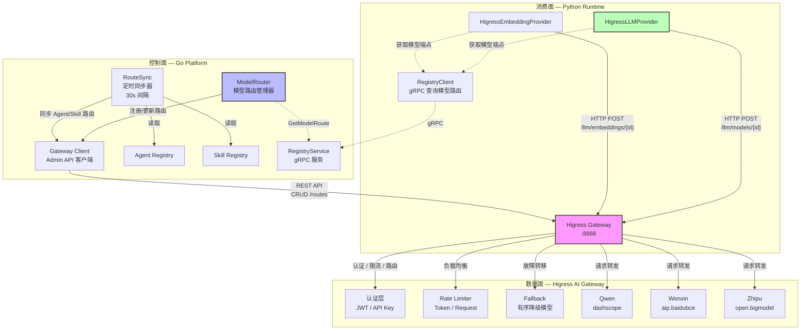
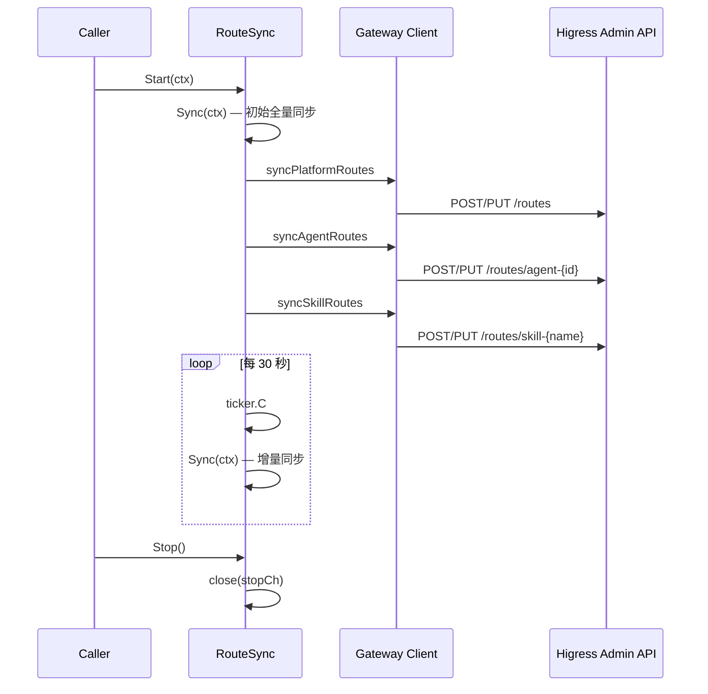
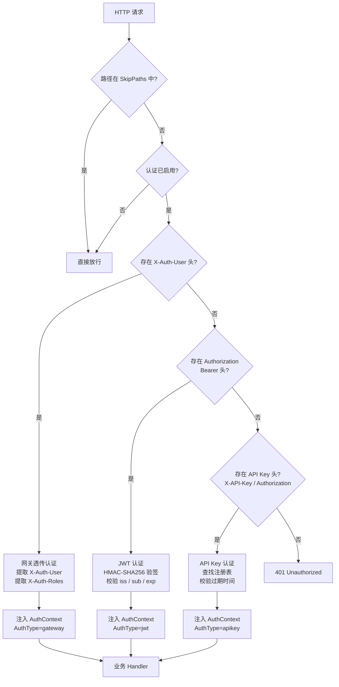

ResolveAgent 为生产级 LLM 流量治理设计了一套完整的 Higress AI 网关集成架构。该架构通过 `pkg/gateway/` 包实现 Go 平台层与 Higress 管理面的路由同步，通过 `HigressLLMProvider` 实现 Python 运行时到网关的请求代理，并通过 `AuthMiddleware` 实现统一的三层认证体系。本文将深入剖析**模型路由控制面**（`ModelRouter`）、**路由同步机制**（`RouteSync`）、**网关客户端**（`Client`）和**认证中间件**（`AuthMiddleware`）的设计与实现，帮助高级开发者在理解架构原理的基础上进行二次开发与生产部署。

Sources: [client.go](pkg/gateway/client.go#L1-L21), [model_router.go](pkg/gateway/model_router.go#L1-L64), [route_sync.go](pkg/gateway/route_sync.go#L1-L27)

## 整体架构：三层集成模型

Higress 网关集成遵循 **"单一真相源"**（Single Source of Truth）设计原则：Go Registry 作为所有路由、服务、模型配置的唯一中心，通过定时同步机制将数据推送到 Higress 网关；Python Agent Runtime 通过 Higress 网关发起 LLM 调用，网关负责认证、限流、路由分发和故障转移。整个架构形成清晰的三层模型：**控制面**（Go Registry + RouteSync）、**数据面**（Higress Gateway）、**消费面**（Python HigressLLMProvider）。

Sources: [resolveagent.yaml](configs/resolveagent.yaml#L27-L62), [types.go](pkg/config/types.go#L75-L106)



Sources: [agentscope-higress-integration.md](docs/zh/agentscope-higress-integration.md#L7-L53), [registry_service.go](pkg/service/registry_service.go#L15-L58)

## 网关客户端：Higress Admin API 通信层

`Client` 是与 Higress Admin API 交互的唯一入口点，封装了路由和服务两类资源的完整 CRUD 操作。客户端通过标准 HTTP + JSON 与 Higress 管理面通信，所有请求设置了 30 秒超时以防止管理面阻塞。

### 核心数据模型

网关客户端定义了四组核心数据结构，分别对应路由、上游服务、URL 重写和限流策略：

| 数据结构 | 用途 | 关键字段 |
|-----------|------|----------|
| `HigressRoute` | 路由配置 | `Name`, `Path`, `PathType`（prefix/exact/regex）, `Methods`, `Upstream`, `RateLimiter`, `Retry` |
| `RouteUpstream` | 后端服务定义 | `ServiceName`, `ServicePort`, `ServiceHost`, `LoadBalancer`（round_robin/least_conn/random） |
| `RateLimiter` | 限流配置 | `RequestsPerSecond`, `Burst`, `Key`（ip / header:X-API-Key / jwt:sub） |
| `RetryPolicy` | 重试策略 | `Attempts`, `PerTryTimeout`, `RetryOn`（5xx / reset / connect-failure） |
| `HigressService` | 服务注册 | `Name`, `Namespace`, `Host`, `Port`, `Protocol`（http / grpc / http2） |

Sources: [client.go](pkg/gateway/client.go#L56-L99)

### API 操作矩阵

客户端提供了 7 个核心操作方法，覆盖路由和服务的完整生命周期：

| 方法 | HTTP 动词 | 路径 | 功能 |
|------|-----------|------|------|
| `CreateRoute` | `POST` | `/routes` | 创建路由，失败时尝试 `UpdateRoute` |
| `UpdateRoute` | `PUT` | `/routes/{name}` | 更新已有路由配置 |
| `DeleteRoute` | `DELETE` | `/routes/{name}` | 删除路由 |
| `GetRoute` | `GET` | `/routes/{name}` | 查询单条路由，404 返回 `nil` |
| `ListRoutes` | `GET` | `/routes` | 列出所有路由 |
| `RegisterService` | `POST` | `/services` | 注册上游服务 |
| `DeregisterService` | `DELETE` | `/services/{name}` | 注销服务 |

所有写操作通过 `doRouteRequest` 统一处理 JSON 序列化、请求发送和状态码校验，错误响应通过 `parseError` 解析原始错误消息体。值得注意的是，`GetRoute` 在收到 404 时返回 `(nil, nil)` 而非 error——这一设计使得上层逻辑可以用 `existing == nil` 作为"路由不存在"的判断依据，简化了 upsert 模式。

Sources: [client.go](pkg/gateway/client.go#L101-L273)

## 模型路由器：LLM 流量治理核心

`ModelRouter` 是 LLM 模型路由的控制面核心，管理着所有通过 Higress 网关分发的 LLM API 流量。它维护一个 `map[string]*ModelRoute` 的内存路由表，通过 `sync.RWMutex` 保护并发读写，并提供注册、注销、查询、批量同步和端点生成等操作。

### ModelRoute 数据模型

每个 `ModelRoute` 封装了一个 LLM 模型从注册到调用的完整元数据：

```go
type ModelRoute struct {
    Name        string            // 路由名称
    ModelID     string            // 模型标识，如 "qwen-plus"
    Provider    string            // 提供者: "qwen", "wenxin", "zhipu", "openai-compat"
    UpstreamURL string            // 上游 API 地址
    APIKey      string            // API 密钥
    Priority    int               // 路由优先级
    Enabled     bool              // 是否启用
    RateLimit   *ModelRateLimit   // 限流策略
    Fallback    *ModelFallback    // 故障转移配置
    Transform   *RequestTransform // 请求变换规则
}
```

Sources: [model_router.go](pkg/gateway/model_router.go#L10-L50)

### 限流与故障转移策略

`ModelRateLimit` 提供 Token 级别和请求级别的双重限流。在实际转换为 Higress 路由时，`RequestsPerMinute` 被折算为 `RequestsPerSecond`（除以 60），限流 Key 默认使用 `header:Authorization`——即按认证用户维度限流。

`ModelFallback` 定义了有序的降级模型列表和触发条件。当主模型返回 `timeout`、`rate_limit` 或 `error` 时，网关按列表顺序尝试备选模型，每次重试超时 30 秒。

| 配置维度 | ModelRateLimit | ModelFallback |
|----------|----------------|---------------|
| **限流粒度** | Token / 请求 | — |
| **限流 Key** | — | `header:Authorization` |
| **降级触发** | — | `timeout`, `rate_limit`, `error` |
| **重试超时** | — | 30s per try |
| **重试策略** | Burst 允许突发 | 有序模型列表 |

Sources: [model_router.go](pkg/gateway/model_router.go#L30-L50), [model_router.go](pkg/gateway/model_router.go#L224-L248)

### 路由注册与模型到 Higress 路由的映射

`RegisterModel` 方法的执行逻辑是：先将路由写入内存 map，然后调用 `modelToHigressRoute` 将 `ModelRoute` 转换为 `HigressRoute`，最后通过 `Client.CreateRoute` 推送到 Higress。如果 Create 失败（路由已存在），自动降级为 `UpdateRoute`。

`modelToHigressRoute` 的映射规则如下表所示：

| ModelRoute 字段 | → | HigressRoute 字段 | 转换规则 |
|-----------------|---|-------------------|----------|
| `ModelID` | → | `Name` | `fmt.Sprintf("llm-%s", route.ModelID)` |
| `ModelID` | → | `Path` | `/llm/models/{ModelID}` |
| `PathType` | → | 固定 `"prefix"` | — |
| `Methods` | → | `["POST"]` | LLM 调用仅需 POST |
| `UpstreamURL` | → | `ServiceHost` | 端口固定 443 |
| `RateLimit` | → | `RateLimiter` | RPM÷60→RPS, Key=`header:Authorization` |
| `Fallback` | → | `Retry` | RetryOn=`5xx,reset,connect-failure` |
| `Transform` | → | `Rewrite` | PathRewrite + AddHeaders |

Sources: [model_router.go](pkg/gateway/model_router.go#L87-L108), [model_router.go](pkg/gateway/model_router.go#L205-L250)

### 预置提供者路由

`syncProviderRoutes` 为三个预置 LLM 提供者创建基础路由，每个提供者有独立的路径前缀和上游地址：

| 提供者 | Higress 路径 | 上游地址 | API 路径重写 |
|--------|-------------|----------|-------------|
| **Qwen（通义千问）** | `/llm/qwen` | `https://dashscope.aliyuncs.com` | `/v1/chat/completions` |
| **Wenxin（文心一言）** | `/llm/wenxin` | `https://aip.baidubce.com` | `/rpc/2.0/ai_custom/v1/wenxinworkshop/chat` |
| **Zhipu（智谱清言）** | `/llm/zhipu` | `https://open.bigmodel.cn` | `/api/paas/v4/chat/completions` |

这些路由的 `Labels` 标记了 `component: "llm"` 和 `provider: "{name}"`，便于在 Higress 控制台按标签过滤和管理。

Sources: [model_router.go](pkg/gateway/model_router.go#L165-L202)

### 网关端点生成

`GetGatewayEndpoint` 是 Python 侧获取 Higress 网关入口的关键方法。传入空字符串时自动使用默认模型 `qwen-plus`，返回形如 `/llm/models/qwen-plus` 的相对路径。Python 的 `HigressLLMProvider` 将此路径与 `gateway_url` 拼接为完整 URL：

```
gateway_url + GetGatewayEndpoint("qwen-plus")
→ "http://localhost:8888" + "/llm/models/qwen-plus"
→ "http://localhost:8888/llm/models/qwen-plus"
```

Sources: [model_router.go](pkg/gateway/model_router.go#L257-L263)

## 路由同步器：Registry → Higress 定时推送

`RouteSync` 是 Go Registry 与 Higress 网关之间的桥梁，确保所有注册的 Agent、Skill 和平台服务都能通过网关正确路由。它以 30 秒为默认间隔执行三阶段同步：平台路由 → Agent 路由 → Skill 路由。

Sources: [route_sync.go](pkg/gateway/route_sync.go#L13-L27)

### 同步循环机制

`RouteSync` 的生命周期由 `Start`、`Stop` 和 `runSyncLoop` 三个方法控制。启动时立即执行一次全量同步，然后启动一个 goroutine 以 ticker 驱动周期性同步。停止通过 `stopCh` channel 实现，支持优雅退出：



Sources: [route_sync.go](pkg/gateway/route_sync.go#L70-L106)

### 三阶段同步详解

**阶段一：平台服务路由（`syncPlatformRoutes`）** 注册 5 条静态路由，将所有 API 请求指向 `resolveagent-platform:8080`：

| 路由名称 | 路径 | 方法 | 用途 |
|----------|------|------|------|
| `resolveagent-api-agents` | `/api/v1/agents` | GET,POST,PUT,DELETE | Agent 管理 API |
| `resolveagent-api-skills` | `/api/v1/skills` | GET,POST,PUT,DELETE | Skill 管理 API |
| `resolveagent-api-workflows` | `/api/v1/workflows` | GET,POST,PUT,DELETE | Workflow 管理 API |
| `resolveagent-api-rag` | `/api/v1/rag` | GET,POST | RAG 查询 API |
| `resolveagent-health` | `/health` | GET | 健康检查（exact 匹配） |

**阶段二：Agent 路由（`syncAgentRoutes`）** 从 `AgentRegistry.List()` 获取所有 Agent，为每个 Agent 创建指向 `resolveagent-runtime:9091` 的精确匹配路由，路径格式为 `/api/v1/agents/{agentID}/execute`。路由仅对 `status == "active"` 的 Agent 启用，Label 包含 `component: "agent"`、`agent_id` 和 `agent_type`。

**阶段三：Skill 路由（`syncSkillRoutes`）** 从 `SkillRegistry.List()` 获取所有 Skill，为每个 Skill 创建指向 `resolveagent-runtime:9091` 的精确匹配路由，路径格式为 `/api/v1/skills/{skillName}/execute`。路由仅对 `status == "ready"` 的 Skill 启用，Label 包含 `component: "skill"`、`skill_name` 和 `skill_version`。

Sources: [route_sync.go](pkg/gateway/route_sync.go#L132-L278)

### Upsert 语义

所有路由同步操作通过 `upsertRoute` 方法统一处理。该方法先调用 `GetRoute` 检查路由是否存在，不存在则 `CreateRoute`，已存在则 `UpdateRoute`。这一设计确保了同步操作的幂等性——重复执行不会产生重复路由或报错。

Sources: [route_sync.go](pkg/gateway/route_sync.go#L280-L291)

## 网关认证：三层认证体系

`AuthMiddleware` 实现了统一认证中间件，支持三种认证方式的优先级判定：**网关透传头** > **JWT Bearer Token** > **API Key**。这种分层设计确保了外部请求通过 Higress 网关认证后可以直接透传到内部服务，同时保留直接 JWT/API Key 认证的能力用于开发和内部调用场景。

Sources: [auth.go](pkg/server/middleware/auth.go#L34-L103)

### 认证流程



Sources: [auth.go](pkg/server/middleware/auth.go#L114-L132)

### 三种认证方式对比

| 认证方式 | 触发条件 | 数据来源 | 验证逻辑 | 适用场景 |
|----------|----------|----------|----------|----------|
| **网关透传** | `X-Auth-User` 头存在 | Higress 网关注入的请求头 | 仅读取，不做密码验证 | Higress 已认证的外部请求 |
| **JWT** | `Authorization: Bearer {token}` | 客户端携带的 JWT Token | HMAC-SHA256 签名 + issuer + expiration 校验 | 服务间调用、前端携带 Token |
| **API Key** | `X-API-Key` 或 `Authorization` 头 | 内存注册表 `map[string]APIKeyInfo` | 查表 + 过期时间校验 | CLI 工具、自动化脚本 |

Sources: [auth.go](pkg/server/middleware/auth.go#L134-L228)

### AuthContext 与角色控制

认证成功后，`AuthContext` 通过 `context.WithValue` 注入到请求上下文中。业务 Handler 可以通过 `GetAuthContext(ctx)` 获取当前用户信息，通过 `HasRole(ctx, role)` 进行权限检查。`AuthContext` 的字段包括 `UserID`、`Username`、`Roles`（字符串数组）、`AuthType`（gateway/jwt/apikey）和 `ExpiresAt`。

`GenerateJWT` 方法提供了 Token 生成能力，使用 HMAC-SHA256 签名，Claims 包含 `sub`（用户ID）、`name`（用户名）、`roles`（角色数组）、`iss`（签发者）、`iat`（签发时间）和 `exp`（过期时间）。API Key 验证使用 `crypto/subtle.ConstantTimeCompare` 防止时序攻击。

Sources: [auth.go](pkg/server/middleware/auth.go#L230-L274)

## Python 侧：HigressLLMProvider 与双模式工厂

Python Agent Runtime 通过 `HigressLLMProvider` 和 `HigressEmbeddingProvider` 两个类与 Higress 网关交互。两者均继承自 `LLMProvider` 抽象基类，实现了 `chat`（非流式）和 `chat_stream`（流式 SSE）两个核心方法。

Sources: [higress_provider.py](python/src/resolveagent/llm/higress_provider.py#L24-L83)

### LLM 调用链路

`HigressLLMProvider` 的 `chat` 方法执行以下流程：首先通过 `RegistryClient.get_model_route(model)` 从 Go Registry 查询模型的网关端点（如 `/llm/models/qwen-plus`），拼接为完整 URL 后，通过 `httpx.AsyncClient` 发送 POST 请求。请求体采用 OpenAI 兼容格式（`model`, `messages`, `temperature`, `max_tokens`），响应也按 OpenAI 格式解析（`choices[0].message.content`）。

当 RegistryClient 查询失败时，Provider 降级为默认路径结构 `{gateway_url}/llm/models/{model}/chat/completions`，保证在 Registry 不可用时仍能正常工作。

Sources: [higress_provider.py](python/src/resolveagent/llm/higress_provider.py#L125-L219)

### 流式响应处理

`chat_stream` 方法使用 `httpx` 的 `stream` 上下文管理器，逐行读取 SSE 事件流。每行格式为 `data: {json}`，解析后提取 `choices[0].delta.content`。遇到 `data: [DONE]` 标记时终止迭代。`JSONDecodeError` 被静默跳过以增强鲁棒性。

Sources: [higress_provider.py](python/src/resolveagent/llm/higress_provider.py#L221-L293)

### 嵌入模型支持

`HigressEmbeddingProvider` 默认使用 `bge-large-zh` 模型，端点格式为 `/llm/embeddings/{model}`。支持 `embed`（批量）和 `embed_query`（单条）两个方法，同样采用 OpenAI 兼容的请求/响应格式。

Sources: [higress_provider.py](python/src/resolveagent/llm/higress_provider.py#L299-L398)

### 双模式工厂函数

`create_llm_provider` 是 LLM Provider 的统一入口，根据环境变量决定使用直连模式还是网关模式：

```python
def create_llm_provider(gateway_url=None, model="qwen-plus") -> LLMProvider:
    direct_mode = os.getenv("RESOLVEAGENT_LLM_DIRECT", "false")
    gateway_enabled = os.getenv("RESOLVEAGENT_GATEWAY_ENABLED", "false")

    if direct_mode or not gateway_enabled:
        return OpenAICompatProvider(...)  # 直连 Kimi/Moonshot API
    return HigressLLMProvider(...)        # 通过 Higress 网关
```

当前所有环境默认 `RESOLVEAGENT_GATEWAY_ENABLED=false`，因此系统始终走直连模式。这种双模式设计确保了开发阶段无需依赖 Higress 即可运行，生产部署时通过环境变量切换为网关模式。

Sources: [higress_provider.py](python/src/resolveagent/llm/higress_provider.py#L404-L446)

## 配置体系：声明式网关配置

网关集成通过 `GatewayConfig` 结构体进行声明式配置，支持 YAML 文件和环境变量两种方式。配置分为四个子模块：网关连接、模型路由、认证和负载均衡。

Sources: [types.go](pkg/config/types.go#L75-L106)

### 完整配置参考

```yaml
# configs/resolveagent.yaml
gateway:
  enabled: false                    # 网关集成开关
  admin_url: "http://localhost:8888" # Higress Admin API 地址
  sync_interval: "30s"              # 路由同步间隔

  model_routing:
    enabled: true                   # 模型路由开关
    default_model: "qwen-plus"      # 默认模型
    base_path: "/llm"               # LLM 路由基础路径

  auth:
    enabled: false                  # 认证开关
    jwt_secret: ""                  # JWT 签名密钥（建议通过环境变量注入）
    jwt_issuer: "resolveagent"      # JWT 签发者
    api_key_names:                  # API Key 检查的 Header 名称
      - "X-API-Key"
      - "Authorization"

  load_balancer:
    strategy: "round_robin"         # 负载均衡策略
    health_check: true              # 健康检查开关
    check_interval: "10s"           # 检查间隔
    unhealthy_count: 3              # 不健康阈值
```

### 环境变量映射

| 环境变量 | 对应配置路径 | 默认值 |
|----------|-------------|--------|
| `RESOLVEAGENT_GATEWAY_ENABLED` | `gateway.enabled` | `false` |
| `RESOLVEAGENT_GATEWAY_ADMIN_URL` | `gateway.admin_url` | `http://localhost:8888` |
| `RESOLVEAGENT_GATEWAY_SYNC_INTERVAL` | `gateway.sync_interval` | `30s` |
| `RESOLVEAGENT_GATEWAY_MODEL_ROUTING_ENABLED` | `gateway.model_routing.enabled` | `true` |
| `RESOLVEAGENT_GATEWAY_MODEL_ROUTING_DEFAULT_MODEL` | `gateway.model_routing.default_model` | `qwen-plus` |
| `RESOLVEAGENT_GATEWAY_AUTH_ENABLED` | `gateway.auth.enabled` | `false` |
| `RESOLVEAGENT_GATEWAY_AUTH_JWT_SECRET` | `gateway.auth.jwt_secret` | `""` |
| `RESOLVEAGENT_GATEWAY_LOAD_BALANCER_STRATEGY` | `gateway.load_balancer.strategy` | `round_robin` |

Sources: [.env.example](.env.example#L43-L46), [deploy/.env.example](deploy/docker-compose/.env.example#L57-L71)

### 已注册模型清单

`configs/models.yaml` 预定义了 8 个 LLM 模型配置，涵盖四个提供者：

| 模型 ID | 提供者 | 模型名称 | 最大 Token |
|---------|--------|----------|-----------|
| `qwen-turbo` | Qwen | qwen-turbo | 8,192 |
| `qwen-plus` | Qwen | qwen-plus | 32,768 |
| `qwen-max` | Qwen | qwen-max | 32,768 |
| `ernie-4` | Wenxin | ernie-4.0-8k | 8,192 |
| `glm-4` | Zhipu | glm-4 | 8,192 |
| `moonshot-v1-8k` | Kimi | moonshot-v1-8k | 8,192 |
| `moonshot-v1-32k` | Kimi | moonshot-v1-32k | 32,768 |
| `moonshot-v1-128k` | Kimi | moonshot-v1-128k | 131,072 |

Sources: [models.yaml](configs/models.yaml#L1-L52)

## RegistryService：gRPC 模型路由查询

Go 平台通过 `RegistryService` 暴露模型路由信息给 Python Runtime。该服务封装了 `AgentRegistry`、`SkillRegistry`、`WorkflowRegistry` 和 `ModelRouter` 四个数据源，通过 gRPC 接口提供统一查询。

Sources: [registry_service.go](pkg/service/registry_service.go#L35-L58)

### 模型路由查询 API

`GetModelRoute` 方法接受 `modelID` 参数，首先通过 `ModelRouter.GetModel` 查找内存路由表。如果未找到，返回默认路由结构，Provider 默认为 `qwen`，GatewayEndpoint 由 `GetGatewayEndpoint` 生成。`ListModelRoutes` 支持按 Provider 过滤和仅显示启用路由两个过滤维度。

`ModelRouteResponse` 的 `GatewayEndpoint` 字段是 Python 侧 `HigressLLMProvider` 拼接网关 URL 的关键输入——它定义了 Higress 网关上该模型的具体路径。

Sources: [registry_service.go](pkg/service/registry_service.go#L193-L247)

## 当前状态与激活路径

根据项目评估文档，Higress 网关集成目前处于 **"完整代码实现 + 零实际运行"** 状态。Go 侧 `pkg/gateway/` 三个文件、Python 侧 `higress_provider.py` 约 460 行代码、配置文件中的环境变量预埋均已就绪，但所有环境均设置 `gateway.enabled: false`，实际 LLM 调用走 Kimi 直连。

Sources: [higress-necessity-evaluation.md](docs/zh/higress-necessity-evaluation.md#L18-L33)

### 激活步骤

若需激活 Higress 网关集成，需要完成以下步骤：

1. 在 `deploy/docker-compose/docker-compose.deps.yaml` 中添加 Higress 容器定义
2. 设置 `RESOLVEAGENT_GATEWAY_ENABLED=true` 和 `RESOLVEAGENT_GATEWAY_ADMIN_URL=http://higress:8888`
3. 配置 `RESOLVEAGENT_GATEWAY_AUTH_JWT_SECRET` 用于 JWT 签名
4. 验证完整链路：Go Registry → RouteSync → Higress → Python HigressLLMProvider → LLM API

| 状态维度 | 当前状态 | 激活所需动作 |
|----------|----------|-------------|
| Go 网关代码 | ✅ 已实现 | 无需修改 |
| Python Provider | ✅ 已实现 | 无需修改 |
| 配置文件 | ⚠️ 默认关闭 | 设置 `gateway.enabled: true` |
| Docker 部署 | ❌ 无 Higress 容器 | 添加 Higress 服务定义 |
| 本地启动脚本 | ❌ 无 Higress | 可选：添加本地 Higress 启动 |
| 端到端验证 | ❌ 未验证 | 需要完整链路测试 |

Sources: [higress-necessity-evaluation.md](docs/zh/higress-necessity-evaluation.md#L115-L121)

### 架构权衡分析

对于不同规模的部署场景，Higress 网关的价值和成本存在显著差异：

| 场景 | 网关价值 | 建议 |
|------|---------|------|
| **个人/小团队研究** | 低（单模型直连即可） | 保持 `gateway.enabled: false` |
| **多模型切换 + 团队协作** | 中（路由 + 限流有价值） | 可选激活，或考虑轻量替代（如 LiteLLM） |
| **企业级 AIOps 平台** | 高（认证 + 限流 + 可观测性） | 推荐激活，并进行端到端验证 |

Sources: [higress-necessity-evaluation.md](docs/zh/higress-necessity-evaluation.md#L142-L198)

## 相关页面

- [多模型统一接口：通义千问、文心一言、智谱清言与 OpenAI 兼容](27-duo-mo-xing-tong-jie-kou-tong-yi-qian-wen-wen-xin-yan-zhi-pu-qing-yan-yu-openai-jian-rong) — Higress 网关的上游 LLM 提供者详细实现
- [12 大注册表体系：统一 CRUD 接口与内存/Postgres 双后端](24-12-da-zhu-ce-biao-ti-xi-tong-crud-jie-kou-yu-nei-cun-postgres-shuang-hou-duan) — RouteSync 同步的 Agent/Skill Registry 底层实现
- [Redis 缓存与 NATS 事件总线集成](26-redis-huan-cun-yu-nats-shi-jian-zong-xian-ji-cheng) — 与网关并行的平台基础设施组件
- [Docker Compose 部署：全栈容器化编排](29-docker-compose-bu-shu-quan-zhan-rong-qi-hua-bian-pai) — 激活 Higress 需要修改的 Docker Compose 配置
- [可观测性：OpenTelemetry 指标、日志与链路追踪](31-ke-guan-ce-xing-opentelemetry-zhi-biao-ri-zhi-yu-lian-lu-zhui-zong) — 网关层的链路追踪集成