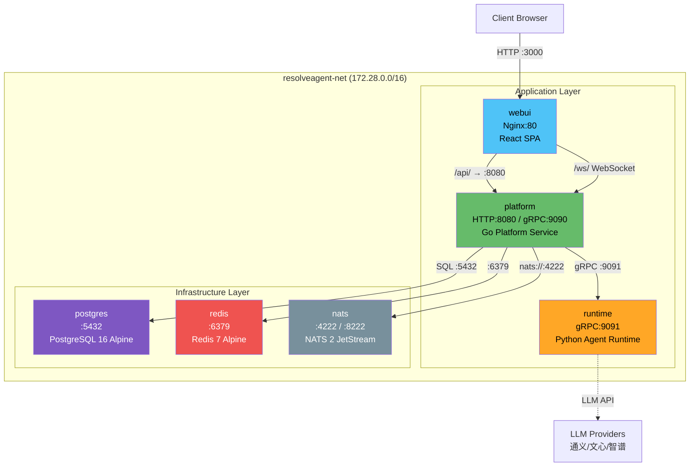
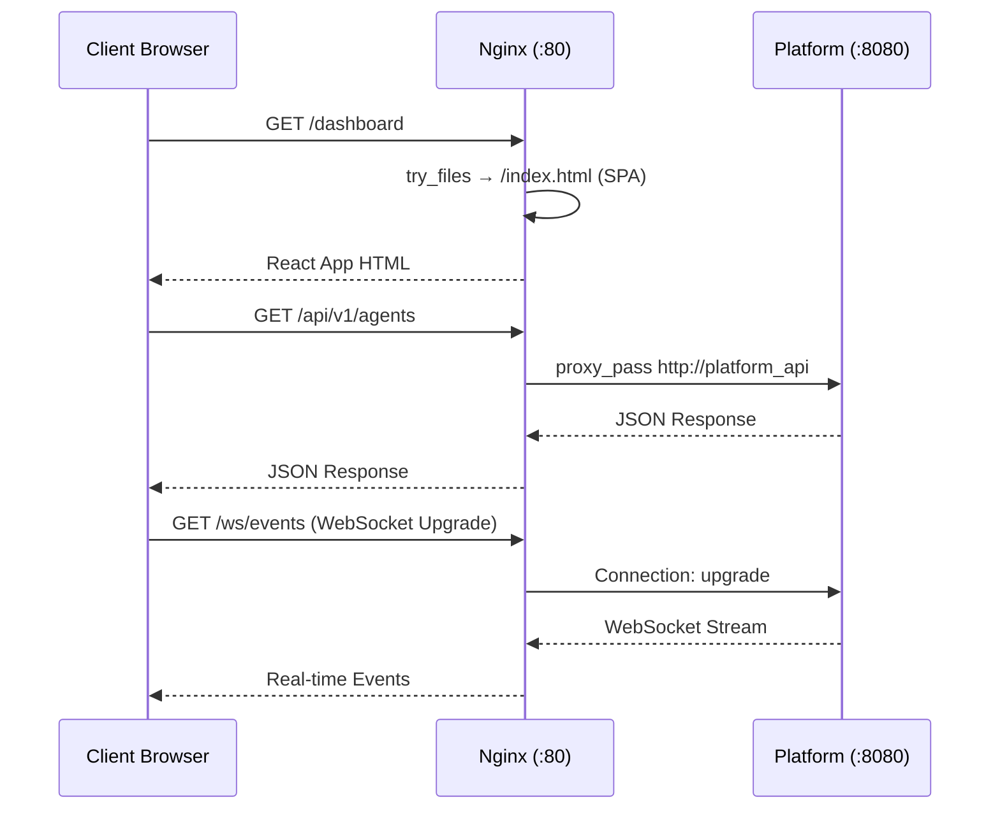
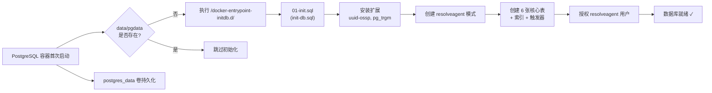
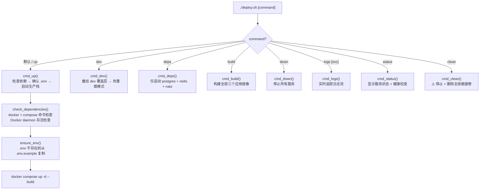

ResolveAgent 的 Docker Compose 部署方案将 **三大应用服务**（Go 平台层、Python 运行时层、React 前端层）与 **三大基础设施组件**（PostgreSQL、Redis、NATS）统一编排为一个可一键启动的完整技术栈。该方案覆盖生产部署、开发热重载和纯基础设施三种运行模式，通过多阶段构建、健康检查链和 Nginx 反向代理实现了从单机开发到类生产环境的无缝切换。本文将从架构全景出发，逐层剖析 Compose 文件结构、Dockerfile 多阶段构建策略、网络与存储设计，最终给出实操部署指南。

Sources: [docker-compose.yaml](deploy/docker-compose/docker-compose.yaml#L1-L18), [.env.example](deploy/docker-compose/.env.example#L1-L11)

## 容器编排架构全景

ResolveAgent 的 Docker Compose 编排采用经典的 **应用层 + 基础设施层** 双层架构。三个应用服务各自拥有独立的 Dockerfile 和多阶段构建流程，三个基础设施服务则直接使用官方轻量镜像。所有服务运行于同一 `resolveagent-net` 桥接网络中，通过 Docker 内部 DNS 实现服务发现。



**服务依赖链** 采用 `depends_on` + `condition` 的健康检查门控机制：`postgres` 和 `redis` 必须通过 `service_healthy` 检查后，`platform` 才会启动；`platform` 通过自身的 `/healthz` 端点报告健康后，`webui` 才会启动。这种链式依赖确保了启动顺序的确定性——数据库就绪 → 平台服务就绪 → 前端就绪。[docker-compose.yaml](deploy/docker-compose/docker-compose.yaml#L70-L76) 中 `platform` 同时依赖三个基础设施服务，而 `webui` 仅依赖 `platform`。

Sources: [docker-compose.yaml](deploy/docker-compose/docker-compose.yaml#L22-L134), [docker-compose.yaml](deploy/docker-compose/docker-compose.yaml#L226-L232)

## 三套 Compose 文件的分层设计

Compose 配置采用 **基础文件 + 覆盖文件** 的 Docker Compose 标准分层模式，通过 `-f` 参数组合实现不同运行模式。

| 文件 | 用途 | 启动命令 | 包含的服务 |
|------|------|----------|-----------|
| `docker-compose.yaml` | **生产模式**（默认） | `docker compose up -d` | platform + runtime + webui + postgres + redis + nats |
| `docker-compose.dev.yaml` | **开发覆盖层** | 叠加于生产文件之上 | 挂载源码、暴露调试端口、添加 Milvus |
| `docker-compose.deps.yaml` | **纯基础设施** | 独立使用 | postgres + redis + nats + milvus（轻量配置） |

**生产模式** (`docker-compose.yaml`) 是完整的六服务编排，所有镜像从项目根目录的多阶段 Dockerfile 构建，日志驱动统一为 `json-file` 并配置了滚动策略（最大 50MB × 5 个文件）。三个持久化卷 `postgres_data`、`redis_data`、`nats_data` 确保数据在容器重启间保留。[docker-compose.yaml](deploy/docker-compose/docker-compose.yaml#L215-L221)

**开发覆盖层** (`docker-compose.dev.yaml`) 通过 Docker Compose 的合并机制覆盖生产配置的关键属性：`platform` 服务将 `build.target` 指向 `builder` 阶段，挂载整个项目目录到 `/app`，启动命令改为 `go run`；`runtime` 服务挂载 Python 源码和配置目录，使用 `uv run` 启动；`webui` 替换为 Vite 开发服务器（端口 5173），仅挂载 `web/src` 实现前端热更新。额外添加 Milvus 向量数据库服务供 RAG 开发使用。[docker-compose.dev.yaml](deploy/docker-compose/docker-compose.dev.yaml#L13-L74)

**纯基础设施模式** (`docker-compose.deps.yaml`) 是最轻量的配置，仅启动开发者本地调试所需的后端依赖，不包含任何应用服务。它额外包含 Milvus（内嵌 etcd + 本地存储模式），为向量检索开发提供支持。[docker-compose.deps.yaml](deploy/docker-compose/docker-compose.deps.yaml#L1-L50)

Sources: [docker-compose.yaml](deploy/docker-compose/docker-compose.yaml#L1-L232), [docker-compose.dev.yaml](deploy/docker-compose/docker-compose.dev.yaml#L1-L11), [docker-compose.deps.yaml](deploy/docker-compose/docker-compose.deps.yaml#L27-L49)

## 多阶段 Dockerfile 构建策略

三个应用服务各自采用**多阶段构建**（Multi-stage Build），将编译环境与运行环境严格分离，最终镜像仅包含最小运行时依赖。

### Go 平台服务 (platform.Dockerfile)

构建分为两个阶段。**Builder 阶段** 基于 `golang:1.25-alpine`，先复制 `go.mod` / `go.sum` 执行依赖下载（利用 Docker 层缓存），再复制全部源码通过 `CGO_ENABLED=0` 静态编译为单一二进制文件。编译时通过 `-ldflags -X` 注入版本号、Git Commit 和构建时间到 [`pkg/version`](pkg/version/version.go) 包的变量中。**Runtime 阶段** 基于 `alpine:3.20`，安装 `ca-certificates` 和 `curl`（用于健康检查），创建非 root 用户 `resolveagent`（UID/GID 1000），仅复制二进制文件和配置文件。容器暴露 HTTP `8080` 和 gRPC `9090` 端口，通过 `HEALTHCHECK` 每 30 秒探测 `/healthz` 端点。[platform.Dockerfile](deploy/docker/platform.Dockerfile#L1-L61)

### Python 运行时服务 (runtime.Dockerfile)

**Builder 阶段** 基于 `python:3.12-slim`，安装编译工具链和 `uv` 包管理器，通过 `uv venv` 创建虚拟环境并同步依赖。**Runtime 阶段** 同样基于 `python:3.12-slim`，创建非 root 用户，从 Builder 阶段复制整个虚拟环境 `/opt/venv`。Python 源码和配置文件分别复制到 `/app/src` 和 `/etc/resolveagent`，通过 `PYTHONPATH` 环境变量确保模块可导入。容器暴露 gRPC `9091` 端口，健康检查探测 `http://localhost:9091/healthz`。[runtime.Dockerfile](deploy/docker/runtime.Dockerfile#L1-L64)

### React 前端服务 (webui.Dockerfile)

**Builder 阶段** 基于 `node:20-alpine`，全局安装 `pnpm`，先复制 `package.json` 和锁文件安装依赖，再复制全部 Web 源码执行 `pnpm build` 生成静态资源。**Runtime 阶段** 基于 `nginx:1.27-alpine`，清除默认配置，从 Builder 阶段复制 `dist/` 目录到 Nginx 的 HTML 根目录，同时复制自定义 Nginx 配置文件。容器仅暴露 `80` 端口。[webui.Dockerfile](deploy/docker/webui.Dockerfile#L1-L47)

| 服务 | Builder 镜像 | Runtime 镜像 | 最终产物 | 预估镜像大小 |
|------|-------------|-------------|---------|------------|
| platform | golang:1.25-alpine | alpine:3.20 | 单一二进制 + 配置 | ~30MB |
| runtime | python:3.12-slim | python:3.12-slim | venv + 源码 | ~400MB |
| webui | node:20-alpine | nginx:1.27-alpine | 静态 HTML/JS/CSS | ~25MB |

Sources: [platform.Dockerfile](deploy/docker/platform.Dockerfile#L11-L60), [runtime.Dockerfile](deploy/docker/runtime.Dockerfile#L8-L63), [webui.Dockerfile](deploy/docker/webui.Dockerfile#L10-L46)

## Nginx 反向代理与前端路由

WebUI 的 Nginx 配置承担了三个关键职责：**SPA 路由回退**、**API 反向代理** 和 **静态资源优化**。



[nginx.conf](deploy/docker/nginx.conf#L7-L96) 定义了 `upstream platform_api` 指向 `platform:8080`（Docker 内部 DNS 解析），保持 32 个长连接。路由规则按请求路径分流：`/api/` 前缀的请求通过 `proxy_pass` 转发到 Platform 服务，设置了 30s 连接超时和 60s 读超时；`/ws/` 前缀的 WebSocket 请求通过 `Upgrade` 头升级，读超时设为 24 小时以支持长连接；其余所有请求执行 `try_files $uri $uri/ /index.html` 回退到 SPA 入口。安全头（`X-Frame-Options`、`X-Content-Type-Options`、`X-XSS-Protection`）全局注入，静态资源（JS/CSS/图片/字体）设置 30 天浏览器缓存。

Sources: [nginx.conf](deploy/docker/nginx.conf#L1-L97), [default.conf](deploy/docker/nginx/default.conf#L1-L28)

## 环境变量与配置体系

环境变量是 Docker Compose 部署的核心配置机制。[.env.example](deploy/docker-compose/.env.example#L1-L85) 定义了全部可配置项，分为七大类别：

| 配置类别 | 关键变量 | 默认值 | 说明 |
|---------|---------|--------|------|
| **通用** | `RESOLVEAGENT_VERSION` | `latest` | 镜像标签版本 |
| **端口映射** | `PLATFORM_HTTP_PORT` | `8080` | 平台 HTTP 端口 |
| | `PLATFORM_GRPC_PORT` | `9090` | 平台 gRPC 端口 |
| | `RUNTIME_GRPC_PORT` | `9091` | 运行时 gRPC 端口 |
| | `WEBUI_PORT` | `3000` | Web 界面端口 |
| **PostgreSQL** | `RESOLVEAGENT_DATABASE_HOST` | `postgres` | Docker 内部服务名 |
| | `RESOLVEAGENT_DATABASE_PASSWORD` | `resolveagent` | ⚠️ 生产环境务必修改 |
| **Redis** | `REDIS_MAXMEMORY` | `256mb` | 最大内存限制 |
| **NATS** | `RESOLVEAGENT_NATS_URL` | `nats://nats:4222` | JetStream 连接地址 |
| **Agent 运行时** | `RESOLVEAGENT_SELECTOR_DEFAULT_STRATEGY` | `hybrid` | 智能选择器默认策略 |
| | `RESOLVEAGENT_AGENT_POOL_MAX_SIZE` | `100` | Agent 池最大容量 |
| **LLM 密钥** | `RESOLVEAGENT_LLM_QWEN_API_KEY` | 空 | 通义千问 API Key |
| | `RESOLVEAGENT_LLM_WENXIN_API_KEY` | 空 | 文心一言 API Key |
| | `RESOLVEAGENT_LLM_ZHIPU_API_KEY` | 空 | 智谱清言 API Key |
| **可观测性** | `RESOLVEAGENT_TELEMETRY_ENABLED` | `false` | OpenTelemetry 开关 |
| | `RESOLVEAGENT_TELEMETRY_OTLP_ENDPOINT` | 空 | OTLP 导出端点 |

[docker-compose.yaml](deploy/docker-compose/docker-compose.yaml#L39-L69) 中所有环境变量均使用 `${VAR:-default}` 格式声明，确保即使没有 `.env` 文件也能以默认值启动。Platform 服务的环境变量通过 `RESOLVEAGENT_` 前缀的 Go 环境变量映射机制自动绑定到 [`pkg/config`](pkg/config/config.go) 的配置结构体，覆盖 [`configs/resolveagent.yaml`](configs/resolveagent.yaml) 中的默认值。

Sources: [.env.example](deploy/docker-compose/.env.example#L1-L85), [docker-compose.yaml](deploy/docker-compose/docker-compose.yaml#L39-L69)

## 数据库初始化与 Schema 管理

PostgreSQL 容器通过 Docker 的 `/docker-entrypoint-initdb.d/` 机制在**首次启动时**自动执行 SQL 初始化脚本。[init-db.sql](deploy/docker/init-db.sql#L1-L171) 创建了 `resolveagent` 模式，定义了 `agents`、`skills`、`workflows`、`workflow_executions`、`models`、`audit_log` 六张核心表及其索引，并为所有包含 `updated_at` 字段的表绑定了自动更新触发器。脚本末尾将 `resolveagent` 模式的全部权限授予 `resolveagent` 用户。



值得注意的是，该初始化脚本仅在数据卷为空时执行。后续的数据库变更应使用 [`scripts/migration/`](scripts/migration/001_init.up.sql) 中的增量迁移脚本通过迁移工具（如 golang-migrate）管理。[init-db.sql](deploy/docker/init-db.sql#L10-L13) 的头部注释明确指出了这一设计意图。

Sources: [init-db.sql](deploy/docker/init-db.sql#L1-L171), [docker-compose.yaml](deploy/docker-compose/docker-compose.yaml#L150-L152)

## deploy.sh 一键部署脚本

[`deploy.sh`](deploy/docker/deploy.sh#L1-L258) 提供了 Docker Compose 部署的完整生命周期管理，通过子命令模式覆盖了从部署到清理的全流程操作：



脚本的核心安全机制包括：`check_dependencies()` 验证 Docker 和 Compose 插件的可用性并检测 daemon 运行状态；`ensure_env()` 在 `.env` 缺失时自动从模板创建；`cmd_clean()` 在执行破坏性操作前要求用户确认。[deploy.sh](deploy/docker/deploy.sh#L57-L77)

| 命令 | 功能 | 使用场景 |
|------|------|---------|
| `./deploy.sh` | 部署完整生产栈 | 首次部署、演示 |
| `./deploy.sh dev` | 开发模式（热重载） | 日常开发 |
| `./deploy.sh deps` | 仅启动基础设施 | 本地 IDE 调试应用代码 |
| `./deploy.sh build` | 仅构建镜像 | CI/CD 流水线 |
| `./deploy.sh status` | 查看服务健康状态 | 运维巡检 |
| `./deploy.sh logs platform` | 追踪指定服务日志 | 排查问题 |
| `./deploy.sh clean` | 停止并删除全部数据 | 完全重置环境 |

Sources: [deploy.sh](deploy/docker/deploy.sh#L1-L258), [deploy.sh](deploy/docker/deploy.sh#L96-L121)

## 健康检查与服务就绪门控

每个服务都配置了 `HEALTHCHECK` 指令，Docker Compose 通过 `depends_on.condition: service_healthy` 实现基于健康状态的启动门控。这比简单的容器启动检查更可靠——它确保服务不仅已启动，而且已真正可接受请求。

| 服务 | 检查方式 | 间隔 | 超时 | 启动宽限期 | 重试次数 |
|------|---------|------|------|-----------|---------|
| **platform** | `curl -f http://localhost:8080/healthz` | 30s | 5s | 10s | 3 |
| **runtime** | `curl -f http://localhost:9091/healthz` | 30s | 5s | 15s | 3 |
| **webui** (Nginx) | `wget -qO- http://localhost:80/` | 30s | 5s | 5s | 3 |
| **postgres** | `pg_isready -U resolveagent -d resolveagent` | 10s | 5s | 30s | 5 |
| **redis** | `redis-cli ping` | 10s | 5s | — | 5 |
| **nats** | 无（`service_started`） | — | — | — | — |

依赖链的启动时序为：`postgres`（需 30s 宽限期完成恢复）→ `platform`（等待 postgres 和 redis 健康）→ `webui`（等待 platform 健康）。`runtime` 仅加入网络但不被其他服务依赖，可以异步启动。[docker-compose.yaml](deploy/docker-compose/docker-compose.yaml#L70-L76)

Sources: [platform.Dockerfile](deploy/docker/platform.Dockerfile#L56-L57), [runtime.Dockerfile](deploy/docker/runtime.Dockerfile#L60-L61), [docker-compose.yaml](deploy/docker-compose/docker-compose.yaml#L153-L158)

## 网络与存储设计

所有服务共享 `resolveagent-net` 桥接网络，子网为 `172.28.0.0/16`。Docker 内置 DNS 将服务名（如 `platform`、`postgres`）解析为对应容器的 IP 地址，服务间通信直接使用服务名作为主机名。[docker-compose.yaml](deploy/docker-compose/docker-compose.yaml#L226-L232)

三个命名卷确保数据持久化：

| 卷名 | 挂载点 | 用途 | 驱动 |
|------|--------|------|------|
| `postgres_data` | `/var/lib/postgresql/data` | 数据库持久存储 | local |
| `redis_data` | `/data` | Redis AOF 持久化 + LRU 缓存 | local |
| `nats_data` | `/data` | JetStream 消息存储 | local |

Redis 配置了 `appendonly yes`（AOF 持久化）和 `appendfsync everysec`（每秒刷盘），结合 `maxmemory 256mb` + `allkeys-lru` 淘汰策略，在内存限制和数据安全之间取得平衡。[docker-compose.yaml](deploy/docker-compose/docker-compose.yaml#L173-L179)

Sources: [docker-compose.yaml](deploy/docker-compose/docker-compose.yaml#L167-L221), [docker-compose.yaml](deploy/docker-compose/docker-compose.yaml#L226-L232)

## CI/CD 镜像发布流水线

[.github/workflows/docker-publish.yaml](.github/workflows/docker-publish.yaml#L1-L32) 定义了自动化的 Docker 镜像构建与发布流程。当推送 `v*` 格式的 Git Tag 时，GitHub Actions 使用 `matrix` 策略并行构建 `platform`、`runtime`、`webui` 三个组件的镜像，推送到 `ghcr.io/ai-guru-global` 仓库，同时打上版本标签和 `latest` 标签。

```yaml
# 触发条件：推送 v* 格式 tag（如 v1.0.0）
on:
  push:
    tags: ["v*"]

# 矩阵构建：三个组件并行
strategy:
  matrix:
    component: [platform, runtime, webui]

# 产物标签
tags: |
  ghcr.io/ai-guru-global/resolveagent-${{ matrix.component }}:${{ github.ref_name }}
  ghcr.io/ai-guru-global/resolveagent-${{ matrix.component }}:latest
```

此外，[Makefile](Makefile#L163-L201) 提供了 `docker`、`docker-platform`、`docker-runtime`、`docker-webui` 四个本地构建目标，以及 `compose-up`、`compose-down`、`compose-deps`、`compose-logs` 四个 Compose 快捷命令，开发者可在不安装 `deploy.sh` 依赖的情况下直接使用 `make` 完成相同操作。

Sources: [docker-publish.yaml](.github/workflows/docker-publish.yaml#L1-L32), [Makefile](Makefile#L163-L201)

## 实操部署指南

### 生产模式部署

```bash
# 1. 克隆仓库并进入目录
git clone https://github.com/ai-guru-global/resolve-agent.git
cd resolve-agent

# 2. 创建环境配置
cp deploy/docker-compose/.env.example deploy/docker-compose/.env

# 3. 编辑配置（至少填写一个 LLM API Key）
vim deploy/docker-compose/.env

# 4. 一键启动（使用部署脚本）
bash deploy/docker/deploy.sh

# 4a. 或使用 docker compose 原生命令
docker compose -f deploy/docker-compose/docker-compose.yaml up -d --build

# 5. 验证服务状态
bash deploy/docker/deploy.sh status
```

启动完成后，访问 `http://localhost:3000` 即可打开 Web 界面。

### 开发模式部署

```bash
# 启动带热重载的开发栈
bash deploy/docker/deploy.sh dev

# 或手动叠加配置文件
docker compose \
  -f deploy/docker-compose/docker-compose.yaml \
  -f deploy/docker-compose/docker-compose.dev.yaml \
  up -d --build
```

开发模式下：Go 服务通过 `go run` 启动并监听源码变更；Python 服务通过 `uv run` 启动；前端使用 Vite Dev Server（`http://localhost:5173`），支持 HMR 热模块替换；Milvus 向量数据库自动启动供 RAG 开发使用。

### 仅启动基础设施

```bash
# 使用 deps 文件（最轻量）
docker compose -f deploy/docker-compose/docker-compose.deps.yaml up -d

# 或使用部署脚本
bash deploy/docker/deploy.sh deps
```

此模式适用于在本地 IDE 中直接运行和调试应用代码，仅依赖容器化的数据库和消息队列。

### 常用运维操作

```bash
# 查看指定服务日志
bash deploy/docker/deploy.sh logs platform

# 重建并重启单个服务
docker compose -f deploy/docker-compose/docker-compose.yaml up -d --build platform

# 进入运行中的容器
docker exec -it resolveagent-platform sh

# 完全清理（包括数据卷）
bash deploy/docker/deploy.sh clean
```

Sources: [deploy.sh](deploy/docker/deploy.sh#L96-L169), [docker-compose.dev.yaml](deploy/docker-compose/docker-compose.dev.yaml#L1-L11), [docker-compose.deps.yaml](deploy/docker-compose/docker-compose.deps.yaml#L1-L24)

## 构建上下文与 .dockerignore 优化

所有 Dockerfile 的 `context` 均设为项目根目录 `../..`（相对于 `deploy/docker-compose/`），这允许 Dockerfile 访问 Go 源码、Python 源码和 Web 源码。为避免将不必要的文件发送到 Docker 守护进程，根目录的 [.dockerignore](.dockerignore#L1-L63) 排除了 `.git`、IDE 配置、文档目录、测试文件、构建产物、Python 缓存和 `node_modules` 等内容。

关键的排除规则包括：`docs/` 和 `*.md` 减小了文档传输开销；`web/node_modules/` 避免将本地依赖发送到构建上下文（Dockerfile 中会通过 `pnpm install` 重新安装）；`deploy/` 自身也被排除以避免递归上下文。这些优化在实际项目中可将构建上下文从数百 MB 缩减到数十 MB。

Sources: [.dockerignore](.dockerignore#L1-L63), [deploy/docker/.dockerignore](deploy/docker/.dockerignore#L1-L63)

## 下一步

Docker Compose 部署适合单机开发和测试场景。当需要横向扩展、高可用性和滚动更新时，请参阅 [Kubernetes 与 Helm Chart 生产部署](30-kubernetes-yu-helm-chart-sheng-chan-bu-shu) 了解生产级编排方案。如需对运行中的容器化服务进行监控和诊断，[可观测性：OpenTelemetry 指标、日志与链路追踪](31-ke-guan-ce-xing-opentelemetry-zhi-biao-ri-zhi-yu-lian-lu-zhui-zong) 介绍了如何启用遥测管道。