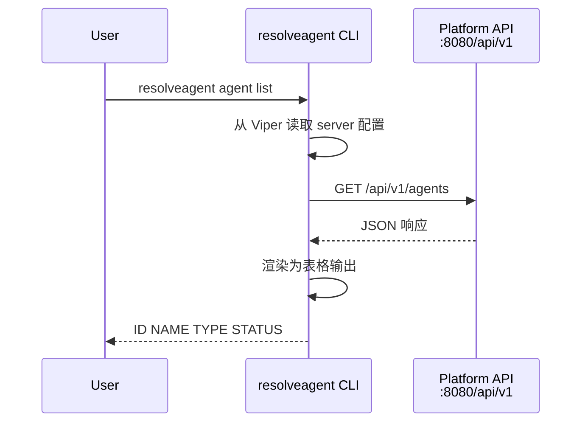
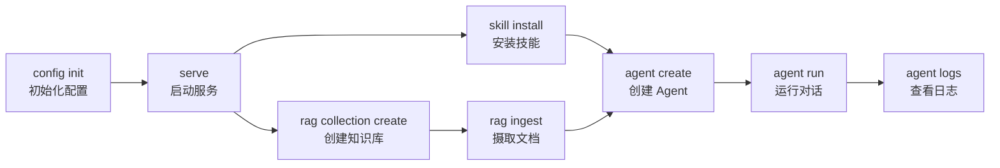

`resolveagent` 是 ResolveAgent 平台的统一命令行入口，基于 Cobra 框架构建，提供 Agent 管理、技能安装、FTA 工作流编排、RAG 知识库操作以及平台配置等全部管理能力。本文将带你从安装验证开始，逐一掌握每条命令的实际用法。

## 命令总览与架构

CLI 以 `resolveagent` 为根命令，下设 **9 个一级子命令**，各子命令再向下衍生二级操作。全局配置通过 Viper 加载，支持配置文件、命令行标志和环境变量三重覆盖机制。

```mermaid
graph TD
    Root["resolveagent<br/>根命令"]
    Root --> A["agent<br/>Agent 管理"]
    Root --> S["skill<br/>技能管理"]
    Root --> W["workflow<br/>FTA 工作流"]
    Root --> R["rag<br/>RAG 知识库"]
    Root --> CO["corpus<br/>语料库导入"]
    Root --> CF["config<br/>CLI 配置"]
    Root --> V["version<br/>版本信息"]
    Root --> D["dashboard<br/>TUI 仪表板"]
    Root --> SV["serve<br/>本地启动服务"]

    A --> A1["create"]
    A --> A2["list / ls"]
    A --> A3["run"]
    A --> A4["delete / rm"]
    A --> A5["logs"]

    S --> S1["install"]
    S --> S2["list / ls"]
    S --> S3["info"]
    S --> S4["test"]
    S --> S5["remove / rm"]

    W --> W1["create"]
    W --> W2["list / ls"]
    W --> W3["run"]
    W --> W4["validate"]
    W --> W5["visualize"]

    R --> RC["collection"]
    R --> RI["ingest"]
    R --> RQ["query"]
    RC --> RC1["create"]
    RC --> RC2["list / ls"]
    RC --> RC3["delete / rm"]

    CO --> CO1["import"]

    CF --> CF1["set"]
    CF --> CF2["get"]
    CF --> CF3["view"]
    CF --> CF4["init"]

    style Root fill:#2563eb,color:#fff
    style A fill:#7c3aed,color:#fff
    style S fill:#059669,color:#fff
    style W fill:#d97706,color:#fff
    style R fill:#dc2626,color:#fff
    style CO fill:#8b5cf6,color:#fff
    style CF fill:#475569,color:#fff
```



Sources: [root.go](internal/cli/root.go#L20-L54), [root_test.go](internal/cli/root_test.go#L18-L30)

## 安装与初始配置

### 构建 CLI 二进制

通过 Makefile 一键构建 Go 二进制，产物输出到 `bin/` 目录：

```bash
# 构建所有 Go 二进制（CLI + Server）
make build-go

# 仅 CLI 工具位于：
# bin/resolveagent
```

构建过程通过 `-ldflags` 注入版本号、Git Commit 和构建时间到二进制中。

Sources: [Makefile](Makefile#L55-L59), [version.go](pkg/version/version.go#L9-L19)

### 验证安装

```bash
resolveagent version
```

输出示例：

```
ResolveAgent 0.3.0 (commit: a1b2c3d, built: 2024-01-15T08:00:00Z, darwin/arm64)
```

版本信息由三个构建时变量组合而成：

| 变量 | 说明 | 默认值 |
|------|------|--------|
| `Version` | 语义化版本号 | `dev` |
| `Commit` | Git 短哈希 | `unknown` |
| `BuildDate` | UTC 构建时间 | `unknown` |

Sources: [version.go](pkg/version/version.go#L9-L19), [VERSION](VERSION#L1)

### 初始化配置

首次使用前，运行配置初始化以创建默认配置文件：

```bash
resolveagent config init
```

该命令会在 `$HOME/.resolveagent/` 目录下生成 `config.yaml`，包含默认服务器地址和 API 版本号。

Sources: [config.go](internal/cli/config/config.go#L75-L119)

### 全局标志

所有子命令共享以下全局标志，通过 Cobra `PersistentFlags` 注册：

| 标志 | 说明 | 默认值 |
|------|------|--------|
| `--config` | 指定配置文件路径 | `$HOME/.resolveagent/config.yaml` |
| `--server` | 平台 API 服务器地址 | `localhost:8080` |

配置加载优先级从高到低为：**命令行标志 → 环境变量 → 配置文件 → 默认值**。环境变量使用 `RESOLVEAGENT_` 前缀（如 `RESOLVEAGENT_SERVER`）。

Sources: [root.go](internal/cli/root.go#L34-L73)

## Agent 管理命令

`resolveagent agent` 命令组提供 Agent 的完整生命周期管理——创建、查看列表、运行对话、删除和查看日志。

### agent create — 创建 Agent

```bash
resolveagent agent create <名称> [标志]
```

支持两种创建方式：通过命令行标志快速创建，或通过 YAML 配置文件完整定义。

**从标志创建**：

```bash
resolveagent agent create my-assistant \
  --type mega \
  --model qwen-plus \
  --prompt "你是一个运维诊断助手"
```

**从 YAML 文件创建**：

```bash
resolveagent agent create -f agent.yaml
```

| 标志 | 短标志 | 说明 | 默认值 |
|------|--------|------|--------|
| `--type` | `-t` | Agent 类型（mega / skill / fta / rag / custom） | `mega` |
| `--model` | `-m` | LLM 模型 ID | `qwen-plus` |
| `--prompt` | `-p` | 系统提示词 | 空 |
| `--file` | `-f` | YAML 配置文件路径 | 空 |

一个典型的 Agent 配置文件结构如下：

```yaml
agent:
  name: my-assistant
  type: mega
  description: "通用智能路由 Agent"
  config:
    model: qwen-plus
    system_prompt: |
      你是一个由 ResolveAgent 驱动的助手。
```

Sources: [create.go](internal/cli/agent/create.go#L13-L88)

### agent list — 列出所有 Agent

```bash
resolveagent agent list [标志]
# 别名
resolveagent agent ls
```

输出以表格形式展示 ID、名称、类型和状态。支持 JSON / YAML 格式输出。

```bash
# 默认表格输出
resolveagent agent list

# 筛选类型
resolveagent agent list --type mega

# JSON 格式（适合脚本处理）
resolveagent agent list -o json
```

| 标志 | 短标志 | 说明 | 默认值 |
|------|--------|------|--------|
| `--type` | `-t` | 按 Agent 类型筛选 | 全部 |
| `--status` | `-s` | 按状态筛选（active / inactive） | 全部 |
| `--output` | `-o` | 输出格式（table / json / yaml） | `table` |

Sources: [list.go](internal/cli/agent/list.go#L15-L50)

### agent run — 运行 Agent

```bash
resolveagent agent run <agent-id> [message] [标志]
```

向指定 Agent 发送消息并获取执行结果。消息可通过位置参数或 `--message` 标志传入。

```bash
# 直接传入消息
resolveagent agent run my-assistant "检查服务健康状态"

# 通过标志传入
resolveagent agent run my-assistant --message "分析最近的错误日志"

# 流式输出（实时获取响应）
resolveagent agent run my-assistant "诊断网络问题" --stream
```

| 标志 | 短标志 | 说明 | 默认值 |
|------|--------|------|--------|
| `--message` | `-m` | 发送的消息文本 | 空 |
| `--stream` | `-s` | 启用流式响应 | `false` |
| `--wait` | `-w` | 等待执行完成 | `true` |

执行完成后，CLI 会显示响应内容、耗时和 Token 用量统计。

Sources: [run.go](internal/cli/agent/run.go#L13-L115)

### agent delete — 删除 Agent

```bash
resolveagent agent delete <agent-id> [标志]
# 别名
resolveagent agent rm <agent-id>
resolveagent agent remove <agent-id>
```

默认会要求确认，使用 `--force` 跳过确认提示。

```bash
# 带确认提示
resolveagent agent delete my-assistant

# 强制删除（无确认）
resolveagent agent delete my-assistant --force
```

| 标志 | 短标志 | 说明 | 默认值 |
|------|--------|------|--------|
| `--force` | `-f` | 跳过确认直接删除 | `false` |

Sources: [delete.go](internal/cli/agent/delete.go#L11-L54)

### agent logs — 查看 Agent 日志

```bash
resolveagent agent logs <agent-id> [标志]
```

查看指定 Agent 的执行日志，支持按执行 ID 筛选和实时跟踪。

```bash
# 查看最近 50 条日志
resolveagent agent logs my-assistant

# 查看最近 100 条
resolveagent agent logs my-assistant -n 100

# 按执行 ID 筛选
resolveagent agent logs my-assistant --execution exec-abc123

# 实时跟踪日志流
resolveagent agent logs my-assistant --follow
```

| 标志 | 短标志 | 说明 | 默认值 |
|------|--------|------|--------|
| `--limit` | `-n` | 显示条数 | `50` |
| `--follow` | `-f` | 持续跟踪日志输出 | `false` |
| `--execution` | `-e` | 按执行 ID 筛选 | 全部 |

Sources: [logs.go](internal/cli/agent/logs.go#L13-L79)

## 技能管理命令

`resolveagent skill` 命令组管理 Agent 技能的安装、查看、测试和卸载。技能是 Agent 执行特定任务的核心能力单元。

### skill install — 安装技能

```bash
resolveagent skill install <source> [标志]
```

支持三种安装来源，**CLI 会自动检测来源类型**：若以 `http` 或 `git@` 开头识别为 Git 仓库；若本地路径存在且为目录或 `.py` / `.yaml` 文件则识别为本地安装；否则视为注册表安装。

```bash
# 从本地目录安装
resolveagent skill install ./skills/web-search

# 从 Git 仓库安装
resolveagent skill install https://github.com/org/skill-repo.git

# 从注册表安装（按名称）
resolveagent skill install web-search
```

| 标志 | 短标志 | 说明 | 默认值 |
|------|--------|------|--------|
| `--type` | `-t` | 强制指定来源类型（local / git / registry） | 自动检测 |
| `--name` | `-n` | 安装后覆盖技能名称 | 使用源名称 |

Sources: [install.go](internal/cli/skill/install.go#L30-L103)

### skill list — 列出已安装技能

```bash
resolveagent skill list
# 别名
resolveagent skill ls
```

以表格形式输出 NAME、VERSION、TYPE、STATUS 四列。

Sources: [list.go](internal/cli/skill/list.go#L13-L51)

### skill info — 查看技能详情

```bash
resolveagent skill info <name> [标志]
```

展示技能的完整元信息，包括名称、ID、描述、版本、类型、状态、来源和配置参数。

```bash
# 文本格式（默认）
resolveagent skill info web-search

# JSON 格式
resolveagent skill info web-search -o json

# YAML 格式
resolveagent skill info web-search -o yaml
```

| 标志 | 短标志 | 说明 | 默认值 |
|------|--------|------|--------|
| `--output` | `-o` | 输出格式（text / json / yaml） | `text` |

Sources: [info.go](internal/cli/skill/info.go#L13-L69)

### skill test — 测试技能

```bash
resolveagent skill test <name> [标志]
```

在隔离环境中测试技能执行，输入通过 JSON 文件或内联 JSON 字符串传入。

```bash
# 使用内联 JSON 数据
resolveagent skill test web-search --data '{"query": "ResolveAgent"}'

# 使用 JSON 文件
resolveagent skill test web-search --input test-data.json
```

| 标志 | 短标志 | 说明 | 默认值 |
|------|--------|------|--------|
| `--input` | `-i` | JSON 输入文件路径 | 空 |
| `--data` | `-d` | 内联 JSON 输入数据 | 空 |

Sources: [test.go](internal/cli/skill/test.go#L13-L79)

### skill remove — 卸载技能

```bash
resolveagent skill remove <name> [标志]
# 别名
resolveagent skill rm <name>
resolveagent skill uninstall <name>
```

| 标志 | 短标志 | 说明 | 默认值 |
|------|--------|------|--------|
| `--force` | `-f` | 跳过确认直接卸载 | `false` |

Sources: [remove.go](internal/cli/skill/remove.go#L11-L54)

## FTA 工作流命令

`resolveagent workflow` 命令组管理故障树分析（FTA）工作流的创建、验证、执行和可视化。

### workflow create — 创建工作流

```bash
resolveagent workflow create <name> --file <yaml文件> [标志]
```

必须通过 `--file` 提供工作流定义文件。定义文件为 YAML 格式，包含事件（events）和门（gates）两大部分。

```bash
resolveagent workflow create incident-diagnosis \
  --file workflow-fta.yaml \
  --description "生产事件根因分析" \
  --version 1.0.0
```

| 标志 | 短标志 | 说明 | 默认值 |
|------|--------|------|--------|
| `--file` | `-f` | 工作流定义 YAML 文件（**必填**） | 空 |
| `--description` | `-d` | 工作流描述 | 空 |
| `--version` | `-v` | 版本号 | `1.0.0` |

Sources: [create.go](internal/cli/workflow/create.go#L30-L98)

### workflow validate — 验证工作流定义

```bash
resolveagent workflow validate <yaml文件>
```

在创建前验证工作流定义的正确性，返回错误列表和警告信息：

```bash
resolveagent workflow validate workflow-fta.yaml
```

验证结果会逐一列出错误和警告：

```
✓ Workflow is valid
# 或
✗ Workflow is invalid

Errors:
  - Gate "gate-or-1" references undefined event "check-traces"
```

Sources: [validate.go](internal/cli/workflow/validate.go#L13-L73)

### workflow run — 执行工作流

```bash
resolveagent workflow run <id> [标志]
```

执行已创建的工作流，支持同步等待和异步执行两种模式。

```bash
# 同步执行（等待完成）
resolveagent workflow run incident-diagnosis \
  --data '{"log_source": "/var/log/app", "time_range": "1h"}'

# 从 JSON 文件传入输入
resolveagent workflow run incident-diagnosis --input params.json

# 异步执行
resolveagent workflow run incident-diagnosis --async
```

| 标志 | 短标志 | 说明 | 默认值 |
|------|--------|------|--------|
| `--input` | `-i` | JSON 输入文件路径 | 空 |
| `--data` | `-d` | 内联 JSON 输入数据 | 空 |
| `--async` | `-a` | 异步执行 | `false` |

Sources: [run.go](internal/cli/workflow/run.go#L13-L96)

### workflow list — 列出工作流

```bash
resolveagent workflow list
# 别名
resolveagent workflow ls
```

输出 ID、NAME、VERSION、STATUS 四列表格。

Sources: [list.go](internal/cli/workflow/list.go#L13-L51)

### workflow visualize — 可视化工作流树

```bash
resolveagent workflow visualize <id>
```

在终端以 ASCII 树形结构渲染工作流的故障树，直观展示事件与门的层级关系。

```bash
resolveagent workflow visualize incident-diagnosis
```

输出效果类似：

```
Workflow: Incident Root Cause Analysis (incident-diagnosis)

└── [top] Root Cause Identified
    └── [OR] Any Evidence Found
        ├── [basic] Check Error Logs
        ├── [basic] Check System Metrics
        └── [basic] Consult Runbook
```

Sources: [visualize.go](internal/cli/workflow/visualize.go#L11-L94)

## RAG 知识库命令

`resolveagent rag` 命令组管理检索增强生成管道中的集合（Collection）、文档摄取和语义查询。

### rag collection — 集合管理

集合是 RAG 知识库的顶层容器，绑定特定的嵌入模型和分块策略。

**创建集合**：

```bash
resolveagent rag collection create <name> [标志]
```

```bash
resolveagent rag collection create product-docs \
  --embedding-model bge-large-zh \
  --chunk-strategy sentence \
  --description "产品文档知识库"
```

| 标志 | 说明 | 默认值 |
|------|------|--------|
| `--embedding-model` | 嵌入模型 | `bge-large-zh` |
| `--chunk-strategy` | 分块策略（fixed / sentence / semantic） | `sentence` |
| `--description` | 集合描述 | 空 |

**列出集合**：

```bash
resolveagent rag collection list
# 别名
resolveagent rag collection ls
```

输出包含 ID、NAME、DOCUMENTS、VECTORS、STATUS 五列。

**删除集合**：

```bash
resolveagent rag collection delete <id> --force
# 别名
resolveagent rag collection rm <id>
```

Sources: [collection.go](internal/cli/rag/collection.go#L13-L168)

### rag ingest — 文档摄取

```bash
resolveagent rag ingest [标志]
```

将文档文件摄取到指定集合中，支持单文件和目录批量摄取。CLI 会自动识别文件类型，支持的格式包括：`.txt`、`.md`、`.json`、`.yaml`、`.yml`、`.pdf`、`.docx`、`.html`。

```bash
# 摄取单个文件
resolveagent rag ingest --collection product-docs --path ./guide.md

# 批量摄取目录下所有文件
resolveagent rag ingest --collection product-docs --path ./docs/

# 递归摄取子目录
resolveagent rag ingest --collection product-docs --path ./docs/ --recursive
```

| 标志 | 短标志 | 说明 | 默认值 |
|------|--------|------|--------|
| `--collection` | `-c` | 目标集合 ID（**必填**） | 空 |
| `--path` | `-p` | 文件或目录路径 | `.`（当前目录） |
| `--recursive` | `-r` | 递归处理子目录 | `false` |

每个文件摄取后会报告生成的 **chunks 数量**和**向量数**。

Sources: [ingest.go](internal/cli/rag/ingest.go#L13-L152)

### rag query — 语义查询

```bash
resolveagent rag query <查询文本> --collection <集合ID> [标志]
```

对指定集合执行语义相似度搜索，返回按相关度排序的结果。

```bash
resolveagent rag query "如何配置 Higress 网关认证" \
  --collection product-docs \
  --top-k 5
```

| 标志 | 短标志 | 说明 | 默认值 |
|------|--------|------|--------|
| `--collection` | `-c` | 目标集合 ID（**必填**） | 空 |
| `--top-k` | `-k` | 返回结果数量 | `5` |

每条结果展示相关度分数、来源文档 ID 和内容摘要（超过 200 字符自动截断）。

Sources: [query.go](internal/cli/rag/query.go#L11-L78)

## 语料库导入命令

`resolveagent corpus` 命令组负责从外部知识库（如 Git 仓库或本地目录）批量导入 RAG 文档、FTA 文档和技能定义。

### corpus import — 批量导入

```bash
resolveagent corpus import <source> [标志]
```

该命令通过 **SSE（Server-Sent Events）** 流式连接与平台 API 通信，实时显示导入进度。

```bash
# 从 Git 仓库导入全部内容
resolveagent corpus import https://github.com/kudig-io/kudig-database

# 仅导入 RAG 和 FTA 内容
resolveagent corpus import \
  --type rag --type fta \
  https://github.com/kudig-io/kudig-database

# 预览模式（不实际写入）
resolveagent corpus import --dry-run ./local-corpus

# 指定目标 RAG 集合
resolveagent corpus import --collection product-docs ./corpus-dir
```

| 标志 | 说明 | 默认值 |
|------|------|--------|
| `--type` | 导入类型，可重复指定（rag / fta / skills） | `rag,fta,skills` |
| `--collection` | 目标 RAG 集合 ID（空则自动创建） | 空 |
| `--profile` | 语料库配置档案名称 | 空 |
| `--force` | 强制重新克隆（即使已缓存） | `false` |
| `--dry-run` | 预览模式，不执行实际导入 | `false` |

导入过程中 CLI 会实时输出 SSE 事件流，包括阶段开始、文件处理进度、错误和完成统计。

Sources: [corpus.go](internal/cli/corpus/corpus.go#L8-L21), [import.go](internal/cli/corpus/import.go#L24-L222)

## 系统管理命令

### config — CLI 配置管理

`resolveagent config` 提供四个子命令管理 CLI 配置：

| 子命令 | 用法 | 说明 |
|--------|------|------|
| `init` | `resolveagent config init` | 初始化默认配置，创建 `~/.resolveagent/config.yaml` |
| `set` | `resolveagent config set <key> <value>` | 设置配置项 |
| `get` | `resolveagent config get <key>` | 查看单个配置项 |
| `view` | `resolveagent config view` | 查看完整配置 |

```bash
# 首次使用初始化
resolveagent config init

# 指定远程服务器
resolveagent config set server production.example.com:8080

# 查看当前服务器配置
resolveagent config get server

# 查看全部配置
resolveagent config view
```

Sources: [config.go](internal/cli/config/config.go#L13-L119)

### serve — 本地启动平台

```bash
resolveagent serve
```

在本地启动 ResolveAgent 平台服务，适用于开发调试。生产环境请使用 `resolveagent-server` 独立二进制。

Sources: [serve.go](internal/cli/serve.go#L9-L21)

### dashboard — TUI 仪表板

```bash
resolveagent dashboard
```

启动交互式终端仪表板，基于 Bubble Tea TUI 框架构建，提供可视化的 Agent 和工作流管理界面。

Sources: [dashboard.go](internal/cli/dashboard.go#L9-L21)

## API 通信机制

CLI 通过内部 HTTP 客户端与平台 API 通信。客户端自动从 Viper 配置读取服务器地址，基础 URL 格式为 `http://<server>/api/v1`，默认超时 30 秒。



所有 API 请求通过统一的 `Client` 封装，支持 GET / POST / DELETE 三种方法，错误响应以 `API error <状态码>: <消息>` 格式返回。

Sources: [client.go](internal/cli/client/client.go#L16-L100)

## 典型工作流示例

以下是一个从零开始的完整操作流程，展示 CLI 各命令如何串联使用：



对应命令序列：

```bash
# 1. 初始化配置
resolveagent config init

# 2. 启动本地平台
resolveagent serve

# 3. 安装所需技能
resolveagent skill install ./skills/web-search
resolveagent skill install ./skills/log-analyzer

# 4. 创建 RAG 知识库并摄取文档
resolveagent rag collection create ops-docs --embedding-model bge-large-zh
resolveagent rag ingest --collection ops-docs --path ./docs/ --recursive

# 5. 创建 Agent（关联技能和知识库通过配置文件）
resolveagent agent create ops-assistant \
  --type mega --model qwen-plus \
  --prompt "你是运维诊断专家"

# 6. 运行 Agent 执行任务
resolveagent agent run ops-assistant "检查生产环境服务健康状态"

# 7. 查看执行日志
resolveagent agent logs ops-assistant
```

## 环境变量参考

CLI 使用 Viper 的 `AutomaticEnv` 机制，所有配置项均可通过 `RESOLVEAGENT_` 前缀的环境变量覆盖：

| 环境变量 | 对应配置项 | 说明 |
|----------|-----------|------|
| `RESOLVEAGENT_SERVER` | `server` | 平台 API 服务器地址 |
| `RESOLVEAGENT_CONFIG` | — | 配置文件路径（通过 `--config` 标志） |

Sources: [root.go](internal/cli/root.go#L70-L72)

## 下一步

- 如果想深入了解 CLI 背后的平台架构，请阅读 [整体架构设计：三层微服务与双语言运行时](4-zheng-ti-jia-gou-she-ji-san-ceng-wei-fu-wu-yu-shuang-yu-yan-yun-xing-shi)
- 如果想了解技能系统的完整规范，请阅读 [技能清单规范：声明式输入输出与权限模型](18-ji-neng-qing-dan-gui-fan-sheng-ming-shi-shu-ru-shu-chu-yu-quan-xian-mo-xing)
- 如果想了解 FTA 工作流引擎的工作原理，请阅读 [故障树数据结构：事件、门与树模型](11-gu-zhang-shu-shu-ju-jie-gou-shi-jian-men-yu-shu-mo-xing)
- 如果想了解 RAG 管道的完整处理链路，请阅读 [RAG 管道全景：文档摄取、向量索引与语义检索](14-rag-guan-dao-quan-jing-wen-dang-she-qu-xiang-liang-suo-yin-yu-yu-yi-jian-suo)