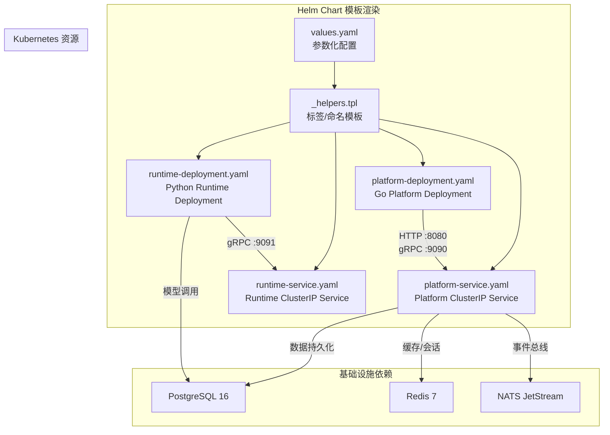
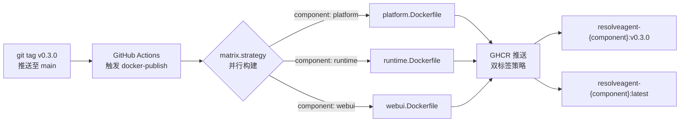

ResolveAgent 的 Kubernetes 生产部署体系围绕 **Helm Chart** 与 **多阶段容器镜像构建** 两条主线展开。整个部署架构将平台拆解为三个独立的容器化工作负载——Go Platform Service、Python Agent Runtime、React WebUI——并依赖 PostgreSQL、Redis、NATS JetStream 三类有状态中间件。Helm Chart 提供声明式的参数化编排能力，Kustomize 基座负责命名空间级别的资源基线，而 GitHub Actions CI/CD 管道则在每次语义化标签推送时自动构建并推送多架构镜像至 GHCR（GitHub Container Registry）。本文档将从容器镜像、Helm Chart 结构、Kubernetes 资源清单、健康探针集成、CI/CD 管道到生产部署实践逐层展开。

Sources: [Chart.yaml](deploy/helm/resolveagent/Chart.yaml#L1-L18), [values.yaml](deploy/helm/resolveagent/values.yaml#L1-L66), [docker-publish.yaml](.github/workflows/docker-publish.yaml#L1-L32)

## 容器镜像体系：三阶段构建与双语言运行时

ResolveAgent 的三个核心工作负载各自拥有独立的 Dockerfile，均采用**多阶段构建（multi-stage build）**策略以最小化最终镜像体积。构建产物严格分离：编译阶段使用完整工具链镜像，运行阶段仅包含最小依赖与静态二进制/虚拟环境。

| 工作负载 | Dockerfile | 构建阶段基础镜像 | 运行阶段基础镜像 | 暴露端口 | 健康检查端点 |
|---|---|---|---|---|---|
| **Platform** | `platform.Dockerfile` | `golang:1.25-alpine` | `alpine:3.20` | 8080 (HTTP), 9090 (gRPC) | `/healthz` |
| **Runtime** | `runtime.Dockerfile` | `python:3.12-slim` | `python:3.12-slim` | 9091 (gRPC) | `/healthz` |
| **WebUI** | `webui.Dockerfile` | `node:20-alpine` | `nginx:1.27-alpine` | 80 | `/` |

**Platform 镜像**的构建过程最具代表性。第一阶段通过 `go mod download && go mod verify` 缓存 Go 模块依赖，然后通过 `-ldflags` 注入版本元数据（`Version`、`Commit`、`BuildDate`），编译出静态链接的二进制 `resolveagent-server`。第二阶段以非 root 用户 `resolveagent`（UID/GID 1000）运行，仅包含 `ca-certificates`、`tzdata`、`curl` 三个额外包，并预置了 `configs/` 目录下的默认配置文件。Docker 原生 `HEALTHCHECK` 指令以 30 秒间隔探测 `/healthz` 端点。

Sources: [platform.Dockerfile](deploy/docker/platform.Dockerfile#L1-L61), [runtime.Dockerfile](deploy/docker/runtime.Dockerfile#L1-L64), [webui.Dockerfile](deploy/docker/webui.Dockerfile#L1-L47)

**Runtime 镜像**采用 `uv` 包管理器构建 Python 虚拟环境。第一阶段在 `/opt/venv` 中安装 `pyproject.toml` 声明的全部生产依赖，第二阶段将完整的虚拟环境目录 COPY 至运行时镜像。关键的环境变量设置包括 `PATH="/opt/venv/bin:$PATH"`、`PYTHONPATH="/app/src"`、`PYTHONUNBUFFERED=1`，确保 gRPC 服务模块能正确发现并加载 `resolveagent.runtime.server`。健康检查在容器启动 15 秒后开始探测 `http://localhost:9091/healthz`，这一较长的 `start-period` 反映了 Python 运行时初始化（含 AgentScope 框架加载、LLM 提供者连接池建立）的额外耗时。

**WebUI 镜像**的构建链路为：`pnpm install` → `pnpm build`（Vite 生产构建）→ Nginx 静态文件服务。运行阶段使用自定义 Nginx 配置 `default.conf`，提供 SPA 路由回退（`try_files $uri $uri/ /index.html`）、Gzip 压缩、静态资源 1 年强缓存（`immutable` 指令）以及 `/health` 健康端点。

Sources: [runtime.Dockerfile](deploy/docker/runtime.Dockerfile#L42-L63), [webui.Dockerfile](deploy/docker/webui.Dockerfile#L25-L47), [default.conf](deploy/docker/nginx/default.conf#L1-L29)

## Helm Chart 架构：模板化参数驱动

Helm Chart 位于 `deploy/helm/resolveagent/`，遵循标准 Chart 目录结构。Chart 元数据声明了 `apiVersion: v2`（Helm 3 专用），应用版本与 Chart 版本同步为 `0.1.0`，并通过 `keywords` 字段标记核心能力域（agent、ai、llm、fta、rag）。



`_helpers.tpl` 定义了三类核心模板函数，构成了 Kubernetes 资源标签体系的基础骨架。**`resolveagent.labels`** 生成通用标签（`helm.sh/chart`、`app.kubernetes.io/managed-by`、`app.kubernetes.io/part-of`），**`resolveagent.platform.selectorLabels`** 和 **`resolveagent.runtime.selectorLabels`** 分别为两个工作负载生成包含 `app.kubernetes.io/component` 的选择器标签。这种分层标签设计确保了 `kubectl get pods -l app.kubernetes.io/component=platform` 等细粒度查询能力。

Sources: [_helpers.tpl](deploy/helm/resolveagent/templates/_helpers.tpl#L1-L41), [Chart.yaml](deploy/helm/resolveagent/Chart.yaml#L1-L18)

### values.yaml 参数全景

`values.yaml` 是 Helm Chart 的核心配置入口，按照工作负载和基础设施两大维度组织参数。

**应用工作负载参数：**

| 参数路径 | Platform 默认值 | Runtime 默认值 | WebUI 默认值 | 说明 |
|---|---|---|---|---|
| `*.replicaCount` | 1 | 1 | 1 | Pod 副本数 |
| `*.image.repository` | `ghcr.io/ai-guru-global/resolveagent-platform` | `ghcr.io/ai-guru-global/resolveagent-runtime` | `ghcr.io/ai-guru-global/resolveagent-webui` | 镜像仓库地址 |
| `*.image.tag` | `""`（回退至 Chart AppVersion） | `""` | `""` | 镜像标签 |
| `*.image.pullPolicy` | `IfNotPresent` | `IfNotPresent` | `IfNotPresent` | 镜像拉取策略 |
| `*.service.httpPort` / `port` | 8080 | — | 80 | 服务端口 |
| `*.service.grpcPort` | 9090 | — | — | gRPC 端口 |
| `*.service.port`（Runtime） | — | 9091 | — | gRPC 服务端口 |

**资源配额参数：**

| 工作负载 | CPU Request | CPU Limit | Memory Request | Memory Limit |
|---|---|---|---|---|
| Platform | 100m | 500m | 128Mi | 512Mi |
| Runtime | 200m | **2** | 256Mi | **2Gi** |
| WebUI | 未配置 | 未配置 | 未配置 | 未配置 |

Runtime 的资源配额显著高于 Platform，这与 Python Agent 运行时的计算密集型特征（LLM 推理、向量嵌入、FTA 求值）直接对应。生产环境中建议通过 `--set runtime.resources.limits.memory=4Gi` 等参数按实际负载调整。

**基础设施开关参数：**

| 参数 | 默认值 | 说明 |
|---|---|---|
| `postgresql.enabled` | `true` | 是否部署内嵌 PostgreSQL |
| `postgresql.auth.username` | `resolveagent` | 数据库用户名 |
| `postgresql.auth.password` | `resolveagent` | 数据库密码 |
| `postgresql.auth.database` | `resolveagent` | 数据库名 |
| `redis.enabled` | `true` | 是否部署内嵌 Redis |
| `nats.enabled` | `true` | 是否部署内嵌 NATS |
| `ingress.enabled` | `false` | 是否创建 Ingress 资源 |
| `ingress.className` | `""` | IngressClass 名称 |
| `ingress.hosts[0].host` | `resolveagent.local` | 域名 |

Sources: [values.yaml](deploy/helm/resolveagent/values.yaml#L1-L66)

## Deployment 模板：健康探针与容器规范

Platform Deployment 模板定义了一个标准的 `apps/v1` Deployment，其 Pod 规范包含单个 `platform` 容器。镜像标签的解析逻辑为 `{{ .Values.platform.image.tag | default .Chart.AppVersion }}`，这意味着在 `values.yaml` 中 `tag` 为空字符串时会自动回退至 `Chart.yaml` 中声明的 `appVersion`——实现了版本管理的单点真源。

健康探针配置体现了 Kubernetes 最佳实践。**Liveness Probe** 使用 HTTP GET 探测 `/api/v1/health`（`initialDelaySeconds: 10`），用于检测进程死锁或不可恢复状态，触发 Pod 重启。**Readiness Probe** 同样探测 `/api/v1/health`（`initialDelaySeconds: 5`），但更短的初始延迟使其能更快地将就绪 Pod 加入 Service Endpoints。这两个探针在后端均由 `pkg/server/router.go` 中注册的 `handleHealth` 处理函数响应，返回 `{"status": "healthy", "timestamp": "..."}` JSON 载荷。

Runtime Deployment 模板相对简洁，当前版本未定义探针——这是因为 Runtime 的健康检查端点 `/healthz` 已在 Dockerfile 层面通过 `HEALTHCHECK` 指令实现。在更成熟的部署中，建议补充 Kubernetes 原生的 `livenessProbe` 和 `readinessProbe`，以利用 kubelet 级别的自动重启和服务发现集成。

Sources: [platform-deployment.yaml](deploy/helm/resolveagent/templates/platform-deployment.yaml#L1-L39), [runtime-deployment.yaml](deploy/helm/resolveagent/templates/runtime-deployment.yaml#L1-L27), [router.go](pkg/server/router.go#L21-L23)

## Service 模板：ClusterIP 与端口映射

两个 Service 模板均使用 `ClusterIP` 类型，符合集群内部通信的微服务最佳实践。外部流量应通过 Ingress 或 LoadBalancer Service 接入，而非直接暴露 NodePort。

Platform Service 暴露双端口：HTTP 8080 映射至容器 `http` 端口，gRPC 9090 映射至容器 `grpc` 端口。Service 通过 `resolveagent.platform.selectorLabels` 模板生成的标签选择器关联到对应的 Deployment Pod。Runtime Service 仅暴露单一 gRPC 端口 9091，同样通过组件专属的选择器标签精确匹配。

```yaml
# Platform Service 端口结构
ports:
  - port: 8080    # HTTP REST API
    targetPort: http
    name: http
  - port: 9090    # gRPC (Agent 通信/注册)
    targetPort: grpc
    name: grpc
```

WebUI 在 values.yaml 中声明了 `service.port: 80`，但当前 Chart 模板集中尚未包含 WebUI 的 Deployment 和 Service 模板——这意味着 WebUI 的 Kubernetes 部署需要用户自行扩展或等待后续版本补全。

Sources: [platform-service.yaml](deploy/helm/resolveagent/templates/platform-service.yaml#L1-L18), [runtime-service.yaml](deploy/helm/resolveagent/templates/runtime-service.yaml#L1-L15)

## Kustomize 基座：命名空间声明

`deploy/k8s/` 目录提供了一个极简的 Kustomize 基座，当前仅包含 Namespace 资源声明。该 Namespace 资源命名为 `resolveagent`，并附加了 `app.kubernetes.io/part-of: resolveagent` 标签，与 Helm Chart 模板中的标签体系保持一致。`kustomization.yaml` 引用该命名空间资源作为唯一的基础资源。

这个基座设计为 Helm Chart 的补充而非替代。在实际生产部署中，用户可以通过 Kustomize 的 `patchesStrategicMerge` 或 `patchesJson6902` 在 Helm 渲染结果之上叠加环境特定的定制（如 TLS 证书注入、NetworkPolicy、PodDisruptionBudget 等），而 Helm 负责核心工作负载的声明式编排。

Sources: [namespace.yaml](deploy/k8s/namespace.yaml#L1-L7), [kustomization.yaml](deploy/k8s/kustomization.yaml#L1-L5)

## CI/CD 管道：语义化标签触发自动发布

`.github/workflows/docker-publish.yaml` 定义了基于 GitHub Actions 的自动化镜像构建与发布管道。管道通过 `on: push: tags: ["v*"]` 触发器激活——每当推送 `v` 前缀的语义化标签（如 `v0.3.0`）时自动运行。



构建矩阵（`matrix: component: [platform, runtime, webui]`）并行构建三个组件镜像，每个组件生成两个标签：语义化版本标签（如 `v0.3.0`）和 `latest` 标签。镜像仓库地址遵循 `ghcr.io/${{ github.repository_owner }}/resolveagent-${{ matrix.component }}` 命名规范，与 `values.yaml` 中的默认 `image.repository` 完全一致——这意味着 Helm Chart 默认即可拉取到 CI/CD 管道发布的镜像。

认证通过 `docker/login-action@v3` 使用 `GITHUB_TOKEN` 自动完成，无需手动配置 Registry 凭据。管道所需的权限声明为 `contents: read`（读取代码）和 `packages: write`（推送镜像至 GHCR）。

Sources: [docker-publish.yaml](.github/workflows/docker-publish.yaml#L1-L32)

## 健康检查框架：三层探针体系

ResolveAgent 实现了从应用代码到容器运行时的完整健康检查链路。**应用层**，`pkg/health/health.go` 提供了 `Checker` 聚合器，支持注册多个组件级健康检查函数（`Check` 类型），并聚合为统一的 `Response` 载荷。`LivenessHandler` 始终返回 200 OK（纯进程存活检测），`ReadinessHandler` 则执行全部已注册检查并根据聚合状态返回 200 或 503。

**HTTP 路由层**，`pkg/server/router.go` 在 `/api/v1/health` 注册了简化版健康处理函数，返回 `{"status": "healthy", "timestamp": "..."}` JSON。这个端点同时服务于 Kubernetes 的 liveness 和 readiness 探针。

**gRPC 层**，`pkg/server/server.go` 通过标准库 `google.golang.org/grpc/health` 注册了 gRPC 健康检查服务，支持 gRPC 客户端（包括 Kubernetes gRPC 健康检查）的标准协议探测。

**容器层**，三个 Dockerfile 均定义了 Docker 原生 `HEALTHCHECK` 指令，使用 `curl -f` 探测各自的 HTTP 健康端点。这提供了 Docker Standalone 和 Docker Compose 环境下的健康状态可见性。

| 探针层级 | Platform | Runtime | WebUI |
|---|---|---|---|
| K8s Liveness Probe | `/api/v1/health` (HTTP) | 未配置 | 未配置 |
| K8s Readiness Probe | `/api/v1/health` (HTTP) | 未配置 | 未配置 |
| Docker HEALTHCHECK | `/healthz` (HTTP) | `/healthz` (HTTP) | `/` (HTTP) |
| gRPC Health | `grpc_health_v1` 标准 | — | — |

Sources: [health.go](pkg/health/health.go#L1-L104), [server.go](pkg/server/server.go#L63-L71), [platform-deployment.yaml](deploy/helm/resolveagent/templates/platform-deployment.yaml#L29-L38)

## 生产部署操作指南

### Helm 安装与升级

Makefile 提供了四个标准 Helm 操作目标，封装了常用命令行参数：

```bash
# 首次安装（自动创建命名空间）
make helm-install

# 升级至新版本
make helm-upgrade

# 本地渲染模板（调试用，不执行部署）
make helm-template

# 卸载
make helm-uninstall
```

底层命令等价于：

```bash
# helm-install
helm install resolveagent deploy/helm/resolveagent \
  --namespace resolveagent --create-namespace

# helm-upgrade（带自定义参数）
helm upgrade resolveagent deploy/helm/resolveagent \
  --namespace resolveagent \
  --set platform.replicaCount=3 \
  --set runtime.replicaCount=2 \
  --set platform.image.tag=v0.3.0 \
  --set ingress.enabled=true \
  --set ingress.className=nginx
```

Sources: [Makefile](Makefile#L207-L222)

### 环境变量配置映射

Platform 容器的全部配置项均可通过环境变量覆盖。Docker Compose 文件中声明的环境变量命名约定为 `RESOLVEAGENT_<SECTION>_<KEY>`，这些变量同样适用于 Kubernetes ConfigMap/Secret 的注入。以下是生产环境必须配置的关键变量分组：

**数据库连接（建议通过 Secret 注入）：**

| 环境变量 | Helm values 对应 | 说明 |
|---|---|---|
| `RESOLVEAGENT_DATABASE_HOST` | `postgresql.auth.*` 或外部地址 | PostgreSQL 主机 |
| `RESOLVEAGENT_DATABASE_PASSWORD` | 应通过 K8s Secret 注入 | 数据库密码 |
| `RESOLVEAGENT_DATABASE_SSLMODE` | — | 生产环境应设为 `require` 或 `verify-full` |

**LLM API 密钥（必须通过 Secret 注入）：**

| 环境变量 | 说明 |
|---|---|
| `RESOLVEAGENT_LLM_QWEN_API_KEY` | 通义千问 API 密钥 |
| `RESOLVEAGENT_LLM_WENXIN_API_KEY` | 文心一言 API 密钥 |
| `RESOLVEAGENT_LLM_ZHIPU_API_KEY` | 智谱清言 API 密钥 |

**网关认证（安全敏感）：**

| 环境变量 | 说明 |
|---|---|
| `RESOLVEAGENT_GATEWAY_AUTH_JWT_SECRET` | JWT 签名密钥 |
| `RESOLVEAGENT_GATEWAY_AUTH_ENABLED` | 是否启用网关认证 |

Sources: [docker-compose.yaml](deploy/docker-compose/docker-compose.yaml#L39-L69), [.env.example](deploy/docker-compose/.env.example#L1-L85)

### Nginx 反向代理配置（WebUI 生产前端）

生产环境中 WebUI 容器内嵌的 Nginx 不仅是静态文件服务器，还承担 API 反向代理职责。`deploy/docker/nginx/nginx.conf` 定义了完整的反向代理规则：`/api/` 路径代理至 `platform:8080`（带 keepalive 连接池、30 秒连接超时、60 秒读写超时），`/ws/` 路径支持 WebSocket 长连接升级（86400 秒超时），静态资源缓存 30 天。

安全头配置包括 `X-Frame-Options: SAMEORIGIN`、`X-Content-Type-Options: nosniff`、`X-XSS-Protection: 1; mode=block` 和 `Referrer-Policy: strict-origin-when-cross-origin`。隐藏文件访问被显式拒绝（`location ~ /\.` → `deny all`）。

在 Kubernetes 环境中，Nginx 的 `upstream platform_api` 中 `platform:8080` 会自动解析为 Kubernetes Service DNS 名称 `resolveagent-platform.resolveagent.svc.cluster.local:8080`，前提是 Helm Chart 部署在同一命名空间下。

Sources: [nginx.conf](deploy/docker/nginx/nginx.conf#L1-L98)

### 生产部署检查清单

基于当前架构分析，以下是从 Helm 默认值到生产就绪状态需要关注的关键调整项：

| 类别 | 当前状态 | 生产建议 |
|---|---|---|
| **副本数** | 全部为 1 | Platform ≥ 2，Runtime ≥ 2（高可用） |
| **Runtime 资源** | 2 CPU / 2Gi 内存 | 按并发 Agent 数调整，建议 4Gi+ |
| **WebUI K8s 模板** | Chart 中未包含 | 需补充 webui-deployment/service 模板 |
| **Ingress** | `enabled: false` | 生产必须启用，配合 TLS 证书 |
| **数据库密码** | 硬编码 `resolveagent` | 使用 K8s Secret + 外部 PostgreSQL |
| **Runtime 探针** | 仅 Docker HEALTHCHECK | 补充 K8s liveness/readiness Probe |
| **PDB** | 未配置 | 建议配置 PodDisruptionBudget |
| **HPA** | 未配置 | 按负载配置水平自动伸缩 |
| **镜像拉取** | `IfNotPresent` | 生产应设为 `Always`（配合 `latest` 标签）或固定版本标签 |
| **TLS** | 未配置 | Ingress 层启用 TLS termination |

Sources: [values.yaml](deploy/helm/resolveagent/values.yaml#L1-L66), [platform-deployment.yaml](deploy/helm/resolveagent/templates/platform-deployment.yaml#L1-L39)

## 版本管理与发布流程

ResolveAgent 的版本号存储在根目录 [`VERSION`](VERSION#L1) 文件中（当前为 `0.3.0`），Makefile 通过 `git describe --tags --always --dirty` 优先使用 Git 标签，回退至 VERSION 文件。这个版本号在三个层面被消费：

1. **Go 编译时注入**：通过 `-ldflags -X .../pkg/version.Version=$(VERSION)` 注入至 `pkg/version` 包，运行时通过 `/api/v1/system/info` 端点可查询。
2. **Docker 镜像标签**：CI/CD 管道从 Git 标签名提取版本号（`${{ github.ref_name }}`），作为 GHCR 镜像标签。
3. **Helm Chart 版本**：`Chart.yaml` 中的 `appVersion` 作为 Deployment 模板中 `image.tag` 的默认回退值。

完整的发布流程为：更新 `VERSION` 文件 → 提交并打标签 `git tag v0.3.0` → 推送标签触发 CI/CD → 镜像自动发布至 GHCR → 通过 `make helm-upgrade --set platform.image.tag=v0.3.0` 部署新版本。

Sources: [VERSION](VERSION#L1), [Makefile](Makefile#L10-L28), [docker-publish.yaml](.github/workflows/docker-publish.yaml#L5-L6)

## 延伸阅读

- [Docker Compose 部署：全栈容器化编排](29-docker-compose-bu-shu-quan-zhan-rong-qi-hua-bian-pai) — 了解 Docker Compose 部署与 K8s 部署的配置对应关系
- [可观测性：OpenTelemetry 指标、日志与链路追踪](31-ke-guan-ce-xing-opentelemetry-zhi-biao-ri-zhi-yu-lian-lu-zhui-zong) — 生产环境中 `telemetry.enabled` 的完整配置指南
- [Go 平台服务层：API Server、注册表与存储后端](5-go-ping-tai-fu-wu-ceng-api-server-zhu-ce-biao-yu-cun-chu-hou-duan) — Platform 容器内运行的 Go 服务架构详解
- [Python Agent 运行时层：执行引擎与生命周期管理](6-python-agent-yun-xing-shi-ceng-zhi-xing-yin-qing-yu-sheng-ming-zhou-qi-guan-li) — Runtime 容器内 Python 服务的内部机制