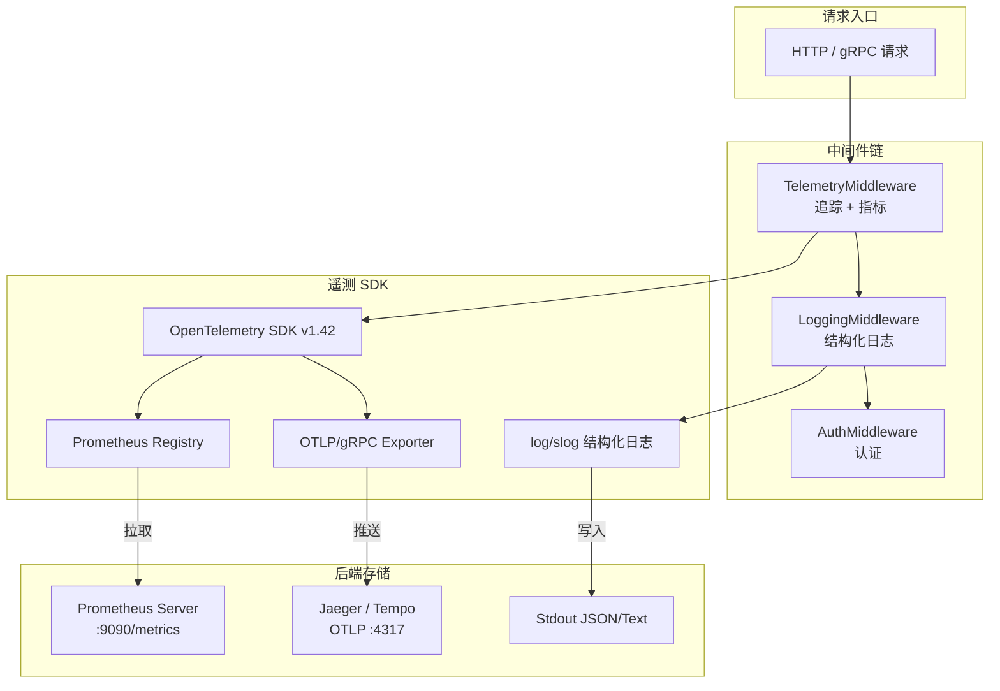
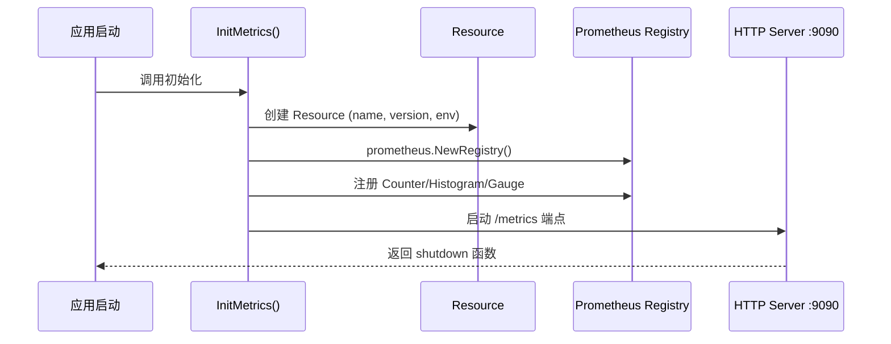
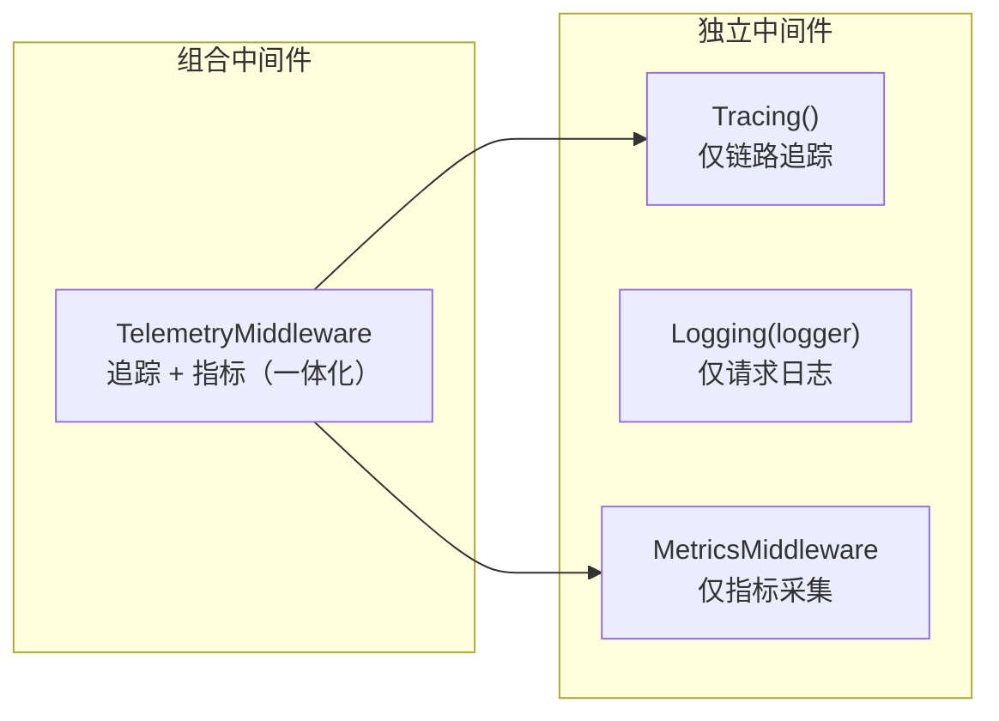

ResolveAgent 平台的可观测性体系建立在 **OpenTelemetry 标准协议**之上，覆盖 Metrics（指标）、Logs（日志）和 Traces（链路追踪）三大信号支柱。整个体系以 `pkg/telemetry/` 包为核心，通过 HTTP 中间件层将遥测数据自动注入每一次请求，配合 `pkg/health/` 健康检查系统和 `pkg/logger/` 结构化日志包，形成从数据采集、上下文传播到后端导出的完整可观测性管道。本文将逐一拆解这三大子系统的架构设计、配置方式与使用模式。

Sources: [metrics.go](pkg/telemetry/metrics.go#L1-L18), [tracer.go](pkg/telemetry/tracer.go#L1-L23), [logger.go](pkg/telemetry/logger.go#L1-L6)

## 架构总览：三层信号管道

在深入每个子系统之前，先理解可观测性管道的整体数据流向。ResolveAgent 采用 **SDK 原生集成 + 独立导出后端** 的架构模式：Go 平台服务通过 OpenTelemetry Go SDK 直接产出遥测数据，指标经由 Prometheus 拉取端点暴露，链路追踪通过 OTLP/gRPC 协议推送到远端 Collector，日志则通过 Go 标准库 `log/slog` 实现结构化输出。三者的关系如下图所示：



这套架构的关键设计原则是**渐进式启用**：`telemetry.enabled` 配置项默认为 `false`，所有遥测组件在未显式开启时自动降级为无操作（no-op），不会对运行时性能产生任何开销。

Sources: [middleware/telemetry.go](pkg/server/middleware/telemetry.go#L1-L19), [middleware/logging.go](pkg/server/middleware/logging.go#L1-L7), [middleware/auth.go](pkg/server/middleware/auth.go#L28-L31)

## 配置体系：环境变量与 YAML 双通道

可观测性的开关与参数通过 `TelemetryConfig` 结构体统一管理，支持 YAML 配置文件和环境变量两种配置方式，由 Viper 库实现自动绑定。

### TelemetryConfig 字段说明

| 字段 | YAML 键 | 环境变量 | 默认值 | 说明 |
|---|---|---|---|---|
| `Enabled` | `telemetry.enabled` | `RESOLVEAGENT_TELEMETRY_ENABLED` | `false` | 全局遥测开关 |
| `OTLPEndpoint` | `telemetry.otlp_endpoint` | `RESOLVEAGENT_TELEMETRY_OTLP_ENDPOINT` | `localhost:4317` | OTLP Collector gRPC 地址 |
| `ServiceName` | `telemetry.service_name` | — | `resolveagent-platform` | 服务名标识，写入 Resource 属性 |
| `MetricsEnabled` | `telemetry.metrics_enabled` | — | `true` | Prometheus 指标端点开关 |

配置加载采用**环境变量优先**策略：当同时存在 YAML 配置和环境变量时，环境变量值覆盖 YAML 值。这一机制通过 `viper.SetEnvPrefix("RESOLVEAGENT")` 和 `viper.AutomaticEnv()` 实现，键名中的 `.` 被自动替换为 `_`。

Sources: [types.go](pkg/config/types.go#L108-L114), [config.go](pkg/config/config.go#L39-L57), [.env.example](.env.example#L54-L59)

### Docker Compose 部署中的遥测配置

在生产 Docker Compose 编排中，`platform` 和 `runtime` 服务均通过环境变量注入遥测配置。以下是从 `docker-compose.yaml` 中提取的遥测相关片段：

```yaml
# platform 服务
RESOLVEAGENT_TELEMETRY_ENABLED: ${RESOLVEAGENT_TELEMETRY_ENABLED:-false}
RESOLVEAGENT_TELEMETRY_OTLP_ENDPOINT: ${RESOLVEAGENT_TELEMETRY_OTLP_ENDPOINT:-}

# runtime 服务
RESOLVEAGENT_TELEMETRY_ENABLED: ${RESOLVEAGENT_TELEMETRY_ENABLED:-false}
RESOLVEAGENT_TELEMETRY_OTLP_ENDPOINT: ${RESOLVEAGENT_TELEMETRY_OTLP_ENDPOINT:-}
```

双层变量引用（`${VAR:-default}`）确保 `.env` 文件中的配置可以覆盖默认值，而未设置时回退到安全默认值（遥测关闭）。

Sources: [docker-compose.yaml](deploy/docker-compose/docker-compose.yaml#L67-L69), [docker-compose.yaml](deploy/docker-compose/docker-compose.yaml#L104-L106)

## Metrics 子系统：Prometheus 指标采集

指标子系统是可观测性管道中最成熟的部分，基于 **OpenTelemetry Metrics SDK + Prometheus 客户端库**的双层架构构建。

### 初始化流程

`InitMetrics` 函数完成三项核心工作：创建带语义约定的 Resource、初始化 Prometheus Registry 和注册表、启动独立的 Prometheus HTTP 指标服务。Resource 通过 `semconv` 包注入 `service.name`、`service.version`、`deployment.environment` 三项标准属性，使得所有指标自动携带服务元数据。



Sources: [metrics.go](pkg/telemetry/metrics.go#L41-L129)

### 内置指标清单

平台预注册了以下核心指标，覆盖请求流量、Agent 执行和运行时系统三个维度：

| 指标名称 | 类型 | 标签 | 桶分布 | 说明 |
|---|---|---|---|---|
| `{service}_requests_total` | Counter | `service` | — | 请求总数 |
| `{service}_request_duration_seconds` | Histogram | — | 1ms~10s (12 桶) | 请求延迟分布 |
| `{service}_active_requests` | Gauge | — | — | 当前并发请求数 |
| `{service}_agent_executions_total` | CounterVec | `agent_id`, `status` | — | Agent 执行计数 |
| `{service}_agent_latency_seconds` | HistogramVec | `agent_id` | 10ms~30s (10 桶) | Agent 执行延迟 |
| `{service}_go_goroutines` | GaugeFunc | — | — | 当前 goroutine 数量 |
| `{service}_go_memory_alloc_bytes` | GaugeFunc | — | — | 堆内存分配量 |

其中 `{service}` 前缀由 `MetricsConfig.ServiceName` 决定（默认 `resolve-agent`）。`GaugeFunc` 类型指标通过回调函数实时读取 `runtime.NumGoroutine()` 和 `runtime.MemStats`，无需手动更新。

Sources: [metrics.go](pkg/telemetry/metrics.go#L131-L201)

### 运行时指标采集

除了 Prometheus 拉取模式暴露的指标外，系统还通过 `collectRuntimeMetrics` 协程每 30 秒采集一次运行时状态，以 Debug 级别日志输出 goroutine 数量、堆分配（MB）、堆系统内存（MB）和 GC 周期数。这些数据在问题诊断时可作为 Prometheus 指标的补充。

Sources: [metrics.go](pkg/telemetry/metrics.go#L204-L223)

### 公共记录 API

`telemetry` 包对外暴露四个指标记录函数，供业务代码直接调用：

- **`RecordRequest(method, path, status, duration)`** — 记录 HTTP 请求的计数和延迟
- **`RecordAgentExecution(agentID, status, duration)`** — 记录 Agent 执行的计数和延迟
- **`IncActiveRequests()` / `DecActiveRequests()`** — 增减当前并发请求仪表盘

这些函数内部都带有 nil 保护检查，确保在指标系统未初始化时安全降级为无操作。

Sources: [metrics.go](pkg/telemetry/metrics.go#L225-L257)

## Tracing 子系统：分布式链路追踪

链路追踪子系统基于 OpenTelemetry Trace SDK，通过 OTLP/gRPC 协议将 Span 数据导出到远端 Collector（如 Jaeger、Tempo 或 OpenTelemetry Collector）。

### Tracer 初始化与采样策略

`InitTracer` 函数的初始化流程包括：创建 OTLP gRPC 导出器、构建带主机名和运行时描述的 Resource、配置采样器、设置全局传播器。采样策略使用 `TraceIDRatioBased` 采样器，通过 `SampleRate` 参数（默认 `1.0` 即全量采样）控制采样比例。

**关键设计决策**：导出器创建失败时系统不会中断启动，而是以 `Warn` 级别记录日志并继续运行。这意味着即使 OTLP 后端不可达，应用仍能正常服务，只是不会产出追踪数据。

Sources: [tracer.go](pkg/telemetry/tracer.go#L42-L132)

### 上下文传播机制

系统注册了 `CompositeTextMapPropagator`，同时支持 **W3C TraceContext** 和 **Baggage** 两种传播格式：

```go
otel.SetTextMapPropagator(propagation.NewCompositeTextMapPropagator(
    propagation.TraceContext{},
    propagation.Baggage{},
))
```

这使得跨服务调用时，Trace ID 和 Span ID 能够通过 HTTP 头部自动传播，实现端到端的分布式追踪。当 Go 平台服务调用 Python Agent 运行时时，同一请求的追踪上下文可以贯穿整个调用链。

Sources: [tracer.go](pkg/telemetry/tracer.go#L112-L116)

### Span 操作辅助函数

`telemetry` 包提供了五个 Span 操作函数，封装了常见的链路追踪模式：

| 函数 | 用途 | 典型场景 |
|---|---|---|
| `StartSpan(ctx, name, ...opts)` | 创建子 Span | Agent 执行、数据库查询 |
| `SpanFromContext(ctx)` | 获取当前 Span | 在深层调用中访问 Span |
| `AddEvent(ctx, name, ...attrs)` | 添加 Span 事件 | 记录决策点、状态变更 |
| `SetAttributes(ctx, ...attrs)` | 设置 Span 属性 | 标注 agent_id、model 等 |
| `RecordError(ctx, err, ...opts)` | 记录错误到 Span | 异常捕获时关联到追踪 |

`StartSpan` 内置了 nil 保护：当全局 Tracer 未初始化时，返回从 context 中提取的 no-op Span，确保调用方无需关心追踪系统是否就绪。

Sources: [tracer.go](pkg/telemetry/tracer.go#L155-L199)

## Logging 子系统：双层结构化日志

ResolveAgent 的日志系统由两个互补的包组成：`pkg/telemetry/logger.go` 提供轻量级的日志创建功能，`pkg/logger/logger.go` 提供功能更丰富的日志抽象。

### telemetry.NewLogger — 轻量级日志创建

`NewLogger(level, format)` 是最简单的日志创建入口，接受日志级别（debug/info/warn/error）和输出格式（json/text）两个参数。未识别的级别默认回退到 `info`，未指定格式默认使用 `text`。输出目标固定为 `os.Stdout`。

### logger.New — 功能完整的日志抽象

`pkg/logger` 包提供了更丰富的选项式 API：

- **`WithLevel(level)`** — 设置日志级别
- **`WithFormat(format)`** — 设置输出格式
- **`WithOutput(writer)`** — 自定义输出目标（默认 Stdout）
- **`WithAttrs(attrs...)`** — 为所有日志条目注入默认属性
- **`Component(base, name)`** — 创建组件作用域日志器（自动添加 `component` 属性）
- **`WithContext(ctx, logger)` / `FromContext(ctx)`** — 日志实例的 Context 传播
- **`Nop()`** — 创建静默日志器（丢弃所有输出，适用于测试）

两个包的核心差异在于 `pkg/logger` 支持 **Context 传播**和**组件作用域**，适合在复杂的调用链中传递和隔离日志上下文。

Sources: [telemetry/logger.go](pkg/telemetry/logger.go#L1-L35), [logger/logger.go](pkg/logger/logger.go#L1-L116)

### 中间件层请求日志

`Logging` 中间件在每次 HTTP 请求完成后，以 Info 级别输出一条包含 `method`、`path`、`status`、`duration`、`remote_addr` 的结构化日志。这是应用层日志最常见的入口——每条日志对应一次完整的请求生命周期。

Sources: [middleware/logging.go](pkg/server/middleware/logging.go#L19-L37)

## HTTP 中间件链：遥测数据的自动注入

可观测性的核心价值在于**零侵入采集**。ResolveAgent 通过 `pkg/server/middleware/` 下的中间件体系，在不修改业务代码的前提下自动采集请求级别的遥测数据。

### 三层中间件架构

系统提供了三个层次的遥测中间件，支持灵活组合：



- **`TelemetryMiddleware`** — 一体化方案：外层包裹 `otelhttp.NewHandler` 自动创建 HTTP Span，内层嵌入指标采集逻辑，一次配置同时启用追踪和指标
- **`Tracing()`** — 独立追踪中间件：使用 `otel.Tracer("resolveagent.server")` 为每个请求创建名为 `{METHOD} {PATH}` 的 Server 端 Span，自动注入 `http.method`、`http.url`、`http.host`、`http.user_agent`、`http.route` 五个属性
- **`Logging(logger)`** — 独立日志中间件：捕获请求方法、路径、状态码、耗时和远端地址
- **`MetricsMiddleware`** — 独立指标中间件（定义在 `telemetry` 包中）：记录活跃请求数、请求计数和延迟

Sources: [middleware/telemetry.go](pkg/server/middleware/telemetry.go#L1-L53), [middleware/tracing.go](pkg/server/middleware/tracing.go#L1-L55), [middleware/logging.go](pkg/server/middleware/logging.go#L1-L38)

### Tracing 中间件的属性标注

`Tracing()` 中间件在请求处理的两个阶段注入 Span 属性：

1. **请求开始时**（Span 创建） — `http.method`、`http.url`、`http.host`、`http.user_agent`、`http.route`
2. **请求完成后**（Span 结束前） — `http.status_code`、`http.request_duration_ms`，以及当状态码 ≥ 400 时标注 `error=true`

这种两阶段标注模式确保响应状态码和请求耗时等只有在请求处理完成后才能获取的属性也能被准确记录。

Sources: [middleware/tracing.go](pkg/server/middleware/tracing.go#L18-L55)

### MetricsMiddleware 的响应码包装

`TelemetryMiddleware` 和独立的 `MetricsMiddleware` 都使用 `metricsResponseWriter` 包装原始 `http.ResponseWriter`，拦截 `WriteHeader` 调用以捕获实际状态码。包装器将状态码转换为语义标签：`< 400` 标记为 `success`，`≥ 400` 标记为 `error`。

Sources: [middleware/telemetry.go](pkg/server/middleware/telemetry.go#L22-L52), [metrics.go](pkg/telemetry/metrics.go#L282-L291)

## 健康检查系统：Kubernetes 探针集成

`pkg/health/` 包实现了符合 Kubernetes 探针模式的健康检查框架，与可观测性体系互补——健康检查回答"服务是否可用"，而遥测数据回答"服务表现如何"。

### 三级健康状态

| 状态 | 含义 | 对应 K8s 探针 |
|---|---|---|
| `UP` | 组件正常运行 | 就绪探针返回 200 |
| `DEGRADED` | 部分功能降级 | 就绪探针返回 503 |
| `DOWN` | 组件不可用 | 就绪探针返回 503 |

### 聚合规则

`Checker.Run()` 方法执行所有已注册的健康检查并按以下规则聚合：

1. 任一组件 `DOWN` → 整体状态 `DOWN`
2. 无 `DOWN` 但有 `DEGRADED` → 整体状态 `DEGRADED`
3. 全部 `UP` → 整体状态 `UP`

### 双端点设计

| 端点 | 路径 | 语义 | K8s 用途 |
|---|---|---|---|
| `LivenessHandler` | `/healthz` | 进程是否存活 | 存活探针（livenessProbe） |
| `ReadinessHandler` | `/readyz` | 是否准备好接收流量 | 就绪探针（readinessProbe） |

`LivenessHandler` 总是返回 200 OK（只要进程能响应请求即视为存活），`ReadinessHandler` 执行所有注册检查后根据聚合状态返回 200 或 503。此外，平台 HTTP 路由表中还暴露了 `GET /api/v1/health` 端点用于应用级健康查询。

Sources: [health.go](pkg/health/health.go#L1-L103), [router.go](pkg/server/router.go#L21-L22)

### 认证中间件的遥测路径豁免

`AuthMiddleware` 的 `DefaultAuthConfig` 将 `/health`、`/ready`、`/metrics` 三个路径列入 `SkipPaths`，确保健康检查和指标采集端点不受认证拦截，满足 Prometheus 拉取和 K8s 探针的访问需求。

Sources: [middleware/auth.go](pkg/server/middleware/auth.go#L25-L32)

## Go 模块依赖：OpenTelemetry SDK 版本

平台使用 OpenTelemetry Go SDK v1.42.0，以下是 `go.mod` 中所有遥测相关的直接依赖：

| 依赖 | 版本 | 用途 |
|---|---|---|
| `go.opentelemetry.io/otel` | v1.42.0 | 核心 API（Tracer、Meter、属性） |
| `go.opentelemetry.io/otel/trace` | v1.42.0 | Trace API 接口定义 |
| `go.opentelemetry.io/otel/sdk` | v1.42.0 | SDK 实现（TracerProvider、采样器） |
| `go.opentelemetry.io/otel/sdk/metric` | v1.42.0 | Metrics SDK（MeterProvider） |
| `go.opentelemetry.io/otel/exporters/otlp/otlptrace/otlptracegrpc` | v1.42.0 | OTLP gRPC 追踪导出器 |
| `go.opentelemetry.io/contrib/instrumentation/net/http/otelhttp` | v0.67.0 | HTTP 自动埋点工具 |
| `github.com/prometheus/client_golang` | — | Prometheus 客户端库 |

Sources: [go.mod](go.mod)

## 启用指南：从开发到生产

### 本地开发环境

在 `.env` 文件中设置以下变量即可启用遥测：

```bash
RESOLVEAGENT_TELEMETRY_ENABLED=true
RESOLVEAGENT_TELEMETRY_OTLP_ENDPOINT=localhost:4317
```

推荐使用 OpenTelemetry Collector 的 All-in-One 镜像作为本地后端，它同时提供 Prometheus 兼容的指标端点和 Jaeger 兼容的追踪 UI。

### 生产 Docker Compose 部署

修改 `deploy/docker-compose/.env` 中的遥测配置：

```bash
RESOLVEAGENT_TELEMETRY_ENABLED=true
RESOLVEAGENT_TELEMETRY_OTLP_ENDPOINT=otel-collector:4317
```

需要在 `docker-compose.yaml` 中额外添加 OpenTelemetry Collector 服务，或对接已有的可观测性基础设施（如 Grafana Tempo + Prometheus）。

Sources: [docker-compose.yaml](deploy/docker-compose/docker-compose.yaml#L67-L69), [docker-compose/.env.example](deploy/docker-compose/.env.example#L80-L84)

### 指标端点验证

启用后可通过以下方式验证指标端点是否正常：

```bash
curl http://localhost:9090/metrics
```

预期输出中包含 `resolve_agent_requests_total`、`resolve_agent_go_goroutines` 等指标行。

## 阅读导航

本文聚焦于可观测性的技术实现。如需了解部署层面的整体编排，请参阅 [Docker Compose 部署：全栈容器化编排](29-docker-compose-bu-shu-quan-zhan-rong-qi-hua-bian-pai) 和 [Kubernetes 与 Helm Chart 生产部署](30-kubernetes-yu-helm-chart-sheng-chan-bu-shu)。如需了解 API 端点的完整列表（包括健康检查端点），请参阅 [REST API 完整参考：端点、请求/响应格式与错误处理](32-rest-api-wan-zheng-can-kao-duan-dian-qing-qiu-xiang-ying-ge-shi-yu-cuo-wu-chu-li)。要理解中间件在整个服务架构中的位置，请参阅 [Go 平台服务层：API Server、注册表与存储后端](5-go-ping-tai-fu-wu-ceng-api-server-zhu-ce-biao-yu-cun-chu-hou-duan)。