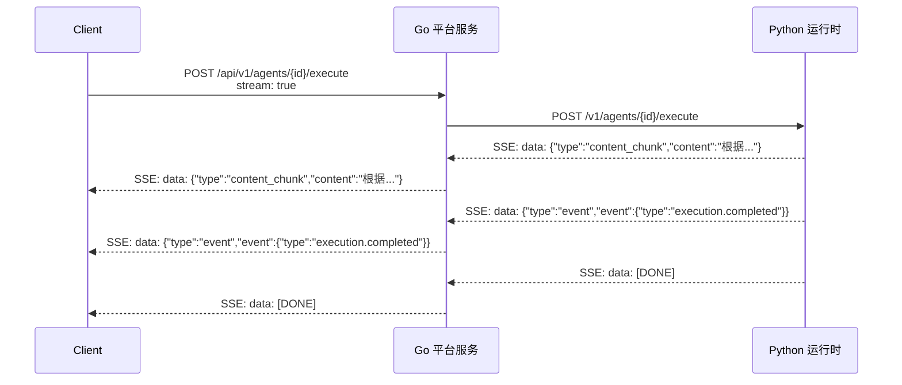

ResolveAgent 平台通过 Go 语言实现的 HTTP REST API 对外暴露全部管理能力，覆盖 Agent 生命周期、技能注册、工作流编排、RAG 检索增强、故障树分析、代码分析、记忆系统、故障排查方案等 **14 个功能域**，共计 **80+ 个端点**。API 遵循资源导向设计风格，以 `/api/v1` 为统一前缀，所有请求与响应均使用 `application/json`，执行类操作（Agent 执行、工作流执行、语料导入）额外支持 **Server-Sent Events (SSE)** 流式传输。本文档为中级开发者提供端点速查、请求/响应结构规范、统一错误模型和认证中间件的完整参考。

Sources: [router.go](pkg/server/router.go#L20-L149), [server.go](pkg/server/server.go#L43-L81), [openapi.yaml](api/openapi/v1/resolveagent.yaml#L1-L163)

## API 架构概览

ResolveAgent 平台服务层（Go `pkg/server`）同时启动 HTTP 和 gRPC 两种协议服务。REST API 由 `registerHTTPRoutes` 函数集中注册到 `http.ServeMux`，采用 Go 1.22+ 增强路由语法（`GET /api/v1/agents/{id}`）。请求处理链路经过可选的认证中间件、日志中间件和 OpenTelemetry 可观测性中间件，最终到达对应的 Handler 函数。Handler 通过 12 个注册表接口（Registry Interface）操作业务数据，并通过 `RuntimeClient` 将执行类请求代理到 Python 运行时。

```mermaid
flowchart LR
    Client["HTTP Client"]
    
    subgraph MW["中间件层"]
        Auth["认证中间件<br/>JWT / API Key / 网关头"]
        Log["日志中间件<br/>请求方法、路径、状态码、耗时"]
        Tele["可观测性中间件<br/>OpenTelemetry Span + Metrics"]
    end
    
    subgraph Router["路由分发 (ServeMux)"]
        R1["系统与健康"]
        R2["Agent 管理"]
        R3["Skill 管理"]
        R4["Workflow 编排"]
        R5["RAG 管道"]
        R6["Hook 管理"]
        R7["FTA 文档"]
        R8["代码分析"]
        R9["记忆系统"]
        R10["排查方案"]
        R11["调用图"]
        R12["流量捕获"]
        R13["流量图"]
        R14["模型/配置/语料"]
    end
    
    subgraph Backend["后端存储"]
        Reg["内存/Postgres<br/>12 大注册表"]
        RT["Python 运行时<br/>(HTTP :9091)"]
    end
    
    Client --> Auth --> Log --> Tele --> Router
    Router --> Reg
    Router --> RT
```



Sources: [server.go](pkg/server/server.go#L74-L78), [router.go](pkg/server/router.go#L20-L149), [middleware/auth.go](pkg/server/middleware/auth.go#L77-L103), [middleware/logging.go](pkg/server/middleware/logging.go#L20-L37), [middleware/telemetry.go](pkg/server/middleware/telemetry.go#L12-L19)

## 端点总览

下表按功能域列出全部 REST API 端点，包括 HTTP 方法、路径和简要描述。所有路径均以 `/api/v1` 为前缀，默认基础地址为 `http://localhost:8080`。

### 系统与健康检查

| 方法 | 路径 | 描述 |
|------|------|------|
| `GET` | `/api/v1/health` | 服务健康状态（含 UTC 时间戳） |
| `GET` | `/api/v1/system/info` | 系统信息（版本号、Git Commit、构建日期） |

Sources: [router.go](pkg/server/router.go#L22-L25), [router.go](pkg/server/router.go#L151-L165)

### Agent 管理

| 方法 | 路径 | 描述 |
|------|------|------|
| `GET` | `/api/v1/agents` | 列出所有 Agent |
| `POST` | `/api/v1/agents` | 创建 Agent |
| `GET` | `/api/v1/agents/{id}` | 获取指定 Agent |
| `PUT` | `/api/v1/agents/{id}` | 更新指定 Agent |
| `DELETE` | `/api/v1/agents/{id}` | 删除指定 Agent |
| `POST` | `/api/v1/agents/{id}/execute` | 执行 Agent（支持 SSE 流式） |

Sources: [router.go](pkg/server/router.go#L28-L33)

### Skill 技能管理

| 方法 | 路径 | 描述 |
|------|------|------|
| `GET` | `/api/v1/skills` | 列出所有已注册技能 |
| `POST` | `/api/v1/skills` | 注册新技能 |
| `GET` | `/api/v1/skills/{name}` | 获取指定技能（按名称） |
| `DELETE` | `/api/v1/skills/{name}` | 注销指定技能 |

Sources: [router.go](pkg/server/router.go#L36-L39)

### Workflow 工作流

| 方法 | 路径 | 描述 |
|------|------|------|
| `GET` | `/api/v1/workflows` | 列出所有工作流 |
| `POST` | `/api/v1/workflows` | 创建工作流 |
| `GET` | `/api/v1/workflows/{id}` | 获取指定工作流 |
| `PUT` | `/api/v1/workflows/{id}` | 更新指定工作流 |
| `DELETE` | `/api/v1/workflows/{id}` | 删除指定工作流 |
| `POST` | `/api/v1/workflows/{id}/validate` | 校验工作流结构（节点、边、类型） |
| `POST` | `/api/v1/workflows/{id}/execute` | 执行工作流（SSE 流式） |

Sources: [router.go](pkg/server/router.go#L42-L48)

### RAG 检索增强管道

| 方法 | 路径 | 描述 |
|------|------|------|
| `GET` | `/api/v1/rag/collections` | 列出所有集合 |
| `POST` | `/api/v1/rag/collections` | 创建集合 |
| `DELETE` | `/api/v1/rag/collections/{id}` | 删除集合 |
| `POST` | `/api/v1/rag/collections/{id}/ingest` | 文档摄入（转发 Python 运行时） |
| `POST` | `/api/v1/rag/collections/{id}/query` | 语义查询（转发 Python 运行时） |
| `GET` | `/api/v1/rag/collections/{id}/documents` | 列出集合内文档 |
| `POST` | `/api/v1/rag/collections/{id}/documents` | 创建文档元数据 |
| `GET` | `/api/v1/rag/documents/{id}` | 获取文档详情 |
| `PUT` | `/api/v1/rag/documents/{id}` | 更新文档 |
| `DELETE` | `/api/v1/rag/documents/{id}` | 删除文档 |
| `GET` | `/api/v1/rag/collections/{id}/ingestions` | 查看摄入历史 |

Sources: [router.go](pkg/server/router.go#L50-L79)

### Hook 生命周期钩子

| 方法 | 路径 | 描述 |
|------|------|------|
| `GET` | `/api/v1/hooks` | 列出所有 Hook |
| `POST` | `/api/v1/hooks` | 创建 Hook |
| `GET` | `/api/v1/hooks/{id}` | 获取指定 Hook |
| `PUT` | `/api/v1/hooks/{id}` | 更新指定 Hook |
| `DELETE` | `/api/v1/hooks/{id}` | 删除指定 Hook |
| `GET` | `/api/v1/hooks/{id}/executions` | 列出 Hook 执行记录 |

Sources: [router.go](pkg/server/router.go#L66-L71)

### FTA 故障树文档

| 方法 | 路径 | 描述 |
|------|------|------|
| `GET` | `/api/v1/fta/documents` | 列出所有 FTA 文档 |
| `POST` | `/api/v1/fta/documents` | 创建 FTA 文档 |
| `GET` | `/api/v1/fta/documents/{id}` | 获取指定 FTA 文档 |
| `PUT` | `/api/v1/fta/documents/{id}` | 更新指定 FTA 文档 |
| `DELETE` | `/api/v1/fta/documents/{id}` | 删除指定 FTA 文档 |
| `GET` | `/api/v1/fta/documents/{id}/results` | 列出分析结果 |
| `POST` | `/api/v1/fta/documents/{id}/results` | 创建分析结果 |

Sources: [router.go](pkg/server/router.go#L82-L88)

### 代码分析

| 方法 | 路径 | 描述 |
|------|------|------|
| `GET` | `/api/v1/analyses` | 列出所有分析 |
| `POST` | `/api/v1/analyses` | 创建分析任务 |
| `GET` | `/api/v1/analyses/{id}` | 获取指定分析 |
| `PUT` | `/api/v1/analyses/{id}` | 更新指定分析 |
| `DELETE` | `/api/v1/analyses/{id}` | 删除指定分析 |
| `GET` | `/api/v1/analyses/{id}/findings` | 列出分析发现（支持 `?severity=` 过滤） |
| `POST` | `/api/v1/analyses/{id}/findings` | 批量添加发现 |

Sources: [router.go](pkg/server/router.go#L91-L97)

### Agent 记忆系统

| 方法 | 路径 | 描述 |
|------|------|------|
| `GET` | `/api/v1/memory/agents/{agent_id}/conversations` | 列出 Agent 的对话 |
| `GET` | `/api/v1/memory/conversations/{id}` | 获取对话消息（支持 `?limit=`） |
| `POST` | `/api/v1/memory/conversations/{id}/messages` | 添加消息 |
| `DELETE` | `/api/v1/memory/conversations/{id}` | 删除对话 |
| `GET` | `/api/v1/memory/agents/{agent_id}/long-term` | 搜索长期记忆（支持 `?user_id=&type=`） |
| `POST` | `/api/v1/memory/long-term` | 存储长期记忆 |
| `GET` | `/api/v1/memory/long-term/{id}` | 获取长期记忆 |
| `PUT` | `/api/v1/memory/long-term/{id}` | 更新长期记忆 |
| `DELETE` | `/api/v1/memory/long-term/{id}` | 删除长期记忆 |
| `POST` | `/api/v1/memory/prune` | 清理过期记忆 |

Sources: [router.go](pkg/server/router.go#L103-L112)

### 故障排查方案

| 方法 | 路径 | 描述 |
|------|------|------|
| `GET` | `/api/v1/solutions` | 列出方案（支持 `?domain=&severity=&status=`） |
| `POST` | `/api/v1/solutions` | 创建方案 |
| `GET` | `/api/v1/solutions/{id}` | 获取指定方案 |
| `PUT` | `/api/v1/solutions/{id}` | 更新指定方案 |
| `DELETE` | `/api/v1/solutions/{id}` | 删除指定方案 |
| `POST` | `/api/v1/solutions/search` | 高级搜索方案 |
| `POST` | `/api/v1/solutions/bulk` | 批量创建方案 |
| `GET` | `/api/v1/solutions/{id}/executions` | 列出方案执行记录 |
| `POST` | `/api/v1/solutions/{id}/executions` | 记录方案执行 |

Sources: [router.go](pkg/server/router.go#L115-L123)

### 调用图

| 方法 | 路径 | 描述 |
|------|------|------|
| `GET` | `/api/v1/call-graphs` | 列出调用图（支持 `?analysis_id=`） |
| `POST` | `/api/v1/call-graphs` | 创建调用图 |
| `GET` | `/api/v1/call-graphs/{id}` | 获取指定调用图 |
| `DELETE` | `/api/v1/call-graphs/{id}` | 删除指定调用图 |
| `GET` | `/api/v1/call-graphs/{id}/nodes` | 列出节点 |
| `GET` | `/api/v1/call-graphs/{id}/edges` | 列出边 |
| `GET` | `/api/v1/call-graphs/{id}/subgraph` | 提取子图（`?entry=&depth=`） |

Sources: [router.go](pkg/server/router.go#L126-L132)

### 流量捕获与流量图

| 方法 | 路径 | 描述 |
|------|------|------|
| `GET` | `/api/v1/traffic/captures` | 列出流量捕获 |
| `POST` | `/api/v1/traffic/captures` | 创建流量捕获 |
| `GET` | `/api/v1/traffic/captures/{id}` | 获取指定捕获 |
| `DELETE` | `/api/v1/traffic/captures/{id}` | 删除指定捕获 |
| `POST` | `/api/v1/traffic/captures/{id}/records` | 批量添加流量记录 |
| `GET` | `/api/v1/traffic/captures/{id}/records` | 列出流量记录 |
| `GET` | `/api/v1/traffic/graphs` | 列出流量图 |
| `POST` | `/api/v1/traffic/graphs` | 创建流量图 |
| `GET` | `/api/v1/traffic/graphs/{id}` | 获取指定流量图 |
| `PUT` | `/api/v1/traffic/graphs/{id}` | 更新流量图 |
| `DELETE` | `/api/v1/traffic/graphs/{id}` | 删除流量图 |
| `POST` | `/api/v1/traffic/graphs/{id}/analyze` | 分析流量图（转发 Python 运行时 LLM 分析） |

Sources: [router.go](pkg/server/router.go#L134-L148)

### 模型与配置

| 方法 | 路径 | 描述 |
|------|------|------|
| `GET` | `/api/v1/models` | 列出已配置的 LLM 模型路由 |
| `POST` | `/api/v1/models` | 添加模型（尚未实现） |
| `GET` | `/api/v1/config` | 获取系统配置（脱敏） |
| `PUT` | `/api/v1/config` | 更新配置（尚未实现） |

Sources: [router.go](pkg/server/router.go#L58-L63), [router.go](pkg/server/router.go#L1146-L1195)

### 语料库导入

| 方法 | 路径 | 描述 |
|------|------|------|
| `POST` | `/api/v1/corpus/import` | 从 Git 仓库导入语料（SSE 流式） |

Sources: [router.go](pkg/server/router.go#L100), [corpus_handler.go](pkg/server/corpus_handler.go#L12-L113)

## 核心请求/响应格式

### 统一响应包装

所有成功的列表类端点遵循统一的 `{"items": [...], "total": N}` 包装格式，其中 `items` 的键名因资源类型而异（如 `agents`、`skills`、`workflows` 等）。单个资源的创建与更新直接返回资源对象本身。

**成功响应辅助函数**（`writeJSON`）将任意数据序列化为 JSON 并设置 `Content-Type: application/json`：

```go
// writeJSON 设置 Content-Type 并写入 JSON 响应
func writeJSON(w http.ResponseWriter, status int, data any) {
    w.Header().Set("Content-Type", "application/json")
    w.WriteHeader(status)
    _ = json.NewEncoder(w).Encode(data)
}
```

**错误响应**统一为 `{"error": "<message>"}` 格式：

```go
func writeError(w http.ResponseWriter, status int, message string) {
    writeJSON(w, status, map[string]string{"error": message})
}
```

Sources: [router.go](pkg/server/router.go#L2151-L2159)

### Agent 请求与响应

**创建 Agent** — `POST /api/v1/agents`

请求体结构（`AgentDefinition`）：

| 字段 | 类型 | 必填 | 说明 |
|------|------|------|------|
| `id` | string | ✅ | Agent 唯一标识 |
| `name` | string | ✅ | Agent 名称 |
| `description` | string | | 描述 |
| `type` | string | | 类型，默认 `"mega"` |
| `status` | string | | 状态，默认 `"active"` |
| `config` | object | | 自定义配置键值对 |
| `labels` | map\<string,string\> | | 标签 |

成功响应：`201 Created`，返回完整的 `AgentDefinition` 对象。

冲突响应：`409 Conflict`，`{"error": "agent <id> already exists"}`。

**执行 Agent** — `POST /api/v1/agents/{id}/execute`

请求体结构：

```json
{
  "message": "帮我分析这个 Pod 的 CrashLoopBackOff 问题",
  "context": {"namespace": "production", "pod_name": "api-server-7d8f9"},
  "conversation_id": "conv-123",
  "stream": true
}
```

| 字段 | 类型 | 必填 | 说明 |
|------|------|------|------|
| `message` | string | ✅ | 用户输入消息 |
| `context` | object | | 上下文信息 |
| `conversation_id` | string | | 关联对话 ID |
| `stream` | boolean | | 是否启用 SSE 流式（默认 false） |

**非流式模式**（`stream: false` 或 `Accept` 非 `text/event-stream`）：

```json
{
  "agent_id": "k8s-expert",
  "content": "根据日志分析，Pod 因 OOMKilled 退出...",
  "metadata": {"model": "qwen-plus", "tokens_used": 1523}
}
```

**流式模式**（`stream: true` 或 `Accept: text/event-stream`）：返回 SSE 流，`Content-Type: text/event-stream`，每个事件格式为 `data: <JSON>\n\n`，流结束时发送 `data: [DONE]\n\n`。

Sources: [router.go](pkg/server/router.go#L183-L429), [agent.go](pkg/registry/agent.go#L10-L19), [runtime_client.go](pkg/server/runtime_client.go#L38-L65)

### SSE 流式事件类型

Agent 执行、工作流执行和语料导入均使用 SSE 协议进行流式传输。以下为三种核心事件类型：



| 事件 `type` 值 | 含义 | 关键字段 |
|----------------|------|----------|
| `content` / `content_chunk` | 内容片段 | `content`（文本）, `metadata`（可选） |
| `event` | 执行状态事件 | `event.type`（如 `"execution.completed"`、`"workflow.completed"`） |
| `error` | 执行错误 | `error.code`, `error.message` |

Sources: [router.go](pkg/server/router.go#L354-L428), [runtime_client.go](pkg/server/runtime_client.go#L46-L65)

### Workflow 请求与响应

**创建工作流** — `POST /api/v1/workflows`

请求体结构（`WorkflowDefinition`）：

| 字段 | 类型 | 必填 | 说明 |
|------|------|------|------|
| `id` | string | ✅ | 工作流唯一标识 |
| `name` | string | ✅ | 工作流名称 |
| `description` | string | | 描述 |
| `tree` | object | | 工作流定义（含 `definition.nodes` 和 `definition.edges`） |
| `status` | string | | 状态，默认 `"draft"` |

**校验工作流** — `POST /api/v1/workflows/{id}/validate`

校验逻辑覆盖以下规则：节点必须包含 `id` 和 `type`；`type` 合法值为 `start`、`end`、`agent`、`skill`、`condition`、`action`、`wait`；必须包含至少一个 `start` 节点和一个 `end` 节点；边的 `from`/`to` 必须引用已存在的节点 ID。

```json
{
  "workflow_id": "wf-001",
  "valid": false,
  "errors": [
    "workflow must have a start node",
    "edge references unknown node: node-99"
  ]
}
```

**执行工作流** — `POST /api/v1/workflows/{id}/execute`

```json
{
  "input": {"alert_text": "CPU usage > 95% on node-3"},
  "context": {"environment": "production"}
}
```

工作流执行始终使用 SSE 流式传输，事件结构同 Agent 执行，完成事件类型为 `"workflow.completed"`。

Sources: [router.go](pkg/server/router.go#L505-L838), [workflow.go](pkg/registry/workflow.go#L10-L17)

### Skill 请求与响应

**注册技能** — `POST /api/v1/skills`

请求体结构（`SkillDefinition`）：

| 字段 | 类型 | 必填 | 说明 |
|------|------|------|------|
| `name` | string | ✅ | 技能名称（作为主键） |
| `version` | string | | 版本号 |
| `description` | string | | 描述 |
| `skill_type` | string | | 技能类型（`general` / `scenario`） |
| `domain` | string | | 领域标签 |
| `tags` | string[] | | 标签列表 |
| `manifest` | object | | 技能声明清单 |
| `source_type` | string | | 来源类型 |
| `source_uri` | string | | 来源地址 |
| `status` | string | | 状态，默认 `"active"` |

注意：Skill 以 `name` 而非 `id` 作为路径参数和主键，区别于其他资源。

Sources: [router.go](pkg/server/router.go#L447-L501), [skill.go](pkg/registry/skill.go#L10-L23)

### RAG 管道请求与响应

**创建集合** — `POST /api/v1/rag/collections`

```json
{
  "name": "k8s-troubleshooting",
  "description": "Kubernetes 故障排查知识库",
  "embedding_model": "bge-large-zh",
  "chunk_strategy": "sentence",
  "labels": {"team": "sre"}
}
```

默认值：`embedding_model` → `"bge-large-zh"`，`chunk_strategy` → `"sentence"`。

**文档摄入** — `POST /api/v1/rag/collections/{id}/ingest`

```json
{
  "documents": [
    {
      "content": "当 Pod 处于 CrashLoopBackOff 状态时，首先检查容器日志...",
      "metadata": {"source": "runbook-001", "category": "pod-troubleshooting"}
    }
  ]
}
```

响应（`202 Accepted`）：

```json
{
  "collection_id": "col-abc",
  "status": "completed",
  "documents_added": 1,
  "success": true,
  "message": "Document ingestion completed"
}
```

**语义查询** — `POST /api/v1/rag/collections/{id}/query`

```json
{
  "query": "Pod 一直重启怎么排查",
  "top_k": 5,
  "filters": {"category": "pod-troubleshooting"}
}
```

响应：

```json
{
  "query": "Pod 一直重启怎么排查",
  "results": [
    {
      "content": "当 Pod 处于 CrashLoopBackOff 状态时...",
      "score": 0.92,
      "document_id": "doc-001",
      "metadata": {"source": "runbook-001"}
    }
  ],
  "total": 3,
  "duration_ms": 145,
  "collection": "col-abc"
}
```

`top_k` 取值范围 1–100，默认 5。

Sources: [router.go](pkg/server/router.go#L842-L1136), [rag.go](pkg/registry/rag.go#L10-L29), [runtime_client.go](pkg/server/runtime_client.go#L221-L327)

### 记忆系统请求与响应

记忆系统分为**短期记忆**（对话消息）和**长期记忆**（跨会话知识）两部分。

**添加对话消息** — `POST /api/v1/memory/conversations/{id}/messages`

请求体结构（`ShortTermMemory`）：

| 字段 | 类型 | 必填 | 说明 |
|------|------|------|------|
| `role` | string | ✅ | 角色：`system`、`user`、`assistant`、`tool` |
| `content` | string | | 消息内容 |
| `agent_id` | string | | 关联 Agent ID |
| `token_count` | int | | Token 计数 |
| `metadata` | object | | 附加元数据 |

**存储长期记忆** — `POST /api/v1/memory/long-term`

请求体结构（`LongTermMemory`）：

| 字段 | 类型 | 必填 | 说明 |
|------|------|------|------|
| `agent_id` | string | ✅ | 关联 Agent ID |
| `user_id` | string | | 用户 ID |
| `memory_type` | string | | 类型：`summary`、`preference`、`pattern`、`fact`、`skill_learned` |
| `content` | string | | 记忆内容 |
| `importance` | float | | 重要性评分 0.0–1.0，默认 0.5 |
| `expires_at` | string | | 过期时间（RFC3339） |

获取长期记忆时自动递增访问计数（`access_count`）。

**清理过期记忆** — `POST /api/v1/memory/prune`：删除所有已过期的长期记忆，返回 `{"pruned": <count>}`。

Sources: [router.go](pkg/server/router.go#L1684-L1862), [memory.go](pkg/registry/memory.go#L12-L60)

### 故障排查方案请求与响应

**创建方案** — `POST /api/v1/solutions`

请求体结构（`TroubleshootingSolution`）：

| 字段 | 类型 | 必填 | 说明 |
|------|------|------|------|
| `title` | string | ✅ | 方案标题 |
| `problem_symptoms` | string | ✅ | 问题症状描述 |
| `key_information` | string | | 关键信息 |
| `troubleshooting_steps` | string | | 排查步骤 |
| `resolution_steps` | string | | 解决步骤 |
| `domain` | string | | 领域 |
| `component` | string | | 组件 |
| `severity` | string | | 严重程度，默认 `"medium"` |
| `status` | string | | 状态，默认 `"active"` |

**高级搜索** — `POST /api/v1/solutions/search`

```json
{
  "keyword": "OOMKilled",
  "domain": "kubernetes",
  "severity": "high",
  "tags": ["pod", "memory"],
  "limit": 20,
  "offset": 0
}
```

**批量导入** — `POST /api/v1/solutions/bulk`

```json
{
  "solutions": [
    {"title": "...", "problem_symptoms": "..."},
    {"title": "...", "problem_symptoms": "..."}
  ]
}
```

Sources: [solution_handler.go](pkg/server/solution_handler.go#L15-L200), [solution.go](pkg/registry/solution.go#L12-L61)

### 语料库导入请求与响应

**语料导入** — `POST /api/v1/corpus/import`

```json
{
  "source": "https://github.com/org/kudig-skills.git",
  "import_types": ["skills", "solutions"],
  "rag_collection_id": "col-abc",
  "profile": "production",
  "force_clone": false,
  "dry_run": true
}
```

| 字段 | 类型 | 必填 | 说明 |
|------|------|------|------|
| `source` | string | ✅ | Git 仓库地址 |
| `import_types` | string[] | | 导入类型列表 |
| `rag_collection_id` | string | | 关联 RAG 集合 |
| `profile` | string | | 环境配置 |
| `force_clone` | boolean | | 强制重新克隆 |
| `dry_run` | boolean | | 试运行模式 |

语料导入使用 SSE 流式返回进度事件，事件结构为 `CorpusImportEvent`：

```json
{"type": "progress", "message": "Cloning repository...", "data": {"step": 1, "total": 5}}
{"type": "progress", "message": "Imported 15 skills", "data": {"skills_imported": 15}}
{"type": "complete", "message": "Import finished", "data": {"total_imported": 42}}
```

Sources: [corpus_handler.go](pkg/server/corpus_handler.go#L12-L113), [runtime_client.go](pkg/server/runtime_client.go#L379-L394)

### 流量图分析

**分析流量图** — `POST /api/v1/traffic/graphs/{id}/analyze`

此端点直接将流量图数据代理到 Python 运行时的 `/traffic/report` 端点进行 LLM 分析，响应体透传 Python 运行时的原始 JSON 输出。若 Python 运行时不可达，返回 `502 Bad Gateway`。

Sources: [router.go](pkg/server/router.go#L2110-L2147)

## 统一错误处理

### 错误响应格式

所有 API 错误响应统一使用以下 JSON 格式：

```json
{
  "error": "agent abc-123 not found"
}
```

错误响应由 `writeError` 辅助函数生成，消息内容来自注册表返回的错误或 Handler 自身的验证逻辑。

Sources: [router.go](pkg/server/router.go#L2157-L2159)

### HTTP 状态码映射

平台定义了结构化的错误码体系（`pkg/errors`），可将业务错误自动映射到 HTTP 状态码。以下为完整映射表：

| 错误码 (Code) | HTTP 状态码 | 含义 |
|----------------|------------|------|
| `NOT_FOUND` | `404` | 资源不存在 |
| `ALREADY_EXISTS` | `409` | 资源已存在（创建冲突） |
| `INVALID_ARGUMENT` | `400` | 参数校验失败 |
| `UNAUTHORIZED` | `401` | 未认证 |
| `FORBIDDEN` | `403` | 无权限 |
| `INTERNAL` | `500` | 内部错误 |
| `UNAVAILABLE` | `503` | 服务不可用 |
| `TIMEOUT` | `504` | 操作超时 |
| `CONFLICT` | `409` | 通用冲突 |
| `RATE_LIMITED` | `429` | 请求频率限制 |

此外，Handler 层还使用以下 HTTP 状态码：`408 Request Timeout`（请求上下文超时）、`501 Not Implemented`（尚未实现的功能，如模型注册和配置更新）、`502 Bad Gateway`（Python 运行时不可达）。

Sources: [errors.go](pkg/errors/errors.go#L13-L122), [router.go](pkg/server/router.go#L338-L339)

### 结构化错误类型

平台提供了 `errors.Error` 结构体，包含 `Code`（机器可读错误码）、`Message`（人类可读描述）和 `Cause`（原始错误链）：

```go
type Error struct {
    Code    Code   `json:"code"`
    Message string `json:"message"`
    Cause   error  `json:"-"`
}
```

便捷构造函数：

- `errors.NotFound(entity, id)` — 生成 `NOT_FOUND` 错误
- `errors.AlreadyExists(entity, id)` — 生成 `ALREADY_EXISTS` 错误
- `errors.InvalidArgument(field, reason)` — 生成 `INVALID_ARGUMENT` 错误
- `errors.Wrap(code, message, cause)` — 包装底层错误

`HTTPStatus(err)` 函数可从任意 `error` 中提取 `Code` 并返回对应的 HTTP 状态码，未识别的错误统一返回 `500`。

Sources: [errors.go](pkg/errors/errors.go#L43-L122)

### Handler 层错误场景

各 Handler 在以下场景产生特定 HTTP 状态码：

| 场景 | 状态码 | 示例消息 |
|------|--------|----------|
| 请求体读取失败 | `400` | `"failed to read request body"` |
| JSON 解析错误 | `400` | `"invalid JSON: unexpected end of JSON input"` |
| 必填字段缺失 | `400` | `"agent ID is required"` / `"title is required"` |
| 资源已存在 | `409` | `"agent abc already exists"` |
| 资源不存在 | `404` | `"agent xyz not found"` |
| 服务不可用 | `503` | `"RAG service not available"` |
| 执行失败 | `500` | `"execution failed: runtime error"` |
| 请求超时 | `408` | `"request timeout"` |
| 运行时不可达 | `502` | `"runtime unavailable: connection refused"` |

Sources: [router.go](pkg/server/router.go#L188-L220), [router.go](pkg/server/router.go#L273-L339)

## 认证中间件

认证中间件（`AuthMiddleware`）支持三种认证方式，按优先级依次尝试：**网关转发头** → **JWT Bearer Token** → **API Key**。

### 认证方式

| 方式 | 请求头 | 说明 |
|------|--------|------|
| 网关转发 | `X-Auth-User` + `X-Auth-Roles` | 由上层 API 网关注入，信任网关认证 |
| JWT | `Authorization: Bearer <token>` | HMAC-SHA256 签名的 JWT，校验 `iss` 声明 |
| API Key | `X-API-Key` 或 `Authorization` | 静态 API Key 匹配 |

### 配置与跳过路径

认证默认**关闭**（`Enabled: false`），通过 `AuthConfig` 启用。以下路径自动跳过认证检查：`/health`、`/ready`、`/metrics`。

```go
type AuthConfig struct {
    Enabled     bool     `mapstructure:"enabled"`
    JWTSecret   string   `mapstructure:"jwt_secret"`
    JWTIssuer   string   `mapstructure:"jwt_issuer"`     // 默认 "resolveagent"
    APIKeyNames []string `mapstructure:"api_key_names"`  // 默认 ["X-API-Key", "Authorization"]
    SkipPaths   []string `mapstructure:"skip_paths"`     // 默认 ["/health", "/ready", "/metrics"]
}
```

认证成功后，将 `AuthContext` 注入请求上下文，包含 `UserID`、`Username`、`Roles`、`AuthType` 字段。

Sources: [auth.go](pkg/server/middleware/auth.go#L16-L200)

## 可观测性中间件

### 请求日志

`Logging` 中间件在请求完成后记录结构化日志，包含 HTTP 方法、路径、状态码、耗时和客户端地址。

Sources: [logging.go](pkg/server/middleware/logging.go#L20-L37)

### OpenTelemetry 集成

`TelemetryMiddleware` 为每个 HTTP 请求创建 OpenTelemetry Span，记录 `http.method`、`http.url`、`http.status_code`、`http.request_duration_ms` 等属性，并更新活跃请求数和请求延迟指标。状态码 ≥ 400 时标记 `error=true`。

`Tracing` 中间件独立提供更细粒度的 Span 创建，设置 `SpanKindServer` 和完整 HTTP 属性集。

Sources: [telemetry.go](pkg/server/middleware/telemetry.go#L12-L53), [tracing.go](pkg/server/middleware/tracing.go#L14-L55)

## 分页与过滤

列表类端点统一接受 `ListOptions` 参数，支持 `Limit`/`Offset` 分页和 `Filter` 键值过滤。部分端点还支持查询字符串参数：

| 端点 | 查询参数 | 说明 |
|------|----------|------|
| `GET /api/v1/solutions` | `?domain=&severity=&status=&limit=&offset=` | 多维度过滤 |
| `GET /api/v1/analyses/{id}/findings` | `?severity=` | 按严重程度过滤发现 |
| `GET /api/v1/memory/agents/{id}/long-term` | `?user_id=&type=` | 按用户和记忆类型搜索 |
| `GET /api/v1/memory/conversations/{id}` | `?limit=` | 限制消息数量 |
| `GET /api/v1/call-graphs` | `?analysis_id=` | 按分析任务过滤 |
| `GET /api/v1/call-graphs/{id}/subgraph` | `?entry=&depth=` | 子图提取参数 |

Sources: [agent.go](pkg/registry/agent.go#L97-L104), [solution_handler.go](pkg/server/solution_handler.go#L15-L48), [router.go](pkg/server/router.go#L1626-L1648)

## 进阶阅读

- [Go 平台服务层：API Server、注册表与存储后端](5-go-ping-tai-fu-wu-ceng-api-server-zhu-ce-biao-yu-cun-chu-hou-duan) — 深入理解 12 大注册表接口与内存/Postgres 双后端实现
- [整体架构设计：三层微服务与双语言运行时](4-zheng-ti-jia-gou-she-ji-san-ceng-wei-fu-wu-yu-shuang-yu-yan-yun-xing-shi) — Go 平台服务与 Python 运行时的协作架构
- [测试体系：单元测试、集成测试与端到端测试](34-ce-shi-ti-xi-dan-yuan-ce-shi-ji-cheng-ce-shi-yu-duan-dao-duan-ce-shi) — API 端点测试策略
- [可观测性：OpenTelemetry 指标、日志与链路追踪](31-ke-guan-ce-xing-opentelemetry-zhi-biao-ri-zhi-yu-lian-lu-zhui-zong) — 中间件可观测性详细说明