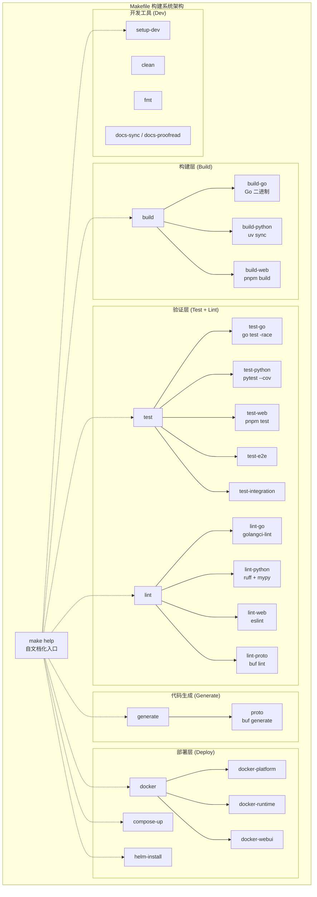
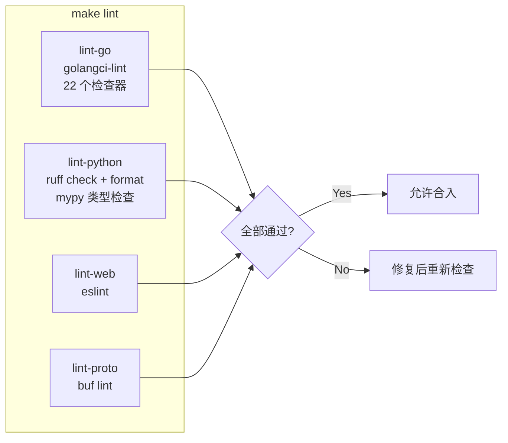
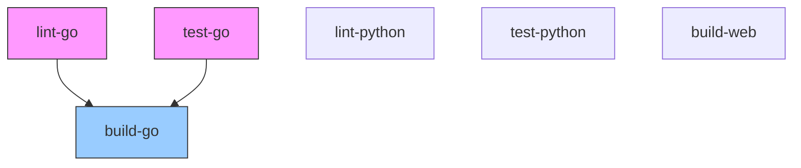

ResolveAgent 采用一套统一的 **Makefile 构建系统**来编排 Go 平台服务、Python Agent 运行时和 Web 前端三层的构建、测试、代码检查、代码生成与部署全流程。该构建系统以 `make help` 为自文档化入口，将 30 余个 target 按功能域划分为 **Build / Test / Database Migration / Lint / Code Generation / Docker / Docker Compose / Helm / Development** 九大分组，覆盖从本地开发到生产镜像构建的完整 DevOps 生命周期。本文将逐一拆解其架构设计、关键 target 行为、版本注入机制与 CI/CD 集成模式。

Sources: [Makefile](Makefile#L1-L261)

## 构建系统总体架构

Makefile 以 `.DEFAULT_GOAL := help` 设定默认目标，开发者键入 `make` 即可看到全部可用 target 及其说明。项目元数据通过顶层变量集中管理——`PROJECT_NAME`、`MODULE`（Go module 路径）、`VERSION`、`COMMIT`、`BUILD_DATE`——其中版本号采用 **git tag 优先、VERSION 文件兜底、dev 兜底** 的三级降级策略。

下表展示了 Makefile 的九大功能域及其核心 target：

| 功能域 | 核心 Target | 说明 |
|---|---|---|
| **Build** | `build`, `build-go`, `build-python`, `build-web` | 三语言组件并行构建 |
| **Test** | `test`, `test-go`, `test-python`, `test-web`, `test-e2e`, `test-integration` | 四层测试金字塔全覆盖 |
| **Database** | `migrate-up`, `migrate-down`, `seed` | SQL 迁移与种子数据管理 |
| **Lint** | `lint`, `lint-go`, `lint-python`, `lint-web`, `lint-proto` | 四语言代码质量门禁 |
| **Code Generation** | `proto`, `generate` | Buf 驱动的 Protobuf 多语言代码生成 |
| **Docker** | `docker`, `docker-platform`, `docker-runtime`, `docker-webui` | 三镜像容器构建 |
| **Compose** | `compose-up`, `compose-down`, `compose-deps`, `compose-logs` | 全栈 / 依赖独立编排 |
| **Helm** | `helm-install`, `helm-upgrade`, `helm-uninstall`, `helm-template` | K8s Helm Chart 操作 |
| **Development** | `setup-dev`, `clean`, `fmt`, `docs-sync`, `docs-proofread` | 开发环境与文档工具链 |

Sources: [Makefile](Makefile#L1-L46)



## 版本注入与 Go 构建系统

Makefile 中最关键的设计模式之一是 **编译期版本注入**。Go 通过 `-ldflags` 在链接阶段将版本信息写入 [`pkg/version`](pkg/version/version.go) 包的三个全局变量。

Sources: [Makefile](Makefile#L24-L28)

**ldflags 构造规则**：

```makefile
GO_LDFLAGS := -ldflags "\
    -X $(MODULE)/pkg/version.Version=$(VERSION) \
    -X $(MODULE)/pkg/version.Commit=$(COMMIT) \
    -X $(MODULE)/pkg/version.BuildDate=$(BUILD_DATE)"
```

这三个变量的值来源如下：

| 变量 | 来源 | 降级策略 |
|---|---|---|
| `Version` | `git describe --tags --always --dirty` → `VERSION` 文件 → `"dev"` | Git tag 优先，静态文件次之 |
| `Commit` | `git rev-parse --short HEAD` → `"unknown"` | Git 可用时取短 hash |
| `BuildDate` | `date -u '+%Y-%m-%dT%H:%M-%SZ'` | UTC 时间戳 |

在 [`pkg/version/version.go`](pkg/version/version.go) 中，这三个变量声明为包级全局变量，默认值为 `"dev"` / `"unknown"` / `"unknown"`，仅在通过 `go build -ldflags` 覆盖时才注入真实值。`Info()` 函数将其格式化为 `ResolveAgent 0.3.0 (commit: abc1234, built: 2026-01-15T10:30:00Z, darwin/arm64)` 的可读字符串。

Sources: [Makefile](Makefile#L8-L12), [pkg/version/version.go](pkg/version/version.go#L1-L20), [VERSION](VERSION#L1-L2)

**构建产物**位于 `bin/` 目录，产出两个 Go 二进制：

| 产物 | 入口源码 | 用途 |
|---|---|---|
| `bin/resolveagent-server` | [`cmd/resolveagent-server/main.go`](cmd/resolveagent-server/main.go) | 平台 API 服务 |
| `bin/resolveagent` | [`cmd/resolveagent-cli/main.go`](cmd/resolveagent-cli/main.go) | CLI 命令行工具 |

Sources: [Makefile](Makefile#L55-L59)

## 三语言组件构建

### Go 构建：`make build-go`

执行 `$(GO_BUILD) -o $(BIN_DIR)/<name> ./cmd/<name>` 模式，先后编译 `resolveagent-server` 和 `resolveagent-cli`。`GO_BUILD` 变量展开为 `go build -ldflags "..."` ，确保每个二进制都携带版本元数据。构建前通过 `@mkdir -p $(BIN_DIR)` 确保 `bin/` 目录存在。

Sources: [Makefile](Makefile#L55-L59)

### Python 构建：`make build-python`

进入 `python/` 子目录，执行 `uv sync`。这里使用的是 **Astral uv** 包管理器（非 pip），它通过 `pyproject.toml` + `uv.lock` 管理依赖锁文件，确保 Python Agent 运行时的依赖树可复现。`uv sync` 仅安装依赖而不执行打包——Python 运行时以源码目录形式直接运行。

Sources: [Makefile](Makefile#L61-L63)

### Web 前端构建：`make build-web`

进入 `web/` 子目录，执行 `pnpm install && pnpm build`。使用 pnpm（非 npm）作为包管理器，利用其内容寻址存储和硬链接机制优化磁盘占用与安装速度。最终产物输出至 `web/dist/` 目录。

Sources: [Makefile](Makefile#L65-L67)

## 测试体系 target

Makefile 定义了 **五层测试 target**，对应不同的测试金字塔层级：

| Target | 命令 | 覆盖范围 |
|---|---|---|
| `test-go` | `go test -race -coverprofile=coverage.out ./...` | Go 全包单元测试，开启竞态检测 + 覆盖率 |
| `test-python` | `uv run pytest tests/ -v --cov=resolveagent` | Python 单元测试 + 覆盖率 |
| `test-web` | `pnpm test` | 前端测试 |
| `test-e2e` | `go test -tags=e2e -v ./test/e2e/...` | 端到端测试（需构建标签 `e2e`） |
| `test-integration` | `go test -tags=integration -v ./test/integration/...` | 集成测试（需构建标签 `integration`） |

**关键设计细节**：

- Go 测试始终启用 `-race` 标志以检测数据竞争，这是生产级 Go 项目的最佳实践。
- `test-e2e` 和 `test-integration` 使用 Go 的 **build tags** 机制隔离——这些测试文件头部标注 `//go:build e2e` 或 `//go:build integration`，普通的 `test-go` 不会执行它们，避免了对外部服务（数据库、消息队列）的依赖。
- 顶层 `test` target 汇聚 `test-go` + `test-python` + `test-web`，但**不包含** `test-e2e` 和 `test-integration`——后者需要独立执行。

Sources: [Makefile](Makefile#L73-L96)

## 代码检查（Lint）四语言门禁

`make lint` 同时对四种语言执行静态分析，构成代码合入前的质量门禁：



### Go 代码检查：`make lint-go`

使用 **golangci-lint** 聚合 22 个 linter，配置在 [`.golangci.yml`](.golangci.yml) 中。启用的 linter 涵盖以下维度：

| 类别 | Linter | 检查内容 |
|---|---|---|
| 错误检测 | `errcheck`, `errorlint`, `errname`, `nilerr` | 未检查的错误返回、错误命名规范 |
| 代码简化 | `gosimple`, `unused`, `unconvert`, `unparam` | 死代码、冗余类型转换、无用参数 |
| 性能优化 | `prealloc`, `ineffassign`, `bodyclose` | 切片预分配、无效赋值、HTTP Body 关闭 |
| 安全审计 | `gosec` | G104 等安全规则（排除与 errcheck 重复的 G104） |
| 风格规范 | `revive`, `gofumpt`, `misspell`, `whitespace` | 17 条 Revive 规则涵盖导出命名、包注释等 |
| 类型完备 | `exhaustive`, `durationcheck` | switch-case 完备性、时间单位检查 |

配置中 `max-issues-per-linter: 0` 和 `max-same-issues: 0` 表示**不限制**输出数量，确保所有问题都被暴露。

Sources: [Makefile](Makefile#L129-L131), [.golangci.yml](.golangci.yml#L1-L69)

### Python 代码检查：`make lint-python`

三步走策略：`ruff check`（语法与风格检查）→ `ruff format --check`（格式一致性验证）→ `mypy`（静态类型检查）。Ruff 作为 Rust 实现的超高速 Python linter，替代了传统的 flake8 + isort + black 组合。

Sources: [Makefile](Makefile#L133-L137)

### Web 前端代码检查：`make lint-web`

通过 `pnpm lint` 执行 ESLint，配置文件为 [`web/eslint.config.js`](web/eslint.config.js)。

Sources: [Makefile](Makefile#L139-L141)

### Protobuf 代码检查：`make lint-proto`

使用 **Buf** 工具链的 `buf lint` 命令，配置文件为 [`tools/buf/buf.yaml`](tools/buf/buf.yaml)。该配置启用了 `DEFAULT` 规则集（Buf 官方推荐的最佳实践），仅排除了 `PACKAGE_VERSION_SUFFIX`——因为项目已在路径中使用 `v1` 版本目录，无需在包名上再添加版本后缀。

Sources: [Makefile](Makefile#L143-L145), [tools/buf/buf.yaml](tools/buf/buf.yaml#L1-L13)

## 代码生成：Buf Protobuf 多语言输出

`make proto` 是唯一的代码生成入口，委托给 [`hack/generate-proto.sh`](hack/generate-proto.sh) 脚本执行。该脚本首先检查 `buf` CLI 是否可用，然后在仓库根目录执行 `buf generate`，使用 [`tools/buf/buf.gen.yaml`](tools/buf/buf.gen.yaml) 作为生成模板。

Sources: [Makefile](Makefile#L151-L158), [hack/generate-proto.sh](hack/generate-proto.sh#L1-L17)

**生成配置** 定义了 5 个远程插件，分别输出 Go 和 Python 的 Protobuf/gRPC 代码：

| 插件 | 输出目录 | 作用 |
|---|---|---|
| `buf.build/protocolbuffers/go` | `pkg/api/` | Go Protobuf 消息类型 |
| `buf.build/grpc/go` | `pkg/api/` | Go gRPC 客户端/服务端存根 |
| `buf.build/grpc-ecosystem/gateway` | `pkg/api/` | gRPC-Gateway HTTP/JSON 转码层 |
| `buf.build/protocolbuffers/python` | `python/src/resolveagent/api/` | Python Protobuf 消息类型 |
| `buf.build/grpc/python` | `python/src/resolveagent/api/` | Python gRPC 存根 |

输入源为 `api/proto/resolveagent/v1/` 下的 8 个 `.proto` 文件，覆盖 agent、skill、workflow、rag、selector、registry 等核心领域模型。Go 侧插件统一使用 `paths=source_relative` 选项，保持输出文件的相对路径结构不变。

Sources: [tools/buf/buf.gen.yaml](tools/buf/buf.gen.yaml#L1-L28)

## 数据库迁移 target

Makefile 提供三个数据库操作 target，均依赖环境变量 `DATABASE_URL`：

| Target | 行为 | 执行逻辑 |
|---|---|---|
| `migrate-up` | 按文件名升序逐个应用 `.up.sql` | `001_init` → `002_hooks` → ... → `010_traffic_graphs` |
| `migrate-down` | 按文件名降序逐个执行 `.down.sql` | `010` → `009` → ... → `001`（反向回滚） |
| `seed` | 加载种子数据 | 执行 `scripts/seed/seed.sql` |

迁移脚本存放于 [`scripts/migration/`](scripts/migration/) 目录，采用三位数字前缀确保执行顺序。值得注意的是，当前的迁移机制使用的是**裸 `psql` 循环**而非专业迁移工具（如 golang-migrate、goose），适合开发阶段使用；生产环境建议迁移至带版本追踪的专业工具以支持增量迁移和断点续传。

Sources: [Makefile](Makefile#L98-L119)

## Docker 镜像构建

`make docker` 构建三个独立镜像，分别对应平台的三层架构：

| Target | Dockerfile | 镜像标签 |
|---|---|---|
| `docker-platform` | [`deploy/docker/platform.Dockerfile`](deploy/docker/platform.Dockerfile) | `ghcr.io/ai-guru-global/resolveagent-platform:<tag>` |
| `docker-runtime` | [`deploy/docker/runtime.Dockerfile`](deploy/docker/runtime.Dockerfile) | `ghcr.io/ai-guru-global/resolveagent-runtime:<tag>` |
| `docker-webui` | [`deploy/docker/webui.Dockerfile`](deploy/docker/webui.Dockerfile) | `ghcr.io/ai-guru-global/resolveagent-webui:<tag>` |

镜像标签默认取 `VERSION` 变量值（当前为 `0.3.0`），可通过 `DOCKER_TAG` 覆盖。镜像仓库默认为 `ghcr.io/ai-guru-global`，可通过 `DOCKER_REGISTRY` 覆盖。这种参数化设计使得在私有镜像仓库环境下无需修改 Makefile 即可切换目标。

Sources: [Makefile](Makefile#L163-L180)

## 开发工具链 target

### `make setup-dev`：一键环境搭建

委托给 [`hack/setup-dev.sh`](hack/setup-dev.sh)，按顺序完成：前置检查（Go ≥ 1.22、Python ≥ 3.11、Node ≥ 20）→ `go mod download` → Python `uv sync --extra dev` → WebUI `pnpm install` → 创建 `~/.resolveagent/config.yaml` 默认配置。脚本执行完毕后打印快速上手指引。

Sources: [Makefile](Makefile#L229-L231), [hack/setup-dev.sh](hack/setup-dev.sh#L1-L61)

### `make fmt`：统一代码格式化

三语言并行格式化：`gofumpt -w .`（Go）→ `uv run ruff format`（Python）→ `pnpm format`（Web）。此 target 会直接修改源文件，适合在提交前运行。

Sources: [Makefile](Makefile#L254-L260)

### `make clean`：清理构建产物

删除 `bin/`、`coverage.out`、Python 缓存（`.pytest_cache`、`dist`）、Web 产物（`dist`、`node_modules`），恢复到干净的构建状态。

Sources: [Makefile](Makefile#L245-L252)

### 文档同步 target

`docs-sync`、`docs-sync-watch`、`docs-proofread` 三个 target 驱动 Python 文档同步工具 `resolveagent-docsync`，用于中英文双语文档的同步、实时监听与校对。这体现了项目对 i18n 文档质量的工程化投入。

Sources: [Makefile](Makefile#L233-L243)

## Pre-commit Hooks 与 CI/CD 集成

Makefile 的 lint target 与 `.pre-commit-config.yaml` 和 CI pipeline 形成三层联动的质量防线：

**Pre-commit Hooks**（本地提交时触发）配置了 5 个 hook 仓库：`pre-commit-hooks`（尾部空白、YAML/JSON 校验、大文件检测、私钥检测）→ `golangci-lint`（Go）→ `ruff`（Python）→ `eslint`（Web）→ `buf`（Proto）。这意味着每次 `git commit` 都会自动执行与 `make lint` 相同的检查。

Sources: [.pre-commit-config.yaml](.pre-commit-config.yaml#L1-L44)

**CI Pipeline**（`.github/workflows/ci.yaml`）在 PR 和 main 分支推送时触发，定义了 5 个 Job，其依赖关系如下：



`build-go` Job 依赖 `lint-go` 和 `test-go` 先行通过——这是一个**门禁模式**，确保只有通过检查和测试的代码才会进入构建阶段。Go 测试覆盖率报告通过 `codecov/codecov-action` 上传至 Codecov。CI 中直接调用 `make build-go` 而非重复定义构建命令，体现了 **Makefile 作为 Single Source of Truth** 的设计原则。

Sources: [.github/workflows/ci.yaml](.github/workflows/ci.yaml#L1-L89)

## 常用工作流速查

| 场景 | 命令 |
|---|---|
| 首次搭建开发环境 | `make setup-dev` |
| 构建全部组件 | `make build` |
| 仅构建 Go 二进制 | `make build-go` |
| 运行全部测试 | `make test` |
| 仅运行 E2E 测试 | `make test-e2e` |
| 执行全部代码检查 | `make lint` |
| 格式化全部代码 | `make fmt` |
| 重新生成 Protobuf | `make proto` |
| 启动依赖服务 | `make compose-deps` |
| 构建全部 Docker 镜像 | `make docker` |
| 查看所有可用命令 | `make help` |

Sources: [Makefile](Makefile#L1-L261)

---

**相关阅读**：理解构建产物的测试策略可参阅 [测试体系：单元测试、集成测试与端到端测试](34-ce-shi-ti-xi-dan-yuan-ce-shi-ji-cheng-ce-shi-yu-duan-dao-duan-ce-shi)；构建产物的容器化部署可参阅 [Docker Compose 部署：全栈容器化编排](29-docker-compose-bu-shu-quan-zhan-rong-qi-hua-bian-pai) 与 [Kubernetes 与 Helm Chart 生产部署](30-kubernetes-yu-helm-chart-sheng-chan-bu-shu)。