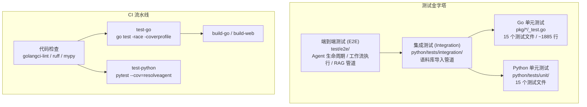
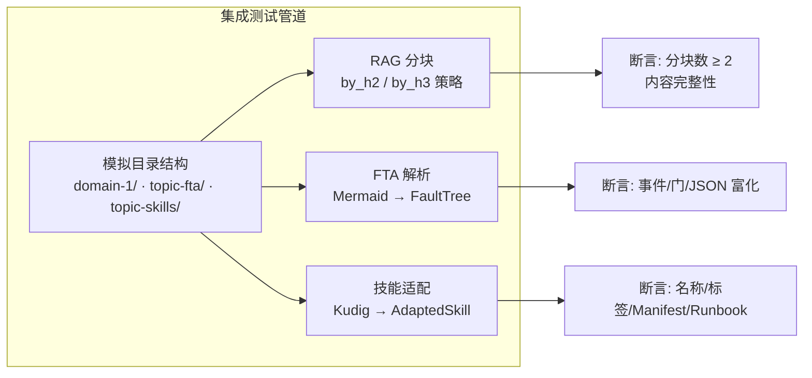
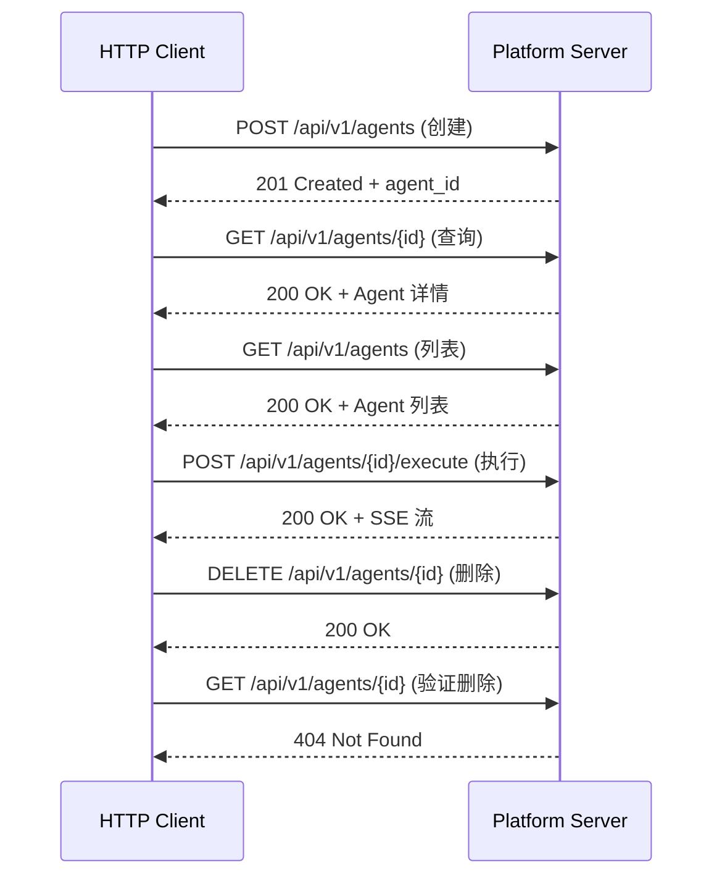

ResolveAgent 的测试体系围绕其**双语言运行时**（Go 平台层 + Python Agent 运行时层）构建了一套分层测试架构，遵循经典的**测试金字塔**模型：底层是大量零依赖的单元测试，中间层是跨模块的集成测试，顶层是面向真实服务的端到端测试。整个测试流程通过 Makefile 统一编排，CI 流水线自动执行代码检查、单元测试、覆盖率收集与构建验证，形成完整的质量保障闭环。

Sources: [Makefile](Makefile#L73-L96), [ci.yaml](.github/workflows/ci.yaml#L1-L89)

## 测试架构全景

ResolveAgent 的测试分为三大层级、三种运行时环境，形成清晰的职责边界。Go 测试覆盖平台服务层（API Server、注册表、存储后端、网关客户端等），Python 测试覆盖 Agent 运行时层（智能选择器、FTA 引擎、RAG 管道、语料库导入等），E2E 测试则验证完整的跨服务业务流程。



Sources: [ci.yaml](.github/workflows/ci.yaml#L38-L61), [Makefile](Makefile#L73-L96)

## Go 平台层单元测试

Go 平台层的单元测试遵循标准的 `testing` 包惯例，采用**表驱动测试**（Table-Driven Tests）和**接口模拟**（Mock）两种核心模式。测试文件与源文件同目录存放，以 `_test.go` 后缀命名，共计 15 个测试文件覆盖约 1885 行测试代码，分布在 `pkg/` 和 `internal/` 两大目录下。

### 测试覆盖矩阵

| 模块 | 测试文件 | 行数 | 核心测试策略 |
|------|----------|------|-------------|
| **config** | `config_test.go` + `types_test.go` | 301 | 默认值验证、DSN 构建、结构体完备性 |
| **gateway** | `client_test.go` + `model_router_test.go` | 533 | `httptest.Server` 模拟 HTTP 端点 |
| **health** | `health_test.go` | 156 | 注册/运行/降级检测、HTTP Handler |
| **errors** | `errors_test.go` | 69 | 错误码、Unwrap 链、HTTP 状态映射 |
| **registry** | `agent_test.go` + `rag_test.go` | 224 | 内存注册表 CRUD + 分页 |
| **retry** | `retry_test.go` | 100 | 指数退避、RetryIf 过滤、Context 取消 |
| **server** | `server_test.go` | 52 | HTTP/gRPC 服务器初始化 |
| **logger** | `logger_test.go` | 93 | 日志级别、JSON 格式、Context 传递 |
| **store** | `store_test.go` | 53 | 接口契约验证、Mock 实现 |
| **telemetry** | `logger_test.go` | 48 | 日志构造器 |
| **version** | `version_test.go` | 47 | 构建信息、默认值 |
| **cli** | `root_test.go` | 30 | 命令树注册验证 |
| **tui** | `tui_test.go` | 65 | Bubble Tea 模型生命周期 |
| **service** | `registry_service_test.go` | 77 | 服务层组装验证 |

Sources: [config_test.go](pkg/config/config_test.go#L1-L55), [client_test.go](pkg/gateway/client_test.go#L1-L299), [health_test.go](pkg/health/health_test.go#L1-L157), [retry_test.go](pkg/retry/retry_test.go#L1-L101)

### 核心测试模式

**表驱动测试**是 Go 测试中最常见的模式。以错误码测试为例，通过结构体切片定义多组输入-期望对，在循环中以 `t.Run` 创建子测试：

```go
// pkg/errors/errors_test.go
tests := []struct {
    name string
    err  *Error
    want string
}{
    {name: "without cause", err: New(CodeNotFound, "agent not found"), want: "[NOT_FOUND] agent not found"},
    {name: "with cause", err: Wrap(CodeInternal, "database error", fmt.Errorf("connection refused")), ...},
}
for _, tt := range tests {
    t.Run(tt.name, func(t *testing.T) { /* 断言 */ })
}
```

**`httptest.Server` 模拟**用于网关客户端测试。每个 HTTP 方法（GET/POST/PUT/DELETE）都有独立的测试用例，通过 `httptest.NewServer` 创建本地 HTTP 服务来模拟 Higress 网关的响应行为，无需启动真实网关。这确保了网关客户端的请求路径、请求方法、请求体序列化逻辑被完整验证。

Sources: [errors_test.go](pkg/errors/errors_test.go#L9-L34), [client_test.go](pkg/gateway/client_test.go#L29-L154)

### 内存注册表测试

12 大注册表体系中的 `AgentRegistry` 和 `RAGRegistry` 使用**内存后端**实现进行测试。测试覆盖完整的 CRUD 生命周期：Create（含重复创建拒绝）→ Get（含不存在项查询）→ List（含分页）→ Update（含不存在项更新拒绝）→ Delete（含删除后验证）。这种模式确保注册表接口的语义正确性，同时为上层服务测试提供可组合的 Mock 后端。

Sources: [agent_test.go](pkg/registry/agent_test.go#L8-L98), [rag_test.go](pkg/registry/rag_test.go#L8-L126)

### 重试策略测试

重试模块的测试展示了四个关键场景：**首次成功**（仅调用一次）、**最终成功**（前两次失败第三次成功）、**全部失败**（达到最大重试次数）、**RetryIf 过滤**（仅对瞬态错误重试，永久错误立即终止）。此外还验证了 Context 取消时重试循环的中断行为，使用 goroutine 延迟取消来模拟超时场景。

Sources: [retry_test.go](pkg/retry/retry_test.go#L11-L100)

### 基准测试

在类型测试文件中还包含基准测试，用于验证高频操作的性能特征。例如 `BenchmarkDatabaseConfig_DSN` 对 DSN 字符串构建进行基准测试：

```go
// pkg/config/types_test.go
func BenchmarkDatabaseConfig_DSN(b *testing.B) {
    cfg := DatabaseConfig{Host: "localhost", Port: 5432, ...}
    b.ResetTimer()
    for i := 0; i < b.N; i++ { _ = cfg.DSN() }
}
```

Sources: [types_test.go](pkg/config/types_test.go#L233-L248)

## Python Agent 运行时层单元测试

Python 运行时层的测试使用 **pytest** 框架，配合 `pytest-asyncio` 插件支持异步测试。测试目录结构清晰分离为 `tests/unit/`（15 个文件）和 `tests/integration/`（1 个文件），共享 fixture 定义在 `conftest.py` 中。配置中 `asyncio_mode = "auto"` 使所有 `async def` 测试函数自动以异步方式运行。

### 测试覆盖矩阵

| 模块 | 测试文件 | 测试类/函数数 | 核心覆盖面 |
|------|----------|-------------|-----------|
| **智能选择器** | `test_selector.py` | 6 个测试类 / ~30 方法 | 意图分析、上下文富化、规则/LLM/混合策略、完整管道 |
| **Hook 选择器** | `test_hook_selector.py` | 2 个测试类 / ~12 方法 | Hook 客户端 CRUD、适配器协议、短路逻辑 |
| **FTA 引擎** | `test_fta_engine.py` | 3 个函数 | AND/OR/VOTING 门逻辑、基本事件提取 |
| **FTA 解析器** | `test_fta_parser.py` | ~15 个函数 | 标题提取、Mermaid 解析、JSON 富化、隐式门推断 |
| **RAG 管道** | `test_rag_pipeline.py` | 2 个函数 | 固定分块、句子分块 |
| **Skill 适配器** | `test_skill_adapter.py` | ~15 个函数 | Front Matter 解析、技能转换、注册字典 |
| **Skill 加载器** | `test_skill_loader.py` | - | 技能发现与加载 |
| **Skill 选择器** | `test_skill_selector.py` | - | 技能匹配 |
| **选择器缓存** | `test_selector_cache.py` | - | 缓存策略 |
| **完整选择器** | `test_selector_complete.py` | - | 端到端选择器验证 |
| **Mega 选择器** | `test_mega_selector_modes.py` | - | 多模式路由 |
| **标题分块** | `test_chunker_headings.py` | - | H2/H3 分块策略 |
| **Kudig 导入** | `test_kudig_rag_import.py` | - | 语料库导入 |
| **调用链 RAG** | `test_call_chain_rag_generator.py` | - | 调用链生成 |
| **文档同步** | `test_docsync.py` | - | 文档同步 |

Sources: [test_selector.py](python/tests/unit/test_selector.py#L1-L505), [test_hook_selector.py](python/tests/unit/test_hook_selector.py#L1-L201), [test_fta_engine.py](python/tests/unit/test_fta_engine.py#L1-L40), [conftest.py](python/tests/conftest.py#L1-L44)

### 意图分析测试体系

智能选择器的测试是最复杂且最完整的模块，覆盖了从意图分类到路由决策的完整管道。测试按层级组织为六个 `TestXxx` 类：

- **TestIntentAnalyzer**：验证四种意图类型（WORKFLOW / SKILL / RAG / CODE_ANALYSIS）的分类准确性，包括空输入的降级处理和代码块检测
- **TestContextEnricher**：验证上下文富化流程，包括基本字段填充、代码上下文提取（安全漏洞检测）、编程语言识别
- **TestRuleStrategy**：验证基于规则的路由决策，每种路由类型有独立测试，额外验证置信度范围和规则摘要
- **TestLLMStrategy**：验证 LLM 路由及降级回退
- **TestHybridStrategy**：验证混合策略的高置信度规则优先逻辑和 LLM 回退机制，支持自定义 `HybridConfig`
- **TestRouteDecision**：验证 Pydantic 模型的边界校验（置信度 [0, 1]）、`is_code_related()` 和 `is_high_confidence()` 方法

Sources: [test_selector.py](python/tests/unit/test_selector.py#L29-L460)

### Hook 选择器适配器测试

Hook 选择器的测试展示了**适配器模式**的完整测试策略。`TestInMemoryHookClient` 验证内存 Hook 存储的完整 CRUD 生命周期（含自定义 ID 和不存在项处理），`TestHookSelectorAdapter` 验证适配器与底层选择器的集成，特别是**短路逻辑**——通过注册 `force_direct` 类型的 pre-hook，验证其能在选择器执行前注入决策并跳过后续处理。

Sources: [test_hook_selector.py](python/tests/unit/test_hook_selector.py#L104-L201)

### FTA 解析器测试

FTA Markdown 解析器的测试采用**增量覆盖**策略，从最基础的标题提取开始，逐步覆盖 Mermaid 图解析（节点/门/边）、JSON 块富化（severity/probability/mttr）、原始内容保留、隐式 OR 门推断等场景。每个测试用例都定义了独立的 Markdown 文档片段作为输入，确保测试的隔离性和可读性。

Sources: [test_fta_parser.py](python/tests/unit/test_fta_parser.py#L1-L226)

## Python 集成测试

集成测试位于 `python/tests/integration/test_corpus_import.py`，验证**语料库导入管道**的端到端流程——从原始 Markdown 内容解析，到 FTA 树构建、RAG 文档分块、技能适配与注册。测试使用 pytest 的 `tmp_path` fixture 创建模拟的 kudig-database 目录结构，无需任何外部服务（无 Milvus、无 Git 克隆、无运行中的服务器）。



三大测试类分别验证：

| 测试类 | 验证范围 | 关键断言 |
|--------|---------|---------|
| `TestRAGChunkingPipeline` | H2/H3 分块策略 | 分块数 ≥ 2，各标题内容正确分配到对应分块 |
| `TestFTAParsingPipeline` | FTA 完整解析 + RAG 联合 | 事件 ID、门类型、JSON enrichment、工作流步骤 |
| `TestSkillAdaptationPipeline` | Kudig 技能转换 | 标签、触发关键词、FTA 引用、Runbook 7 段完整性 |

`TestCorpusConfig` 还验证了分块策略路由：`domain-N` 目录使用 `by_h2`、`topic-fta` 使用 `by_h3`、`topic-skills` 使用 `by_section`，并确认 `.git` 和 `node_modules` 被正确排除。

Sources: [test_corpus_import.py](python/tests/integration/test_corpus_import.py#L1-L333)

## 端到端测试

端到端测试位于 `test/e2e/` 目录，使用 Go 的 **Build Tag** 机制（`-tags=e2e`）与单元测试隔离。测试通过真实 HTTP 客户端访问运行中的服务器（默认 `http://localhost:8080`），验证完整的业务流程。

### 运行前置条件

E2E 测试的执行依赖两个守卫条件：

1. **环境变量守卫**：如果设置了 `SKIP_E2E` 环境变量，所有 E2E 测试将被跳过
2. **服务健康检查**：通过 `skipIfNoServer()` 函数向 `/healthz` 端点发送 GET 请求，如果服务器不可达或返回非 200 状态码，测试将被跳过而非失败

这种设计确保 E2E 测试不会因缺少运行环境而导致 CI 构建失败。

Sources: [helper_test.go](test/e2e/helper_test.go#L1-L24)

### Agent 生命周期测试

`TestAgentLifecycle` 验证 Agent 的完整 CRUD + 执行流程，共 6 个步骤：



执行步骤验证了 SSE（Server-Sent Events）流式响应中包含 `data:` 前缀的断言，确保流式执行机制正常工作。

Sources: [agent_lifecycle_test.go](test/e2e/agent_lifecycle_test.go#L1-L197)

### 工作流执行测试

`TestWorkflowExecution` 验证 DAG 工作流的完整生命周期：创建 → 验证（Validate）→ 执行 → 删除。工作流定义包含三种节点类型（start / agent / end）和边连接。

`TestRAGWorkflow` 验证 RAG 管道的端到端流程：创建集合（含嵌入模型和分块策略配置）→ 文档摄取（批量导入）→ 语义查询（top_k 检索）→ 集合删除。

Sources: [workflow_execution_test.go](test/e2e/workflow_execution_test.go#L1-L300)

### 测试夹具

`test/fixtures/` 目录提供标准化的测试数据：

| 夹具文件 | 用途 |
|----------|------|
| `agents/test-agent.yaml` | Mega 类型 Agent 定义，含 skill 配置 |
| `skills/test-skill.yaml` | 测试技能清单 |
| `workflows/test-workflow.yaml` | FTA 工作流定义，含 OR 门和基本事件 |

Sources: [test-agent.yaml](test/fixtures/agents/test-agent.yaml#L1-L11), [test-skill.yaml](test/fixtures/skills/test-skill.yaml#L1-L8), [test-workflow.yaml](test/fixtures/workflows/test-workflow.yaml#L1-L22)

## CI 流水线与测试执行

### CI 流水线结构

GitHub Actions CI 定义了 6 个并行 Job，形成两级依赖关系：

| Job | 依赖 | 执行内容 |
|-----|------|---------|
| `lint-go` | 无 | golangci-lint（22 个 linter） |
| `lint-python` | 无 | ruff check + ruff format check |
| `test-go` | 无 | `go test -race -coverprofile` + Codecov 上传 |
| `test-python` | 无 | `pytest tests/ -v --cov=resolveagent` |
| `build-go` | lint-go + test-go | `make build-go` |
| `build-web` | 无 | pnpm install + pnpm build |

Go 测试使用 `-race` 标志启用竞态检测器，并生成覆盖率报告上传至 Codecov。Python 测试使用 `--cov=resolveagent` 生成覆盖率数据。

Sources: [ci.yaml](.github/workflows/ci.yaml#L1-L89)

### Makefile 测试目标

Makefile 提供了统一的测试入口，支持按层级和语言分别执行：

| 目标 | 命令 | 说明 |
|------|------|------|
| `make test` | 组合执行 | 等价于 `test-go` + `test-python` + `test-web` |
| `make test-go` | `go test -race -coverprofile=coverage.out ./...` | Go 全量单元测试 |
| `make test-python` | `cd python && uv run pytest tests/ -v --cov=resolveagent` | Python 全量测试 |
| `make test-web` | `cd web && pnpm test` | Web 前端测试 |
| `make test-e2e` | `go test -tags=e2e -v ./test/e2e/...` | E2E 测试（需运行服务器） |
| `make test-integration` | `go test -tags=integration -v ./test/integration/...` | Go 集成测试（当前仅有占位） |

Sources: [Makefile](Makefile#L73-L96)

### 代码质量守门

除测试外，CI 还通过多层代码质量检查守门：

- **Pre-commit Hooks**：.trailing-whitespace、YAML/JSON 校验、大文件检测、私钥泄露检测
- **Go Lint**：golangci-lint 启用 22 个 linter，包括 `gosec`（安全）、`go vet`（静态分析）、`errcheck`（错误检查）、`revive`（代码风格）等
- **Python Lint**：ruff（代码风格 + 格式化）+ mypy（类型检查，`ignore_missing_imports = true`）
- **Proto Lint**：buf lint 验证 Protocol Buffers 定义

Sources: [.golangci.yml](.golangci.yml#L1-L69), [.pre-commit-config.yaml](.pre-commit-config.yaml#L1-L44)

## 测试配置与最佳实践

### Python 测试配置

Python 测试的配置集中在 `pyproject.toml` 的 `[tool.pytest.ini_options]` 段：

```toml
[tool.pytest.ini_options]
testpaths = ["tests"]
asyncio_mode = "auto"
```

`asyncio_mode = "auto"` 免去了在每个异步测试上添加 `@pytest.mark.asyncio` 装饰器的需要（虽然现有代码仍保留此装饰器以兼容旧版本 pytest-asyncio）。开发依赖通过 `uv sync --extra dev` 安装，包含 `pytest`、`pytest-asyncio`、`pytest-cov`、`ruff` 和 `mypy`。

Sources: [pyproject.toml](python/pyproject.toml#L43-L49)

### Go 测试惯例

Go 测试遵循以下惯例：

- **同目录存放**：`xxx_test.go` 与 `xxx.go` 放在同一包内，使用 `package xxx` 声明（白盒测试）
- **表驱动**：多输入场景统一用 `[]struct{name, input, expected}` 定义
- **httptest 模拟**：外部 HTTP 依赖通过 `net/http/httptest` 的本地服务器替代
- **接口 Mock**：存储后端通过最小 Mock 实现验证接口契约
- **Build Tag 隔离**：E2E 和集成测试使用 `-tags=e2e` / `-tags=integration` 与单元测试隔离

Sources: [client_test.go](pkg/gateway/client_test.go#L1-L11), [store_test.go](pkg/store/store_test.go#L1-L29)

### 运行测试的推荐方式

对于日常开发，推荐使用以下命令组合：

```bash
# 快速验证（仅 Go 单元测试）
make test-go

# 快速验证（仅 Python 单元测试）
make test-python

# 完整验证（代码检查 + 全量测试）
make lint && make test

# E2E 测试（需要先启动完整服务栈）
make compose-up && make test-e2e
```

Sources: [Makefile](Makefile#L73-L96)

## 测试架构演进方向

当前的测试体系已建立了稳固的基础，但仍有明确的演进空间。`test/integration/doc.go` 目前仅包含包声明注释，表明 Go 侧的跨服务集成测试尚待实现。`test/load/` 目录也是空的，预留了负载测试的位置。`test/testdata/` 目录同样为空，可作为共享测试数据的集中存放点。未来随着项目成熟，这些占位目录将逐步填充，形成更完善的多层测试覆盖。

Sources: [doc.go](test/integration/doc.go#L1-L7)

---

**相关阅读**：理解测试所覆盖的各模块架构，可参阅 [整体架构设计：三层微服务与双语言运行时](4-zheng-ti-jia-gou-she-ji-san-ceng-wei-fu-wu-yu-shuang-yu-yan-yun-xing-shi)。了解 Makefile 测试目标在完整构建流程中的位置，请参阅 [Makefile 构建系统：构建、测试、代码检查与代码生成](33-makefile-gou-jian-xi-tong-gou-jian-ce-shi-dai-ma-jian-cha-yu-dai-ma-sheng-cheng)。CI 流水线的部署阶段可参阅 [Docker Compose 部署：全栈容器化编排](29-docker-compose-bu-shu-quan-zhan-rong-qi-hua-bian-pai)。