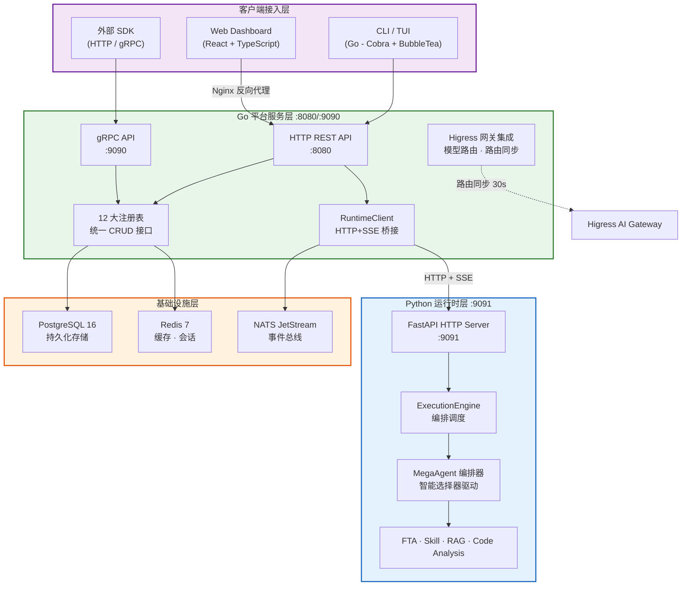
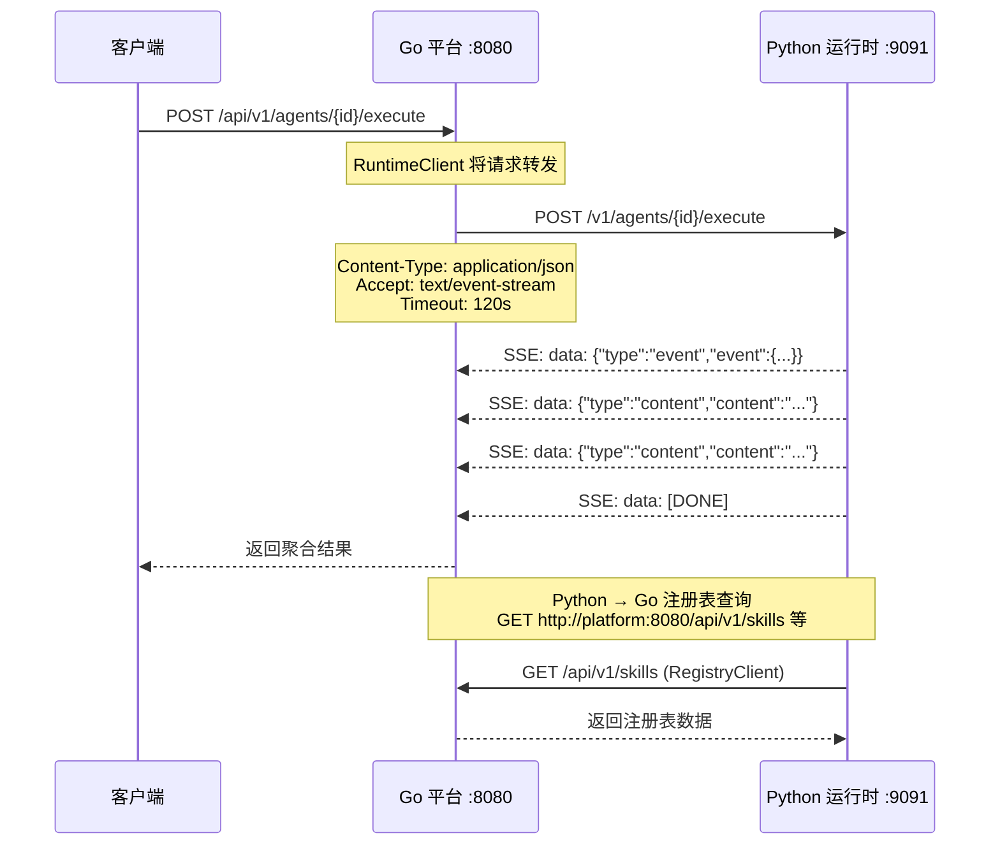

ResolveAgent 采用 **Go 平台服务层、Python Agent 运行时层、React Web 前端层** 的三层微服务架构，配合 PostgreSQL、Redis、NATS 等基础设施，构建出一个面向问题解决的 AIOps 智能体平台。本文将从架构总览出发，剖析每一层的职责边界、层间通信机制、双语言运行时的分工逻辑，以及基础设施的编排方式，帮助中级开发者建立对系统全貌的结构性认知。

Sources: [docker-compose.yaml](deploy/docker-compose/docker-compose.yaml#L1-L232), [Makefile](Makefile#L1-L200)

## 架构总览：三层分离与职责边界

ResolveAgent 的核心架构决策在于将**资源管理与编排调度**（Go）和**AI 推理与智能路由**（Python）分属两个独立的运行时进程，前端则作为纯展示与交互层独立部署。这一分离不是随意的——Go 在高并发 HTTP/gRPC 服务、类型安全的数据持久化方面具有天然优势，而 Python 在 LLM 提供者集成、向量计算生态、Agent 框架（AgentScope）方面拥有不可替代的库生态。三层之间通过明确的服务边界和协议契约解耦，每个层可以独立扩展、独立部署、独立演进。

Sources: [server.go](pkg/server/server.go#L1-L133), [runtime/\_\_main\_\_.py](python/src/resolveagent/runtime/__main__.py#L1-L35), [App.tsx](web/src/App.tsx#L1-L93)

**三层架构的职责矩阵**：

| 层级 | 语言 | 运行时 | 核心职责 | 入口点 |
|------|------|--------|----------|--------|
| **平台服务层** | Go 1.25 | 独立二进制 | REST/gRPC API、12 大注册表、数据持久化、网关同步、配置管理 | [resolveagent-server](cmd/resolveagent-server/main.go#L16) |
| **Agent 运行时层** | Python 3.12 | FastAPI + Uvicorn | MegaAgent 编排、智能选择器、FTA 引擎、Skill 执行、RAG 管道、LLM 抽象 | [resolveagent.runtime](python/src/resolveagent/runtime/__main__.py#L21) |
| **Web 前端层** | TypeScript (React) | Vite → Nginx | 可视化仪表盘、Agent 管理、Workflow 设计器、交互式 Playground | [App.tsx](web/src/App.tsx#L44) |

Sources: [platform.Dockerfile](deploy/docker/platform.Dockerfile#L1-L61), [runtime.Dockerfile](deploy/docker/runtime.Dockerfile#L1-L64), [webui.Dockerfile](deploy/docker/webui.Dockerfile#L1-L47)

## Go 平台服务层：静态类型的数据权威

Go 平台服务层是整个系统的**数据权威** 和**流量入口**。它以双协议（HTTP REST `:8080` + gRPC `:9090`）对外暴露服务，内部维护 12 个注册表作为唯一数据源，并通过 `RuntimeClient` 将 AI 执行请求桥接到 Python 运行时。

### Server 启动与双协议服务

`Server` 结构体是平台服务的核心容器，聚合了所有注册表实例和一个指向 Python 运行时的客户端。启动时，它并行拉起 HTTP 和 gRPC 两个服务器，并通过 `context.Context` 实现优雅停机——收到 SIGINT/SIGTERM 信号后，gRPC 调用 `GracefulStop()`，HTTP 调用 `Shutdown()`，确保在途请求处理完毕。

Sources: [server.go](pkg/server/server.go#L21-L132), [main.go](cmd/resolveagent-server/main.go#L16-L55)

### 12 大注册表：统一接口与双后端

注册表系统是平台服务层最核心的抽象。所有 12 个注册表（Agent、Skill、Workflow、RAG、RAGDocument、FTADocument、Hook、CodeAnalysis、Memory、Solution、CallGraph、TrafficCapture/TrafficGraph）遵循统一的 CRUD 接口模式——`Create`、`Get`、`List`、`Update`、`Delete`，通过 `ListOptions` 支持分页和过滤。当前每个注册表都有内存实现（用于开发和测试）和 PostgreSQL 持久化后端，通过 `StoreConfig.Backend` 字段按注册表独立选择后端策略。

| 注册表类别 | 包含的注册表 | 职责概述 |
|------------|-------------|---------|
| **核心业务** | Agent, Skill, Workflow | Agent 生命周期、技能发现、工作流定义 |
| **知识管理** | RAG, RAGDocument, FTADocument | 向量集合元数据、文档追踪、故障树文档 |
| **基础设施** | Hook, CodeAnalysis, Memory | 生命周期钩子、代码分析结果、对话记忆 |
| **分析洞察** | CallGraph, TrafficCapture, TrafficGraph, Solution | 调用图谱、流量采集、服务依赖图、排障方案 |

Sources: [server.go](pkg/server/server.go#L21-L40), [agent.go](pkg/registry/agent.go#L22-L105), [types.go](pkg/config/types.go#L17-L29)

### 配置管理：多层配置源

配置系统基于 Viper 构建，支持 YAML 文件、环境变量和代码默认值三个层级，优先级为：环境变量 > YAML 文件 > 代码默认值。所有环境变量以 `RESOLVEAGENT_` 为前缀，路径分隔符用下划线替代（如 `RESOLVEAGENT_DATABASE_HOST` 映射到 `database.host`）。Docker Compose 部署时，所有配置通过环境变量注入，实现零配置文件的生产级部署。

Sources: [config.go](pkg/config/config.go#L11-L78), [types.go](pkg/config/types.go#L1-L115), [resolveagent.yaml](configs/resolveagent.yaml#L1-L90)

## Python Agent 运行时层：智能编排与执行引擎

Python 运行时层承载了所有需要 LLM 交互、向量计算和 AI 框架集成的核心能力。它通过 FastAPI 提供 HTTP 接口（`:9091`），内部由 `ExecutionEngine` 编排请求，经由 `MegaAgent` 和 `IntelligentSelector` 实现智能路由，最终分派到 FTA 引擎、技能执行器、RAG 管道或代码分析引擎四大子系统。

### FastAPI 服务入口与生命周期

`RuntimeHTTPServer` 是 Python 端的入口容器，它创建 FastAPI 应用并注册 Agent 执行、Workflow 执行、RAG 查询/摄取等核心路由。在 FastAPI 的 `lifespan` 上下文管理器中，它初始化 `AgentLifecycleManager` 并建立到 Go 平台的 `SkillStoreClient` 连接；关闭时优雅释放所有资源。Agent 执行和 Workflow 执行的路由均返回 **SSE（Server-Sent Events）流式响应**，支持实时进度推送。

Sources: [http_server.py](python/src/resolveagent/runtime/http_server.py#L30-L159), [lifecycle.py](python/src/resolveagent/runtime/lifecycle.py#L54-L90)

### ExecutionEngine：请求编排核心

`ExecutionEngine` 是 Python 端的请求处理中枢。它接收 Agent 执行请求后，执行以下流水线：（1）生成唯一的 `execution_id` 和 `conversation_id`；（2）运行 pre-execution hooks（如果配置）；（3）加载或创建 MegaAgent 实例；（4）调用 `IntelligentSelector` 进行路由决策；（5）根据路由结果流式执行；（6）保存对话历史；（7）运行 post-execution hooks。整个执行过程通过异步生成器（`AsyncIterator`）向调用方流式输出事件和内容。

Sources: [engine.py](python/src/resolveagent/runtime/engine.py#L20-L200)

### MegaAgent：三模式选择器编排器

`MegaAgent` 继承自 `BaseAgent`，是顶层编排器。它通过 `selector_mode` 参数支持三种选择器适配模式：`"selector"`（默认，使用 `IntelligentSelector`）、`"hooks"`（使用 `HookSelectorAdapter`，支持 pre/post 拦截）、`"skills"`（使用 `SkillSelectorAdapter`，通过技能调用执行路由）。选择器实例惰性创建并缓存，在所有 `reply()` 调用中复用。路由决策支持六种目标类型：`direct`（LLM 直答）、`rag`（知识检索）、`skill`（技能执行）、`workflow`（FTA 工作流）、`code_analysis`（代码分析）、`multi`（多路由组合）。

Sources: [mega.py](python/src/resolveagent/agent/mega.py#L20-L200)

## 层间通信：HTTP + SSE 桥接模式

Go 平台与 Python 运行时之间的通信是架构设计的关键决策点。系统选择了 **HTTP + SSE（Server-Sent Events）** 而非 gRPC 作为跨语言桥接协议，原因是 SSE 天然支持流式响应（Agent 执行、Workflow 执行等长时间操作），且无需管理 protobuf 定义和代码生成的额外复杂度。

Go 端的 `RuntimeClient` 使用 120 秒超时的 HTTP 客户端发送请求，并通过 `bufio.Scanner` 逐行解析 SSE 事件流，将每个 `data:` 行反序列化为 `ExecuteAgentResponse`，通过 Go channel 异步传递给上层处理。Python 端的 `RegistryClient` 则是一个 `httpx.AsyncClient`，用于反向查询 Go 平台的注册表数据（技能列表、工作流定义、RAG 集合等），实现了 **Go 作为唯一数据源、Python 作为纯查询者** 的单向数据流模式。

Sources: [runtime_client.go](pkg/server/runtime_client.go#L16-L139), [registry_client.py](python/src/resolveagent/runtime/registry_client.py#L117-L200)

## 基础设施层：持久化、缓存与事件驱动

三层微服务之下是共享的基础设施层，由 PostgreSQL、Redis 和 NATS JetStream 三个组件组成，通过 Docker Compose 统一编排。

| 组件 | 版本 | 端口 | 职责 | 使用者 |
|------|------|------|------|--------|
| **PostgreSQL** | 16 Alpine | 5432 | 注册表持久化、10 步迁移、种子数据 | Go 平台 |
| **Redis** | 7 Alpine | 6379 | 缓存、会话存储、LRU 淘汰策略（256MB 上限） | Go 平台 |
| **NATS JetStream** | 2 Alpine | 4222 | 事件总线（AGENTS/SKILLS/WORKFLOWS/EXECUTIONS 四个 Stream） | Go 平台 |

NATS 事件总线定义了四个持久化 Stream：`AGENTS`、`SKILLS`、`WORKFLOWS`、`EXECUTIONS`，每个 Stream 的 Subject 模式为 `{STREAM}.*`，消息保留 24 小时。订阅者通过 Durable Consumer + Manual Ack 机制确保至少一次投递。Go 平台通过 `NATSBus` 实现了 `Bus` 接口的 `Publish` 和 `Subscribe` 方法，支持系统内的事件驱动解耦。

Sources: [docker-compose.yaml](deploy/docker-compose/docker-compose.yaml#L139-L232), [nats.go](pkg/event/nats.go#L14-L96), [event.go](pkg/event/event.go#L1-L23)

## 网关集成：Higress AI 网关

平台服务层可选集成 Higress AI 网关，实现 LLM 模型路由的集中管控。`ModelRouter` 管理所有 LLM 模型路由配置（支持通义千问、文心一言、智谱清言、OpenAI 兼容四种提供者），通过 `RouteSync` 每 30 秒将 Go 注册表中的路由信息同步到 Higress，确保网关与服务拓扑一致。网关还提供 JWT/API Key 认证、限流降级和负载均衡能力，属于生产环境的增强组件，本地开发时可关闭。

Sources: [model_router.go](pkg/gateway/model_router.go#L10-L200), [resolveagent.yaml](configs/resolveagent.yaml#L29-L63), [types.go](pkg/config/types.go#L76-L114)

## 构建与部署：三镜像独立交付

Makefile 定义了完整的构建系统，三个组件各自拥有独立的 Dockerfile 和 Docker 镜像：

| 镜像 | Dockerfile | 基础镜像 | 构建方式 |
|------|-----------|---------|---------|
| `resolveagent-platform` | [platform.Dockerfile](deploy/docker/platform.Dockerfile) | `golang:1.25-alpine` → `alpine:3.20` | 多阶段构建，CGO_ENABLED=0 |
| `resolveagent-runtime` | [runtime.Dockerfile](deploy/docker/runtime.Dockerfile) | `python:3.12-slim` → `python:3.12-slim` | 多阶段构建，uv 虚拟环境 |
| `resolveagent-webui` | [webui.Dockerfile](deploy/docker/webui.Dockerfile) | `node:20-alpine` → `nginx:1.27-alpine` | Vite 构建 → Nginx 静态托管 |

Web 前端的 Nginx 配置不仅托管静态资源，还承担 API 反向代理职责——所有 `/api/` 请求被代理到 Go 平台的 `:8080` 端口，`/ws/` 路径支持 WebSocket 长连接用于实时更新，实现了前后端的统一入口。开发环境通过 `docker-compose.dev.yaml` 覆盖，挂载源码目录实现热重载。

Sources: [Makefile](Makefile#L164-L200), [nginx.conf](deploy/docker/nginx.conf#L1-L98), [docker-compose.dev.yaml](deploy/docker-compose/docker-compose.dev.yaml#L1-L75)

## 技术选型总结

| 维度 | 选型 | 理由 |
|------|------|------|
| **平台服务** | Go 1.25 + net/http + grpc | 高并发、类型安全、低延迟 API 服务 |
| **CLI 框架** | Cobra + BubbleTea | 成熟的命令行和 TUI 生态 |
| **配置管理** | Viper (YAML + 环境变量) | 多层配置源、12-Factor 合规 |
| **Agent 运行时** | Python 3.12 + FastAPI | LLM 库生态、AgentScope 集成 |
| **LLM 集成** | 多提供者抽象层 | 通义千问 / 文心一言 / 智谱清言 / OpenAI 兼容 |
| **前端** | React + TypeScript + Vite | 组件化、类型安全、快速构建 |
| **数据库** | PostgreSQL 16 | ACID、JSON 支持、10 步迁移脚本 |
| **缓存** | Redis 7 | LRU 缓存淘汰、会话管理 |
| **事件总线** | NATS JetStream | 持久化 Stream、至少一次投递 |
| **容器编排** | Docker Compose / Kubernetes + Helm | 开发一致性、生产可扩展 |
| **可观测性** | OpenTelemetry (Metrics + Traces) | 统一遥测、跨服务追踪 |

Sources: [go.mod](go.mod#L1-L40), [pyproject.toml](python/pyproject.toml#L1-L85), [Makefile](Makefile#L1-L100)

## 延伸阅读

本文聚焦于三层微服务的整体架构设计与层间协作机制。若需深入某一层或子系统的实现细节，推荐按以下路径继续探索：

- **平台服务层内部**：[Go 平台服务层：API Server、注册表与存储后端](5-go-ping-tai-fu-wu-ceng-api-server-zhu-ce-biao-yu-cun-chu-hou-duan) 详细剖析 Server 的路由注册、12 大注册表的 CRUD 实现与内存/PostgreSQL 双后端选择。
- **运行时层内部**：[Python Agent 运行时层：执行引擎与生命周期管理](6-python-agent-yun-xing-shi-ceng-zhi-xing-yin-qing-yu-sheng-ming-zhou-qi-guan-li) 深入 ExecutionEngine 的流式处理、AgentPool 的 LRU 淘汰策略和 RegistryClient 的缓存机制。
- **前端层内部**：[Web 前端层：React 组件架构与页面组织](7-web-qian-duan-ceng-react-zu-jian-jia-gou-yu-ye-mian-zu-zhi) 展示 React 路由组织、API Client 的 mock 回退策略和 Nginx 反向代理细节。
- **智能选择器**：[智能路由决策引擎：意图分析与三阶段处理流程](8-zhi-neng-lu-you-jue-ce-yin-qing-yi-tu-fen-xi-yu-san-jie-duan-chu-li-liu-cheng) 阐释 MegaAgent 依赖的核心路由组件。
- **部署实践**：[Docker Compose 部署：全栈容器化编排](29-docker-compose-bu-shu-quan-zhan-rong-qi-hua-bian-pai) 提供从零启动全栈的实操指南。