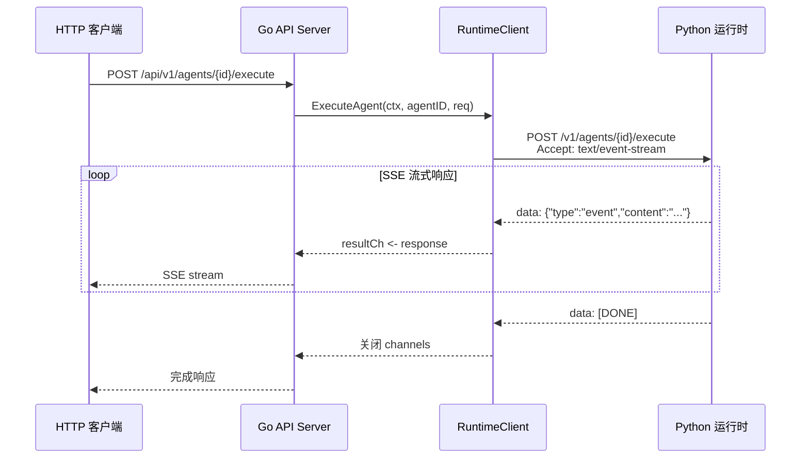

ResolveAgent 平台的 Go 服务层是整个系统的**控制平面核心**——它以双协议（HTTP REST + gRPC）对外暴露 140+ 个 API 端点，通过 12 个独立的注册表接口管理 Agent、Skill、Workflow 等核心实体的完整生命周期，并支持内存与 PostgreSQL 双后端无缝切换。本页将深入解析该层级的架构组织、关键数据流和实现模式，帮助开发者在阅读源码时建立清晰的认知地图。

Sources: [server.go](pkg/server/server.go#L1-L133), [router.go](pkg/server/router.go#L1-L149)

## 层级总览：从请求入口到数据持久化

在深入每个组件之前，理解 Go 平台服务层的整体结构至关重要。该层级由四个核心子层构成：**HTTP/gRPC 服务器**作为网络入口、**路由层**分发请求到处理器、**注册表抽象层**定义统一的数据操作接口、以及**存储后端**提供实际的数据持久化。

```mermaid
graph TB
    subgraph "Go 平台服务层"
        subgraph "网络入口"
            HTTP["HTTP Server<br/>:8080"]
            GRPC["gRPC Server<br/>:9090"]
        end

        subgraph "中间件链"
            AUTH["Auth 中间件<br/>JWT / API Key / 网关头"]
            LOG["Logging 中间件<br/>请求日志"]
            TELEMETRY["Telemetry 中间件<br/>OpenTelemetry 指标"]
        end

        subgraph "REST 路由层"
            R_AGENT["Agent 端点<br/>6 个"]
            R_SKILL["Skill 端点<br/>4 个"]
            R_WF["Workflow 端点<br/>7 个"]
            R_RAG["RAG 端点<br/>5 个"]
            R_HOOK["Hook 端点<br/>6 个"]
            R_SOL["Solution 端点<br/>9 个"]
            R_MORE["其他端点<br/>Memory / FTA / Code<br/>Traffic / CallGraph"]
        end

        subgraph "注册表抽象层"
            AR["AgentRegistry"]
            SR["SkillRegistry"]
            WR["WorkflowRegistry"]
            RR["RAGRegistry"]
            HR["HookRegistry"]
            MR["MemoryRegistry"]
            SOLR["SolutionRegistry"]
            CGR["CallGraphRegistry"]
            TCR["TrafficCaptureRegistry"]
        end

        subgraph "存储后端"
            MEM["内存后端<br/>sync.RWMutex<br/>map[string]T"]
            PG["PostgreSQL 后端<br/>pgxpool 连接池<br/>13 步迁移"]
        end

        subgraph "运行时通信"
            RC["RuntimeClient<br/>HTTP/SSE"]
        end
    end

    PYTHON["Python Agent 运行时<br/>:9091"]
    REDIS["Redis 缓存"]
    NATS["NATS JetStream<br/>事件总线"]

    HTTP --> AUTH --> LOG --> TELEMETRY
    TELEMETRY --> R_AGENT & R_SKILL & R_WF & R_RAG & R_HOOK & R_SOL & R_MORE
    GRPC -.-> |"RegistryService"| AR & SR & WR

    R_AGENT --> AR
    R_SKILL --> SR
    R_WF --> WR
    R_RAG --> RR
    R_HOOK --> HR
    R_SOL --> SOLR
    R_MORE --> MR & CGR & TCR

    AR --> MEM & PG
    SR --> MEM & PG
    WR --> MEM & PG
    RR --> MEM & PG
    HR --> MEM & PG
    MR --> MEM & PG
    SOLR --> MEM & PG

    RC -.-> PYTHON
    AR -.-> |"事件发布"| NATS
    AR -.-> |"缓存加速"| REDIS
```



Sources: [server.go](pkg/server/server.go#L21-L40), [middleware/auth.go](pkg/server/middleware/auth.go#L34-L103), [middleware/telemetry.go](pkg/server/middleware/telemetry.go#L1-L53), [event/nats.go](pkg/event/nats.go#L14-L67)

## Server 核心：双协议启动与优雅关闭

`Server` 结构体是整个 Go 平台服务层的编排中心。它在 `New()` 构造函数中一次性初始化 12 个注册表实例和 1 个 `RuntimeClient`，然后在 `Run()` 方法中通过 `sync.WaitGroup` 并行启动 HTTP 和 gRPC 两个服务器。

**双协议设计**的根本动机在于服务不同的消费者：HTTP REST API 面向前端 Web UI 和外部集成，gRPC 服务则面向 Python Agent 运行时提供低延迟的注册表查询。两者共享相同的注册表实例，保证数据一致性。

启动流程遵循以下模式：首先创建 gRPC Server 并注册标准健康检查服务（`grpc_health_v1`）与反射服务（用于 `grpcurl` 调试）；然后创建 `http.ServeMux`，通过 Go 1.22 新增的模式匹配语法注册路由；最后在 `Run()` 中用两个 goroutine 分别监听 `cfg.Server.GRPCAddr`（默认 `:9090`）和 `cfg.Server.HTTPAddr`（默认 `:8080`）。关闭时通过 `context.Context` 取消信号触发 `GracefulStop()` 和 `Shutdown()`，确保正在处理的请求不会被强制中断。

| 配置项 | 默认值 | 说明 |
|--------|--------|------|
| `server.http_addr` | `:8080` | HTTP REST API 监听地址 |
| `server.grpc_addr` | `:9090` | gRPC 服务监听地址 |
| `server.runtime_addr` | `localhost:9091` | Python 运行时 HTTP 地址 |

Sources: [server.go](pkg/server/server.go#L21-L132), [config/types.go](pkg/config/types.go#L32-L36)

## REST API 路由层：15 个功能域的端点映射

路由注册集中在 `registerHTTPRoutes()` 方法中，采用 Go 1.22 的 `METHOD /path/{param}` 模式匹配语法，将 140+ 个端点组织为 **15 个功能域**。每个功能域对应一个注册表接口，形成清晰的「功能域 → 注册表 → 存储」三级映射关系。

| 功能域 | 端点数量 | 路径前缀 | 核心操作 |
|--------|----------|----------|----------|
| Agent | 6 | `/api/v1/agents` | CRUD + Execute |
| Skill | 4 | `/api/v1/skills` | Register / Get / List / Unregister |
| Workflow | 7 | `/api/v1/workflows` | CRUD + Validate + Execute |
| RAG Collection | 5 | `/api/v1/rag/collections` | CRUD + Ingest + Query |
| Hook | 6 | `/api/v1/hooks` | CRUD + ListExecutions |
| RAG Document | 6 | `/api/v1/rag/collections/{id}/documents` | CRUD + IngestionHistory |
| FTA Document | 7 | `/api/v1/fta/documents` | CRUD + Results |
| Code Analysis | 7 | `/api/v1/analyses` | CRUD + Findings |
| Memory | 10 | `/api/v1/memory` | Conversation CRUD + LongTerm CRUD + Prune |
| Solution | 9 | `/api/v1/solutions` | CRUD + Search + Bulk + Executions |
| Call Graph | 7 | `/api/v1/call-graphs` | CRUD + Nodes + Edges + Subgraph |
| Traffic Capture | 6 | `/api/v1/traffic/captures` | CRUD + Records |
| Traffic Graph | 6 | `/api/v1/traffic/graphs` | CRUD + Analyze |
| Corpus Import | 1 | `/api/v1/corpus/import` | SSE 代理到 Python 运行时 |
| System | 2 | `/api/v1/health`, `/api/v1/system/info` | 健康检查 + 版本信息 |

处理器函数遵循统一的**读取-验证-执行-响应**模式：通过 `io.ReadAll` 读取请求体，`json.Unmarshal` 反序列化为类型化的结构体（如 `AgentDefinition`、`SkillDefinition`），验证必填字段，调用注册表接口执行操作，最后通过 `writeJSON` 或 `writeError` 辅助函数返回标准化响应。

Sources: [router.go](pkg/server/router.go#L1-L149), [solution_handler.go](pkg/server/solution_handler.go#L1-L200)

## 12 大注册表体系：接口抽象与实现模式

注册表层是 Go 平台服务层最核心的设计——它定义了 12 个独立的接口（`AgentRegistry`、`SkillRegistry`、`WorkflowRegistry`、`RAGRegistry`、`HookRegistry`、`RAGDocumentRegistry`、`FTADocumentRegistry`、`CodeAnalysisRegistry`、`MemoryRegistry`、`TroubleshootingSolutionRegistry`、`CallGraphRegistry`、`TrafficCaptureRegistry`、`TrafficGraphRegistry`），每个接口遵循统一的 CRUD 模式但带有各自的领域扩展。

### 统一接口模式

几乎所有注册表都遵循以下接口骨架：

```go
type XxxRegistry interface {
    Create(ctx context.Context, item *XxxDefinition) error
    Get(ctx context.Context, id string) (*XxxDefinition, error)
    List(ctx context.Context, opts ListOptions) ([]*XxxDefinition, int, error)
    Update(ctx context.Context, item *XxxDefinition) error
    Delete(ctx context.Context, id string) error
}
```

`ListOptions` 结构体提供了跨注册表统一的分页与过滤能力，包含 `PageSize`/`PageToken`（游标分页）和 `Limit`/`Offset`（偏移分页）两套分页参数，以及 `Filter map[string]string` 用于字段级过滤。

Sources: [registry/agent.go](pkg/registry/agent.go#L22-L28), [registry/agent.go](pkg/registry/agent.go#L97-L105)

### 各注册表的领域扩展

在基础 CRUD 之上，不同注册表根据其领域特征扩展了特有方法：

| 注册表 | 领域扩展方法 | 用途 |
|--------|-------------|------|
| `SkillRegistry` | `ListByType(ctx, skillType, opts)` | 按类型（general/scenario）过滤技能 |
| `HookRegistry` | `ListByTriggerPoint(ctx, trigger, targetID)` + `RecordExecution` + `ListExecutions` | 按触发点查找启用的 Hook + 执行记录追踪 |
| `MemoryRegistry` | `AddMessage` / `GetConversation` / `StoreLongTermMemory` / `SearchLongTermMemory` / `IncrementAccessCount` / `PruneExpiredMemories` | 短期对话 + 长期知识双模存储 |
| `TroubleshootingSolutionRegistry` | `Search(ctx, SolutionSearchOptions)` + `BulkCreate` + `RecordExecution` / `ListExecutions` | 关键词搜索 + 批量导入 + 执行效果追踪 |
| `CallGraphRegistry` | `AddNodes` / `AddEdges` / `ListNodes` / `ListEdges` / `GetSubgraph` | 图结构管理 + 子图提取 |
| `TrafficCaptureRegistry` | `AddRecords` / `ListRecords` / `GetRecordsByService` | 流量记录追加 + 按服务过滤 |
| `TrafficGraphRegistry` | `GetByCaptureID` / `UpdateReport` | 从捕获数据生成图 + 分析报告更新 |
| `CodeAnalysisRegistry` | `AddFinding` / `AddFindings` / `ListFindings` / `GetFindingsBySeverity` | 分析发现项管理 |
| `RAGDocumentRegistry` | `GetDocumentByHash` / `RecordIngestion` / `ListIngestionHistory` | 去重检测 + 摄取历史追踪 |

Sources: [registry/skill.go](pkg/registry/skill.go#L26-L32), [registry/hook.go](pkg/registry/hook.go#L44-L54), [registry/memory.go](pkg/registry/memory.go#L43-L60), [registry/solution.go](pkg/registry/solution.go#L63-L74), [registry/call_graph.go](pkg/registry/call_graph.go#L52-L63)

### 关键领域数据模型

每个注册表管理的实体具有丰富的领域属性。以下是最核心的几个数据模型：

**AgentDefinition** 是 Agent 注册表的核心实体，包含 ID、名称、描述、类型（如 `mega-agent`）、配置映射（`map[string]any`，用于存储 LLM 参数等动态配置）、状态、标签和版本号。

**HookDefinition** 描述生命周期钩子，其 `TriggerPoint` 字段支持 `agent.execute`、`skill.invoke`、`workflow.run` 三种触发时机，`TargetID` 为空表示全局钩子，`ExecutionOrder` 控制同触发点下的执行优先级。

**MemoryRegistry** 独特之处在于同时管理两种记忆：`ShortTermMemory`（按对话 ID 组织的消息序列，含角色、内容、Token 数）和 `LongTermMemory`（跨会话知识，含记忆类型如 `summary`/`preference`/`pattern`/`fact`/`skill_learned`、重要性评分 0.0–1.0、访问计数、过期时间等）。

**TroubleshootingSolution** 是最复杂的实体之一，不仅包含问题描述和解决步骤，还关联了 RAG 集合 ID、RAG 文档 ID、相关技能名称和相关工作流 ID，形成知识图谱式的关联网络。

Sources: [registry/agent.go](pkg/registry/agent.go#L10-L19), [registry/hook.go](pkg/registry/hook.go#L12-L26), [registry/memory.go](pkg/registry/memory.go#L12-L40), [registry/solution.go](pkg/registry/solution.go#L12-L35)

## 内存后端实现：sync.RWMutex 守护的并发安全

所有 12 个注册表都提供了 `InMemory*Registry` 实现，使用 `sync.RWMutex` 实现读写分离的并发控制。这种设计遵循一个统一的模式：

- **写操作**（Create、Update、Delete）获取 `mu.Lock()` 互斥锁，确保写操作的原子性
- **读操作**（Get、List）获取 `mu.RLock()` 读锁，允许并发读取
- **List 操作**在内存实现中遍历 `map[string]T`，支持 `Filter` 过滤和 `Limit/Offset` 分页

这种内存后端设计有两个关键用途：**本地开发**时无需启动 PostgreSQL 即可运行完整平台；**单元测试**时提供零依赖的快速测试替身。`List` 方法在内存实现中的过滤逻辑通过对 `opts.Filter` map 的逐字段比对完成——例如 `HookRegistry` 支持 `hook_type`、`trigger_point`、`handler_type` 三个过滤维度。

Sources: [registry/agent.go](pkg/registry/agent.go#L31-L95), [registry/hook.go](pkg/registry/hook.go#L98-L143), [registry/rag.go](pkg/registry/rag.go#L75-L123)

## PostgreSQL 后端：连接池与 13 步迁移体系

当 `StoreConfig.Backend` 设置为 `"postgres"` 时，注册表操作将路由到 PostgreSQL 后端。`postgres.Store` 封装了 `pgxpool.Pool` 连接池（最大 25 连接、最小 5 连接），并提供 `Exec`、`QueryRow`、`Query`、`Begin` 四个基础方法。

### 迁移引擎

PostgreSQL Store 内置了一个轻量级迁移引擎，通过 `schema_migrations` 版本表追踪已应用的迁移。13 步迁移脚本按顺序创建以下核心表：

| 迁移版本 | 创建的表 | 用途 |
|----------|---------|------|
| v1 | `agents` | Agent 定义存储 |
| v2 | `skills` | 技能定义存储 |
| v3 | `workflows` | 工作流定义存储 |
| v4 | `model_routes` | LLM 模型路由配置 |
| v5 | 索引 | agents/skills/workflows 的 status/type 索引 |
| v6 | `hooks` | 生命周期钩子定义 |
| v7 | `hook_executions` | 钩子执行记录 |
| v8 | `rag_documents` + `rag_ingestion_history` | RAG 文档元数据 + 摄取历史 |
| v9 | `fta_documents` + `fta_analysis_results` | FTA 故障树文档 + 分析结果 |
| v10 | `code_analyses` + `code_analysis_findings` | 代码分析任务 + 发现项 |
| v11 | `memory_short_term` | 短期对话记忆 |
| v12 | `memory_long_term` | 长期知识记忆 |
| v13 | 性能索引 | hooks/rag/fta/code/memory 的复合索引 |

迁移引擎在每次启动时幂等执行——先查询 `schema_migrations` 表检查版本是否已应用，已应用则跳过，否则执行 SQL 并记录版本号。这种设计保证了平台服务可以安全地多次重启和升级。

Sources: [store/postgres/postgres.go](pkg/store/postgres/postgres.go#L108-L470), [store/postgres/postgres.go](pkg/store/postgres/postgres.go#L35-L62)

### PostgreSQL 注册表适配器

每个注册表都有对应的 `Postgres*Registry` 实现，如 `PostgresHookRegistry`。这些适配器将注册表接口的方法转换为参数化 SQL 查询，通过 `pgxpool` 执行。例如 `ListByTriggerPoint` 方法生成的 SQL 为：

```sql
SELECT id, name, description, hook_type, trigger_point, target_id,
    execution_order, handler_type, config, enabled, labels, created_at, updated_at
FROM hooks
WHERE enabled = true AND trigger_point = $1
    AND (target_id IS NULL OR target_id = '' OR target_id = $2)
ORDER BY execution_order
```

Sources: [store/postgres/hook_store.go](pkg/store/postgres/hook_store.go#L12-L153)

## RuntimeClient：与 Python 运行时的 SSE 流式通信

`RuntimeClient` 是 Go 平台与 Python Agent 运行时之间的通信桥梁。它通过 HTTP + Server-Sent Events（SSE）协议实现**流式执行**——当 API Server 收到 Agent 执行请求时，它将请求代理到 Python 运行时（默认 `localhost:9091`），然后逐行解析 SSE 响应，将每个 `data:` 行反序列化为 `ExecuteAgentResponse`，通过带缓冲的 channel（容量 10）流式返回给 HTTP 处理器。



`RuntimeClient` 提供三个核心操作：`ExecuteAgent`（Agent 执行）、`ExecuteWorkflow`（工作流执行）和 `ImportCorpus`（语料库导入），三者均采用相同的 SSE 解析模式。HTTP 客户端设置了 120 秒超时以适应长时间运行的 Agent 任务。`ExecuteAgentResponse` 的 `Type` 字段区分 `event`（执行事件）和 `error`（错误信息），允许客户端区分处理。

Sources: [server/runtime_client.go](pkg/server/runtime_client.go#L1-L139), [server/corpus_handler.go](pkg/server/corpus_handler.go#L1-L113)

## RegistryService：gRPC 跨语言服务桥

`RegistryService` 是 Go 平台向 Python 运行时暴露的 gRPC 服务层，它封装了 Agent、Skill、Workflow 三个核心注册表以及 `ModelRouter`，提供 `GetAgent`、`ListAgents`、`GetSkill`、`ListSkills`、`GetModelRoute`、`ListModelRoutes`、`GetWorkflow`、`ListWorkflows` 等查询方法。其架构设计遵循 **Facade 模式**——将多个注册表的复杂交互封装为简单的 gRPC 方法调用。

`RegistryService` 的响应类型（如 `RegistryAgentResponse`、`RegistrySkillResponse`）是注册表内部类型（如 `AgentDefinition`、`SkillDefinition`）的精简投影，剥离了敏感字段和内部实现细节，只保留 Python 运行时需要的元数据。`GetModelRoute` 方法在 `ModelRouter` 为 nil 时安全返回默认路由结构（Provider 为 `"qwen"`），确保即使网关未启用也能正常工作。

Sources: [service/registry_service.go](pkg/service/registry_service.go#L35-L299)

## 中间件栈：认证、日志与可观测性

Go API Server 通过三层中间件链处理每个请求，分别负责认证、日志和可观测性：

**Auth 中间件**支持三种认证方式，按优先级依次尝试：① 网关头认证（`X-Auth-User` / `X-Auth-Roles`，用于 Higress 网关转发场景）；② JWT Bearer Token 认证（HMAC 签名，验证 issuer 和过期时间）；③ API Key 认证（从 `X-API-Key` 或 `Authorization` 头提取）。认证成功后将 `AuthContext` 注入到请求的 `context.Context` 中供下游使用。可配置 `SkipPaths` 跳过健康检查等路径。

**Logging 中间件**包装 `http.ResponseWriter` 捕获状态码，记录每个请求的方法、路径、状态码、耗时和客户端地址。

**Telemetry 中间件**集成 OpenTelemetry，使用 `otelhttp.NewHandler` 创建 Span，同时通过自定义的 `metricsResponseWriter` 记录活跃请求数和请求延迟直方图。状态码低于 400 标记为 `success`，否则标记为 `error`。

Sources: [middleware/auth.go](pkg/server/middleware/auth.go#L34-L200), [middleware/logging.go](pkg/server/middleware/logging.go#L1-L38), [middleware/telemetry.go](pkg/server/middleware/telemetry.go#L1-L53)

## 配置系统：Viper 驱动的分层配置

`Config` 结构体组织为 9 个配置分组，通过 Viper 库实现三层配置合并（默认值 → 配置文件 → 环境变量）。环境变量前缀为 `RESOLVEAGENT_`，键分隔符 `.` 替换为 `_`（如 `RESOLVEAGENT_SERVER_HTTP_ADDR`）。配置文件支持 YAML 格式，搜索路径依次为当前目录、`/etc/resolveagent` 和 `$HOME/.resolveagent`。

`StoreConfig` 结构体的 `Backend` 字段控制注册表后端选择：`"memory"`（默认）使用进程内 Map，`"postgres"` 使用 PostgreSQL 连接池。`Registries` 子字段允许按注册表名覆盖全局后端设置，实现混合后端部署（例如高频读写的 Agent 注册表用 PostgreSQL，低频的 CodeAnalysis 注册表用内存）。

Sources: [config/config.go](pkg/config/config.go#L1-L79), [config/types.go](pkg/config/types.go#L1-L115)

## 事件总线与缓存：NATS + Redis 基础设施

### NATS JetStream 事件总线

`event.Bus` 接口定义了 `Publish` 和 `Subscribe` 两个核心方法。`NATSBus` 实现使用 JetStream（持久化消息流），启动时自动创建 `AGENTS`、`SKILLS`、`WORKFLOWS`、`EXECUTIONS` 四个 Stream（每个 Stream 最大保留 24 小时数据，使用文件存储）。消息主题格式为 `TYPE.ID`（如 `AGENTS.agent-123`），订阅支持手动 ACK 和 Durable Consumer 确保消息不丢失。

### Redis 缓存层

`redis.Cache` 封装了 `go-redis/v9` 客户端（连接池大小 10），提供 `Get`/`Set`/`Delete`/`Exists` 基础操作以及 `GetJSON`/`SetJSON` 类型化便捷方法，支持 TTL 过期策略。Redis 在平台中主要用于热数据缓存（如频繁访问的 Agent 定义和 Skill 元数据），减少 PostgreSQL 查询压力。

### 健康检查系统

`health.Checker` 实现了 Kubernetes 风格的健康探针：`LivenessHandler`（`/healthz`）始终返回 200 OK（进程存活即健康）；`ReadinessHandler`（`/readyz`）执行所有注册的组件检查（如 PostgreSQL 连接、Redis 连接、NATS 连接），根据结果返回 UP/DEGRADED/DOWN 状态。任何组件 DOWN 则整体返回 503。

Sources: [event/nats.go](pkg/event/nats.go#L14-L202), [store/redis/redis.go](pkg/store/redis/redis.go#L14-L139), [health/health.go](pkg/health/health.go#L1-L104)

## Higress AI 网关：模型路由集成

`gateway.ModelRouter` 管理通过 Higress 网关的 LLM 模型路由，每个 `ModelRoute` 包含模型 ID、提供者（`qwen`/`wenxin`/`zhipu`/`openai-compat`）、上游 URL、API Key、优先级、速率限制、降级策略和请求转换规则。`RegisterModel` 方法在本地注册路由的同时自动创建对应的 Higress 路由配置，确保网关状态与平台状态一致。`syncProviderRoutes` 方法预置了通义千问、文心一言、智谱清言三家提供者的基础路由，实现开箱即用的多模型支持。

Sources: [gateway/model_router.go](pkg/gateway/model_router.go#L1-L200)

## 源码目录结构参考

```
pkg/
├── server/                     # API 服务器核心
│   ├── server.go               # Server 结构体与双协议启动
│   ├── router.go               # 140+ REST 端点注册
│   ├── runtime_client.go       # Python 运行时 HTTP/SSE 客户端
│   ├── corpus_handler.go       # 语料库导入 SSE 代理
│   ├── solution_handler.go     # Solution CRUD 处理器
│   └── middleware/              # 中间件栈
│       ├── auth.go             # JWT / API Key / 网关头认证
│       ├── logging.go          # 请求日志
│       └── telemetry.go        # OpenTelemetry 指标
├── registry/                   # 12+ 注册表接口与内存实现
│   ├── agent.go                # Agent 注册表
│   ├── skill.go                # Skill 注册表
│   ├── workflow.go             # Workflow 注册表
│   ├── rag.go                  # RAG Collection 注册表
│   ├── rag_document.go         # RAG Document 注册表
│   ├── hook.go                 # Hook 注册表
│   ├── memory.go               # Memory 注册表（短期 + 长期）
│   ├── solution.go             # Troubleshooting Solution 注册表
│   ├── call_graph.go           # Call Graph 注册表
│   ├── code_analysis.go        # Code Analysis 注册表
│   ├── traffic_capture.go      # Traffic Capture 注册表
│   └── traffic_graph.go        # Traffic Graph 注册表
├── store/                      # 存储后端
│   ├── store.go                # Store 基础接口
│   ├── postgres/               # PostgreSQL 后端
│   │   ├── postgres.go         # 连接池 + 13 步迁移引擎
│   │   └── hook_store.go       # Hook Postgres 适配器
│   └── redis/                  # Redis 缓存后端
│       └── redis.go            # go-redis 封装
├── service/                    # gRPC 服务层
│   └── registry_service.go     # RegistryService Facade
├── config/                     # 配置系统
│   ├── config.go               # Viper 加载逻辑
│   └── types.go                # 9 个配置分组定义
├── event/                      # 事件总线
│   ├── event.go                # Bus 接口定义
│   └── nats.go                 # NATS JetStream 实现
├── gateway/                    # AI 网关集成
│   └── model_router.go         # Higress 模型路由
└── health/                     # 健康检查
    └── health.go               # Kubernetes 探针
```

Sources: [server.go](pkg/server/server.go#L1-L133), [registry/](pkg/registry/), [store/](pkg/store/), [config/](pkg/config/), [service/](pkg/service/), [event/](pkg/event/), [health/](pkg/health/)

## 延伸阅读

- 要理解 Go 平台如何与 Python Agent 运行时协作执行任务，请参阅 [Python Agent 运行时层：执行引擎与生命周期管理](6-python-agent-yun-xing-shi-ceng-zhi-xing-yin-qing-yu-sheng-ming-zhou-qi-guan-li)。
- 要了解 12 大注册表接口的详细数据模型和 CRUD 规范，请参阅 [12 大注册表体系：统一 CRUD 接口与内存/Postgres 双后端](24-12-da-zhu-ce-biao-ti-xi-tong-crud-jie-kou-yu-nei-cun-postgres-shuang-hou-duan)。
- 要查看数据库表结构的完整定义和迁移细节，请参阅 [数据库 Schema 与迁移：10 步迁移脚本与种子数据](25-shu-ju-ku-schema-yu-qian-yi-10-bu-qian-yi-jiao-ben-yu-chong-zi-shu-ju)。
- 要了解 Redis 缓存和 NATS 事件总线的部署配置，请参阅 [Redis 缓存与 NATS 事件总线集成](26-redis-huan-cun-yu-nats-shi-jian-zong-xian-ji-cheng)。
- 所有 REST API 端点的完整请求/响应格式请参阅 [REST API 完整参考：端点、请求/响应格式与错误处理](32-rest-api-wan-zheng-can-kao-duan-dian-qing-qiu-xiang-ying-ge-shi-yu-cuo-wu-chu-li)。