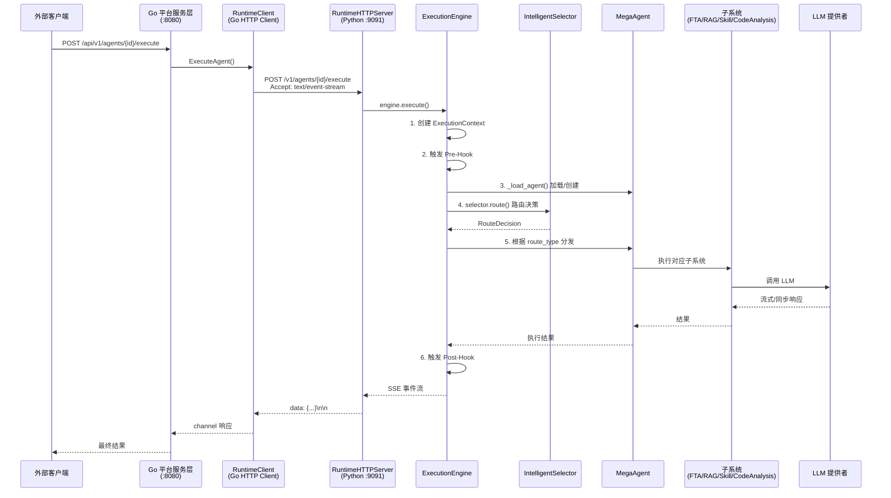

ResolveAgent 的 **Python 运行时层**是整个平台中承担智能体实际推理、决策与执行的核心子系统。它以 FastAPI + Uvicorn 作为 HTTP 服务入口，接收来自 Go 平台服务层的请求，通过执行引擎（`ExecutionEngine`）编排完整的 Agent 生命周期：从上下文构建、智能路由决策、子系统集成（FTA / RAG / Skill / 代码分析），到流式响应输出与 Hook 拦截。本文将从架构全景出发，逐层拆解运行时各核心模块的设计原理与协作机制。

Sources: [runtime/__init__.py](python/src/resolveagent/runtime/__init__.py#L1-L2), [runtime/__main__.py](python/src/resolveagent/runtime/__main__.py#L1-L35)

## 运行时模块总体架构

Python 运行时层位于 `python/src/resolveagent/runtime/` 目录下，由 **7 个核心模块**组成，各司其职：

```
python/src/resolveagent/runtime/
├── __init__.py          # 模块声明
├── __main__.py          # 入口点：python -m resolveagent.runtime
├── context.py           # ExecutionContext：单次执行的状态容器
├── engine.py            # ExecutionEngine：执行编排核心（755 行）
├── lifecycle.py         # AgentPool + AgentLifecycleManager：Agent 实例池
├── http_server.py       # RuntimeHTTPServer：FastAPI REST 端点（653 行）
├── registry_client.py   # RegistryClient：Go 注册表 HTTP 客户端（630 行）
└── server.py            # AgentExecutionServer：gRPC 服务桩（预留）
```

在深入各模块之前，先理解它们在完整请求链路中的位置。以下架构图展示了从 Go 平台发起到 Python 运行时响应的全流程：



Sources: [engine.py](python/src/resolveagent/runtime/engine.py#L1-L755), [http_server.py](python/src/resolveagent/runtime/http_server.py#L1-L653)

## 启动与入口

运行时服务通过模块入口 `__main__.py` 启动，监听环境变量 `RESOLVEAGENT_RUNTIME_HOST`（默认 `0.0.0.0`）和 `RESOLVEAGENT_RUNTIME_PORT`（默认 `9091`）。实际服务由 `RuntimeHTTPServer` 承载，采用 **单例模式** 确保全局只有一个运行时实例运行：

```python
def main() -> None:
    host = os.environ.get("RESOLVEAGENT_RUNTIME_HOST", "0.0.0.0")
    port = int(os.environ.get("RESOLVEAGENT_RUNTIME_PORT", "9091"))
    server = get_runtime_server(host, port)
    asyncio.run(server.start())
```

启动命令为：

```bash
python -m resolveagent.runtime
```

运行时配置独立存储在 `configs/runtime.yaml` 中，定义了服务器地址、Agent 池大小、选择器策略、存储客户端和记忆系统等参数：

```yaml
server:
  host: "0.0.0.0"
  port: 9091

agent_pool:
  max_size: 100
  eviction_policy: "lru"

selector:
  default_strategy: "hybrid"
  confidence_threshold: 0.7

store:
  platform_url: "http://localhost:8080"
  timeout_seconds: 30
  retry_count: 3
```

Sources: [__main__.py](python/src/resolveagent/runtime/__main__.py#L21-L34), [runtime.yaml](configs/runtime.yaml#L1-L35), [http_server.py](python/src/resolveagent/runtime/http_server.py#L637-L653)

## ExecutionContext：执行状态容器

**`ExecutionContext`** 是一个不可变的 dataclass，作为单次 Agent 执行的**状态容器**贯穿整个执行链路。它携带执行 ID、Agent ID、会话 ID、用户输入、OpenTelemetry 追踪 ID 以及可累积的元数据：

```python
@dataclass
class ExecutionContext:
    execution_id: str          # 唯一执行标识符
    agent_id: str              # 目标 Agent 标识
    conversation_id: str       # 会话延续 ID
    input_text: str            # 用户输入
    context: dict[str, Any]    # 附加上下文数据
    trace_id: str | None       # OpenTelemetry 追踪 ID
    metadata: dict[str, Any]   # 执行期间累积的元数据
```

每次执行时由 `ExecutionEngine.execute()` 创建，并通过 `with_trace()` 方法在需要时注入分布式追踪标识。该设计确保了执行上下文在整个异步调用链中的**不可变传递性**——各子系统读取相同的上下文快照，避免竞态条件。

Sources: [context.py](python/src/resolveagent/runtime/context.py#L1-L35)

## ExecutionEngine：执行编排核心

**`ExecutionEngine`** 是运行时层的中枢模块，负责编排从请求接收到响应返回的完整生命周期。其核心职责包括：

1. **Agent 实例管理**：通过 `_agent_pool` 字典缓存已创建的 `MegaAgent` 实例
2. **会话历史管理**：通过 `_conversations` 字典维护多轮对话上下文
3. **智能路由集成**：内置 `IntelligentSelector` 实例进行路由决策
4. **Hook 拦截**：支持 pre/post 执行钩子
5. **流式/同步双模式输出**

### 构造参数

| 参数 | 类型 | 说明 |
|------|------|------|
| `registry_client` | `Any \| None` | Go 注册表客户端，用于从远程加载 Agent 配置 |
| `memory_client` | `Any \| None` | 记忆持久化客户端 |
| `hook_runner` | `Any \| None` | Hook 执行器，用于生命周期拦截 |

Sources: [engine.py](python/src/resolveagent/runtime/engine.py#L20-L53)

### 核心执行流程：execute() 方法

`execute()` 方法是引擎的入口，采用 **async generator** 模式以 SSE 事件流的形式产出执行结果。完整流程分为以下阶段：

**阶段一：初始化与事件发射**

引擎首先生成唯一的 `execution_id` 和 `conversation_id`，创建 `ExecutionContext`，然后发射 `execution.started` 事件，携带时间戳和标识信息：

```python
execution_id = str(uuid.uuid4())
conversation_id = conversation_id or str(uuid.uuid4())
yield {"type": "event", "event": {"type": "execution.started", ...}}
```

**阶段二：Pre-Hook 拦截**

若配置了 `hook_runner`，引擎构建 `HookContext`（trigger_point=`agent.execute`, hook_type=`pre`），执行所有匹配的前置钩子。**钩子可以修改用户输入**——修改后的 `input_text` 将被用于后续处理：

```python
if self._hook_runner:
    pre_ctx = HookContext(trigger_point="agent.execute", hook_type="pre", ...)
    await self._hook_runner.run(pre_ctx)
    input_text = pre_ctx.input_data.get("message", input_text)
```

**阶段三：Agent 加载**

通过 `_load_agent()` 方法加载或创建 Agent。该方法首先检查本地 `_agent_pool` 缓存；若未命中，则尝试通过 `registry_client` 从 Go 平台的注册表加载 Agent 配置（名称、模型 ID、系统提示词、选择器策略、技能列表），据此构造 `MegaAgent` 实例。若注册表查询失败，则使用默认配置创建：

```python
# 从注册表加载
agent_info = await self._registry_client.get_agent(agent_id)
agent = MegaAgent(
    name=agent_config["name"],
    model_id=agent_config["model_id"],
    selector_strategy=agent_config["selector_strategy"],
    skill_names=agent_config["skill_names"],
)
```

**阶段四：智能路由决策**

引擎调用 `IntelligentSelector.route()` 进行意图分析，传入用户输入和最近 10 条对话历史作为上下文。决策结果 `RouteDecision` 包含路由类型、路由目标、置信度和推理说明。引擎发射 `selector.completed` 事件公开路由信息：

```python
decision = await self._selector.route(
    input_text=input_text,
    agent_id=agent_id,
    context={"conversation_history": self._conversations[conversation_id][-10:]},
)
```

**阶段五：子系统集成与流式执行**

根据 `decision.route_type`，引擎分发到不同的执行路径：

| route_type | 执行路径 | 说明 |
|------------|----------|------|
| `direct` | `_stream_direct_llm()` | 直接调用 LLM，支持流式输出 |
| `rag` | `_stream_rag()` | RAG 管道：检索 → LLM 生成 |
| 其他 | `agent.reply()` | 由 MegaAgent 内部路由 |

**阶段六：Post-Hook 与完成**

执行完成后触发 post-hook，发射 `execution.completed` 事件（携带耗时和累计执行次数），并将助手回复追加到会话历史。

**阶段七：错误处理**

任何阶段的异常都会被捕获，发射 `execution.failed` 事件并返回中文错误提示：

```python
except Exception as e:
    yield {"type": "event", "event": {"type": "execution.failed", ...}}
    yield {"type": "content", "content": f"执行失败: {str(e)}"}
```

Sources: [engine.py](python/src/resolveagent/runtime/engine.py#L55-L264)

### 流式输出机制

引擎支持两种输出模式，由 `stream` 参数控制：

- **流式模式**（`stream=True`，默认）：通过 `_stream_direct_llm()` 实现，使用 LLM 提供者的 `chat_stream()` 方法逐块产出 `content_chunk` 类型事件。流式输出失败时**自动降级为同步调用**，体现了良好的容错设计。
- **同步模式**（`stream=False`）：通过 `_execute_sync()` 一次性返回完整结果，产出 `content` 类型事件。

Sources: [engine.py](python/src/resolveagent/runtime/engine.py#L323-L456)

### 工作流执行：execute_workflow()

除单次 Agent 执行外，引擎还支持 **工作流编排执行**。工作流由有序节点（`WorkflowNode`）和边（`edges`）组成，引擎按顺序遍历节点：

- **start 节点**：跳过
- **agent 节点**：递归调用 `execute()` 方法
- **skill 节点**：调用 `SkillExecutor.execute()`
- **end 节点**：终止

每个节点的执行都会发射 `workflow.step_started` / `workflow.step_completed` 事件，最终发射 `workflow.completed` 事件：

Sources: [engine.py](python/src/resolveagent/runtime/engine.py#L568-L741)

## Agent 生命周期管理

### AgentPool：LRU 缓存池

**`AgentPool`** 使用 Python 标准库的 `OrderedDict` 实现 **LRU（Least Recently Used）淘汰策略**。Agent 实例惰性创建、首次请求时缓存，池满时自动淘汰最久未使用的 Agent：

| 操作 | 行为 |
|------|------|
| `get(agent_id)` | 命中时移动到末尾（更新 LRU 顺序），未命中返回 `None` |
| `put(agent_id, agent)` | 已存在则更新并移到末尾；池满时弹出最早条目 |
| `remove(agent_id)` | 直接移除 |
| `size` | 返回当前池大小 |

默认池大小为 **100**，由 `configs/runtime.yaml` 中的 `agent_pool.max_size` 配置。

### AgentLifecycleManager：生命周期管理器

**`AgentLifecycleManager`** 封装了 Agent 的创建、预热、健康检查和销毁。其 `get_or_create_agent()` 方法实现了"有则复用、无则创建"的模式：

```python
async def get_or_create_agent(self, agent_id, agent_config=None):
    agent = self.pool.get(agent_id)
    if agent is not None:
        return agent
    # 创建新 Agent（预留 AgentScope 集成点）
    agent = {"id": agent_id, "config": agent_config or {}}
    self.pool.put(agent_id, agent)
    return agent
```

Sources: [lifecycle.py](python/src/resolveagent/runtime/lifecycle.py#L1-L90)

## RuntimeHTTPServer：REST API 端点

**`RuntimeHTTPServer`** 是 Python 运行时对外暴露的 FastAPI 服务，监听 `0.0.0.0:9091`。它实现了 Go 平台与 Python 运行时之间的 **HTTP/REST 通信协议**（原设计为 gRPC，实际采用 HTTP 作为务实替代），提供以下 REST API 端点：

### 端点一览

| 端点 | 方法 | 说明 | 响应类型 |
|------|------|------|----------|
| `/health` | GET | 健康检查 | JSON |
| `/v1/agents/{id}/execute` | POST | Agent 执行 | SSE 流 |
| `/v1/workflows/{id}/execute` | POST | 工作流执行 | SSE 流 |
| `/v1/rag/query` | POST | RAG 语义查询 | JSON |
| `/v1/rag/ingest` | POST | RAG 文档摄入 | JSON |
| `/v1/skills/{name}/execute` | POST | 技能执行 | JSON |
| `/v1/corpus/import` | POST | 语料库导入 | SSE 流 |
| `/v1/solutions/sync-rag` | POST | 解决方案 RAG 同步 | JSON |
| `/v1/solutions/semantic-search` | POST | 解决方案语义搜索 | JSON |
| `/v1/code-analysis/static` | POST | 静态代码分析 | SSE 流 |
| `/v1/code-analysis/traffic` | POST | 流量分析 | SSE 流 |
| `/v1/code-analysis/errors/parse` | POST | 错误日志解析 | JSON |

### SSE 流式协议

Agent 执行和工作流执行端点采用 **Server-Sent Events (SSE)** 协议返回结果。每个事件以 `data: {JSON}\n\n` 格式发送，流结束标记为 `data: [DONE]\n\n`。事件类型包括：

- **event 事件**：`execution.started`、`selector.started`、`selector.completed`、`execution.completed`、`execution.failed`
- **content 事件**：`content`（完整内容）和 `content_chunk`（流式分块）
- **error 事件**：执行异常时的错误信息

### 生命周期管理

`RuntimeHTTPServer` 利用 FastAPI 的 `lifespan` 上下文管理器，在启动时初始化 `AgentLifecycleManager` 并连接 `SkillStoreClient`，在关闭时释放资源：

```python
@asynccontextmanager
async def lifespan(app: FastAPI):
    await server_self.lifecycle.initialize()
    server_self._skill_client = SkillStoreClient(address=...)
    await server_self._skill_client.connect()
    yield
    await server_self._skill_client.close()
    await server_self.lifecycle.shutdown()
```

Sources: [http_server.py](python/src/resolveagent/runtime/http_server.py#L30-L631)

## RegistryClient：Go 注册表 HTTP 客户端

**`RegistryClient`** 实现了 Python 运行时访问 Go 平台注册表的 HTTP 客户端，遵循 **"Go 注册表为唯一真相源"** 的架构原则。它通过 `httpx.AsyncClient` 与 Go 平台的 REST API（默认 `localhost:8080`）通信，提供以下数据访问能力：

### 数据模型

| 数据类 | 对应 Go 注册表资源 | API 路径 |
|--------|-------------------|----------|
| `AgentInfo` | Agent 注册表 | `/api/v1/agents/{id}` |
| `SkillInfo` | Skill 注册表 | `/api/v1/skills/{name}` |
| `ModelRouteInfo` | 模型路由注册表 | `/api/v1/models/{id}` |
| `WorkflowInfo` | Workflow 注册表 | `/api/v1/workflows/{id}` |
| `RAGCollectionInfo` | RAG 集合注册表 | `/api/v1/rag/collections` |
| `ServiceEndpoint` | 服务发现 | 预留 |
| `RegistryEvent` | 注册表变更事件 | 预留（WebSocket/SSE） |

### 本地缓存策略

为减少对 Go 平台的 HTTP 调用次数，`RegistryClient` 维护了三类本地缓存（`_agent_cache`、`_skill_cache`、`_model_cache`），缓存 TTL 为 **60 秒**。缓存可通过 `invalidate_cache()` 方法手动清除：

```python
# 缓存优先的查询模式
async def get_agent(self, agent_id: str) -> AgentInfo | None:
    if agent_id in self._agent_cache:
        return self._agent_cache[agent_id]
    data = await self._get(f"/api/v1/agents/{agent_id}")
    # ... 解析并缓存
```

Sources: [registry_client.py](python/src/resolveagent/runtime/registry_client.py#L1-L598)

## MegaAgent：多路由编排器

**`MegaAgent`** 继承自 `BaseAgent`，是运行时中最高层级的 Agent 抽象。它拥有 `IntelligentSelector` 实例，负责根据路由决策将请求分发到不同的子系统。MegaAgent 支持 **三种选择器模式**：

| 模式 | 类 | 说明 |
|------|-----|------|
| `selector`（默认） | `IntelligentSelector` | 完整智能路由引擎 |
| `hooks` | `HookSelectorAdapter` | 基于 Hook 的选择适配器 |
| `skills` | `SkillSelectorAdapter` | 基于 Skill 的选择适配器 |

选择器实例通过 `_get_selector()` 方法**惰性创建并缓存**，首次调用时根据 `selector_mode` 配置实例化对应类。

### 路由分发矩阵

MegaAgent 的 `_execute_by_route()` 方法实现了以下路由分发逻辑：

| route_type | 目标方法 | 描述 |
|------------|----------|------|
| `direct` | `_execute_direct()` | 直接 LLM 调用 |
| `rag` | `_execute_rag()` | RAG 检索 + LLM 生成 |
| `skill` | `_execute_skill()` | 技能加载与执行 |
| `workflow` | `_execute_workflow()` | FTA 工作流执行 |
| `code_analysis` | `_execute_code_analysis()` | 代码分析（静态/流量/LLM） |
| `multi` | `_execute_multi()` | 多路由顺序链执行 |

代码分析路由进一步根据 `decision.parameters.sub_type` 细分为三种子类型：

| sub_type | 引擎 | 说明 |
|----------|------|------|
| `static` | `StaticAnalysisEngine` | AST 调用图 + 错误解析 + 方案生成 |
| `traffic` | `DynamicAnalysisEngine` | 流量捕获分析 + 图构建 |
| `llm`（默认） | LLM 直接调用 | 传统代码审查 |

Sources: [mega.py](python/src/resolveagent/agent/mega.py#L1-L676), [base.py](python/src/resolveagent/agent/base.py#L1-L62)

## Agent 记忆系统

运行时层的记忆管理由 **`MemoryManager`** 负责，支持双层记忆架构：

- **短期记忆**：内存中的 `MemoryEntry` 列表，最大条目数默认 **100**，按 FIFO 淘汰
- **长期记忆**：当配置 `memory_client` 时，通过 Go 平台的 Memory Store 持久化，支持跨会话恢复

关键方法包括 `add_async()`（添加并持久化）、`get_context()`（获取 LLM 上下文格式的消息列表）、`load_conversation()`（从持久化存储恢复历史）：

```python
async def add_async(self, role, content, **metadata):
    self.add(role, content, **metadata)
    if self._memory_client:
        await self._memory_client.add_message(
            self._conversation_id, {...}
        )
```

消息类型体系由 `message.py` 中的 Pydantic 模型定义，包含 `Message`（角色 + 内容 + 元数据）、`ToolCall`（技能调用）和 `ToolResult`（执行结果）。

Sources: [memory.py](python/src/resolveagent/agent/memory.py#L1-L121), [message.py](python/src/resolveagent/agent/message.py#L1-L51)

## Hook 系统：生命周期拦截

运行时层通过 **`HookRunner`** 实现 Agent 执行的生命周期拦截。Hook 在引擎的 `execute()` 方法中以 pre/post 对的形式触发：

1. **Pre-Hook**（`hook_type="pre"`）：在 Agent 加载之前执行，可**修改用户输入**
2. **Post-Hook**（`hook_type="post"`）：在执行完成后执行

Hook 的匹配规则基于三个维度：`trigger_point`（如 `agent.execute`）、`hook_type`（pre/post）、`target_id`（目标 Agent ID，为空则匹配所有）。匹配的 Hook 按 `execution_order` 排序后顺序执行，支持 `skip_remaining` 标志中断链路。

`HookContext` 和 `HookResult` 是 Hook 系统的核心数据模型：

```python
@dataclass
class HookContext:
    trigger_point: str   # 触发点
    hook_type: str       # "pre" 或 "post"
    target_id: str       # 目标实体
    execution_id: str    # 执行 ID
    input_data: dict     # 输入数据（可被修改）
    output_data: dict    # 输出数据（post 时可被修改）

@dataclass
class HookResult:
    success: bool = True
    modified_data: dict  # 修改后的数据
    skip_remaining: bool # 是否跳过剩余 Hook
    duration_ms: int     # 执行耗时
```

Sources: [runner.py](python/src/resolveagent/hooks/runner.py#L1-L159), [models.py](python/src/resolveagent/hooks/models.py#L1-L35)

## 跨语言通信：Go ↔ Python 桥接

Python 运行时与 Go 平台之间通过 **HTTP/REST + SSE** 协议通信。Go 侧的 `RuntimeClient`（定义在 `pkg/server/runtime_client.go`）负责发起请求并解析 SSE 流：

```go
func (c *RuntimeClient) ExecuteAgent(ctx, agentID, req) (<-chan *ExecuteAgentResponse, <-chan error) {
    // 发起 POST 请求，Accept: text/event-stream
    // 启动 goroutine 解析 SSE 流
    // 通过 channel 返回结果给调用方
}
```

Go 客户端的超时设置为 **120 秒**（适应长时间流式执行），通过 `bufio.Scanner` 逐行解析 SSE 数据。响应通道缓冲大小为 10，确保高吞吐场景下的流畅传输。

这种 HTTP/REST 方案相比 gRPC 更**轻量务实**——无需 protobuf stub 生成，开发调试更直观，同时 SSE 天然支持流式响应。

Sources: [runtime_client.go](pkg/server/runtime_client.go#L1-L139)

## 执行引擎统计

引擎提供 `get_stats()` 方法返回运行时统计信息，可用于监控和调试：

```python
def get_stats(self) -> dict[str, Any]:
    return {
        "execution_count": self._execution_count,
        "active_agents": len(self._agent_pool),
        "active_conversations": len(self._conversations),
        "memory_client_connected": self._memory_client is not None,
        "hook_runner_enabled": self._hook_runner is not None,
    }
```

Sources: [engine.py](python/src/resolveagent/runtime/engine.py#L742-L755)

## 依赖与技术栈

Python 运行时的核心依赖定义在 `pyproject.toml` 中，要求 **Python ≥ 3.11**，关键依赖包括：

| 依赖 | 版本要求 | 用途 |
|------|----------|------|
| `fastapi` | ≥ 0.100.0 | HTTP 服务框架 |
| `uvicorn` | ≥ 0.24.0 | ASGI 服务器 |
| `httpx` | ≥ 0.28.0 | 异步 HTTP 客户端 |
| `pydantic` | ≥ 2.10.0 | 数据验证与序列化 |
| `pyyaml` | ≥ 6.0.0 | YAML 配置解析 |
| `opentelemetry-api` | ≥ 1.28.0 | 分布式追踪 |
| `grpcio` | ≥ 1.68.0 | gRPC 支持（预留） |
| `agentscope` | ≥ 0.1.0 | Agent 框架集成（预留） |

可选依赖 `rag` 包含 `pymilvus` 和 `qdrant-client`，用于向量存储集成。

Sources: [pyproject.toml](python/pyproject.toml#L1-L85)

## 架构设计要点总结

| 设计维度 | 实现方式 | 优势 |
|----------|----------|------|
| **跨语言通信** | HTTP/REST + SSE（非 gRPC） | 轻量、易调试、天然流式 |
| **Agent 缓存** | OrderedDict + LRU 淘汰 | 内存可控、热 Agent 复用 |
| **执行模式** | async generator + SSE 流 | 实时响应、低延迟 |
| **容错降级** | 流式失败自动降级同步 | 保证可用性 |
| **Hook 链** | 可排序、可中断、可修改数据 | 灵活的请求拦截与增强 |
| **注册表查询** | 本地缓存 + HTTP 回源 | 减少网络开销 |
| **记忆架构** | 短期内存 + 长期持久化 | 跨会话上下文保持 |

---

**相关阅读**：理解 Python 运行时层后，建议继续阅读以下页面以获取完整视角：

- [整体架构设计：三层微服务与双语言运行时](4-zheng-ti-jia-gou-she-ji-san-ceng-wei-fu-wu-yu-shuang-yu-yan-yun-xing-shi) — 理解 Go 平台与 Python 运行时的协作关系
- [Go 平台服务层：API Server、注册表与存储后端](5-go-ping-tai-fu-wu-ceng-api-server-zhu-ce-biao-yu-cun-chu-hou-duan) — 了解 Go 侧如何通过 RuntimeClient 调用 Python
- [智能路由决策引擎：意图分析与三阶段处理流程](8-zhi-neng-lu-you-jue-ce-yin-qing-yi-tu-fen-xi-yu-san-jie-duan-chu-li-liu-cheng) — 深入 IntelligentSelector 的路由决策机制
- [MegaAgent 核心逻辑：选择器集成与多路由分发](22-megaagent-he-xin-luo-ji-xuan-ze-qi-ji-cheng-yu-duo-lu-you-fen-fa) — MegaAgent 的完整编排策略
- [Agent 记忆系统：短期对话与长期知识存储](23-agent-ji-yi-xi-tong-duan-qi-dui-hua-yu-chang-qi-zhi-shi-cun-chu) — 记忆系统的详细设计