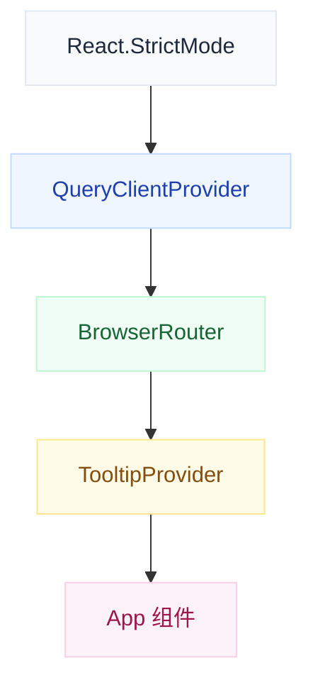
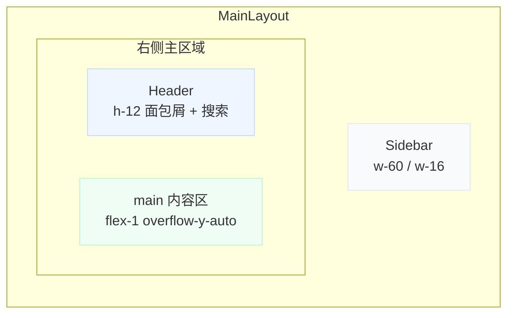
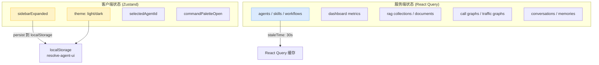
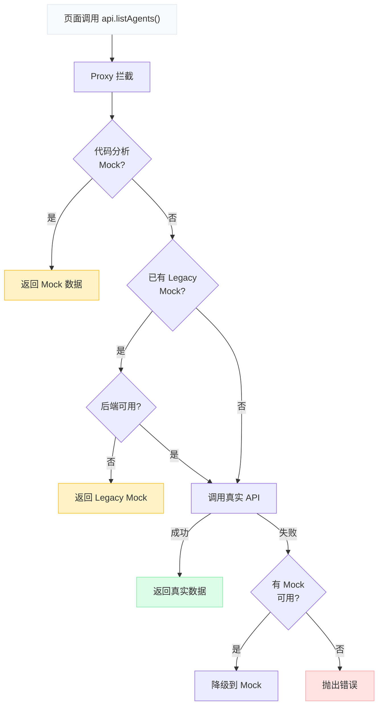

ResolveAgent 的 Web 前端是一个基于 **React 18 + TypeScript + Vite** 构建的单页应用（SPA），承担平台管理控制台的全部交互职责——从 Agent 生命周期管理到 FTA 故障树可视化编辑器，从 RAG 知识库浏览到实时对话 Playground。整个前端遵循**分层架构**原则：UI 组件层 → 页面层 → 数据钩子层 → API 客户端层，各层之间通过明确的接口契约解耦。本文将从顶层入口开始，逐层剖析组件组织模式、路由设计、状态管理策略与数据流架构，帮助开发者快速理解前端代码库的结构与扩展方式。

Sources: [package.json](web/package.json#L1-L60), [vite.config.ts](web/vite.config.ts#L1-L22)

## 技术栈全景

前端项目的技术选型以 **Radix UI 原语 + Tailwind CSS** 为视觉基础，以 **Zustand + React Query** 为数据管理双引擎，以 **React Flow** 为图可视化核心。这套组合确保了组件无障碍访问（Radix）、样式一致性（Tailwind CSS 变量体系）和高效的服务端状态同步（React Query 的缓存与失效机制）。

| 层次 | 技术选型 | 职责 |
|------|----------|------|
| **构建工具** | Vite 6 + `@vitejs/plugin-react` | HMR 热更新、路径别名 `@/`、API 代理 |
| **UI 框架** | React 18.3 + TypeScript 5.6 | 组件模型、类型安全 |
| **路由** | `react-router-dom` v7 | 声明式路由、动态参数、搜索参数 |
| **组件库** | Radix UI + `class-variance-authority` | 无障碍原语、变体样式系统 |
| **样式** | Tailwind CSS 3.4 + CSS 变量主题 | 原子化样式、亮暗双主题 |
| **服务端状态** | `@tanstack/react-query` v5 | 缓存、失效、乐观更新 |
| **客户端状态** | Zustand 5 + `persist` 中间件 | 侧栏状态、主题偏好持久化 |
| **图可视化** | `@xyflow/react` v12 | FTA 树编辑、流量图、调用链图 |
| **命令面板** | `cmdk` | `⌘K` 全局搜索导航 |
| **通知** | `sonner` | Toast 操作反馈 |

Sources: [package.json](web/package.json#L15-L58), [tailwind.config.ts](web/tailwind.config.ts#L1-L94)

## 应用入口与 Provider 嵌套

应用的引导流程从 [main.tsx](web/src/main.tsx#L1-L29) 开始，依次注入三层 Provider，形成从外到内的依赖包裹链：



**React.StrictMode** 在开发模式下启用双渲染以检测副作用问题；**QueryClientProvider** 注入 React Query 的全局配置（`staleTime: 30s`，失败重试 1 次）；**BrowserRouter** 提供客户端路由上下文；**TooltipProvider** 设置 `delayDuration: 0` 使 Radix Tooltip 立即响应。这种分层注入确保每个子组件都能通过 `useQuery`、`useNavigate` 等 hooks 访问对应上下文，而无需层层传递 props。

Sources: [main.tsx](web/src/main.tsx#L1-L29)

## 路由体系：扁平化声明式设计

[App.tsx](web/src/App.tsx#L44-L92) 定义了全部路由规则，采用**扁平化结构**（非嵌套路由布局），所有页面共享 `MainLayout` 外壳。路由表共包含 **35+ 条规则**，覆盖六大功能域：

| 功能域 | 路由前缀 | 代表页面 |
|--------|----------|----------|
| 平台概览 | `/`, `/dashboard`, `/architecture` | 首页、全局看板、架构说明 |
| Agent 管理 | `/agents`, `/agents/:id` | 列表、详情、创建、编辑、记忆、分析、诊断、部署、协作、访问控制 |
| Harness 组件 | `/skills`, `/workflows`, `/solutions` | 技能列表/详情、工作流列表/设计器/执行、方案列表/详情 |
| 知识管理 | `/rag/collections`, `/rag/documents` | RAG 集合、知识文档 |
| 分析测试 | `/playground`, `/traces`, `/evaluation`, `/monitoring` | 对话沙箱、追踪分析、评估基准、监控告警 |
| 系统管理 | `/database`, `/settings` | 数据库概览、系统设置 |

动态路由参数（如 `:id`、`:execId`）通过 `react-router-dom` 的 `useParams` hook 在页面组件内提取。路由表中的 `agents/:id` 支撑了 Agent 详情的 7 个子页面（详情、编辑、记忆、分析、诊断、部署、访问控制），这些子页面通过 `agents/:id/memory`、`agents/:id/analytics` 等路径进一步细分。

Sources: [App.tsx](web/src/App.tsx#L1-L92)

## 布局系统：三区域框架

**MainLayout** 是所有页面的共享外壳，由三个横向排列的区域组成：



### Sidebar：分组导航 + 折叠模式

[Sidebar.tsx](web/src/components/Layout/Sidebar.tsx#L47-L104) 将导航项组织为 **6 个分组**：平台概览、Agent 管理、Harness 组件、分析 & 测试、系统、学习 & 资源。每个分组包含 1–5 个导航项，通过 `navGroups` 数组声明式配置。

侧栏支持两种宽度状态（展开 `w-60` / 收起 `w-16`），通过 Zustand store 中的 `sidebarExpanded` 字段控制。收起状态下，导航项仅显示图标，悬浮时通过 Radix Tooltip 显示名称。全局快捷键 `⌘B` 可切换折叠状态。活跃路由的判定使用 `isActive()` 工具函数，支持精确匹配和前缀匹配（要求下一个字符为 `/`，避免误判）。

Sources: [Sidebar.tsx](web/src/components/Layout/Sidebar.tsx#L47-L113), [MainLayout.tsx](web/src/components/Layout/MainLayout.tsx#L68-L122)

### Header：面包屑导航 + 全局操作

[Header.tsx](web/src/components/Layout/Header.tsx#L7-L56) 提供动态面包屑（基于 `routeMap` 静态映射和动态路径解析）、全局搜索触发按钮（`⌘K`）、亮暗主题切换、以及平台健康状态指示器。面包屑解析逻辑优先匹配静态路径表，回退到路径前缀规则（如 `/agents/:id` 的子路径自动生成「Agent 管理 → {id}」面包屑）。

Sources: [Header.tsx](web/src/components/Layout/Header.tsx#L7-L117)

### 命令面板（Command Palette）

MainLayout 内嵌的 [CommandDialog](web/src/components/Layout/MainLayout.tsx#L92-L117) 基于 `cmdk` 库实现，通过 `⌘K` 全局快捷键触发。它索引了全部 20 个导航项，支持模糊搜索页面名称，选择后自动导航。外部链接项（如「自助学习」）以新窗口方式打开，并通过 `ExternalLink` 图标标识。

Sources: [MainLayout.tsx](web/src/components/Layout/MainLayout.tsx#L73-L117)

## 状态管理：Zustand 客户端状态 + React Query 服务端状态

前端采用**双轨状态管理**策略，将状态按其数据来源清晰划分：



### Zustand：UI 偏好持久化

[stores/app.ts](web/src/stores/app.ts#L26-L49) 定义了 `useAppStore`，管理 4 个 UI 状态字段。其中 `sidebarExpanded` 和 `theme` 通过 `persist` 中间件自动同步到 `localStorage`（key: `resolve-agent-ui`），页面刷新后自动恢复。主题切换通过 `applyTheme()` 函数直接操作 `document.documentElement` 的 CSS class（`dark`），与 Tailwind 的 `darkMode: 'class'` 配置联动。`partialize` 选项确保只有指定字段被持久化，`onRehydrateStorage` 回调在存储恢复后立即应用主题 class。

Sources: [stores/app.ts](web/src/stores/app.ts#L1-L50), [tailwind.config.ts](web/tailwind.config.ts#L5-L6)

### React Query Hooks：领域数据封装

每个业务领域对应一个独立的 hooks 文件，封装该领域的所有查询与变更操作：

| Hook 文件 | 导出数量 | 覆盖功能 |
|-----------|----------|----------|
| [useAgents.ts](web/src/hooks/useAgents.ts) | 17 个 hooks | Agent CRUD、执行记录、运行时状态、对话、记忆、分析、诊断、部署、协作、访问控制、模板 |
| [useDashboard.ts](web/src/hooks/useDashboard.ts) | 7 个 hooks | 指标、工单、平台状态、Agent 概览、活动事件、执行统计、告警 |
| [useWorkflows.ts](web/src/hooks/useWorkflows.ts) | 5 个 hooks | 工作流列表/详情、故障树查询/保存、执行记录 |
| [useSkills.ts](web/src/hooks/useSkills.ts) | 2 个 hooks | 技能列表、技能详情 |
| [useRAG.ts](web/src/hooks/useRAG.ts) | 3 个 hooks | 集合列表/详情、文档列表 |
| [useCodeAnalysis.ts](web/src/hooks/useCodeAnalysis.ts) | 9 个 hooks | 调用图/流量捕获/流量图的 CRUD |

所有查询 hooks 遵循统一模式：`useQuery` + `queryKey` 数组化命名（如 `['agents', id, 'executions']`）+ 条件执行（`enabled: !!id`）。变更 hooks 使用 `useMutation` + `onSuccess` 中自动 `invalidateQueries` 实现缓存失效。例如 `useUpdateAgent` 在成功后同时失效 `['agents']` 列表缓存和 `['agents', variables.id]` 详情缓存。

Sources: [useAgents.ts](web/src/hooks/useAgents.ts#L1-L160), [useDashboard.ts](web/src/hooks/useDashboard.ts#L1-L52), [useWorkflows.ts](web/src/hooks/useWorkflows.ts#L1-L46)

## API 客户端层：Proxy 自动降级机制

[api/client.ts](web/src/api/client.ts#L1-L435) 是前端数据获取的核心枢纽，设计了一套精巧的**三层降级策略**：



这套机制通过 `createProxiedApi()` 函数实现，使用 ES `Proxy` 对象包装 `realApi`，在每次方法调用时动态决策数据源。**后端健康检测**通过 `checkBackend()` 函数实现：首次请求时探测 `/api/v1/health`（1.5s 超时），结果缓存 30 秒，避免每次 API 调用都产生探测开销。

Mock 数据源分为两类：**Legacy Mock**（[mock.ts](web/src/api/mock.ts)，2700+ 行，覆盖全部业务域的模拟数据）在开发模式且后端不可用时自动激活；**代码分析专用 Mock**（[mocks/codeAnalysis/](web/src/mocks/codeAnalysis)）通过环境变量 `VITE_CODE_ANALYSIS_FORCE_REAL` 控制，即使在开发环境也能切换到真实后端。

Sources: [client.ts](web/src/api/client.ts#L291-L393), [mockRuntime.ts](web/src/api/mockRuntime.ts#L1-L23)

## 页面组件架构：按功能域分目录

`pages/` 目录按功能域组织，每个域一个子目录，包含列表页、详情页、创建/编辑表单等：

```
pages/
├── Agents/          # 14 个文件：列表、创建、编辑、详情、记忆、分析、诊断、部署、协作、访问控制、模板、比较、执行详情
├── Skills/          # 3 个文件：列表、详情、详情测试
├── Workflows/       # 3 个文件：列表、设计器、执行监控
├── RAG/             # 2 个文件：集合、文档
├── Solutions/       # 2 个文件：列表、详情
├── CodeAnalysis/    # 4 个文件：入口、调用图列表、K8s 语料分析、流量分析
├── Dashboard/       # 全局看板
├── Playground/      # 对话沙箱（含 useConversationHistory hook）
├── Database/        # 数据库概览（3 个 Tab：Schema/关系/Mock 数据）
├── Home/            # 首页（智能选择器演示 + Harness 层级说明）
└── ...              # 架构说明、监控、设置、评估等单文件页面
```

### 页面设计模式

页面组件普遍遵循以下结构模式：

1. **PageHeader** 统一页面标题栏，支持描述文字、操作按钮组、自定义面包屑
2. **EmptyState** 处理空数据场景，提供图标、标题、描述和行动按钮
3. **Skeleton 骨架屏** 加载态使用 `<Skeleton>` 组件模拟内容占位
4. **数据加载** 通过对应 hooks（如 `useAgents()`）获取数据，`isLoading` 控制骨架屏显示
5. **Toast 通知** 操作反馈通过 `sonner` 的 `toast.success()` / `toast.error()` 实现

以 AgentList 页面为例：组件内通过 `useEffect` 调用 `api.listAgents()` 加载数据（注：此处未使用 React Query hook 而是直接调用 API），`loading` 状态控制骨架屏渲染，空列表显示 `EmptyState` 组件，删除操作通过 `Dialog` 确认弹窗 + `toast` 反馈完成。

Sources: [AgentList.tsx](web/src/pages/Agents/AgentList.tsx#L43-L102), [Collections.tsx](web/src/pages/RAG/Collections.tsx#L19-L183)

## 可视化组件：React Flow 图编辑器

前端包含三个基于 `@xyflow/react` 的复杂可视化组件，各自处理不同类型的图数据：

### FTA 故障树编辑器

[TreeEditor/](web/src/components/TreeEditor) 是最复杂的可视化组件，由 5 个文件组成：

| 组件 | 职责 |
|------|------|
| [FTATreeEditor.tsx](web/src/components/TreeEditor/FTATreeEditor.tsx) | 主编辑器：FaultTree ↔ ReactFlow 双向转换、撤销/重做、拖拽交互 |
| [FTANode.tsx](web/src/components/TreeEditor/FTANode.tsx) | 事件节点：顶事件/中间事件/基本事件/未展开事件四种样式 |
| [GateNode.tsx](web/src/components/TreeEditor/GateNode.tsx) | 门节点：AND/OR/VOTING/INHIBIT/PRIORITY_AND 五种符号 |
| [EditorToolbar.tsx](web/src/components/TreeEditor/EditorToolbar.tsx) | 工具栏：添加节点/门、撤销重做、保存 |
| [NodePropertyPanel.tsx](web/src/components/TreeEditor/NodePropertyPanel.tsx) | 属性面板：编辑选中节点的名称、类型、评估器等属性 |

编辑器的核心算法是 **BFS 层级布局**：从顶事件出发，广度优先遍历计算每个事件的深度和列位置，转换为 ReactFlow 的节点坐标。`faultTreeToFlow()` 和 `flowToFaultTree()` 两个函数实现 FaultTree 数据模型与 ReactFlow 图结构的双向转换。撤销/重做系统通过自定义 `useHistory` hook 实现，维护最多 30 步快照栈。

Sources: [FTATreeEditor.tsx](web/src/components/TreeEditor/FTATreeEditor.tsx#L1-L200)

### 流量图查看器

[TrafficGraph/](web/src/components/TrafficGraph) 渲染微服务调用拓扑，由三个组件组成：
- **TrafficGraphViewer**：ReactFlow 容器，配置自定义节点/边类型
- **ServiceNode**：服务节点，展示服务名称与状态
- **TrafficEdge**：带动画的流量边，可视化请求流向

### K8s 语料分析面板

[K8sCorpus/](web/src/components/K8sCorpus) 展示代码调用链与源文件关系图，包含 `ChainFlowViewer`、`CodeSnippetPanel`、`FunctionCallEdge`、`SourceFileNode` 等专用组件。

Sources: [TrafficGraphViewer.tsx](web/src/components/TrafficGraph/TrafficGraphViewer.tsx#L1-L89)

## UI 组件库：shadcn/ui 模式

`components/ui/` 目录包含 **18 个基础 UI 组件**，采用 shadcn/ui 的「Radix 原语 + Tailwind 变体」模式：

```
components/ui/
├── badge.tsx          # 标签（variant: default/secondary/outline/destructive）
├── button.tsx         # 按钮（variant: default/destructive/outline/secondary/ghost/link）
├── card.tsx           # 卡片（Card/CardHeader/CardTitle/CardDescription/CardContent/CardFooter）
├── command.tsx        # 命令面板
├── dialog.tsx         # 对话框
├── dropdown-menu.tsx  # 下拉菜单
├── input.tsx          # 输入框
├── label.tsx          # 标签
├── progress.tsx       # 进度条
├── scroll-area.tsx    # 滚动区域
├── select.tsx         # 选择器
├── separator.tsx      # 分隔线
├── sheet.tsx          # 侧滑面板
├── skeleton.tsx       # 骨架屏
├── sonner.tsx         # Toast 通知
├── tabs.tsx           # 选项卡
├── textarea.tsx       # 多行文本
└── tooltip.tsx        # 提示气泡
```

所有 UI 组件遵循 `class-variance-authority`（CVA）变体模式：通过 `cvx()` 定义基础样式和变体映射，通过 `cn()` 工具函数（`clsx` + `tailwind-merge`）合并类名，避免 Tailwind 类冲突。

Sources: [utils.ts](web/src/lib/utils.ts#L1-L7), [components/ui](web/src/components/ui)

## 主题系统：CSS 变量双主题

[index.css](web/src/index.css#L1-L146) 定义了完整的亮暗双主题 CSS 变量体系。亮色主题采用「极简白」风格（`--background: 0 0% 99%`），暗色主题采用「深黑」风格（`--background: 220 14% 4%`）。所有颜色通过 HSL 变量引用，确保组件无需感知当前主题即可正确渲染。

状态色彩（`--status-healthy` / `--status-degraded` / `--status-failed` / `--status-progressing` / `--status-unknown`）独立于主色板，用于 StatusBadge、StatusDot 等运维状态指示组件。字体配置通过 Tailwind 的 `fontFamily` 扩展：正文使用 `Source Sans 3`，标题使用 `Manrope`，代码使用 `JetBrains Mono`。

动画系统定义了 8 种关键帧动画（`slide-up-fade`、`flow-dash`、`data-pulse`、`subtle-breathe`、`shimmer-line`、`node-pulse`、`confidence-fill`、`scan-line`），均以工具类形式暴露（如 `animate-flow-dash`），服务于首页的智能选择器演示和流量可视化效果。

Sources: [index.css](web/src/index.css#L1-L146), [tailwind.config.ts](web/tailwind.config.ts#L14-L68)

## 类型系统：前后端契约

[types/index.ts](web/src/types/index.ts) 定义了前端使用的全部 TypeScript 类型，共 790+ 行，覆盖以下领域：

| 类型域 | 核心类型 | 说明 |
|--------|----------|------|
| Agent | `AgentType`, `AgentStatus`, `HarnessConfig` | Agent 分类、状态、Harness 配置 |
| 智能选择器 | `RouteDecision`, `IntentClassification`, `SelectorPipelineTrace` | 路由决策、意图分类、管道追踪 |
| FTA | `FaultTree`, `FTAEvent`, `FTAGate`, `GateType` | 故障树完整数据模型 |
| 技能 | `SkillManifest`, `SkillParameter`, `SkillPermissions` | 技能清单、参数、权限 |
| Dashboard | `DashboardMetrics`, `AgentOverview`, `ActivityEvent` | 看板指标、Agent 概览、活动事件 |
| 记忆 | `Conversation`, `ConversationMessage`, `LongTermMemory` | 对话、消息、长期记忆 |
| 部署 | `DeploymentInfo`, `DeploymentVersion`, `DeploymentLog` | 部署信息、版本、日志 |

类型定义采用「类型别名 + 接口」混合模式：枚举值使用 `type` 别名定义联合类型（如 `type AgentStatus = 'active' | 'inactive' | 'error'`），复杂结构使用 `interface`。`agentStatusToVariant` 等映射常量将业务状态转换为 UI 状态变体，在组件中直接使用。

Sources: [types/index.ts](web/src/types/index.ts#L1-L200)

## 构建配置与开发代理

[vite.config.ts](web/vite.config.ts#L1-L22) 配置了两个关键特性：

1. **路径别名**：`@/` 映射到 `./src/`，使导入路径简洁（如 `import { api } from '@/api/client'`）
2. **API 代理**：`/api` 前缀的请求代理到 `http://localhost:8080`（Go 平台服务层），避免开发环境的跨域问题

生产构建流程为 `tsc -b && vite build`（先类型检查再打包），开发服务器监听端口 3000。[constants/index.ts](web/src/constants/index.ts) 定义了 API 基础 URL、版本前缀（`/api/v1`）、分页大小、WebSocket 重连间隔等常量。

Sources: [vite.config.ts](web/vite.config.ts#L1-L22), [constants/index.ts](web/src/constants/index.ts#L1-L36)

## 扩展指南：添加新功能页面的标准流程

基于上述架构分析，添加一个新功能页面（例如「告警规则管理」）的标准流程如下：

1. **定义类型**：在 [types/index.ts](web/src/types/index.ts) 中添加 `AlertRule` 等接口
2. **扩展 API**：在 [api/client.ts](web/src/api/client.ts) 的 `realApi` 对象中添加 `listAlertRules()` 等方法
3. **添加 Mock**：在 [api/mock.ts](web/src/api/mock.ts) 中添加模拟数据（仅在开发环境降级时使用）
4. **创建 Hook**：新建 `hooks/useAlertRules.ts`，封装 `useQuery` / `useMutation`
5. **实现页面**：在 `pages/AlertRules/` 目录下创建页面组件，使用 PageHeader + DataTable/EmptyState + Skeleton 模式
6. **注册路由**：在 [App.tsx](web/src/App.tsx) 的 `<Routes>` 中添加路由规则
7. **导航入口**：在 [Sidebar.tsx](web/src/components/Layout/Sidebar.tsx) 的 `navGroups` 中添加导航项
8. **面包屑映射**：在 [Header.tsx](web/src/components/Layout/Header.tsx) 的 `routeMap` 中添加路径标签

Sources: [App.tsx](web/src/App.tsx#L44-L92), [Sidebar.tsx](web/src/components/Layout/Sidebar.tsx#L47-L104)

## 延伸阅读

理解 Web 前端层的组件架构后，建议按以下顺序深入相关子系统：

- 前端通过 [api/client.ts](web/src/api/client.ts) 代理调用的后端 API，详见 [Go 平台服务层：API Server、注册表与存储后端](5-go-ping-tai-fu-wu-ceng-api-server-zhu-ce-biao-yu-cun-chu-hou-duan)
- Playground 页面调用的 Agent 运行时，详见 [Python Agent 运行时层：执行引擎与生命周期管理](6-python-agent-yun-xing-shi-ceng-zhi-xing-yin-qing-yu-sheng-ming-zhou-qi-guan-li)
- FTA 树编辑器操作的数据结构，详见 [故障树数据结构：事件、门与树模型](11-gu-zhang-shu-shu-ju-jie-gou-shi-jian-men-yu-shu-mo-xing)
- RAG 知识库页面对应的完整管道，详见 [RAG 管道全景：文档摄取、向量索引与语义检索](14-rag-guan-dao-quan-jing-wen-dang-she-qu-xiang-liang-suo-yin-yu-yu-yi-jian-suo)
- 首页展示的智能选择器路由演示，详见 [智能路由决策引擎：意图分析与三阶段处理流程](8-zhi-neng-lu-you-jue-ce-yin-qing-yi-tu-fen-xi-yu-san-jie-duan-chu-li-liu-cheng)
- 完整的 API 端点参考，详见 [REST API 完整参考：端点、请求/响应格式与错误处理](32-rest-api-wan-zheng-can-kao-duan-dian-qing-qiu-xiang-ying-ge-shi-yu-cuo-wu-chu-li)