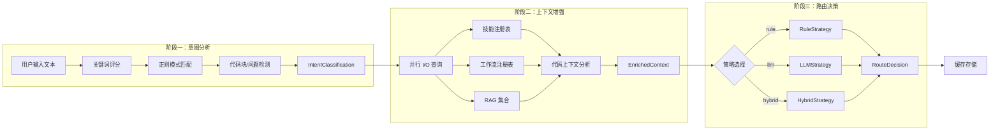
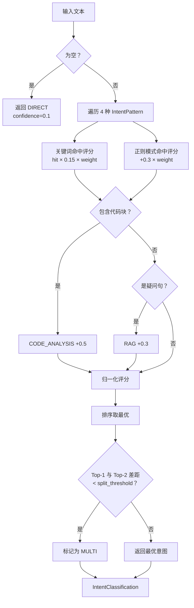
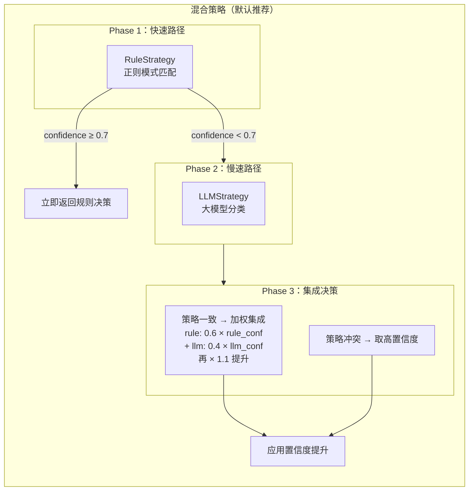
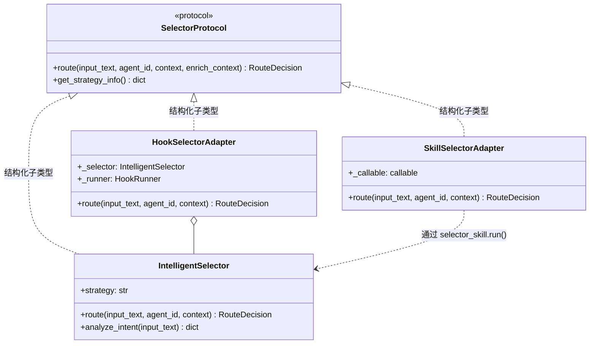
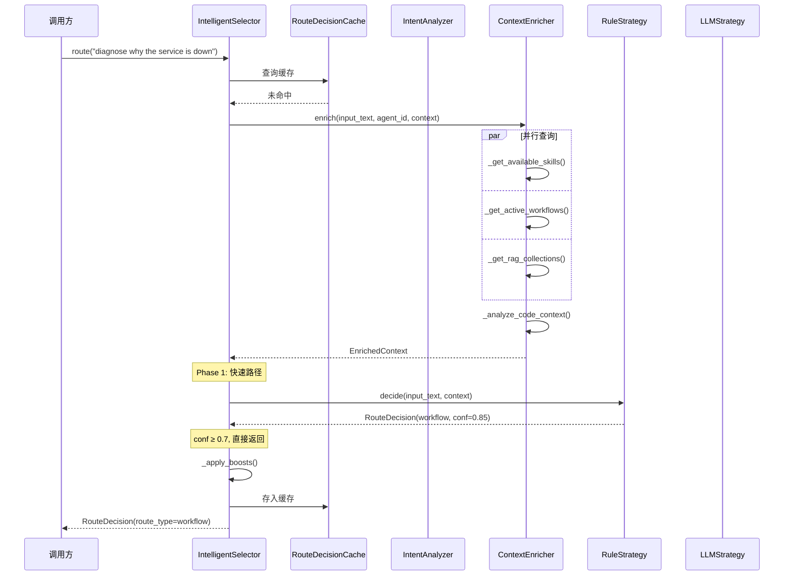

**智能路由决策引擎**（Intelligent Selector）是 ResolveAgent 平台的"大脑"——一个 LLM 驱动的元路由器，负责将每一条用户请求精确分发到最优执行路径。本文从第一性原理出发，深度剖析其三阶段处理流水线（意图分析 → 上下文增强 → 路由决策）、六种路由类型的判定逻辑、以及三种策略（规则/LLM/混合）的协作机制。阅读本文后，你将理解一条请求从原始文本到 `RouteDecision` 的完整生命周期。

Sources: [selector.py](python/src/resolveagent/selector/selector.py#L1-L111)

---

## 核心架构总览

智能路由决策引擎采用**三阶段流水线**（Three-Stage Pipeline）架构。每条用户请求依次经过**意图分析器**（IntentAnalyzer）、**上下文增强器**（ContextEnricher）和**路由策略决策器**三个阶段，最终产出一个包含路由类型、目标、置信度和推理说明的结构化 `RouteDecision` 对象。



`IntelligentSelector` 类是整个流水线的编排入口。它以 `route()` 方法对外暴露统一的异步接口，内部按需懒加载（lazy-load）三个阶段的组件，并支持通过 `enrich_context` 参数跳过第二阶段以优化性能。引擎默认使用**混合策略**（hybrid），当传入无效策略名时自动回退到混合策略。

Sources: [selector.py](python/src/resolveagent/selector/selector.py#L80-L211), [__init__.py](python/src/resolveagent/selector/__init__.py#L1-L54)

---

## 阶段一：意图分析

**意图分析**是流水线的首个阶段，由 `IntentAnalyzer` 类负责。它的核心职责是将原始文本映射为结构化的 `IntentClassification` 对象，包括意图类型、置信度、实体提取、子意图和推荐目标。

### 意图类型体系

引擎识别六种意图类型，对应平台内六条核心执行路径：

| 意图类型 | 枚举值 | 权重 | 典型场景 | 路由目标示例 |
|----------|--------|------|----------|-------------|
| **Workflow** | `workflow` | 1.2 | 复杂多步骤故障诊断、FTA 分析、根因调查 | `incident-diagnosis` |
| **Skill** | `skill` | 1.0 | 单一工具调用（搜索、执行代码、文件操作） | `web-search`、`code-exec` |
| **RAG** | `rag` | 0.8 | 知识检索、文档查询、"是什么"类问题 | `product-docs`、`runbooks` |
| **Code Analysis** | `code_analysis` | 1.1 | 代码审查、漏洞扫描、AST 分析、调用图 | `static-analysis`、`security-scan` |
| **Direct** | `direct` | — | 通用对话、简单问候、无明确路由的请求 | 空字符串 |
| **Multi** | `multi` | — | 检测到多个高权重意图，差距低于阈值 | 由子意图列表决定 |

权重值直接影响评分——**Workflow** 和 **Code Analysis** 获得更高的权重（1.2 和 1.1），因为它们在 AIOps 场景中更为关键且判定更明确；**RAG** 权重较低（0.8），因为"是什么"类关键词过于通用，容易误判。

Sources: [intent.py](python/src/resolveagent/selector/intent.py#L17-L196)

### 单遍评分算法

`IntentAnalyzer.classify()` 方法采用**单遍扫描**（Single-Pass）算法，在一次遍历中同时完成关键词评分和正则模式评分：



**评分归一化**：所有原始分数按总和归一化到 [0, 1]，最终置信度取 `min(归一化值 × 1.5, 1.0)` 以放大区分度。**多意图检测**的阈值 `split_threshold` 默认为 0.15——当最高分与次高分的差距低于此值且次高分大于 0.2 时，系统判定为 `MULTI` 意图，表示需要多路径协同处理。

Sources: [intent.py](python/src/resolveagent/selector/intent.py#L198-L345)

### 意图模式定义

每种意图类型由一组**正则模式**和**关键词列表**联合定义。以下是各类型的模式摘要：

**Workflow 模式**覆盖诊断、排障、根因分析等关键词（`diagnose`、`troubleshoot`、`root cause`、`incident`）以及 "why/how ... failed/broken" 的复合句式。**Skill 模式**捕获动词+名词组合（`search ... web`、`execute ... code`、`read ... file`）。**RAG 模式**匹配疑问词开头（`what/how/explain/describe`）和文档相关术语。**Code Analysis 模式**最为丰富，不仅包含 `analyze ... code`、`static analysis`、`call graph` 等直接模式，还通过 ` ```[a-z]*\n[\s\S]*``` ` 模式直接检测 Markdown 代码块。

Sources: [intent.py](python/src/resolveagent/selector/intent.py#L65-L196)

---

## 阶段二：上下文增强

第二阶段由 `ContextEnricher` 类负责，目标是**将原始意图信息扩展为包含丰富系统状态的结构化上下文**，供第三阶段的路由策略做出更精准的决策。

### EnrichedContext 数据模型

`EnrichedContext` 是一个 dataclass，聚合了路由决策所需的全部上下文信息：

| 字段 | 类型 | 说明 |
|------|------|------|
| `input_text` | `str` | 原始输入文本 |
| `agent_id` | `str` | 当前处理的 Agent 标识 |
| `conversation_history` | `list[dict]` | 对话历史记录 |
| `available_skills` | `list[dict]` | 按相关性排序的可用技能（Top 10） |
| `active_workflows` | `list[dict]` | 当前活跃的工作流 |
| `rag_collections` | `list[dict]` | 可用的 RAG 知识集合 |
| `code_context` | `CodeContext \| None` | 代码分析上下文（语言、代码片段、问题检测） |
| `user_preferences` | `dict` | 用户偏好推断（详细程度、语言等） |
| `session_metadata` | `dict` | 会话元数据（输入哈希、输入长度） |
| `enrichment_confidence` | `float` | 增强质量置信度（0.0–1.0） |

Sources: [context_enricher.py](python/src/resolveagent/selector/context_enricher.py#L17-L68)

### 并行 I/O 策略

`ContextEnricher.enrich()` 方法通过 `asyncio.gather` 并行发起三项注册表查询——技能列表、工作流列表和 RAG 集合列表——以最小化 I/O 等待时间。查询完成后，技能列表按与输入文本的相关性排序并截断为 Top 10：

```python
# 并行查询三项资源（节选核心逻辑）
skills, workflows, collections = await asyncio.gather(
    self._get_available_skills(agent_id),
    self._get_active_workflows(agent_id),
    self._get_rag_collections(agent_id),
)
enriched.available_skills = self._rank_skills(input_text, skills)
```

当注册表客户端不可用或查询失败时，系统**优雅降级**到内置默认值——5 个预设技能、3 个预设工作流、4 个预设 RAG 集合——确保路由引擎在任何环境下都能正常工作。

Sources: [context_enricher.py](python/src/resolveagent/selector/context_enricher.py#L198-L253)

### 代码上下文分析

当输入包含代码内容时，`ContextEnricher` 会执行**语言检测**和**问题扫描**两项分析。语言检测支持 Python、JavaScript、TypeScript、Go、Java、Rust、SQL、YAML 和 JSON 共 9 种语言，每种语言通过 6–8 条预编译正则模式匹配。问题扫描覆盖 `eval()`、`exec()` 调用、硬编码凭证、空异常捕获块、SQL 通配符 `SELECT *` 等 10 种常见安全风险模式。

代码复杂度通过简单的行数和缩进层级启发式评估，输出 `low`（<20 行且缩进 <8）、`medium`（<100 行且缩进 <16）或 `high` 三档。

Sources: [context_enricher.py](python/src/resolveagent/selector/context_enricher.py#L92-L199), [context_enricher.py](python/src/resolveagent/selector/context_enricher.py#L426-L486)

---

## 阶段三：路由决策

第三阶段是整个流水线的核心输出端，由可插拔的**策略模式**（Strategy Pattern）驱动。`IntelligentSelector` 维护一个策略名称到路由函数的映射表，通过 `_get_strategy()` 懒加载策略实例。

### RouteDecision 输出模型

无论使用哪种策略，最终都输出统一的 `RouteDecision` 模型：

| 字段 | 类型 | 说明 |
|------|------|------|
| `route_type` | `str` | 路由类型：`workflow`、`skill`、`rag`、`code_analysis`、`direct`、`multi` |
| `route_target` | `str` | 路由目标（如 `web-search`、`incident-diagnosis`） |
| `confidence` | `float` | 置信度（0.0–1.0） |
| `parameters` | `dict` | 附加路由参数 |
| `reasoning` | `str` | 人类可读的决策推理说明 |
| `chain` | `list[RouteDecision]` | 多路由场景下的有序子决策链 |

模型提供了 `is_code_related()` 和 `is_high_confidence()` 两个便捷方法，分别用于判断是否为代码相关路由和是否达到指定置信阈值（默认 0.7）。

Sources: [selector.py](python/src/resolveagent/selector/selector.py#L20-L78)

### 路由策略的协作关系

三种策略形成一个**递进增强**的层次结构：



Sources: [hybrid_strategy.py](python/src/resolveagent/selector/strategies/hybrid_strategy.py#L41-L131)

### 混合策略的三阶段决策流

**HybridStrategy** 是默认推荐策略，其决策过程分为三个紧密衔接的阶段：

**Phase 1 — 快速路径**：首先调用 `RuleStrategy`，利用预编译正则模式进行确定性匹配。如果规则匹配置信度达到阈值（默认 0.7），立即返回结果，**跳过 LLM 调用**。这一阶段保证了高频已知模式的响应速度——通常在毫秒级完成。

**Phase 2 — 慢速路径**：当规则匹配置信度不足时，调用 `LLMStrategy`，将请求和增强后的上下文一起发送给大语言模型进行语义分类。LLM 使用低温度（0.3）和最大 500 token 限制以获取确定性的 JSON 路由结果。

**Phase 3 — 集成决策**：当两个策略都提供了有效结果（规则置信度 > 0.3 且集成开关开启），系统进入集成模式。**一致时**：两种策略选了相同路由类型，按 `rule_weight × rule_conf + llm_weight × llm_conf` 加权合并，并额外乘以 1.1 的"一致性奖励"。**冲突时**：选择置信度更高的策略结果，但在 `parameters` 中保留另一策略的建议供审计追踪。

Sources: [hybrid_strategy.py](python/src/resolveagent/selector/strategies/hybrid_strategy.py#L79-L131), [hybrid_strategy.py](python/src/resolveagent/selector/strategies/hybrid_strategy.py#L132-L187)

### HybridConfig 可调参数

| 参数 | 默认值 | 说明 |
|------|--------|------|
| `rule_confidence_threshold` | 0.7 | 规则策略直接返回的置信度阈值 |
| `llm_confidence_threshold` | 0.6 | LLM 策略的最低可接受置信度 |
| `use_ensemble` | `True` | 是否启用策略集成（一致时加权合并） |
| `rule_weight` | 0.6 | 集成时规则策略的权重 |
| `llm_weight` | 0.4 | 集成时 LLM 策略的权重 |
| `code_boost` | 0.1 | 检测到代码块时对 `code_analysis` 的置信度提升 |
| `per_route_boosts` | `{}` | 按路由类型的自定义置信度提升字典 |

Sources: [hybrid_strategy.py](python/src/resolveagent/selector/strategies/hybrid_strategy.py#L22-L38)

---

## 路由决策缓存

为了避免对相同或相似请求重复执行完整的三阶段流水线，引擎引入了 `RouteDecisionCache`——一个 **TTL 感知的 LRU 缓存**。

缓存键通过 `SHA-256(input_text | agent_id | strategy)` 生成确定性哈希，确保相同输入在不同策略下不会互相覆盖。缓存支持两种作用域：

| 作用域 | 说明 |
|--------|------|
| `instance` | 每个 `IntelligentSelector` 实例独享缓存（默认） |
| `global` | 模块级单例，所有实例共享缓存 |

缓存默认容量 1000 条、TTL 300 秒。每次 `get()` 时检查 TTL，过期条目自动驱逐；每次 `put()` 时若容量已满则 LRU 淘汰最久未使用的条目。缓存还提供 `cache_stats()` 方法返回命中数、未命中数和命中率，用于运行时监控。调用 `route()` 时可通过 `bypass_cache=True` 参数跳过缓存。

Sources: [cache.py](python/src/resolveagent/selector/cache.py#L1-L112)

---

## 统一协议与适配器模式

所有选择器实现——无论是核心的 `IntelligentSelector` 还是包装器——都遵循 `SelectorProtocol` 协议。这是一个基于 Python `Protocol` 的结构化子类型接口，只需实现 `async route()` 和 `get_strategy_info()` 两个方法即可满足协议，无需继承。

### 两种适配器

引擎提供两种适配器将选择器包装为不同消费模式：

**HookSelectorAdapter**：在核心选择器外包装 **pre-hook / post-hook** 管道。Pre-hook 可以拦截输入或直接短路返回决策；Post-hook 可以审计或修改最终路由结果。默认注册三个内置处理器：`intent_analysis`（预分析）、`decision_audit`（审计）、`confidence_override`（置信度覆盖）。Hook 机制支持自定义处理器注册，实现插件式扩展。

**SkillSelectorAdapter**：将路由逻辑包装为标准 **Skill 调用**。它通过 `selector_skill.py` 的 `run()` 函数直接调用 `IntelligentSelector`，将输出转换为字典格式，使其能被 `SkillLoader` / `SkillExecutor` 管道像其他技能一样调度和执行。



Sources: [protocol.py](python/src/resolveagent/selector/protocol.py#L1-L37), [hook_selector.py](python/src/resolveagent/selector/hook_selector.py#L1-L153), [skill_selector.py](python/src/resolveagent/selector/skill_selector.py#L1-L69)

---

## 端到端处理流程

将上述三个阶段组合起来，一条请求从输入到最终决策的完整生命周期如下：



对于混合策略下的**低置信度场景**（Phase 2 触发时），流程会额外调用 LLM 并可能进入集成决策阶段，整体延迟增加一次 LLM 推理时间。

Sources: [selector.py](python/src/resolveagent/selector/selector.py#L158-L211), [hybrid_strategy.py](python/src/resolveagent/selector/strategies/hybrid_strategy.py#L79-L131)

---

## 路由类型速查表

下表总结了引擎支持的所有路由目标及其典型触发条件：

| 路由类型 | 目标 | 典型触发输入 | 策略置信度 |
|----------|------|-------------|-----------|
| `workflow` / `fta` | `incident-diagnosis` | "diagnose why the service failed" | 0.85 |
| `skill` | `web-search` | "search the web for Python tutorials" | 0.90 |
| `skill` | `code-exec` | "execute this Python script" | 0.85 |
| `skill` | `file-ops` | "read the file config.yaml" | 0.85 |
| `skill` | `api-call` | "send a POST request to the API" | 0.85 |
| `skill` | `calculator` | "calculate 15% of 200" | 0.75 |
| `rag` | `product-docs` | "what is the deployment process?" | 0.70 |
| `rag` | `runbooks` | "how to deploy according to runbook" | 0.75 |
| `rag` | `incident-history` | "has this incident happened before?" | 0.80 |
| `code_analysis` | `static-analysis` | "analyze this code for bugs" | 0.85 |
| `code_analysis` | `security-scan` | "find security vulnerabilities" | 0.85 |
| `direct` | _(空)_ | "hello" / 无法匹配的请求 | 0.30 |

Sources: [rule_strategy.py](python/src/resolveagent/selector/strategies/rule_strategy.py#L44-L180)

---

## 继续阅读

- **路由策略的内部实现细节**：请参阅 [路由策略详解：规则策略、LLM 策略与混合策略](9-lu-you-ce-lue-xiang-jie-gui-ze-ce-lue-llm-ce-lue-yu-hun-he-ce-lue)，深入了解每种策略的正则规则定义、LLM Prompt 工程和集成加权算法。
- **适配器模式的设计动机**：请参阅 [选择器适配器：Hook 适配与 Skill 适配模式](10-xuan-ze-qi-gua-pei-qi-hook-gua-pei-yu-skill-gua-pei-mo-shi)，理解如何通过 Hook 管道实现可插拔的决策拦截和审计。
- **路由目标的上游系统**：选择器将请求路由到 Workflow（参阅 [故障树数据结构：事件、门与树模型](11-gu-zhang-shu-shu-ju-jie-gou-shi-jian-men-yu-shu-mo-xing)）、RAG 管道（参阅 [RAG 管道全景：文档摄取、向量索引与语义检索](14-rag-guan-dao-quan-jing-wen-dang-she-qu-xiang-liang-suo-yin-yu-yu-yi-jian-suo)）和 Skill 系统（参阅 [技能清单规范：声明式输入输出与权限模型](18-ji-neng-qing-dan-gui-fan-sheng-ming-shi-shu-ru-shu-chu-yu-quan-xian-mo-xing)）。