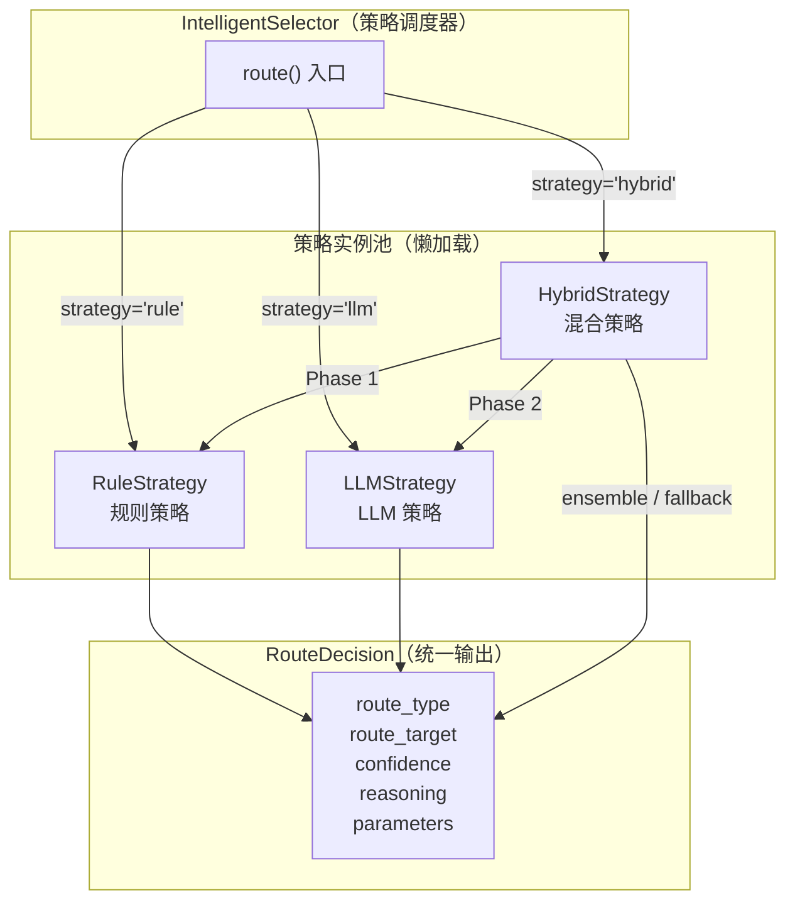
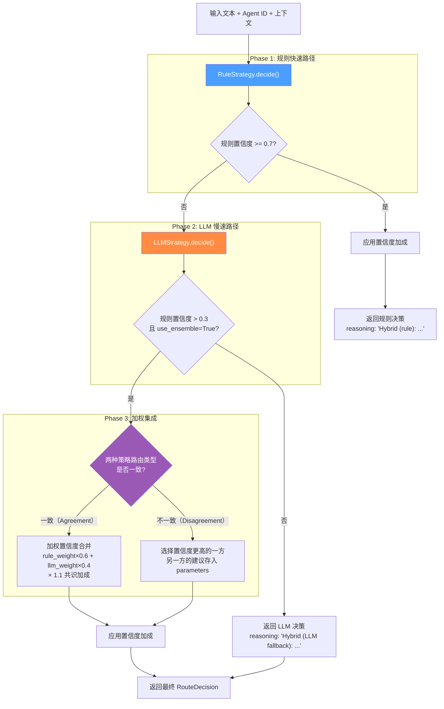

ResolveAgent 的智能选择器（Intelligent Selector）采用**策略模式**将请求路由到不同的处理子系统。系统内置三种可插拔路由策略——**规则策略**（RuleStrategy）、**LLM 策略**（LLMStrategy）和**混合策略**（HybridStrategy）——它们共享统一的 `decide()` 接口，各自在速度、准确性与灵活性之间做出不同的权衡。本文将从架构设计、内部实现、置信度计算、配置调参与适用场景等维度逐一剖析每种策略的工作机制，帮助高级开发者在实际项目中做出正确的策略选择与参数调优。

Sources: [strategies/__init__.py](python/src/resolveagent/selector/strategies/__init__.py#L1-L37), [selector.py](python/src/resolveagent/selector/selector.py#L80-L111)

## 策略架构总览

三种策略的设计遵循**统一接口、分层组合**的原则。每种策略均实现 `async def decide(input_text, agent_id, context) -> RouteDecision` 这一标准签名，使得 `IntelligentSelector` 可以通过配置字符串（`"rule"` / `"llm"` / `"hybrid"`）在运行时动态切换策略，而无需修改调用方代码。**混合策略**在内部组合了规则策略和 LLM 策略的实例，通过多阶段决策流水线实现两者的优势互补——这是系统的默认推荐策略。

Sources: [selector.py](python/src/resolveagent/selector/selector.py#L113-L142), [hybrid_strategy.py](python/src/resolveagent/selector/strategies/hybrid_strategy.py#L41-L67)

下面的 Mermaid 图展示了三种策略的组成关系与数据流：



**RouteDecision** 是所有策略共用的 Pydantic 输出模型，其字段定义如下：

| 字段 | 类型 | 说明 |
|------|------|------|
| `route_type` | `str` | 路由目标类型：`workflow`、`skill`、`rag`、`code_analysis`、`direct`、`multi` |
| `route_target` | `str` | 路由类型内的具体目标（如 `"web-search"`、`"static-analysis"`） |
| `confidence` | `float` | 置信度评分，范围 `[0.0, 1.0]`，取自 Pydantic `Field(ge=0.0, le=1.0)` |
| `parameters` | `dict` | 附加路由参数，如匹配到的模式列表、LLM 原始响应等 |
| `reasoning` | `str` | 人类可读的决策解释 |
| `chain` | `list[RouteDecision]` | 多路由场景下的有序子决策链 |

Sources: [selector.py](python/src/resolveagent/selector/selector.py#L20-L78)

## 规则策略：确定性模式匹配

### 设计哲学

**规则策略**（RuleStrategy）追求的是**零延迟、完全确定性**的路由决策。它通过预编译正则表达式对用户输入进行层级式模式匹配，从最具体的规则开始逐步降级，在毫秒级时间内返回可审计的路由结果。该策略不调用任何 LLM，因此没有网络延迟、API 成本和输出不确定性。

Sources: [rule_strategy.py](python/src/resolveagent/selector/strategies/rule_strategy.py#L28-L41)

### 路由规则清单

规则策略维护一个按**特异性从高到低**排列的 `ROUTING_RULES` 静态列表，每条规则以 `RoutingRule` 数据类表示：

```python
@dataclass
class RoutingRule:
    route_type: str          # 路由类型
    patterns: list[str]      # 正则表达式列表
    target: str = ""         # 具体目标
    confidence: float = 0.8  # 规则默认置信度
    description: str = ""    # 规则描述
```

系统内置了 **10 条路由规则**，覆盖四大领域：

| 优先级 | route_type | route_target | 默认置信度 | 规则描述 |
|--------|-----------|-------------|-----------|---------|
| 1 | `code_analysis` | `static-analysis` | 0.85 | 代码分析与审查请求（含代码块、AST、安全扫描等 8 条模式） |
| 2 | `code_analysis` | `code-exec` | 0.75 | 代码片段执行（匹配 Python/JS/Go/Java 函数定义） |
| 3 | `fta` | `incident-diagnosis` | 0.85 | 复杂诊断工作流（根因分析、故障树、事件调查） |
| 4 | `skill` | `web-search` | 0.90 | Web 搜索请求 |
| 5 | `skill` | `code-exec` | 0.85 | 代码执行请求 |
| 6 | `skill` | `file-ops` | 0.85 | 文件系统操作 |
| 7 | `skill` | `api-call` | 0.85 | API 调用请求 |
| 8 | `skill` | `calculator` | 0.75 | 计算与数据转换 |
| 9 | `rag` | `product-docs` | 0.70 | 文档与知识查询 |
| 10 | `rag` | `runbooks` | 0.75 | 运维 Runbook 查询 |
| 11 | `rag` | `incident-history` | 0.80 | 历史事件查询 |

Sources: [rule_strategy.py](python/src/resolveagent/selector/strategies/rule_strategy.py#L44-L180)

### 评分算法

规则策略的 `decide()` 方法在初始化时将所有正则表达式预编译为 `re.Pattern` 对象（带有 `IGNORECASE | MULTILINE` 标志），运行时的评分逻辑如下：

1. **遍历所有规则**：对每条规则，统计有多少个正则模式成功匹配输入文本。
2. **计算原始评分**：`score = (match_count / total_patterns) × rule.confidence`。这意味着一条规则的模式匹配比例越高，其评分越接近规则自身的默认置信度。
3. **应用微幅加成**：最终置信度为 `min(score + 0.1, 1.0)`，给予匹配规则轻微的置信度提升。
4. **选择最佳匹配**：保留评分最高的规则作为 `best_match`，但仅在 `confidence >= 0.6` 时才返回。
5. **代码块兜底**：如果所有规则均未产生高置信度匹配，但输入中包含 Markdown 代码块或连续两行以上的代码语句，则兜底路由到 `code_analysis / static-analysis`（置信度 0.75）。
6. **最终兜底**：若以上均未命中，返回 `direct` 路由，置信度仅 0.3，附带已尝试匹配的路由类型列表。

Sources: [rule_strategy.py](python/src/resolveagent/selector/strategies/rule_strategy.py#L182-L281)

### 代码块检测的辅助机制

规则策略包含一个独立的 `_contains_code_block()` 检测方法，它不依赖路由规则的正则列表，而是从两个维度检测代码内容：

- **Markdown 代码块**：匹配 `` ```...``` `` 格式。
- **代码行计数**：当输入文本中出现 `def`、`class`、`function`、`import`、`func`、`package` 等关键字开头的行达到 **≥ 2 行**时，判定为代码内容。

这一机制作为规则匹配失败后的**二级兜底**，确保含有代码的请求不会意外流向 `direct` 通道。

Sources: [rule_strategy.py](python/src/resolveagent/selector/strategies/rule_strategy.py#L257-L267)

### 自省能力

规则策略提供 `get_rules_summary()` 方法，返回所有路由规则的摘要信息（route_type、target、description、pattern_count、default_confidence），便于管理面板或调试工具展示当前生效的规则集。

Sources: [rule_strategy.py](python/src/resolveagent/selector/strategies/rule_strategy.py#L269-L281)

## LLM 策略：语义级智能分类

### 设计哲学

**LLM 策略**（LLMStrategy）将路由问题转化为一个**结构化 JSON 分类任务**交给大语言模型完成。它通过精心设计的 Prompt 向 LLM 呈现所有可用路由类型的详细定义、示例与上下文信息，让模型基于语义理解做出路由判断。该策略的核心优势在于处理**开放性、模糊性、多意图**的复杂请求——这是纯模式匹配无法覆盖的场景。

Sources: [llm_strategy.py](python/src/resolveagent/selector/strategies/llm_strategy.py#L19-L34)

### Prompt 工程

LLM 策略使用一段约 100 行的结构化 Prompt（`ROUTING_PROMPT`），其架构分为四个层次：

**第一层：可用路由定义**——Prompt 中明确定义了 5 种路由类型及其适用场景：

| 路由类型 | 适用场景 | 示例 |
|---------|---------|------|
| `workflow` | 多步骤诊断、FTA、根因分析、事件排查 | "Why is the service down?" |
| `skill` | 工具执行（搜索、代码运行、文件操作）、API 调用 | "Search the web for Python best practices" |
| `rag` | 知识库查询、文档搜索、"What is..." 类问题 | "What is the deployment process?" |
| `code_analysis` | 代码审查、Bug 检测、安全扫描、AST 解析 | "Review this code" |
| `direct` | 日常对话、简单问题、创作任务 | "Hello" |

**第二层：上下文注入**——`{context}` 占位符在运行时被 `_format_context()` 方法替换为实际的环境信息，包括可用 Skills（最多 5 个）、活跃 Workflows（最多 5 个）、RAG 知识库集合（最多 5 个）、以及检测到的代码语言与潜在问题。

**第三层：用户请求**——`{input}` 占位符承载原始用户输入。

**第四层：输出约束**——要求 LLM 仅返回一个 JSON 对象，包含 `route_type`、`route_target`、`confidence`（0.0-1.0）和 `reasoning` 四个字段，并附带多条分类优先级指引（如"存在代码块时优先考虑 code_analysis"、"why/how failed 问题走 workflow"）。

Sources: [llm_strategy.py](python/src/resolveagent/selector/strategies/llm_strategy.py#L37-L119)

### LLM 调用链

`_call_llm()` 方法通过 `resolveagent.llm.higress_provider.create_llm_provider()` 创建 LLM 提供者实例，并使用以下参数发起调用：

| 参数 | 值 | 设计意图 |
|------|---|---------|
| `temperature` | `0.3` | 偏向确定性输出，避免路由结果随机波动 |
| `max_tokens` | `500` | 路由决策 JSON 体量很小，500 token 足够 |
| `thinking` | `{"type": "disabled"}` | 禁用推理链，确保输出是干净的 JSON 而非混合推理文本 |

Sources: [llm_strategy.py](python/src/resolveagent/selector/strategies/llm_strategy.py#L207-L235)

### 响应解析与校验

LLM 返回的文本经过 `_parse_llm_response()` 解析，该方法的容错设计包括：

1. **JSON 提取**：使用正则 `\{[^{}]*\}` 从响应中提取 JSON 对象，即使 LLM 在 JSON 外包裹了额外文本也能正确解析。
2. **路由类型校验**：将 `route_type` 与合法值列表 `["workflow", "skill", "rag", "code_analysis", "direct", "fta"]` 比对，不合法则降级为 `direct` 并将置信度重置为 0.5。
3. **FTA 归一化**：将 `fta` 统一映射为 `workflow`，保持路由类型的一致性。
4. **置信度裁剪**：通过 `min(max(confidence, 0.0), 1.0)` 确保值始终在合法范围内。

Sources: [llm_strategy.py](python/src/resolveagent/selector/strategies/llm_strategy.py#L343-L378)

### 多层降级机制

当 LLM 调用失败时（网络错误、超时、API 异常等），LLM 策略提供了**三层降级**保障：

**第一层：模拟响应**（`_simulate_llm_response()`）——基于关键词的启发式分类。该方法按优先级检测输入中的关键词：代码块 + 分析类关键词 → `code_analysis`；诊断/根因关键词 → `workflow`；搜索/执行关键词 → `skill`；what/how/explain 关键词 → `rag`；以上均不匹配 → `direct`（置信度 0.6）。

**第二层：启发式兜底**（`_fallback_decision()`）——当 JSON 解析也失败时启用。仅检查两个最简单的信号：输入中是否包含 `` ``` ``（代码块标记）→ 路由到 `code_analysis`（置信度 0.6）；输入中是否包含 `?`（问号）→ 路由到 `rag`（置信度 0.5）。

**第三层：最终兜底**——返回 `direct` 路由（置信度 0.5），附带错误原因说明。

Sources: [llm_strategy.py](python/src/resolveagent/selector/strategies/llm_strategy.py#L380-L407)

## 混合策略：三阶段决策流水线

### 设计哲学

**混合策略**（HybridStrategy）是系统的**默认推荐策略**，它将规则策略的速度优势与 LLM 策略的语义理解能力通过三阶段流水线组合在一起。核心思想是**快路径优先、慢路径兜底、共识加权增强**——高置信度的规则匹配可以零延迟返回，而模糊请求则借助于 LLM 的语义能力获得准确路由。

Sources: [hybrid_strategy.py](python/src/resolveagent/selector/strategies/hybrid_strategy.py#L41-L67)

### 配置参数

混合策略的行为由 `HybridConfig` 数据类控制，所有参数均有合理的默认值：

| 参数 | 默认值 | 说明 |
|------|-------|------|
| `rule_confidence_threshold` | `0.7` | 规则匹配置信度达到此阈值时直接返回（快速路径） |
| `llm_confidence_threshold` | `0.6` | LLM 分类的最低可接受置信度 |
| `use_ensemble` | `True` | 是否在两种策略均有输出时使用加权集成 |
| `rule_weight` | `0.6` | 集成时规则策略的权重 |
| `llm_weight` | `0.4` | 集成时 LLM 策略的权重 |
| `code_boost` | `0.1` | 检测到代码块时对 `code_analysis` 路由的额外加成 |
| `per_route_boosts` | `{}` | 按路由类型的可配置额外置信度加成，如 `{"workflow": 0.05}` |

注意 `rule_weight` + `llm_weight` = 1.0 的设计约定：规则策略在集成中被赋予更高的权重（60%），因为其匹配结果具有确定性，而 LLM 输出存在随机性。

Sources: [hybrid_strategy.py](python/src/resolveagent/selector/strategies/hybrid_strategy.py#L22-L38)

### 三阶段决策流程



**Phase 1 — 规则快速路径**：直接调用 `RuleStrategy.decide()`，如果返回的置信度 ≥ `rule_confidence_threshold`（默认 0.7），立即附加加成后返回。reasoning 前缀标记为 `"Hybrid (rule):"`。这意味着对于明确的代码审查、Web 搜索、文件操作等请求，**永远不会产生 LLM 调用**。

**Phase 2 — LLM 慢速路径**：当规则匹配置信度不足时，调用 `LLMStrategy.decide()` 进行语义分类。如果规则置信度 ≤ 0.3 或 `use_ensemble=False`，则直接采用 LLM 的结果，reasoning 前缀标记为 `"Hybrid (LLM fallback):"`。

**Phase 3 — 加权集成**：当规则置信度在 0.3 ~ 0.7 之间且 `use_ensemble=True` 时，进入集成决策逻辑。

Sources: [hybrid_strategy.py](python/src/resolveagent/selector/strategies/hybrid_strategy.py#L79-L130)

### 集成决策的两种情况

集成逻辑（`_ensemble_decision()`）根据两种策略的路由类型是否一致分为两条路径：

**一致路径**：当 `rule_decision.route_type == llm_decision.route_type` 时，说明两种独立方法对路由方向达成共识，此时：
- 合并置信度：`combined = rule_confidence × 0.6 + llm_confidence × 0.4`
- 应用共识加成：`final_confidence = min(combined × 1.1, 1.0)`，即额外提升 10%
- `route_target` 取置信度较高一方的值
- `parameters` 中记录 `ensemble=True` 以及两种策略各自的置信度

**不一致路径**：当两种策略选择了不同的路由类型时：
- 直接比较置信度，选择较高者作为最终决策
- 将另一方的路由类型建议存入 `parameters`（键为 `"llm_suggestion"` 或 `"rule_suggestion"`），便于后续审计和分析
- reasoning 中标注为 `"Hybrid (rule preferred):"` 或 `"Hybrid (LLM preferred):"` 并附上双方的置信度对比

Sources: [hybrid_strategy.py](python/src/resolveagent/selector/strategies/hybrid_strategy.py#L132-L187)

### 置信度加成机制

混合策略在最终返回前统一调用 `_apply_boosts()` 对决策进行后处理，加成逻辑如下：

| 触发条件 | 加成幅度 | 影响的路由类型 |
|---------|---------|-------------|
| 上下文中检测到代码块（`code_context.has_code_blocks`） | +0.1 | `code_analysis` |
| 代码复杂度标记为 `high` | +0.05 | `code_analysis` |
| 输入包含 `diagnose`、`root cause`、`troubleshoot` 关键词 | +0.05 | `workflow` |
| 对话历史超过 3 条 | +0.03 | `rag` |
| `per_route_boosts` 配置的自定义值 | 可配置 | 任意 |

所有加成均通过 `min(confidence + boost, 1.0)` 确保不超过上限。

Sources: [hybrid_strategy.py](python/src/resolveagent/selector/strategies/hybrid_strategy.py#L189-L223)

## 策略选择与配置

### 运行时策略选择

策略的选择通过 `IntelligentSelector` 构造函数的 `strategy` 参数控制。该参数接受三种合法值，非法值会自动降级为 `"hybrid"`：

```python
# 默认混合策略
selector = IntelligentSelector()

# 显式指定纯规则策略
selector = IntelligentSelector(strategy="rule")

# 显式指定纯 LLM 策略
selector = IntelligentSelector(strategy="llm")
```

在运行时配置文件 `configs/runtime.yaml` 中，默认策略通过 `selector.default_strategy` 字段指定：

```yaml
selector:
  default_strategy: "hybrid"
  confidence_threshold: 0.7
```

Sources: [selector.py](python/src/resolveagent/selector/selector.py#L115-L156), [runtime.yaml](configs/runtime.yaml#L11-L13)

### 策略实例的懒加载机制

`IntelligentSelector` 使用**懒加载**模式管理策略实例。`_get_strategy(name)` 方法在首次访问时才创建对应的策略对象，后续调用直接复用缓存实例。这一设计避免了在 Selector 初始化阶段触发不必要的正则编译或 LLM 客户端创建：

```python
def _get_strategy(self, name: str) -> Any:
    if name not in self._strategy_instances:
        if name == "llm":
            self._strategy_instances[name] = LLMStrategy()
        elif name == "rule":
            self._strategy_instances[name] = RuleStrategy()
        elif name == "hybrid":
            self._strategy_instances[name] = HybridStrategy()
    return self._strategy_instances[name]
```

Sources: [selector.py](python/src/resolveagent/selector/selector.py#L256-L271)

### 决策缓存

所有策略的路由结果均经过 TTL-aware LRU 缓存。缓存键由 `SHA-256( input_text | agent_id | strategy )` 生成，确保相同输入在同一策略下命中缓存。缓存支持两种作用域：

- **instance**（默认）：每个 `IntelligentSelector` 实例拥有独立缓存。
- **global**：模块级单例缓存，跨实例共享。

默认配置为 `max_size=1000`、`ttl_seconds=300`（5 分钟过期），可通过构造函数参数调整。调用 `route()` 时传入 `bypass_cache=True` 可跳过缓存强制重新计算。

Sources: [cache.py](python/src/resolveagent/selector/cache.py#L20-L97), [selector.py](python/src/resolveagent/selector/selector.py#L158-L211)

## 三种策略的对比分析

| 维度 | 规则策略 | LLM 策略 | 混合策略 |
|------|---------|---------|---------|
| **延迟** | < 1ms（纯内存正则匹配） | 200-2000ms（取决于 LLM 响应） | 规则命中时 < 1ms；需 LLM 时 200-2000ms |
| **准确性** | 高（已知模式）；低（模糊请求） | 中-高（依赖 Prompt 质量与模型能力） | 最高（双重验证 + 集成加成） |
| **成本** | 零 | 每次 LLM API 调用 | 仅在规则未命中时产生 LLM 成本 |
| **可审计性** | 完全透明（模式 + 评分公式） | 黑盒（LLM 决策推理） | 半透明（reasoning 标注决策来源） |
| **可扩展性** | 需手动添加正则规则 | 自适应新意图 | 两者兼备 |
| **确定性** | 100%（相同输入相同输出） | 非确定性（temperature > 0） | 规则命中时确定；LLM 路径不确定 |
| **适用场景** | 性能敏感的在线服务、合规审计 | 探索性分析、意图高度模糊 | **生产环境通用场景（推荐）** |

Sources: [rule_strategy.py](python/src/resolveagent/selector/strategies/rule_strategy.py#L28-L41), [llm_strategy.py](python/src/resolveagent/selector/strategies/llm_strategy.py#L19-L34), [hybrid_strategy.py](python/src/resolveagent/selector/strategies/hybrid_strategy.py#L41-L67)

## 实际调参建议

**降低规则阈值以增加 LLM 使用率**：如果发现规则策略误路由比例较高（例如用户经常使用非标准表述），可将 `rule_confidence_threshold` 从 0.7 提高到 0.85，使更多请求进入 LLM 分类路径。

**调整集成权重**：默认 `rule_weight=0.6` 偏向确定性输出。如果你的 LLM 模型经过微调、路由准确率很高，可以将权重调整为 `rule_weight=0.4, llm_weight=0.6` 以更依赖语义理解。

**禁用集成**：在低延迟要求场景下，设置 `use_ensemble=False` 可以跳过 Phase 3 的集成计算，直接采用 LLM 结果（仅在规则未命中时）。

**路由类型定制加成**：通过 `per_route_boosts` 为特定路由类型添加额外置信度。例如，如果你的系统以故障诊断为主业务，可配置 `per_route_boosts={"workflow": 0.08}` 提升诊断类请求的路由优先级。

Sources: [hybrid_strategy.py](python/src/resolveagent/selector/strategies/hybrid_strategy.py#L225-L235)

## 延伸阅读

- 关于智能选择器的整体三阶段处理流程（意图分析 → 上下文丰富 → 路由决策），参见 [智能路由决策引擎：意图分析与三阶段处理流程](8-zhi-neng-lu-you-jue-ce-yin-qing-yi-tu-fen-xi-yu-san-jie-duan-chu-li-liu-cheng)
- 关于选择器如何通过 Hook 适配器与 Skill 适配器接入实际执行通道，参见 [选择器适配器：Hook 适配与 Skill 适配模式](10-xuan-ze-qi-gua-pei-qi-hook-gua-pei-yu-skill-gua-pei-mo-shi)
- 关于 LLM 提供者抽象层如何支撑策略中的模型调用，参见 [多模型统一接口：通义千问、文心一言、智谱清言与 OpenAI 兼容](27-duo-mo-xing-tong-jie-kou-tong-yi-qian-wen-wen-xin-yan-zhi-pu-qing-yan-yu-openai-jian-rong)