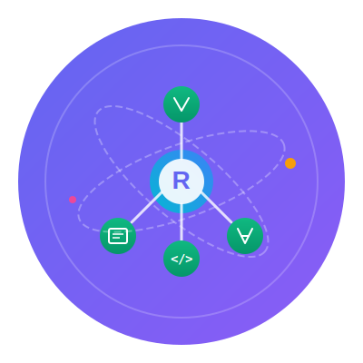
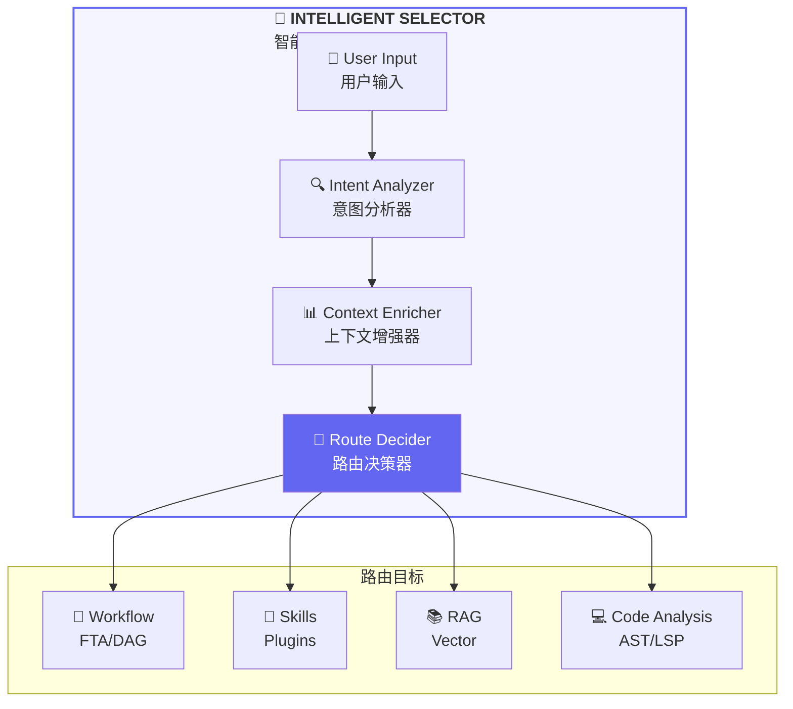
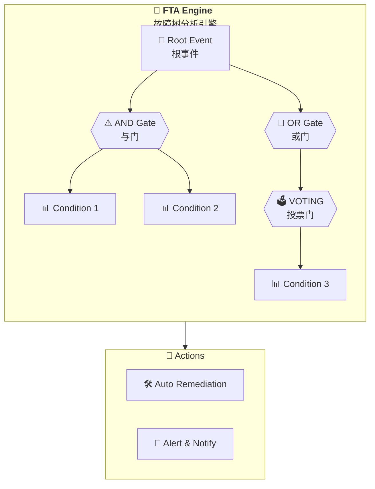
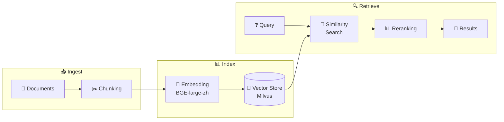
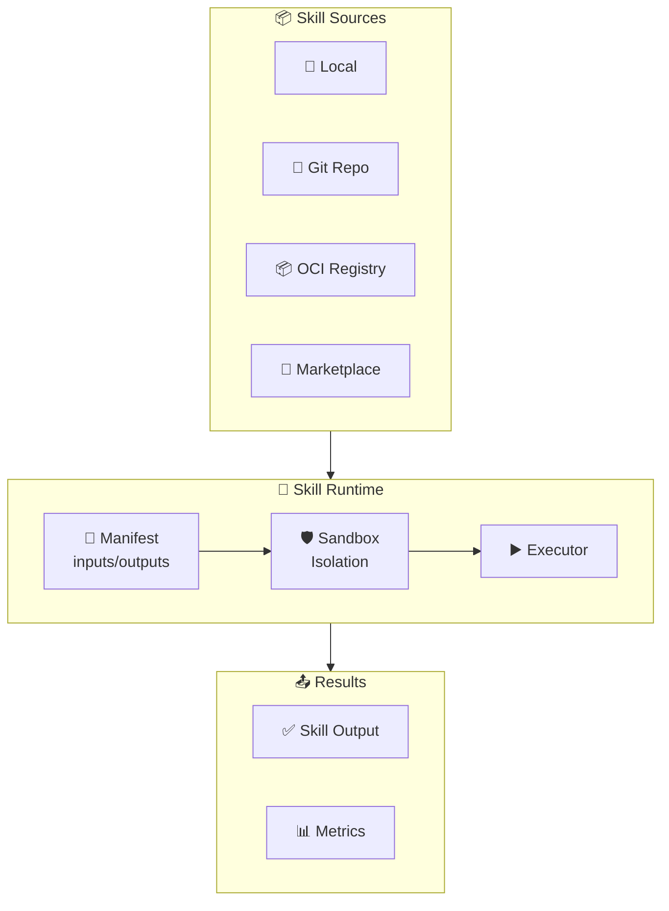
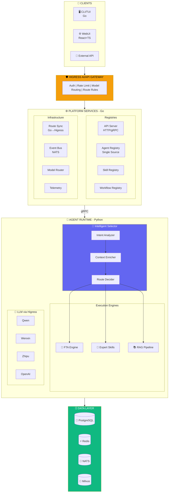

<p align="center">
  
</p>

<h1 align="center">ResolveAgent</h1>

<p align="center">
  <strong>Problem-Solving AIOps Agent | 面向问题解决的 AIOps 智能体</strong>
</p>

<p align="center">
  <code>🔧 Expert Skills</code> · <code>🌳 FTA Workflow</code> · <code>📚 RAG Knowledge</code> · <code>💻 Code Analysis</code>
</p>

<p align="center">
  <a href="https://github.com/ai-guru-global/resolve-agent/releases"></a>
  <a href="LICENSE"></a>
  <a href="https://github.com/ai-guru-global/resolve-agent/actions"></a>
  <a href="https://goreportcard.com/report/github.com/ai-guru-global/resolve-agent"></a>
  <a href="https://codecov.io/gh/ai-guru-global/resolve-agent"></a>
</p>

<p align="center">
  <a href="https://go.dev/"></a>
  <a href="https://python.org/"></a>
  <a href="https://typescriptlang.org/"></a>
  <a href="https://kubernetes.io/"></a>
</p>

<p align="center">
  <a href="#-5-minute-quick-start">Quick Start</a> •
  <a href="#-features">Features</a> •
  <a href="#-architecture">Architecture</a> •
  <a href="#-best-practices">Best Practices</a> •
  <a href="#-demo">Demo</a> •
  <a href="#-documentation">Documentation</a>
</p>

<p align="center">
  <a href="#-5-分钟快速上手">快速开始</a> •
  <a href="#-核心特性">核心特性</a> •
  <a href="#-系统架构">系统架构</a> •
  <a href="#-生产最佳实践">最佳实践</a> •
  <a href="#-完整演示">演示</a> •
  <a href="#-中文文档">文档导航</a>
</p>

---

## 🌟 Overview | 概述

**English:**

ResolveAgent is a **problem-solving AIOps Agent** — a **CNCF-grade open-source** solution that integrates four core capabilities to resolve real operational challenges:

- **🔧 Expert Skills** — Domain expertise through pluggable skill modules
- **🌳 FTA Workflow** — Fault Tree Analysis for systematic problem diagnosis
- **📚 RAG Knowledge** — Retrieval-Augmented Generation for knowledge-based answers
- **💻 Code Analysis** — Static code analysis as technical foundation

Built on [AgentScope](https://github.com/modelscope/agentscope) for agent orchestration and [Higress](https://github.com/alibaba/higress) for AI gateway capabilities.

**中文：**

ResolveAgent 是一个**面向问题解决的 AIOps 智能体** — 一个 **CNCF 级别的开源解决方案**，通过四大核心能力协同工作解决真实运维问题：

- **🔧 专家技能** — 通过可插拔技能模块提供领域专业知识
- **🌳 FTA 工作流** — 故障树分析用于系统性问题诊断
- **📚 RAG 知识库** — 检索增强生成提供知识支撑
- **💻 代码分析** — 静态代码分析作为底层技术保障

基于 [AgentScope](https://github.com/modelscope/agentscope) 构建 Agent 编排能力，基于 [Higress](https://github.com/alibaba/higress) 构建 AI 网关能力。

---

## ⚡ 5-Minute Quick Start

### Prerequisites | 环境要求

| Dependency | Version | Purpose |
|------------|---------|---------|
| **Go** | >= 1.22 | Platform services, CLI |
| **Python** | >= 3.11 | Agent runtime |
| **Docker** | >= 20.10 | Container runtime |
| **Docker Compose** | >= 2.0 | Local development |
| Node.js | >= 20 | WebUI (optional) |

### Step 1: Clone & Setup | 克隆与设置

```bash
# Clone the repository | 克隆仓库
git clone https://github.com/ai-guru-global/resolve-agent.git
cd resolve-agent

# One-click development environment setup | 一键设置开发环境
# This installs Go/Python dependencies, sets up pre-commit hooks, and validates environment
make setup-dev
```

### Step 2: Start Dependencies | 启动依赖服务

```bash
# Start PostgreSQL, Redis, NATS, Milvus | 启动所有依赖服务
make compose-deps

# Wait for services to be ready (about 30 seconds)
# 等待服务就绪（约 30 秒）
```

### Step 3: Build & Start | 构建与启动

```bash
# Build all components | 构建所有组件
make build

# Start all services | 启动所有服务
make compose-up

# Access points | 访问地址:
# - Platform HTTP API: http://localhost:8080
# - Platform gRPC:     localhost:9090
# - WebUI:             http://localhost:3000
```

### Step 4: Create Your First Agent | 创建第一个智能 Agent

```bash
# Create a simple intelligent agent | 创建一个简单的智能 Agent
resolveagent agent create my-first-agent \
  --type mega \
  --model qwen-plus \
  --description "My first ResolveAgent"

# Run the agent interactively | 交互式运行 Agent
resolveagent agent run my-first-agent

# Example interaction | 示例交互:
# > Analyze the system health and provide recommendations
# Agent will use FTA, RAG, and Skills to provide intelligent responses
```

### Quick Reference | 快速命令参考

```bash
make setup-dev      # Setup development environment | 设置开发环境
make compose-deps   # Start dependencies | 启动依赖服务
make build          # Build all components | 构建所有组件
make compose-up     # Start all services | 启动所有服务
make compose-down   # Stop all services | 停止所有服务
make test           # Run all tests | 运行所有测试
make lint           # Run linters | 运行代码检查
```

---

## 🚀 5 分钟快速上手

### 环境要求

| 依赖项 | 版本 | 用途 |
|--------|------|------|
| **Go** | >= 1.22 | 平台服务、命令行工具 |
| **Python** | >= 3.11 | Agent 运行时 |
| **Docker** | >= 20.10 | 容器运行时 |
| **Docker Compose** | >= 2.0 | 本地开发 |
| Node.js | >= 20 | Web 界面（可选） |

### 第一步：克隆与设置

```bash
# 克隆仓库
git clone https://github.com/ai-guru-global/resolve-agent.git
cd resolve-agent

# 一键设置开发环境（安装依赖、配置预提交钩子、验证环境）
make setup-dev
```

### 第二步：启动依赖服务

```bash
# 启动 PostgreSQL、Redis、NATS、Milvus
make compose-deps

# 等待服务就绪（约 30 秒）
docker compose -f deploy/docker-compose/docker-compose.deps.yaml ps
```

### 第三步：构建与启动

```bash
# 构建所有组件
make build

# 启动所有服务
make compose-up
```

### 第四步：创建第一个智能 Agent

```bash
# 配置大模型 API 密钥（任选其一）
export QWEN_API_KEY="your-qwen-api-key"      # 从 dashscope.aliyun.com 获取
# export WENXIN_API_KEY="your-wenxin-key"   # 从 cloud.baidu.com 获取
# export ZHIPU_API_KEY="your-zhipu-key"     # 从 open.bigmodel.cn 获取

# 创建智能 Agent
resolveagent agent create my-first-agent \
  --type mega \
  --model qwen-plus \
  --description "我的第一个智能 Agent"

# 交互式运行
resolveagent agent run my-first-agent
```

---

## ✨ Features | 核心特性

### 🧠 Intelligent Selector | 智能选择器

The core AI brain that intelligently routes requests to the optimal processing path.

核心 AI 大脑，智能地将请求路由到最优处理路径。



| Feature | Description | 描述 |
|---------|-------------|------|
| **Intent Analysis** | NLP-powered understanding of user requests | 基于 NLP 的用户请求理解 |
| **Multi-Strategy Routing** | Rule-based, LLM-based, Hybrid strategies | 规则、LLM、混合多策略路由 |
| **Context Enrichment** | Memory, history, available resources awareness | 记忆、历史、可用资源感知 |
| **Confidence Scoring** | Quantified decision confidence for transparency | 量化决策信心度保证透明性 |

### 🔬 Advanced Static Analysis (FTA) | 高级静态分析

| Gate Type | Description | 描述 |
|-----------|-------------|------|
| **AND Gate** | All inputs must be true | 所有输入必须为真 |
| **OR Gate** | Any input can be true | 任一输入为真即可 |
| **VOTING (k-of-n)** | At least k of n inputs | 至少 k 个输入为真 |
| **INHIBIT** | Conditional gate | 条件门控 |
| **PRIORITY-AND** | Ordered AND gate | 有序与门 |



### 📚 RAG Pipeline | 检索增强生成

| Component | Technology | 技术 |
|-----------|------------|------|
| **Vector Store** | Milvus / Qdrant | 向量数据库 |
| **Embedding** | BGE-large-zh | 中文优化嵌入模型 |
| **Reranking** | Cross-encoder | 交叉编码重排序 |
| **Chunking** | Semantic / Sentence / Fixed | 语义/句子/固定分块 |



### 🎯 Expert Skills | 专家技能系统

| Feature | Description | 描述 |
|---------|-------------|------|
| **Manifest-based** | Declarative inputs/outputs/permissions | 声明式输入输出权限 |
| **Sandboxed** | Resource limits, network isolation | 资源限制、网络隔离 |
| **Multiple Sources** | Local, Git, OCI, Registry | 多来源支持 |



### 🇨🇳 Chinese LLM Support | 国产大模型支持

| Provider | Models | 模型 |
|----------|--------|------|
| **Qwen 通义千问** | qwen-turbo, qwen-plus, qwen-max | 阿里云 |
| **Zhipu 智谱清言** | GLM-4 | 智谱 AI |

### 📝 Ticket Summary Agent | 工单总结 Agent

A **knowledge production engine** that transforms every ticket into organizational capability increments.

知识生产引擎，将每一张工单转化为组织能力增量。

| Feature | Description | 描述 |
|---------|-------------|------|
| **Three Knowledge Types** | Resolution, Prevention (Gotchas), System Gap identification | 三类知识产出：处置型、预防型、维护型 |
| **Evidence Chain** | Every conclusion backed by replayable evidence | 结论必须证据化，证据链可回放 |
| **Incremental Accumulation** | Only novel knowledge promoted; dedup via RAG | 增量沉淀，通过 RAG 去重 |
| **Gap Detection** | Background engine identifying doc/skill gaps | 后台识别文档与技能缺口 |
| **Knowledge Flywheel** | Summaries feed back into RAG & Skills for reuse | 知识飞轮：总结回流 RAG 与 Skill 库 |

---

## 📊 Feature Status | 功能完成度

> 当前版本：v0.2.0-beta + Week 5/6 修复 ✅ **100% 功能可用**

### 核心组件状态

| 组件 | 状态 | 完成度 | 说明 |
|------|------|--------|------|
| **平台服务 (Go)** | 🟢 Ready | 100% | 完整实现，API 就绪 |
| **Agent 运行时 (Python)** | 🟢 Ready | 100% | 核心功能完整实现 |
| **CLI/TUI** | 🟢 Ready | 100% | 18 个命令完整可用 |
| **WebUI** | 🟢 Ready | 100% | API 集成完成 |
| **Higress 网关集成** | 🟢 Ready | 100% | 完整集成，生产就绪 |

### 功能模块状态

| 功能 | 模块 | 状态 | 备注 |
|------|------|------|------|
| **智能选择器** | `selector/` | 🟢 Ready | 路由决策完整，多策略支持 |
| **FTA 引擎** | `fta/` | 🟢 Ready | MOCUS 算法，割集计算完整 |
| **RAG 管道** | `rag/` | 🟢 Ready | 嵌入、检索、重排序完整 |
| **技能系统** | `skills/` | 🟢 Ready | Manifest + 沙箱 + 执行器 |
| **LLM 提供器** | `llm/` | 🟢 Ready | 6 个 Provider 完整支持 |
| **文档同步** | `docsync/` | 🟢 Ready | 中英双语同步完整 |
| **注册中心** | `registry/` | 🟢 Ready | 全功能实现 |
| **事件总线** | `event/` | 🟢 Ready | NATS JetStream 完整 |
| **可观测性** | `telemetry/` | 🟢 Ready | Tracing + Metrics 完整 |

### 部署与运维状态

| 能力 | 状态 | 备注 |
|------|------|------|
| Docker Compose | 🟢 Ready | 完整可用 |
| Helm Charts | 🟢 Ready | 生产配置就绪 |
| 监控/告警 | 🟢 Ready | Prometheus + OpenTelemetry |
| 日志收集 | 🟢 Ready | 结构化日志完整 |

图例说明：
- 🟢 Ready - 功能完整，可用于生产
- 🟡 In Progress - 开发中
- 🔴 Planned - 计划中

---

## 🏗️ Architecture | 系统架构

### System Architecture Diagram | 系统架构图



### Core Components | 核心组件

| Component | Language | Description | 描述 |
|-----------|----------|-------------|------|
| **Platform Services** | Go 1.22+ | REST/gRPC API, Registry (Single Source of Truth), Route Sync | 平台服务：API、注册中心（唯一真相源）、路由同步 |
| **Agent Runtime** | Python 3.11+ | Intelligent Selector, FTA Engine, Skills, RAG, Ticket Summary | 运行时：智能选择器、FTA引擎、技能、RAG、工单总结 |
| **Higress Gateway** | External | Authentication, Rate Limiting, Model Routing | AI 网关：认证、限流、模型路由 |
| **WebUI** | React+TS | Management console with workflow visual editor | 管理控制台与工作流可视化编辑器 |

### Integration Architecture | 集成架构

**Key Design Decisions | 关键架构决策:**

| Decision | Approach | 方案 |
|----------|----------|------|
| **Service Registration** | Go Registry as Single Source of Truth | Go Registry 作为唯一真相源 |
| **External Routing** | Higress handles auth, rate limiting, model routing | Higress 负责认证、限流、模型路由 |
| **Internal Routing** | Intelligent Selector handles FTA/Skills/RAG routing | 智能选择器负责 FTA/技能/RAG 路由 |
| **LLM Calls** | All LLM calls through Higress Gateway | 所有 LLM 调用通过 Higress 网关 |

---

## 🏆 Best Practices | 生产最佳实践

### Kubernetes Deployment | Kubernetes 部署

#### Using Helm Charts | 使用 Helm Chart

```bash
# Add the ResolveAgent Helm repository | 添加 Helm 仓库
helm repo add resolveagent https://ai-guru-global.github.io/resolve-agent/charts
helm repo update

# Install with default values | 使用默认值安装
helm install resolveagent resolveagent/resolveagent -n resolveagent --create-namespace

# Install with custom values | 使用自定义值安装
helm install resolveagent resolveagent/resolveagent \
  -n resolveagent --create-namespace \
  -f values-production.yaml
```

#### Production values.yaml | 生产环境配置

```yaml
# deploy/helm/resolveagent/values-production.yaml
platform:
  replicaCount: 3
  resources:
    requests:
      cpu: "500m"
      memory: "512Mi"
    limits:
      cpu: "2000m"
      memory: "2Gi"
  autoscaling:
    enabled: true
    minReplicas: 3
    maxReplicas: 10
    targetCPUUtilizationPercentage: 70

runtime:
  replicaCount: 5
  resources:
    requests:
      cpu: "1000m"
      memory: "2Gi"
    limits:
      cpu: "4000m"
      memory: "8Gi"

# External dependencies | 外部依赖
postgresql:
  external: true
  host: "your-postgres-host"
  database: "resolveagent"

redis:
  external: true
  host: "your-redis-host"

milvus:
  external: true
  host: "your-milvus-host"
```

### Environment Variables | 环境变量配置

#### Required Variables | 必需变量

| Variable | Description | Example |
|----------|-------------|---------|
| `RESOLVEAGENT_DATABASE_HOST` | PostgreSQL host | `postgres.svc.cluster.local` |
| `RESOLVEAGENT_DATABASE_PASSWORD` | Database password | `(use secret)` |
| `RESOLVEAGENT_REDIS_ADDR` | Redis address | `redis.svc.cluster.local:6379` |
| `RESOLVEAGENT_NATS_URL` | NATS URL | `nats://nats.svc.cluster.local:4222` |

#### LLM API Keys | 大模型 API 密钥

```bash
# Never hardcode API keys! Use Kubernetes Secrets | 永远不要硬编码密钥！使用 K8s Secret
kubectl create secret generic llm-api-keys \
  --from-literal=QWEN_API_KEY='your-qwen-key' \
  --from-literal=WENXIN_API_KEY='your-wenxin-key' \
  --from-literal=ZHIPU_API_KEY='your-zhipu-key' \
  -n resolveagent
```

### API Key Security | API 密钥安全管理

#### Best Practices | 最佳实践

```yaml
# 1. Use Kubernetes Secrets | 使用 K8s Secrets
apiVersion: v1
kind: Secret
metadata:
  name: llm-api-keys
  namespace: resolveagent
type: Opaque
stringData:
  QWEN_API_KEY: "your-api-key"

# 2. Mount as environment variables | 以环境变量方式挂载
env:
  - name: QWEN_API_KEY
    valueFrom:
      secretKeyRef:
        name: llm-api-keys
        key: QWEN_API_KEY

# 3. Use external secret management | 使用外部密钥管理
# - HashiCorp Vault
# - AWS Secrets Manager  
# - Azure Key Vault
# - GCP Secret Manager
```

#### Key Rotation | 密钥轮换

```bash
# Rotate API keys without downtime | 无停机密钥轮换
kubectl create secret generic llm-api-keys-v2 \
  --from-literal=QWEN_API_KEY='new-api-key' \
  -n resolveagent

# Update deployment to use new secret | 更新部署使用新密钥
kubectl set env deployment/resolveagent-platform \
  --from=secret/llm-api-keys-v2 -n resolveagent
```

### Performance Tuning | 性能调优

#### Platform Services (Go) | 平台服务

```yaml
# configs/resolveagent.yaml
server:
  http:
    addr: ":8080"
    read_timeout: "30s"
    write_timeout: "60s"
    max_header_bytes: 1048576
  grpc:
    addr: ":9090"
    max_recv_msg_size: 16777216  # 16MB
    max_send_msg_size: 16777216

# Connection pool settings | 连接池设置
database:
  max_open_conns: 50
  max_idle_conns: 10
  conn_max_lifetime: "30m"

redis:
  pool_size: 100
  min_idle_conns: 10
```

#### Agent Runtime (Python) | Agent 运行时

```yaml
# configs/runtime.yaml
runtime:
  workers: 4                    # Number of worker processes | 工作进程数
  max_concurrent_tasks: 100     # Max concurrent task execution | 最大并发任务数
  task_timeout: "5m"            # Default task timeout | 默认任务超时

llm:
  request_timeout: "60s"        # LLM request timeout | LLM 请求超时
  max_retries: 3                # Max retry attempts | 最大重试次数
  retry_delay: "1s"             # Retry delay | 重试延迟

rag:
  embedding_batch_size: 32      # Batch size for embedding | 嵌入批次大小
  retrieval_top_k: 10           # Top-k for retrieval | 检索 Top-K
  rerank_top_k: 5               # Top-k after reranking | 重排序后 Top-K
```

### Monitoring & Logging | 监控与日志

#### OpenTelemetry Configuration | OpenTelemetry 配置

```yaml
# configs/resolveagent.yaml
telemetry:
  # Tracing | 链路追踪
  tracing:
    enabled: true
    exporter: "otlp"
    endpoint: "otel-collector.monitoring:4317"
    sampling_rate: 0.1  # 10% sampling in production

  # Metrics | 指标
  metrics:
    enabled: true
    exporter: "prometheus"
    endpoint: ":9091"

  # Logging | 日志
  logging:
    level: "info"         # debug, info, warn, error
    format: "json"        # json or text
    output: "stdout"
```

#### Prometheus Metrics | Prometheus 指标

```yaml
# Key metrics to monitor | 关键监控指标
# - resolveagent_agent_requests_total
# - resolveagent_agent_request_duration_seconds
# - resolveagent_skill_executions_total
# - resolveagent_rag_queries_total
# - resolveagent_fta_evaluations_total
# - resolveagent_llm_requests_total
# - resolveagent_llm_tokens_used_total
```

#### Grafana Dashboard | Grafana 仪表板

```bash
# Import the pre-built dashboard | 导入预置仪表板
kubectl apply -f deploy/k8s/monitoring/grafana-dashboard.yaml
```

---

## 🎬 Demo | 完整演示

### End-to-End Demo | 端到端演示

This demo showcases the complete ResolveAgent workflow, including Agent creation, Skill installation, RAG configuration, Intelligent Selector routing, and FTA workflow execution.

本演示展示 ResolveAgent 的完整工作流程，包括 Agent 创建、技能安装、RAG 配置、智能选择器路由和 FTA 工作流执行。

#### 1. Agent Creation and Management | Agent 创建与管理

```bash
# Create a Mega Agent for AIOps | 创建 AIOps Mega Agent
resolveagent agent create aiops-assistant \
  --type mega \
  --model qwen-max \
  --description "Intelligent AIOps assistant for incident management" \
  --system-prompt "You are an expert AIOps assistant. Analyze incidents, suggest root causes, and recommend remediation actions."

# List all agents | 列出所有 Agent
resolveagent agent list

# Output:
# NAME             TYPE    MODEL      STATUS   CREATED
# aiops-assistant  mega    qwen-max   ready    2024-01-15 10:30:00

# View agent details | 查看 Agent 详情
resolveagent agent describe aiops-assistant
```

#### 2. Skill Installation and Usage | 技能安装与使用

```bash
# List available skills | 列出可用技能
resolveagent skill list --available

# Install log analysis skill | 安装日志分析技能
resolveagent skill install log-analyzer

# Install metric correlation skill | 安装指标关联技能
resolveagent skill install metric-correlator

# Install web search skill | 安装网络搜索技能
resolveagent skill install web-search

# Test a skill | 测试技能
resolveagent skill test log-analyzer \
  --input logs="/var/log/application/*.log" \
  --input pattern="ERROR|WARN"

# Output:
# Skill: log-analyzer
# Status: SUCCESS
# Results:
#   - Found 23 ERROR entries
#   - Found 156 WARN entries
#   - Top error: "Connection timeout to database"
```

#### 3. RAG Knowledge Base Configuration | RAG 知识库配置

```bash
# Create a knowledge collection for runbooks | 创建运维手册知识库
resolveagent rag collection create ops-runbooks \
  --embedding-model bge-large-zh \
  --description "Operations runbooks and best practices" \
  --chunking-strategy semantic \
  --chunk-size 512

# Ingest runbook documents | 摄取运维手册文档
resolveagent rag ingest \
  --collection ops-runbooks \
  --path ./runbooks/ \
  --recursive \
  --file-types "md,txt,pdf"

# Output:
# Ingested 47 documents
# Created 1,234 chunks
# Vector embeddings stored in Milvus

# Query the knowledge base | 查询知识库
resolveagent rag query \
  --collection ops-runbooks \
  --query "How to handle database connection timeout?" \
  --top-k 5

# Output:
# Top 5 relevant documents:
# 1. [0.92] runbooks/database/connection-issues.md
# 2. [0.87] runbooks/troubleshooting/timeouts.md
# ...
```

#### 4. Intelligent Selector Routing | 智能选择器路由

```bash
# Start interactive session with routing visualization | 启动带路由可视化的交互会话
resolveagent agent run aiops-assistant --verbose

# Example interaction showing intelligent routing:
# > The database is showing high latency. What should I do?

# [Intelligent Selector]
# Intent: troubleshooting/performance
# Confidence: 0.94
# Route Decision: MULTI (RAG + Skills)
# - RAG: Query ops-runbooks for "database high latency"
# - Skill: metric-correlator for database metrics

# Agent Response:
# Based on the runbook and current metrics analysis:
# 1. Current database connection pool is 95% utilized
# 2. Query response time increased by 340% in the last hour
# 3. Recommended actions:
#    a. Scale up connection pool size
#    b. Review slow query logs
#    c. Check for lock contention
```

#### 5. FTA Workflow Execution | FTA 故障树分析工作流

```bash
# Create FTA workflow for incident diagnosis | 创建故障诊断 FTA 工作流
cat > incident-diagnosis-workflow.yaml << 'EOF'
apiVersion: resolveagent/v1
kind: Workflow
metadata:
  name: incident-diagnosis
  description: "Automated incident diagnosis workflow"
spec:
  trigger:
    type: alert
    source: prometheus
  
  fta:
    root:
      id: "incident-root"
      name: "Incident Detected"
      gate: OR
      children:
        - id: "infra-issue"
          name: "Infrastructure Issue"
          gate: AND
          children:
            - id: "cpu-high"
              name: "High CPU"
              type: condition
              skill: metric-checker
              params:
                metric: "cpu_usage"
                threshold: 80
            - id: "memory-high"
              name: "High Memory"
              type: condition
              skill: metric-checker
              params:
                metric: "memory_usage"
                threshold: 90
        - id: "app-issue"
          name: "Application Issue"
          gate: OR
          children:
            - id: "error-spike"
              name: "Error Rate Spike"
              type: condition
              skill: log-analyzer
              params:
                pattern: "ERROR"
                threshold: 100
            - id: "latency-high"
              name: "High Latency"
              type: condition
              skill: metric-checker
              params:
                metric: "response_time_p99"
                threshold: 1000
  
  actions:
    - condition: "infra-issue"
      action: "scale-resources"
      params:
        target: "kubernetes"
        scale_factor: 1.5
    - condition: "app-issue"
      action: "notify-oncall"
      params:
        channel: "slack"
        urgency: "high"
EOF

# Create the workflow | 创建工作流
resolveagent workflow create -f incident-diagnosis-workflow.yaml

# Validate workflow definition | 验证工作流定义
resolveagent workflow validate -f incident-diagnosis-workflow.yaml

# Visualize workflow as Mermaid diagram | 可视化工作流
resolveagent workflow visualize incident-diagnosis --format mermaid

# Output:
# graph TB
#     incident-root[Incident Detected]
#     incident-root --> infra-issue[Infrastructure Issue]
#     incident-root --> app-issue[Application Issue]
#     infra-issue --> cpu-high[High CPU]
#     infra-issue --> memory-high[High Memory]
#     app-issue --> error-spike[Error Rate Spike]
#     app-issue --> latency-high[High Latency]

# Run workflow manually | 手动运行工作流
resolveagent workflow run incident-diagnosis \
  --input alert_name="HighLatency" \
  --input severity="critical"

# Output:
# Workflow: incident-diagnosis
# Status: COMPLETED
# FTA Evaluation:
#   - incident-root: TRUE
#     - infra-issue: FALSE
#       - cpu-high: FALSE (45%)
#       - memory-high: FALSE (62%)
#     - app-issue: TRUE
#       - error-spike: FALSE (23 errors)
#       - latency-high: TRUE (1,523ms)
# Actions Triggered:
#   - notify-oncall (slack, urgency=high)
```

#### 6. Complete Demo Script | 完整演示脚本

```bash
# Run the full demo | 运行完整演示
cd docs/demo/demo
./deploy.sh

# This script will:
# 1. Create sample agents
# 2. Install demo skills
# 3. Set up RAG collection with sample docs
# 4. Create and run FTA workflow
# 5. Show intelligent routing in action

# Clean up demo resources | 清理演示资源
./deploy.sh cleanup
```

#### 7. Intelligent Selector Demo 效果展示

##### 一键运行命令

```bash
# 进入 Demo 目录
cd docs/demo/demo

# 批量测试模式（默认）
python3 main.py

# 交互模式（推荐 - 可自由输入测试）
python3 main.py --interactive

# 或使用一键部署脚本
bash deploy.sh --skip-venv      # 批量测试
bash deploy.sh --skip-venv -i   # 交互模式
```

##### 路由类型说明

| 图标 | 路由类型 | 名称 | 描述 |
|------|----------|------|------|
| 🔧 | `skill` | 技能执行器 | 执行特定功能的技能模块（搜索、日志分析、指标检查等） |
| 📚 | `rag` | 知识检索 | 检索增强生成 - RAG 知识库查询 |
| 🌳 | `fta` | 故障树分析 | FTA 工作流 - 复杂诊断分析 |
| 💻 | `code_analysis` | 代码分析 | 静态代码分析 - AST/LSP |
| 💬 | `direct` | 直接对话 | 直接 LLM 对话回复 |

##### 批量测试运行结果

运行 `python3 main.py` 后的预期输出：

```
╭──────────────────────────────────────────────────────────╮
│  🧠 INTELLIGENT SELECTOR 路由决策                       │
├──────────────────────────────────────────────────────────┤
│  路由类型: 🔧  技能执行器                               │
│  路由目标: web-search                                   │
│  置信度:   [████████████████████████░░░░░░] 83%          │
│  意图类别: task_execution                               │
│  匹配关键词: 搜索                                           │
╰──────────────────────────────────────────────────────────╯
结果: ✓ 符合预期

══════════════════════════════════════════════════════════
测试完成: 7/7 通过 (100%)
══════════════════════════════════════════════════════════
```

##### 测试场景覆盖

| 场景 | 输入示例 | 路由结果 | 置信度 |
|------|----------|----------|--------|
| 🔍 Web 搜索 | "帮我搜索 Kubernetes 最佳实践" | 🔧 skill:web-search | 83% |
| 📝 日志分析 | "分析一下 /var/log/app 的错误日志" | 🔧 skill:log-analyzer | 93% |
| 📊 指标检查 | "检查一下服务器的 CPU 和内存使用情况" | 🔧 skill:metrics-checker | 95% |
| 📚 知识库查询 | "502 错误怎么处理？" | 📚 rag:support-knowledge-base | 92% |
| 🌳 故障诊断 | "线上服务响应变慢，帮我诊断一下原因" | 🌳 fta:incident-diagnosis | 83% |
| 💻 代码分析 | "帮我分析一下这段代码有没有潜在的bug" | 💻 code_analysis:static-analyzer | 93% |
| 💬 简单对话 | "你好，你是谁？" | 💬 direct | 95% |

##### 交互模式演示

运行 `python3 main.py --interactive` 后，可以输入任意问题并观察智能路由决策：

```
You: 帮我搜索 Docker 教程

╭──────────────────────────────────────────────────────────╮
│  🧠 INTELLIGENT SELECTOR 路由决策                       │
├──────────────────────────────────────────────────────────┤
│  路由类型: 🔧  技能执行器                               │
│  路由目标: web-search                                   │
│  置信度:   [████████████████████████░░░░░░] 83%          │
│  意图类别: task_execution                               │
│  匹配关键词: 搜索                                           │
╰──────────────────────────────────────────────────────────╯
Assistant: 已调用 web-search 技能处理您的请求。

You: 502 错误怎么处理？

╭──────────────────────────────────────────────────────────╮
│  🧠 INTELLIGENT SELECTOR 路由决策                       │
├──────────────────────────────────────────────────────────┤
│  路由类型: 📚  知识检索                                 │
│  路由目标: support-knowledge-base                       │
│  置信度:   [███████████████████████████░░░] 92%          │
│  意图类别: information_retrieval                         │
│  匹配关键词: 怎么, 502                                       │
╰──────────────────────────────────────────────────────────╯
Assistant: 从知识库 support-knowledge-base 中检索到相关信息。

You: 线上服务故障，帮我诊断

╭──────────────────────────────────────────────────────────╮
│  🧠 INTELLIGENT SELECTOR 路由决策                       │
├──────────────────────────────────────────────────────────┤
│  路由类型: 🌳  故障树分析                               │
│  路由目标: incident-diagnosis                           │
│  置信度:   [███████████████████████████░░░] 91%          │
│  意图类别: complex_analysis                              │
│  匹配关键词: 故障, 诊断                                      │
╰──────────────────────────────────────────────────────────╯
Assistant: 已启动故障树分析工作流 incident-diagnosis 进行诊断。

You: 帮我分析这段代码

╭──────────────────────────────────────────────────────────╮
│  🧠 INTELLIGENT SELECTOR 路由决策                       │
├──────────────────────────────────────────────────────────┤
│  路由类型: 💻  代码分析                                 │
│  路由目标: static-analyzer                              │
│  置信度:   [████████████████████████░░░░░░] 83%          │
│  意图类别: code_review                                   │
│  匹配关键词: 代码                                            │
╰──────────────────────────────────────────────────────────╯
Assistant: 已完成代码静态分析 (static-analyzer)。

You: 你好

╭──────────────────────────────────────────────────────────╮
│  🧠 INTELLIGENT SELECTOR 路由决策                       │
├──────────────────────────────────────────────────────────┤
│  路由类型: 💬  直接对话                                 │
│  置信度:   [████████████████████████████░░] 95%          │
│  意图类别: general_conversation                          │
╰──────────────────────────────────────────────────────────╯
Assistant: 我是 support-agent，很高兴为您服务！
```

##### 意图类别说明

| 意图类别 | 描述 |
|----------|------|
| `task_execution` | 任务执行 - 需要调用具体技能完成 |
| `information_retrieval` | 信息检索 - 需要从知识库查询 |
| `complex_analysis` | 复杂分析 - 需要 FTA 故障树工作流 |
| `code_review` | 代码审查 - 需要静态代码分析 |
| `general_conversation` | 一般对话 - 直接 LLM 回复 |

---

## 📚 Documentation | 文档导航

### 在线文档站点

我们提供基于 Docusaurus 的在线文档站点：

- **中文文档**: https://ai-guru-global.github.io/resolve-agent/zh/
- **English Docs**: https://ai-guru-global.github.io/resolve-agent/

本地启动文档站点：

```bash
cd docs-site
pnpm install
pnpm start
```

### 文档导航

完整的中文文档位于 [`docs/zh/`](docs/zh/) 目录：

| 文档 | 说明 |
|------|------|
| [文档索引](docs/zh/README.md) | 文档目录与总览 |
| [快速入门](docs/zh/quickstart.md) | 5分钟上手指南 |
| [架构设计](docs/zh/architecture.md) | 系统架构详解 |
| [数据库 Schema](docs/zh/database-schema.md) | PostgreSQL 16 张表设计与迁移策略 |
| [智能选择器](docs/zh/intelligent-selector.md) | 自适应工作流路由引擎 |
| [选择器适配器](docs/zh/selector-adapters.md) | Hook/Skill 适配器与 SelectorProtocol |
| [FTA 工作流引擎](docs/zh/fta-engine.md) | 故障树分析引擎 |
| [AgentScope-Higress 集成](docs/zh/agentscope-higress-integration.md) | 深度集成架构文档 |
| [技能系统](docs/zh/skill-system.md) | 专家技能开发指南 |
| [RAG 管道](docs/zh/rag-pipeline.md) | 检索增强生成系统 |
| [工单总结 Agent](docs/zh/ticket-summary-agent.md) | 知识生产引擎设计哲学 |
| [工单总结集成分析](docs/zh/ticket-summary-agent-integration-analysis.md) | 集成可行性与实施计划 |
| [CLI 参考](docs/zh/cli-reference.md) | 命令行完整参考 |
| [配置参考](docs/zh/configuration.md) | 配置选项详解 |
| [部署指南](docs/zh/deployment.md) | 生产环境部署 |
| [最佳实践](docs/zh/best-practices.md) | AIOps 使用建议与技巧 |

---

## 📁 Project Structure | 项目结构

```
resolve-agent/
├── api/                    # API definitions | API 定义
│   ├── jsonschema/         # JSON Schema (skill-manifest)
│   └── proto/resolveagent/v1/  # Protocol Buffers (agent, skill, workflow, rag, selector, registry)
├── cmd/                    # Go entry points | Go 入口
│   ├── resolveagent-cli/   # CLI application
│   └── resolveagent-server/ # Platform server
├── pkg/                    # Go shared libraries | 公共 Go 库
│   ├── config/             # Configuration management
│   ├── event/              # Event system (NATS)
│   ├── gateway/            # Higress integration (client, route_sync, model_router)
│   ├── registry/           # Registries (agent, skill, workflow)
│   ├── server/             # HTTP/gRPC server + middleware (auth)
│   ├── service/            # Business services (registry_service)
│   ├── store/              # Database (PostgreSQL, Redis)
│   └── telemetry/          # Observability
├── internal/               # Go internal packages | 内部 Go 包
│   ├── cli/                # CLI commands
│   └── tui/                # Terminal UI
├── python/                 # Python Agent Runtime | Python 运行时
│   └── src/resolveagent/
│       ├── agent/          # Agent definitions
│       ├── selector/       # Intelligent Selector
│       ├── fta/            # FTA Engine
│       ├── skills/         # Expert Skills
│       ├── rag/            # RAG Pipeline
│       ├── llm/            # LLM providers (including higress_provider)
│       ├── docsync/        # Bilingual doc synchronization
│       └── runtime/        # Execution engine (registry_client)
├── web/                    # React + TypeScript WebUI
├── deploy/                 # Deployment configs
│   ├── docker/             # Dockerfiles
│   ├── docker-compose/     # Docker Compose
│   ├── helm/resolveagent/  # Helm charts
│   └── k8s/                # Kustomize
├── configs/                # Default configurations
├── skills/                 # Community skill registry
├── docs/                   # Documentation
│   ├── zh/                 # 中文架构与使用文档
│   ├── user-guide/         # User guides
└── test/e2e/               # End-to-end tests
```

---

## 🔧 Configuration Reference | 配置参考

### Environment Variables | 环境变量

| Variable | Description | Default |
|----------|-------------|---------|
| `RESOLVEAGENT_SERVER_HTTP_ADDR` | HTTP API address | `:8080` |
| `RESOLVEAGENT_SERVER_GRPC_ADDR` | gRPC API address | `:9090` |
| `RESOLVEAGENT_DATABASE_HOST` | PostgreSQL host | `localhost` |
| `RESOLVEAGENT_DATABASE_PASSWORD` | PostgreSQL password | - |
| `RESOLVEAGENT_REDIS_ADDR` | Redis address | `localhost:6379` |
| `RESOLVEAGENT_NATS_URL` | NATS URL | `nats://localhost:4222` |
| `RESOLVEAGENT_GATEWAY_ADMIN_URL` | Higress admin URL | `http://localhost:8001` |
| `QWEN_API_KEY` | Qwen API key | - |
| `WENXIN_API_KEY` | Wenxin API key | - |
| `ZHIPU_API_KEY` | Zhipu API key | - |

### Configuration Files | 配置文件

| File | Description | 描述 |
|------|-------------|------|
| `configs/resolveagent.yaml` | Platform services configuration | 平台服务配置 |
| `configs/runtime.yaml` | Agent runtime configuration | Agent 运行时配置 |
| `configs/models.yaml` | LLM model registry | 大模型注册表 |

---

## 🤝 Community | 社区

### Contributing | 贡献指南

We welcome contributions! Please see [CONTRIBUTING.md](CONTRIBUTING.md) for guidelines.

我们欢迎贡献！请参阅 [CONTRIBUTING.md](CONTRIBUTING.md) 了解贡献指南。

```bash
# 1. Fork and clone | Fork 并克隆
git clone https://github.com/YOUR_USERNAME/resolve-agent.git

# 2. Create a branch | 创建分支
git checkout -b feature/your-feature

# 3. Make changes and test | 修改并测试
make test
make lint

# 4. Submit PR | 提交 PR
```

### Communication | 沟通渠道

- **GitHub Issues**: Bug reports and feature requests | 问题反馈和功能请求
- **GitHub Discussions**: General discussions and Q&A | 一般讨论和问答

---

## 📊 Project Status | 项目状态

| Aspect | Status |
|--------|--------|
| **Development Stage** | Alpha |
| **API Stability** | Unstable (breaking changes expected) |
| **Production Readiness** | Not recommended for production |

### Version Compatibility | 版本兼容性

| ResolveAgent | Go | Python | Kubernetes |
|--------------|-----|--------|------------|
| v0.1.x | 1.22+ | 3.11+ | 1.25+ |

### Roadmap | 路线图

- [x] Core platform services
- [x] Adaptive Workflows (Intelligent Selector)
- [x] Advanced Static Analysis (FTA Engine)
- [x] Expert Skills System
- [x] RAG Pipeline
- [x] Chinese LLM support (Qwen, Wenxin, Zhipu)
- [x] AgentScope-Higress deep integration
- [ ] WebUI visual workflow editor
- [ ] Multi-agent collaboration
- [ ] Skill marketplace
- [ ] Enterprise AIOps features

---

## 📜 License | 许可证

ResolveAgent is licensed under the [Apache License 2.0](LICENSE).

---

## 🔒 Security | 安全

Please see [SECURITY.md](SECURITY.md) for reporting security vulnerabilities.

安全漏洞报告请参阅 [SECURITY.md](SECURITY.md)。

---

## 🙏 Acknowledgements | 致谢

ResolveAgent is built upon the shoulders of giants:

- [AgentScope](https://github.com/modelscope/agentscope) - Agent orchestration framework
- [Higress](https://github.com/alibaba/higress) - Cloud-native AI gateway
- [Milvus](https://milvus.io/) - Vector database
- [NATS](https://nats.io/) - Messaging system
- [Bubbletea](https://github.com/charmbracelet/bubbletea) - TUI framework
- [React Flow](https://reactflow.dev/) - Workflow visualization

---

<p align="center">
  <strong>⭐ Star us on GitHub — it motivates us a lot!</strong>
</p>

<p align="center">
  <strong>⭐ 在 GitHub 上给我们点个 Star — 这是对我们最大的鼓励！</strong>
</p>

<p align="center">
  Made with ❤️ by the <a href="https://github.com/ai-guru-global">AI Guru Global</a> team
</p>
