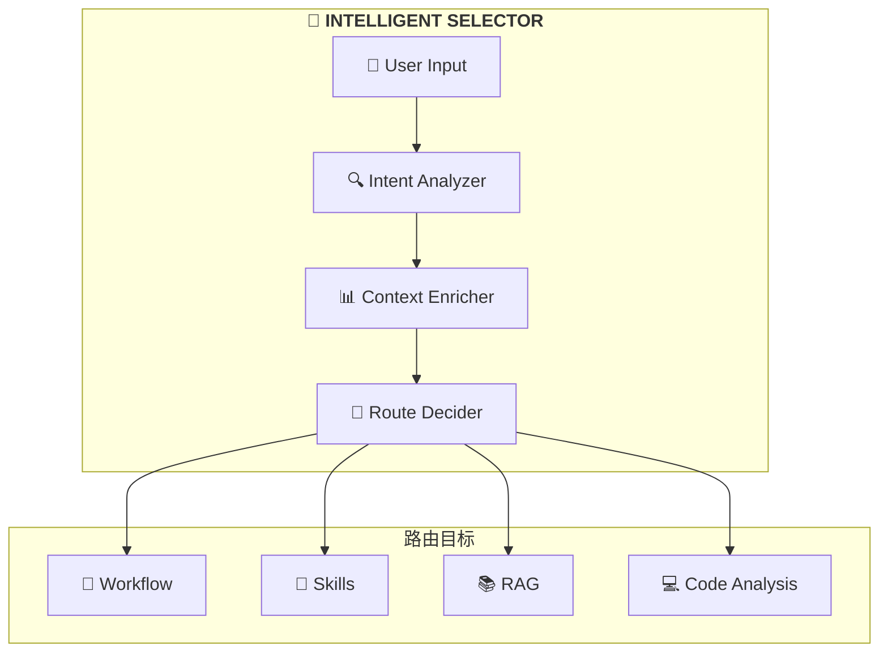
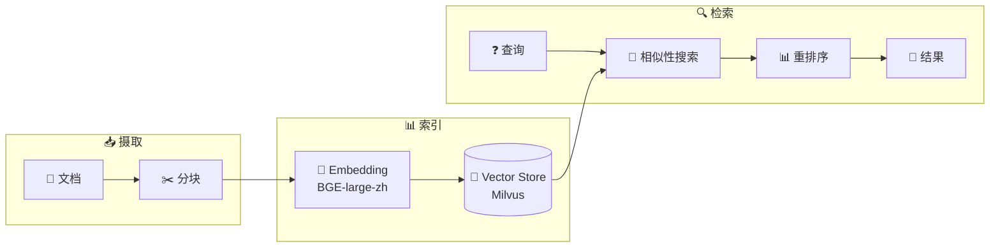
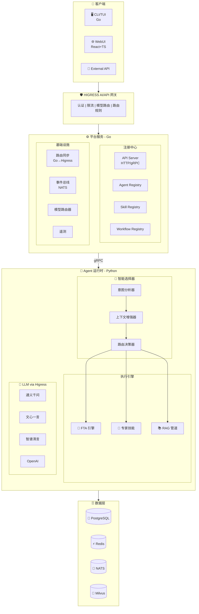

# ResolveAgent 文档

欢迎使用 ResolveAgent 文档！

## 什么是 ResolveAgent？

**ResolveAgent** 是一个**面向问题解决的 AIOps 智能体** — 一个 **CNCF 级别的开源解决方案**，通过四大核心能力协同工作解决真实运维问题：

- **🔧 专家技能** — 通过可插拔技能模块提供领域专业知识
- **🌳 FTA 工作流** — 故障树分析用于系统性问题诊断
- **📚 RAG 知识库** — 检索增强生成提供知识支撑
- **💻 代码分析** — 静态代码分析作为底层技术保障

基于 [AgentScope](https://github.com/modelscope/agentscope) 构建 Agent 编排能力，基于 [Higress](https://github.com/alibaba/higress) 构建 AI 网关能力。

## 快速导航

| 我是... | 从这里开始 |
|---------|-----------|
| **新用户** | [快速开始指南](/docs/user-guide/quickstart) |
| **开发者** | [本地开发指南](/docs/dev-guide/local-dev) |
| **运维工程师** | [部署手册](/docs/ops/deployment) |
| **架构师** | [架构概览](/docs/zh/architecture) |
| **API 用户** | [API 参考](/docs/api/index) |

## 功能特性

### 🧠 智能选择器

核心 AI 大脑，智能地将请求路由到最优处理路径。



### 🔬 高级静态分析 (FTA)

支持多种故障树分析门类型：

| 门类型 | 描述 |
|--------|------|
| **AND Gate** | 所有输入必须为真 |
| **OR Gate** | 任一输入为真即可 |
| **VOTING (k-of-n)** | 至少 k 个输入为真 |
| **INHIBIT** | 条件门控 |
| **PRIORITY-AND** | 有序与门 |

### 📚 RAG 管道

端到端的知识检索增强生成：



## 系统架构



## 快速开始

```bash
# 克隆仓库
git clone https://github.com/ai-guru-global/resolve-agent.git
cd resolve-agent

# 一键设置开发环境
make setup-dev

# 启动依赖服务
make compose-deps

# 构建并启动
make build
make compose-up

# 访问 WebUI
open http://localhost:3000
```

## 参与贡献

我们欢迎各种形式的贡献！请查看：

- [贡献指南](/docs/dev-guide/contributing)
- [开发环境搭建](/docs/dev-guide/local-dev)
- [GitHub Issues](https://github.com/ai-guru-global/resolve-agent/issues)

## 许可证

本项目采用 Apache 2.0 许可证。详见 [LICENSE](https://github.com/ai-guru-global/resolve-agent/blob/main/LICENSE) 文件。
