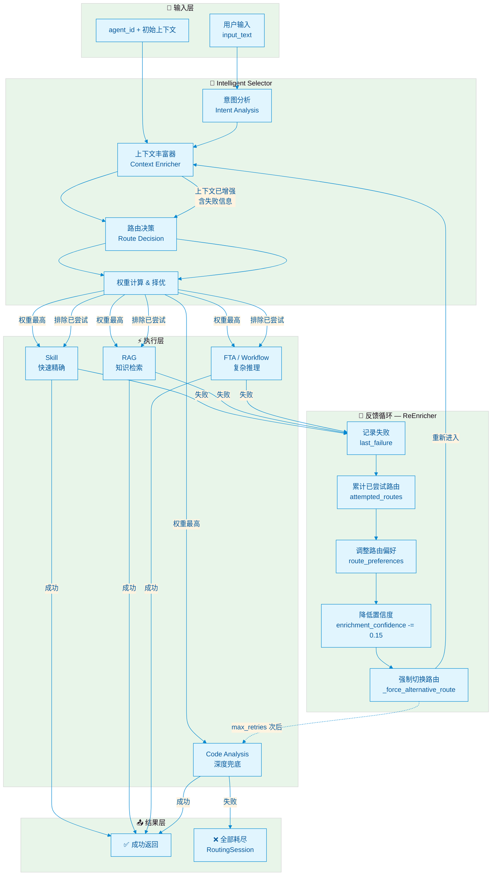

# Resilient Selector — 反馈驱动路由环路（完整版）

> 核心理念: **每一次失败都不是浪费，而是为下一次路由决策提供更丰富的上下文**

---

## 架构图



---

## 核心流程

```
用户输入
  ↓
┌─────────────────────────────────────────┐
│  🧠 Intelligent Selector                │
│  1. Intent Analysis  → 意图分类         │
│  2. Context Enricher → 记忆/偏好/代码   │
│  3. Route Decision   → 计算权重择优     │
└─────────────────────────────────────────┘
  ↓
⚡ 执行权重最高的路由（Skill / RAG / FTA / Code Analysis）
  ↓
┌─────────┐
│ 成功？   │
└─────────┘
  │是          │否
  ↓           ↓
返回结果   🔄 ReEnricher 重新整理上下文：
           • 记录哪个路由失败 + 错误原因
           • 累计 attempted_routes（下次排除）
           • 智能调整 route_preferences：
             - RAG 无结果 → 偏好推理
             - Skill 失败 → 偏好知识
             - Workflow 失败 → 偏好分析
           • enrichment_confidence -= 0.15
           • 强制切换到下一优先级路由
              ↓
        回到 Context Enricher（带着增强后的上下文）
              ↓
        重新进入 Route Decision（权重重新计算）
              ↓
        执行新的路由...
              ↓
        ...循环 max_retries 次...
              ↓
        最终兜底 → Code Analysis
              ↓
        还是失败 → ❌ 真正退出
```

---

## 降级路径

```
Skill (快, 精确) → RAG (知识) → FTA/Workflow (复杂推理) → Code Analysis (深度兜底)
```

| 优先级 | 路由类型 | 特点 | 适用场景 |
|--------|----------|------|----------|
| 1 | **Skill** | 快速、精确、确定性高 | 已知问题、标准化操作 |
| 2 | **RAG** | 知识检索、文档驱动 | 需要参考历史案例或文档 |
| 3 | **FTA / Workflow** | 复杂推理、多步骤编排 | 需要根因分析、故障树推理 |
| 4 | **Code Analysis** | 深度兜底、静态分析 | 代码级问题、最终防线 |

---

## 上下文增强详情

当执行失败后，ReEnricher 会往上下文中注入：

| 字段 | 说明 |
|------|------|
| `attempted_routes` | 已尝试的路由列表，避免重复 |
| `last_failure` | 上次失败的详情（路由、错误、耗时） |
| `route_preferences` | 基于失败模式的智能偏好调整 |
| `enrichment_confidence` | 每次失败降低 0.15，最低 0.3 |
| `attempt_count` | 尝试次数，用于超时和降级判断 |

---

## 代码入口

```python
from resolveagent.selector.resilient_selector import ResilientSelector

selector = ResilientSelector(max_retries=3)
session = await selector.route_and_execute(
    input_text="diagnose the 503 error",
    agent_id="ops-agent",
    executor=my_executor,
)

print(f"成功: {session.success}")
print(f"最终路由: {session.final_route}")
print(f"尝试次数: {session.attempt_count}")
print(f"总耗时: {session.total_latency_ms}ms")
```
