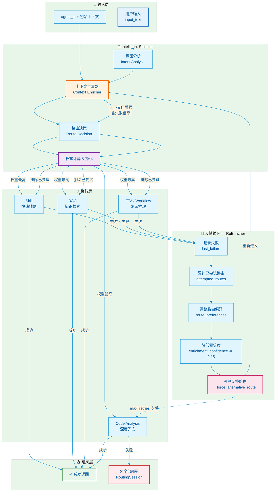

# Resilient Selector — 反馈驱动自适应路由环路

> 对应代码: `python/src/resolveagent/selector/resilient_selector.py`  
> 核心理念: **每一次失败都不是浪费，而是为下一次路由决策提供更丰富的上下文**

---

## 架构图



---

## 流程详解

### 1. 输入层

用户输入 `input_text` + `agent_id`，携带可选的初始上下文 `context`。

### 2. Intelligent Selector（三层路由）

```python
# selector/selector.py
class IntelligentSelector:
    async def route(input_text, agent_id, context):
        # 1. Intent Analysis — 意图分类
        intent = await intent_analyzer.classify(input_text)
        # 2. Context Enrichment — 上下文丰富
        enriched = await context_enricher.enrich(input_text, agent_id, context)
        # 3. Route Decision — 路由决策
        decision = await route_decider.decide(intent, enriched)
        return decision  # RouteDecision(route_type, confidence, ...)
```

### 3. 执行层（四级降级路径）

| 优先级 | 路由类型 | 特点 | 适用场景 |
|--------|----------|------|----------|
| 1 | **Skill** | 快速、精确、确定性高 | 已知问题、标准化操作 |
| 2 | **RAG** | 知识检索、文档驱动 | 需要参考历史案例或文档 |
| 3 | **FTA / Workflow** | 复杂推理、多步骤编排 | 需要根因分析、故障树推理 |
| 4 | **Code Analysis** | 深度兜底、静态分析 | 代码级问题、最终防线 |

### 4. 反馈循环 — ReEnricher

当执行失败后，**不是直接退出**，而是进入 `ReEnricher.re_enrich()`：

```python
# resilient_selector.py
class ReEnricher:
    def re_enrich(context, last_attempt, all_attempts):
        ctx = dict(context)

        # 1. 记录已尝试路由
        ctx["attempted_routes"].append(last_attempt.route_type)

        # 2. 记录上次失败详情
        ctx["last_failure"] = {
            "route": last_attempt.route_type,
            "error": last_attempt.error,
            "latency_ms": last_attempt.latency_ms,
        }

        # 3. 调整路由偏好（基于失败模式智能推断）
        if last_attempt.route_type == "rag" and "no results" in error:
            ctx["route_preferences"]["prefer_reasoning"] = True  # 无文档，尝试推理
        elif last_attempt.route_type == "skill":
            ctx["route_preferences"]["prefer_knowledge"] = True   # Skill 失败，尝试知识
        elif last_attempt.route_type == "fta":
            ctx["route_preferences"]["prefer_analysis"] = True    # Workflow 失败，尝试分析

        # 4. 降低置信度（每次失败 -0.15，最低 0.3）
        ctx["enrichment_confidence"] = max(0.3, base_confidence - 0.15 * len(all_attempts))

        return ctx
```

### 5. 强制切换路由

如果 Intelligent Selector 再次选择了已尝试过的路由，`ResilientSelector` 会强制切换到下一个可用路由：

```python
def _force_alternative_route(original, tried, context):
    # 按优先级选择下一个未尝试的路由
    available = [r for r in ["skill", "rag", "fta", "code_analysis"] if r not in tried]
    next_route = available[0]

    # 应用偏好调整
    prefs = context.get("route_preferences", {})
    if prefs.get("prefer_reasoning") and "fta" in available:
        next_route = "fta"
    elif prefs.get("prefer_knowledge") and "rag" in available:
        next_route = "rag"
    elif prefs.get("prefer_analysis") and "code_analysis" in available:
        next_route = "code_analysis"

    return RouteDecision(route_type=next_route, ...)
```

### 6. 循环控制

```python
for attempt_num in range(max_retries + 1):  # 默认 3 次重试
    decision = await selector.route(input_text, agent_id, context)
    result = await executor(decision)

    if result.success:
        return RoutingSession(success=True, final_route=decision.route_type)

    # 失败 → 重新丰富上下文，进入下一轮
    context = re_enricher.re_enrich(context, last_attempt, all_attempts)

# 最终兜底：Code Analysis（如果还没试过）
if not success and "code_analysis" not in tried:
    fallback = RouteDecision(route_type="code_analysis", ...)
    result = await executor(fallback)
```

---

## 关键设计点

### 为什么回到 ContextEnricher 而不是直接重试？

```
传统重试:   Route → Execute → 失败 → 直接重新 Route
            (上下文不变，可能反复选同一个错误路由)

Resilient:  Route → Execute → 失败 → ReEnrich → 重新 Route
            (上下文增强了失败信息，决策更智能)
```

### 上下文增强了什么？

| 字段 | 说明 |
|------|------|
| `attempted_routes` | 已尝试的路由列表，避免重复 |
| `last_failure` | 上次失败的详情（路由、错误、耗时） |
| `route_preferences` | 基于失败模式的智能偏好调整 |
| `enrichment_confidence` | 每次失败降低 0.15，反映不确定性递增 |
| `attempt_count` | 尝试次数，用于超时和降级判断 |

### 与 FallbackCascade 的关系

```
ResilientSelector     (route-level 降级: Skill → RAG → FTA → Code Analysis)
    └── FallbackCascade  (tool-level 降级: MCP → Native → LLM Direct)
        └── HybridPlanner.replan  (step-level 降级: 单步重试 → 多步重规划)
```

三层降级互相嵌套，最大化问题解决率。

---

## 代码入口

```python
from resolveagent.selector.resilient_selector import ResilientSelector

selector = ResilientSelector(max_retries=3)
session = await selector.route_and_execute(
    input_text=" diagnose the 503 error",
    agent_id="ops-agent",
    executor=my_executor,
)

print(f"成功: {session.success}")
print(f"最终路由: {session.final_route}")
print(f"尝试次数: {session.attempt_count}")
print(f"总耗时: {session.total_latency_ms}ms")
```
