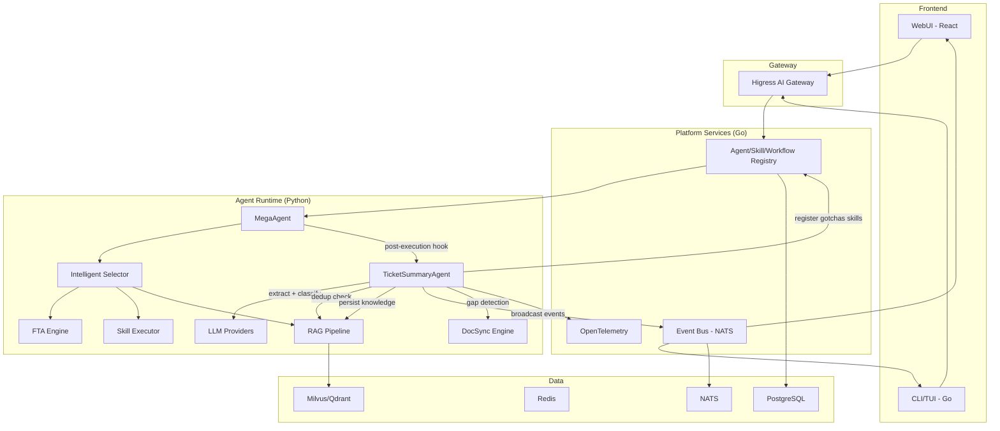
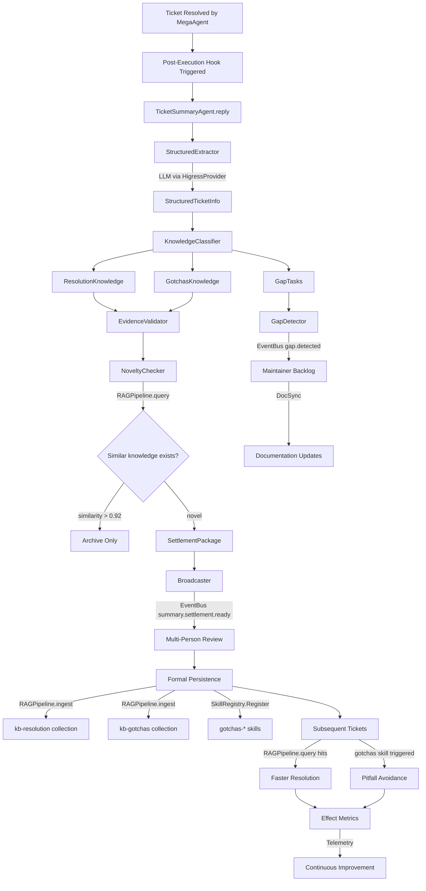
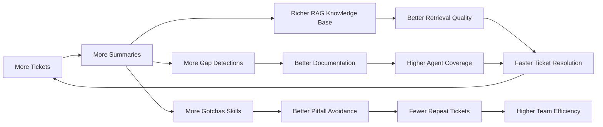
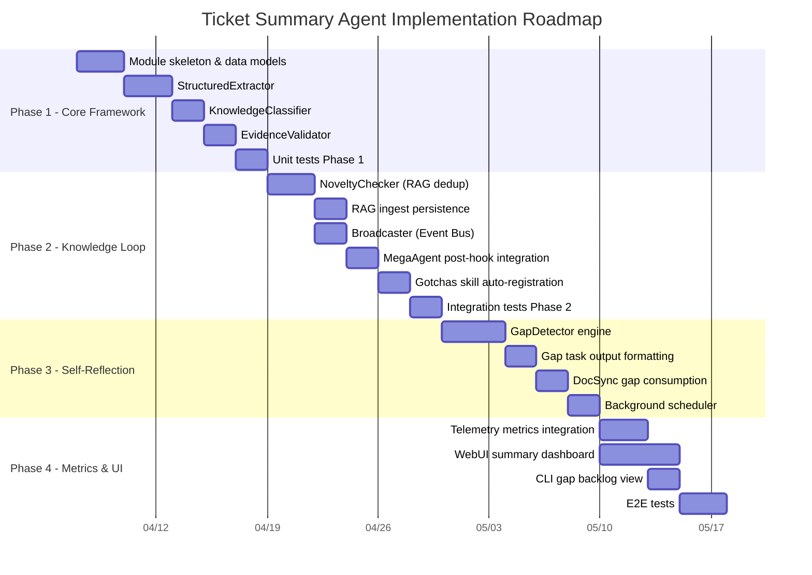

# Ticket Summary Agent — Integration Analysis Report

> **Status**: Technical Feasibility Assessment  
> **Scope**: Full integration of Ticket Summary Agent design philosophy into ResolveAgent platform  
> **Conclusion**: Architecturally compatible, technically feasible, zero-invasion integration path available

---

## Table of Contents

1. [Executive Summary](#executive-summary)
2. [Architecture Compatibility Assessment](#1-architecture-compatibility-assessment)
3. [Technical Implementation Feasibility](#2-technical-implementation-feasibility)
4. [Integration Path Planning](#3-integration-path-planning)
5. [Extension Impact Assessment](#4-extension-impact-assessment)
6. [Implementation Recommendations](#5-implementation-recommendations)

---

## Executive Summary

The Ticket Summary Agent's design philosophy — centered on **three incremental outputs** (resolution, prevention, system repair) and **seven design principles** — is **highly compatible** with the existing ResolveAgent architecture. The platform's current component stack (Agent system, RAG Pipeline, Skills system, Event Bus, Intelligent Selector) already provides the foundational infrastructure needed for integration.

**Key findings:**

- **Zero architectural conflict**: All seven design principles map to existing system capabilities
- **Post-execution trigger model**: Summary Agent operates as a post-processing step, not a routing target — no changes to the Intelligent Selector's core routing logic
- **Minimal Go platform changes**: Only Event Bus topic expansion; core registries, gateway, and store layers remain untouched
- **Primary implementation in Python Runtime**: New `summary/` module extending `BaseAgent`, leveraging existing RAG, Skills, and LLM abstractions
- **MVP achievable in ~1 week**: Three core capabilities (structured extraction, RAG dedup, event broadcast) form a minimal viable closed loop

---

## 1. Architecture Compatibility Assessment

### 1.1 Four-Layer Alignment

The Ticket Summary Agent's knowledge production loop maps cleanly onto ResolveAgent's existing four-layer architecture:

```
┌────────────────────────────────────────────────────────────────────┐
│  CLIENT LAYER                                                      │
│  CLI/TUI · WebUI · External API                                    │
│  ─── Summary Agent adds: Gap Dashboard, Summary Feed ───           │
├────────────────────────────────────────────────────────────────────┤
│  HIGRESS AI/API GATEWAY                                            │
│  Authentication · Rate Limiting · Model Routing                    │
│  ─── No changes required ───                                       │
├────────────────────────────────────────────────────────────────────┤
│  PLATFORM SERVICES (Go)                                            │
│  Registries · Event Bus · Telemetry · Config                       │
│  ─── Summary Agent adds: summary.* events, gap metrics ───        │
├────────────────────────────────────────────────────────────────────┤
│  AGENT RUNTIME (Python / AgentScope)                               │
│  Selector · FTA · Skills · RAG · LLM                               │
│  ─── Summary Agent adds: summary/ module (core logic) ───         │
├────────────────────────────────────────────────────────────────────┤
│  DATA LAYER                                                        │
│  PostgreSQL · Redis · NATS · Milvus/Qdrant                        │
│  ─── Summary Agent adds: knowledge collections in vector store ─── │
└────────────────────────────────────────────────────────────────────┘
```

### 1.2 Seven Principles × Existing Components

Each design principle maps directly to one or more existing system capabilities:

| Design Principle | Supporting Component | Source File | Compatibility |
|---|---|---|---|
| **P1: Discovery, Not Labor Saving** | RAG Pipeline `query()` detects knowledge novelty | `python/src/resolveagent/rag/pipeline.py` | ✅ Direct |
| **P2: Organizationally Public** | Event Bus (NATS) supports one-write-many-read broadcast | `pkg/event/event.go`, `pkg/event/nats.go` | ✅ Direct |
| **P3: Evidence-Based** | `Execution` proto has `trace_id`, `route_decision`, timestamps | `api/proto/resolveagent/v1/agent.proto` L125-136 | ✅ Direct |
| **P4: Incremental Accumulation** | RAG Pipeline `query()` for dedup + `ingest()` for persistence | `python/src/resolveagent/rag/pipeline.py` | ✅ Extend |
| **P5: Capability Loop Closure** | Skill Registry dynamic registration; existing `SkillManifest` model | `pkg/registry/skill.go`, `python/src/resolveagent/skills/manifest.py` | ✅ Direct |
| **P6: Pitfall Prevention** | Skills system supports new skill categories (e.g., `gotchas-*`) | `python/src/resolveagent/skills/executor.py` | ✅ Extend |
| **P7: Self-Reflection** | Workflow system + DocSync engine for background gap detection | `pkg/registry/workflow.go`, `python/src/resolveagent/docsync/` | ⚠️ New module |

### 1.3 Agent Type Registration

The proto definition already accommodates the Summary Agent without schema changes:

```protobuf
// api/proto/resolveagent/v1/agent.proto
enum AgentType {
  AGENT_TYPE_UNSPECIFIED = 0;
  AGENT_TYPE_MEGA = 1;
  AGENT_TYPE_SKILL = 2;
  AGENT_TYPE_FTA = 3;
  AGENT_TYPE_RAG = 4;
  AGENT_TYPE_CUSTOM = 5;  // ← Summary Agent registers here
}
```

The Go-side `AgentDefinition.Type` field (in `pkg/registry/agent.go`) is a free-form `string`, so `"summary"` can be used as a type value without modifying the struct definition. The `AgentRegistry` interface (`Create`, `Get`, `List`, `Update`, `Delete`) is fully sufficient for managing Summary Agent instances.

### 1.4 Compatibility Verdict

| Dimension | Assessment | Detail |
|---|---|---|
| Proto/API schema | ✅ No changes | `AGENT_TYPE_CUSTOM` covers Summary Agent |
| Agent Registry | ✅ No changes | `AgentDefinition.Type = "summary"` works as-is |
| Skill Registry | ✅ No changes | Gotchas skills register through existing `SkillRegistry.Register()` |
| Workflow Registry | ✅ No changes | Gap detection can register as a workflow |
| Event Bus | ✅ Extend only | Add `summary.*` and `gap.*` event types |
| Store interface | ✅ No changes | Knowledge persisted via RAG vector store |
| Gateway/Higress | ✅ No changes | Summary Agent uses existing LLM routing |

---

## 2. Technical Implementation Feasibility

### 2.1 Python Runtime — Core Implementation

The Summary Agent's primary logic lives in the Python runtime, as a new module inheriting from `BaseAgent`:

**Proposed module structure:**

```
python/src/resolveagent/summary/
├── __init__.py                    # Module exports
├── agent.py                       # TicketSummaryAgent (extends BaseAgent)
├── models.py                      # Pydantic data models
├── extractor.py                   # Structured info extraction (LLM-powered)
├── classifier.py                  # Three-type knowledge classifier
├── evidence_validator.py          # Evidence chain validation
├── novelty_checker.py             # Incremental novelty detection (RAG-based)
├── gap_detector.py                # Background gap identification engine
└── broadcaster.py                 # One-write-many-read event broadcaster
```

### 2.2 Component-Level Implementation Mapping

Each Summary Agent component maps to a concrete implementation approach using existing infrastructure:

#### 2.2.1 TicketSummaryAgent (`summary/agent.py`)

**Extends:** `BaseAgent` from `python/src/resolveagent/agent/base.py`

**Design rationale:** `BaseAgent` already provides `reply()`, `add_memory()`, `get_memory()`, and `reset()`. The Summary Agent overrides `reply()` to implement the full knowledge production pipeline. The `MemoryManager` from `agent/memory.py` provides conversation context tracking.

```python
class TicketSummaryAgent(BaseAgent):
    """Knowledge production engine for ticket summarization.
    
    Implements the seven design principles as a post-processing pipeline:
    1. Structured extraction (P1: Discovery)
    2. Three-type classification (P6: Prevention)
    3. Evidence chain validation (P3: Evidence-Based)
    4. Novelty detection via RAG dedup (P4: Incremental)
    5. Event broadcast (P2: Organizationally Public)
    6. Formal persistence to Skills/RAG (P5: Capability Loop)
    7. Background gap detection (P7: Self-Reflection)
    """
```

#### 2.2.2 Structured Extractor (`summary/extractor.py`)

**Uses:** LLM Provider from `python/src/resolveagent/llm/` (specifically `higress_provider.py` for gateway-routed LLM calls)

**Approach:** LLM-powered structured extraction with Pydantic output parsing. Takes raw ticket content (symptoms, error logs, chat history, resolution actions) and produces a `StructuredTicketInfo` model.

**Key integration point:** The `HigressProvider` from `llm/higress_provider.py` provides the LLM call abstraction, routing through Higress gateway with model routing support from `ModelRouter`.

#### 2.2.3 Knowledge Classifier (`summary/classifier.py`)

**Uses:** Selector pattern from `python/src/resolveagent/selector/selector.py`

**Approach:** Adopts the same hybrid strategy pattern as `IntelligentSelector` — rule-based fast path for obvious classifications, LLM fallback for ambiguous cases. Classifies extracted information into three knowledge types:

- **Resolution Knowledge** → structured solution artifacts
- **Prevention Knowledge (Gotchas)** → anti-patterns and pitfall warnings
- **Maintenance Knowledge** → system gap identifications

#### 2.2.4 Evidence Validator (`summary/evidence_validator.py`)

**Uses:** `Execution` record from `api/proto/resolveagent/v1/agent.proto` (fields: `trace_id`, `route_decision`, `started_at`, `completed_at`, `duration_ms`)

**Approach:** Validates that each summary conclusion has a complete evidence chain: `conclusion ↔ root_cause ↔ action_taken ↔ success_condition ↔ applicable_scope`. Rejects conclusions missing critical evidence fields.

#### 2.2.5 Novelty Checker (`summary/novelty_checker.py`)

**Uses:** `RAGPipeline.query()` from `python/src/resolveagent/rag/pipeline.py`

**Approach:** Before persisting any knowledge, queries the existing RAG collection with the candidate summary. If similarity score exceeds threshold (e.g., 0.92), the case is archived without promotion to public knowledge. This implements Principle 4 (Incremental Accumulation) by preventing duplicate/noise entries.

**Key integration point:** Uses the existing `RAGPipeline` instance with a dedicated `collection_id` (e.g., `"knowledge-base"`) for knowledge deduplication queries.

#### 2.2.6 Broadcaster (`summary/broadcaster.py`)

**Uses:** Event Bus from `pkg/event/event.go` and `pkg/event/nats.go`

**Approach:** Publishes structured events through the NATS-based Event Bus. Event types:

| Event Type | Trigger | Consumers |
|---|---|---|
| `summary.created` | New summary generated | WebUI feed, CLI notifications |
| `summary.settlement.ready` | Incremental package formed | Ticket owner, on-call, product owner |
| `summary.persisted` | Knowledge formally persisted | Audit log, metrics |
| `gap.detected` | System gap identified | Maintainer backlog, DocSync |
| `gap.task.created` | Gap converted to maintenance task | WebUI dashboard, assignee |

**Python-side integration:** Uses `runtime/registry_client.py` to publish events through the Go Platform Service's gRPC interface, which in turn publishes to NATS.

#### 2.2.7 Gap Detector (`summary/gap_detector.py`)

**Uses:** DocSync Engine from `python/src/resolveagent/docsync/engine.py`, RAG Pipeline

**Approach:** Implements the four gap categories (Missing, Conflicting, Stale, Tacit Personal) as a background analysis engine. Outputs structured `GapTask` objects suitable for the maintainer backlog queue.

**Key design:** This runs asynchronously after each summary and also periodically as a background job, fulfilling Principle 7 (Self-Reflection).

### 2.3 Go Platform Layer — Minimal Changes

The Go platform requires **only additive changes**, no modifications to existing interfaces:

| Component | Change Type | Detail |
|---|---|---|
| `pkg/event/event.go` | **None** | `Event` struct with `Type`, `Subject`, `Data` already sufficient |
| `pkg/event/nats.go` | **None** | `NATSBus.Publish()` accepts any event type string |
| `pkg/registry/agent.go` | **None** | `AgentDefinition.Type` is free-form string |
| `pkg/registry/skill.go` | **None** | `SkillRegistry.Register()` accepts any skill definition |
| `pkg/service/registry_service.go` | **None** | All existing RPC methods work for summary agent instances |
| `pkg/store/store.go` | **None** | Store interface unchanged; knowledge in vector store |
| `pkg/telemetry/metrics.go` | **Extend** | Add summary-specific metric counters |

### 2.4 Data Model Definitions

Core Pydantic models for the summary system:

```python
# python/src/resolveagent/summary/models.py

class StructuredTicketInfo(BaseModel):
    """Extracted structured information from a ticket."""
    ticket_id: str
    symptom: str                    # Observable phenomena
    error_messages: list[str]       # Error logs and messages
    environment: dict[str, str]     # Version, config, infra context
    diagnosis_path: list[str]       # Step-by-step troubleshooting
    root_cause: str                 # Verified underlying cause
    resolution: str                 # Actions taken
    success_condition: str          # How to verify fix worked
    applicable_scope: str           # Boundaries and limitations

class ResolutionKnowledge(BaseModel):
    """Type 1: How to handle the problem faster."""
    ...fields from StructuredTicketInfo...
    evidence_chain: EvidenceChain

class GotchasKnowledge(BaseModel):
    """Type 2: How to avoid stepping on mines."""
    dangerous_operations: list[str]
    misleading_diagnostics: list[str]
    order_dependencies: list[str]
    mandatory_prechecks: list[str]
    common_misjudgments: list[str]

class GapTask(BaseModel):
    """Type 3: Maintainable task for system gaps."""
    gap_type: Literal["missing", "conflicting", "stale", "tacit_personal"]
    product_module: str
    related_ticket_count: int
    impact_scope: str
    suggested_location: str
    suggested_content: str
    priority: Literal["critical", "high", "medium", "low"]
    owner: str

class SettlementPackage(BaseModel):
    """Incremental knowledge settlement package."""
    resolution: ResolutionKnowledge | None
    gotchas: GotchasKnowledge | None
    gap_tasks: list[GapTask]
    is_novel: bool
    archived_only: bool
```

### 2.5 Trigger Mechanism — Post-Execution Hook

The Summary Agent is **not a routing target** — it is a **post-execution hook** in the `MegaAgent` pipeline:

```python
# In python/src/resolveagent/agent/mega.py (conceptual extension)
class MegaAgent(BaseAgent):
    async def reply(self, message):
        # Step 1: Existing routing logic
        decision = await selector.route(...)
        result = await self._execute(decision)
        
        # Step 2: Post-execution summary trigger (NEW)
        if self._should_summarize(message, result, decision):
            summary_agent = TicketSummaryAgent(model_id=self.model_id)
            await summary_agent.reply({
                "content": message["content"],
                "resolution": result,
                "execution_context": {
                    "route_type": decision.route_type,
                    "route_target": decision.route_target,
                    "confidence": decision.confidence,
                    "trace_id": ctx.trace_id,
                },
            })
        
        return result
```

This approach ensures:
- **Zero invasion** to existing `IntelligentSelector` routing logic
- **No new `RouteType`** needed in proto definition
- Summary runs **asynchronously** after ticket resolution
- Summary can be **conditionally triggered** based on ticket complexity, confidence, or explicit request

### 2.6 RAG Collection Strategy

The knowledge base uses dedicated RAG collections for each knowledge type:

| Collection ID | Content | Purpose |
|---|---|---|
| `kb-resolution` | Resolution knowledge entries | Dedup check + future retrieval |
| `kb-gotchas` | Prevention/gotchas entries | Pre-check lookup during ticket handling |
| `kb-gaps` | System gap records | Background analysis and trending |

All collections use the existing `RAGPipeline` with `bge-large-zh` embeddings and Milvus/Qdrant vector backend — no new infrastructure required.

---

## 3. Integration Path Planning

### 3.1 Integration Architecture



### 3.2 Data Flow — Complete Knowledge Production Loop



### 3.3 Component Interaction Matrix

| Summary Component | Interacts With | Direction | Method |
|---|---|---|---|
| `TicketSummaryAgent` | `BaseAgent` | Inherits | Python class inheritance |
| `TicketSummaryAgent` | `MegaAgent` | Called by | Post-execution hook |
| `StructuredExtractor` | `HigressProvider` | Calls | LLM API via Higress gateway |
| `KnowledgeClassifier` | `IntelligentSelector` | Pattern reuse | Hybrid strategy pattern |
| `EvidenceValidator` | `Execution` proto | Reads | Execution trace data |
| `NoveltyChecker` | `RAGPipeline` | Calls | `query()` for similarity check |
| `Broadcaster` | `Event Bus (NATS)` | Publishes | `summary.*` and `gap.*` events |
| `GapDetector` | `DocSync Engine` | Triggers | Gap-driven doc sync tasks |
| Formal Persistence | `RAGPipeline` | Calls | `ingest()` to vector store |
| Formal Persistence | `SkillRegistry` | Calls | `Register()` for gotchas skills |
| Effect Metrics | `OpenTelemetry` | Reports | Custom metric counters |

---

## 4. Extension Impact Assessment

### 4.1 Positive Synergies (Flywheel Effect)

The Summary Agent creates a **knowledge flywheel** that amplifies the value of every existing component:



| Existing Component | Synergy Effect | Mechanism |
|---|---|---|
| **Intelligent Selector** | Improved routing accuracy over time | Summary-extracted intent patterns become Selector training data |
| **FTA Engine** | Auto-generated fault trees from resolution paths | Diagnosis paths from resolution knowledge → new FTA sub-trees |
| **RAG Pipeline** | Continuously enriched knowledge base | Each novel summary adds to retrieval corpus; subsequent tickets hit cached knowledge |
| **Skills System** | Self-expanding skill library | Gotchas knowledge auto-registers as callable skills; pre-checks become skill preconditions |
| **DocSync Engine** | Prioritized doc sync driven by gap detection | Gap detector identifies stale/missing docs → DocSync auto-generates update tasks |
| **Event Bus** | Rich event stream for analytics | `summary.*` events enable knowledge production metrics dashboards |
| **Telemetry** | New operational metrics | Hit rate, reuse rate, pitfall reduction rate, gap discovery rate |
| **WebUI** | Knowledge management console | Summary feed, gap backlog dashboard, knowledge search interface |

### 4.2 Impact on Existing Components

| Component | Impact Level | Detail |
|---|---|---|
| `python/src/resolveagent/agent/mega.py` | **Low** | Add post-execution hook (~10 lines) |
| `python/src/resolveagent/rag/pipeline.py` | **None** | Used as-is via `query()` and `ingest()` |
| `python/src/resolveagent/skills/executor.py` | **None** | Used as-is for gotchas skill execution |
| `python/src/resolveagent/selector/selector.py` | **None** | No routing changes; summary is post-processing |
| `python/src/resolveagent/llm/` | **None** | Used as-is for LLM calls |
| `python/src/resolveagent/docsync/` | **Low** | May consume gap detection events |
| `pkg/registry/agent.go` | **None** | `Type="summary"` works with existing string field |
| `pkg/registry/skill.go` | **None** | `Register()` accepts gotchas skills |
| `pkg/event/event.go` | **None** | Event struct is generic enough |
| `pkg/telemetry/metrics.go` | **Low** | Add summary-specific counters |
| `api/proto/resolveagent/v1/agent.proto` | **None** | `AGENT_TYPE_CUSTOM` sufficient |
| `web/` | **Medium** | New dashboard pages for summary feed and gap backlog |

### 4.3 Risk Assessment

| Risk | Severity | Probability | Mitigation |
|---|---|---|---|
| **RAG collection bloat** | Medium | Low | Principle 4 (Incremental) + similarity threshold filtering |
| **LLM call volume increase** | Medium | Medium | Rule-based pre-filter + batch summarization + response caching |
| **Event Bus backpressure** | Low | Low | Event aggregation + throttling on `NATSBus` |
| **Skill registry fragmentation** | Medium | Medium | Gotchas skill merge strategy + periodic consolidation |
| **Summary quality variance** | Medium | Medium | Evidence chain validation gate + human review loop |
| **False positive gaps** | Low | Medium | Ticket count threshold before gap promotion |

---

## 5. Implementation Recommendations

### 5.1 Phased Implementation Plan



### 5.2 Phase 1: Core Framework (Weeks 1-2)

**Goal:** Structured extraction + three-type classification + evidence validation

| Priority | Task | Target File | Dependencies |
|---|---|---|---|
| **P0** | Create `summary/` module skeleton with `__init__.py` | `python/src/resolveagent/summary/__init__.py` | None |
| **P0** | Define Pydantic data models | `python/src/resolveagent/summary/models.py` | None |
| **P0** | Implement `TicketSummaryAgent` extending `BaseAgent` | `python/src/resolveagent/summary/agent.py` | `agent/base.py` |
| **P0** | Implement `StructuredExtractor` with LLM prompts | `python/src/resolveagent/summary/extractor.py` | `llm/` providers |
| **P1** | Implement `KnowledgeClassifier` (hybrid strategy) | `python/src/resolveagent/summary/classifier.py` | Selector pattern |
| **P1** | Implement `EvidenceValidator` | `python/src/resolveagent/summary/evidence_validator.py` | Proto `Execution` |
| **P2** | Register Summary Agent in Go platform | Use existing `AgentRegistry.Create()` | `pkg/registry/agent.go` |
| **P2** | Unit tests for Phase 1 | `python/tests/unit/test_summary_*.py` | All above |

**Deliverable:** Agent that takes ticket data → outputs classified, validated three-type knowledge candidates.

### 5.3 Phase 2: Knowledge Closed Loop (Weeks 3-4)

**Goal:** Deduplication + RAG persistence + Skill registration + event broadcast

| Priority | Task | Target File | Dependencies |
|---|---|---|---|
| **P0** | Implement `NoveltyChecker` using `RAGPipeline.query()` | `python/src/resolveagent/summary/novelty_checker.py` | `rag/pipeline.py` |
| **P0** | Implement RAG `ingest()` for knowledge persistence | `python/src/resolveagent/summary/agent.py` | `rag/pipeline.py` |
| **P1** | Implement `Broadcaster` using Event Bus | `python/src/resolveagent/summary/broadcaster.py` | `pkg/event/` |
| **P1** | Add `summary.*` event types to Event Bus | Topic convention only | `pkg/event/nats.go` |
| **P2** | Add post-execution hook in `MegaAgent.reply()` | `python/src/resolveagent/agent/mega.py` | Phase 1 complete |
| **P2** | Implement gotchas skill auto-registration | `python/src/resolveagent/summary/agent.py` | `skills/manifest.py` |
| **P2** | Integration tests for closed loop | `python/tests/unit/test_summary_integration.py` | All above |

**Deliverable:** Complete knowledge production loop: ticket → extract → classify → validate → dedup → persist → broadcast.

### 5.4 Phase 3: Self-Reflection Engine (Weeks 5-6)

**Goal:** Background gap detection + maintainable task output + DocSync integration

| Priority | Task | Target File | Dependencies |
|---|---|---|---|
| **P0** | Implement `GapDetector` with four categories | `python/src/resolveagent/summary/gap_detector.py` | RAG Pipeline |
| **P1** | Implement `GapTask` structured output | `python/src/resolveagent/summary/models.py` | None |
| **P2** | Connect GapDetector → DocSync Engine | `python/src/resolveagent/docsync/engine.py` | DocSync |
| **P2** | Background scheduler for periodic gap scanning | `python/src/resolveagent/summary/gap_detector.py` | Runtime engine |

**Deliverable:** Continuous gap identification engine outputting maintainable tasks.

### 5.5 Phase 4: Metrics & UI (Weeks 7-8)

**Goal:** Observability + user-facing dashboards

| Priority | Task | Target File | Dependencies |
|---|---|---|---|
| **P1** | Add summary metrics to OpenTelemetry | `pkg/telemetry/metrics.go` | Phase 2 |
| **P1** | WebUI: Summary feed page | `web/src/pages/summary/` | Phase 2 |
| **P1** | WebUI: Gap backlog dashboard | `web/src/pages/gaps/` | Phase 3 |
| **P2** | CLI: `resolveagent summary list` command | `internal/cli/summary/` | Phase 2 |
| **P2** | CLI: `resolveagent gap list` command | `internal/cli/gap/` | Phase 3 |
| **P2** | E2E test: full knowledge production loop | `test/e2e/summary_e2e_test.go` | All phases |

**Effect metrics to track:**

| Metric | Description | Target |
|---|---|---|
| `summary.hit_rate` | % of tickets where existing knowledge was reused | > 40% within 3 months |
| `summary.reuse_rate` | % of persisted knowledge actually reused | > 30% within 3 months |
| `summary.pitfall_reduction_rate` | % decrease in repeat/similar tickets | > 20% within 6 months |
| `summary.gap_discovery_rate` | # of gaps discovered per 100 tickets | > 5 per 100 tickets |
| `summary.novel_ratio` | % of tickets producing novel knowledge | 15-25% (healthy range) |

### 5.6 MVP — Fastest Value Delivery (~1 Week)

For fastest validation of core value, implement only three components:

1. **`TicketSummaryAgent`** + **`StructuredExtractor`** — LLM-powered extraction into three knowledge types
2. **`NoveltyChecker`** — RAG-based deduplication via existing `RAGPipeline.query()`
3. **`Broadcaster`** — Event Bus publication of `summary.created` events

This MVP delivers the minimal viable knowledge production loop:

```
Ticket → Extract → Classify → Dedup → Persist → Broadcast
```

### 5.7 Files That Do NOT Need Changes

The following components remain completely untouched:

| Component | Path | Reason |
|---|---|---|
| Gateway integration | `pkg/gateway/` | Summary Agent uses existing LLM routing |
| Store abstraction | `pkg/store/` | Knowledge stored via RAG vector store |
| Config system | `pkg/config/` | Existing config structure sufficient |
| Server/router | `pkg/server/` | No new HTTP/gRPC endpoints needed initially |
| Selector strategies | `python/src/resolveagent/selector/strategies/` | Summary is post-processing, not routing |
| FTA core engine | `python/src/resolveagent/fta/` | Consumed by Summary Agent, not modified |
| Skill loader/sandbox | `python/src/resolveagent/skills/loader.py`, `sandbox.py` | Used as-is for gotchas skill execution |
| Proto definitions | `api/proto/resolveagent/v1/` | `AGENT_TYPE_CUSTOM` already sufficient |

---

## Appendix A: Design Philosophy Reference

For the complete design philosophy documentation including the seven principles, three knowledge types, and knowledge production closed loop, see:

- [Ticket Summary Agent — Design Philosophy](ticket-summary-agent.md)

## Appendix B: Related Architecture Documents

- [Architecture Overview](overview.md) — System-level architecture
- [AgentScope & Higress Integration](agentscope-higress-integration.md) — Gateway integration details
- [Intelligent Selector](intelligent-selector.md) — Adaptive workflow routing (pattern reused by KnowledgeClassifier)
- [FTA Engine](fta-engine.md) — Fault tree analysis (consumed by Summary Agent for diagnosis path extraction)

## Appendix C: Glossary

| Term | Definition |
|---|---|
| **Settlement Package** | A validated, deduplicated bundle of resolution + gotchas + gap knowledge ready for persistence |
| **Novelty Check** | RAG-based similarity query to determine if knowledge already exists in the base |
| **Evidence Chain** | Linked sequence of conclusion → root cause → action → success condition → scope |
| **Gap Task** | Structured maintainable task identifying a specific knowledge system weakness |
| **Gotchas Skill** | A registered skill containing prevention knowledge (anti-patterns, pitfall warnings) |
| **Post-Execution Hook** | Trigger mechanism that activates Summary Agent after MegaAgent completes ticket processing |
| **Knowledge Flywheel** | Self-reinforcing cycle where more summaries → better RAG → faster resolution → more data |
