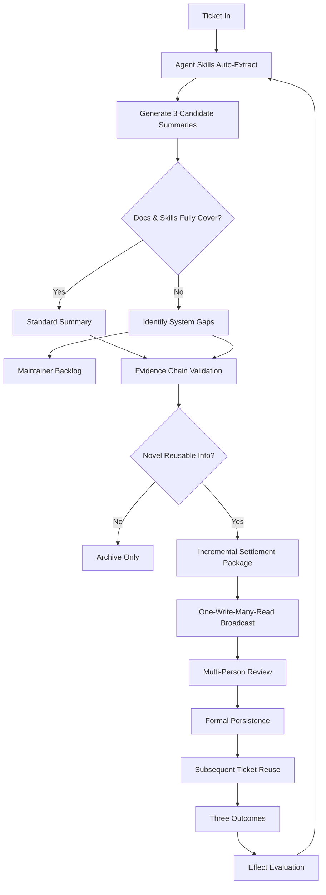

# Ticket Summary Agent — Design Philosophy

> **From "closing a ticket" to "building an organizational capability."**

The Ticket Summary Agent is not a report generator — it is a **knowledge production engine** that transforms every individual case into reusable organizational capabilities. Each ticket simultaneously serves three purposes: resolving a problem, preventing the next recurrence, and exposing gaps in the knowledge system.

## Core Thesis

> 工单总结的终极目标，不是写出一篇总结，而是让组织更会处理问题、更会避免踩坑、也更会修补自己的知识体系。

Every ticket should produce three types of incremental value:

| Increment Type | Description |
|---|---|
| **Resolution Increment** | Structured solution knowledge for faster future handling |
| **Prevention Increment** | Gotchas and anti-patterns to avoid repeating mistakes |
| **System Repair Increment** | Documentation & Skills gap identification for continuous improvement |

## Seven Design Principles

These seven principles form the philosophical foundation of the Ticket Summary Agent. Each maps directly to a system design decision.

### Principle 1: The Goal Is Discovery, Not Labor Saving

Automation is not about producing a pretty summary. It is about **systematically identifying problems that existing documentation does not cover**, and structurally extracting new cognition from individual cases.

- Auto-detect whether the ticket introduces knowledge not yet captured
- Extract structured insights even from "routine" resolutions

### Principle 2: Knowledge Must Be Organizationally Public

The agent must not be the only entity that gets smarter. Summaries must **reach the relevant people first, then settle into permanent storage**, forming shared team memory.

- Broadcast to on-call engineers, ticket owners, and product owners
- Multi-person review before formal persistence
- One-write-many-read distribution pattern

### Principle 3: Conclusions Must Be Evidence-Based

Ticket knowledge is not folklore passed by word of mouth — it must be a **replayable evidence chain**. Summaries without evidence chains easily become hallucination knowledge or legend knowledge.

- Every conclusion links to: root cause, action taken, success condition, applicable scope
- Evidence chain validation before any knowledge is persisted

### Principle 4: Accumulation Must Be Incremental

The target is not "all processed tickets" but **"tickets that contribute new cognitive value to the organization"**. This prevents duplicate entries, noise pollution, and knowledge hoarding.

- De-duplication check against existing knowledge base
- Only promote to public knowledge when genuinely novel
- Archive-only path for routine cases

### Principle 5: Knowledge Must Close the Capability Loop

Documentation is not the finish line. Knowledge is only truly settled when it **enters the next processing pipeline as a callable, trainable, checkable, reusable capability**.

- Persist into: Skill library, Runbook, FAQ, training materials, QA rules
- Subsequent tickets prioritize reuse of settled knowledge
- Measure: hit rate, reuse rate

### Principle 6: Experience Must Prevent Pitfalls, Not Just Solve Problems

Summaries must answer not only "how to fix" but also **"how to avoid"**. Great teams are not just better at fixing problems — they are better at avoiding creating, amplifying, and misjudging them.

- Gotchas extraction: dangerous operations, misleading diagnostics, order dependencies
- Pre-check requirements for high-risk scenarios
- Most common misjudgment patterns

### Principle 7: The System Must Be Self-Reflective

The agent does not only consume knowledge — it must **continuously discover weaknesses in the knowledge system itself**. Gap identification should be a background daemon, not a human afterthought.

- Continuous gap detection running in background
- Output as maintainable tasks, not just alerts

## Three Types of Summary Outputs

The summary system produces three distinct output types, not one:

### 1. Resolution Knowledge (处置型知识)

Answers: **When a problem arrives, how to handle it faster and more reliably.**

| Field | Description |
|---|---|
| Symptom | Observable phenomena and error messages |
| Environment | Versions, configurations, infrastructure context |
| Diagnosis Path | Step-by-step troubleshooting sequence |
| Root Cause | Verified underlying cause |
| Resolution | Actions taken to resolve |
| Success Condition | How to verify the fix worked |
| Applicable Scope | Boundaries and limitations of this solution |

### 2. Prevention Knowledge — Gotchas (预防型知识)

Answers: **Before a problem arrives, how to avoid stepping on mines.**

- Operations that easily mis-trigger issues
- Version combinations with known compatibility traps
- "Reasonable-looking" diagnostic actions that actually mislead
- Order-dependent procedures that must not be reversed
- Scenarios requiring mandatory pre-checks
- Most frequent misjudgment patterns

### 3. Maintenance Knowledge — System Gaps (维护型知识)

Answers: **Why does this type of ticket still require human fallback.**

- Missing documentation for the scenario
- Incomplete existing runbooks
- Existing skills that cannot cover the case
- Conflicting documentation across sources
- Outdated documentation pointing to old versions/paths/parameters
- Critical experience existing only in individual engineers' heads

### Summary Output Matrix

| Knowledge Type | Content | Impact Direction |
|---|---|---|
| **Resolution** | Symptoms, errors, diagnosis, solution, scope | Improve future ticket handling efficiency & consistency |
| **Prevention (Gotchas)** | Error-prone points, misleading paths, dangerous ops, pre-checks | Reduce pitfall rate, misoperation rate, rework rate |
| **Maintenance** | Missing docs, missing skills, conflicts, stale content | Continuously repair knowledge system, improve agent coverage |

## Knowledge Production Closed Loop

The system operates as a three-layer knowledge production loop:

```
┌──────────────────────────────────────────────────────────────────────┐
│                        FRONT STAGE: Solve Problems                   │
│                                                                      │
│  Ticket In → Agent Skills auto-extract structured info               │
│  (symptom, error, env, operation, diagnosis, result)                 │
│           → Generate 3 candidate summaries                           │
│             (Resolution / Gotchas / System Gaps)                     │
└──────────────────────────┬───────────────────────────────────────────┘
                           │
                           ▼
┌──────────────────────────────────────────────────────────────────────┐
│  DECISION: Do existing Docs & Skills fully cover this case?          │
│                                                                      │
│  YES → Generate standard summary from template                      │
│  NO  → Identify gaps (missing doc, missing skill, conflict, stale)  │
│         → Push to Maintainer Backlog Queue                           │
└──────────────────────────┬───────────────────────────────────────────┘
                           │
                           ▼
┌──────────────────────────────────────────────────────────────────────┐
│  EVIDENCE CHAIN VALIDATION                                           │
│  (conclusion ↔ cause ↔ action ↔ success condition ↔ scope)          │
│                                                                      │
│  Has novel reusable information?                                     │
│  NO  → Archive only (no public knowledge promotion)                  │
│  YES → Form Incremental Settlement Package                          │
│         (Resolution + Gotchas + Maintenance Suggestions)             │
└──────────────────────────┬───────────────────────────────────────────┘
                           │
                           ▼
┌──────────────────────────────────────────────────────────────────────┐
│                     MIDDLE STAGE: Broadcast Knowledge                │
│                                                                      │
│  One-Write-Many-Read Broadcast                                       │
│  → Ticket owner, on-call, product owner                              │
│  → Multi-person consume, supplement, confirm                         │
└──────────────────────────┬───────────────────────────────────────────┘
                           │
                           ▼
┌──────────────────────────────────────────────────────────────────────┐
│                     BACK STAGE: Repair the System                    │
│                                                                      │
│  Formal Persistence Targets:                                         │
│  • Skill Library    • Runbook    • FAQ                                │
│  • Training Material    • QA Inspection Rules                        │
│                                                                      │
│  → Subsequent tickets prioritize reuse                               │
│  → Three outcomes: faster handling, fewer pitfalls, more complete    │
│                                                                      │
│  Effect Evaluation:                                                   │
│  • Hit rate  • Reuse rate  • Pitfall reduction rate                  │
│  • Gap discovery rate                                                │
│                                                                      │
│  ──── Feedback Loop ──── → Back to Front Stage                       │
└──────────────────────────────────────────────────────────────────────┘
```

### Mermaid Flow



## Background Gap Identification Engine

Gap identification is **not a one-time action attached to summaries** — it is a continuously running background capability.

### Four Gap Categories

| Category | Detection Signals |
|---|---|
| **Missing** | Ticket cannot map to any existing doc/skill; critical step has no standard description |
| **Conflicting** | Two docs prescribe different resolution paths; skill output contradicts human best practice |
| **Stale** | Doc references old version/path/parameter; resolution has changed but doc not updated |
| **Tacit Personal** | Resolution depends on one person's verbal supplement; same issue type always needs human "one more tip" |

### Gap Output Format — Maintainable Tasks

Each identified gap is output as a structured maintainable task, not a vague alert:

| Field | Description |
|---|---|
| Gap Type | Missing / Conflicting / Stale / Tacit Personal |
| Product/Module | Which product area is affected |
| Related Ticket Count | How many tickets hit this gap |
| Impact Scope | Breadth of effect on operations |
| Suggested Location | Where in the doc/skill tree to add content |
| Suggested Content | Draft of what should be written |
| Priority | Based on frequency and impact |
| Owner/Maintainer | Responsible person for the gap fix |

## Philosophy Statements

### Concise Version

> The goal of automated ticket summarization is not to replace manual summary writing, but to transform every ticket into an organizational capability increment. This increment includes at least three types: resolution knowledge for future handling, gotchas knowledge for risk prevention, and gap information for documentation and skills system improvement.

### Manifesto Version

> **Every ticket should simultaneously accomplish three things: solve a problem, prevent the next recurrence of the same pitfall, and expose gaps in the knowledge system that need repair.**

### Tagline Version

> **From "closing a ticket" to "building an organizational capability."**

## See Also

- [Integration Analysis](ticket-summary-agent-integration-analysis.md) — Full technical feasibility and integration planning
- [Architecture Overview](overview.md) — System-level architecture
- [FTA Engine](fta-engine.md) — Fault tree analysis capabilities
- [Intelligent Selector](intelligent-selector.md) — Adaptive workflow routing
