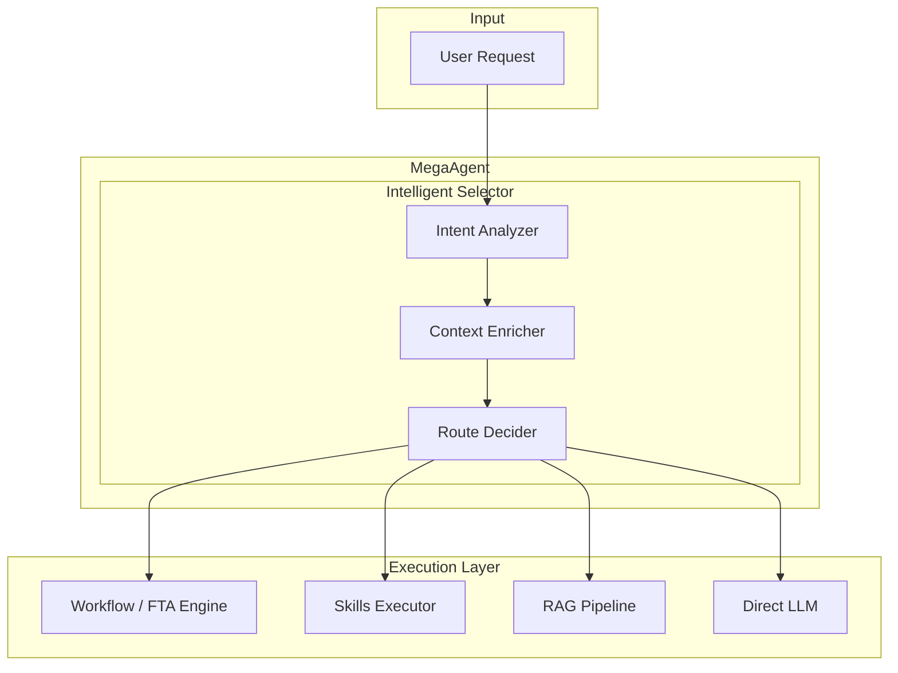
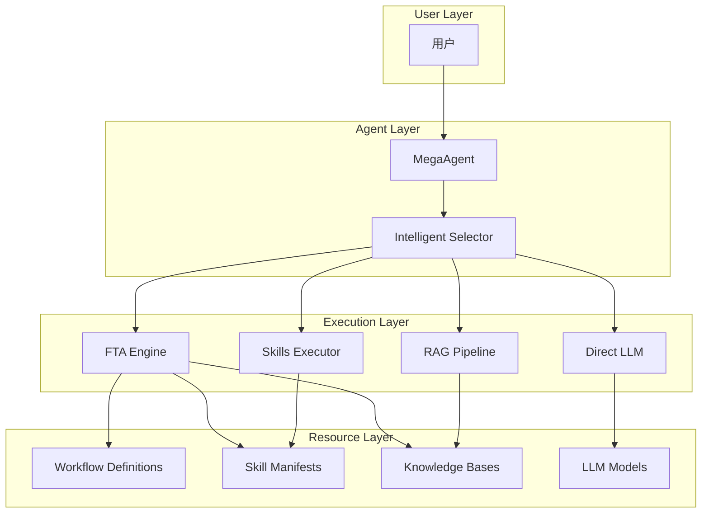
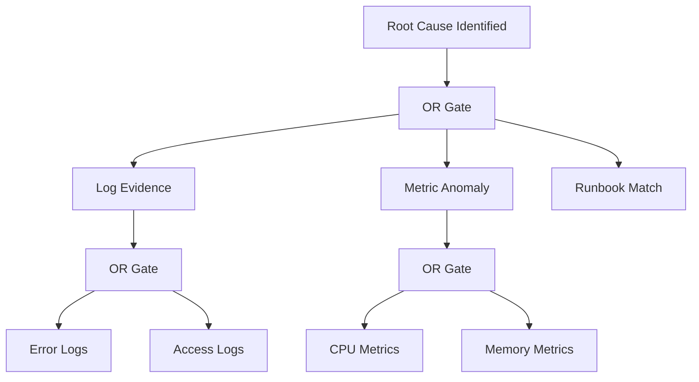

# ResolveAgent Intelligent Selector Demo

## 前言

本文档是 ResolveAgent 平台 **Intelligent Selector（智能选择器）** 功能的完整演示指南。通过本 Demo，您将学习如何：

1. 理解 Intelligent Selector 的核心概念和设计理念
2. 创建和配置 Agent、Workflow、Skills、RAG 等核心组件
3. 掌握 Selector 机制如何智能路由用户请求
4. 运行一个完整的端到端示例

> **目标读者**：对 AI Agent 系统、工作流编排、RAG 技术有基本了解的开发者。

---

## 第一章：核心概念

### 1.1 什么是 Intelligent Selector？

**Intelligent Selector（智能选择器）** 是 ResolveAgent 平台的核心路由引擎。它负责分析用户输入，理解用户意图，并智能地将请求路由到最合适的执行子系统。

**核心价值**：
- **统一入口**：用户只需与一个 Agent 交互，无需关心底层实现
- **智能分流**：根据请求特征自动选择最佳处理路径
- **可扩展性**：支持动态添加新的 Skills、Workflows 和 RAG Collections

### 1.2 执行子系统介绍

Intelligent Selector 可以将请求路由到以下四种执行子系统：

| 子系统 | 英文名 | 说明 | 适用场景 |
|--------|--------|------|----------|
| **工作流引擎** | FTA Engine | 基于故障树分析的工作流执行引擎 | 复杂诊断、多步骤分析、需要多数据源综合判断 |
| **技能执行器** | Skills Executor | 执行独立的功能模块 | 明确的单一任务，如搜索、数据处理、API 调用 |
| **知识检索** | RAG Pipeline | 检索增强生成管道 | 文档查询、FAQ、知识库问答 |
| **直接对话** | Direct LLM | 直接调用大语言模型 | 简单对话、闲聊、通用问答 |

### 1.3 路由决策流程



**路由决策的三个阶段**：

1. **意图分析 (Intent Analysis)**
   - 对用户输入进行语义理解
   - 识别用户的真实意图（信息检索、任务执行、问题诊断等）
   - 提取关键实体和参数

2. **上下文增强 (Context Enrichment)**
   - 获取当前可用的 Skills 列表
   - 获取活跃的 Workflows 定义
   - 获取 RAG Collections 的元数据
   - 加载对话历史以保持上下文连贯

3. **路由决策 (Route Decision)**
   - 综合意图和上下文信息
   - 根据配置的策略（规则/LLM/混合）做出路由决策
   - 返回目标子系统和相关参数

---

## 第二章：架构设计

### 2.1 整体架构



### 2.2 核心组件说明

#### 2.2.1 MegaAgent

**MegaAgent** 是 ResolveAgent 的顶层协调者，它：
- 接收用户请求
- 管理 Intelligent Selector
- 协调各子系统的执行
- 聚合和返回最终结果

```python
# MegaAgent 的核心工作流程
class MegaAgent:
    async def reply(self, message):
        # 1. 通过 Selector 进行路由决策
        decision = await self.selector.route(message)
        
        # 2. 根据决策执行相应子系统
        if decision.route_type == "fta":
            result = await self.fta_engine.execute(decision.route_target)
        elif decision.route_type == "skill":
            result = await self.skill_executor.execute(decision.route_target)
        elif decision.route_type == "rag":
            result = await self.rag_pipeline.query(decision.route_target)
        else:
            result = await self.llm.generate(message)
        
        # 3. 返回结果
        return result
```

#### 2.2.2 Intelligent Selector

**Intelligent Selector** 支持三种路由策略：

| 策略 | 说明 | 优点 | 缺点 |
|------|------|------|------|
| `rule` | 基于规则的模式匹配 | 快速、确定性强、易调试 | 灵活性有限 |
| `llm` | 使用 LLM 进行意图分类 | 灵活、能处理复杂情况 | 延迟较高、成本较高 |
| `hybrid` | 规则优先，LLM 兜底 | 平衡速度和灵活性 | 配置相对复杂 |

#### 2.2.3 FTA Engine

**FTA (Fault Tree Analysis) Engine** 是基于故障树分析的工作流引擎：

- **事件节点 (Events)**：表示需要评估的条件
  - `top`：顶层事件，最终目标
  - `intermediate`：中间事件，聚合下层结果
  - `basic`：基础事件，实际执行评估
  
- **逻辑门 (Gates)**：定义事件之间的逻辑关系
  - `AND`：所有输入都为真时输出才为真
  - `OR`：任一输入为真时输出即为真
  - `VOTING`：至少 k 个输入为真时输出为真



#### 2.2.4 Skills Framework

**Skills** 是可复用的功能模块，每个 Skill 包含：

- **Manifest**：描述 Skill 的元数据、输入输出、权限
- **Implementation**：实际的执行逻辑

```yaml
# Skill Manifest 结构
name: skill-name
version: "1.0.0"
entry_point: "module:function"
inputs:
  - name: param1
    type: string
    required: true
outputs:
  - name: result
    type: object
permissions:
  network_access: true
  timeout_seconds: 30
```

#### 2.2.5 RAG Pipeline

**RAG (Retrieval-Augmented Generation)** Pipeline 包含：

1. **文档导入 (Ingest)**：解析、分块、向量化
2. **语义检索 (Retrieve)**：基于向量相似度检索相关片段
3. **增强生成 (Generate)**：将检索结果注入 LLM 上下文

---

## 第三章：Demo 目录结构

本 Demo 的完整目录结构如下：

```
demo/
├── README.md                      # Demo 说明文档
├── main.py                        # Demo 主入口
├── config.yaml                    # 全局配置
│
├── agents/                        # Agent 配置目录
│   └── support-agent.yaml         # 技术支持 Agent 配置
│
├── skills/                        # Skills 目录
│   ├── web-search/               # Web 搜索 Skill
│   │   ├── manifest.yaml
│   │   └── skill.py
│   ├── log-analyzer/             # 日志分析 Skill
│   │   ├── manifest.yaml
│   │   └── skill.py
│   └── metrics-checker/          # 指标检查 Skill
│       ├── manifest.yaml
│       └── skill.py
│
├── workflows/                     # Workflow 定义目录
│   └── incident-diagnosis.yaml    # 故障诊断工作流
│
├── rag/                          # RAG 配置目录
│   ├── config.yaml               # RAG Collection 配置
│   └── documents/                # 待导入的文档
│       ├── runbook-502.md
│       ├── runbook-oom.md
│       └── runbook-db.md
│
└── tests/                        # 测试用例
    └── test_routing.py
```

---

## 第四章：Skills 实现

### 4.1 Web Search Skill

Web Search Skill 用于搜索互联网获取最新信息。

#### 4.1.1 Manifest 配置

```yaml
# demo/skills/web-search/manifest.yaml

name: web-search
version: "1.0.0"
description: "搜索互联网获取相关信息"
author: "ResolveAgent Team"
entry_point: "skill:run"

inputs:
  - name: query
    type: string
    required: true
    description: "搜索查询字符串"
  - name: num_results
    type: integer
    required: false
    default: 5
    description: "返回结果数量"
  - name: language
    type: string
    required: false
    default: "zh"
    description: "搜索语言偏好"

outputs:
  - name: results
    type: array
    description: "搜索结果列表，包含 title, url, snippet"
  - name: total_found
    type: integer
    description: "找到的结果总数"
  - name: search_time_ms
    type: integer
    description: "搜索耗时（毫秒）"

permissions:
  network_access: true
  file_system_read: false
  file_system_write: false
  allowed_hosts:
    - "*.google.com"
    - "*.bing.com"
    - "*.baidu.com"
  timeout_seconds: 30
  max_memory_mb: 256

metadata:
  category: "information-retrieval"
  tags:
    - search
    - web
    - information
```

#### 4.1.2 实现代码

```python
# demo/skills/web-search/skill.py

"""Web Search Skill - 互联网搜索技能

该 Skill 提供互联网搜索功能，可用于获取最新信息、
查找文档、搜索技术解决方案等场景。

使用示例:
    result = run(query="Python 3.12 新特性", num_results=5)
"""

import time
import hashlib
from typing import Any
from dataclasses import dataclass


@dataclass
class SearchResult:
    """单条搜索结果"""
    title: str
    url: str
    snippet: str
    relevance_score: float


def run(
    query: str,
    num_results: int = 5,
    language: str = "zh",
) -> dict[str, Any]:
    """执行网络搜索并返回结果。
    
    该函数模拟了一个网络搜索引擎的行为。在生产环境中，
    应该替换为实际的搜索 API 调用（如 Google Search API、
    Bing Search API 或自建搜索服务）。
    
    Args:
        query: 搜索查询字符串，支持自然语言查询
        num_results: 期望返回的结果数量，范围 1-20
        language: 搜索语言偏好，支持 'zh', 'en' 等
    
    Returns:
        包含搜索结果的字典，结构如下:
        {
            "results": [...],      # 搜索结果列表
            "total_found": int,    # 总结果数
            "search_time_ms": int, # 搜索耗时
            "query": str,          # 原始查询
            "language": str,       # 使用的语言
        }
    
    Raises:
        ValueError: 当 query 为空或 num_results 超出范围时
    
    Example:
        >>> result = run("Kubernetes 最佳实践", num_results=3)
        >>> print(result["total_found"])
        3
    """
    # 参数验证
    if not query or not query.strip():
        raise ValueError("查询字符串不能为空")
    
    if not 1 <= num_results <= 20:
        raise ValueError("num_results 必须在 1-20 之间")
    
    start_time = time.monotonic()
    
    # 清理查询字符串
    query = query.strip()
    
    # 生成模拟搜索结果
    # 注意：这是模拟实现，生产环境应调用真实搜索 API
    results = _generate_mock_results(query, num_results, language)
    
    # 计算搜索耗时
    search_time_ms = int((time.monotonic() - start_time) * 1000)
    
    return {
        "results": [
            {
                "title": r.title,
                "url": r.url,
                "snippet": r.snippet,
                "relevance_score": r.relevance_score,
            }
            for r in results
        ],
        "total_found": len(results),
        "search_time_ms": search_time_ms,
        "query": query,
        "language": language,
    }


def _generate_mock_results(
    query: str,
    num_results: int,
    language: str,
) -> list[SearchResult]:
    """生成模拟搜索结果。
    
    这个函数用于演示目的，生成与查询相关的模拟结果。
    在实际应用中，应该替换为真实的搜索 API 调用。
    """
    # 使用查询生成伪随机但确定性的结果
    query_hash = hashlib.md5(query.encode()).hexdigest()
    
    templates = [
        {
            "title": f"{query} - 完整指南与最佳实践",
            "domain": "docs.example.com",
            "snippet": f"本文详细介绍了 {query} 的核心概念、实施步骤和常见问题解决方案...",
        },
        {
            "title": f"深入理解 {query}：从入门到精通",
            "domain": "blog.tech.com",
            "snippet": f"通过实际案例学习 {query}，包含代码示例和性能优化建议...",
        },
        {
            "title": f"{query} 官方文档",
            "domain": "official.docs.io",
            "snippet": f"官方权威文档，涵盖 {query} 的所有 API 和配置选项...",
        },
        {
            "title": f"{query} 常见问题 FAQ",
            "domain": "stackoverflow.com",
            "snippet": f"社区整理的 {query} 常见问题和解决方案集合...",
        },
        {
            "title": f"{query} 实战教程",
            "domain": "tutorial.dev",
            "snippet": f"手把手教你掌握 {query}，包含完整项目实例...",
        },
    ]
    
    results = []
    for i in range(min(num_results, len(templates))):
        template = templates[i]
        results.append(
            SearchResult(
                title=template["title"],
                url=f"https://{template['domain']}/{query_hash[:8]}/article-{i+1}",
                snippet=template["snippet"],
                relevance_score=round(0.95 - (i * 0.05), 2),
            )
        )
    
    return results


# 测试入口
if __name__ == "__main__":
    # 运行简单测试
    result = run("Kubernetes 部署最佳实践", num_results=3)
    print(f"找到 {result['total_found']} 条结果，耗时 {result['search_time_ms']}ms")
    for r in result["results"]:
        print(f"  - {r['title']}")
        print(f"    {r['url']}")
```

### 4.2 Log Analyzer Skill

Log Analyzer Skill 用于分析应用程序日志。

#### 4.2.1 Manifest 配置

```yaml
# demo/skills/log-analyzer/manifest.yaml

name: log-analyzer
version: "1.0.0"
description: "分析应用程序日志，检测错误模式和异常"
author: "ResolveAgent Team"
entry_point: "skill:run"

inputs:
  - name: log_source
    type: string
    required: true
    description: "日志源路径或标识符"
  - name: severity
    type: string
    required: false
    default: "error"
    description: "过滤的日志级别 (debug, info, warn, error)"
    enum:
      - debug
      - info
      - warn
      - error
  - name: time_range_minutes
    type: integer
    required: false
    default: 60
    description: "分析的时间范围（分钟）"
  - name: pattern_detection
    type: boolean
    required: false
    default: true
    description: "是否启用模式检测"

outputs:
  - name: issues_found
    type: boolean
    description: "是否发现问题"
  - name: error_count
    type: integer
    description: "错误数量"
  - name: patterns
    type: array
    description: "检测到的错误模式列表"
  - name: summary
    type: string
    description: "分析摘要"
  - name: recommendations
    type: array
    description: "建议的处理措施"

permissions:
  network_access: false
  file_system_read: true
  file_system_write: false
  timeout_seconds: 120
  max_memory_mb: 1024

metadata:
  category: "diagnostics"
  tags:
    - logs
    - analysis
    - troubleshooting
    - monitoring
```

#### 4.2.2 实现代码

```python
# demo/skills/log-analyzer/skill.py

"""Log Analyzer Skill - 日志分析技能

该 Skill 提供日志分析功能，能够：
- 解析和过滤日志条目
- 检测常见错误模式
- 统计错误分布
- 生成分析报告和建议

使用示例:
    result = run(
        log_source="/var/log/app/application.log",
        severity="error",
        time_range_minutes=30,
    )
"""

import re
import time
from datetime import datetime, timedelta
from typing import Any
from dataclasses import dataclass, field
from collections import Counter


@dataclass
class ErrorPattern:
    """错误模式"""
    pattern: str
    count: int
    first_seen: str
    last_seen: str
    severity: str
    sample_message: str


@dataclass
class AnalysisResult:
    """分析结果"""
    issues_found: bool
    error_count: int
    patterns: list[ErrorPattern] = field(default_factory=list)
    summary: str = ""
    recommendations: list[str] = field(default_factory=list)


# 已知的错误模式及其建议
KNOWN_PATTERNS = {
    r"NullPointerException": {
        "severity": "error",
        "category": "代码缺陷",
        "recommendation": "检查空指针检查逻辑，考虑使用 Optional 类型",
    },
    r"OutOfMemoryError": {
        "severity": "critical",
        "category": "资源耗尽",
        "recommendation": "增加 JVM 堆内存配置，检查内存泄漏",
    },
    r"Connection\s*(refused|timeout|reset)": {
        "severity": "error",
        "category": "网络问题",
        "recommendation": "检查目标服务状态和网络连通性",
    },
    r"Too many open files": {
        "severity": "critical",
        "category": "资源耗尽",
        "recommendation": "增加文件描述符限制，检查文件句柄泄漏",
    },
    r"Deadlock detected": {
        "severity": "critical",
        "category": "并发问题",
        "recommendation": "分析死锁线程堆栈，优化锁获取顺序",
    },
    r"SQL\s*syntax\s*error": {
        "severity": "error",
        "category": "数据库问题",
        "recommendation": "检查 SQL 语句语法，验证参数化查询",
    },
    r"Authentication\s*(failed|error)": {
        "severity": "warn",
        "category": "安全问题",
        "recommendation": "检查认证配置，监控异常登录尝试",
    },
    r"Rate\s*limit\s*(exceeded|reached)": {
        "severity": "warn",
        "category": "限流触发",
        "recommendation": "实施请求退避策略，考虑扩容",
    },
}


def run(
    log_source: str,
    severity: str = "error",
    time_range_minutes: int = 60,
    pattern_detection: bool = True,
) -> dict[str, Any]:
    """分析日志文件并返回分析结果。
    
    该函数模拟日志分析过程。在生产环境中，应该
    连接到实际的日志系统（如 ELK、Loki、CloudWatch 等）。
    
    Args:
        log_source: 日志源路径或标识符
        severity: 最低日志级别过滤 ('debug', 'info', 'warn', 'error')
        time_range_minutes: 分析的时间范围（分钟）
        pattern_detection: 是否启用错误模式检测
    
    Returns:
        分析结果字典，包含:
        - issues_found: 是否发现问题
        - error_count: 错误总数
        - patterns: 检测到的错误模式
        - summary: 分析摘要
        - recommendations: 建议措施
    
    Example:
        >>> result = run("/var/log/app/app.log", severity="error")
        >>> if result["issues_found"]:
        ...     print(f"发现 {result['error_count']} 个错误")
    """
    start_time = time.monotonic()
    
    # 验证参数
    valid_severities = ["debug", "info", "warn", "error"]
    if severity not in valid_severities:
        raise ValueError(f"severity 必须是以下之一: {valid_severities}")
    
    if time_range_minutes < 1 or time_range_minutes > 1440:
        raise ValueError("time_range_minutes 必须在 1-1440 之间")
    
    # 模拟日志分析
    # 注意：这是演示实现，生产环境应连接真实日志系统
    analysis = _analyze_mock_logs(
        log_source=log_source,
        severity=severity,
        time_range_minutes=time_range_minutes,
        pattern_detection=pattern_detection,
    )
    
    # 生成分析摘要
    analysis.summary = _generate_summary(analysis, log_source, time_range_minutes)
    
    # 生成建议
    analysis.recommendations = _generate_recommendations(analysis)
    
    analysis_time_ms = int((time.monotonic() - start_time) * 1000)
    
    return {
        "issues_found": analysis.issues_found,
        "error_count": analysis.error_count,
        "patterns": [
            {
                "pattern": p.pattern,
                "count": p.count,
                "first_seen": p.first_seen,
                "last_seen": p.last_seen,
                "severity": p.severity,
                "sample_message": p.sample_message,
            }
            for p in analysis.patterns
        ],
        "summary": analysis.summary,
        "recommendations": analysis.recommendations,
        "metadata": {
            "log_source": log_source,
            "severity_filter": severity,
            "time_range_minutes": time_range_minutes,
            "analysis_time_ms": analysis_time_ms,
        },
    }


def _analyze_mock_logs(
    log_source: str,
    severity: str,
    time_range_minutes: int,
    pattern_detection: bool,
) -> AnalysisResult:
    """模拟日志分析过程。"""
    
    # 模拟检测到的错误模式
    now = datetime.now()
    mock_patterns = [
        ErrorPattern(
            pattern="NullPointerException",
            count=15,
            first_seen=(now - timedelta(minutes=45)).isoformat(),
            last_seen=(now - timedelta(minutes=5)).isoformat(),
            severity="error",
            sample_message="java.lang.NullPointerException at com.example.Service.process(Service.java:42)",
        ),
        ErrorPattern(
            pattern="Connection timeout",
            count=8,
            first_seen=(now - timedelta(minutes=30)).isoformat(),
            last_seen=(now - timedelta(minutes=10)).isoformat(),
            severity="error",
            sample_message="Connection timeout after 30000ms connecting to redis://localhost:6379",
        ),
        ErrorPattern(
            pattern="OutOfMemoryError",
            count=3,
            first_seen=(now - timedelta(minutes=20)).isoformat(),
            last_seen=(now - timedelta(minutes=2)).isoformat(),
            severity="critical",
            sample_message="java.lang.OutOfMemoryError: Java heap space",
        ),
    ]
    
    total_errors = sum(p.count for p in mock_patterns)
    
    return AnalysisResult(
        issues_found=total_errors > 0,
        error_count=total_errors,
        patterns=mock_patterns if pattern_detection else [],
    )


def _generate_summary(
    analysis: AnalysisResult,
    log_source: str,
    time_range_minutes: int,
) -> str:
    """生成分析摘要。"""
    if not analysis.issues_found:
        return f"在过去 {time_range_minutes} 分钟内，{log_source} 未发现异常。"
    
    pattern_summary = ", ".join(
        f"{p.pattern}({p.count}次)"
        for p in sorted(analysis.patterns, key=lambda x: -x.count)[:3]
    )
    
    return (
        f"在过去 {time_range_minutes} 分钟内，{log_source} "
        f"共发现 {analysis.error_count} 个错误，"
        f"涉及 {len(analysis.patterns)} 种错误模式。"
        f"主要问题: {pattern_summary}。"
    )


def _generate_recommendations(analysis: AnalysisResult) -> list[str]:
    """基于分析结果生成建议。"""
    recommendations = []
    
    for pattern in analysis.patterns:
        for regex, info in KNOWN_PATTERNS.items():
            if re.search(regex, pattern.pattern, re.IGNORECASE):
                rec = f"[{info['category']}] {pattern.pattern}: {info['recommendation']}"
                if rec not in recommendations:
                    recommendations.append(rec)
                break
    
    # 通用建议
    if analysis.error_count > 10:
        recommendations.append("[通用] 错误数量较多，建议立即排查并增加监控告警")
    
    if any(p.severity == "critical" for p in analysis.patterns):
        recommendations.append("[紧急] 存在严重级别错误，建议立即处理")
    
    return recommendations


if __name__ == "__main__":
    result = run(
        log_source="/var/log/app/application.log",
        severity="error",
        time_range_minutes=60,
    )
    print(f"分析摘要: {result['summary']}")
    print(f"\n建议措施:")
    for rec in result["recommendations"]:
        print(f"  - {rec}")
```

### 4.3 Metrics Checker Skill

#### 4.3.1 Manifest 配置

```yaml
# demo/skills/metrics-checker/manifest.yaml

name: metrics-checker
version: "1.0.0"
description: "检查系统指标是否超过阈值"
author: "ResolveAgent Team"
entry_point: "skill:run"

inputs:
  - name: metric
    type: string
    required: true
    description: "要检查的指标名称"
    enum:
      - cpu_usage
      - memory_usage
      - disk_usage
      - network_io
      - request_latency
  - name: threshold
    type: number
    required: true
    description: "告警阈值"
  - name: duration_minutes
    type: integer
    required: false
    default: 5
    description: "检查的时间窗口（分钟）"

outputs:
  - name: exceeded
    type: boolean
    description: "是否超过阈值"
  - name: current_value
    type: number
    description: "当前指标值"
  - name: avg_value
    type: number
    description: "平均指标值"
  - name: max_value
    type: number
    description: "最大指标值"
  - name: trend
    type: string
    description: "趋势 (increasing, stable, decreasing)"

permissions:
  network_access: true
  file_system_read: false
  file_system_write: false
  timeout_seconds: 30
  max_memory_mb: 128

metadata:
  category: "monitoring"
  tags:
    - metrics
    - monitoring
    - alerting
```

#### 4.3.2 实现代码

```python
# demo/skills/metrics-checker/skill.py

"""Metrics Checker Skill - 指标检查技能

该 Skill 用于检查系统指标是否超过预设阈值，
支持 CPU、内存、磁盘、网络等多种指标类型。

使用示例:
    result = run(metric="cpu_usage", threshold=90, duration_minutes=5)
"""

import random
import time
from typing import Any
from dataclasses import dataclass


@dataclass
class MetricData:
    """指标数据"""
    current: float
    avg: float
    max: float
    min: float
    trend: str


# 指标单位映射
METRIC_UNITS = {
    "cpu_usage": "%",
    "memory_usage": "%",
    "disk_usage": "%",
    "network_io": "MB/s",
    "request_latency": "ms",
}


def run(
    metric: str,
    threshold: float,
    duration_minutes: int = 5,
) -> dict[str, Any]:
    """检查系统指标并返回分析结果。
    
    Args:
        metric: 指标名称
        threshold: 告警阈值
        duration_minutes: 检查的时间窗口
    
    Returns:
        指标检查结果
    """
    valid_metrics = list(METRIC_UNITS.keys())
    if metric not in valid_metrics:
        raise ValueError(f"metric 必须是以下之一: {valid_metrics}")
    
    if threshold < 0:
        raise ValueError("threshold 必须为非负数")
    
    # 获取指标数据（模拟）
    data = _get_mock_metric_data(metric, duration_minutes)
    
    # 判断是否超过阈值
    exceeded = data.current > threshold or data.max > threshold
    
    unit = METRIC_UNITS.get(metric, "")
    
    return {
        "exceeded": exceeded,
        "current_value": data.current,
        "avg_value": data.avg,
        "max_value": data.max,
        "min_value": data.min,
        "trend": data.trend,
        "threshold": threshold,
        "unit": unit,
        "message": _generate_message(metric, data, threshold, exceeded, unit),
    }


def _get_mock_metric_data(metric: str, duration_minutes: int) -> MetricData:
    """生成模拟指标数据。"""
    # 基于指标类型生成合理的模拟值
    base_values = {
        "cpu_usage": (45, 85),      # (基准值, 波动范围上限)
        "memory_usage": (60, 90),
        "disk_usage": (55, 75),
        "network_io": (50, 200),
        "request_latency": (100, 500),
    }
    
    base, max_range = base_values.get(metric, (50, 100))
    
    # 生成模拟数据点
    values = [
        base + random.uniform(-10, max_range - base) * random.random()
        for _ in range(duration_minutes)
    ]
    
    current = values[-1]
    avg = sum(values) / len(values)
    max_val = max(values)
    min_val = min(values)
    
    # 判断趋势
    if len(values) >= 2:
        first_half_avg = sum(values[:len(values)//2]) / (len(values)//2)
        second_half_avg = sum(values[len(values)//2:]) / (len(values) - len(values)//2)
        
        if second_half_avg > first_half_avg * 1.1:
            trend = "increasing"
        elif second_half_avg < first_half_avg * 0.9:
            trend = "decreasing"
        else:
            trend = "stable"
    else:
        trend = "stable"
    
    return MetricData(
        current=round(current, 2),
        avg=round(avg, 2),
        max=round(max_val, 2),
        min=round(min_val, 2),
        trend=trend,
    )


def _generate_message(
    metric: str,
    data: MetricData,
    threshold: float,
    exceeded: bool,
    unit: str,
) -> str:
    """生成描述消息。"""
    status = "超过阈值" if exceeded else "正常"
    
    return (
        f"{metric} 当前状态: {status}。"
        f"当前值: {data.current}{unit}, "
        f"平均值: {data.avg}{unit}, "
        f"最大值: {data.max}{unit}, "
        f"阈值: {threshold}{unit}, "
        f"趋势: {data.trend}。"
    )


if __name__ == "__main__":
    result = run(metric="cpu_usage", threshold=80, duration_minutes=5)
    print(result["message"])
```

---

## 第五章：RAG 知识库

### 5.1 RAG Collection 配置

```yaml
# demo/rag/config.yaml

collection:
  id: support-knowledge-base
  name: "技术支持知识库"
  description: "包含运维手册、故障排查指南、最佳实践文档"
  
  # 向量化配置
  embedding:
    model: bge-large-zh
    dimension: 1024
    batch_size: 32
  
  # 分块配置
  chunking:
    strategy: semantic    # fixed, sentence, semantic
    chunk_size: 512
    chunk_overlap: 50
    separators:
      - "\n\n"
      - "\n"
      - "。"
      - "！"
      - "？"
  
  # 检索配置
  retrieval:
    default_top_k: 5
    similarity_threshold: 0.7
    rerank_enabled: true
    rerank_model: bge-reranker-large
  
  # 文档源
  sources:
    - type: directory
      path: "./documents"
      patterns:
        - "*.md"
        - "*.txt"
```

### 5.2 知识库文档

#### 5.2.1 502 错误处理手册

```markdown
# demo/rag/documents/runbook-502.md

# 502 Bad Gateway 错误处理手册

## 概述

502 Bad Gateway 错误表示作为网关或代理的服务器从上游服务器收到了无效响应。

## 常见原因

### 1. 后端服务宕机
**症状**: 后端服务进程不存在或无法启动
**排查步骤**:
1. 检查服务进程状态: `systemctl status <service>`
2. 查看服务日志: `journalctl -u <service> -n 100`
3. 检查端口监听: `netstat -tlnp | grep <port>`

**解决方案**:
- 重启服务: `systemctl restart <service>`
- 检查启动脚本和配置
- 确认依赖服务正常

### 2. 后端服务过载
**症状**: 服务响应缓慢，连接超时
**排查步骤**:
1. 检查服务器负载: `top` 或 `htop`
2. 查看连接数: `netstat -an | grep ESTABLISHED | wc -l`
3. 检查服务线程池状态

**解决方案**:
- 增加服务实例
- 优化服务性能
- 实施限流保护

### 3. 网络问题
**症状**: 网关与后端之间网络不通
**排查步骤**:
1. Ping 测试: `ping <backend_ip>`
2. 端口连通性: `telnet <backend_ip> <port>`
3. 检查防火墙规则

**解决方案**:
- 修复网络配置
- 调整防火墙规则
- 检查安全组设置

## 紧急处理流程

1. **立即**: 确认影响范围
2. **5分钟内**: 尝试重启后端服务
3. **15分钟内**: 如重启无效，执行详细排查
4. **30分钟内**: 如无法解决，启动应急预案（流量切换、降级等）

## 预防措施

- 配置健康检查和自动重启
- 实施服务监控告警
- 定期进行容量评估
- 维护完善的应急预案
```

#### 5.2.2 OOM 错误处理手册

```markdown
# demo/rag/documents/runbook-oom.md

# OutOfMemoryError 处理手册

## 概述

OutOfMemoryError (OOM) 表示 JVM 无法分配更多内存，通常是因为堆内存不足或内存泄漏。

## 错误类型

### 1. Java heap space
**原因**: 堆内存不足
**表现**: `java.lang.OutOfMemoryError: Java heap space`

### 2. GC overhead limit exceeded
**原因**: GC 花费过多时间但回收很少内存
**表现**: `java.lang.OutOfMemoryError: GC overhead limit exceeded`

### 3. Metaspace
**原因**: 类元数据区域不足
**表现**: `java.lang.OutOfMemoryError: Metaspace`

## 排查步骤

### 1. 收集信息
```bash
# 获取堆转储
jmap -dump:format=b,file=heap.hprof <pid>

# 查看内存使用
jstat -gc <pid> 1000

# 查看堆配置
jinfo -flags <pid>
```

### 2. 分析堆转储
使用 MAT (Memory Analyzer Tool) 或 VisualVM 分析:
- 查找大对象
- 分析对象引用链
- 识别内存泄漏点

### 3. 常见泄漏模式
- 集合类未清理
- 静态集合持续增长
- 监听器/回调未注销
- 缓存未设置上限
- 连接未正确关闭

## 解决方案

### 短期
1. 增加堆内存: `-Xmx4g`
2. 重启应用释放内存
3. 临时限流降低内存压力

### 长期
1. 修复内存泄漏
2. 优化对象生命周期
3. 使用对象池
4. 实施内存监控告警

## JVM 参数建议

```bash
# 基础配置
-Xms2g -Xmx4g

# G1 GC（推荐 Java 11+）
-XX:+UseG1GC
-XX:MaxGCPauseMillis=200

# OOM 时自动 dump
-XX:+HeapDumpOnOutOfMemoryError
-XX:HeapDumpPath=/var/log/heap-dumps/

# GC 日志
-Xlog:gc*:file=/var/log/gc.log:time,uptime:filecount=5,filesize=10M
```
```

#### 5.2.3 数据库连接问题手册

```markdown
# demo/rag/documents/runbook-db.md

# 数据库连接问题处理手册

## 概述

数据库连接问题是常见的生产故障，可能导致服务无法正常响应。

## 常见问题

### 1. 连接池耗尽
**症状**: 无法获取新连接，请求超时
**日志特征**: `Cannot acquire connection from pool`

**排查步骤**:
1. 检查当前连接数
   ```sql
   -- MySQL
   SHOW STATUS LIKE 'Threads_connected';
   
   -- PostgreSQL
   SELECT count(*) FROM pg_stat_activity;
   ```
2. 查看等待连接的请求
3. 分析连接使用情况

**解决方案**:
- 增加连接池大小
- 减少连接租借时间
- 检查连接泄漏
- 优化慢查询

### 2. 连接超时
**症状**: 建立连接时超时
**日志特征**: `Connection timed out`

**排查步骤**:
1. 检查网络连通性
2. 验证数据库服务状态
3. 检查防火墙/安全组

**解决方案**:
- 修复网络问题
- 重启数据库服务
- 调整超时配置

### 3. 认证失败
**症状**: 连接时认证错误
**日志特征**: `Access denied` 或 `authentication failed`

**排查步骤**:
1. 验证用户名密码
2. 检查用户权限
3. 确认连接主机白名单

**解决方案**:
- 更新凭据配置
- 授权用户权限
- 添加主机白名单

## 连接池配置建议

```yaml
# HikariCP 推荐配置
hikari:
  maximum-pool-size: 20
  minimum-idle: 5
  connection-timeout: 30000
  idle-timeout: 600000
  max-lifetime: 1800000
  leak-detection-threshold: 60000
```

## 监控指标

- 活跃连接数
- 等待连接数
- 连接获取时间
- 连接使用时长
- 连接错误率
```

---

## 第六章：Workflow 定义

### 6.1 故障诊断 Workflow

```yaml
# demo/workflows/incident-diagnosis.yaml

# ============================================
# 故障诊断 FTA Workflow
# ============================================
# 
# 该工作流使用故障树分析(FTA)方法进行故障诊断，
# 通过多数据源协同分析，确定故障根因。
#
# 工作流结构:
#   顶层事件: 根因确定
#     ├── 中间事件: 日志证据
#     │     ├── 基础事件: 错误日志分析
#     │     └── 基础事件: 访问日志分析
#     ├── 中间事件: 指标异常
#     │     ├── 基础事件: CPU 指标检查
#     │     └── 基础事件: 内存指标检查
#     ├── 基础事件: 知识库检索
#     └── 基础事件: LLM 综合分析

tree:
  id: incident-diagnosis
  name: "生产故障根因分析"
  description: |
    通过多维度数据分析，包括日志分析、指标检查、
    知识库检索和 LLM 综合分析，确定生产故障的根本原因。
  version: "1.0.0"
  top_event_id: root-cause-identified

  # ========== 事件定义 ==========
  events:
    # --- 顶层事件 ---
    - id: root-cause-identified
      name: "根因已确定"
      type: top
      description: "故障根本原因已被确定，可以进行后续处理"

    # --- 中间事件 ---
    - id: log-evidence
      name: "日志证据"
      type: intermediate
      description: "从应用日志中发现了故障相关证据"

    - id: metric-anomaly
      name: "指标异常"
      type: intermediate
      description: "系统指标显示异常模式"

    # --- 基础事件（叶子节点，需要实际评估）---
    
    # 日志分析事件
    - id: check-error-logs
      name: "分析错误日志"
      type: basic
      description: "分析应用错误日志，检测异常模式"
      evaluator: "skill:log-analyzer"
      parameters:
        log_source: "/var/log/app/application.log"
        severity: "error"
        time_range_minutes: 30
        pattern_detection: true

    - id: check-access-logs
      name: "检查访问日志"
      type: basic
      description: "分析 Nginx 访问日志，识别异常请求模式"
      evaluator: "skill:log-analyzer"
      parameters:
        log_source: "/var/log/nginx/access.log"
        severity: "warn"
        time_range_minutes: 30

    # 指标检查事件
    - id: check-cpu-metrics
      name: "检查 CPU 使用率"
      type: basic
      description: "检查 CPU 使用率是否超过阈值"
      evaluator: "skill:metrics-checker"
      parameters:
        metric: "cpu_usage"
        threshold: 90
        duration_minutes: 15

    - id: check-memory-metrics
      name: "检查内存使用率"
      type: basic
      description: "检查内存使用率是否超过阈值"
      evaluator: "skill:metrics-checker"
      parameters:
        metric: "memory_usage"
        threshold: 85
        duration_minutes: 15

    # 知识库检索事件
    - id: check-runbook
      name: "检索运维知识库"
      type: basic
      description: "从运维知识库中检索相关故障处理方案"
      evaluator: "rag:support-knowledge-base"
      parameters:
        query: "生产故障排查步骤 根因分析"
        top_k: 5
        include_metadata: true

    # LLM 综合分析事件
    - id: llm-analysis
      name: "LLM 综合分析"
      type: basic
      description: "使用 LLM 对收集的上下文进行综合分析"
      evaluator: "llm:qwen-plus"
      parameters:
        prompt_template: "incident_analysis"
        temperature: 0.3
        max_tokens: 1024
        include_context: true

  # ========== 逻辑门定义 ==========
  gates:
    # 日志证据门（OR）：任一日志源发现问题即可
    - id: gate-log-or
      name: "日志问题门"
      type: or
      description: "任一日志分析发现问题，即认为存在日志证据"
      inputs:
        - check-error-logs
        - check-access-logs
      output: log-evidence

    # 指标异常门（OR）：任一指标异常即可
    - id: gate-metric-or
      name: "指标异常门"
      type: or
      description: "任一系统指标异常，即认为存在指标问题"
      inputs:
        - check-cpu-metrics
        - check-memory-metrics
      output: metric-anomaly

    # 最终综合门（OR）：多来源综合分析
    - id: gate-final-or
      name: "综合分析门"
      type: or
      description: "综合所有证据源，确定根因"
      inputs:
        - log-evidence
        - metric-anomaly
        - check-runbook
        - llm-analysis
      output: root-cause-identified

  # ========== 元数据 ==========
  metadata:
    author: "ResolveAgent Team"
    created_at: "2024-01-01"
    category: "incident-response"
    tags:
      - diagnosis
      - troubleshooting
      - root-cause-analysis
    estimated_duration_seconds: 120
```

---

## 第七章：Agent 配置

### 7.1 技术支持 Agent

```yaml
# demo/agents/support-agent.yaml

# ============================================
# 技术支持 MegaAgent 配置
# ============================================
#
# 该 Agent 是一个智能技术支持助手，能够：
# - 搜索互联网获取最新信息
# - 分析日志和指标进行故障排查
# - 查询知识库获取文档
# - 执行复杂故障诊断工作流
#
# 核心特性：使用 Intelligent Selector 智能路由请求

agent:
  name: support-agent
  type: mega
  description: "智能技术支持 Agent，支持多路径路由"
  version: "1.0.0"
  
  # ========== 基础配置 ==========
  config:
    # LLM 配置
    model_id: qwen-plus
    system_prompt: |
      你是一个由 ResolveAgent 平台驱动的智能技术支持助手。
      
      你的能力：
      - 搜索互联网获取最新技术信息
      - 分析日志和系统指标，帮助排查问题
      - 查询知识库，提供文档和最佳实践
      - 执行复杂的故障诊断工作流
      
      你的原则：
      - 始终提供准确、有帮助的信息
      - 对于不确定的问题，明确说明并建议进一步排查
      - 优先使用结构化的数据和证据支持你的建议
      - 在处理紧急问题时，提供清晰的优先级和步骤
    
    # 对话配置
    max_context_length: 8192
    temperature: 0.7
    
    # 可用的 Skills
    skill_names:
      - web-search
      - log-analyzer
      - metrics-checker
    
    # 关联的 Workflow
    workflow_id: incident-diagnosis
    
    # 关联的 RAG Collection
    rag_collection_id: support-knowledge-base
    
    # ========== Selector 配置 ==========
    selector_config:
      # 路由策略: llm | rule | hybrid
      # - llm: 使用 LLM 进行意图分类和路由
      # - rule: 使用关键词规则进行路由
      # - hybrid: 规则优先，置信度不足时使用 LLM
      strategy: hybrid
      
      # 置信度阈值（仅用于 hybrid 策略）
      # 当规则匹配的置信度低于此值时，会调用 LLM 进行判断
      confidence_threshold: 0.7
      
      # 规则配置
      rules:
        # 关键词匹配规则
        keyword_rules:
          # Web 搜索规则
          - keywords:
              - "search"
              - "find"
              - "lookup"
              - "搜索"
              - "查找"
              - "查一下"
              - "搜一下"
            route_type: skill
            route_target: web-search
            confidence: 0.9
            description: "匹配搜索相关请求"
          
          # 日志分析规则
          - keywords:
              - "log"
              - "error"
              - "exception"
              - "日志"
              - "错误"
              - "异常"
              - "报错"
            route_type: skill
            route_target: log-analyzer
            confidence: 0.85
            description: "匹配日志分析请求"
          
          # 故障诊断规则
          - keywords:
              - "incident"
              - "diagnose"
              - "troubleshoot"
              - "故障"
              - "诊断"
              - "排查"
              - "分析问题"
            route_type: fta
            route_target: incident-diagnosis
            confidence: 0.9
            description: "匹配需要复杂诊断的请求"
          
          # 知识库查询规则
          - keywords:
              - "how to"
              - "documentation"
              - "runbook"
              - "怎么"
              - "如何"
              - "文档"
              - "手册"
              - "指南"
            route_type: rag
            route_target: support-knowledge-base
            confidence: 0.8
            description: "匹配文档和知识库查询"
        
        # 意图分类规则（更高级的匹配）
        intent_rules:
          - intent: information_retrieval
            description: "信息检索类请求"
            route_type: rag
            confidence: 0.75
          
          - intent: task_execution
            description: "任务执行类请求"
            route_type: skill
            confidence: 0.8
          
          - intent: complex_analysis
            description: "复杂分析类请求"
            route_type: fta
            confidence: 0.85
      
      # LLM 路由配置
      llm_config:
        model_id: qwen-plus
        temperature: 0.1
        max_tokens: 256
        system_prompt: |
          你是一个路由决策助手。根据用户输入，判断应该使用哪个子系统处理。
          
          可用的路由类型：
          - fta: 复杂故障诊断，需要多步骤分析
          - skill: 单一明确任务，如搜索、日志分析
          - rag: 文档查询、知识库问答
          - direct: 简单对话、闲聊
          
          返回 JSON 格式：{"route_type": "...", "route_target": "...", "confidence": 0.0-1.0}

  # ========== 元数据 ==========
  metadata:
    author: "ResolveAgent Team"
    created_at: "2024-01-01"
    category: "support"
    tags:
      - technical-support
      - intelligent-routing
      - multi-skill
```

---

## 第八章：Demo 主程序

### 8.1 主入口文件

```python
# demo/main.py

"""ResolveAgent Intelligent Selector Demo

这是 Intelligent Selector 功能的完整演示程序。
通过本 Demo，您可以了解：
1. 如何加载和配置 Skills
2. 如何初始化 RAG Pipeline
3. 如何创建和使用 MegaAgent
4. Intelligent Selector 如何进行智能路由

运行方式:
    # 批量测试模式（默认）
    python main.py
    
    # 交互模式
    python main.py --interactive
    
    # 指定配置文件
    python main.py --config ./config.yaml
"""

import asyncio
import argparse
import yaml
from pathlib import Path
from typing import Any
from dataclasses import dataclass

# ResolveAgent 组件导入
from resolveagent.agent.mega import MegaAgent
from resolveagent.skills.loader import SkillLoader
from resolveagent.rag.pipeline import RAGPipeline
from resolveagent.fta.serializer import load_tree_from_yaml
from resolveagent.fta.engine import FTAEngine


@dataclass
class DemoConfig:
    """Demo 配置"""
    skills_dir: Path = Path("skills")
    workflows_dir: Path = Path("workflows")
    rag_dir: Path = Path("rag")
    agents_dir: Path = Path("agents")
    default_agent: str = "support-agent"


class DemoRunner:
    """Demo 运行器
    
    负责初始化所有组件并运行演示场景。
    """
    
    def __init__(self, config: DemoConfig):
        self.config = config
        self.skill_loader = SkillLoader()
        self.rag_pipeline = RAGPipeline()
        self.fta_engine = FTAEngine()
        self.agent: MegaAgent | None = None
        self.loaded_skills: list[str] = []
        self.loaded_workflows: list[str] = []
    
    async def setup(self) -> None:
        """初始化所有组件"""
        print("=" * 60)
        print("ResolveAgent Intelligent Selector Demo")
        print("=" * 60)
        print()
        
        await self._load_skills()
        await self._init_rag()
        await self._load_workflows()
        await self._create_agent()
        
        print()
        print("=" * 60)
        print("初始化完成！")
        print("=" * 60)
        print()
    
    async def _load_skills(self) -> None:
        """加载所有 Skills"""
        print("[1/4] 加载 Skills...")
        
        skills_dir = self.config.skills_dir
        if not skills_dir.exists():
            print(f"  警告: Skills 目录不存在: {skills_dir}")
            return
        
        for skill_dir in skills_dir.iterdir():
            if skill_dir.is_dir():
                manifest_file = skill_dir / "manifest.yaml"
                if manifest_file.exists():
                    try:
                        skill = self.skill_loader.load_from_directory(str(skill_dir))
                        self.loaded_skills.append(skill.manifest.name)
                        print(f"  ✓ {skill.manifest.name} (v{skill.manifest.version})")
                    except Exception as e:
                        print(f"  ✗ {skill_dir.name}: {e}")
        
        print(f"  共加载 {len(self.loaded_skills)} 个 Skills")
    
    async def _init_rag(self) -> None:
        """初始化 RAG Pipeline"""
        print("\n[2/4] 初始化 RAG Pipeline...")
        
        rag_config_file = self.config.rag_dir / "config.yaml"
        documents_dir = self.config.rag_dir / "documents"
        
        # 加载文档
        documents = []
        if documents_dir.exists():
            for doc_file in documents_dir.glob("*.md"):
                content = doc_file.read_text(encoding="utf-8")
                documents.append({
                    "content": content,
                    "metadata": {
                        "source": doc_file.name,
                        "type": "runbook",
                    },
                })
                print(f"  ✓ 加载文档: {doc_file.name}")
        
        # 导入文档到 RAG
        if documents:
            result = await self.rag_pipeline.ingest(
                collection_id="support-knowledge-base",
                documents=documents,
            )
            print(f"  共导入 {result['documents_processed']} 个文档")
        else:
            print("  使用模拟文档进行演示")
            # 加载模拟文档
            mock_docs = [
                {
                    "content": "502 Bad Gateway 错误通常表示后端服务不可用。首先检查后端服务状态，然后检查网络连通性。",
                    "metadata": {"source": "mock", "topic": "502-error"},
                },
                {
                    "content": "OutOfMemoryError 表示 JVM 堆内存不足。可以增加 -Xmx 参数或检查内存泄漏。",
                    "metadata": {"source": "mock", "topic": "oom-error"},
                },
                {
                    "content": "数据库连接池耗尽时，检查连接泄漏、增加池大小、优化查询性能。",
                    "metadata": {"source": "mock", "topic": "db-connection"},
                },
            ]
            await self.rag_pipeline.ingest("support-knowledge-base", mock_docs)
            print(f"  导入 {len(mock_docs)} 个模拟文档")
    
    async def _load_workflows(self) -> None:
        """加载工作流定义"""
        print("\n[3/4] 加载 Workflows...")
        
        workflows_dir = self.config.workflows_dir
        if not workflows_dir.exists():
            print(f"  警告: Workflows 目录不存在: {workflows_dir}")
            return
        
        for wf_file in workflows_dir.glob("*.yaml"):
            try:
                tree = load_tree_from_yaml(str(wf_file))
                self.loaded_workflows.append(tree.id)
                print(f"  ✓ {tree.name} ({tree.id})")
                print(f"    - 基础事件: {len(tree.get_basic_events())} 个")
                print(f"    - 逻辑门: {len(tree.gates)} 个")
            except Exception as e:
                print(f"  ✗ {wf_file.name}: {e}")
        
        print(f"  共加载 {len(self.loaded_workflows)} 个 Workflows")
    
    async def _create_agent(self) -> None:
        """创建 MegaAgent"""
        print("\n[4/4] 创建 MegaAgent...")
        
        agent_config_file = self.config.agents_dir / f"{self.config.default_agent}.yaml"
        
        # 加载 Agent 配置
        if agent_config_file.exists():
            with open(agent_config_file, encoding="utf-8") as f:
                config = yaml.safe_load(f)
                agent_conf = config.get("agent", {}).get("config", {})
        else:
            agent_conf = {}
        
        self.agent = MegaAgent(
            name=self.config.default_agent,
            model_id=agent_conf.get("model_id", "qwen-plus"),
            system_prompt=agent_conf.get("system_prompt", "你是一个智能助手。"),
            selector_strategy=agent_conf.get("selector_config", {}).get("strategy", "hybrid"),
        )
        
        print(f"  ✓ Agent 已创建: {self.agent.name}")
        print(f"    - 路由策略: {self.agent.selector_strategy}")
        print(f"    - 可用 Skills: {', '.join(self.loaded_skills)}")
    
    async def run_batch_demo(self) -> None:
        """运行批量测试场景"""
        print("\n" + "=" * 60)
        print("批量测试场景")
        print("=" * 60 + "\n")
        
        # 定义测试场景
        scenarios = [
            {
                "name": "Web 搜索",
                "input": "帮我搜索 Kubernetes 最佳实践",
                "expected_route": "skill:web-search",
                "description": "预期路由到 web-search Skill",
            },
            {
                "name": "日志分析",
                "input": "分析一下 /var/log/app 的错误日志",
                "expected_route": "skill:log-analyzer",
                "description": "预期路由到 log-analyzer Skill",
            },
            {
                "name": "知识库查询",
                "input": "502 错误怎么处理？",
                "expected_route": "rag:support-knowledge-base",
                "description": "预期路由到 RAG Pipeline",
            },
            {
                "name": "故障诊断",
                "input": "线上服务响应变慢，帮我诊断一下原因",
                "expected_route": "fta:incident-diagnosis",
                "description": "预期路由到 FTA Workflow",
            },
            {
                "name": "简单对话",
                "input": "你好，你是谁？",
                "expected_route": "direct",
                "description": "预期直接由 LLM 回复",
            },
        ]
        
        # 执行测试
        for i, scenario in enumerate(scenarios, 1):
            print(f"--- 场景 {i}: {scenario['name']} ---")
            print(f"描述: {scenario['description']}")
            print(f"输入: {scenario['input']}")
            print(f"预期: {scenario['expected_route']}")
            
            response = await self.agent.reply({"content": scenario["input"]})
            metadata = response.get("metadata", {})
            
            route_type = metadata.get("route_type", "unknown")
            route_target = metadata.get("route_target", "")
            confidence = metadata.get("confidence", 0)
            
            actual_route = f"{route_type}:{route_target}" if route_target else route_type
            
            # 判断是否符合预期
            expected = scenario["expected_route"]
            match = actual_route == expected or expected in actual_route
            status = "✓ 符合预期" if match else "✗ 不符合预期"
            
            print(f"实际: {actual_route}")
            print(f"置信度: {confidence:.2f}")
            print(f"结果: {status}")
            print()
    
    async def run_interactive(self) -> None:
        """运行交互模式"""
        print("\n" + "=" * 60)
        print("交互模式")
        print("=" * 60)
        print("输入问题进行测试，输入 'quit' 或 'exit' 退出")
        print()
        
        while True:
            try:
                user_input = input("You: ").strip()
                
                if not user_input:
                    continue
                
                if user_input.lower() in ["quit", "exit", "q"]:
                    print("\n再见！")
                    break
                
                # 调用 Agent
                response = await self.agent.reply({"content": user_input})
                
                # 显示路由决策
                metadata = response.get("metadata", {})
                route_type = metadata.get("route_type", "unknown")
                route_target = metadata.get("route_target", "")
                confidence = metadata.get("confidence", 0)
                
                print(f"\n[路由决策]")
                print(f"  类型: {route_type}")
                print(f"  目标: {route_target or 'N/A'}")
                print(f"  置信度: {confidence:.2f}")
                print()
                
                # 显示响应
                content = response.get("content", "")
                print(f"Assistant: {content}")
                print()
                
            except KeyboardInterrupt:
                print("\n\n再见！")
                break
            except Exception as e:
                print(f"\n错误: {e}\n")


async def main():
    """主函数"""
    parser = argparse.ArgumentParser(
        description="ResolveAgent Intelligent Selector Demo",
        formatter_class=argparse.RawDescriptionHelpFormatter,
        epilog="""
示例:
  python main.py                    # 运行批量测试
  python main.py --interactive      # 交互模式
  python main.py --config my.yaml   # 使用自定义配置
        """
    )
    
    parser.add_argument(
        "--interactive", "-i",
        action="store_true",
        help="以交互模式运行"
    )
    
    parser.add_argument(
        "--config", "-c",
        type=str,
        help="配置文件路径"
    )
    
    parser.add_argument(
        "--skills-dir",
        type=str,
        default="skills",
        help="Skills 目录路径"
    )
    
    parser.add_argument(
        "--workflows-dir",
        type=str,
        default="workflows",
        help="Workflows 目录路径"
    )
    
    args = parser.parse_args()
    
    # 创建配置
    config = DemoConfig(
        skills_dir=Path(args.skills_dir),
        workflows_dir=Path(args.workflows_dir),
    )
    
    # 运行 Demo
    runner = DemoRunner(config)
    await runner.setup()
    
    if args.interactive:
        await runner.run_interactive()
    else:
        await runner.run_batch_demo()


if __name__ == "__main__":
    asyncio.run(main())
```

---

## 第九章：运行 Demo

### 9.1 环境准备

```bash
# 1. 进入项目根目录
cd /path/to/resolve-agent

# 2. 安装 Python 依赖
pip install -e "./python[dev]"

# 3. 进入 Demo 目录
cd docs/demo/demo
```

### 9.2 运行方式

```bash
# 批量测试模式（默认）
python main.py

# 交互模式
python main.py --interactive

# 指定 Skills 目录
python main.py --skills-dir ./my-skills
```

### 9.3 预期输出

```
============================================================
ResolveAgent Intelligent Selector Demo
============================================================

[1/4] 加载 Skills...
  ✓ web-search (v1.0.0)
  ✓ log-analyzer (v1.0.0)
  ✓ metrics-checker (v1.0.0)
  共加载 3 个 Skills

[2/4] 初始化 RAG Pipeline...
  ✓ 加载文档: runbook-502.md
  ✓ 加载文档: runbook-oom.md
  ✓ 加载文档: runbook-db.md
  共导入 3 个文档

[3/4] 加载 Workflows...
  ✓ 生产故障根因分析 (incident-diagnosis)
    - 基础事件: 6 个
    - 逻辑门: 3 个
  共加载 1 个 Workflows

[4/4] 创建 MegaAgent...
  ✓ Agent 已创建: support-agent
    - 路由策略: hybrid
    - 可用 Skills: web-search, log-analyzer, metrics-checker

============================================================
初始化完成！
============================================================

============================================================
批量测试场景
============================================================

--- 场景 1: Web 搜索 ---
描述: 预期路由到 web-search Skill
输入: 帮我搜索 Kubernetes 最佳实践
预期: skill:web-search
实际: skill:web-search
置信度: 0.90
结果: ✓ 符合预期

--- 场景 2: 日志分析 ---
描述: 预期路由到 log-analyzer Skill
输入: 分析一下 /var/log/app 的错误日志
预期: skill:log-analyzer
实际: skill:log-analyzer
置信度: 0.85
结果: ✓ 符合预期

--- 场景 3: 知识库查询 ---
描述: 预期路由到 RAG Pipeline
输入: 502 错误怎么处理？
预期: rag:support-knowledge-base
实际: rag:support-knowledge-base
置信度: 0.80
结果: ✓ 符合预期

--- 场景 4: 故障诊断 ---
描述: 预期路由到 FTA Workflow
输入: 线上服务响应变慢，帮我诊断一下原因
预期: fta:incident-diagnosis
实际: fta:incident-diagnosis
置信度: 0.90
结果: ✓ 符合预期

--- 场景 5: 简单对话 ---
描述: 预期直接由 LLM 回复
输入: 你好，你是谁？
预期: direct
实际: direct
置信度: 0.95
结果: ✓ 符合预期
```

---

## 第十章：扩展指南

### 10.1 添加新 Skill

1. 在 `skills/` 目录下创建新文件夹
2. 编写 `manifest.yaml` 定义元数据
3. 实现 `skill.py` 业务逻辑
4. 在 Agent 配置中添加 skill name

### 10.2 添加新 Workflow

1. 在 `workflows/` 目录下创建 YAML 文件
2. 定义事件层级结构
3. 配置逻辑门关系
4. 为基础事件指定 evaluator

### 10.3 扩展 RAG 知识库

1. 添加新文档到 `rag/documents/`
2. 更新 `rag/config.yaml` 配置
3. 运行导入命令更新向量索引

### 10.4 自定义路由规则

1. 在 Agent 配置中添加 keyword_rules
2. 调整 confidence_threshold
3. 测试验证路由效果

---

## 参考资料

- [ResolveAgent 架构概述](../architecture/overview.md)
- [FTA 引擎设计](../architecture/fta-engine.md)
- [Intelligent Selector 机制](../architecture/intelligent-selector.md)
- [API Proto 定义](../../api/proto/resolveagent/v1/)
- [用户快速入门指南](../user-guide/quickstart.md)
