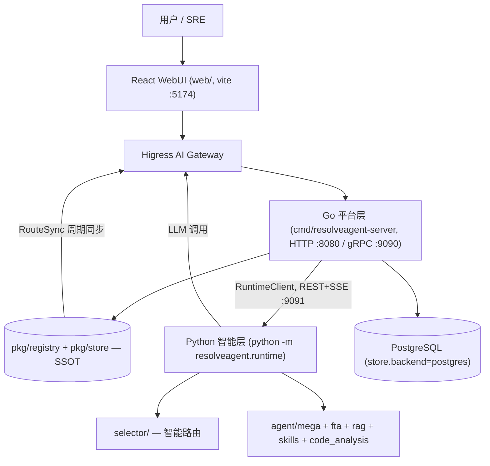
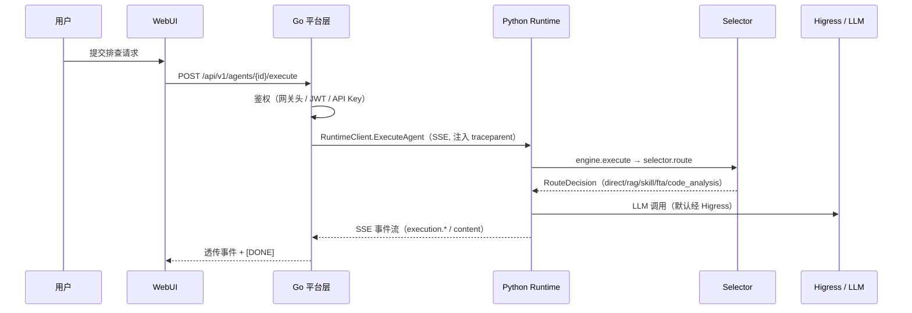

# ResolveAgent 系统总览 (System Overview)

> **一句话理解**：三层异构系统以 Go Registry 为唯一事实源——Go 管注册与网关、Python 管智能与执行、React 管界面。

## 职责

ResolveAgent 是面向问题解决的生产级 AIOps 智能体平台，自动化覆盖「告警 → 根因 → 修复」全生命周期：工单接入、意图路由、知识检索、故障树分析（FTA）、修复执行、反馈闭环 [README.md:71](README.md#L71)。

它要解决的核心问题是：**故障排查请求的求解路径不可预知**。同一条告警，有的该查知识库（RAG），有的该跑故障树（FTA），有的该执行技能，有的直接问大模型就够了。传统 AI 客服只有一条回答路径，ResolveAgent 把「分析请求 → 选最优引擎」做成了一等公民 [README.md:81-90](README.md#L81-L90)。Selector 用三阶段流水线（意图分析 → 上下文增强 → 路由决策）替代硬编码工作流 [selector/selector.py:103-111](python/src/resolveagent/selector/selector.py#L103-L111)，且失败不是死路：Resilient Selector 会把失败写回上下文，沿 Skill → RAG → FTA → Code Analysis 阶梯逐级降级重试 [selector/resilient_selector.py:4-9](python/src/resolveagent/selector/resilient_selector.py#L4-L9)。

每解决一个问题，结果沉淀回技能库、RAG 语料和记忆，形成「越用越准」的知识飞轮 [README.md:88](README.md#L88)。

## 设计原理

### 三层架构与语言切分

语言切分的动因记录在 ADR-001：单语言难以同时在「平台服务性能」「AI/ML 生态」「现代前端」三个维度最优，于是按层选语言——平台服务用 Go（高并发、云原生生态），Agent 运行时用 Python（AI/ML 库丰富），WebUI 用 TypeScript/React（React Flow 可视化）[docs-site/docs/adr/001-why-multilang.md:20-26](docs-site/docs/adr/001-why-multilang.md#L20-L26)。代价是跨语言通信复杂度，ADR-001 给出的缓解措施是 gRPC + protobuf [docs-site/docs/adr/001-why-multilang.md:64-69](docs-site/docs/adr/001-why-multilang.md#L64-L69)。

**现实与 ADR 有偏差**：跨语言边界最终落在了 HTTP/REST + SSE 上，gRPC 未兑现。三处证据交叉验证：① Go 侧 RuntimeClient 自述是「HTTP client」，SSE 手工解析 `data:` 行 [pkg/server/runtime_client.go:17](pkg/server/runtime_client.go#L17)、[pkg/server/runtime_client.go:122-138](pkg/server/runtime_client.go#L122-L138)；② Python 侧 RegistryClient 注释直言「 Originally designed for gRPC, but using HTTP/REST as a practical alternative until protobuf stubs are generated」[runtime/registry_client.py:7-8](python/src/resolveagent/runtime/registry_client.py#L7-L8)；③ Go gRPC Server 只注册了健康检查与 reflection，无任何业务服务 [pkg/server/server.go:99-106](pkg/server/server.go#L99-L106)。

网关选型记录在 ADR-002：对比 Higress/Kong/Envoy/自建后选 Higress，理由是 AI 场景原生（LLM 路由、Token 级限流、模型降级熔断）与 Wasm 扩展 [docs-site/docs/adr/002-gateway-choice.md:23-30](docs-site/docs/adr/002-gateway-choice.md#L23-L30)。集成模式定为两条：Route Sync（Go Registry → Higress）与 LLM Proxy（Python → Higress → 各模型厂商）[docs-site/docs/adr/002-gateway-choice.md:75-79](docs-site/docs/adr/002-gateway-choice.md#L75-L79)。Python 侧 LLM Provider 默认打向 Higress 网关地址 [llm/higress_provider.py:100](python/src/resolveagent/llm/higress_provider.py#L100)，同时保留 `RESOLVEAGENT_LLM_DIRECT=true` 直连旁路 [llm/higress_provider.py:426](python/src/resolveagent/llm/higress_provider.py#L426)。

### 全景架构



SSOT registry 是架构心脏：Go 侧 13 个 Registry 接口（agent/skill/workflow/rag/hook/fta/code_analysis/memory/solution/call_graph/traffic 等）统一由 `Server` 持有 [pkg/server/server.go:28-42](pkg/server/server.go#L28-L42)，按 `store.backend` 配置选择 PostgreSQL 或内存实现 [pkg/server/server.go:52-96](pkg/server/server.go#L52-L96)。RouteSync 把 Registry 中的平台/Agent/技能路由周期性同步到 Higress，自述为「Go Registry（唯一事实源）与 Higress 之间的桥」[pkg/gateway/route_sync.go:13-16](pkg/gateway/route_sync.go#L13-L16)。同步间隔等网关参数配置在 [configs/resolveagent.yaml:32-38](configs/resolveagent.yaml#L32-L38)（细节见 09/10/11 篇）。

## 关键决策

| 决策 | 结论 | 证据 |
|------|------|------|
| 按语言分层还是单语言 | 分层，代价用统一构建/容器化补偿 | [docs-site/docs/adr/001-why-multilang.md:50-69](docs-site/docs/adr/001-why-multilang.md#L50-L69) |
| 跨语言协议 | ADR 承诺 gRPC，实际落了 REST+SSE | [runtime/registry_client.py:7-8](python/src/resolveagent/runtime/registry_client.py#L7-L8)、[pkg/server/server.go:99-106](pkg/server/server.go#L99-L106) |
| 路由决策放在哪 | Python 侧 Selector 独立成包，Go 不参与智能决策，只透传 | [pkg/server/agent_handlers.go:140-148](pkg/server/agent_handlers.go#L140-L148) |
| 状态与配置的真相源 | Go Registry 是 SSOT，Python 只读查询 | [runtime/registry_client.py:1-5](python/src/resolveagent/runtime/registry_client.py#L1-L5) |
| 鉴权边界 | Higress 做外部认证，平台只验证转发头 | [pkg/server/middleware/auth.go:115-117](pkg/server/middleware/auth.go#L115-L117)、[configs/resolveagent.yaml:46-53](configs/resolveagent.yaml#L46-L53) |

鉴权这条值得展开：`AuthMiddleware` 的第一优先级是网关转发头 `X-Auth-User`（其次 JWT、API Key）[pkg/server/middleware/auth.go:114-132](pkg/server/middleware/auth.go#L114-L132)，API Key 比对用常数时间比较防时序攻击 [pkg/server/middleware/auth.go:271-274](pkg/server/middleware/auth.go#L271-L274)。

## 依赖

分层依赖方向（上层依赖下层，禁止反向）：

```text
web/src ──▶ Go 平台层 (pkg/server, pkg/registry, pkg/store, pkg/gateway)
Go 平台层 ──▶ Python 智能层 (runtime/, selector/, agent/, ...)
Python 智能层 ──▶ llm/, rag/, skills/, fta/, mcp/, code_analysis/, traffic/
所有层 ──▶ configs/ + 环境变量 (RESOLVEAGENT_ 前缀)
```

- Go 公共库：config（viper 加载）、errors、circuitbreaker、retry、telemetry、health、feedback、event [pkg/config/config.go:12-75](pkg/config/config.go#L12-L75)。
- Python 底层库：`memory.py` 三层记忆（Working/Episodic/Long-term）、`planning.py` REACTIVE+DELIBERATIVE 双模式规划、`toolhub.py` 工具注册与安全策略、`message_bus.py` Agent 间消息总线、`resilience.py` 熔断与降级 [memory.py:1-5](python/src/resolveagent/memory.py#L1-L5)、[planning.py:1-5](python/src/resolveagent/planning.py#L1-L5)、[toolhub.py:1](python/src/resolveagent/toolhub.py#L1)。
- TUI 运维界面独立在 `internal/tui`，不参与请求链路。

## 暴露接口

### 进程入口清单

| 入口 | 命令/位置 | 默认地址 |
|------|-----------|----------|
| Go 平台服务 | `cmd/resolveagent-server/main.go`：加载配置 → `server.New` → 双协议 `srv.Run` [cmd/resolveagent-server/main.go:22-30](cmd/resolveagent-server/main.go#L22-L30)、[pkg/server/server.go:124-156](pkg/server/server.go#L124-L156) | HTTP :8080，gRPC :9090 [pkg/config/config.go:16-17](pkg/config/config.go#L16-L17) |
| Go CLI | [cmd/resolveagent-cli/main.go:9](cmd/resolveagent-cli/main.go#L9) | — |
| Python 运行时 | `python -m resolveagent.runtime` [runtime/__main__.py:33](python/src/resolveagent/runtime/__main__.py#L33)，本地由 `start-local.sh` 以 `PYTHONPATH=src` 启动 [scripts/start-local.sh:376-378](scripts/start-local.sh#L376-L378) | 0.0.0.0:9091 [runtime/__main__.py:23-24](python/src/resolveagent/runtime/__main__.py#L23-L24) |
| WebUI | Vite + React，`createRoot` 挂载 [web/src/main.tsx:18-19](web/src/main.tsx#L18-L19) | dev 端口 5174 [web/vite.config.ts:29](web/vite.config.ts#L29) |

### HTTP 面

- Go 对外 `/api/v1/*`：agents（含 execute）、skills、workflows、rag、models、config、hooks、memory、solutions、call-graphs、traffic、corpus 共 12 组资源 [pkg/server/router.go:6-136](pkg/server/router.go#L6-L136)。
- Go → Python 内部 `/v1/*`：由 RuntimeClient 调用（agents execute、workflows execute、rag query/ingest、skills execute、corpus import、solutions sync/semantic-search）[pkg/server/runtime_client.go:81-153](pkg/server/runtime_client.go#L81-L153)。
- Python 运行时对内暴露：`/health` [runtime/http_server.py:199-201](python/src/resolveagent/runtime/http_server.py#L199-L201)、`/v1/agents/{id}/execute`（SSE）[runtime/http_server.py:204-235](python/src/resolveagent/runtime/http_server.py#L204-L235)、`/v1/selector/route`（可独立调试路由决策）[runtime/http_server.py:242-300](python/src/resolveagent/runtime/http_server.py#L242-L300)、workflow/rag/skill/corpus/code-analysis 等端点 [runtime/http_server.py:303-788](python/src/resolveagent/runtime/http_server.py#L303-L788)。FastAPI app 由单例工厂产出 [runtime/http_server.py:816-827](python/src/resolveagent/runtime/http_server.py#L816-L827)。

## 数据流

端到端关键路径（细节见 02-runtime.md）：



两个跨层机制需要知道：

1. **流式契约是 SSE + JSON 事件**。事件类型只有 `content`/`content_chunk`/`event`/`error` 四种 [pkg/server/runtime_client.go:47-53](pkg/server/runtime_client.go#L47-L53)，Go 侧收到 `execution.completed` 才标记完整 [pkg/server/agent_handlers.go:228-241](pkg/server/agent_handlers.go#L228-L241)。跨进程追踪靠 W3C traceparent 头注入 [pkg/server/runtime_client.go:72-78](pkg/server/runtime_client.go#L72-L78)。
2. **错误以事件内嵌而非 HTTP 状态码**。Python 侧把异常映射为 `INVALID_ARGUMENT/NOT_FOUND/TIMEOUT/...` 等错误码事件 [runtime/http_server.py:28-55](python/src/resolveagent/runtime/http_server.py#L28-L55)，Go 侧再用 `mapPythonErrorCode` 翻译成统一错误码 [pkg/server/error_mapping.go:9-31](pkg/server/error_mapping.go#L9-L31)。原因是 SSE 已返回 200，状态码无法再改（见 02-runtime.md 关键决策）。

## 配置体系

| 文件 | 读者 | 内容 |
|------|------|------|
| `configs/resolveagent.yaml` | Go 平台层（viper，按名搜索 `resolveagent`）[pkg/config/config.go:48-53](pkg/config/config.go#L48-L53) | HTTP/gRPC 地址、数据库、gateway 同步、store 后端（默认 postgres [configs/resolveagent.yaml:76](configs/resolveagent.yaml#L76)）、telemetry |
| `configs/runtime.yaml` | **无代码读取**（`grep runtime.yaml` 全仓无命中） | 声明性文档：agent_pool、selector 阈值、feedback_loop、circuit_breaker [configs/runtime.yaml:41-58](configs/runtime.yaml#L41-L58) |
| `configs/models.yaml` | **未接线**，文件头自述「declarative metadata only ... ModelRegistry consumption is not wired up yet」[configs/models.yaml:3-6](configs/models.yaml#L3-L6) | 模型清单（qwen/ernie/glm/moonshot） |

环境变量是实际生效的运行时配置通道，统一 `RESOLVEAGENT_` 前缀映射 [pkg/config/config.go:56-58](pkg/config/config.go#L56-L58)：运行时端口 `RESOLVEAGENT_RUNTIME_PORT` [runtime/__main__.py:23-24](python/src/resolveagent/runtime/__main__.py#L23-L24)、Selector 策略 `RESOLVEAGENT_SELECTOR_STRATEGY` [runtime/engine.py:50](python/src/resolveagent/runtime/engine.py#L50)、限流 `RESOLVEAGENT_RATE_LIMIT_RPM` [runtime/http_server.py:183-184](python/src/resolveagent/runtime/http_server.py#L183-L184)。敏感字段缺失只告警不阻断 [pkg/config/config.go:85-95](pkg/config/config.go#L85-L95)。

## 组件地图

| 模块 | 一句话职责 | 设计文档 |
|------|-----------|----------|
| python/src/resolveagent/selector/ | 意图分析 → 上下文增强 → 路由决策的三阶段智能路由 | [01-selector.md](01-selector.md) |
| python/src/resolveagent/runtime/ | ExecutionEngine 编排 + FastAPI 桥接 Go 平台层 | [02-runtime.md](02-runtime.md) |
| python/src/resolveagent/agent/ | MegaAgent：自带 Selector 的顶层编排者，分发到各子系统 | [02-runtime.md](02-runtime.md) |
| python/src/resolveagent/fta/ | 六门类型故障树、最小割集、蒙特卡洛仿真 | [03-fta.md](03-fta.md) |
| python/src/resolveagent/rag/ + corpus/ | 检索增强管道 + 外部语料摄取沉淀 | [04-rag-corpus.md](04-rag-corpus.md) |
| python/src/resolveagent/skills/ + hooks/ | 技能插件体系（沙箱限额）+ 执行前后置钩子 | [05-skills-hooks.md](05-skills-hooks.md) |
| memory.py / planning.py / toolhub.py | 三层记忆、双模式规划、工具注册 | [06-memory-planner-toolhub.md](06-memory-planner-toolhub.md) |
| code_analysis/ + traffic/ | AST 静态调用图 + 动态流量图分析 | [07-code-analysis.md](07-code-analysis.md) |
| mcp/ + llm/ | MCP 工具协议适配 + LLM Provider 抽象（Higress/直连） | [08-mcp-llm.md](08-mcp-llm.md) |
| pkg/server + cmd/ + internal/ | REST/gRPC 门面、中间件、TUI | [09-go-platform.md](09-go-platform.md) |
| pkg/registry + pkg/store | 13 类资源 SSOT 注册表 + 持久化 | [10-registry-store.md](10-registry-store.md) |
| pkg/gateway + pkg/config + configs/ | Higress 路由同步 + 配置加载 | [11-gateway-config.md](11-gateway-config.md) |
| resilience.py + pkg/circuitbreaker/retry/feedback | 熔断、重试、反馈闭环 | [12-resilience-feedback.md](12-resilience-feedback.md) |
| message_bus.py + pkg/event/telemetry/health | 消息总线 + OTel 可观测 + 健康探针 | [13-eventbus-observability.md](13-eventbus-observability.md) |
| docsync/ + integrations/ | 双语文档同步、Dify/LangGraph 集成 | [14-docsync-integrations.md](14-docsync-integrations.md) |
| web/src | React 控制台（stores/pages/hooks 分层） | [15-web-frontend.md](15-web-frontend.md) |

## 排查指南

- **症状**：平台启动即退出，日志 `Failed to load configuration` → **定位**：[cmd/resolveagent-server/main.go:24-28](cmd/resolveagent-server/main.go#L24-L28)；配置文件不存在会被容忍，但语法错误会致命 [pkg/config/config.go:61-65](pkg/config/config.go#L61-L65) → **修复**：校验 `configs/resolveagent.yaml` YAML 语法，或改用 `RESOLVEAGENT_*` 环境变量。
- **症状**：Python 执行返回 502 且 Go 日志出现 `unexpected status` → **定位**：RuntimeClient 只接受 200 [pkg/server/runtime_client.go:116-119](pkg/server/runtime_client.go#L116-L119)，多半是 Python 运行时没起来 → **修复**：确认 9091 端口与 `/health` [pkg/server/runtime_client.go:489-507](pkg/server/runtime_client.go#L489-L507)，查看 `logs/runtime.log`（start-local.sh 启动时会打印该路径）。
- **症状**：请求 401 Unauthorized → **定位**：鉴权失败统一 401 [pkg/server/middleware/auth.go:89-98](pkg/server/middleware/auth.go#L89-L98) → **修复**：确认流量是否经 Higress 转发（带 `X-Auth-User` 头则免 JWT），直连时改用 `Authorization: Bearer <JWT>` 或已注册 API Key。
- **症状**：LLM 调用全部失败/超时 → **定位**：`create_llm_provider` 按 `RESOLVEAGENT_LLM_DIRECT` 分流 [llm/higress_provider.py:409-426](python/src/resolveagent/llm/higress_provider.py#L409-L426)；网关模式目标地址来自 `HIGRESS_GATEWAY_URL`（默认 localhost:8888）[llm/higress_provider.py:100](python/src/resolveagent/llm/higress_provider.py#L100) → **修复**：确认 Higress 是否在跑；本地无网关时置 `RESOLVEAGENT_LLM_DIRECT=true` 并配 `LLM_BASE_URL`。
- **症状**：接口返回 429 → **定位**：Python 运行时内置内存滑动窗限流 [runtime/http_server.py:82-101](python/src/resolveagent/runtime/http_server.py#L82-L101) → **修复**：调大 `RESOLVEAGENT_RATE_LIMIT_RPM`（默认 60）。

## 已知坑

1. **`runtime.grpc_addr` 是死配置**：[configs/resolveagent.yaml:28-29](configs/resolveagent.yaml#L28-L29) 定义了它，types.go 也有 `RuntimeConfig` 结构 [pkg/config/types.go:71-73](pkg/config/types.go#L71-L73)，但全仓没有任何代码读 `cfg.Runtime`；RuntimeClient 实际读 `server.runtime_addr`，而 resolveagent.yaml 没写它，最终落到硬编码默认值 `localhost:9091` [pkg/server/runtime_client.go:25-29](pkg/server/runtime_client.go#L25-L29)。改 Python 地址要么加 `server.runtime_addr`，要么设 `RESOLVEAGENT_SERVER_RUNTIME_ADDR`。
2. **solutionRegistry 在 postgres 模式下仍是内存实现**：代码注释自述「remains in-memory until PostgreSQL implementation is added」[pkg/server/server.go:77-78](pkg/server/server.go#L77-L78)，重启即丢工单方案数据。
3. **runtime.yaml / models.yaml 是「 许愿配置」**：两者当前都无消费方（见配置体系一节），以为改了 `configs/runtime.yaml` 的 `circuit_breaker.failure_threshold` 就生效，实际不会 [configs/runtime.yaml:56-58](configs/runtime.yaml#L56-L58)。
4. **gRPC 承诺未兑现**：ADR-001 的缓解措施是 gRPC + protobuf [docs-site/docs/adr/001-why-multilang.md:66](docs-site/docs/adr/001-why-multilang.md#L66)，实际 `python/src/resolveagent/api` 只有生成的 stub 包 [api/__init__.py:1-3](python/src/resolveagent/api/__init__.py#L1-L3)，链路全走 REST。
5. **网关转发头未验签**：`X-Auth-User` 存在即信任 [pkg/server/middleware/auth.go:115-117](pkg/server/middleware/auth.go#L115-L117)、[pkg/server/middleware/auth.go:134-151](pkg/server/middleware/auth.go#L134-L151)。平台端口若绕过 Higress 直连，任何人可伪造身份。

> [!NOTE] 推测：网关头直信是「平台只部署在网关之后」的部署假设。依据：[configs/resolveagent.yaml:47-53](configs/resolveagent.yaml#L47-L53) 注释写明「Higress handles external auth, platform validates forwarded headers」，但代码层面没有共享密钥或来源校验来强制这一前提。

*Last updated: 2026-09-05*
